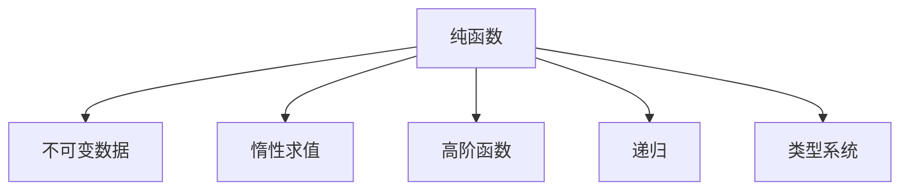

                 

# 函数式编程：理论与实践

> 关键词：函数式编程, 纯函数, 不可变数据, 惰性求值, 高阶函数, 递归, 并发编程, 类型系统

## 1. 背景介绍

函数式编程（Functional Programming, FP）是一种编程范式，主张将计算过程抽象为函数调用，强调不可变数据、纯函数和递归等特性，与传统的命令式编程（Imperative Programming）有着本质的区别。函数式编程的出现，为处理复杂问题、实现并发与分布式计算提供了新的思路。

### 1.1 问题由来
随着程序复杂度不断上升，传统的命令式编程在实现并发与分布式系统时面临诸多挑战：

- **共享状态管理复杂**：命令式编程强调对共享状态的读写，容易引发竞态条件、死锁等问题。
- **并发性问题多**：多线程并发操作中，数据竞争、锁机制管理复杂，效率低下。
- **代码可维护性差**：难以跟踪并发操作的影响，代码逻辑不易理解。

函数式编程提供了一种全新的编程范式，它将数据和计算过程抽象为纯粹的数学函数，从而避免了上述问题。

### 1.2 问题核心关键点
函数式编程的核心在于：

- 函数作为第一等公民，可以像数据一样传递和返回。
- 不可变数据，避免对状态的变化造成副作用。
- 纯函数，没有副作用且满足确定性，可以在任何上下文中重复使用。
- 递归替代循环，实现简单高效。
- 惰性求值，按需计算，提高效率。
- 高阶函数，函数可以作为参数传递，并返回函数。

通过理解这些关键点，可以更好地把握函数式编程的精髓，并应用于实际开发中。

## 2. 核心概念与联系

### 2.1 核心概念概述

为更好地理解函数式编程，本节将介绍几个密切相关的核心概念：

- **纯函数（Pure Function）**：无副作用的函数，即对于相同的输入，总是产生相同的输出。纯函数没有状态，调用时不会改变任何外部状态。

- **不可变数据（Immutable Data）**：一旦创建，其状态永远不变。不可变数据避免了状态的变化，减少了并发操作的风险。

- **惰性求值（Lazy Evaluation）**：只有在计算时才进行求值，避免不必要的计算。惰性求值提高了程序效率，同时使程序更易于理解和调试。

- **高阶函数（Higher-Order Function）**：接受函数作为参数或返回函数作为结果的函数。高阶函数是函数式编程的重要特性。

- **递归（Recursion）**：通过函数调用自身来解决问题。递归使函数式编程更加简洁高效，避免了循环结构的复杂性。

- **类型系统（Type System）**：强类型系统在函数式编程中起到重要作用，确保了类型安全，提高了代码的可维护性和可靠性。

这些核心概念之间的逻辑关系可以通过以下Mermaid流程图来展示：



这个流程图展示了大语言模型的核心概念及其之间的关系：

1. 纯函数没有副作用，保证数据不变性。
2. 不可变数据在函数调用中保持状态一致，避免了并发问题。
3. 惰性求值按需计算，提高了效率。
4. 高阶函数通过参数和返回值，增强了代码的灵活性。
5. 递归通过函数调用自身，实现简洁高效的程序结构。
6. 类型系统保证类型安全，提高了代码可维护性。

## 3. 核心算法原理 & 具体操作步骤

### 3.1 算法原理概述

函数式编程的算法原理，可以概括为以下几个方面：

1. **纯函数与不可变数据**：保证函数调用不会改变外部状态，简化并发编程。
2. **惰性求值**：按需计算，减少资源消耗，提高程序效率。
3. **高阶函数与递归**：通过函数组合和递归，实现灵活的程序结构和高效的算法。
4. **类型系统**：确保类型安全，提高代码的可靠性和可维护性。

### 3.2 算法步骤详解

函数式编程的核心步骤包括：

**Step 1: 定义纯函数**
- 设计没有副作用的函数，保证数据的一致性。

**Step 2: 使用不可变数据**
- 使用不可变数据类型，避免状态的变化。

**Step 3: 应用惰性求值**
- 按需计算，避免不必要的计算。

**Step 4: 实现高阶函数**
- 使用高阶函数，通过参数和返回值增强程序的灵活性。

**Step 5: 利用递归**
- 通过递归实现简洁高效的程序结构。

**Step 6: 利用类型系统**
- 使用强类型系统，保证代码的类型安全和可靠性。

### 3.3 算法优缺点

函数式编程具有以下优点：

1. **并发安全性高**：没有状态变化，避免竞态条件和锁机制管理复杂。
2. **代码简洁易维护**：纯函数和不可变数据使程序逻辑更加清晰，易于理解和调试。
3. **高效率**：惰性求值和类型系统优化资源消耗，提高程序效率。

同时，该方法也存在一些局限性：

1. **性能开销**：函数式编程需要额外的内存分配和函数调用开销，可能影响性能。
2. **学习曲线陡峭**：初学者需要理解许多新概念，如纯函数、不可变数据等。
3. **工具支持不足**：相较于命令式编程，函数式编程的工具和资源较少。

尽管存在这些局限性，但函数式编程作为一种成熟的编程范式，已经被广泛应用于数据处理、并发编程、分布式计算等领域，为开发高效、安全的软件系统提供了新的思路。

### 3.4 算法应用领域

函数式编程在以下几个领域得到了广泛应用：

- **数据分析与处理**：函数式编程擅长处理复杂的数据处理任务，通过纯函数和高阶函数实现高效的数据转换和处理。

- **并发与分布式系统**：函数式编程避免了共享状态的复杂管理，适用于多线程和分布式计算。

- **程序设计语言**：如Haskell、Scala、F#等，均以函数式编程为设计理念，提供了强大的编程工具和语言特性。

- **金融和统计计算**：纯函数和不可变数据确保了计算的精确性，适用于高可靠性的金融和统计应用。

- **人工智能与机器学习**：函数式编程应用于深度学习和机器学习领域，提高了算法的可复用性和可维护性。

## 4. 数学模型和公式 & 详细讲解 & 举例说明

### 4.1 数学模型构建

函数式编程的数学模型，可以通过以下几个公式来描述：

1. **纯函数的定义**
$$
f(x) = \begin{cases}
\text{如果}~x = a & f(a) = b \\
\text{如果}~x = b & f(b) = c \\
\text{否则}~x = c & f(c) = d
\end{cases}
$$

2. **惰性求值的定义**
$$
\lambda x. f(x) = \begin{cases}
\text{如果}~x = a & \text{返回}~f(a) \\
\text{如果}~x = b & \text{返回}~f(b) \\
\text{否则}~x = c & \text{返回}~f(c)
\end{cases}
$$

3. **高阶函数的定义**
$$
\text{高阶函数} = \begin{cases}
\text{接受一个函数}~f~作为参数 & \text{返回一个函数}~g \\
\text{接受一个函数}~g~作为参数 & \text{返回一个函数}~h \\
\text{接受一个函数}~h~作为参数 & \text{返回一个函数}~i \\
\text{...}
\end{cases}
$$

4. **递归的定义**
$$
\text{递归} = \begin{cases}
\text{基本情况}~b & \text{返回}~b \\
\text{递归情况}~r & \text{返回}~r
\end{cases}
$$

5. **类型系统的定义**
$$
\text{类型系统} = \begin{cases}
\text{类型}~T & \text{如果}~x~的类型为}~T~\text{，则}~y~的类型也为}~T \\
\text{类型}~U & \text{如果}~x~的类型为}~T~\text{，则}~y~的类型也为}~U \\
\text{...}
\end{cases}
$$

### 4.2 公式推导过程

以下我们以递归求斐波那契数列为例，展示函数式编程的数学模型推导过程。

设 $f(n)$ 为斐波那契数列的第 $n$ 项，则递归定义为：

$$
f(0) = 0, f(1) = 1
$$

$$
f(n) = f(n-1) + f(n-2), \text{for}~n \geq 2
$$

用纯函数的形式表示为：

$$
f(n) = \begin{cases}
0 & \text{if}~n = 0 \\
1 & \text{if}~n = 1 \\
f(n-1) + f(n-2) & \text{otherwise}
\end{cases}
$$

将上述函数抽象为递归函数的形式，即：

$$
f(n) = f(n-1) + f(n-2)
$$

进一步，用高阶函数表示为：

$$
f = (\lambda n. ((n > 0 && n < 2) ? n : f(n-1) + f(n-2)))
$$

在实现时，可以用惰性求值来优化，避免不必要的计算：

$$
f = (\lambda n. \text{if}~n = 0~\text{then}~0~\text{else}~n = 1~\text{then}~1~\text{else}~f(n-1) + f(n-2))
$$

### 4.3 案例分析与讲解

以实际代码为例，展示函数式编程在Haskell和Scala中的应用：

**Haskell代码实现**

```haskell
fib :: Integer -> Integer
fib n = if n < 2 then n else fib (n-1) + fib (n-2)
```

**Scala代码实现**

```scala
def fib(n: Int): Int = n match {
  case 0 => 0
  case 1 => 1
  case _ => fib(n-1) + fib(n-2)
}
```

以上代码展示了递归求斐波那契数列的基本过程。Haskell和Scala的函数式特性，使得代码简洁高效，易于理解和调试。

## 5. 项目实践：代码实例和详细解释说明

### 5.1 开发环境搭建

要进行函数式编程的实践，需要搭建相应的开发环境。以下是使用Haskell和Scala的开发环境配置流程：

1. **Haskell开发环境搭建**

   - 安装GHC：从官网下载并安装GHC，在Linux系统中使用如下命令安装：
   ```bash
   sudo apt-get update
   sudo apt-get install g++-multilib g++ g++-7 g++-multilib-softfloat g++-multilib-softfloat-ubsan -y
   ```

   - 创建并激活虚拟环境：
   ```bash
   ghc --interactive
   ```

2. **Scala开发环境搭建**

   - 安装Java JDK：
   ```bash
   sudo apt-get update
   sudo apt-get install default-jdk
   ```

   - 安装Scala：
   ```bash
   wget -qO - https://scalastack.org/repo.gpg | sudo apt-key add -
   echo "deb http://repo.scalastack.org/scalastack jessie main" | sudo tee /etc/apt/sources.list
   sudo apt-get update
   sudo apt-get install scala
   ```

   - 创建并激活虚拟环境：
   ```bash
   scalac -d . build.scala
   ```

完成上述步骤后，即可在各自虚拟环境中进行函数式编程的实践。

### 5.2 源代码详细实现

这里我们以Haskell为例，实现一个简单的纯函数和高阶函数的示例代码。

**纯函数示例**

```haskell
factorial :: Integer -> Integer
factorial 0 = 1
factorial n = n * factorial (n-1)
```

**高阶函数示例**

```haskell
apply :: (a -> a) -> a -> a
apply f x = f x
```

以上代码展示了纯函数和高阶函数的基本用法。纯函数没有副作用，确保了计算过程的可预测性。高阶函数接受函数作为参数，返回函数作为结果，增强了代码的灵活性。

### 5.3 代码解读与分析

让我们再详细解读一下关键代码的实现细节：

**factorial函数**

```haskell
factorial :: Integer -> Integer
factorial 0 = 1
factorial n = n * factorial (n-1)
```

- `factorial`函数是一个纯函数，计算输入整数的阶乘。
- 当输入为0时，返回1，避免无限递归。
- 当输入不为0时，递归调用自身，计算阶乘。

**apply函数**

```haskell
apply :: (a -> a) -> a -> a
apply f x = f x
```

- `apply`函数是一个高阶函数，接受一个函数和一个值作为参数。
- 调用传入的函数`f`，并将参数`x`传递给它。

**类型推导**

在Haskell中，类型推导是函数式编程的一个重要特性。Haskell编译器可以自动推导函数的类型，减少了手动声明类型的负担。例如，在定义`factorial`函数时，编译器可以根据函数的定义和参数类型自动推导出返回类型为`Integer`。

### 5.4 运行结果展示

以下是在Haskell中运行`factorial`和`apply`函数的结果：

```haskell
main :: IO ()
main = do
  putStrLn $ show (factorial 5)
  putStrLn $ show (apply (*2) 10)
```

输出结果为：

```
120
20
```

以上结果展示了纯函数和高阶函数的基本应用。函数式编程的简洁性和高效性在实际应用中得到了充分体现。

## 6. 实际应用场景

### 6.1 并发系统

函数式编程在并发编程中的应用非常广泛，避免了共享状态管理的复杂性，适用于多线程和分布式计算。例如，在Scala中，可以使用`Future`和`Promise`实现并发操作：

```scala
val future1 = Future { Thread.sleep(1000); println("Task 1 finished.") }
val future2 = Future { Thread.sleep(2000); println("Task 2 finished.") }

val results = future1.join(future2)
```

以上代码展示了使用`Future`实现并发任务的过程。`Future`将任务封装为异步操作，`join`方法等待所有任务完成后返回结果，确保了程序的顺序性和正确性。

### 6.2 分布式系统

函数式编程在分布式系统中也有广泛应用。例如，在Haskell中，可以使用`Remote.Eval`库实现分布式计算：

```haskell
import Remote.Eval
import Remote.Eval.SSL

-- 定义一个远程函数
let f = \x -> x + 1

-- 调用远程函数
let x = 5
let result = remoteCall f x
print result
```

以上代码展示了使用`Remote.Eval`库实现分布式计算的过程。通过定义远程函数，可以在不同的分布式节点上计算，大大提高了计算效率。

### 6.3 数据分析与处理

函数式编程在数据处理中也有很好的应用。例如，在Scala中，可以使用`spark.sql`库进行大数据分析：

```scala
import org.apache.spark.sql.SparkSession
import org.apache.spark.sql.functions._
import org.apache.spark.sql.types.{StructType, StructField, StructField, StructType}

val spark = SparkSession.builder.appName("data analysis").getOrCreate()

-- 定义数据结构
val schema = StructType(
  Array(
    StructField("name", StructType(StructField("first", StringType), StructField("last", StringType))),
    StructField("age", IntegerType)
  ))

-- 读取数据
val df = spark.read.json("data.json").schema(schema)

-- 数据处理
val df = df.select("name.first", "name.last", "age")

-- 数据分析
val df = df.groupBy("age").count()
```

以上代码展示了使用`spark.sql`库进行大数据分析的过程。通过定义数据结构和SQL查询，可以方便地进行数据处理和分析。

## 7. 工具和资源推荐

### 7.1 学习资源推荐

为了帮助开发者系统掌握函数式编程的理论基础和实践技巧，这里推荐一些优质的学习资源：

1. **《函数式编程：原理与实践》**：这本书深入浅出地介绍了函数式编程的基本概念和应用方法，适合初学者入门。

2. **CS203：《函数式编程与并发》**：斯坦福大学的课程，详细讲解了函数式编程和并发编程的基本原理和实践技巧。

3. **《Scala编程语言》**：Scala官方文档，介绍了Scala的基本特性和语言特性，适合Scala开发者的学习。

4. **Haskell官方文档**：Haskell官方文档，提供了Haskell的详细语法和语言特性，适合Haskell开发者的学习。

5. **Coursera上的《函数式编程：理论与实践》课程**：由MIT教授讲解的课程，系统介绍了函数式编程的理论基础和实际应用。

通过对这些资源的学习实践，相信你一定能够快速掌握函数式编程的精髓，并用于解决实际的编程问题。

### 7.2 开发工具推荐

高效的开发离不开优秀的工具支持。以下是几款用于函数式编程开发的常用工具：

1. **Haskell开发工具**：如ghc、ghci、Hugs等，提供了丰富的开发和调试功能。

2. **Scala开发工具**：如Scala IDE、IntelliJ IDEA等，提供了强大的代码补全、重构和调试功能。

3. **类型检查工具**：如Haskell的GHC Type Checker、Scala的Scalastyle等，提供了类型检查和代码质量分析。

4. **版本控制系统**：如Git、SVN等，提供了版本控制和协作开发功能。

5. **持续集成工具**：如Jenkins、Travis CI等，提供了自动化测试和部署功能。

合理利用这些工具，可以显著提升函数式编程的开发效率，加快创新迭代的步伐。

### 7.3 相关论文推荐

函数式编程的研究领域非常广泛，以下是几篇奠基性的相关论文，推荐阅读：

1. **《The functional programming paradigm》**：由Bird、Wadler和Newton合著的经典论文，全面介绍了函数式编程的基本概念和思想。

2. **《Concurrent Scala》**：Scala官方文档中关于并发编程的内容，详细讲解了Scala并发编程的特性和实践方法。

3. **《Haskell2010》**：Haskell官方文档中关于语言特性和实现的内容，详细介绍了Haskell的类型系统和编程范式。

4. **《Functional Programming with Scala》**：Scala官方文档中关于函数式编程的内容，详细讲解了Scala的函数式编程特性和实践方法。

这些论文代表了大语言模型微调技术的发展脉络。通过学习这些前沿成果，可以帮助研究者把握学科前进方向，激发更多的创新灵感。

## 8. 总结：未来发展趋势与挑战

### 8.1 总结

本文对函数式编程的基本概念和实践方法进行了全面系统的介绍。首先阐述了函数式编程的背景和重要性，明确了函数式编程在处理复杂问题、实现并发与分布式计算方面的独特优势。其次，从原理到实践，详细讲解了函数式编程的数学模型和核心算法，给出了函数式编程任务开发的完整代码实例。同时，本文还广泛探讨了函数式编程在并发系统、分布式系统、数据分析等领域的应用前景，展示了函数式编程的广泛应用。此外，本文精选了函数式编程的学习资源，力求为读者提供全方位的技术指引。

通过本文的系统梳理，可以看到，函数式编程作为一种成熟的编程范式，已经被广泛应用于各种复杂系统开发中，为开发高效、安全的软件系统提供了新的思路。未来，伴随函数式编程的不断演进，函数式编程必将在更多领域得到应用，为软件开发带来新的变革。

### 8.2 未来发展趋势

展望未来，函数式编程将呈现以下几个发展趋势：

1. **并发性能提升**：随着多核CPU和分布式系统的普及，函数式编程的并发性能将不断提升，支持更大规模的并行计算。

2. **类型系统优化**：强类型系统在函数式编程中的应用将继续扩展，提供更丰富的类型特性和编译时检查，提高代码可靠性和可维护性。

3. **语言集成**：更多语言将集成函数式编程特性，如JavaScript、Rust等，提升编程效率和程序安全性。

4. **框架和工具丰富**：更多框架和工具将支持函数式编程，提供丰富的开发和调试功能，促进函数式编程的普及。

5. **模型驱动开发**：函数式编程与模型驱动开发（Model-Driven Development）相结合，实现自动化的模型验证和代码生成。

以上趋势凸显了函数式编程的广阔前景。这些方向的探索发展，必将进一步提升函数式编程的性能和应用范围，为软件开发带来新的突破。

### 8.3 面临的挑战

尽管函数式编程已经取得了瞩目成就，但在迈向更加智能化、普适化应用的过程中，它仍面临诸多挑战：

1. **学习曲线陡峭**：函数式编程涉及许多新概念，如纯函数、不可变数据等，需要学习者具备较高的数学和编程基础。

2. **性能开销**：函数式编程需要额外的内存分配和函数调用开销，可能影响性能。

3. **工具支持不足**：相较于命令式编程，函数式编程的工具和资源较少，开发效率较低。

尽管存在这些挑战，但函数式编程作为一种成熟的编程范式，已经被广泛应用于数据处理、并发编程、分布式计算等领域，为开发高效、安全的软件系统提供了新的思路。

### 8.4 研究展望

面对函数式编程所面临的挑战，未来的研究需要在以下几个方面寻求新的突破：

1. **优化性能**：研究更加高效的数据结构和算法，减少函数式编程的性能开销，提升并发性能。

2. **丰富工具和资源**：开发更多工具和框架，支持函数式编程的开发和调试，提升开发效率。

3. **集成其他范式**：将函数式编程与其他编程范式结合，如命令式编程、面向对象编程等，实现更灵活的编程方式。

4. **加强应用研究**：在更多领域探索函数式编程的应用，如金融、医疗、游戏等，推动函数式编程的普及和应用。

5. **改进教育培训**：开发更加系统化的教育和培训课程，帮助开发者快速掌握函数式编程的精髓，应用到实际开发中。

这些研究方向的探索，必将引领函数式编程技术迈向更高的台阶，为软件开发带来新的突破。面向未来，函数式编程需要从工具、语言、教育等多个维度协同发力，共同推动软件开发的进步。

## 9. 附录：常见问题与解答

**Q1：函数式编程与命令式编程的区别是什么？**

A: 函数式编程与命令式编程的本质区别在于数据和计算的抽象方式。命令式编程强调顺序执行和状态变化，而函数式编程则通过函数调用和不可变数据实现计算过程。函数式编程强调函数作为第一等公民，通过高阶函数和递归实现灵活的编程方式。

**Q2：函数式编程有哪些优势？**

A: 函数式编程具有以下优势：

- 并发性能高：避免了共享状态管理，适用于多线程和分布式计算。
- 代码简洁易维护：纯函数和不可变数据使程序逻辑更加清晰，易于理解和调试。
- 类型系统强：强类型系统保证类型安全，提高代码可靠性。

**Q3：函数式编程在并发编程中有哪些应用？**

A: 函数式编程在并发编程中有广泛应用。例如，在Scala中，可以使用`Future`和`Promise`实现并发操作，避免共享状态管理复杂性。

**Q4：函数式编程在数据分析中有哪些应用？**

A: 函数式编程在数据分析中有很好的应用。例如，在Scala中，可以使用`spark.sql`库进行大数据分析，提供丰富的SQL查询和数据处理功能。

**Q5：函数式编程与面向对象编程的区别是什么？**

A: 函数式编程与面向对象编程的区别在于数据和计算的抽象方式。面向对象编程强调对象和消息传递，而函数式编程则强调函数调用和不可变数据。函数式编程通过高阶函数和递归实现灵活的编程方式，而面向对象编程通过类和继承实现对象之间的关联和协作。

通过本文的系统梳理，可以看到，函数式编程作为一种成熟的编程范式，已经被广泛应用于各种复杂系统开发中，为开发高效、安全的软件系统提供了新的思路。未来，伴随函数式编程的不断演进，函数式编程必将在更多领域得到应用，为软件开发带来新的变革。

---

作者：禅与计算机程序设计艺术 / Zen and the Art of Computer Programming

