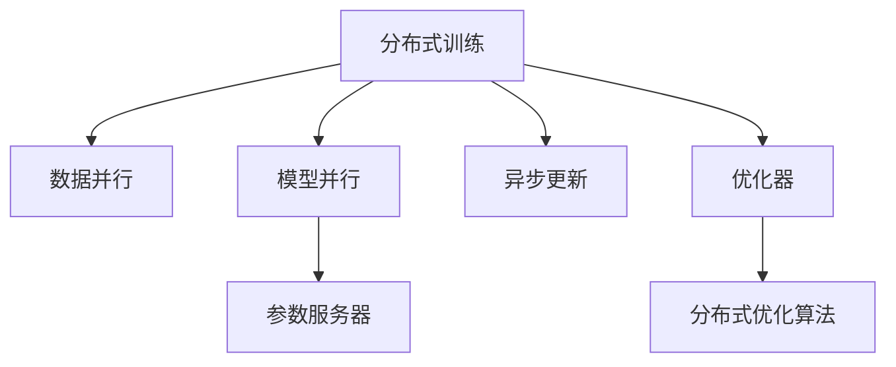

                 

# 分布式优化：扩展AI模型训练

> 关键词：分布式训练, 扩展AI模型, 分布式优化, 高性能计算, 分布式机器学习

## 1. 背景介绍

### 1.1 问题由来
随着深度学习技术的发展，大型AI模型在图像识别、自然语言处理、语音识别等领域取得了显著的进展。然而，这些模型往往需要巨大的计算资源和大量的数据进行训练，常规的单节点训练方式难以满足需求。为应对这一挑战，分布式训练成为了必要手段。通过将模型并行化，分布在多个计算节点上进行协同训练，可以显著提高训练效率，缩短模型训练周期。

### 1.2 问题核心关键点
分布式训练的核心在于如何将大规模模型分布在多个计算节点上进行高效协同训练。关键点包括：

- 通信开销的优化：节点间通信是分布式训练中主要开销之一，如何减少通信次数和数据传输量，提升通信效率。
- 数据并行和模型并行的设计：如何将模型划分为多个子模块，分别在各个节点上进行训练，同时确保模型整体的一致性。
- 优化算法的分布式实现：如何高效地实现分布式优化算法，如SGD、Adam等，同时保证训练收敛速度和精度。
- 系统容错和可靠性：如何在分布式系统中保证系统的容错性，处理节点故障，维护系统的稳定运行。

### 1.3 问题研究意义
分布式训练在大规模模型和计算密集型任务的训练中具有重要意义。通过分布式训练，可以显著提升模型训练效率，加速模型迭代速度，在竞争激烈的市场中抢占先机。同时，分布式训练也为边缘计算、智能硬件等新兴领域提供了强大的技术支撑，具有广阔的应用前景。

## 2. 核心概念与联系

### 2.1 核心概念概述

为更好地理解分布式AI模型训练的核心原理和架构，本节将介绍几个关键概念及其相互关系：

- **分布式训练(Distributed Training)**：通过将模型分布在多个计算节点上，并行化训练过程，加速模型收敛。
- **数据并行(Data Parallelism)**：将数据集划分为多个子集，每个节点负责训练其中一部分数据，最后合并模型参数。
- **模型并行(Model Parallelism)**：将模型分割成多个子模块，分别在多个节点上进行训练，适用于超大规模模型的训练。
- **参数服务器(Parameter Server)**：用于存储和同步模型的全局参数，负责模型参数的更新和分布。
- **异步更新(Asynchronous Update)**：允许节点独立更新模型参数，避免等待所有节点完成训练。
- **优化器(Soptimizer)**：用于更新模型参数的算法，如SGD、Adam、Adagrad等。
- **分布式优化算法(Distributed Optimization Algorithms)**：包括如SGD、AdamW等分布式优化算法，以及其变种如Ring AllReduce、Grad-Cut等。

这些概念之间的逻辑关系可以通过以下Mermaid流程图来展示：



这个流程图展示了大规模模型训练的基本框架，各组件通过协同工作，实现高效的分布式训练。

## 3. 核心算法原理 & 具体操作步骤
### 3.1 算法原理概述

分布式AI模型训练的核心思想是利用分布式计算资源的并行化能力，提高模型训练的效率。分布式训练过程中，各节点并行更新模型参数，通过优化器更新模型参数，从而逐步接近最优解。

假设一个深度神经网络模型 $M$ 的参数为 $\theta$，训练集为 $D=\{(x_i,y_i)\}_{i=1}^N$，其中 $x_i$ 为输入，$y_i$ 为标签。分布式训练过程可以描述为：

$$
\theta_{k+1} = \theta_k - \eta \sum_{m=1}^M \nabla_{\theta}L_k^m(\theta_k)
$$

其中 $\eta$ 为学习率，$L_k^m(\theta_k)$ 为第 $m$ 个节点在 $k$ 时刻的损失函数，$M$ 为节点数量。

### 3.2 算法步骤详解

分布式训练的典型步骤如下：

**Step 1: 模型划分**
- 将模型 $M$ 划分为 $M$ 个子模块，每个子模块由一个或多个计算节点负责训练。
- 每个节点维护一部分模型参数，通过网络通信与其它节点共享参数更新信息。

**Step 2: 数据划分**
- 将训练集 $D$ 划分为 $M$ 个子集，每个节点负责训练其中一部分数据。
- 节点间的数据划分应尽量均匀，避免节点间计算不均衡。

**Step 3: 初始化模型**
- 在每个节点上初始化一个与全局模型 $M$ 相同的本地模型 $M^m$。
- 参数初始化可以使用随机初始化或预训练初始化。

**Step 4: 分布式训练循环**
- 节点 $m$ 从本地数据集 $\{(x_i^m,y_i^m)\}_{i=1}^N^m$ 中随机采样数据。
- 在每个样本上计算损失函数 $L_k^m(\theta_k)$。
- 利用优化器更新本地模型参数 $M^m$。
- 节点间通过网络传输梯度信息，更新全局参数 $\theta_k$。

**Step 5: 参数同步与更新**
- 定期将本地模型的参数 $\theta^m_k$ 同步到参数服务器，更新全局参数 $\theta_k$。
- 同步方法可以使用Ring AllReduce或ReduceScatter等。

**Step 6: 训练结束条件**
- 当满足预设的迭代次数、收敛条件或达到提前停止标准时，训练结束。

### 3.3 算法优缺点

分布式AI模型训练具有以下优点：
1. 并行加速：多节点并行训练，可以显著加速模型收敛。
2. 高效率：适合大规模模型和数据集，缩短训练周期。
3. 灵活性：易于扩展，支持动态添加或删除节点。

同时，该方法也存在一些局限性：
1. 通信开销：节点间通信需要消耗额外的时间和带宽，对网络带宽要求较高。
2. 同步复杂度：参数同步操作增加了系统复杂度，可能会影响训练效率。
3. 收敛一致性：分布式优化算法需要满足一定的收敛条件，如一致性条件、平均一致性条件等。
4. 可扩展性：系统设计需要考虑硬件资源的配置和管理。

尽管存在这些局限性，但就目前而言，分布式训练是实现大规模模型训练的有效手段。未来相关研究将重点关注通信开销优化、更高效的分布式优化算法以及分布式训练系统的可扩展性。

### 3.4 算法应用领域

分布式AI模型训练已经在诸多领域得到广泛应用，涵盖计算机视觉、自然语言处理、语音识别等诸多领域。

- **计算机视觉**：大规模图像分类、物体检测、实例分割等任务，通过分布式训练可以显著加速模型训练。
- **自然语言处理**：机器翻译、情感分析、文本生成等任务，分布式训练在提升模型性能的同时，也加速了模型的迭代速度。
- **语音识别**：语音转文本、语音指令识别等任务，分布式训练可以在较短时间内训练出高质量的模型。
- **推荐系统**：商品推荐、内容推荐等任务，通过分布式训练可以处理大规模数据，提升推荐精度。

## 4. 数学模型和公式 & 详细讲解

### 4.1 数学模型构建

分布式训练的数学模型构建需要综合考虑模型划分、数据划分和优化算法等多个方面。

假设模型 $M$ 的参数为 $\theta$，训练集为 $D=\{(x_i,y_i)\}_{i=1}^N$，其中 $x_i$ 为输入，$y_i$ 为标签。分布式训练的目标是最大化全局损失函数：

$$
L(\theta) = \frac{1}{M}\sum_{m=1}^M \frac{1}{N^m}\sum_{i=1}^{N^m} L_k^m(x_i^m,y_i^m,\theta_k^m)
$$

其中 $L_k^m(x_i^m,y_i^m,\theta_k^m)$ 为节点 $m$ 在 $k$ 时刻对样本 $(x_i^m,y_i^m)$ 的损失函数。

假设优化器为 $S$，分布式训练的迭代过程为：

$$
\theta_{k+1} = \theta_k - \eta_k S_k(L_k^m(\theta_k^m))
$$

其中 $\eta_k$ 为学习率，$S_k$ 为优化器在 $k$ 时刻的更新步骤。

### 4.2 公式推导过程

以下我们将详细推导Ring AllReduce算法的基本原理，这是分布式训练中最常用的参数同步方法之一。

**Ring AllReduce算法**：

1. 所有节点将本地参数 $\theta_k^m$ 写入共享内存。
2. 节点 $m$ 将本地参数 $\theta_k^m$ 与前一个节点传来的参数 $\theta_k^{m-1}$ 进行异或操作。
3. 节点 $m$ 将本地参数 $\theta_k^m$ 与后一个节点传来的参数 $\theta_k^{m+1}$ 进行异或操作。
4. 重复步骤2和3，直到所有节点接收完参数。
5. 节点 $m$ 将更新后的参数 $\theta_k^{m+1}$ 存储回本地内存。

Ring AllReduce算法的数学推导如下：

假设节点 $m$ 的参数为 $\theta_k^m$，邻居节点的参数分别为 $\theta_k^{m-1}$ 和 $\theta_k^{m+1}$。则：

$$
\theta_{k+1}^m = \theta_k^m \oplus \theta_k^{m-1} \oplus \theta_k^{m+1}
$$

其中 $\oplus$ 为异或运算符。最终所有节点接收的参数更新结果为：

$$
\theta_k = \theta_k^1 \oplus \theta_k^2 \oplus ... \oplus \theta_k^M
$$

上述公式展示了Ring AllReduce算法的基本原理，通过异或操作实现全局参数的同步。

### 4.3 案例分析与讲解

**案例1: 分布式深度学习框架**
- **TensorFlow**：支持分布式训练的TensorFlow框架，包括数据并行和模型并行两种模式。
- **PyTorch**：提供DistributedDataParallel（DDP）模块，支持数据并行训练。
- **Horovod**：专为TensorFlow和Keras设计的分布式深度学习框架，支持多种优化器和多种同步方法。

**案例2: 分布式优化算法**
- **SGD**：经典的随机梯度下降算法，支持分布式优化。
- **Adam**：基于SGD的改进算法，支持分布式优化。
- **Ring AllReduce**：用于参数同步的Ring算法。

## 5. 项目实践：代码实例和详细解释说明
### 5.1 开发环境搭建

在进行分布式训练实践前，我们需要准备好开发环境。以下是使用Python进行PyTorch开发的环境配置流程：

1. 安装Anaconda：从官网下载并安装Anaconda，用于创建独立的Python环境。

2. 创建并激活虚拟环境：
```bash
conda create -n distributed-env python=3.8 
conda activate distributed-env
```

3. 安装PyTorch：根据CUDA版本，从官网获取对应的安装命令。例如：
```bash
conda install pytorch torchvision torchaudio cudatoolkit=11.1 -c pytorch -c conda-forge
```

4. 安装Horovod：
```bash
pip install horovod[torch]
```

5. 安装各类工具包：
```bash
pip install numpy pandas scikit-learn matplotlib tqdm jupyter notebook ipython
```

完成上述步骤后，即可在`distributed-env`环境中开始分布式训练实践。

### 5.2 源代码详细实现

下面我们以图像分类任务为例，给出使用PyTorch和Horovod进行分布式训练的PyTorch代码实现。

首先，定义模型和数据集：

```python
import torch
import torch.nn as nn
import torchvision
import torchvision.transforms as transforms
from torch.utils.data.distributed import DistributedSampler

# 定义模型
class Net(nn.Module):
    def __init__(self):
        super(Net, self).__init__()
        self.conv1 = nn.Conv2d(3, 6, 5)
        self.pool = nn.MaxPool2d(2, 2)
        self.conv2 = nn.Conv2d(6, 16, 5)
        self.fc1 = nn.Linear(16 * 5 * 5, 120)
        self.fc2 = nn.Linear(120, 84)
        self.fc3 = nn.Linear(84, 10)

    def forward(self, x):
        x = self.pool(torch.relu(self.conv1(x)))
        x = self.pool(torch.relu(self.conv2(x)))
        x = x.view(-1, 16 * 5 * 5)
        x = torch.relu(self.fc1(x))
        x = torch.relu(self.fc2(x))
        x = self.fc3(x)
        return x

# 定义数据集
transform = transforms.Compose(
    [transforms.ToTensor(),
     transforms.Normalize((0.5, 0.5, 0.5), (0.5, 0.5, 0.5))
])

trainset = torchvision.datasets.CIFAR10(root='./data', train=True,
                                        download=True, transform=transform)
trainloader = torch.utils.data.DataLoader(trainset, batch_size=4,
                                          shuffle=True, num_workers=2)

testset = torchvision.datasets.CIFAR10(root='./data', train=False,
                                       download=True, transform=transform)
testloader = torch.utils.data.DataLoader(testset, batch_size=4,
                                        shuffle=False, num_workers=2)
```

然后，定义分布式训练函数：

```python
import horovod.torch as hvd

# 初始化Horovod
hvd.init()

# 同步模型和数据分布
model = Net().to(device=hvd.local_rank())
if hvd.rank() == 0:
    model.load_state_dict(checkpoint['state_dict'])

# 数据加载器
distributed_sampler = DistributedSampler(trainset, num_replicas=hvd.size(),
                                        rank=hvd.rank())
trainloader = torch.utils.data.DataLoader(trainset, batch_size=64,
                                         shuffle=True, num_workers=4,
                                         sampler=distributed_sampler)

# 定义优化器
optimizer = torch.optim.Adam(model.parameters(), lr=0.001)

# 训练函数
def train(epoch):
    model.train()
    for batch_idx, (data, target) in enumerate(trainloader):
        data, target = data.to(device=hvd.local_rank()), target.to(device=hvd.local_rank())
        optimizer.zero_grad()
        output = model(data)
        loss = nn.CrossEntropyLoss()(output, target)
        loss.backward()
        optimizer.step()
        if batch_idx % 10 == 0:
            print('Train Epoch: {} [{}/{} ({:.0f}%)]\tLoss: {:.6f}'.format(
                epoch, batch_idx * len(data), len(trainloader.dataset),
                100. * batch_idx / len(trainloader), loss.item()))
```

最后，启动训练流程：

```python
# 开始分布式训练
train(epochs=10)
```

以上就是使用PyTorch和Horovod进行图像分类任务分布式训练的完整代码实现。可以看到，通过Horovod，我们可以方便地将PyTorch代码转换为分布式训练，适应不同规模的计算集群。

### 5.3 代码解读与分析

让我们再详细解读一下关键代码的实现细节：

**定义模型**：
- `Net`类定义了简单的卷积神经网络模型。

**定义数据集**：
- 使用`torchvision.datasets.CIFAR10`加载CIFAR-10数据集。
- 通过`transforms`模块定义数据预处理步骤。

**初始化Horovod**：
- 使用`hvd.init()`初始化Horovod，获取当前节点的id和全局节点数量。

**模型和数据同步**：
- 使用`hvd.local_rank()`获取当前节点的id，将其作为本地设备。
- 加载预训练模型参数到本地模型，以加速训练收敛。

**数据加载器**：
- 使用`DistributedSampler`对数据集进行分布式采样。
- 设置数据加载器的batch_size和num_workers，以提高效率。

**定义优化器**：
- 使用`Adam`优化器进行模型参数更新。

**训练函数**：
- 在每个epoch内，循环迭代训练数据。
- 每个batch中，将数据和目标变量移动到本地设备。
- 使用`zero_grad()`清空梯度，`backward()`更新参数，`step()`更新优化器状态。
- 打印训练过程中的损失信息。

可以看到，通过Horovod，我们可以方便地将PyTorch代码转换为分布式训练，适应不同规模的计算集群。同时，代码的实现也较为简洁，适合快速上手。

当然，工业级的系统实现还需考虑更多因素，如模型的保存和部署、超参数的自动搜索、更灵活的同步策略等。但核心的分布式训练范式基本与此类似。

## 6. 实际应用场景
### 6.1 智能推荐系统

智能推荐系统是分布式训练的重要应用场景之一。推荐系统需要处理海量用户行为数据，预测用户对特定物品的兴趣，并实时生成推荐结果。通过分布式训练，推荐系统可以高效地训练复杂模型，处理大规模数据集，提升推荐精度。

在实际应用中，推荐系统通常使用深度学习模型（如神经网络、卷积神经网络、循环神经网络等）对用户行为进行建模，并通过分布式训练加速模型迭代。具体来说，可以使用模型并行或数据并行的方式，将模型分布到多个节点上进行训练，同时使用优化的分布式优化算法，保证模型参数的一致性和收敛速度。

### 6.2 自然语言处理

自然语言处理（NLP）领域也广泛应用分布式训练技术。NLP任务通常需要处理大规模文本数据，进行语言建模、文本分类、情感分析等任务。分布式训练可以显著提升NLP任务的效率，缩短模型训练周期。

例如，在文本分类任务中，可以使用数据并行的方式，将训练集分配到多个节点上进行训练，同时使用优化的分布式优化算法，保证模型的收敛速度和精度。在模型并行方面，可以使用Transformer等模型，将模型分割为多个子模块，在多个节点上进行训练。

### 6.3 计算机视觉

计算机视觉领域也广泛应用分布式训练技术。例如，在图像分类、物体检测、实例分割等任务中，分布式训练可以显著加速模型训练，提升模型性能。

在图像分类任务中，可以使用数据并行的方式，将训练集分配到多个节点上进行训练，同时使用优化的分布式优化算法，保证模型的收敛速度和精度。在模型并行方面，可以使用卷积神经网络（CNN）等模型，将模型分割为多个子模块，在多个节点上进行训练。

## 7. 工具和资源推荐
### 7.1 学习资源推荐

为了帮助开发者系统掌握分布式AI模型训练的理论基础和实践技巧，这里推荐一些优质的学习资源：

1. 《深度学习》系列课程：斯坦福大学、Coursera等平台的深度学习课程，涵盖机器学习、分布式计算、深度学习等内容。
2. 《分布式深度学习》一书：深入浅出地介绍了分布式深度学习的基本概念和算法，是分布式训练学习的绝佳参考。
3. 《TensorFlow官方文档》：TensorFlow官方文档，提供丰富的分布式训练教程和示例代码。
4. 《Horovod官方文档》：Horovod官方文档，详细介绍Horovod的分布式训练功能和使用方法。
5. 《分布式机器学习实践》一书：实践导向的分布式机器学习书籍，涵盖各种分布式训练技术和工具的使用。

通过对这些资源的学习实践，相信你一定能够快速掌握分布式AI模型训练的精髓，并用于解决实际的AI问题。
###  7.2 开发工具推荐

高效的开发离不开优秀的工具支持。以下是几款用于分布式AI模型训练开发的常用工具：

1. TensorFlow：基于Google的分布式计算框架，支持多种分布式训练模式，适用于大规模模型训练。
2. PyTorch：Facebook开源的深度学习框架，支持多种分布式训练模式，适用于灵活性要求高的应用。
3. Horovod：专为TensorFlow和Keras设计的分布式深度学习框架，支持多种分布式优化算法和同步方法。
4. MPI：用于分布式计算的系统，适用于大规模集群训练。
5. Spark：Apache基金会开源的大数据计算框架，支持分布式训练和数据处理。

合理利用这些工具，可以显著提升分布式AI模型训练的开发效率，加快创新迭代的步伐。

### 7.3 相关论文推荐

分布式AI模型训练领域的研究已经取得了诸多进展。以下是几篇奠基性的相关论文，推荐阅读：

1. "Distributed Deep Learning" by Sumit Chopra: 详细介绍分布式深度学习的理论和实践。
2. "Horovod: Distributed Deep Learning for TensorFlow, Keras, and PyTorch" by Sylvain Gugger: 介绍Horovod的分布式深度学习框架及其应用。
3. "Large-Scale Distributed Deep Learning with Missing Features" by Miroslav Karpuk, Yanmin Qian, Kevin McGough: 研究分布式深度学习中缺失特征处理的方法。
4. "Data-Parallel Training of Deep Neural Networks on GPUs" by Edouard Duchesnay, Atabey Kaydan: 研究数据并行和模型并行的训练方法。
5. "Large-Scale Distributed Data-Parallel Training with Sharding and Motion" by Wei Wu, Yanbing Xia, Hanxiong Xu: 研究在大规模分布式系统中进行数据并行训练的策略。

这些论文代表了大规模分布式训练技术的发展脉络。通过学习这些前沿成果，可以帮助研究者把握学科前进方向，激发更多的创新灵感。

## 8. 总结：未来发展趋势与挑战
### 8.1 总结

本文对分布式AI模型训练进行了全面系统的介绍。首先阐述了分布式训练的背景和意义，明确了分布式训练在提高模型训练效率、加速模型迭代速度方面的独特价值。其次，从原理到实践，详细讲解了分布式训练的基本原理和操作步骤，给出了分布式训练任务开发的完整代码实例。同时，本文还广泛探讨了分布式训练方法在智能推荐系统、自然语言处理、计算机视觉等多个领域的应用前景，展示了分布式训练范式的巨大潜力。此外，本文精选了分布式训练技术的各类学习资源，力求为读者提供全方位的技术指引。

通过本文的系统梳理，可以看到，分布式训练技术在实现大规模模型训练、提升模型训练效率、加速模型迭代速度方面具有重要意义。未来，随着深度学习技术的发展，分布式训练将在大数据、高性能计算等领域的深入应用，带来新的突破和挑战。

### 8.2 未来发展趋势

展望未来，分布式AI模型训练将呈现以下几个发展趋势：

1. 硬件设备的不断发展。随着硬件设备的提升，分布式训练的计算效率和性能将进一步提升。
2. 分布式训练模式的创新。分布式训练将更加灵活，支持多种训练模式，如环形同步、异步更新等。
3. 分布式优化算法的优化。未来将涌现更多高效、鲁棒的分布式优化算法，支持更大规模的模型训练。
4. 自动调参技术的进步。自动调参技术的发展将提升分布式训练的效率，降低开发成本。
5. 跨平台分布式训练的普及。分布式训练将逐步跨平台，支持更多编程语言和框架。

以上趋势将进一步推动分布式AI模型训练技术的发展，为大规模模型训练和高性能计算提供新的思路和工具。

### 8.3 面临的挑战

尽管分布式AI模型训练取得了显著进展，但在实际应用中仍面临诸多挑战：

1. 通信开销：节点间通信开销较大，对网络带宽要求高。
2. 同步复杂度：分布式训练中的同步操作增加了系统复杂度。
3. 数据一致性：多节点训练中数据一致性难以保证，可能导致模型偏差。
4. 模型收敛性：分布式训练中可能存在模型收敛性问题。
5. 系统调优：分布式训练系统设计复杂，需要考虑更多因素，如节点管理、负载均衡等。

尽管存在这些挑战，但分布式AI模型训练技术仍具有广阔的应用前景。未来，相关研究将不断优化通信开销、同步算法、数据一致性等关键问题，提升分布式训练的效率和稳定性。

### 8.4 研究展望

未来，分布式AI模型训练技术将在以下几个方面进行探索：

1. 探索新的分布式训练算法。研发新的分布式训练算法，支持更大规模、更高效、更鲁棒的模型训练。
2. 研究自动调参技术。开发自动调参工具，提高分布式训练的效率，降低开发成本。
3. 探索跨平台分布式训练。开发跨平台分布式训练工具，支持更多编程语言和框架。
4. 研究分布式深度学习生态系统。构建更完善的分布式深度学习生态系统，提升系统性能和可扩展性。

这些研究方向将推动分布式AI模型训练技术的进一步发展，为人工智能技术在各领域的落地应用提供强大的技术支撑。

## 9. 附录：常见问题与解答
**Q1: 分布式训练与单节点训练有何区别？**

A: 分布式训练将模型并行化分布在多个节点上进行训练，可以显著提高模型训练速度和效率。而单节点训练仅在一个计算节点上进行，适用于小规模模型或数据集。

**Q2: 如何选择合适的分布式训练模式？**

A: 选择合适的分布式训练模式需要考虑模型规模、数据规模、硬件资源等因素。通常数据并行适用于大规模数据集，模型并行适用于大规模模型。环形同步适用于简单的模型，异步更新适用于复杂的模型。

**Q3: 分布式训练中如何保证数据一致性？**

A: 通过使用同步机制（如Ring AllReduce、AllReduce等），可以保证各节点间的参数一致性。同时，通过使用分布式数据缓存，可以保证数据的一致性。

**Q4: 分布式训练中的学习率如何调整？**

A: 分布式训练中的学习率调整通常需要考虑节点间的通信开销和同步复杂度。一般建议使用较小的学习率，并结合优化器（如Adam、SGD等）进行动态调整。

**Q5: 分布式训练中的内存管理如何优化？**

A: 分布式训练中需要考虑内存管理，可以使用分布式内存管理技术（如Unified Memory），优化内存使用，减少内存交换开销。

以上是分布式训练的核心概念和实现方法，通过对这些知识的学习，相信你一定能够掌握分布式训练的精髓，并用于解决实际的AI问题。

---

作者：禅与计算机程序设计艺术 / Zen and the Art of Computer Programming

