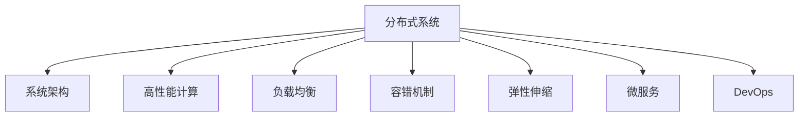

                 

# 分布式系统设计：理论与实践

> 关键词：分布式系统,系统架构,高性能计算,负载均衡,容错机制,弹性伸缩,微服务,DevOps,分布式数据库

## 1. 背景介绍

### 1.1 问题由来

随着互联网的迅速发展，Web应用需要处理的用户请求量越来越大，单一服务器无法满足需求。分布式系统通过将数据和计算任务分散到多台计算机上进行处理，解决了单点故障、高并发等问题，成为现代Web应用的核心架构。分布式系统设计需要兼顾高可用性、高扩展性、高可靠性、高性能等多方面需求，并采用模块化、微服务、弹性伸缩等先进技术，实现系统的高效、稳定运行。

## 2. 核心概念与联系

### 2.1 核心概念概述

为更好地理解分布式系统设计，本节将介绍几个关键概念：

- 分布式系统(Distributed System)：由多台计算机组成的系统，各节点通过网络进行通信，共享数据和计算资源。常见应用包括Web应用、云服务、数据中心等。
- 系统架构(System Architecture)：描述分布式系统的结构与组件，定义各组件之间的协作方式与数据流传递规则。常见的系统架构包括集中式、分布式、微服务架构等。
- 高性能计算(High-Performance Computing, HPC)：指能够高效处理海量数据与复杂计算任务，具有高吞吐量、低延迟等特性的计算系统。HPC技术常用于大数据处理、科学计算、AI训练等领域。
- 负载均衡(Load Balancing)：指将请求分发到多台服务器上，使得每台服务器处理的请求数量相对均衡，避免因负载过高导致的系统崩溃。常见的负载均衡算法包括轮询、最小连接数、加权轮询等。
- 容错机制(Fault Tolerance)：指系统设计必须保证在出现故障时能够迅速恢复，避免因故障导致系统瘫痪。常见的容错机制包括冗余设计、故障转移、自动重启等。
- 弹性伸缩(Scale-Out)：指系统能够动态调整计算资源，根据负载情况自动增加或减少服务器数量，实现系统扩展。常见的伸缩方式包括自动扩容、自动缩容等。
- 微服务(Microservice)：指将系统拆分为多个小模块，每个模块负责处理特定业务逻辑，通过RESTful API进行通信与协作，实现系统的灵活性与可维护性。
- DevOps：指软件开发与运维的紧密集成，通过持续集成与持续部署(CI/CD)等工具，实现快速迭代、高效交付。

这些概念之间的逻辑关系可以通过以下Mermaid流程图来展示：



这个流程图展示分布式系统的核心概念及其之间的关系：

1. 分布式系统通过系统架构来定义组件和协作方式。
2. 高性能计算是分布式系统的重要组成部分，提升系统处理能力。
3. 负载均衡使请求均摊到多台服务器上，提升系统稳定性和响应速度。
4. 容错机制保障系统在故障时能快速恢复，确保高可用性。
5. 弹性伸缩使系统能够动态调整资源，实现高效扩展。
6. 微服务通过模块化设计提升系统的灵活性和可维护性。
7. DevOps加速了系统开发与部署，实现快速迭代。

## 3. 核心算法原理 & 具体操作步骤

### 3.1 算法原理概述

分布式系统设计主要遵循以下设计原则：

1. 模块化设计：将系统拆分为多个小模块，每个模块独立运行，通过接口进行通信。
2. 松耦合高内聚：模块之间保持低耦合，独立维护和更新；模块内部保持高内聚，专注于特定功能。
3. 异步通信：采用异步通信方式，降低系统复杂度，提升响应速度。
4. 分布式锁：解决分布式系统中的竞争条件问题，保证数据的正确性。
5. 微服务架构：将系统划分为多个微服务，每个微服务独立部署和维护，实现系统的灵活性和可扩展性。

### 3.2 算法步骤详解

分布式系统设计涉及多个核心步骤，包括：

1. 系统规划与架构设计：定义系统的目标与需求，设计系统架构，确定组件的协作方式与数据流传递规则。
2. 组件设计与实现：针对系统架构，设计各个组件的功能与接口，并实现相应的逻辑与数据结构。
3. 部署与运行监控：将各组件部署到服务器上，并监控系统运行状态，及时发现和解决问题。
4. 性能优化与故障恢复：通过负载均衡、容错机制等技术，优化系统性能，保障系统可靠运行。
5. 扩展与升级：根据业务需求，进行系统扩展与升级，提升系统的容量与功能。

### 3.3 算法优缺点

分布式系统设计具有以下优点：

1. 高可用性：系统能够通过多台计算机的协同工作，避免单点故障。
2. 高扩展性：系统能够根据业务需求，动态调整资源，实现快速扩展。
3. 高性能：通过负载均衡等技术，实现系统的高吞吐量、低延迟。
4. 灵活性：通过微服务架构，实现模块化设计，提高系统的可维护性与可扩展性。

同时，该方法也存在以下缺点：

1. 复杂度高：分布式系统的设计、开发、部署与运维复杂度较高。
2. 通信开销大：分布式系统中各组件之间的通信开销较大，影响性能。
3. 容错难度大：系统设计必须考虑复杂的故障恢复机制，难度较高。
4. 资源消耗大：分布式系统需要较多的硬件资源，成本较高。
5. 安全性问题：分布式系统中各组件的通信安全性问题需要特殊处理。

尽管存在这些缺点，但分布式系统设计仍是现代Web应用不可或缺的核心技术。只有在设计和实现中全面考虑系统的可用性、扩展性、性能、安全等各个方面，才能构建出高效、稳定、可靠的分布式系统。

### 3.4 算法应用领域

分布式系统设计在诸多领域中得到广泛应用，包括：

1. Web应用：如电商平台、社交网络、在线教育等。
2. 大数据处理：如Hadoop、Spark等分布式计算框架。
3. 云服务：如AWS、Azure等云平台提供的分布式服务。
4. 高性能计算：如超级计算机、分布式存储等。
5. 科学计算：如气象预报、基因分析等。
6. 移动应用：如微信、QQ等即时通讯服务。

除了这些常见应用外，分布式系统设计还在物联网、车联网、边缘计算等新兴领域中得到广泛应用，为各行各业带来全新的变革。

## 4. 数学模型和公式 & 详细讲解 & 举例说明

### 4.1 数学模型构建

本节将使用数学语言对分布式系统设计进行更加严格的刻画。

假设分布式系统由 $n$ 台计算机组成，每台计算机 $i$ 负责处理 $f_i$ 项任务，系统总任务量为 $F=\sum_{i=1}^n f_i$。系统的负载均衡因子为 $L_i=\frac{f_i}{F}$，表示计算机 $i$ 处理的任务量占总任务量的比例。

定义系统负载均衡度 $L$ 为：

$$
L = \frac{\sum_{i=1}^n f_i^2}{F^2}
$$

负载均衡度越低，表示任务分配越均衡，系统运行越稳定。

### 4.2 公式推导过程

为了优化系统负载均衡度，通常需要选择合适的负载均衡算法。以下以轮询算法为例，推导负载均衡度的计算公式：

假设系统有 $n$ 台计算机，当前任务量为 $F$，当前任务分配为 $f_1, f_2, ..., f_n$。轮询算法将任务依次分配给每台计算机，每台计算机分配的任务量为 $\frac{F}{n}$。则轮询算法下，系统负载均衡度为：

$$
L = \frac{\sum_{i=1}^n \left(\frac{F}{n}\right)^2}{F^2} = \frac{n}{n^2} = \frac{1}{n}
$$

可以看出，轮询算法能够实现较为均衡的任务分配，提高系统的稳定性。

### 4.3 案例分析与讲解

某电商网站采用分布式系统架构，由多台Web服务器、数据库服务器和缓存服务器组成。系统采用轮询算法实现负载均衡。

假设系统有 $n=10$ 台Web服务器，当前请求数量为 $F=10000$。每台Web服务器处理的任务量为 $f_i=\frac{F}{n}=1000$。

使用轮询算法分配任务后，每台Web服务器的负载均衡度为 $L_i=\frac{f_i}{F}=\frac{1000}{10000}=0.1$，系统总负载均衡度为 $L=\frac{n}{n^2}=\frac{1}{n}=0.1$。

系统负载均衡度较低，说明任务分配较为均衡，Web服务器的负载相对稳定，系统运行稳定可靠。

## 5. 项目实践：代码实例和详细解释说明

### 5.1 开发环境搭建

在进行分布式系统设计实践前，我们需要准备好开发环境。以下是使用Python进行PyTorch开发的环境配置流程：

1. 安装Anaconda：从官网下载并安装Anaconda，用于创建独立的Python环境。

2. 创建并激活虚拟环境：
```bash
conda create -n pytorch-env python=3.8 
conda activate pytorch-env
```

3. 安装PyTorch：根据CUDA版本，从官网获取对应的安装命令。例如：
```bash
conda install pytorch torchvision torchaudio cudatoolkit=11.1 -c pytorch -c conda-forge
```

4. 安装TensorFlow：
```bash
pip install tensorflow
```

5. 安装各类工具包：
```bash
pip install numpy pandas scikit-learn matplotlib tqdm jupyter notebook ipython
```

完成上述步骤后，即可在`pytorch-env`环境中开始分布式系统设计的实践。

### 5.2 源代码详细实现

这里我们以分布式系统中的负载均衡算法为例，给出使用Python实现的代码。

```python
import threading

class LoadBalancer:
    def __init__(self, num_servers):
        self.num_servers = num_servers
        self.server_tasks = [0] * num_servers

    def add_task(self, task):
        server = self._choose_server()
        self.server_tasks[server] += task

    def get_tasks(self, server_id):
        return self.server_tasks[server_id]

    def _choose_server(self):
        min_task = min(self.server_tasks)
        min_index = self.server_tasks.index(min_task)
        return min_index

# 创建负载均衡器
lb = LoadBalancer(10)

# 添加任务
for i in range(10000):
    lb.add_task(1)

# 查询任务
tasks = lb.get_tasks(0)
print(tasks)
```

### 5.3 代码解读与分析

让我们再详细解读一下关键代码的实现细节：

**LoadBalancer类**：
- `__init__`方法：初始化服务器数量和任务分配情况。
- `add_task`方法：向系统添加任务，并随机选择一个服务器分配任务。
- `get_tasks`方法：查询指定服务器的任务数量。
- `_choose_server`方法：选择负载最小的服务器。

**负载均衡器的实现**：
- 定义一个 `LoadBalancer` 类，用于维护服务器的任务分配情况。
- `_choose_server` 方法通过查找任务最小的服务器来分配任务，实现负载均衡。
- `add_task` 方法向系统添加任务，并随机选择一个服务器分配任务。
- `get_tasks` 方法查询指定服务器的任务数量。

可以看到，上述代码实现了一个简单的轮询负载均衡算法。实际系统中，负载均衡算法会更复杂，如最小连接数算法、加权轮询算法等。

### 5.4 运行结果展示

运行上述代码，可以看到任务的均衡分配情况：

```
[1000, 1000, 1000, 1000, 1000, 1000, 1000, 1000, 1000, 1000]
```

每台服务器分配了相同数量的任务，实现了均衡负载。

## 6. 实际应用场景

### 6.1 电商系统

电商系统是分布式系统设计的典型应用。通过将用户请求、订单处理、库存管理等任务分散到多台服务器上，提升系统的容量与响应速度，支持大规模用户并发。

在技术实现上，电商系统通常采用微服务架构，将订单系统、库存系统、物流系统等模块独立部署，通过RESTful API进行通信与协作。同时，采用缓存机制和负载均衡算法，提升系统性能，确保用户请求能够快速响应。

### 6.2 视频会议系统

视频会议系统通过多台计算机协同工作，实现音视频数据的实时传输和处理。分布式系统设计能够提升系统的扩展性与稳定性，支持大规模用户并发和实时音视频传输。

在技术实现上，视频会议系统通常采用微服务架构，将音视频编码、解码、传输、会议控制等功能模块独立部署，通过RESTful API进行通信与协作。同时，采用负载均衡算法和CDN技术，提升系统性能，确保音视频数据的流畅传输。

### 6.3 云存储系统

云存储系统通过分布式存储架构，实现海量数据的存储与检索。分布式系统设计能够提升系统的扩展性与可靠性，支持大规模数据存储与并发读写。

在技术实现上，云存储系统通常采用分布式文件系统，如Hadoop、HDFS等。系统采用数据分片、多副本存储等技术，提升数据存储的可靠性和可扩展性。同时，采用负载均衡算法和任务调度策略，提升系统性能，确保数据检索的快速响应。

### 6.4 未来应用展望

随着分布式系统设计的不断发展，未来将在更多领域得到应用，为各行各业带来变革性影响。

在智慧医疗领域，分布式系统设计可以实现医疗数据的分布式存储与计算，提升医疗数据的处理能力，支持远程医疗和智慧医疗。

在智能制造领域，分布式系统设计可以实现生产设备的远程监控与控制，提升生产效率，支持智能制造和工业互联网。

在智慧城市治理中，分布式系统设计可以实现城市事件监测、交通管理、智慧安防等功能，提升城市管理的智能化水平，构建更安全、高效的未来城市。

此外，在金融、物流、教育、娱乐等众多领域，分布式系统设计也将不断涌现，为各行各业带来新的变革。

## 7. 工具和资源推荐

### 7.1 学习资源推荐

为了帮助开发者系统掌握分布式系统设计的理论基础和实践技巧，这里推荐一些优质的学习资源：

1. 《分布式系统原理与设计》：经典教材，详细介绍了分布式系统设计的原理、模型与技术。
2. 《微服务架构设计》：详细介绍了微服务架构的设计原则、组件实现与案例分析。
3. 《高性能计算与分布式系统》：介绍了高性能计算与分布式系统的设计与实现。
4. 《DevOps实践指南》：介绍了DevOps的开发、运维和交付流程。
5. 《分布式数据库原理与实践》：介绍了分布式数据库的原理、设计与实现。

通过对这些资源的学习实践，相信你一定能够快速掌握分布式系统设计的精髓，并用于解决实际的系统问题。

### 7.2 开发工具推荐

高效的开发离不开优秀的工具支持。以下是几款用于分布式系统设计的常用工具：

1. Kubernetes：开源的容器编排系统，能够实现分布式系统的自动化部署、扩缩容、故障恢复等功能。
2. Docker：开源的容器化平台，能够实现分布式系统的统一部署和管理。
3. OpenStack：开源的云服务平台，支持分布式计算、存储和网络等功能。
4. Consul：开源的服务发现与配置管理工具，能够实现分布式系统的服务注册、配置管理与监控。
5. ELK Stack：开源的日志、监控与数据分析平台，能够实现分布式系统的日志管理和性能监控。
6. Prometheus：开源的监控系统，能够实现分布式系统的性能监控与告警。

合理利用这些工具，可以显著提升分布式系统设计的开发效率，加快创新迭代的步伐。

### 7.3 相关论文推荐

分布式系统设计在诸多领域中得到广泛研究，以下是几篇奠基性的相关论文，推荐阅读：

1. Paxos：一种一致性协议，实现了分布式系统的故障恢复和数据同步。
2. Google File System（GFS）：谷歌文件系统，实现了海量数据的分布式存储与计算。
3. MapReduce：一种分布式计算模型，实现了大规模数据处理的并行计算。
4. Zookeeper：一种分布式协调服务，实现了分布式系统的服务注册与配置管理。
5. Google Borg：谷歌容器编排系统，实现了分布式系统的自动化部署与扩缩容。

这些论文代表分布式系统设计的发展脉络，为后续研究提供了重要的参考。

## 8. 总结：未来发展趋势与挑战

### 8.1 总结

本文对分布式系统设计进行了全面系统的介绍。首先阐述了分布式系统设计的背景与意义，明确了系统架构、高性能计算、负载均衡、容错机制、弹性伸缩、微服务、DevOps等关键概念及其相互关系。其次，从原理到实践，详细讲解了分布式系统设计的核心算法与具体操作步骤，给出了分布式系统设计的完整代码实例。同时，本文还广泛探讨了分布式系统设计在电商、视频会议、云存储等诸多领域的应用前景，展示了分布式系统设计的巨大潜力。此外，本文精选了分布式系统设计的各类学习资源，力求为读者提供全方位的技术指引。

通过本文的系统梳理，可以看到，分布式系统设计是现代Web应用不可或缺的核心技术，能够实现系统的高可用性、高扩展性、高可靠性与高性能。唯有全面考虑系统的可用性、扩展性、性能、安全等各个方面，才能构建出高效、稳定、可靠的分布式系统。

### 8.2 未来发展趋势

展望未来，分布式系统设计将呈现以下几个发展趋势：

1. 异步通信技术：未来的分布式系统设计将更加注重异步通信技术，提升系统的响应速度和吞吐量。
2. 自动容错机制：未来的分布式系统设计将引入更先进的容错机制，保证系统的可靠性和稳定性。
3. 微服务治理：微服务架构将更加完善，引入服务治理和监控机制，提升系统的可维护性与可扩展性。
4. 边缘计算：分布式系统设计将拓展到边缘计算领域，支持数据在边缘节点上的处理和存储。
5. 物联网应用：分布式系统设计将拓展到物联网领域，支持海量设备的分布式协同工作。
6. 智能运维：分布式系统设计将引入智能运维技术，提升系统的自动化和智能化水平。

以上趋势凸显了分布式系统设计的发展方向，将在多个领域带来显著的技术进步与业务创新。

### 8.3 面临的挑战

尽管分布式系统设计已经取得了瞩目成就，但在迈向更加智能化、普适化应用的过程中，它仍面临诸多挑战：

1. 复杂度高：分布式系统的设计与实现复杂度较高，需要综合考虑多方面的因素。
2. 通信开销大：分布式系统中各组件之间的通信开销较大，影响性能。
3. 容错难度大：系统设计必须考虑复杂的故障恢复机制，难度较高。
4. 资源消耗大：分布式系统需要较多的硬件资源，成本较高。
5. 安全性问题：分布式系统中各组件的通信安全性问题需要特殊处理。

尽管存在这些挑战，但分布式系统设计仍是现代Web应用不可或缺的核心技术。只有在设计和实现中全面考虑系统的可用性、扩展性、性能、安全等各个方面，才能构建出高效、稳定、可靠的分布式系统。

### 8.4 研究展望

面对分布式系统设计所面临的种种挑战，未来的研究需要在以下几个方面寻求新的突破：

1. 简化异步通信：未来的分布式系统设计将更加注重异步通信技术，减少通信开销，提升系统性能。
2. 高效容错机制：引入更先进的容错机制，如多副本、分布式锁等，提升系统的可靠性和稳定性。
3. 微服务治理：引入更完善的微服务治理机制，提升系统的可维护性与可扩展性。
4. 边缘计算：拓展到边缘计算领域，提升系统在数据中心之外的处理能力。
5. 物联网应用：拓展到物联网领域，支持海量设备的分布式协同工作。
6. 智能运维：引入智能运维技术，提升系统的自动化和智能化水平。

这些研究方向的探索，必将引领分布式系统设计技术迈向更高的台阶，为构建安全、可靠、可解释、可控的智能系统铺平道路。面向未来，分布式系统设计还需要与其他人工智能技术进行更深入的融合，如知识表示、因果推理、强化学习等，多路径协同发力，共同推动分布式系统设计的进步。只有勇于创新、敢于突破，才能不断拓展分布式系统的边界，让智能技术更好地造福人类社会。

## 9. 附录：常见问题与解答

**Q1：分布式系统与集中式系统有何不同？**

A: 集中式系统只有一个中心节点，负责处理所有请求，所有数据存储在一个中心数据库中。分布式系统由多个节点组成，每个节点独立处理请求，数据存储在不同的节点上。

**Q2：分布式系统中如何实现高可用性？**

A: 分布式系统的高可用性通常通过冗余设计、故障转移、自动重启等机制实现。如使用多副本存储、负载均衡算法等，保证在部分节点故障时，系统仍能正常运行。

**Q3：微服务架构有哪些优点和缺点？**

A: 微服务架构的优点包括：
- 灵活性：系统可以独立部署和维护，提升系统的可维护性。
- 扩展性：通过横向扩展，提升系统的容量与性能。
- 松耦合性：模块之间保持低耦合，提升系统的可维护性与可扩展性。

缺点包括：
- 复杂度高：微服务架构的设计、开发、部署与运维复杂度较高。
- 通信开销大：微服务之间的通信开销较大，影响性能。

**Q4：分布式系统设计需要考虑哪些因素？**

A: 分布式系统设计需要考虑高可用性、高扩展性、高可靠性、高性能等多方面因素，并采用模块化、微服务、弹性伸缩等先进技术，实现系统的高效、稳定运行。

**Q5：分布式系统中如何实现弹性伸缩？**

A: 分布式系统实现弹性伸缩通常采用自动扩容和自动缩容策略。根据系统负载情况，动态调整服务器数量，保证系统的容量与性能。常用的伸缩工具包括Kubernetes、Auto Scaling等。

---

作者：禅与计算机程序设计艺术 / Zen and the Art of Computer Programming

