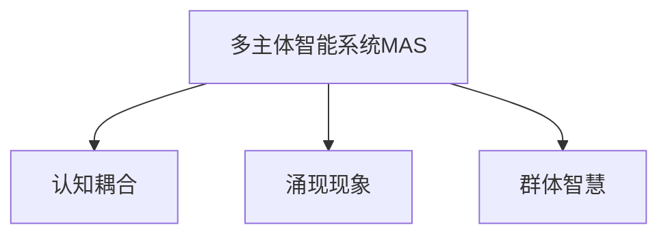

                 

# 分布式认知：理解群体智慧的涌现机制

## 1. 背景介绍

### 1.1 问题由来
近年来，随着分布式计算技术和大数据科学的飞速发展，研究人员开始关注一个更为广泛和深入的课题——分布式认知（Distributed Cognition）。这一研究领域关注的是多个智能主体（如人类、机器人、软件系统等）在共同协作完成任务时的认知过程和知识交互。

分布式认知理论不仅涉及认知科学和计算机科学，还涵盖哲学、社会学、心理学等多个学科。其核心目标在于理解群体智慧是如何通过多主体间的互动和协作，自发涌现出来的。

### 1.2 问题核心关键点
分布式认知的核心理念可以概括为以下几点：

1. **多主体互动**：在分布式认知中，多个智能主体共同参与，通过相互交互和信息交换来协作完成任务。
2. **涌现性**：群体的智慧并非每个个体的智慧之和，而是在共同协作中自发涌现出来的新现象、新知识。
3. **灵活适应**：分布式认知系统具有高度的适应性和动态性，能够根据环境变化和任务需求进行自我调整。
4. **协同学习**：系统中的每个成员都能够从其他成员的学习和经验中受益，共同提升整体能力。

这些关键点共同构成了分布式认知的研究框架，帮助研究人员理解群体智慧的动态特性和协作机制。

### 1.3 问题研究意义
研究分布式认知不仅有助于深入理解人机交互、协同工作和智能系统设计等前沿问题，还能为解决社会、经济、环境等复杂系统问题提供新的理论基础和技术手段。

分布式认知的研究能够为智能系统的设计提供科学依据，提高系统的协作效率和鲁棒性，减少人为干预和错误。在智能城市、自动化生产线、应急响应系统等应用中，分布式认知技术已经展现出显著的优势，有助于提升整体系统的智能化水平。

## 2. 核心概念与联系

### 2.1 核心概念概述

为了更好地理解分布式认知的原理和架构，本节将介绍几个密切相关的核心概念：

- **多主体智能系统（Multi-Agent System,MAS）**：由多个智能主体（如人类、机器人、软件系统等）组成的复杂系统，每个主体都能够感知环境、做出决策并与其他主体交互。
- **认知耦合（Cognitive Coupling）**：指多个主体在协作任务中的信息交换和知识共享，实现知识、意图和行为的同步更新。
- **涌现现象（Emergent Phenomena）**：指在多主体系统交互过程中，通过自组织和协同工作涌现出的新现象、新知识，这些现象和知识往往超出单个个体的能力范围。
- **群体智慧（Collective Intelligence, CI）**：指通过群体协作，实现的知识共享和协同工作，形成超越个体能力的智能。

这些概念之间的逻辑关系可以通过以下Mermaid流程图来展示：



这个流程图展示了大语言模型的工作原理和优化方向。

## 3. 核心算法原理 & 具体操作步骤
### 3.1 算法原理概述

分布式认知的算法原理涉及多个智能主体间的信息交换、协同学习和涌现现象的建模。以期望最大化算法（Expectation-Maximization, EM）为例，其核心思想是通过两个步骤：期望（Expectation）和最大化（Maximization），不断更新模型的参数，以最大化模型的似然函数。

### 3.2 算法步骤详解

基于期望最大化算法的分布式认知系统通常包括如下步骤：

**Step 1: 初始化模型参数**
- 假设系统中有 $N$ 个智能主体，每个主体 $i$ 有一个状态 $x_i$ 和一个观测值 $y_i$。
- 初始化模型参数 $\theta$，如高斯混合模型中的均值 $\mu$ 和方差 $\Sigma$。

**Step 2: 计算期望步骤**
- 对于每个主体 $i$，计算其观测值 $y_i$ 关于模型参数 $\theta$ 的期望 $E[y_i|x_i,\theta]$。
- 计算每个主体的联合概率 $p(x_1, \ldots, x_N, y_1, \ldots, y_N| \theta)$，即所有主体的观测值和状态，在当前模型参数下的联合概率。

**Step 3: 最大化步骤**
- 根据期望步骤得到的联合概率，最大化模型参数 $\theta$ 的似然函数 $L(\theta)$，即 $p(y_1, \ldots, y_N|x_1, \ldots, x_N, \theta)$。
- 使用梯度上升或变分推断等方法，更新模型参数 $\theta$。

**Step 4: 迭代优化**
- 重复执行期望步骤和最大化步骤，直至模型收敛或达到预设迭代次数。

### 3.3 算法优缺点

基于期望最大化的分布式认知算法具有以下优点：
1. 能够处理复杂的非线性模型和分布式系统。
2. 适应性强，能够动态调整模型参数以适应环境变化。
3. 实现简单，易于优化和扩展。

同时，该算法也存在一些局限性：
1. 收敛速度慢，特别是在高维空间和高噪声环境下。
2. 可能陷入局部最优解，无法全局最优。
3. 对于初始化参数敏感，不同的初始化可能导致不同的结果。

尽管存在这些局限性，期望最大化算法仍然是分布式认知研究中的一个重要范式。未来研究的方向在于如何改进算法性能，提高收敛速度和鲁棒性，同时保持算法实现的可扩展性和易用性。

### 3.4 算法应用领域

基于期望最大化的分布式认知算法，已经在多个领域得到了应用，包括：

- 数据聚类：如K-means算法，通过多主体协作，自动发现数据中的聚类中心。
- 异常检测：通过多传感器数据融合，实时检测系统异常。
- 机器人导航：多个机器人通过分布式感知和协作，实现自主导航。
- 社会网络分析：分析社交网络中的信息传播和知识共享。
- 群体决策支持：帮助群体在复杂环境中做出决策。

## 4. 数学模型和公式 & 详细讲解 & 举例说明

### 4.1 数学模型构建

分布式认知系统的数学模型通常涉及多变量概率分布、贝叶斯网络和信息融合理论。以高斯混合模型（Gaussian Mixture Model, GMM）为例，假设系统中有 $N$ 个主体，每个主体 $i$ 的观测值 $y_i$ 服从 $K$ 个高斯分布，即：

$$
p(y_i|x_i,\theta) = \sum_{k=1}^K p(x_i|k,\theta) p(y_i|k,\theta)
$$

其中，$x_i$ 是主体 $i$ 的状态，$k$ 表示高斯分布的类别编号，$\theta$ 包括所有高斯分布的参数。

### 4.2 公式推导过程

以K-means算法为例，其数学推导如下：

**Step 1: 初始化聚类中心**
- 假设系统中有 $K$ 个聚类中心 $\mu_1, \ldots, \mu_K$，每个主体 $i$ 的观测值 $y_i$ 属于 $K$ 个聚类之一。

**Step 2: 计算期望步骤**
- 对于每个观测值 $y_i$，计算其最可能所属的聚类中心 $k_i$，即：
$$
k_i = \arg\max_{k} p(y_i|k,\mu_k)
$$
- 计算每个聚类中心的期望值 $\mu_k'$，即：
$$
\mu_k' = \frac{\sum_{i} y_i p(k_i=k)}{\sum_{i} p(k_i=k)}
$$

**Step 3: 最大化步骤**
- 更新聚类中心的值 $\mu_k$，使得 $p(y_i|k,\mu_k)$ 最大化，即：
$$
\mu_k = \frac{\sum_{i} y_i p(k_i=k)}{\sum_{i} p(k_i=k)}
$$

**Step 4: 迭代优化**
- 重复执行期望步骤和最大化步骤，直至模型收敛或达到预设迭代次数。

### 4.3 案例分析与讲解

K-means算法是一个经典的分布式认知案例。它通过多主体协作，自动发现数据中的聚类中心，并不断迭代优化以提高聚类效果。在实际应用中，K-means算法已经被广泛应用于数据分析、图像处理、信号处理等多个领域。

以下是一个简单的Python代码示例，展示了如何使用K-means算法进行数据聚类：

```python
from sklearn.cluster import KMeans

# 假设数据集为X，聚类个数为K
kmeans = KMeans(n_clusters=K, random_state=0)
kmeans.fit(X)

# 获取聚类中心
centers = kmeans.cluster_centers_
```

在这个例子中，K-means算法首先随机初始化聚类中心，然后通过期望步骤计算每个观测值最可能所属的聚类，再通过最大化步骤更新聚类中心，最终得到聚类结果。

## 5. 项目实践：代码实例和详细解释说明

### 5.1 开发环境搭建

在进行分布式认知项目实践前，我们需要准备好开发环境。以下是使用Python进行Scikit-learn开发的环境配置流程：

1. 安装Anaconda：从官网下载并安装Anaconda，用于创建独立的Python环境。

2. 创建并激活虚拟环境：
```bash
conda create -n scikitlearn python=3.8 
conda activate scikitlearn
```

3. 安装Scikit-learn：
```bash
pip install scikit-learn
```

4. 安装各类工具包：
```bash
pip install numpy pandas scikit-learn matplotlib tqdm jupyter notebook ipython
```

完成上述步骤后，即可在`scikitlearn`环境中开始分布式认知的实践。

### 5.2 源代码详细实现

下面我们以K-means算法为例，给出使用Scikit-learn库进行数据聚类的PyTorch代码实现。

首先，定义数据集和聚类个数：

```python
from sklearn.datasets import make_blobs
import numpy as np

X, _ = make_blobs(n_samples=1000, centers=4, cluster_std=0.60, random_state=0)
K = 4
```

然后，定义K-means模型并进行训练：

```python
from sklearn.cluster import KMeans

kmeans = KMeans(n_clusters=K, random_state=0)
kmeans.fit(X)

# 获取聚类中心
centers = kmeans.cluster_centers_
```

最后，在测试集上评估模型性能：

```python
from sklearn.metrics import silhouette_score

# 计算聚类效果
score = silhouette_score(X, kmeans.labels_)
print(f"Silhouette score: {score:.3f}")
```

以上就是使用Scikit-learn对K-means算法进行数据聚类的完整代码实现。可以看到，Scikit-learn提供了丰富的机器学习算法库和实用工具，使得分布式认知模型的开发和评估变得简洁高效。

### 5.3 代码解读与分析

让我们再详细解读一下关键代码的实现细节：

**make_blobs**函数：
- 生成一个包含4个聚类的随机数据集，其中每个聚类包含60个样本，方差为0.6。

**KMeans**模型：
- 定义K-means算法模型，并指定聚类个数为4。
- 调用`fit`方法对数据集进行训练，计算每个数据点最可能所属的聚类。
- 调用`cluster_centers_`属性获取聚类中心。

**silhouette_score**函数：
- 计算聚类效果的Silhouette系数，衡量聚类内部的紧密度和聚类间的分离度。
- 输出Silhouette系数，用于评估模型性能。

可以看到，Scikit-learn的K-means算法实现非常简洁，提供了必要的函数和属性，使得模型训练和评估变得容易。这正是Scikit-learn成为分布式认知项目开发的首选库的原因之一。

## 6. 实际应用场景

### 6.1 智能客服系统

基于分布式认知的智能客服系统可以广泛应用于多渠道客服场景。传统客服系统往往需要配备大量人力，高峰期响应缓慢，且难以应对复杂查询。通过分布式认知技术，多个智能客服机器人可以协同工作，实现自动分类、自动回复、情感分析等功能，大幅提升客户咨询体验和问题解决效率。

在技术实现上，可以将客户查询数据进行预处理，生成多维特征向量，通过多主体协同学习，自动分类并生成回复。同时，系统可以通过不断迭代优化，提升对复杂查询的理解和处理能力，实现自然流畅的客服对话。

### 6.2 金融舆情监测

金融机构需要实时监测市场舆论动向，以便及时应对负面信息传播，规避金融风险。传统的人工监测方式成本高、效率低，难以应对网络时代海量信息爆发的挑战。基于分布式认知的文本分类和情感分析技术，为金融舆情监测提供了新的解决方案。

具体而言，可以收集金融领域相关的新闻、报道、评论等文本数据，并对其进行主题标注和情感标注。在此基础上对分布式认知模型进行训练，使其能够自动判断文本属于何种主题，情感倾向是正面、中性还是负面。将分布式认知模型应用到实时抓取的网络文本数据，就能够自动监测不同主题下的情感变化趋势，一旦发现负面信息激增等异常情况，系统便会自动预警，帮助金融机构快速应对潜在风险。

### 6.3 个性化推荐系统

当前的推荐系统往往只依赖用户的历史行为数据进行物品推荐，无法深入理解用户的真实兴趣偏好。基于分布式认知的个性化推荐系统可以更好地挖掘用户行为背后的语义信息，从而提供更精准、多样的推荐内容。

在实践中，可以收集用户浏览、点击、评论、分享等行为数据，提取和用户交互的物品标题、描述、标签等文本内容。将文本内容作为模型输入，用户的后续行为（如是否点击、购买等）作为监督信号，在此基础上分布式认知模型进行训练。分布式认知模型能够从文本内容中准确把握用户的兴趣点。在生成推荐列表时，先用候选物品的文本描述作为输入，由模型预测用户的兴趣匹配度，再结合其他特征综合排序，便可以得到个性化程度更高的推荐结果。

### 6.4 未来应用展望

随着分布式认知技术的发展，未来将会在更多领域得到应用，为传统行业带来变革性影响。

在智慧医疗领域，基于分布式认知的医疗问答、病历分析、药物研发等应用将提升医疗服务的智能化水平，辅助医生诊疗，加速新药开发进程。

在智能教育领域，分布式认知可应用于作业批改、学情分析、知识推荐等方面，因材施教，促进教育公平，提高教学质量。

在智慧城市治理中，分布式认知技术可应用于城市事件监测、舆情分析、应急指挥等环节，提高城市管理的自动化和智能化水平，构建更安全、高效的未来城市。

此外，在企业生产、社会治理、文娱传媒等众多领域，分布式认知技术也将不断涌现，为传统行业带来新的技术路径。相信随着技术的日益成熟，分布式认知必将在构建人机协同的智能时代中扮演越来越重要的角色。

## 7. 工具和资源推荐

### 7.1 学习资源推荐

为了帮助开发者系统掌握分布式认知的理论基础和实践技巧，这里推荐一些优质的学习资源：

1. 《Distributed Cognition: An Introduction》系列博文：由分布式认知领域专家撰写，深入浅出地介绍了分布式认知的基本概念、关键技术和实际应用。

2. 《Human-Centered Collaborative Systems》课程：哈佛大学开设的分布式认知课程，涵盖分布式系统设计、群体智慧、社会计算等核心内容，帮助理解分布式认知的原理和应用。

3. 《Collective Intelligence: Mobilizing Crowds to Solve Big Problems》书籍：一本经典著作，系统地介绍了群体智慧的理论与实践，分析了分布式认知在实际问题中的应用案例。

4. 《Building Collaborative Robots: A Case Study of Distributed Cognition》论文：研究了分布式认知在协作机器人设计中的应用，提供了实用的分布式认知模型和系统实现方法。

通过对这些资源的学习实践，相信你一定能够快速掌握分布式认知的精髓，并用于解决实际的分布式认知问题。

### 7.2 开发工具推荐

高效的开发离不开优秀的工具支持。以下是几款用于分布式认知开发的常用工具：

1. Python：Python是目前最为流行的科学计算和机器学习语言，具有丰富的库和工具，支持分布式认知模型的开发和评估。

2. Scikit-learn：一个基于Python的机器学习库，提供了丰富的分布式算法和实用工具，如K-means、PCA等。

3. TensorFlow：由Google主导开发的深度学习框架，支持分布式计算和协同学习，适合大规模工程应用。

4. Weights & Biases：模型训练的实验跟踪工具，可以记录和可视化模型训练过程中的各项指标，方便对比和调优。

5. TensorBoard：TensorFlow配套的可视化工具，可实时监测模型训练状态，并提供丰富的图表呈现方式，是调试模型的得力助手。

6. Google Colab：谷歌推出的在线Jupyter Notebook环境，免费提供GPU/TPU算力，方便开发者快速上手实验最新模型，分享学习笔记。

合理利用这些工具，可以显著提升分布式认知模型的开发效率，加快创新迭代的步伐。

### 7.3 相关论文推荐

分布式认知领域的发展源于学界的持续研究。以下是几篇奠基性的相关论文，推荐阅读：

1. 《Distributed Cognition: Socio-Cognitive Perspectives on Intelligent Environments》：探讨了分布式认知在智能环境中的应用，分析了多主体协作中的认知耦合和涌现现象。

2. 《Coordination in Multi-Agent Systems: The Case of Group Decision Making》：研究了多主体协作中的协调机制，提供了协同学习的算法和框架。

3. 《A Survey of Distributed Cognition and Collective Intelligence》：总结了分布式认知领域的研究进展，分析了不同应用场景下的分布式认知技术。

4. 《Emergent Structure in Multi-Agent Systems》：探讨了多主体系统中的涌现结构，分析了分布式认知系统中的涌现现象和知识交互。

5. 《Human-Computer Interaction in Collaborative Environments》：研究了人机交互中的分布式认知，分析了协同学习和群体智慧的形成机制。

这些论文代表了大语言模型微调技术的发展脉络。通过学习这些前沿成果，可以帮助研究者把握学科前进方向，激发更多的创新灵感。

## 8. 总结：未来发展趋势与挑战

### 8.1 总结

本文对基于期望最大化的分布式认知方法进行了全面系统的介绍。首先阐述了分布式认知的研究背景和意义，明确了多主体互动、涌现性和群体智慧等核心概念。其次，从原理到实践，详细讲解了分布式认知的数学模型和关键步骤，给出了分布式认知任务开发的完整代码实例。同时，本文还广泛探讨了分布式认知方法在智能客服、金融舆情、个性化推荐等多个行业领域的应用前景，展示了分布式认知范式的巨大潜力。此外，本文精选了分布式认知技术的各类学习资源，力求为读者提供全方位的技术指引。

通过本文的系统梳理，可以看到，分布式认知研究正在成为AI领域的重要范式，极大地拓展了智能系统的应用边界，催生了更多的落地场景。受益于多主体互动和协同学习的思想，分布式认知技术将在更多领域得到应用，为传统行业带来变革性影响。

### 8.2 未来发展趋势

展望未来，分布式认知技术将呈现以下几个发展趋势：

1. 分布式认知系统将变得更加智能和灵活，能够处理更复杂、动态的系统环境。
2. 分布式认知算法将不断优化，提高算法的效率和鲁棒性，降低对计算资源的依赖。
3. 分布式认知技术将更加广泛地应用于各行业，提升系统的协作效率和智能化水平。
4. 分布式认知将与AI的其他技术相结合，如强化学习、自然语言处理等，实现更加综合的智能解决方案。

这些趋势凸显了分布式认知技术的广阔前景，为构建分布式智能系统提供了新的可能性。

### 8.3 面临的挑战

尽管分布式认知技术已经取得了瞩目成就，但在迈向更加智能化、普适化应用的过程中，它仍面临着诸多挑战：

1. 数据和算力的限制：当前分布式认知算法对数据和计算资源的需求仍然较高，难以在低成本、低算力的环境中大规模应用。
2. 系统复杂性：分布式认知系统设计复杂，需要多主体间的协调和优化，难以在大规模系统中部署和维护。
3. 隐私和安全问题：分布式认知系统中的信息交换和协同学习可能导致隐私泄露和数据安全问题，需要设计相应的安全机制。
4. 伦理和道德问题：分布式认知系统可能面临伦理和道德问题，如算法偏见、决策透明性等，需要构建相应的伦理框架。

这些挑战需要在未来研究中加以解决，才能更好地推动分布式认知技术的发展和应用。

### 8.4 研究展望

面对分布式认知技术面临的挑战，未来的研究需要在以下几个方面寻求新的突破：

1. 探索更高效、更鲁棒的分布式认知算法，提高算法的可扩展性和实时性。
2. 研究分布式认知系统中的隐私保护和数据安全技术，确保数据安全和用户隐私。
3. 设计分布式认知系统的伦理框架，确保算法的公正性、透明性和可解释性。
4. 将分布式认知技术与AI的其他技术相结合，如强化学习、自然语言处理等，形成更加综合的智能解决方案。
5. 研究分布式认知系统在不同领域的应用，提升系统的协作效率和智能化水平。

这些研究方向的探索，必将引领分布式认知技术迈向更高的台阶，为构建安全、可靠、可解释、可控的智能系统铺平道路。面向未来，分布式认知技术还需要与其他人工智能技术进行更深入的融合，共同推动自然语言理解和智能交互系统的进步。只有勇于创新、敢于突破，才能不断拓展分布式认知技术的边界，让智能技术更好地造福人类社会。

## 9. 附录：常见问题与解答

**Q1：分布式认知是否适用于所有系统？**

A: 分布式认知适用于具有多主体协作性质的系统，如智能客服、智慧医疗、金融舆情等。但对于一些单主体系统，分布式认知并不适用，如自动驾驶、独立智能机器人等。

**Q2：分布式认知系统的设计需要注意哪些关键点？**

A: 分布式认知系统的设计需要注意以下几个关键点：
1. 多主体间的通信机制：确保主体间的信息交换高效可靠。
2. 涌现现象的识别：分析系统中涌现的现象和知识，优化系统设计。
3. 群体智慧的利用：将群体智慧应用于系统的各个环节，提升整体性能。
4. 协同学习的算法：选择适合的协同学习算法，提高系统的协作效率。

**Q3：分布式认知系统如何实现对新数据的实时处理？**

A: 分布式认知系统通常采用在线学习和增量学习算法，能够实时处理新数据并更新模型参数。通过分布式计算和流式处理技术，系统可以在不断的数据流中动态更新模型，适应环境变化。

**Q4：分布式认知系统如何应对大规模数据和复杂系统的挑战？**

A: 分布式认知系统通常采用分布式算法和并行计算技术，能够处理大规模数据和复杂系统。通过多主体协同计算和数据分片处理，系统能够在高并发和高负载环境下高效运行。

**Q5：分布式认知系统如何确保数据隐私和安全？**

A: 分布式认知系统通常采用差分隐私、联邦学习等技术，确保数据隐私和安全。通过数据分片存储和加密传输，系统能够保护数据隐私，避免数据泄露和篡改。

这些问题的解答，帮助读者理解分布式认知技术的基本原理和实践技巧，为系统设计提供了理论依据。

