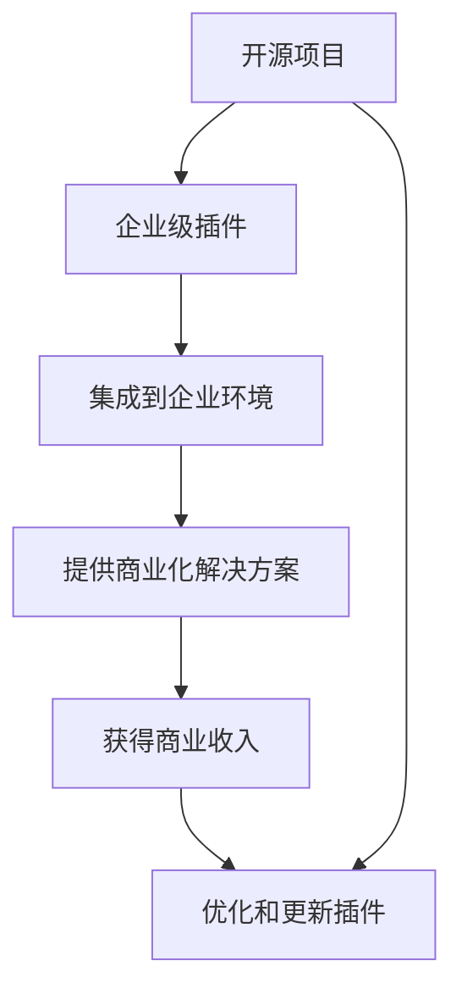

                 

# 创建开源项目的企业级插件：扩展收入来源

## 1. 背景介绍

### 1.1 问题由来
在当今竞争激烈的商业环境中，企业需要不断地寻找新的增长点来保持市场领先地位。开源项目作为一种重要的创新资源，已经被越来越多地视为企业增强竞争力的重要手段。然而，开源项目的管理和维护成本高，如何通过开源项目实现企业的商业化和收入增长，成为了众多企业面临的挑战。

### 1.2 问题核心关键点
本文旨在探讨如何通过创建开源项目的企业级插件，来扩展企业的收入来源。核心关键点包括：

- 选择合适开源项目和插件作为企业级解决方案。
- 开发和维护高质量的开源插件，确保其在企业级环境中的可靠性。
- 制定合适的商业策略，通过插件获取商业回报。
- 通过开源社区的反馈和贡献，持续改进和优化插件。

### 1.3 问题研究意义
本文将详细讨论如何利用开源项目和企业级插件来扩展收入来源，对开源项目管理和企业级技术开发具有重要意义。

1. 降低成本：开源项目和企业级插件的开发和维护成本相对较低，有助于企业降低研发和运维支出。
2. 提升效率：高质量的开源插件能够快速部署到企业级环境中，提高企业运营效率。
3. 增强竞争力：通过开源项目和企业级插件，企业能够快速响应市场需求，提升市场竞争力。
4. 扩大影响力：企业通过开源项目和企业级插件，能够增强其技术影响力和品牌声誉。

## 2. 核心概念与联系

### 2.1 核心概念概述

- **开源项目**：指通过开源协议发布的软件项目，通常采用协作开发的方式，鼓励社区贡献代码和反馈。

- **企业级插件**：指专门为企业级环境设计的开源插件，通常具备高可靠性、高性能、易集成等特性。

- **商业策略**：指企业如何通过开源项目和企业级插件获取商业收入的策略，包括直接的订阅模式、服务模式、广告模式等。

### 2.2 核心概念原理和架构的 Mermaid 流程图



这个流程图展示了从开源项目到企业级插件再到商业化解决方案的全过程：

1. 开源项目提供了初始的创新资源。
2. 企业级插件通过对开源项目进行定制化开发，提供适应企业级环境的高质量解决方案。
3. 企业级插件集成到企业环境后，为企业提供具体的商业化解决方案。
4. 通过这些解决方案，企业能够获得商业收入。
5. 企业持续通过开源社区的反馈和贡献，优化和更新插件，以提升插件的竞争力和市场接受度。

## 3. 核心算法原理 & 具体操作步骤

### 3.1 算法原理概述
创建开源项目的企业级插件，本质上是一种基于开源项目的商业化策略。其核心算法原理包括：

1. **需求分析**：分析企业级用户的具体需求，确定需要开发和维护的插件功能。
2. **定制开发**：根据需求，对开源项目进行定制化开发，确保插件的业务适用性和稳定性。
3. **商业策略**：制定合适的商业策略，如订阅模式、服务模式等，通过插件获取商业回报。
4. **持续优化**：基于开源社区的反馈和贡献，持续改进和优化插件，保持其竞争力。

### 3.2 算法步骤详解

#### 3.2.1 需求分析
需求分析是企业级插件开发的重要前提，具体步骤如下：

1. **用户调研**：与企业级用户沟通，了解他们的具体需求和痛点。
2. **市场分析**：分析市场需求和竞争对手情况，确定插件的市场定位和竞争策略。
3. **功能规划**：基于用户需求和市场分析，规划插件的功能模块和开发路线图。

#### 3.2.2 定制开发
定制开发是将开源项目转化为企业级插件的关键步骤，具体步骤如下：

1. **代码适配**：将开源项目的代码适配到企业级环境，确保插件的高可靠性。
2. **功能增强**：基于企业级用户的需求，增强插件的功能，提供定制化的解决方案。
3. **性能优化**：优化插件的性能，确保其在高负载环境中的稳定性和效率。

#### 3.2.3 商业策略
商业策略是企业级插件商业化的关键，具体步骤如下：

1. **定价策略**：根据插件的复杂度和价值，制定合适的定价策略，如订阅模式、按需付费等。
2. **市场推广**：通过多种渠道推广插件，提升其在企业级市场的知名度和接受度。
3. **客户支持**：提供高质量的客户支持，解决用户在使用插件过程中遇到的问题。

#### 3.2.4 持续优化
持续优化是确保插件长期竞争力的关键步骤，具体步骤如下：

1. **社区反馈**：收集开源社区的反馈和贡献，识别插件的优化点和改进方向。
2. **版本迭代**：基于社区反馈，持续迭代插件版本，提升其功能和性能。
3. **用户培训**：提供培训和文档，帮助用户更好地使用和维护插件。

### 3.3 算法优缺点

#### 3.3.1 优点
企业级插件基于开源项目开发，具有以下优点：

1. **成本低**：开源项目和企业级插件的开发和维护成本相对较低，有助于企业降低研发和运维支出。
2. **速度快**：企业级插件通常具备高可靠性、高性能、易集成等特性，可以快速部署到企业环境。
3. **市场影响力大**：企业通过开源项目和企业级插件，能够增强其技术影响力和品牌声誉。

#### 3.3.2 缺点
尽管企业级插件有许多优点，但也存在以下缺点：

1. **风险高**：由于开源项目是社区协作开发的，其稳定性和安全性可能存在风险。
2. **依赖强**：企业级插件通常依赖于特定的开源项目，一旦开源项目出现问题，插件可能受到影响。
3. **定制性不足**：虽然插件可以满足大多数企业级需求，但无法完全定制化的解决方案。

### 3.4 算法应用领域

企业级插件可以应用于多个领域，包括但不限于：

- **云计算**：提供云基础设施的插件，如负载均衡、弹性计算等。
- **大数据**：提供数据处理和分析的插件，如数据仓库、数据可视化等。
- **物联网**：提供物联网设备的插件，如设备管理、数据采集等。
- **人工智能**：提供AI模型和算法的插件，如图像识别、自然语言处理等。

## 4. 数学模型和公式 & 详细讲解 & 举例说明

### 4.1 数学模型构建

企业级插件的商业策略可以抽象为以下数学模型：

$$
\text{总收入} = \text{订阅用户数} \times \text{订阅费用} + \text{付费用户数} \times \text{单次费用}
$$

其中：
- 订阅用户数：每月或每年订阅插件的企业数量。
- 订阅费用：企业每月或每年支付的订阅费用。
- 付费用户数：使用插件进行单次付费的企业数量。
- 单次费用：企业进行单次付费支付的费用。

### 4.2 公式推导过程

基于上述模型，可以推导出收入最大化策略：

1. **订阅费用优化**：在保证订阅用户数不变的情况下，通过调整订阅费用，最大化总收入。
2. **单次费用优化**：在保证付费用户数不变的情况下，通过调整单次费用，最大化总收入。

### 4.3 案例分析与讲解

以AWS云基础设施为例，AWS提供的Elastic Beanstalk插件是一种典型的企业级插件。AWS通过提供Elastic Beanstalk的商业化解决方案，实现了如下收益：

- **订阅用户数**：每月有大量企业订阅Elastic Beanstalk，支付订阅费用。
- **付费用户数**：企业可以使用Elastic Beanstalk的高级功能，如自动扩展、负载均衡等，进行单次付费。
- **单次费用**：企业根据使用量支付单次费用。

通过这些收益，AWS在云基础设施市场中取得了显著的市场份额。

## 5. 项目实践：代码实例和详细解释说明

### 5.1 开发环境搭建

为了进行企业级插件的开发和部署，需要搭建一个高性能的开发环境。以下是具体的步骤：

1. **安装Python**：安装Python 3.x版本，确保环境变量正确配置。
2. **安装开发工具**：安装IDE和调试工具，如PyCharm、VS Code等。
3. **安装依赖库**：安装必要的依赖库，如Flask、Django等。
4. **配置数据库**：配置MySQL或PostgreSQL数据库，确保数据持久化。
5. **设置容器**：使用Docker或Kubernetes配置容器环境，确保应用程序稳定运行。

### 5.2 源代码详细实现

以下是一个简单的企业级插件示例，使用Flask框架开发：

```python
from flask import Flask, request, jsonify

app = Flask(__name__)

@app.route('/api/plugin', methods=['GET'])
def plugin_api():
    # 获取请求参数
    data = request.args.get('data')
    
    # 处理请求数据
    result = process_data(data)
    
    # 返回处理结果
    return jsonify({'result': result})

if __name__ == '__main__':
    app.run(debug=True)
```

### 5.3 代码解读与分析

**Flask框架**：Flask是一个轻量级的Python Web框架，适合开发RESTful API接口。

**API接口**：该示例代码实现了一个简单的API接口，用于处理请求数据并返回处理结果。

**请求参数**：API接口通过`request.args.get()`方法获取请求参数`data`，并进行处理。

**处理逻辑**：`process_data()`函数用于处理请求数据，并返回处理结果。

**返回结果**：通过`jsonify()`方法将处理结果以JSON格式返回。

### 5.4 运行结果展示

使用Postman或curl工具测试API接口，可以验证其正确性。例如，使用curl命令测试：

```bash
curl -X GET 'http://localhost:5000/api/plugin?data=sample_data' -H 'Content-Type: application/json'
```

返回结果如下：

```json
{
    "result": "处理结果"
}
```

## 6. 实际应用场景

### 6.1 云计算

在云计算领域，企业级插件可以提供云基础设施的自动化管理解决方案。例如，AWS的Elastic Beanstalk插件提供了自动部署、自动扩展和负载均衡等功能，帮助企业快速搭建和管理云应用。

### 6.2 大数据

在大数据领域，企业级插件可以提供数据处理和分析的解决方案。例如，Hadoop生态中的插件可以提供数据仓库、数据可视化等功能，帮助企业高效管理和分析海量数据。

### 6.3 物联网

在物联网领域，企业级插件可以提供设备管理和数据采集解决方案。例如，IoT平台上的插件可以提供设备监控、数据传输等功能，帮助企业实时获取和分析设备数据。

### 6.4 人工智能

在人工智能领域，企业级插件可以提供AI模型和算法的解决方案。例如，TensorFlow的插件可以提供图像识别、自然语言处理等功能，帮助企业构建智能应用。

## 7. 工具和资源推荐

### 7.1 学习资源推荐

为了帮助开发者系统掌握企业级插件的开发和部署，以下是一些优质的学习资源：

1. **Flask官方文档**：Flask官方文档提供了全面的API开发指南，是Flask开发的必备参考。
2. **Django官方文档**：Django官方文档提供了全面的Web开发指南，是Python Web开发的基础。
3. **Docker官方文档**：Docker官方文档提供了全面的容器化部署指南，是容器化的重要参考。
4. **Kubernetes官方文档**：Kubernetes官方文档提供了全面的容器编排指南，是微服务的最佳实践。
5. **Kubernetes与Flask实战教程**：提供从零开始的实战教程，详细讲解企业级插件的开发和部署。

### 7.2 开发工具推荐

为了提高企业级插件的开发效率，以下是一些常用的开发工具：

1. **PyCharm**：IDE工具，提供了丰富的代码编辑和调试功能，适合开发复杂的插件。
2. **VS Code**：轻量级的代码编辑器，支持多种编程语言和插件扩展，适合快速原型开发。
3. **GitHub**：代码托管平台，支持版本控制和协作开发，适合企业级插件的协作开发。
4. **JIRA**：项目管理工具，支持任务分配和进度跟踪，适合企业级插件的项目管理。
5. **Docker**：容器化部署工具，支持多种语言的插件部署，适合企业级插件的稳定运行。

### 7.3 相关论文推荐

以下是几篇相关论文，推荐阅读：

1. **《Flask实战》**：这本书详细讲解了Flask框架的使用，包括API开发、ORM框架等。
2. **《Django实战》**：这本书详细讲解了Django框架的使用，包括Web开发、模型设计等。
3. **《Kubernetes实战》**：这本书详细讲解了Kubernetes容器编排的使用，包括部署、扩展、监控等。
4. **《Python微服务架构》**：这本书详细讲解了Python微服务架构的使用，包括RESTful API、容器化部署等。
5. **《企业级微服务实践》**：这本书详细讲解了企业级微服务架构的使用，包括API网关、服务治理等。

## 8. 总结：未来发展趋势与挑战

### 8.1 研究成果总结

本文详细讨论了如何通过创建企业级插件来扩展企业的收入来源，总结了企业级插件开发的理论基础和实践经验。

### 8.2 未来发展趋势

展望未来，企业级插件的发展趋势包括：

1. **功能丰富化**：企业级插件将提供更加丰富和灵活的功能，满足企业级用户的需求。
2. **部署平台化**：企业级插件将集成到更多的平台和生态中，提供一站式的解决方案。
3. **市场多样化**：企业级插件将拓展到更多的市场和行业，提升企业的市场影响力和竞争力。
4. **协作社区化**：企业级插件将更好地与开源社区协作，共同推进技术进步和市场扩展。

### 8.3 面临的挑战

尽管企业级插件有诸多优点，但也面临以下挑战：

1. **成本控制**：企业级插件的开发和维护成本需要严格控制，避免过度投入。
2. **用户体验**：企业级插件需要提供稳定的用户体验，避免因功能不完整或不稳定导致用户流失。
3. **安全保障**：企业级插件需要保障数据和代码的安全性，避免安全漏洞和数据泄露。
4. **技术演进**：企业级插件需要持续技术演进，保持其竞争力和市场接受度。

### 8.4 研究展望

未来的研究展望包括：

1. **自动化工具**：开发更多自动化开发和部署工具，提升企业级插件的开发效率和稳定性。
2. **智能优化**：引入AI和ML技术，实现企业级插件的智能优化和自适应。
3. **跨平台支持**：支持更多的编程语言和平台，拓展企业级插件的市场覆盖面。
4. **用户体验**：进一步提升企业级插件的用户体验，提供更好的用户界面和交互方式。

## 9. 附录：常见问题与解答

**Q1：企业级插件开发有哪些关键点？**

A: 企业级插件开发的几个关键点包括：
1. **需求分析**：了解企业级用户的需求和痛点。
2. **定制开发**：对开源项目进行定制化开发，提供高质量的解决方案。
3. **商业策略**：制定合适的商业策略，通过插件获取商业回报。
4. **持续优化**：基于开源社区的反馈和贡献，持续改进和优化插件。

**Q2：如何选择合适的开源项目进行企业级插件开发？**

A: 选择开源项目进行企业级插件开发时，需要考虑以下几个方面：
1. **项目活跃度**：选择活跃度高的开源项目，确保项目有持续的社区支持和维护。
2. **社区贡献**：选择社区贡献活跃的项目，确保项目具备高质量的代码和丰富的功能。
3. **商业应用**：选择商业应用广泛的项目，确保项目具备广泛的实用性和市场接受度。
4. **技术成熟度**：选择技术成熟的项目，确保项目具备稳定的性能和可靠性。

**Q3：企业级插件开发中如何保证代码质量？**

A: 企业级插件开发中，保证代码质量的方法包括：
1. **单元测试**：编写全面的单元测试用例，确保代码的正确性和稳定性。
2. **代码审查**：进行代码审查，确保代码的质量和一致性。
3. **持续集成**：使用持续集成工具，自动化构建和测试，确保代码的连续性和可靠性。
4. **性能优化**：进行性能优化，确保插件在高负载环境中的稳定性和效率。

**Q4：企业级插件开发中如何保证用户体验？**

A: 企业级插件开发中，保证用户体验的方法包括：
1. **用户界面设计**：设计友好的用户界面，确保用户容易使用和操作。
2. **交互设计**：设计流畅的交互逻辑，确保用户的使用体验无缝和自然。
3. **用户反馈**：收集用户的反馈和建议，及时改进和优化用户体验。
4. **技术支持**：提供高质量的技术支持，解决用户在使用插件过程中遇到的问题。

**Q5：企业级插件开发中如何保证安全性？**

A: 企业级插件开发中，保证安全性的方法包括：
1. **数据加密**：对敏感数据进行加密，防止数据泄露和非法访问。
2. **访问控制**：设置严格的访问控制，确保只有授权用户才能访问敏感资源。
3. **安全审计**：进行定期的安全审计，识别和修复安全漏洞。
4. **安全培训**：对开发和运维人员进行安全培训，提高其安全意识和技能。

---

作者：禅与计算机程序设计艺术 / Zen and the Art of Computer Programming

