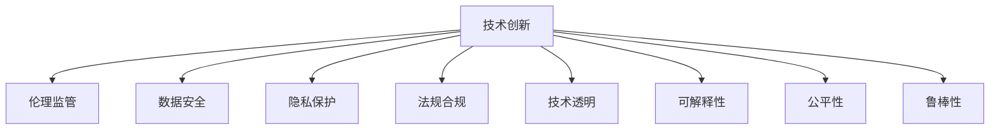

                 

## 1. 背景介绍

### 1.1 问题由来

近年来，人工智能(AI)技术飞速发展，深度学习、自然语言处理、计算机视觉、强化学习等领域取得了突破性进展。其中，深度学习模型在各种任务上取得了卓越的性能，带来了产业界的广泛关注和深入应用。例如，BERT、GPT等大模型在自然语言处理(NLP)领域展示了强大的通用能力，促进了智能客服、金融舆情监测、智能推荐等多个行业的应用。

然而，伴随AI技术的广泛应用，也引发了一系列社会伦理、隐私安全、法规合规等挑战。如何平衡AI技术创新与监管需求，确保AI技术的安全、可靠、公正和透明，成为当前和未来AI发展的重要课题。本文旨在探讨创新与监管如何平衡，以期对AI领域的技术开发和管理提供参考。

### 1.2 问题核心关键点

平衡AI发展的创新与监管，主要包括以下几个关键点：

- **技术创新与伦理监管**：如何在鼓励技术创新的同时，确保AI系统的伦理性和公正性。
- **数据安全与隐私保护**：如何保护用户隐私，防止数据泄露和滥用。
- **法规合规与标准化**：如何制定和遵守AI应用的法律法规和行业标准。
- **技术透明性与可解释性**：如何提高AI模型的可解释性，增强用户信任和接受度。
- **公平性与非歧视**：如何避免AI系统在决策过程中出现偏见和歧视，保障各群体的权益。
- **可靠性与鲁棒性**：如何提高AI系统的鲁棒性和可靠性，防止系统在复杂环境中失效。

这些核心关键点构成了AI发展的平衡框架，既要推动技术突破，又要保障社会公正、安全和合规。

## 2. 核心概念与联系

### 2.1 核心概念概述

为更好地理解AI创新与监管的平衡框架，本节将介绍几个密切相关的核心概念：

- **技术创新**：指在AI领域进行前沿技术的研发和应用，推动AI技术不断发展。
- **伦理监管**：指从伦理、法律、政策等方面对AI技术的应用进行规范和管理。
- **数据安全**：指保护数据在收集、存储、传输和使用的过程中不被非法访问、泄露或篡改。
- **隐私保护**：指在数据处理过程中，保护个人信息的隐私性，防止未经授权的信息收集和分享。
- **法规合规**：指AI应用需要遵守国家和行业的法律法规和标准规范，确保合法合规。
- **技术透明**：指AI模型的决策过程透明，用户能够理解模型的内部运作机制。
- **可解释性**：指AI模型输出的决策结果可以解释，用户能够理解和接受。
- **公平性**：指AI模型在处理不同群体数据时，不存在显著偏见和歧视。
- **鲁棒性**：指AI模型在面对异常输入、环境变化和攻击时，能够稳定运行，不受影响。

这些核心概念之间的逻辑关系可以通过以下Mermaid流程图来展示：



这个流程图展示了一系列核心概念及其之间的关系：

1. **技术创新**是驱动AI发展的原动力，需要不断的技术突破和应用。
2. **伦理监管**和**法规合规**是规范AI技术应用的保障，确保技术发展的方向符合社会伦理和法规要求。
3. **数据安全**和**隐私保护**是保障用户数据安全的重要环节，防止数据滥用和泄露。
4. **技术透明**和**可解释性**是增强用户信任的基础，帮助用户理解和接受AI系统的决策。
5. **公平性**和**鲁棒性**是确保AI系统公正和可靠的关键，避免偏见和攻击带来的风险。

这些概念共同构成了AI技术创新的平衡框架，需要在技术开发、应用部署、用户反馈等各个环节加以考虑。

## 3. 核心算法原理 & 具体操作步骤
### 3.1 算法原理概述

AI技术创新的核心在于不断优化算法和模型，提升其在特定任务上的性能。这一过程涉及多个层面的算法原理，包括但不限于：

- **模型选择**：选择合适的神经网络模型，如卷积神经网络(CNN)、循环神经网络(RNN)、Transformer等，适应不同的数据和任务。
- **特征工程**：设计有效的数据特征提取和变换方法，提升模型的泛化能力和精度。
- **训练优化**：采用合适的优化算法，如随机梯度下降(SGD)、Adam等，对模型进行训练，提高收敛速度和效果。
- **评估与调参**：通过交叉验证、A/B测试等方法，评估模型性能，调整超参数，确保模型最优。

### 3.2 算法步骤详解

AI技术创新的操作步骤主要包括以下几个关键步骤：

1. **需求分析**：明确AI技术的应用目标和需求，确定数据采集和处理的基本框架。
2. **数据准备**：收集、清洗和标注数据，确保数据质量和高代表性。
3. **模型选择与设计**：根据任务特点选择合适的模型架构和算法，设计训练和评估流程。
4. **模型训练**：使用训练数据集对模型进行训练，优化模型参数，提升模型性能。
5. **模型评估与测试**：使用验证数据集对模型进行评估，确定模型性能指标和调参策略。
6. **模型部署与迭代**：将模型部署到实际应用场景中，收集用户反馈，持续迭代优化。

### 3.3 算法优缺点

AI技术创新的优势在于其强大的数据处理能力和高效的计算性能，可以快速应对复杂任务和海量数据。然而，这也伴随着一些显著的缺点：

**优点**：
1. **高效性**：AI算法能够处理海量数据，快速产生高质量的输出。
2. **可扩展性**：AI模型可以根据任务需求进行灵活扩展和调整，适应不同规模和类型的数据。
3. **自动化**：AI系统能够自动化处理大部分数据处理和决策任务，减少人力成本。

**缺点**：
1. **黑盒特性**：许多AI模型存在“黑盒”特性，决策过程不透明，难以解释和调试。
2. **数据依赖**：AI系统依赖大量高质量数据进行训练，数据偏差可能影响模型性能。
3. **对抗攻击**：AI模型容易受到对抗样本的攻击，导致模型失效。
4. **鲁棒性不足**：AI模型在面对复杂环境和异常输入时，可能表现不稳定。

### 3.4 算法应用领域

AI技术创新的应用领域极其广泛，涵盖各个行业和领域，例如：

- **医疗健康**：AI在医学影像分析、疾病预测、药物研发等方面展现了强大的能力。
- **金融服务**：AI在风险评估、客户服务、投资策略等方面得到了广泛应用。
- **智能制造**：AI在生产调度、质量控制、设备维护等方面提升了制造业的智能化水平。
- **智慧城市**：AI在城市管理、交通控制、环境监测等方面为城市智能化提供了新思路。
- **智能家居**：AI在智能音箱、智能家电、智能安防等方面提升了家居生活的便利性和安全性。
- **社交媒体**：AI在内容推荐、情感分析、虚假信息检测等方面优化了社交媒体平台的用户体验。

## 4. 数学模型和公式 & 详细讲解 & 举例说明

### 4.1 数学模型构建

AI技术创新的数学模型构建，通常涉及以下几个关键步骤：

1. **模型选择**：选择适合的神经网络模型，如卷积神经网络(CNN)、循环神经网络(RNN)、Transformer等。
2. **损失函数设计**：设计适合任务的损失函数，如交叉熵损失、均方误差损失等。
3. **优化算法选择**：选择合适的优化算法，如随机梯度下降(SGD)、Adam等。
4. **超参数调优**：通过网格搜索、贝叶斯优化等方法，确定最优的超参数组合。

### 4.2 公式推导过程

以神经网络模型为例，假设有一个包含$m$个样本的训练集$\{(x_i, y_i)\}_{i=1}^m$，其中$x_i$为输入，$y_i$为标签。假设模型为$M_\theta$，其中$\theta$为模型参数。则模型的损失函数$\mathcal{L}$可以表示为：

$$
\mathcal{L}(\theta) = \frac{1}{m} \sum_{i=1}^m \ell(M_\theta(x_i), y_i)
$$

其中$\ell$为损失函数，可以是交叉熵损失、均方误差损失等。模型的目标是最小化损失函数$\mathcal{L}(\theta)$，即：

$$
\theta^* = \mathop{\arg\min}_{\theta} \mathcal{L}(\theta)
$$

通过梯度下降等优化算法，不断更新模型参数$\theta$，直至收敛。

### 4.3 案例分析与讲解

以图像分类任务为例，假设有一个包含1000个样本的训练集，每个样本为28x28的灰度图像，标签为0-9之间的数字。使用卷积神经网络(CNN)作为模型，损失函数为交叉熵损失，优化算法为Adam。具体实现步骤如下：

1. **数据准备**：将图像数据转化为标准化的张量格式，并按样本数量划分训练集和验证集。
2. **模型选择**：设计一个包含3个卷积层和3个全连接层的CNN模型。
3. **模型训练**：使用训练集对模型进行训练，更新参数，确保损失函数不断减小。
4. **模型评估**：在验证集上评估模型性能，选择最优的超参数组合。
5. **模型部署**：将模型部署到实际应用场景中，进行图像分类的任务。

## 5. 项目实践：代码实例和详细解释说明
### 5.1 开发环境搭建

在进行AI技术创新项目的开发前，需要准备好开发环境。以下是使用Python进行TensorFlow开发的环境配置流程：

1. 安装Anaconda：从官网下载并安装Anaconda，用于创建独立的Python环境。
2. 创建并激活虚拟环境：
```bash
conda create -n tf-env python=3.8 
conda activate tf-env
```

3. 安装TensorFlow：根据CUDA版本，从官网获取对应的安装命令。例如：
```bash
conda install tensorflow -c tf -c conda-forge
```

4. 安装TensorBoard：
```bash
pip install tensorboard
```

5. 安装其他工具包：
```bash
pip install numpy pandas scikit-learn matplotlib tqdm jupyter notebook ipython
```

完成上述步骤后，即可在`tf-env`环境中开始AI技术创新实践。

### 5.2 源代码详细实现

以下是使用TensorFlow进行图像分类任务开发的PyTorch代码实现：

```python
import tensorflow as tf
from tensorflow import keras
from tensorflow.keras import layers
import numpy as np
import matplotlib.pyplot as plt

# 准备数据集
(x_train, y_train), (x_test, y_test) = keras.datasets.mnist.load_data()
x_train = x_train.reshape(-1, 28, 28, 1).astype('float32') / 255.0
x_test = x_test.reshape(-1, 28, 28, 1).astype('float32') / 255.0

# 定义模型
model = keras.Sequential([
    layers.Conv2D(32, (3, 3), activation='relu', input_shape=(28, 28, 1)),
    layers.MaxPooling2D((2, 2)),
    layers.Conv2D(64, (3, 3), activation='relu'),
    layers.MaxPooling2D((2, 2)),
    layers.Flatten(),
    layers.Dense(64, activation='relu'),
    layers.Dense(10, activation='softmax')
])

# 定义损失函数和优化器
loss_fn = tf.keras.losses.SparseCategoricalCrossentropy()
optimizer = tf.keras.optimizers.Adam()

# 训练模型
model.compile(optimizer=optimizer, loss=loss_fn, metrics=['accuracy'])
history = model.fit(x_train, y_train, epochs=10, validation_data=(x_test, y_test))

# 评估模型
test_loss, test_acc = model.evaluate(x_test, y_test, verbose=2)
print('Test loss:', test_loss)
print('Test accuracy:', test_acc)

# 可视化训练过程
import tensorflow.keras.backend as K

plt.figure(figsize=(10, 6))
plt.plot(history.history['accuracy'], label='accuracy')
plt.plot(history.history['val_accuracy'], label='val_accuracy')
plt.xlabel('Epoch')
plt.ylabel('Accuracy')
plt.legend()
plt.show()

plt.figure(figsize=(10, 6))
plt.plot(history.history['loss'], label='loss')
plt.plot(history.history['val_loss'], label='val_loss')
plt.xlabel('Epoch')
plt.ylabel('Loss')
plt.legend()
plt.show()
```

### 5.3 代码解读与分析

让我们再详细解读一下关键代码的实现细节：

**数据准备**：
- 使用`keras.datasets.mnist.load_data()`方法加载手写数字数据集，将图像数据按样本数重塑，并转化为浮点数，缩放到[0,1]区间。

**模型定义**：
- 使用`Sequential`模型，定义包含2个卷积层、2个池化层和2个全连接层的CNN结构。卷积层使用3x3的卷积核和ReLU激活函数，池化层使用2x2的池化核和最大池化操作，全连接层使用ReLU激活函数，输出层使用Softmax激活函数。

**损失函数和优化器**：
- 使用`SparseCategoricalCrossentropy`损失函数，适用于多分类任务。
- 使用`Adam`优化器，自动调整学习率，加快模型收敛。

**模型训练与评估**：
- 使用`model.fit()`方法，将训练数据和验证数据输入模型，指定训练轮数。在每个epoch结束时，模型会自动在验证集上评估性能。
- 使用`model.evaluate()`方法，在测试集上评估模型性能，打印测试损失和准确率。

**可视化训练过程**：
- 使用Matplotlib库，将训练过程中的准确率和损失可视化，便于观察模型训练效果。

## 6. 实际应用场景

### 6.1 医疗影像诊断

AI技术在医疗影像诊断中的应用日益广泛，通过深度学习算法可以对医学影像进行自动分析，提高诊断效率和准确性。例如，使用卷积神经网络(CNN)对CT、MRI等影像数据进行肿瘤检测、病变分析等。

**案例分析**：
- **数据准备**：收集大量标注的医学影像数据，按病人、部位等分类。
- **模型选择**：选择适合的卷积神经网络模型，如U-Net、ResNet等。
- **模型训练**：使用标注数据对模型进行训练，优化超参数，确保模型准确性。
- **模型评估**：在验证集上评估模型性能，选择最优模型。
- **模型部署**：将模型部署到医疗影像诊断系统中，自动生成诊断报告。

**应用场景**：
- **肺癌检测**：使用卷积神经网络对CT影像进行肺癌检测，提高筛查效率。
- **心脏病诊断**：使用卷积神经网络对心脏MRI影像进行病变分析，辅助医生决策。
- **皮肤癌检测**：使用卷积神经网络对皮肤照片进行癌变识别，提高早期发现率。

### 6.2 金融风控

AI技术在金融风控领域的应用主要体现在信用评分、欺诈检测、信用评估等方面。通过深度学习算法可以对用户行为数据进行分析，预测风险，防范欺诈。

**案例分析**：
- **数据准备**：收集用户历史交易数据、信用记录、社交网络等信息，进行数据清洗和预处理。
- **模型选择**：选择适合的深度学习模型，如循环神经网络(RNN)、长短时记忆网络(LSTM)等。
- **模型训练**：使用标注数据对模型进行训练，优化超参数，确保模型准确性。
- **模型评估**：在验证集上评估模型性能，选择最优模型。
- **模型部署**：将模型部署到金融风控系统中，实时监控用户行为，预测风险。

**应用场景**：
- **信用评分**：使用深度学习模型对用户信用行为进行分析，预测信用风险。
- **欺诈检测**：使用循环神经网络对交易数据进行分析，识别异常行为，防范欺诈。
- **信用评估**：使用深度学习模型对用户行为进行建模，评估信用水平。

### 6.3 智能制造

AI技术在智能制造领域的应用主要体现在质量控制、设备维护、生产调度等方面。通过深度学习算法可以对生产数据进行分析，优化生产流程，提升产品质量。

**案例分析**：
- **数据准备**：收集生产过程中的传感器数据、质量检测数据、设备状态数据等，进行数据清洗和预处理。
- **模型选择**：选择适合的深度学习模型，如卷积神经网络(CNN)、循环神经网络(RNN)等。
- **模型训练**：使用标注数据对模型进行训练，优化超参数，确保模型准确性。
- **模型评估**：在验证集上评估模型性能，选择最优模型。
- **模型部署**：将模型部署到智能制造系统中，实时监控生产过程，优化生产效率。

**应用场景**：
- **质量控制**：使用卷积神经网络对生产过程中图像进行检测，提高产品质量。
- **设备维护**：使用循环神经网络对设备状态数据进行分析，预测设备故障，提前维护。
- **生产调度**：使用深度学习模型对生产数据进行分析，优化生产调度，提升生产效率。

## 7. 工具和资源推荐
### 7.1 学习资源推荐

为了帮助开发者系统掌握AI技术创新的理论基础和实践技巧，这里推荐一些优质的学习资源：

1. **《深度学习》课程**：斯坦福大学开设的深度学习课程，有Lecture视频和配套作业，系统讲解深度学习的基本概念和算法。
2. **《TensorFlow实战》书籍**：TensorFlow官方出版物，详细介绍TensorFlow的使用方法、API和实践案例。
3. **Kaggle竞赛**：参与Kaggle机器学习竞赛，实战练习深度学习模型开发和优化。
4. **Google AI平台**：提供丰富的AI资源和工具，包括TensorFlow、Keras、TensorBoard等，方便开发者进行模型训练和调试。
5. **论文阅读**：阅读深度学习领域的经典论文，了解前沿研究方向和进展。

通过对这些资源的学习实践，相信你一定能够快速掌握AI技术创新的精髓，并用于解决实际的AI问题。

### 7.2 开发工具推荐

高效的开发离不开优秀的工具支持。以下是几款用于AI技术创新开发的常用工具：

1. **TensorFlow**：由Google主导开发的开源深度学习框架，生产部署方便，适合大规模工程应用。
2. **PyTorch**：Facebook开发的深度学习框架，灵活易用，适合快速迭代研究。
3. **Keras**：高层次的深度学习API，支持多种深度学习框架，易于上手。
4. **Jupyter Notebook**：交互式编程环境，方便编写和调试代码。
5. **Git**：版本控制系统，方便协作开发和管理代码。
6. **GitHub**：代码托管平台，方便存储、共享和协作开发。

合理利用这些工具，可以显著提升AI技术创新的开发效率，加快创新迭代的步伐。

### 7.3 相关论文推荐

AI技术创新的研究源于学界的持续研究。以下是几篇奠基性的相关论文，推荐阅读：

1. **《ImageNet Classification with Deep Convolutional Neural Networks》**：AlexNet论文，展示了深度卷积神经网络在图像分类任务中的强大性能。
2. **《Deep Residual Learning for Image Recognition》**：ResNet论文，提出残差网络，解决了深度神经网络退化问题。
3. **《Attention is All You Need》**：Transformer论文，提出自注意力机制，提升模型在自然语言处理任务中的表现。
4. **《BERT: Pre-training of Deep Bidirectional Transformers for Language Understanding》**：BERT论文，提出预训练语言模型，提升模型在自然语言处理任务中的泛化能力。
5. **《Adversarial Examples in Deep Neural Networks》**：对抗样本论文，探讨深度学习模型的鲁棒性和安全性问题。
6. **《Fairness in Machine Learning》**：公平性论文，讨论机器学习模型中的偏见和歧视问题。

这些论文代表了大规模AI技术创新的发展脉络。通过学习这些前沿成果，可以帮助研究者把握学科前进方向，激发更多的创新灵感。

## 8. 总结：未来发展趋势与挑战
### 8.1 研究成果总结

AI技术创新的研究成果主要体现在以下几个方面：

- **模型架构**：提出了各种深度学习模型，如卷积神经网络、循环神经网络、Transformer等，适用于不同任务。
- **训练算法**：设计了多种优化算法，如随机梯度下降、Adam等，提高模型训练效率。
- **数据处理**：开发了各种数据增强、预处理方法，提升数据质量，改善模型性能。
- **应用场景**：在医疗影像诊断、金融风控、智能制造等多个领域展示了强大的应用能力。

### 8.2 未来发展趋势

展望未来，AI技术创新的发展趋势主要体现在以下几个方面：

1. **模型复杂度提升**：随着计算资源的增加，深度学习模型将向更深、更宽、更复杂方向发展。
2. **自动化学习**：自动学习算法将变得更加重要，如强化学习、自监督学习等，减少人工干预，提高模型泛化能力。
3. **跨领域融合**：AI技术将与其他领域（如生物、物理等）进行更深入的融合，产生新的交叉领域应用。
4. **智能化协同**：AI系统将与人类进行更智能化的协同工作，提升人机交互体验。
5. **多模态处理**：多模态信息融合技术将更加成熟，提升AI系统对复杂环境的理解能力。
6. **个性化服务**：AI系统将更加注重个性化需求，提供定制化的服务和产品。

### 8.3 面临的挑战

尽管AI技术创新取得了显著进展，但在发展过程中仍面临诸多挑战：

1. **数据质量问题**：缺乏高质量、多样性的数据，影响模型泛化能力。
2. **计算资源限制**：大规模模型训练需要高性能计算资源，可能面临计算资源不足的问题。
3. **模型透明性**：许多AI模型存在“黑盒”特性，难以解释和调试。
4. **模型鲁棒性**：AI模型在面对复杂环境和异常输入时，可能表现不稳定。
5. **伦理和安全问题**：AI模型可能存在偏见和歧视，带来伦理和安全问题。

### 8.4 研究展望

面对AI技术创新的挑战，未来的研究需要在以下几个方面寻求新的突破：

1. **数据收集与标注**：开发自动数据生成和标注技术，减少对标注数据的需求，提高数据质量。
2. **模型压缩与加速**：研究模型压缩、量化加速技术，减少模型参数和计算资源消耗，提高模型效率。
3. **可解释性与透明性**：开发可解释性算法，提高模型决策的透明性和可解释性。
4. **鲁棒性与安全性**：研究模型鲁棒性算法，确保模型在复杂环境和攻击下的稳定性。
5. **公平性与道德**：开发公平性算法，确保模型在处理不同群体数据时，不存在显著偏见和歧视。

这些研究方向的探索，必将引领AI技术创新的进步，为构建安全、可靠、可解释、可控的智能系统铺平道路。面向未来，AI技术创新需要学界和产业界的共同努力，不断推动技术突破，应对新的挑战，实现全面智能化。

## 9. 附录：常见问题与解答

**Q1：AI技术创新的数据依赖问题如何解决？**

A: AI技术创新的数据依赖问题可以通过以下几个方法解决：

- **数据增强**：通过旋转、缩放、裁剪等方式对数据进行增强，增加数据多样性。
- **数据生成**：使用生成对抗网络(GAN)等技术生成新数据，扩充数据集。
- **半监督学习**：使用少量标注数据和大量未标注数据进行半监督学习，减少标注数据需求。
- **主动学习**：选择最有代表性的未标注数据进行标注，最大化数据利用率。

通过这些方法，可以有效缓解AI技术创新的数据依赖问题，提升模型泛化能力。

**Q2：AI技术创新的“黑盒”特性如何解决？**

A: AI技术创新的“黑盒”特性可以通过以下几个方法解决：

- **可解释性算法**：开发可解释性算法，如LIME、SHAP等，提高模型决策的透明性和可解释性。
- **模型可视化**：使用可视化工具，如TensorBoard、H5py等，帮助理解模型内部运作机制。
- **知识图谱**：结合知识图谱等外部知识，引导AI系统做出更合理决策。

通过这些方法，可以有效解决AI技术创新的“黑盒”特性，增强用户信任和接受度。

**Q3：AI技术创新的鲁棒性不足如何解决？**

A: AI技术创新的鲁棒性不足可以通过以下几个方法解决：

- **对抗样本训练**：使用对抗样本对模型进行训练，提升模型的鲁棒性。
- **数据扩充**：通过增加数据多样性，提升模型对异常输入的鲁棒性。
- **模型集成**：将多个模型进行集成，降低个体模型的脆弱性。

通过这些方法，可以有效解决AI技术创新的鲁棒性不足问题，确保模型在复杂环境和攻击下的稳定性。

**Q4：AI技术创新的伦理和安全问题如何解决？**

A: AI技术创新的伦理和安全问题可以通过以下几个方法解决：

- **伦理审查**：在模型开发过程中进行伦理审查，确保模型符合伦理要求。
- **公平性算法**：开发公平性算法，确保模型在处理不同群体数据时，不存在显著偏见和歧视。
- **隐私保护**：采用数据匿名化、差分隐私等技术，保护用户隐私。
- **安全审计**：定期进行安全审计，发现和修复潜在漏洞。

通过这些方法，可以有效解决AI技术创新的伦理和安全问题，确保模型在应用过程中的公正性和安全性。

---

作者：禅与计算机程序设计艺术 / Zen and the Art of Computer Programming

