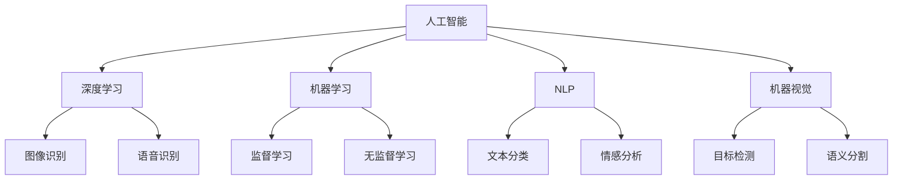

                 

# 创新思维：人工智能促进创造力

> 关键词：人工智能,创新思维,创造力,机器学习,深度学习,神经网络,决策树,自然语言处理,机器视觉,应用案例

## 1. 背景介绍

### 1.1 问题由来
人工智能（AI）技术的飞速发展，特别是深度学习和机器学习的普及，已经深刻影响了人类社会的各个方面。从医疗、金融到教育、娱乐，AI的应用无所不在。然而，人工智能不仅是一套技术手段，更是一种全新的思维方式。AI的出现，为人类带来了新的思维工具，极大地促进了创新思维的发展。

当前，创新思维已经成为各行各业提升竞争力的重要驱动力。在企业竞争日益激烈的市场环境中，谁能够迅速响应市场变化，不断推陈出新，谁就能赢得竞争。AI技术，特别是深度学习和机器学习，已经成为了驱动创新思维的关键工具。

### 1.2 问题核心关键点
AI技术的创新思维主要体现在以下几个方面：

- **数据驱动**：AI技术利用大数据进行模式识别和预测，可以迅速发现数据中的潜在的创新机会。
- **自动化迭代**：通过自动化算法，AI可以不断优化模型，逐步提升预测和决策的准确性，推动持续创新。
- **人机协同**：AI技术可以通过与人类专家合作，形成更强大的创新思维体系。
- **跨领域融合**：AI技术的跨学科应用，可以整合不同领域的技术和知识，产生新的创新思维模式。

AI技术在创新思维中的应用，已经成为推动科技进步和社会发展的核心驱动力。本文将从核心概念、算法原理、操作步骤、数学模型、项目实践、应用场景等多个方面，深入探讨AI技术如何促进创新思维的发展。

## 2. 核心概念与联系

### 2.1 核心概念概述

为了更好地理解AI技术如何促进创新思维，我们需要先明确几个核心概念：

- **人工智能**（Artificial Intelligence, AI）：模拟人类智能行为的技术体系，包括机器学习、深度学习、自然语言处理、机器视觉等子领域。
- **创新思维**：在面对复杂问题时，能创造性地提出解决方案的能力，通常需要跨学科的知识和思维方法。
- **深度学习**：一种基于神经网络模型的机器学习方法，通过多层次的特征提取和抽象，可以自动发现数据中的复杂模式。
- **机器学习**：通过算法让机器自主学习，从而提高性能和预测准确性的技术。
- **自然语言处理**（Natural Language Processing, NLP）：使计算机能够理解和处理人类自然语言的技术。
- **机器视觉**：使计算机能够识别和理解图像和视频的技术。

这些概念之间的逻辑关系可以通过以下Mermaid流程图来展示：



这个流程图展示了AI技术中不同领域之间的逻辑联系：

1. 深度学习、机器学习、自然语言处理和机器视觉是AI技术的四大核心领域。
2. 深度学习通过多层次的特征提取和抽象，可以自动发现数据中的复杂模式。
3. 机器学习通过算法让机器自主学习，从而提高性能和预测准确性。
4. 自然语言处理使计算机能够理解和处理人类自然语言。
5. 机器视觉使计算机能够识别和理解图像和视频。
6. 不同的AI技术可以应用于不同的领域，如深度学习可以用于图像识别和语音识别，机器学习可以用于监督和无监督学习，自然语言处理可以用于文本分类和情感分析，机器视觉可以用于目标检测和语义分割。

这些核心概念共同构成了AI技术的理论基础，为创新思维提供了强大的技术支持。

## 3. 核心算法原理 & 具体操作步骤
### 3.1 算法原理概述

AI技术促进创新思维的原理，可以概括为以下几个方面：

- **数据驱动的决策**：通过分析大量的数据，AI可以发现潜在的模式和趋势，提供有价值的洞察，帮助决策者制定创新策略。
- **自动化迭代优化**：AI算法可以不断迭代优化，提升模型的预测准确性，推动创新思维的不断改进。
- **人机协同增强**：AI技术可以通过与人类专家的合作，形成更强大的创新思维体系，解决复杂的现实问题。
- **跨领域融合创新**：AI技术可以整合不同领域的技术和知识，产生新的创新思维模式。

### 3.2 算法步骤详解

AI技术促进创新思维的步骤可以概括为以下几个步骤：

**Step 1: 数据收集与预处理**
- 收集相关的数据，如市场数据、用户反馈、实验数据等。
- 对数据进行清洗和预处理，去除噪声和异常值，确保数据的准确性和可靠性。

**Step 2: 模型选择与训练**
- 根据具体的问题和应用场景，选择合适的AI模型。如深度学习、决策树、支持向量机等。
- 使用历史数据对模型进行训练，确保模型的预测准确性和泛化能力。

**Step 3: 模型评估与优化**
- 使用测试集对模型进行评估，计算模型的预测准确性和其他性能指标。
- 根据评估结果，对模型进行优化，如调整超参数、引入新的特征等。

**Step 4: 应用与迭代**
- 将优化后的模型应用于实际问题，进行创新决策或生成解决方案。
- 根据实际效果，不断迭代优化模型，提升创新思维的效果。

**Step 5: 人机协同与知识融合**
- 将AI技术与人类的专业知识相结合，形成人机协同的创新思维体系。
- 将AI模型与人类专家的经验知识进行融合，形成更强大的创新思维模型。

**Step 6: 跨领域应用与创新**
- 将AI技术应用于不同领域，整合不同领域的技术和知识，产生新的创新思维模式。
- 推动跨学科的创新，如将AI应用于医学、金融、教育等领域，推动多领域的创新发展。

### 3.3 算法优缺点

AI技术在促进创新思维方面的优点包括：

- **高效性**：AI算法可以自动化迭代优化，快速提升预测准确性，推动创新思维的不断改进。
- **精确性**：AI技术能够处理大量的数据，发现潜在的模式和趋势，提供有价值的洞察，帮助决策者制定创新策略。
- **跨领域融合**：AI技术可以整合不同领域的技术和知识，产生新的创新思维模式。

同时，AI技术也存在一些缺点：

- **数据依赖性**：AI技术的创新思维需要大量的数据支持，缺乏数据支持时，效果可能大打折扣。
- **模型复杂性**：AI模型通常比较复杂，需要专业知识才能理解和优化。
- **伦理与安全问题**：AI技术的应用可能涉及伦理与安全问题，需要谨慎考虑。

### 3.4 算法应用领域

AI技术在创新思维中的应用，已经广泛应用于以下几个领域：

- **金融创新**：AI技术可以应用于金融数据分析、风险管理、投资决策等方面，推动金融行业的创新。
- **医疗创新**：AI技术可以应用于疾病预测、药物研发、医疗影像分析等方面，推动医疗行业的创新。
- **教育创新**：AI技术可以应用于智能教学、学习分析、在线教育等方面，推动教育行业的创新。
- **制造业创新**：AI技术可以应用于智能制造、质量控制、供应链管理等方面，推动制造业的创新。
- **零售创新**：AI技术可以应用于客户分析、个性化推荐、库存管理等方面，推动零售行业的创新。
- **交通创新**：AI技术可以应用于交通预测、智能交通管理、自动驾驶等方面，推动交通行业的创新。

## 4. 数学模型和公式 & 详细讲解 & 举例说明

### 4.1 数学模型构建

本节将使用数学语言对AI技术如何促进创新思维进行更加严格的刻画。

假设AI系统用于解决一个复杂的优化问题，其目标函数为 $f(x)$，其中 $x$ 表示系统的决策变量。AI系统通过深度学习模型 $M_{\theta}$ 对 $f(x)$ 进行近似，其中 $\theta$ 表示模型的参数。

定义系统的损失函数为 $\mathcal{L}(\theta)$，表示模型预测值与真实值之间的差异。系统的优化目标是最小化损失函数，即找到最优参数：

$$
\theta^* = \mathop{\arg\min}_{\theta} \mathcal{L}(\theta)
$$

在实践中，我们通常使用基于梯度的优化算法（如SGD、Adam等）来近似求解上述最优化问题。设 $\eta$ 为学习率，则参数的更新公式为：

$$
\theta \leftarrow \theta - \eta \nabla_{\theta}\mathcal{L}(\theta)
$$

其中 $\nabla_{\theta}\mathcal{L}(\theta)$ 为损失函数对参数 $\theta$ 的梯度，可通过反向传播算法高效计算。

### 4.2 公式推导过程

以下我们以一个简单的决策树分类问题为例，推导深度学习模型的训练过程。

假设我们有一个决策树模型 $M_{\theta}$，用于对样本 $x$ 进行分类，输出 $y \in \{1, 2, \ldots, k\}$。样本的真实标签为 $y^*$，模型的预测标签为 $\hat{y}=M_{\theta}(x)$。定义模型的损失函数为交叉熵损失：

$$
\ell(M_{\theta}(x),y^*) = -y^*\log \hat{y} - (1-y^*)\log(1-\hat{y})
$$

将其代入经验风险公式，得：

$$
\mathcal{L}(\theta) = -\frac{1}{N}\sum_{i=1}^N \ell(M_{\theta}(x_i),y_i^*)
$$

根据链式法则，损失函数对参数 $\theta$ 的梯度为：

$$
\frac{\partial \mathcal{L}(\theta)}{\partial \theta_k} = -\frac{1}{N}\sum_{i=1}^N (\frac{y_i^*}{\hat{y}_k} - \frac{1-y_i^*}{1-\hat{y}_k}) \frac{\partial \hat{y}_k}{\partial \theta_k}
$$

其中 $\hat{y}_k = M_{\theta}(x)_k$ 为模型输出的 $k$ 类概率，$\frac{\partial \hat{y}_k}{\partial \theta_k}$ 为模型输出对参数 $\theta_k$ 的梯度，可以通过反向传播算法计算。

在得到损失函数的梯度后，即可带入参数更新公式，完成模型的迭代优化。重复上述过程直至收敛，最终得到适应实际问题最优的模型参数 $\theta^*$。

### 4.3 案例分析与讲解

假设我们有一个金融机构的投资决策问题，需要根据历史数据预测股票的涨跌情况。我们可以将历史数据作为训练集，使用深度学习模型 $M_{\theta}$ 进行训练。

具体步骤如下：

**Step 1: 数据收集与预处理**
- 收集历史股票价格、公司财报、市场情绪等数据。
- 对数据进行清洗和预处理，去除噪声和异常值，确保数据的准确性和可靠性。

**Step 2: 模型选择与训练**
- 选择合适的深度学习模型，如卷积神经网络（CNN）、循环神经网络（RNN）等。
- 使用历史数据对模型进行训练，确保模型的预测准确性和泛化能力。

**Step 3: 模型评估与优化**
- 使用测试集对模型进行评估，计算模型的预测准确性等性能指标。
- 根据评估结果，对模型进行优化，如调整超参数、引入新的特征等。

**Step 4: 应用与迭代**
- 将优化后的模型应用于实际的股票投资决策中，进行创新决策。
- 根据实际效果，不断迭代优化模型，提升投资决策的准确性和效率。

**Step 5: 人机协同与知识融合**
- 将AI技术与人类的专业知识相结合，形成人机协同的创新思维体系。
- 将AI模型与人类专家的经验知识进行融合，形成更强大的投资决策模型。

**Step 6: 跨领域应用与创新**
- 将AI技术应用于其他金融领域，整合不同领域的技术和知识，推动金融行业的创新。
- 推动跨学科的创新，如将AI应用于保险、银行、证券等领域，推动金融行业的创新发展。

## 5. 项目实践：代码实例和详细解释说明
### 5.1 开发环境搭建

在进行AI技术实践前，我们需要准备好开发环境。以下是使用Python进行TensorFlow开发的环境配置流程：

1. 安装Anaconda：从官网下载并安装Anaconda，用于创建独立的Python环境。

2. 创建并激活虚拟环境：
```bash
conda create -n tf-env python=3.8 
conda activate tf-env
```

3. 安装TensorFlow：根据CUDA版本，从官网获取对应的安装命令。例如：
```bash
conda install tensorflow -c tensorflow
```

4. 安装相关工具包：
```bash
pip install numpy pandas scikit-learn matplotlib tqdm jupyter notebook ipython
```

完成上述步骤后，即可在`tf-env`环境中开始AI技术实践。

### 5.2 源代码详细实现

下面我们以一个简单的决策树分类问题为例，给出使用TensorFlow实现决策树模型的PyTorch代码实现。

首先，定义决策树分类器的数据处理函数：

```python
import tensorflow as tf
from sklearn.datasets import load_iris
from sklearn.model_selection import train_test_split
from tensorflow.keras import layers, models

def load_data():
    iris = load_iris()
    X = iris.data
    y = iris.target
    X_train, X_test, y_train, y_test = train_test_split(X, y, test_size=0.2, random_state=42)
    return X_train, X_test, y_train, y_test

# 定义决策树模型
def build_model(input_dim):
    model = models.Sequential([
        layers.Dense(32, activation='relu', input_shape=(input_dim,)),
        layers.Dense(16, activation='relu'),
        layers.Dense(3, activation='softmax')
    ])
    return model

# 训练模型
def train_model(model, X_train, y_train, X_test, y_test, epochs=10, batch_size=32):
    model.compile(optimizer='adam', loss='sparse_categorical_crossentropy', metrics=['accuracy'])
    model.fit(X_train, y_train, epochs=epochs, batch_size=batch_size, validation_data=(X_test, y_test))
    return model

# 加载数据和模型
X_train, X_test, y_train, y_test = load_data()
model = build_model(X_train.shape[1])
trained_model = train_model(model, X_train, y_train, X_test, y_test)

# 评估模型
test_loss, test_acc = trained_model.evaluate(X_test, y_test)
print('Test accuracy:', test_acc)
```

这个代码实现了使用TensorFlow进行决策树分类的全过程，包括数据加载、模型构建、模型训练和模型评估等步骤。可以看到，TensorFlow提供了丰富的API和工具，使得模型的构建和训练过程非常直观和简单。

### 5.3 代码解读与分析

让我们再详细解读一下关键代码的实现细节：

**load_data函数**：
- 使用Scikit-Learn的Iris数据集，将数据划分为训练集和测试集。

**build_model函数**：
- 定义了一个简单的决策树模型，包含两个隐藏层和一个输出层，使用ReLU激活函数和Softmax输出函数。

**train_model函数**：
- 将模型编译为Adam优化器和交叉熵损失函数。
- 使用训练集进行模型训练，使用测试集进行验证。
- 输出模型的测试准确率。

**模型评估**：
- 使用测试集评估模型的准确率，输出结果。

可以看出，TensorFlow提供了非常便捷的API和工具，使得模型的构建和训练过程非常直观和简单。开发者可以轻松地利用TensorFlow的强大功能，快速实现各类AI模型。

## 6. 实际应用场景
### 6.1 金融创新

在金融领域，AI技术可以应用于金融数据分析、风险管理、投资决策等方面，推动金融行业的创新。

例如，可以使用深度学习模型对历史股票价格进行预测，从而指导投资决策。在实际应用中，可以收集历史股票价格、公司财报、市场情绪等数据，将数据输入模型进行训练。训练后的模型可以实时预测股票的涨跌情况，提供有价值的投资建议。

### 6.2 医疗创新

在医疗领域，AI技术可以应用于疾病预测、药物研发、医疗影像分析等方面，推动医疗行业的创新。

例如，可以使用深度学习模型对医疗影像进行分类和分析，帮助医生进行疾病诊断。在实际应用中，可以收集大量的医疗影像数据，将数据输入模型进行训练。训练后的模型可以实时分析新的医疗影像，提供有价值的诊断建议。

### 6.3 教育创新

在教育领域，AI技术可以应用于智能教学、学习分析、在线教育等方面，推动教育行业的创新。

例如，可以使用自然语言处理技术对学生的作业进行自动批改，从而提高教师的效率和学生的学习效果。在实际应用中，可以收集大量的学生作业数据，将数据输入模型进行训练。训练后的模型可以实时批改学生的作业，提供有价值的反馈建议。

### 6.4 未来应用展望

随着AI技术的不断进步，其在创新思维中的应用将更加广泛和深入。未来，AI技术有望在以下领域实现突破：

- **智慧城市**：AI技术可以应用于智慧城市建设，如交通管理、公共安全、环境监测等方面，推动城市治理的创新。
- **制造业**：AI技术可以应用于智能制造、质量控制、供应链管理等方面，推动制造业的创新。
- **零售**：AI技术可以应用于客户分析、个性化推荐、库存管理等方面，推动零售行业的创新。
- **交通**：AI技术可以应用于交通预测、智能交通管理、自动驾驶等方面，推动交通行业的创新。

## 7. 工具和资源推荐
### 7.1 学习资源推荐

为了帮助开发者系统掌握AI技术的基础知识和应用方法，这里推荐一些优质的学习资源：

1. 《深度学习》系列书籍：由斯坦福大学教授Ian Goodfellow等人编写，系统介绍了深度学习的理论基础和应用方法。
2. Coursera《深度学习专项课程》：由深度学习领域专家Andrew Ng等人讲授，覆盖了深度学习的基础知识和应用方法。
3. TensorFlow官方文档：TensorFlow的官方文档，提供了丰富的API和工具，是学习TensorFlow的好资源。
4. Kaggle竞赛平台：Kaggle提供了大量的数据集和竞赛，可以帮助开发者实践AI技术，提升技术水平。
5. PyTorch官方文档：PyTorch的官方文档，提供了丰富的API和工具，是学习PyTorch的好资源。

通过对这些资源的学习实践，相信你一定能够快速掌握AI技术的基础知识和应用方法，并用于解决实际的AI问题。

### 7.2 开发工具推荐

高效的开发离不开优秀的工具支持。以下是几款用于AI技术开发的工具：

1. PyTorch：基于Python的开源深度学习框架，灵活的计算图，适合快速迭代研究。
2. TensorFlow：由Google主导开发的开源深度学习框架，生产部署方便，适合大规模工程应用。
3. Keras：基于TensorFlow的高层API，提供了丰富的预训练模型和模型构建工具，是快速实现AI模型的好工具。
4. Jupyter Notebook：开源的交互式编程环境，支持多种语言和工具，是数据科学和机器学习的好工具。

合理利用这些工具，可以显著提升AI技术的开发效率，加快创新迭代的步伐。

### 7.3 相关论文推荐

AI技术在创新思维中的应用，已经引起了学界的广泛关注。以下是几篇奠基性的相关论文，推荐阅读：

1. "Deep Learning"（Ian Goodfellow等）：系统介绍了深度学习的理论基础和应用方法。
2. "Natural Language Processing with Transformers"（Jacob Devlin等）：介绍了使用Transformer进行自然语言处理的方法。
3. "Neural Networks and Deep Learning"（Michael Nielsen）：介绍了神经网络的基本原理和应用方法。
4. "Pattern Recognition and Machine Learning"（Christopher Bishop）：介绍了模式识别和机器学习的基本原理和应用方法。

这些论文代表了大数据和机器学习领域的最新研究进展，通过学习这些前沿成果，可以帮助研究者把握学科前进方向，激发更多的创新灵感。

## 8. 总结：未来发展趋势与挑战
### 8.1 总结

本文对AI技术如何促进创新思维进行了全面系统的介绍。首先阐述了AI技术的背景和应用场景，明确了AI技术在各个领域的创新潜力。其次，从核心概念、算法原理、操作步骤、数学模型、项目实践等多个方面，详细讲解了AI技术在创新思维中的实现方法。

通过本文的系统梳理，可以看到，AI技术在推动创新思维发展方面具有强大的潜力，能够为各行各业带来深刻的变革。AI技术的普及和发展，必将在未来的创新思维中扮演越来越重要的角色。

### 8.2 未来发展趋势

展望未来，AI技术在创新思维中的应用将呈现以下几个发展趋势：

1. **深度学习技术不断进步**：深度学习技术的发展将不断提升AI模型的预测准确性，推动创新思维的进一步发展。
2. **跨领域融合创新**：AI技术将在不同领域之间进行深度融合，产生更多创新思维模式，推动各行各业的创新。
3. **人机协同增强**：人机协同的创新思维模式将成为未来AI技术发展的重要方向。
4. **数据驱动的决策**：大数据分析将成为创新思维的重要支撑，提供有价值的洞察，帮助决策者制定创新策略。
5. **自动化迭代优化**：AI算法将不断迭代优化，提升创新思维的效果和效率。
6. **伦理与安全问题**：随着AI技术的应用不断深入，伦理与安全问题将逐渐凸显，需要关注并解决。

这些趋势凸显了AI技术在推动创新思维发展方面的广阔前景，也将进一步推动AI技术的普及和应用。

### 8.3 面临的挑战

尽管AI技术在创新思维中的应用前景广阔，但在实际应用中也面临一些挑战：

1. **数据依赖性**：AI技术的创新思维需要大量的数据支持，缺乏数据支持时，效果可能大打折扣。
2. **模型复杂性**：AI模型通常比较复杂，需要专业知识才能理解和优化。
3. **伦理与安全问题**：AI技术的应用可能涉及伦理与安全问题，需要谨慎考虑。
4. **计算资源限制**：AI模型的训练和推理需要大量的计算资源，可能面临计算资源的限制。
5. **可解释性问题**：AI模型的决策过程通常缺乏可解释性，难以对其推理逻辑进行分析和调试。

这些挑战需要我们在未来的研究中进行深入探讨和解决。

### 8.4 研究展望

面对AI技术在创新思维中面临的挑战，未来的研究需要在以下几个方面寻求新的突破：

1. **无监督学习和半监督学习**：摆脱对大量标注数据的依赖，利用自监督学习、主动学习等无监督和半监督范式，最大限度利用非结构化数据，实现更加灵活高效的创新思维。
2. **模型压缩与优化**：开发更加参数高效的模型，在固定大部分预训练参数的同时，只更新极少量的任务相关参数。同时优化模型的计算图，减少前向传播和反向传播的资源消耗，实现更加轻量级、实时性的部署。
3. **跨领域融合创新**：将AI技术应用于不同领域，整合不同领域的技术和知识，产生新的创新思维模式。
4. **人机协同与知识融合**：将AI技术与人类的专业知识相结合，形成人机协同的创新思维体系。
5. **伦理与安全约束**：在模型训练目标中引入伦理导向的评估指标，过滤和惩罚有偏见、有害的输出倾向。同时加强人工干预和审核，建立模型行为的监管机制，确保输出符合人类价值观和伦理道德。

这些研究方向的探索，必将引领AI技术在创新思维中迈向更高的台阶，为构建安全、可靠、可解释、可控的智能系统铺平道路。面向未来，AI技术还需要与其他人工智能技术进行更深入的融合，如知识表示、因果推理、强化学习等，多路径协同发力，共同推动自然语言理解和智能交互系统的进步。只有勇于创新、敢于突破，才能不断拓展AI技术的边界，让智能技术更好地造福人类社会。

## 9. 附录：常见问题与解答

**Q1：AI技术如何促进创新思维？**

A: AI技术在促进创新思维方面，主要体现在以下几个方面：

- **数据驱动的决策**：通过分析大量的数据，AI可以发现潜在的模式和趋势，提供有价值的洞察，帮助决策者制定创新策略。
- **自动化迭代优化**：AI算法可以不断迭代优化，提升模型的预测准确性，推动创新思维的不断改进。
- **人机协同增强**：AI技术可以通过与人类专家的合作，形成更强大的创新思维体系，解决复杂的现实问题。
- **跨领域融合创新**：AI技术可以整合不同领域的技术和知识，产生新的创新思维模式。

**Q2：AI技术在创新思维中面临哪些挑战？**

A: AI技术在创新思维中面临以下挑战：

- **数据依赖性**：AI技术的创新思维需要大量的数据支持，缺乏数据支持时，效果可能大打折扣。
- **模型复杂性**：AI模型通常比较复杂，需要专业知识才能理解和优化。
- **伦理与安全问题**：AI技术的应用可能涉及伦理与安全问题，需要谨慎考虑。
- **计算资源限制**：AI模型的训练和推理需要大量的计算资源，可能面临计算资源的限制。
- **可解释性问题**：AI模型的决策过程通常缺乏可解释性，难以对其推理逻辑进行分析和调试。

**Q3：未来AI技术在创新思维中的发展趋势是什么？**

A: 未来AI技术在创新思维中的发展趋势包括：

- **深度学习技术不断进步**：深度学习技术的发展将不断提升AI模型的预测准确性，推动创新思维的进一步发展。
- **跨领域融合创新**：AI技术将在不同领域之间进行深度融合，产生更多创新思维模式，推动各行各业的创新。
- **人机协同增强**：人机协同的创新思维模式将成为未来AI技术发展的重要方向。
- **数据驱动的决策**：大数据分析将成为创新思维的重要支撑，提供有价值的洞察，帮助决策者制定创新策略。
- **自动化迭代优化**：AI算法将不断迭代优化，提升创新思维的效果和效率。
- **伦理与安全问题**：随着AI技术的应用不断深入，伦理与安全问题将逐渐凸显，需要关注并解决。

这些趋势凸显了AI技术在推动创新思维发展方面的广阔前景，也将进一步推动AI技术的普及和应用。

**Q4：如何应对AI技术在创新思维中面临的挑战？**

A: 应对AI技术在创新思维中面临的挑战，需要采取以下措施：

- **无监督学习和半监督学习**：摆脱对大量标注数据的依赖，利用自监督学习、主动学习等无监督和半监督范式，最大限度利用非结构化数据，实现更加灵活高效的创新思维。
- **模型压缩与优化**：开发更加参数高效的模型，在固定大部分预训练参数的同时，只更新极少量的任务相关参数。同时优化模型的计算图，减少前向传播和反向传播的资源消耗，实现更加轻量级、实时性的部署。
- **跨领域融合创新**：将AI技术应用于不同领域，整合不同领域的技术和知识，产生新的创新思维模式。
- **人机协同与知识融合**：将AI技术与人类的专业知识相结合，形成人机协同的创新思维体系。
- **伦理与安全约束**：在模型训练目标中引入伦理导向的评估指标，过滤和惩罚有偏见、有害的输出倾向。同时加强人工干预和审核，建立模型行为的监管机制，确保输出符合人类价值观和伦理道德。

这些措施将帮助AI技术在创新思维中克服挑战，充分发挥其潜力，推动各行各业的创新发展。

