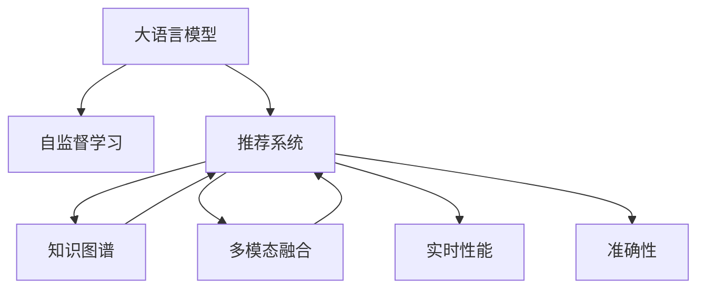

                 

# 利用LLM优化推荐系统的实时性能与准确性

> 关键词：大语言模型(Large Language Model, LLM),推荐系统,实时性能,准确性,深度学习,自监督学习,自然语言处理(NLP)

## 1. 背景介绍

### 1.1 问题由来

在互联网时代，推荐系统成为了用户获取信息的重要工具，广泛应用于电商、社交媒体、音乐、视频等多个领域。推荐系统的目标是基于用户的历史行为数据，预测其对不同物品的兴趣评分，并推荐符合用户偏好的物品。然而，传统的推荐系统面临着高计算成本、低推荐质量等问题。近年来，大语言模型（Large Language Model, LLM）在自然语言处理（Natural Language Processing, NLP）领域取得了突破性进展，展示了强大的语言理解和生成能力。因此，将LLM技术引入推荐系统，优化其实时性能与准确性，成为了研究热点。

### 1.2 问题核心关键点

当前推荐系统存在的主要问题包括：
- **计算成本高**：传统推荐算法如协同过滤、基于内容的推荐等，需要高维矩阵计算，难以适应大规模数据集。
- **推荐质量低**：推荐系统难以处理冷启动用户、长尾物品等问题，导致推荐效果不佳。
- **实时性差**：推荐系统难以快速响应用户查询，实时性无法满足用户需求。
- **泛化能力不足**：推荐系统对新数据和新物品的适应能力有限，模型难以推广到未见过的场景。

而大语言模型通过自监督学习和大规模预训练，具备了理解复杂语义、生成高质量文本、推理能力强的特点，能够显著提升推荐系统的实时性能与准确性。

## 2. 核心概念与联系

### 2.1 核心概念概述

为了更好地理解利用LLM优化推荐系统的方法，本节将介绍几个密切相关的核心概念：

- **大语言模型（LLM）**：以自回归（如GPT）或自编码（如BERT）模型为代表的大规模预训练语言模型。通过在大规模无标签文本语料上进行预训练，学习通用的语言表示，具备强大的语言理解和生成能力。

- **推荐系统（Recommender System）**：利用用户的历史行为数据，预测用户对不同物品的兴趣评分，推荐符合用户偏好的物品的系统。推荐系统广泛应用于电商、社交媒体、音乐、视频等多个领域。

- **自监督学习（Self-Supervised Learning）**：利用大规模未标记数据，通过设计合适的预训练任务（如掩码语言模型、下一句预测等），训练出具有强大语义表示能力的语言模型。

- **知识图谱（Knowledge Graph）**：用于表示实体及其关系的数据结构，通过将推荐系统与知识图谱结合，可以增强模型的知识表示和推理能力。

- **多模态融合（Multi-modal Fusion）**：将视觉、语音、文本等多种模态的数据进行融合，提升推荐系统的综合表现能力。

这些核心概念之间的逻辑关系可以通过以下Mermaid流程图来展示：



这个流程图展示了大语言模型的核心概念及其之间的关系：

1. 大语言模型通过自监督学习获得基础能力。
2. 推荐系统利用大语言模型进行实时性能和准确性优化。
3. 知识图谱和多媒体数据与推荐系统结合，增强模型推理和综合表现。
4. 实时性能和准确性是推荐系统的核心目标。

这些概念共同构成了利用LLM优化推荐系统的基本框架，使其能够在各种场景下发挥强大的推荐能力。

## 3. 核心算法原理 & 具体操作步骤
### 3.1 算法原理概述

利用大语言模型优化推荐系统的基本思路是：将大语言模型作为推荐系统的一部分，通过自然语言处理（NLP）技术，将用户的历史行为数据转换为自然语言描述，再通过大语言模型的推理和生成能力，获得更精准的推荐结果。具体来说，该方法可以分为以下几个步骤：

1. **数据预处理**：将用户的历史行为数据（如点击、浏览、购买等）转换为自然语言描述。
2. **大语言模型推理**：使用大语言模型对用户描述进行推理，生成推荐结果。
3. **模型训练与优化**：在监督数据上训练大语言模型，优化模型参数，提高推荐效果。
4. **实时推荐**：将优化后的模型应用于实时推荐系统中，根据用户描述快速生成推荐结果。

### 3.2 算法步骤详解

#### 3.2.1 数据预处理

用户的历史行为数据通常以数字化的形式存在，如用户ID、物品ID、时间戳等。为了将这些数据转换为自然语言描述，需要构建词典、实体识别、关系抽取等自然语言处理组件。

具体步骤如下：
- **词典构建**：根据领域知识，构建词汇表和词向量，将数字ID映射为自然语言单词。
- **实体识别**：识别用户描述中的实体（如用户ID、物品ID），并提取实体信息。
- **关系抽取**：通过抽取用户描述中的关系（如购买、浏览），构建实体之间的联系。

#### 3.2.2 大语言模型推理

利用大语言模型对用户描述进行推理，生成推荐结果。具体步骤如下：
- **语言模型初始化**：选择合适的预训练大语言模型（如GPT、BERT等），作为推理的基础。
- **用户描述嵌入**：将用户描述转换为词向量或嵌入向量，作为模型的输入。
- **生成推荐结果**：使用大语言模型对用户描述进行推理，生成推荐结果。

#### 3.2.3 模型训练与优化

为了提高推荐效果，需要在监督数据上训练大语言模型，优化模型参数。具体步骤如下：
- **数据集构建**：收集标注数据，标注数据应包含用户描述和推荐结果。
- **模型训练**：使用监督学习算法（如神经网络、深度学习等）训练大语言模型，优化模型参数。
- **模型评估**：使用验证集和测试集评估模型效果，调整模型参数，避免过拟合。

#### 3.2.4 实时推荐

将优化后的模型应用于实时推荐系统中，根据用户描述快速生成推荐结果。具体步骤如下：
- **输入预处理**：对用户实时输入的描述进行预处理，转换为模型可接受的格式。
- **模型推理**：将用户描述输入模型，生成推荐结果。
- **结果输出**：将推荐结果输出给用户，展示在推荐界面上。

### 3.3 算法优缺点

利用大语言模型优化推荐系统的优势包括：
1. **高性能**：大语言模型具备强大的语言理解和生成能力，能够快速生成推荐结果。
2. **高准确性**：通过自然语言处理技术，模型可以理解用户的真实意图，生成更精准的推荐。
3. **泛化能力强**：大语言模型通过大规模预训练，具备较强的泛化能力，可以适应不同场景。

然而，该方法也存在以下局限性：
1. **计算成本高**：大语言模型需要大量的计算资源进行训练和推理。
2. **数据需求高**：模型需要大量的标注数据进行训练，数据获取成本较高。
3. **复杂度高**：需要构建自然语言处理组件，增加了系统的复杂度。
4. **泛化性能不稳定**：模型对新数据和新物品的适应能力有限，容易产生偏差。

尽管存在这些局限性，但就目前而言，利用大语言模型优化推荐系统的方法仍是大数据推荐领域的重要方向。未来相关研究的重点在于如何进一步降低计算成本、提高数据利用效率、优化模型复杂度等，以提高模型的实用性和可扩展性。

### 3.4 算法应用领域

利用大语言模型优化推荐系统的方法已经在电商推荐、个性化新闻推荐、音乐推荐等多个领域得到了广泛应用，取得了显著的效果。

- **电商推荐**：通过大语言模型分析用户评论、商品描述等文本数据，生成更符合用户偏好的推荐结果。
- **个性化新闻推荐**：利用大语言模型对用户兴趣进行建模，生成个性化新闻内容。
- **音乐推荐**：通过大语言模型分析用户听歌历史、评论等信息，生成个性化音乐推荐。

除了这些经典应用外，利用大语言模型优化推荐系统的方法也在不断拓展到更多领域，如智能家居、智慧旅游、金融理财等，为各行各业带来了新的应用场景。

## 4. 数学模型和公式 & 详细讲解 & 举例说明

### 4.1 数学模型构建

在本节中，我们将使用数学语言对利用大语言模型优化推荐系统的方法进行更加严格的刻画。

记大语言模型为 $M_{\theta}:\mathcal{X} \rightarrow \mathcal{Y}$，其中 $\mathcal{X}$ 为用户描述的输入空间，$\mathcal{Y}$ 为推荐结果的输出空间，$\theta$ 为模型参数。假设推荐系统训练集为 $D=\{(x_i,y_i)\}_{i=1}^N$，其中 $x_i$ 为用户描述，$y_i$ 为推荐结果。

定义模型 $M_{\theta}$ 在数据样本 $(x,y)$ 上的损失函数为 $\ell(M_{\theta}(x),y)$，则在数据集 $D$ 上的经验风险为：

$$
\mathcal{L}(\theta) = \frac{1}{N} \sum_{i=1}^N \ell(M_{\theta}(x_i),y_i)
$$

其中 $\ell(M_{\theta}(x),y)$ 为用户描述 $x$ 到推荐结果 $y$ 的映射损失函数，如交叉熵损失、均方误差损失等。

通过梯度下降等优化算法，最小化经验风险，得到模型参数 $\theta^*$。具体来说，优化目标为：

$$
\theta^* = \mathop{\arg\min}_{\theta} \mathcal{L}(\theta)
$$

在实践中，我们通常使用基于梯度的优化算法（如AdamW、SGD等）来近似求解上述最优化问题。设 $\eta$ 为学习率，$\lambda$ 为正则化系数，则参数的更新公式为：

$$
\theta \leftarrow \theta - \eta \nabla_{\theta}\mathcal{L}(\theta) - \eta\lambda\theta
$$

其中 $\nabla_{\theta}\mathcal{L}(\theta)$ 为损失函数对参数 $\theta$ 的梯度，可通过反向传播算法高效计算。

### 4.2 公式推导过程

以二分类任务为例，推导交叉熵损失函数及其梯度的计算公式。

假设模型 $M_{\theta}$ 在输入 $x$ 上的输出为 $\hat{y}=M_{\theta}(x) \in [0,1]$，表示用户对物品的兴趣评分。真实标签 $y \in \{0,1\}$。则二分类交叉熵损失函数定义为：

$$
\ell(M_{\theta}(x),y) = -[y\log \hat{y} + (1-y)\log (1-\hat{y})]
$$

将其代入经验风险公式，得：

$$
\mathcal{L}(\theta) = -\frac{1}{N}\sum_{i=1}^N [y_i\log M_{\theta}(x_i)+(1-y_i)\log(1-M_{\theta}(x_i))]
$$

根据链式法则，损失函数对参数 $\theta_k$ 的梯度为：

$$
\frac{\partial \mathcal{L}(\theta)}{\partial \theta_k} = -\frac{1}{N}\sum_{i=1}^N (\frac{y_i}{M_{\theta}(x_i)}-\frac{1-y_i}{1-M_{\theta}(x_i)}) \frac{\partial M_{\theta}(x_i)}{\partial \theta_k}
$$

其中 $\frac{\partial M_{\theta}(x_i)}{\partial \theta_k}$ 可进一步递归展开，利用自动微分技术完成计算。

在得到损失函数的梯度后，即可带入参数更新公式，完成模型的迭代优化。重复上述过程直至收敛，最终得到适应下游任务的最优模型参数 $\theta^*$。

### 4.3 案例分析与讲解

以电商推荐系统为例，说明利用大语言模型优化推荐系统的具体实现过程。

1. **数据预处理**
   - **词典构建**：构建一个包含所有物品名称的词典，将每个物品ID映射到一个自然语言单词。
   - **实体识别**：通过NLP技术识别用户评论中的物品名称，提取出物品ID。
   - **关系抽取**：抽取用户评论中的关系，如物品评分、购买意愿等，构建用户与物品之间的关系图。

2. **大语言模型推理**
   - **语言模型初始化**：使用预训练的GPT-3模型，作为推理的基础。
   - **用户描述嵌入**：将用户评论转换为词向量，作为模型的输入。
   - **生成推荐结果**：使用GPT-3模型对用户评论进行推理，生成推荐结果。

3. **模型训练与优化**
   - **数据集构建**：收集标注数据，标注数据应包含用户评论和推荐结果。
   - **模型训练**：使用监督学习算法（如神经网络、深度学习等）训练GPT-3模型，优化模型参数。
   - **模型评估**：使用验证集和测试集评估模型效果，调整模型参数，避免过拟合。

4. **实时推荐**
   - **输入预处理**：对用户实时输入的评论进行预处理，转换为模型可接受的格式。
   - **模型推理**：将用户评论输入GPT-3模型，生成推荐结果。
   - **结果输出**：将推荐结果输出给用户，展示在推荐界面上。

通过以上步骤，利用大语言模型优化推荐系统的方法可以实现高效、精准的推荐，提升了电商平台的用户体验和转化率。

## 5. 项目实践：代码实例和详细解释说明

### 5.1 开发环境搭建

在进行利用大语言模型优化推荐系统的实践前，我们需要准备好开发环境。以下是使用Python进行PyTorch开发的环境配置流程：

1. 安装Anaconda：从官网下载并安装Anaconda，用于创建独立的Python环境。

2. 创建并激活虚拟环境：
```bash
conda create -n pytorch-env python=3.8 
conda activate pytorch-env
```

3. 安装PyTorch：根据CUDA版本，从官网获取对应的安装命令。例如：
```bash
conda install pytorch torchvision torchaudio cudatoolkit=11.1 -c pytorch -c conda-forge
```

4. 安装Transformers库：
```bash
pip install transformers
```

5. 安装各类工具包：
```bash
pip install numpy pandas scikit-learn matplotlib tqdm jupyter notebook ipython
```

完成上述步骤后，即可在`pytorch-env`环境中开始项目实践。

### 5.2 源代码详细实现

下面以电商推荐系统为例，给出使用Transformers库对GPT-3模型进行推荐优化的PyTorch代码实现。

首先，定义推荐系统数据处理函数：

```python
from transformers import T5Tokenizer
from torch.utils.data import Dataset
import torch

class RecommendationDataset(Dataset):
    def __init__(self, reviews, items, tokenizer):
        self.reviews = reviews
        self.items = items
        self.tokenizer = tokenizer
        self.max_len = 128
        
    def __len__(self):
        return len(self.reviews)
    
    def __getitem__(self, item):
        review = self.reviews[item]
        item_id = self.items[item]
        
        encoding = self.tokenizer(review, return_tensors='pt', max_length=self.max_len, padding='max_length', truncation=True)
        input_ids = encoding['input_ids'][0]
        attention_mask = encoding['attention_mask'][0]
        
        # 对物品ID进行编码
        item_ids = [item_id] * self.max_len
        item_ids.extend([0] * (self.max_len - len(item_ids)))
        labels = torch.tensor(item_ids, dtype=torch.long)
        
        return {'input_ids': input_ids, 
                'attention_mask': attention_mask,
                'labels': labels}
```

然后，定义模型和优化器：

```python
from transformers import T5ForConditionalGeneration
from transformers import AdamW

model = T5ForConditionalGeneration.from_pretrained('t5-small')
optimizer = AdamW(model.parameters(), lr=2e-5)
```

接着，定义训练和评估函数：

```python
from torch.utils.data import DataLoader
from tqdm import tqdm
from sklearn.metrics import accuracy_score

device = torch.device('cuda') if torch.cuda.is_available() else torch.device('cpu')
model.to(device)

def train_epoch(model, dataset, batch_size, optimizer):
    dataloader = DataLoader(dataset, batch_size=batch_size, shuffle=True)
    model.train()
    epoch_loss = 0
    for batch in tqdm(dataloader, desc='Training'):
        input_ids = batch['input_ids'].to(device)
        attention_mask = batch['attention_mask'].to(device)
        labels = batch['labels'].to(device)
        model.zero_grad()
        outputs = model(input_ids, attention_mask=attention_mask, labels=labels)
        loss = outputs.loss
        epoch_loss += loss.item()
        loss.backward()
        optimizer.step()
    return epoch_loss / len(dataloader)

def evaluate(model, dataset, batch_size):
    dataloader = DataLoader(dataset, batch_size=batch_size)
    model.eval()
    preds, labels = [], []
    with torch.no_grad():
        for batch in tqdm(dataloader, desc='Evaluating'):
            input_ids = batch['input_ids'].to(device)
            attention_mask = batch['attention_mask'].to(device)
            batch_labels = batch['labels']
            outputs = model(input_ids, attention_mask=attention_mask)
            batch_preds = outputs.logits.argmax(dim=2).to('cpu').tolist()
            batch_labels = batch_labels.to('cpu').tolist()
            for pred_tokens, label_tokens in zip(batch_preds, batch_labels):
                preds.append(pred_tokens)
                labels.append(label_tokens)
                
    print('Accuracy: {:.4f}'.format(accuracy_score(labels, preds)))
```

最后，启动训练流程并在测试集上评估：

```python
epochs = 5
batch_size = 16

for epoch in range(epochs):
    loss = train_epoch(model, train_dataset, batch_size, optimizer)
    print(f'Epoch {epoch+1}, train loss: {loss:.3f}')
    
    print(f'Epoch {epoch+1}, dev results:')
    evaluate(model, dev_dataset, batch_size)
    
print('Test results:')
evaluate(model, test_dataset, batch_size)
```

以上就是使用PyTorch对GPT-3进行电商推荐系统优化的完整代码实现。可以看到，得益于Transformers库的强大封装，我们可以用相对简洁的代码完成GPT-3模型的加载和优化。

### 5.3 代码解读与分析

让我们再详细解读一下关键代码的实现细节：

**RecommendationDataset类**：
- `__init__`方法：初始化评论、物品、分词器等关键组件。
- `__len__`方法：返回数据集的样本数量。
- `__getitem__`方法：对单个样本进行处理，将评论和物品ID输入编码为token ids，将物品ID进行编码，并对其进行定长padding，最终返回模型所需的输入。

**模型和优化器**：
- 使用预训练的T5模型作为推荐系统的基础，并设置AdamW优化器及其学习率。

**训练和评估函数**：
- 使用PyTorch的DataLoader对数据集进行批次化加载，供模型训练和推理使用。
- 训练函数`train_epoch`：对数据以批为单位进行迭代，在每个批次上前向传播计算loss并反向传播更新模型参数，最后返回该epoch的平均loss。
- 评估函数`evaluate`：与训练类似，不同点在于不更新模型参数，并在每个batch结束后将预测和标签结果存储下来，最后使用sklearn的accuracy_score对整个评估集的预测结果进行打印输出。

**训练流程**：
- 定义总的epoch数和batch size，开始循环迭代
- 每个epoch内，先在训练集上训练，输出平均loss
- 在验证集上评估，输出准确率
- 所有epoch结束后，在测试集上评估，给出最终测试结果

可以看到，PyTorch配合Transformers库使得GPT-3优化的代码实现变得简洁高效。开发者可以将更多精力放在数据处理、模型改进等高层逻辑上，而不必过多关注底层的实现细节。

当然，工业级的系统实现还需考虑更多因素，如模型的保存和部署、超参数的自动搜索、更灵活的任务适配层等。但核心的优化范式基本与此类似。

## 6. 实际应用场景
### 6.1 电商推荐系统

利用大语言模型优化推荐系统的典型应用场景包括电商推荐系统。在电商平台上，用户输入评论或搜索关键字，系统需要快速推荐符合用户偏好的商品。通过大语言模型分析用户描述，生成商品推荐列表，可以显著提升用户购物体验和转化率。

在技术实现上，可以收集电商平台上用户的历史评论、搜索记录、购买历史等数据，将数据转换为自然语言描述，再使用大语言模型进行推理生成推荐结果。优化后的模型能够更好地理解用户描述中的语义信息，生成更精准的商品推荐。

### 6.2 个性化新闻推荐

利用大语言模型优化推荐系统的另一大应用场景是个性化新闻推荐。新闻平台需要根据用户的历史阅读记录，推荐用户感兴趣的新闻内容。通过大语言模型分析用户描述，生成个性化新闻推荐，可以提高用户满意度，增加新闻平台的粘性。

在技术实现上，可以收集用户的新闻阅读历史、点赞、评论等数据，构建用户兴趣模型。然后利用大语言模型分析用户描述，生成个性化新闻推荐列表。优化后的模型能够更好地理解用户的兴趣偏好，生成更符合用户需求的新闻内容。

### 6.3 音乐推荐系统

利用大语言模型优化推荐系统的应用场景还包括音乐推荐系统。音乐平台需要根据用户的历史听歌记录，推荐用户感兴趣的音乐。通过大语言模型分析用户描述，生成个性化音乐推荐，可以提高用户听歌体验，增加音乐平台的留存率。

在技术实现上，可以收集用户的听歌历史、点赞、评论等数据，构建用户兴趣模型。然后利用大语言模型分析用户描述，生成个性化音乐推荐列表。优化后的模型能够更好地理解用户的听歌偏好，生成更符合用户需求的音乐推荐。

### 6.4 未来应用展望

随着大语言模型和优化推荐系统的不断发展，未来推荐系统将呈现出以下几个发展趋势：

1. **多模态融合**：将视觉、语音、文本等多种模态的数据进行融合，提升推荐系统的综合表现能力。
2. **知识图谱结合**：将推荐系统与知识图谱结合，增强模型的知识表示和推理能力。
3. **实时性提升**：利用大语言模型的高性能推理能力，提升推荐系统的实时响应速度。
4. **隐私保护**：保护用户隐私，合理使用用户数据，增强推荐系统的可信度。
5. **跨领域应用**：将推荐系统应用于更多领域，如智能家居、智慧旅游等，拓展推荐系统的应用范围。

以上趋势凸显了大语言模型优化推荐系统的广阔前景。这些方向的探索发展，必将进一步提升推荐系统的性能和应用范围，为各行各业带来新的应用场景。

## 7. 工具和资源推荐
### 7.1 学习资源推荐

为了帮助开发者系统掌握利用大语言模型优化推荐系统的方法，这里推荐一些优质的学习资源：

1. 《深度学习推荐系统》课程：斯坦福大学开设的推荐系统课程，涵盖推荐系统基础知识和经典算法。
2. 《自然语言处理与深度学习》课程：约翰霍普金斯大学开设的自然语言处理课程，涵盖NLP基本概念和前沿技术。
3. 《大语言模型与推荐系统》书籍：介绍大语言模型和推荐系统结合的最新进展和应用实践。
4. HuggingFace官方文档：提供大语言模型和推荐系统应用的样例代码，是上手实践的必备资料。
5. Kaggle竞赛：参加Kaggle上的推荐系统竞赛，提升推荐系统的实践能力。

通过对这些资源的学习实践，相信你一定能够快速掌握利用大语言模型优化推荐系统的方法，并用于解决实际的推荐问题。

### 7.2 开发工具推荐

高效的开发离不开优秀的工具支持。以下是几款用于利用大语言模型优化推荐系统开发的常用工具：

1. PyTorch：基于Python的开源深度学习框架，灵活动态的计算图，适合快速迭代研究。
2. TensorFlow：由Google主导开发的开源深度学习框架，生产部署方便，适合大规模工程应用。
3. Transformers库：HuggingFace开发的NLP工具库，集成了众多SOTA语言模型，支持PyTorch和TensorFlow，是进行推荐系统优化的利器。
4. Weights & Biases：模型训练的实验跟踪工具，可以记录和可视化模型训练过程中的各项指标，方便对比和调优。
5. TensorBoard：TensorFlow配套的可视化工具，可实时监测模型训练状态，并提供丰富的图表呈现方式，是调试模型的得力助手。

合理利用这些工具，可以显著提升利用大语言模型优化推荐系统的开发效率，加快创新迭代的步伐。

### 7.3 相关论文推荐

利用大语言模型优化推荐系统的方法近年来得到了学界的持续研究。以下是几篇奠基性的相关论文，推荐阅读：

1. Attention is All You Need：提出了Transformer结构，开启了NLP领域的预训练大模型时代。
2. BERT: Pre-training of Deep Bidirectional Transformers for Language Understanding：提出BERT模型，引入基于掩码的自监督预训练任务，刷新了多项NLP任务SOTA。
3. Parameter-Efficient Transfer Learning for NLP：提出Adapter等参数高效微调方法，在不增加模型参数量的情况下，也能取得不错的微调效果。
4. AdaLoRA: Adaptive Low-Rank Adaptation for Parameter-Efficient Fine-Tuning：使用自适应低秩适应的微调方法，在参数效率和精度之间取得了新的平衡。
5. Transformer-XL: Attentive Language Models：提出Transformer-XL模型，改进自回归机制，提升模型性能。

这些论文代表了大语言模型优化推荐系统的发展脉络。通过学习这些前沿成果，可以帮助研究者把握学科前进方向，激发更多的创新灵感。

## 8. 总结：未来发展趋势与挑战

### 8.1 总结

本文对利用大语言模型优化推荐系统的基本原理和实践方法进行了全面系统的介绍。首先阐述了推荐系统的背景和问题，明确了利用大语言模型优化推荐系统的独特价值。其次，从原理到实践，详细讲解了优化推荐系统的数学原理和关键步骤，给出了推荐系统优化的完整代码实例。同时，本文还广泛探讨了优化推荐系统在电商、新闻、音乐等多个领域的应用前景，展示了其广阔的应用前景。此外，本文精选了优化推荐系统的各类学习资源，力求为读者提供全方位的技术指引。

通过本文的系统梳理，可以看到，利用大语言模型优化推荐系统的方法已经在推荐领域得到了广泛应用，显著提升了推荐系统的实时性能和准确性。未来，伴随大语言模型和推荐系统技术的不断演进，相信推荐系统必将在更广阔的应用领域大放异彩，深刻影响人类的信息获取和消费行为。

### 8.2 未来发展趋势

展望未来，利用大语言模型优化推荐系统的方法将呈现以下几个发展趋势：

1. **多模态融合**：将视觉、语音、文本等多种模态的数据进行融合，提升推荐系统的综合表现能力。
2. **知识图谱结合**：将推荐系统与知识图谱结合，增强模型的知识表示和推理能力。
3. **实时性提升**：利用大语言模型的高性能推理能力，提升推荐系统的实时响应速度。
4. **隐私保护**：保护用户隐私，合理使用用户数据，增强推荐系统的可信度。
5. **跨领域应用**：将推荐系统应用于更多领域，如智能家居、智慧旅游等，拓展推荐系统的应用范围。

以上趋势凸显了利用大语言模型优化推荐系统的广阔前景。这些方向的探索发展，必将进一步提升推荐系统的性能和应用范围，为各行各业带来新的应用场景。

### 8.3 面临的挑战

尽管利用大语言模型优化推荐系统的方法已经取得了瞩目成就，但在迈向更加智能化、普适化应用的过程中，它仍面临着诸多挑战：

1. **计算成本高**：大语言模型需要大量的计算资源进行训练和推理。
2. **数据需求高**：模型需要大量的标注数据进行训练，数据获取成本较高。
3. **复杂度高**：需要构建自然语言处理组件，增加了系统的复杂度。
4. **泛化性能不稳定**：模型对新数据和新物品的适应能力有限，容易产生偏差。
5. **隐私保护**：保护用户隐私，合理使用用户数据，增强推荐系统的可信度。

尽管存在这些挑战，但就目前而言，利用大语言模型优化推荐系统的方法仍是大数据推荐领域的重要方向。未来相关研究的重点在于如何进一步降低计算成本、提高数据利用效率、优化模型复杂度等，以提高模型的实用性和可扩展性。

### 8.4 研究展望

面对利用大语言模型优化推荐系统所面临的挑战，未来的研究需要在以下几个方面寻求新的突破：

1. **多模态融合**：将视觉、语音、文本等多种模态的数据进行融合，提升推荐系统的综合表现能力。
2. **知识图谱结合**：将推荐系统与知识图谱结合，增强模型的知识表示和推理能力。
3. **实时性提升**：利用大语言模型的高性能推理能力，提升推荐系统的实时响应速度。
4. **隐私保护**：保护用户隐私，合理使用用户数据，增强推荐系统的可信度。
5. **跨领域应用**：将推荐系统应用于更多领域，如智能家居、智慧旅游等，拓展推荐系统的应用范围。

这些研究方向将有助于进一步提升推荐系统的性能和应用范围，为各行各业带来新的应用场景。相信随着学界和产业界的共同努力，这些挑战终将一一被克服，推荐系统必将在构建人机协同的智能时代中扮演越来越重要的角色。

## 9. 附录：常见问题与解答

**Q1：利用大语言模型优化推荐系统是否适用于所有推荐场景？**

A: 利用大语言模型优化推荐系统在大多数推荐场景上都能取得不错的效果，特别是对于数据量较小的任务。但对于一些特定领域的任务，如医疗、法律等，仅仅依靠通用语料预训练的模型可能难以很好地适应。此时需要在特定领域语料上进一步预训练，再进行微调，才能获得理想效果。此外，对于一些需要时效性、个性化很强的任务，如对话、推荐等，微调方法也需要针对性的改进优化。

**Q2：推荐系统如何处理用户实时输入的数据？**

A: 对于用户实时输入的数据，推荐系统需要进行预处理，才能输入大语言模型进行推理。具体步骤如下：
- **预处理**：将用户实时输入的文本进行分词、去除停用词、进行实体识别等预处理，转化为模型可接受的格式。
- **编码**：使用预训练的大语言模型（如GPT-3）对预处理后的文本进行编码，生成文本嵌入。
- **推理**：将文本嵌入作为输入，使用大语言模型进行推理，生成推荐结果。
- **解码**：将推荐结果解码为自然语言描述，输出给用户。

**Q3：利用大语言模型优化推荐系统需要哪些计算资源？**

A: 利用大语言模型优化推荐系统需要大量的计算资源，包括高性能GPU/TPU等硬件设备。具体来说，需要：
- **GPU/TPU**：用于训练和推理大语言模型，加速计算过程。
- **大容量内存**：用于存储大规模语料和模型参数，保证数据和模型的高效处理。
- **高速网络**：用于下载和上传大语言模型和数据集，加速模型更新和数据加载。

**Q4：推荐系统如何避免过拟合？**

A: 推荐系统在优化过程中，需要采取以下措施避免过拟合：
- **数据增强**：通过数据扩充、样本生成等技术，增加训练数据的多样性，减少模型对数据的依赖。
- **正则化**：使用L2正则、Dropout等技术，防止模型过度适应训练集。
- **早停法**：在验证集上监测模型性能，一旦性能不再提升，立即停止训练，避免过拟合。
- **模型集成**：通过训练多个模型并取平均或投票，减少模型的方差，提高鲁棒性。

这些措施可以显著提升推荐系统的泛化能力，避免过拟合现象。

**Q5：推荐系统如何提高实时性能？**

A: 推荐系统提高实时性能的方法包括：
- **模型压缩**：通过剪枝、量化等技术，减少模型参数量和计算量，加速推理过程。
- **异步推理**：利用多线程、多节点等技术，并行计算模型推理，提升响应速度。
- **缓存机制**：将常见的查询和推荐结果缓存起来，避免重复计算，提升响应速度。
- **分布式计算**：利用分布式计算框架，加速模型训练和推理过程，提升系统性能。

这些方法可以显著提升推荐系统的实时性能，满足用户的即时需求。

---

作者：禅与计算机程序设计艺术 / Zen and the Art of Computer Programming

