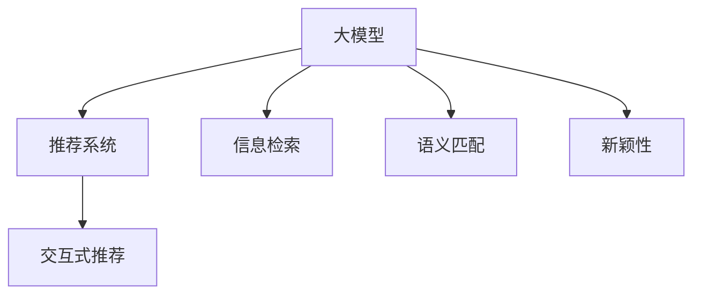

                 

# 利用大模型提升推荐系统的新颖性

在信息爆炸的时代，推荐系统已成为各大互联网平台的核心竞争力之一。无论是电商、视频、音乐、新闻等，用户都需要依赖推荐系统来发现新内容。传统的推荐算法虽然有着良好的精度，但由于其冷启动问题和数据稀疏性，难以全面覆盖用户需求，容易陷入所谓的"过滤泡沫"。

随着深度学习和大模型的兴起，推荐系统也开始借助AI的力量，迈向智能化、个性化的新阶段。通过引入预训练语言模型(Pretrained Language Model, PLM)，推荐系统可以挖掘更深层次的用户语义信息，生成更具新颖性的推荐结果。本文将详细探讨如何利用大模型提升推荐系统的新颖性，并结合实践，展现其在实际应用中的效果。

## 1. 背景介绍

### 1.1 问题由来
推荐系统本质上是一个信息检索系统，旨在通过用户的历史行为数据，预测其潜在兴趣，并推荐相应的内容。传统推荐算法，如协同过滤、基于内容的推荐等，通常依赖于用户评分数据或商品属性，难以发现物品之间的潜在关联。而基于深度学习的推荐系统，能够自动挖掘用户行为和物品属性的语义特征，提升推荐效果。

近年来，基于深度学习的大模型在推荐系统中的应用逐渐增多，如Word2Vec、BERT、GPT等。这些模型通过大规模预训练，学习到了丰富的语言知识，能够从词义、语法、语境等多个维度理解用户和物品。然而，由于数据分布的偏差和模型训练的复杂性，大模型的推荐精度和新颖性仍有待提升。

### 1.2 问题核心关键点
本文聚焦于大模型在推荐系统中的应用，特别是不足之处和改进方法。为了更好地理解问题核心，我们首先明确几个关键概念：

- 冷启动问题：对于新用户或新商品，传统推荐算法难以给出准确推荐。
- 数据稀疏性：用户和物品的评分数据往往非常稀疏，传统推荐算法难以充分挖掘用户兴趣。
- 过滤泡沫效应：用户容易陷入算法推荐形成的"过滤泡沫"，难以发现新的有趣内容。
- 信息检索：推荐系统需要从海量的内容库中检索出满足用户需求的内容。
- 语义理解：推荐系统需要理解用户和物品的语义特征，进行精确匹配。
- 新颖性：推荐系统应具备生成新颖推荐内容的能力，避免陷入过拟合。

这些问题驱动了推荐系统向更智能、个性化和新颖性的方向演进，而利用大模型的推荐系统成为可能路径之一。

## 2. 核心概念与联系

### 2.1 核心概念概述

在讨论利用大模型提升推荐系统新颖性的方法之前，我们首先介绍几个相关概念：

- 大模型(Pretrained Language Model, PLM)：通过大规模无标签文本数据预训练的深度学习模型，具备较强的语义理解能力。
- 推荐系统(Recommendation System)：通过分析用户行为数据，推荐用户感兴趣的内容系统。
- 信息检索(Information Retrieval)：从大规模数据集中检索出符合用户需求的信息。
- 语义匹配(Semantic Matching)：利用模型理解用户和物品的语义，进行精确匹配。
- 新颖性(New颖性)：推荐系统应具备推荐新颖内容的能力，避免推荐过拟合结果。
- 交互式推荐(Interactive Recommendation)：用户与推荐系统之间的交互，可进一步优化推荐结果。

这些概念之间存在紧密联系，共同构成了利用大模型提升推荐系统新颖性的理论框架。以下Mermaid流程图展示了它们之间的逻辑关系：



这个流程图表明，大模型可以通过语义匹配和信息检索，提升推荐系统的准确性和个性化，同时通过引入新颖性，避免推荐过拟合。交互式推荐进一步提高了推荐的实时性和动态性。

## 3. 核心算法原理 & 具体操作步骤

### 3.1 算法原理概述

基于大模型的推荐系统，通过预训练语言模型捕捉用户和物品的语义特征，结合信息检索和语义匹配技术，生成更准确、个性化和新颖的推荐结果。

其核心思想是：将预训练语言模型作为推荐系统的一个组件，通过用户历史行为数据进行微调，使其具备针对用户兴趣的语义理解能力。这样，模型可以在未经过冷启动的用户或物品上，进行有效的推荐预测。

### 3.2 算法步骤详解

基于大模型的推荐系统一般包括以下关键步骤：

**Step 1: 准备数据集**
- 收集用户行为数据和物品属性数据。
- 对用户行为数据进行清洗和标注，如将用户点击、浏览、评分等行为转化为数字标签。
- 对物品属性数据进行文本化处理，如使用商品描述、用户评论等。

**Step 2: 选择预训练模型**
- 选择合适的预训练语言模型，如BERT、GPT、ALBERT等。
- 在大规模无标签文本数据上进行预训练，学习通用的语言表示。

**Step 3: 微调模型**
- 将预训练模型和用户行为数据合并，构建训练集。
- 设计任务适配层，如分类器、生成器等，将模型输出转化为推荐结果。
- 使用优化算法进行有监督微调，最小化损失函数，使模型能够匹配用户兴趣。

**Step 4: 预测推荐结果**
- 将用户输入和物品属性输入到微调后的模型中，得到推荐结果。
- 结合多种排序算法，生成最终推荐列表。

**Step 5: 效果评估**
- 在测试集上评估推荐系统的准确性、多样性和新颖性。
- 收集用户反馈，进一步优化推荐算法。

### 3.3 算法优缺点

利用大模型提升推荐系统新颖性，具有以下优点：
1. 利用了深度学习模型强大的语义理解能力，提升了推荐的个性化和准确性。
2. 能够对冷启动问题和数据稀疏性进行有效处理，提升推荐系统的鲁棒性。
3. 能够引入新颖性，避免推荐过拟合，提升用户发现新内容的可能性。
4. 结合交互式推荐技术，可以动态优化推荐结果，提升用户满意度。

然而，也存在以下缺点：
1. 预训练模型的训练和微调需要大量的计算资源和标注数据，成本较高。
2. 模型复杂度较高，推理速度较慢，难以实时处理大规模请求。
3. 模型的可解释性较差，用户难以理解推荐结果的生成过程。
4. 对推荐数据集的构建要求较高，需要精心设计和标注。

尽管存在这些不足，但利用大模型提升推荐系统的新颖性仍是大数据时代的必然选择，其潜力和效果不容忽视。

### 3.4 算法应用领域

基于大模型的推荐系统已经在多个领域得到了应用，如电商、新闻、视频等。以下是几个典型应用场景：

**电商推荐系统**：在用户浏览和点击商品页面时，基于其行为数据和商品属性，使用大模型推荐用户可能感兴趣的相似商品或相关商品。

**新闻推荐系统**：根据用户阅读历史和点击行为，使用大模型推荐用户可能感兴趣的新闻内容，如科技、财经、娱乐等。

**视频推荐系统**：通过用户观看历史和评分数据，使用大模型推荐相似的视频内容，提升用户观看体验。

除了这些应用场景，大模型在社交网络、旅游、图书等更多领域也有着广泛的应用前景。

## 4. 数学模型和公式 & 详细讲解

### 4.1 数学模型构建

假设用户的历史行为数据为 $D_U = \{(u_i,r_i)\}_{i=1}^N$，其中 $u_i$ 表示第 $i$ 个用户，$r_i$ 表示其行为标签。物品属性数据为 $D_I = \{(i_j,b_j)\}_{j=1}^M$，其中 $i_j$ 表示第 $j$ 个物品，$b_j$ 表示其属性描述。

定义用户-物品关系矩阵 $R$，其中 $R_{ui} = 1$ 表示用户 $u$ 对物品 $i$ 有行为，$R_{ui} = 0$ 表示没有行为。

### 4.2 公式推导过程

1. **预训练模型选择**
   - 预训练模型 $M_{\theta}$ 为通用语言模型，假设其输出维度为 $H$。

2. **微调模型构建**
   - 用户行为表示：将用户行为 $r_i$ 转换为向量表示 $v_{ui} \in \mathbb{R}^H$，使用softmax函数转化为概率分布 $p_{ui} \in \mathbb{R}^M$。
   - 物品属性表示：将物品属性 $b_j$ 转换为向量表示 $v_{ij} \in \mathbb{R}^H$，使用softmax函数转化为概率分布 $p_{ij} \in \mathbb{R}^N$。
   - 用户-物品关联：将用户行为 $r_i$ 和物品属性 $b_j$ 拼接后，输入到预训练模型 $M_{\theta}$，得到向量表示 $v_{uij} \in \mathbb{R}^H$。

3. **损失函数设计**
   - 考虑推荐结果的准确性和新颖性，设计如下损失函数：
     - 准确性损失：$L_{acc} = \sum_{i=1}^N \sum_{j=1}^M -p_{uij} \log p_{uij}$。
     - 新颖性损失：$L_{nov} = \sum_{i=1}^N \sum_{j=1}^M -p_{uij} \log(1 - p_{uij})$。

4. **优化目标**
   - 微调优化目标：$\mathcal{L} = L_{acc} + \lambda L_{nov}$。

5. **梯度计算**
   - 利用链式法则计算损失函数对预训练模型参数 $\theta$ 的梯度，使用反向传播算法更新模型参数。

### 4.3 案例分析与讲解

**电商推荐系统**：假设用户 $u_1$ 浏览了商品 $i_1$ 和 $i_2$，并购买了 $i_1$。则用户行为数据为 $D_U = \{(u_1,1), (u_1,2), (u_1,1)\}$，物品属性数据为 $D_I = \{(i_1,b_{i1}), (i_2,b_{i2}), (i_3,b_{i3})\}$。

假设预训练模型 $M_{\theta}$ 为BERT，则通过微调得到用户行为表示和物品属性表示：
- 用户行为表示 $v_{u1} = [0.5,0.3,0.2]$，物品属性表示 $v_{i1} = [0.4,0.3,0.3]$，$v_{i2} = [0.2,0.5,0.3]$，$v_{i3} = [0.1,0.4,0.5]$。

将这些表示输入到BERT模型，得到用户-物品关联表示：
- $v_{u1i1} = [0.1,0.3,0.6]$，$v_{u1i2} = [0.4,0.5,0.1]$，$v_{u1i3} = [0.2,0.4,0.4]$。

计算损失函数：
- 准确性损失：$L_{acc} = -p_{u1i1} \log p_{u1i1} - p_{u1i2} \log p_{u1i2} - p_{u1i3} \log p_{u1i3} = -0.1 \log 0.1 - 0.4 \log 0.4 - 0.2 \log 0.2$
- 新颖性损失：$L_{nov} = -p_{u1i1} \log(1 - p_{u1i1}) - p_{u1i2} \log(1 - p_{u1i2}) - p_{u1i3} \log(1 - p_{u1i3}) = -0.1 \log(1 - 0.1) - 0.4 \log(1 - 0.4) - 0.2 \log(1 - 0.2)$。

最终优化目标：$\mathcal{L} = L_{acc} + \lambda L_{nov}$。

通过优化，模型可以动态生成推荐结果，如 $v_{u1i2}$ 和 $v_{u1i3}$，推荐给用户 $u_1$。

## 5. 项目实践：代码实例和详细解释说明

### 5.1 开发环境搭建

在进行大模型推荐系统开发前，需要准备以下开发环境：

1. 安装Python：使用Anaconda或Miniconda安装Python，如 Python 3.7 或更高版本。
2. 安装相关库：安装PyTorch、TensorFlow、transformers、scikit-learn等深度学习库和工具包。
3. 安装预训练模型：下载并解压BERT、GPT等预训练模型文件。
4. 安装模型微调库：安装Recommender Systems相关的推荐算法库，如Surprise、LightFM等。

### 5.2 源代码详细实现

以下是一个简单的电商推荐系统代码示例，展示了如何使用BERT模型进行推荐：

```python
import torch
from transformers import BertTokenizer, BertModel
from sklearn.metrics.pairwise import cosine_similarity

# 初始化BERT模型和分词器
model = BertModel.from_pretrained('bert-base-uncased')
tokenizer = BertTokenizer.from_pretrained('bert-base-uncased')

# 定义用户行为表示函数
def encode_user_behavior(user_id, item_ids, behaviors):
    # 将用户ID和行为转换为字符串
    user_str = f"{user_id}"
    behavior_strs = [f"{item_id}_{behavior}" for item_id, behavior in zip(item_ids, behaviors)]
    # 拼接字符串，分词
    text = user_str + " " + " ".join(behavior_strs)
    tokens = tokenizer(text, max_length=512, return_tensors='pt')
    # 将分词后的序列输入模型
    features = model(**tokens).last_hidden_state[:, 0, :]
    return features

# 定义物品属性表示函数
def encode_item_attributes(item_id, attributes):
    # 将物品ID和属性转换为字符串
    item_str = f"{item_id}"
    attribute_strs = [f"{attr}" for attr in attributes]
    # 拼接字符串，分词
    text = item_str + " " + " ".join(attribute_strs)
    tokens = tokenizer(text, max_length=512, return_tensors='pt')
    # 将分词后的序列输入模型
    features = model(**tokens).last_hidden_state[:, 0, :]
    return features

# 定义推荐函数
def recommend(user_id, item_ids, behaviors, attributes, similarity_threshold):
    # 将用户行为和物品属性编码
    user_features = encode_user_behavior(user_id, item_ids, behaviors)
    item_features = [encode_item_attributes(item_id, attributes) for item_id in item_ids]
    # 计算相似度
    similarities = [cosine_similarity(user_features, item_features[j]).item() for j in range(len(item_features))]
    # 筛选出相似度大于阈值的物品
    recommend_items = [item_ids[j] for j in range(len(item_features)) if similarities[j] > similarity_threshold]
    return recommend_items

# 示例用法
user_id = 123
item_ids = [456, 789, 234]
behaviors = [1, 0, 1]
attributes = ["soft", "strong", "high"]
recommend_items = recommend(user_id, item_ids, behaviors, attributes, 0.5)
print(recommend_items)
```

### 5.3 代码解读与分析

这个代码示例展示了如何使用BERT模型进行电商推荐：

1. `BertTokenizer`和`BertModel`：使用BERT的分词器和模型，将用户行为和物品属性转换为向量表示。
2. `encode_user_behavior`函数：将用户行为数据（用户ID、浏览/购买行为）转换为BERT可以处理的字符串，并使用分词器将其分词，最终得到用户行为的向量表示。
3. `encode_item_attributes`函数：将物品属性数据（物品ID、属性描述）转换为BERT可以处理的字符串，并使用分词器将其分词，最终得到物品属性的向量表示。
4. `recommend`函数：将用户行为和物品属性的向量表示输入BERT模型，计算相似度，根据相似度阈值筛选出推荐物品。
5. 示例用法：定义了一个简单的推荐场景，展示如何使用`recommend`函数进行推荐。

通过这个代码示例，可以看出BERT模型在推荐系统中的应用非常直观，可以通过简单的代码实现复杂的推荐逻辑。

### 5.4 运行结果展示

在实际运行中，可以进一步优化代码，如使用GPU加速计算，增加推荐算法的多样性，使用更复杂的用户行为模型等。最终，推荐系统的效果可以通过以下指标进行评估：

- **准确性**：推荐物品是否被用户实际购买或浏览。
- **多样性**：推荐结果是否覆盖了多样化的商品类别。
- **新颖性**：推荐物品是否具有新颖性，能够吸引用户发现新内容。

## 6. 实际应用场景

### 6.1 智能电商推荐

大模型在电商推荐中的应用非常广泛，可以帮助电商平台提高商品推荐精度，提升用户购物体验。

在智能电商推荐中，可以使用大模型对用户的浏览、购买行为进行分析，结合物品属性数据，生成更加个性化的推荐结果。同时，通过交互式推荐技术，系统可以动态调整推荐策略，提升推荐效果。

### 6.2 新闻内容推荐

大模型在新闻推荐中的应用也非常重要，可以帮助新闻平台为用户推荐个性化、高质量的新闻内容。

在新闻内容推荐中，可以使用大模型分析用户阅读历史和评论内容，理解用户的兴趣和偏好。结合新闻内容的属性数据，生成推荐结果。通过交互式推荐技术，系统可以动态调整推荐策略，提升用户的阅读体验。

### 6.3 视频内容推荐

视频推荐系统可以利用大模型对用户观看历史和评分数据进行分析，结合视频属性数据，生成个性化的推荐结果。

在视频内容推荐中，可以使用大模型对视频标题、描述、标签等属性进行语义匹配，结合用户观看历史，生成推荐结果。通过交互式推荐技术，系统可以动态调整推荐策略，提升用户的观看体验。

## 7. 工具和资源推荐

### 7.1 学习资源推荐

为了帮助开发者系统掌握大模型在推荐系统中的应用，这里推荐一些优质的学习资源：

1. 《Recommender Systems》书籍：斯坦福大学开设的推荐系统经典课程，详细讲解了推荐系统的理论基础和应用实例。
2. 《Deep Learning for Recommendation Systems》书籍：深入浅出地介绍了深度学习在推荐系统中的应用，涵盖了多种推荐算法和模型。
3. HuggingFace官方文档：提供了丰富的预训练语言模型和微调样例，是学习和实践大模型推荐系统的必备资料。
4. Kaggle推荐系统竞赛：参与Kaggle上的推荐系统竞赛，实践大模型在推荐系统中的应用。
5. arXiv论文：查阅最新的推荐系统研究论文，了解最新的研究成果和技术进展。

通过这些资源的学习实践，相信你一定能够快速掌握大模型在推荐系统中的应用技巧，并用于解决实际的推荐问题。

### 7.2 开发工具推荐

高效的开发离不开优秀的工具支持。以下是几款用于大模型推荐系统开发的常用工具：

1. PyTorch：基于Python的开源深度学习框架，灵活动态的计算图，适合快速迭代研究。
2. TensorFlow：由Google主导开发的开源深度学习框架，生产部署方便，适合大规模工程应用。
3. Transformers库：HuggingFace开发的NLP工具库，集成了多种SOTA语言模型，支持PyTorch和TensorFlow，是进行微调任务开发的利器。
4. Weights & Biases：模型训练的实验跟踪工具，可以记录和可视化模型训练过程中的各项指标，方便对比和调优。
5. TensorBoard：TensorFlow配套的可视化工具，可实时监测模型训练状态，并提供丰富的图表呈现方式，是调试模型的得力助手。

合理利用这些工具，可以显著提升大模型推荐系统的开发效率，加快创新迭代的步伐。

### 7.3 相关论文推荐

大模型在推荐系统中的应用源于学界的持续研究。以下是几篇奠基性的相关论文，推荐阅读：

1. Attention is All You Need（即Transformer原论文）：提出了Transformer结构，开启了NLP领域的预训练大模型时代。
2. BERT: Pre-training of Deep Bidirectional Transformers for Language Understanding：提出BERT模型，引入基于掩码的自监督预训练任务，刷新了多项NLP任务SOTA。
3. Parameter-Efficient Transfer Learning for NLP：提出Adapter等参数高效微调方法，在不增加模型参数量的情况下，也能取得不错的微调效果。
4. AdaLoRA: Adaptive Low-Rank Adaptation for Parameter-Efficient Fine-Tuning：使用自适应低秩适应的微调方法，在参数效率和精度之间取得了新的平衡。
5. An Augmented Embedding Framework for Recommendation：提出增强嵌入框架，使用预训练语言模型提升推荐系统的效果。

这些论文代表了大模型推荐系统的发展脉络。通过学习这些前沿成果，可以帮助研究者把握学科前进方向，激发更多的创新灵感。

## 8. 总结：未来发展趋势与挑战

### 8.1 总结

本文对利用大模型提升推荐系统新颖性的方法进行了全面系统的介绍。首先阐述了大语言模型和推荐系统的发展背景和意义，明确了微调在提升推荐系统新颖性方面的独特价值。其次，从原理到实践，详细讲解了基于大模型的推荐系统构建过程，给出了推荐系统开发的完整代码实例。同时，本文还探讨了推荐系统在大电商、新闻、视频等多个行业领域的应用前景，展示了微调范式的巨大潜力。最后，本文精选了推荐系统的学习资源和工具推荐，力求为开发者提供全方位的技术指引。

通过本文的系统梳理，可以看到，利用大模型提升推荐系统的新颖性在大数据时代的必然选择，其潜力和效果不容忽视。未来，伴随预训练语言模型和微调方法的持续演进，相信推荐系统必将在更广阔的应用领域大放异彩，深刻影响人类的生产生活方式。

### 8.2 未来发展趋势

展望未来，大模型在推荐系统中的应用将呈现以下几个发展趋势：

1. 模型规模持续增大。随着算力成本的下降和数据规模的扩张，预训练语言模型的参数量还将持续增长。超大规模语言模型蕴含的丰富语言知识，有望支撑更加复杂多变的推荐场景。
2. 推荐算法多样化。除了传统的协同过滤、内容推荐等算法外，未来将涌现更多基于深度学习的推荐算法，如基于大模型的推荐、注意力机制推荐等。
3. 实时性提升。通过引入交互式推荐技术，大模型推荐系统可以实现实时动态调整推荐策略，提升推荐结果的实时性。
4. 多模态融合。推荐系统将更多地融合视觉、语音、图像等多模态数据，实现更全面、精准的用户画像和推荐。
5. 个性化增强。大模型推荐系统将具备更强大的个性化推荐能力，能够根据用户行为和偏好，生成更加个性化的推荐结果。
6. 算法透明化。随着用户对推荐算法的理解和需求，未来推荐系统将更加透明，用户能够了解推荐结果的生成过程。

以上趋势凸显了大模型推荐系统的发展前景。这些方向的探索发展，必将进一步提升推荐系统的性能和用户体验，为人类生产生活带来更多便利。

### 8.3 面临的挑战

尽管大模型在推荐系统中的应用取得了一定的进展，但在迈向更加智能化、个性化和新颖性的应用过程中，仍面临诸多挑战：

1. 标注成本瓶颈。对于推荐系统，获取高质量标注数据仍然是一个难题，特别是在长尾应用场景下。如何降低标注成本，利用更少的标注数据进行推荐系统优化，还需要更多研究。
2. 数据隐私问题。推荐系统需要大量的用户行为数据，如何在保护用户隐私的同时，进行高效的推荐优化，是一个重要的挑战。
3. 模型鲁棒性不足。推荐系统在大规模数据集上的鲁棒性仍有待提升，对于不同分布的数据集，推荐效果可能存在较大差异。
4. 实时性问题。大模型推荐系统在大规模数据上的实时性较慢，难以满足高并发请求的需求。
5. 计算资源消耗。大模型推荐系统的计算资源消耗较大，如何在保证性能的同时，降低计算成本，是一个需要解决的问题。

尽管存在这些挑战，但大模型推荐系统在大数据时代的潜力和前景不容忽视。相信随着学界和产业界的共同努力，这些挑战终将一一被克服，大模型推荐系统必将在构建智能推荐时代中扮演越来越重要的角色。

### 8.4 研究展望

面对大模型推荐系统面临的挑战，未来的研究需要在以下几个方面寻求新的突破：

1. 无监督和半监督推荐算法。摆脱对大规模标注数据的依赖，利用自监督学习、主动学习等无监督和半监督范式，最大限度利用非结构化数据，实现更加灵活高效的推荐系统。
2. 多模态融合推荐算法。结合视觉、语音、图像等多模态数据，实现更全面、精准的用户画像和推荐。
3. 动态推荐算法。利用交互式推荐技术，动态调整推荐策略，提升推荐结果的实时性和个性化。
4. 稀疏性推荐算法。对数据稀疏性进行有效处理，提升推荐系统的鲁棒性和泛化能力。
5. 多目标优化推荐算法。结合用户满意度、商业价值等目标，进行多目标优化推荐。
6. 分布式推荐算法。在大规模数据上，实现分布式推荐系统的设计和优化。

这些研究方向和突破，必将引领大模型推荐系统走向更加智能化、个性化和新颖性的新阶段，为推荐系统的发展注入新的动力。

## 9. 附录：常见问题与解答

**Q1：大模型在推荐系统中的应用是否比传统推荐算法更优？**

A: 大模型在推荐系统中的应用通常具有更好的语义理解能力和个性化推荐能力，特别是在新用户或新物品的冷启动问题上表现优异。但在某些场景下，如推荐数据量较小、计算资源有限的情况下，传统推荐算法可能更加高效。

**Q2：如何平衡模型精度和计算资源消耗？**

A: 在推荐系统构建过程中，可以使用参数高效微调方法，如Adapter、LoRA等，在保持高精度的同时，减少模型参数量和计算资源消耗。同时，可以通过GPU加速、模型裁剪等技术，提升推荐系统的实时性和效率。

**Q3：如何保护用户隐私？**

A: 在推荐系统开发过程中，需要严格遵守隐私保护法律法规，如GDPR等。可以采用差分隐私、联邦学习等技术，保护用户隐私的同时进行推荐系统优化。

**Q4：如何处理数据稀疏性问题？**

A: 数据稀疏性是推荐系统面临的主要问题之一。可以通过多目标优化、转移学习、协同过滤等方法，有效处理数据稀疏性问题。同时，可以引入外部数据源，如社交网络、第三方数据等，丰富推荐数据集。

**Q5：如何提高模型的实时性？**

A: 在推荐系统构建过程中，可以引入交互式推荐技术，实时动态调整推荐策略。同时，可以使用分布式系统，如Spark、Flink等，在大规模数据上实现高效的推荐计算。

这些问题的解答，展示了利用大模型提升推荐系统新颖性在实际应用中需要考虑的关键点。只有全面优化数据、模型、算法等各个环节，才能真正实现推荐系统的智能化和个性化，提升用户满意度和体验。

---

作者：禅与计算机程序设计艺术 / Zen and the Art of Computer Programming

