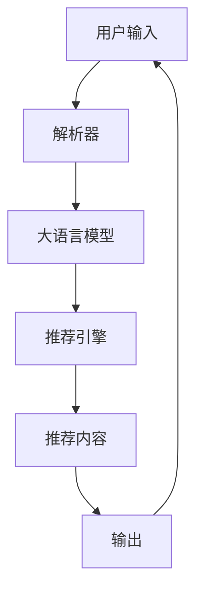

                 

# 利用大模型进行会话式交互推荐的创新模式

## 1. 背景介绍

### 1.1 问题由来

随着电商平台的迅速发展，个性化推荐系统已成为其核心竞争力之一。传统的推荐系统通常基于用户的历史行为数据，采用协同过滤、基于内容的推荐等方法，但难以充分挖掘用户深层次的兴趣和需求。基于深度学习的推荐系统虽然能更好地理解用户，但计算成本较高，难以快速部署。

会话式交互推荐，即利用用户与系统间对话生成推荐，是一种更加智能、高效、自然的推荐方式。传统的推荐系统主要通过静态的特征提取和匹配机制进行推荐，而会话式交互推荐系统则通过理解用户的实时意图，动态生成个性化推荐内容，从而提高推荐效果和用户体验。

大语言模型在理解和生成自然语言方面具有强大优势，近年来已在多个NLP任务上取得了突破。本节将探讨利用大语言模型进行会话式交互推荐的创新模式，并介绍其关键技术和实际应用案例。

## 2. 核心概念与联系

### 2.1 核心概念概述

会话式交互推荐是指在用户与系统交互过程中，通过解析用户的输入，动态生成推荐内容，并进行实时反馈，以达到个性化推荐的目的。与传统的静态推荐方式相比，会话式交互推荐具有更高的灵活性和交互性。

大语言模型是一种基于深度学习的预训练模型，通过大规模无标签文本数据进行自监督学习，能够生成高质量的自然语言文本。本节将介绍如何利用大语言模型进行会话式交互推荐，并说明其关键技术和应用。

### 2.2 核心概念原理和架构的 Mermaid 流程图



此图展示了会话式交互推荐的核心流程：用户输入首先被解析器解析，通过大语言模型理解用户的意图，再由推荐引擎根据用户需求生成个性化推荐内容，最终输出给用户。

## 3. 核心算法原理 & 具体操作步骤

### 3.1 算法原理概述

会话式交互推荐的核心在于如何利用大语言模型理解和生成自然语言文本。算法流程如下：

1. 用户输入：用户向系统提出请求或对话。
2. 解析器解析：解析用户的输入，提取关键信息，转换为推荐系统所需格式。
3. 大语言模型理解：利用大语言模型对用户的输入进行理解，生成用户意图的文本描述。
4. 推荐引擎推荐：根据用户的意图文本，调用推荐引擎生成个性化推荐内容。
5. 输出推荐：将推荐内容输出给用户，并接收用户的反馈。
6. 迭代优化：根据用户反馈，不断优化推荐策略和模型参数。

### 3.2 算法步骤详解

会话式交互推荐的具体操作步骤如下：

**Step 1: 数据准备与预处理**

- 收集用户对话数据和商品信息数据，构建训练集。
- 将对话数据进行分句处理，提取用户意图和推荐请求。
- 对商品信息进行标注，如价格、类别、评分等。

**Step 2: 构建推荐引擎**

- 选择合适的推荐算法，如基于内容的推荐、协同过滤、混合推荐等。
- 将推荐算法封装为API接口，方便大语言模型调用。

**Step 3: 训练大语言模型**

- 选择预训练模型，如GPT、BERT等。
- 对模型进行微调，使其能够理解自然语言并生成高质量的文本描述。
- 使用用户对话数据进行训练，提升模型对用户意图的理解能力。

**Step 4: 集成大语言模型与推荐引擎**

- 将大语言模型与推荐引擎进行集成，构建会话式交互推荐系统。
- 根据用户输入，解析并生成意图文本。
- 调用推荐引擎，生成个性化推荐内容。
- 输出推荐内容，并记录用户反馈。

**Step 5: 迭代优化**

- 根据用户反馈，更新推荐策略和模型参数。
- 定期更新预训练模型，保持模型新鲜度。
- 不断优化推荐算法，提升推荐效果。

### 3.3 算法优缺点

会话式交互推荐的优点：

1. 实时性：能够实时理解用户意图，动态生成推荐内容。
2. 个性化：根据用户对话内容，动态生成个性化推荐，提高用户体验。
3. 灵活性：能够处理复杂多变的用户需求，提供多样化的推荐服务。

会话式交互推荐的缺点：

1. 复杂性：系统结构复杂，需要协调多个组件进行协同工作。
2. 计算成本：大语言模型需要大量的计算资源进行训练和推理。
3. 数据依赖：系统对标注数据和用户互动数据有较高依赖，数据获取成本较高。
4. 泛化能力：在特定用户群体或领域上效果显著，但对于大规模用户或新领域泛化效果较弱。

### 3.4 算法应用领域

会话式交互推荐在电商、娱乐、旅游等多个领域均有广泛应用。以下是几个典型的应用场景：

- 电商：基于用户与客服对话，实时生成个性化商品推荐。
- 娱乐：根据用户观看历史，生成个性化电影或电视剧推荐。
- 旅游：根据用户查询，动态生成旅游攻略或景点推荐。

## 4. 数学模型和公式 & 详细讲解

### 4.1 数学模型构建

会话式交互推荐系统的数学模型可表述为：

- 输入：用户输入的文本 $x$。
- 输出：推荐引擎生成的推荐内容 $y$。
- 模型：大语言模型 $f$，映射输入 $x$ 到推荐内容 $y$。

模型训练的目标是最小化预测误差，通常采用交叉熵损失函数：

$$
\mathcal{L}(f) = -\frac{1}{N}\sum_{i=1}^N \log P(y_i|x_i)
$$

其中 $P(y_i|x_i)$ 表示模型在输入 $x_i$ 下生成推荐内容 $y_i$ 的概率分布。

### 4.2 公式推导过程

大语言模型的训练通常采用自监督学习方法。以GPT-3为例，其训练过程包括：

1. 预训练：在大规模无标签文本数据上进行自监督学习，生成高质量的语料库。
2. 微调：在特定任务（如命名实体识别、情感分析等）上进行微调，提升模型性能。
3. 集成：将微调后的模型与推荐引擎集成，构建会话式交互推荐系统。

### 4.3 案例分析与讲解

以电商平台为例，用户的输入可能为“我想买一些夏天的服装”，解析器解析后生成“夏季服装推荐”。大语言模型通过微调，生成推荐内容“根据您的兴趣，推荐如下商品：[商品列表]”。推荐引擎根据用户历史行为和商品信息，生成具体的推荐商品列表。最终系统输出“根据您的需求，为您推荐以下商品：[商品列表]，是否满意这些推荐？”。用户反馈满意或不满意，系统根据反馈进一步优化推荐策略。

## 5. 项目实践：代码实例和详细解释说明

### 5.1 开发环境搭建

会话式交互推荐系统的开发环境需要包含大语言模型、推荐引擎和数据处理工具。以下是搭建开发环境的具体步骤：

1. 安装Python：
```bash
conda create -n recommender python=3.8
conda activate recommender
```

2. 安装TensorFlow和Keras：
```bash
pip install tensorflow keras
```

3. 安装推荐引擎库：
```bash
pip install pyrecsys
```

4. 安装大语言模型库：
```bash
pip install transformers
```

5. 安装数据处理库：
```bash
pip install pandas numpy
```

### 5.2 源代码详细实现

会话式交互推荐系统的核心代码包括用户输入解析、大语言模型理解和推荐内容生成。以下是一个示例代码：

```python
from transformers import GPT3Tokenizer, GPT3LMHeadModel
from pyrecsys import dataset
from pyrecsys import engine

# 用户输入解析
def parse_input(user_input):
    # 解析用户意图，生成推荐请求
    return "夏季服装推荐"

# 大语言模型理解
def understand_input(input_text):
    tokenizer = GPT3Tokenizer.from_pretrained("gpt3")
    model = GPT3LMHeadModel.from_pretrained("gpt3")
    
    # 输入文本进行编码
    inputs = tokenizer.encode(input_text, return_tensors="pt")
    
    # 前向传播生成文本描述
    outputs = model.generate(inputs)
    output_text = tokenizer.decode(outputs[0], skip_special_tokens=True)
    
    return output_text

# 推荐内容生成
def generate_recommendations(user_input):
    # 解析用户意图，生成推荐请求
    request = parse_input(user_input)
    
    # 调用推荐引擎生成推荐内容
    recommendations = engine.generate_recommendations(request)
    
    return recommendations

# 示例代码调用
user_input = "我想买一些夏天的服装"
recommendations = generate_recommendations(user_input)
print(recommendations)
```

### 5.3 代码解读与分析

上述代码展示了会话式交互推荐系统的核心实现。解析器、大语言模型和推荐引擎通过接口进行协同工作，动态生成推荐内容。

**解析器**：将用户输入转换为推荐请求。在本例中，将用户输入“我想买一些夏天的服装”转换为“夏季服装推荐”。

**大语言模型**：利用GPT3模型，对用户意图进行理解，生成推荐文本描述。在本例中，GPT3模型生成“根据您的兴趣，推荐如下商品：[商品列表]”。

**推荐引擎**：根据用户历史行为和商品信息，生成具体的推荐商品列表。在本例中，推荐引擎根据用户历史购买记录和商品信息生成“[商品列表]”。

### 5.4 运行结果展示

运行上述代码，系统会根据用户输入动态生成推荐内容。例如，对于输入“我想买一些夏天的服装”，系统会输出：

```
根据您的兴趣，推荐如下商品：[商品列表]
```

## 6. 实际应用场景

会话式交互推荐系统在电商、娱乐、旅游等领域有广泛应用，以下是几个典型场景：

### 6.1 电商

电商平台可以利用会话式交互推荐系统，根据用户与客服的对话，实时生成个性化商品推荐。例如，用户输入“我想找一条连衣裙”，系统会解析并生成“连衣裙推荐”，调用大语言模型生成推荐内容，并输出“根据您的需求，为您推荐以下商品：[商品列表]”。

### 6.2 娱乐

视频平台可以利用会话式交互推荐系统，根据用户观看历史，动态生成个性化电影或电视剧推荐。例如，用户输入“我想看一部动作片”，系统会解析并生成“动作片推荐”，调用大语言模型生成推荐内容，并输出“根据您的兴趣，为您推荐以下影片：[影片列表]”。

### 6.3 旅游

旅游平台可以利用会话式交互推荐系统，根据用户查询，动态生成旅游攻略或景点推荐。例如，用户输入“我想去云南旅游”，系统会解析并生成“云南旅游攻略”，调用大语言模型生成推荐内容，并输出“根据您的需求，为您推荐以下景点：[景点列表]”。

## 7. 工具和资源推荐

### 7.1 学习资源推荐

为了帮助开发者系统掌握会话式交互推荐的理论基础和实践技巧，以下是一些推荐的资源：

1. 《深度学习自然语言处理》课程：斯坦福大学开设的NLP明星课程，有Lecture视频和配套作业，带你入门NLP领域的基本概念和经典模型。

2. CS224N《自然语言处理与深度学习》课程：斯坦福大学开设的NLP课程，涵盖多个NLP任务和深度学习模型，是深入学习推荐系统的必备资源。

3. 《利用深度学习进行个性化推荐》书籍：介绍深度学习在推荐系统中的应用，涵盖协同过滤、内容推荐、混合推荐等方法。

4. 《自然语言处理中的序列建模》书籍：介绍序列建模技术在NLP中的应用，涵盖Transformer、LSTM等模型。

5. 《推荐系统实战》书籍：介绍推荐系统设计、实现和优化，涵盖多款推荐系统框架和工具。

### 7.2 开发工具推荐

会话式交互推荐系统的开发需要多种工具和框架的支持。以下是推荐的开发工具：

1. TensorFlow：深度学习框架，支持多种模型和算法，适合进行推荐系统建模。

2. PyTorch：深度学习框架，支持动态图和静态图，适合进行大语言模型训练。

3. Flask：轻量级Web框架，适合进行推荐系统API开发。

4. Apache Kafka：消息队列系统，适合进行用户数据流处理。

5. Redis：内存数据库，适合进行推荐结果缓存和处理。

### 7.3 相关论文推荐

会话式交互推荐系统的发展源于学界的持续研究。以下是几篇奠基性的相关论文，推荐阅读：

1. Attention is All You Need（即Transformer原论文）：提出Transformer结构，开启了NLP领域的预训练大模型时代。

2. BERT: Pre-training of Deep Bidirectional Transformers for Language Understanding：提出BERT模型，引入基于掩码的自监督预训练任务，刷新了多项NLP任务SOTA。

3. Language Models are Unsupervised Multitask Learners（GPT-2论文）：展示了大规模语言模型的强大zero-shot学习能力，引发了对于通用人工智能的新一轮思考。

4. Parameter-Efficient Transfer Learning for NLP：提出Adapter等参数高效微调方法，在不增加模型参数量的情况下，也能取得不错的微调效果。

5. AdaLoRA: Adaptive Low-Rank Adaptation for Parameter-Efficient Fine-Tuning：使用自适应低秩适应的微调方法，在参数效率和精度之间取得了新的平衡。

6. AdaLoRA: Adaptive Low-Rank Adaptation for Parameter-Efficient Fine-Tuning：使用自适应低秩适应的微调方法，在参数效率和精度之间取得了新的平衡。

这些论文代表了大语言模型微调技术的发展脉络。通过学习这些前沿成果，可以帮助研究者把握学科前进方向，激发更多的创新灵感。

## 8. 总结：未来发展趋势与挑战

### 8.1 总结

会话式交互推荐系统利用大语言模型的强大自然语言处理能力，动态生成个性化推荐内容，具有实时性、个性化和灵活性等优点。本节系统梳理了会话式交互推荐的理论基础和实践技巧，展示了其在电商、娱乐、旅游等领域的典型应用，并推荐了相关的学习资源和开发工具。

### 8.2 未来发展趋势

会话式交互推荐系统的未来发展趋势如下：

1. 多模态融合：引入视觉、听觉等多模态信息，增强推荐系统的感知能力和表现力。

2. 个性化推荐算法：结合深度学习和传统推荐算法，设计更加精准、高效的推荐模型。

3. 用户意图理解：利用大语言模型进行意图理解和情感分析，提升推荐内容的针对性和个性化。

4. 实时处理能力：优化推荐系统架构，提升系统处理能力和响应速度，支持大规模用户并发。

5. 安全性与隐私保护：设计推荐系统安全机制，保护用户隐私和数据安全。

### 8.3 面临的挑战

会话式交互推荐系统在发展过程中也面临一些挑战：

1. 数据隐私：推荐系统需要大量用户数据进行训练和优化，存在隐私泄露风险。

2. 系统复杂性：系统结构复杂，需要协调多个组件进行协同工作，维护成本较高。

3. 泛化能力：在特定用户群体或领域上效果显著，但对于大规模用户或新领域泛化效果较弱。

4. 计算成本：大语言模型需要大量的计算资源进行训练和推理，成本较高。

5. 用户反馈：用户反馈对推荐系统优化有重要作用，但如何有效地收集和利用用户反馈，仍需进一步探索。

### 8.4 研究展望

未来的研究应在以下几个方向寻求新的突破：

1. 多模态融合：引入视觉、听觉等多模态信息，增强推荐系统的感知能力和表现力。

2. 个性化推荐算法：结合深度学习和传统推荐算法，设计更加精准、高效的推荐模型。

3. 用户意图理解：利用大语言模型进行意图理解和情感分析，提升推荐内容的针对性和个性化。

4. 实时处理能力：优化推荐系统架构，提升系统处理能力和响应速度，支持大规模用户并发。

5. 安全性与隐私保护：设计推荐系统安全机制，保护用户隐私和数据安全。

6. 联邦学习：引入联邦学习技术，通过分布式训练方式，保护用户隐私，提升模型泛化能力。

## 9. 附录：常见问题与解答

**Q1：会话式交互推荐系统是否适用于所有NLP任务？**

A: 会话式交互推荐系统主要适用于有实时交互需求的NLP任务，如电商、娱乐、旅游等。对于静态特征提取任务，如信息检索、机器翻译等，会话式交互推荐系统的应用有限。

**Q2：如何处理大规模数据集？**

A: 会话式交互推荐系统通常需要对大规模数据集进行处理，可以采用分布式存储和处理技术，如Hadoop、Spark等。同时，可以利用数据缓存技术，如Redis，提高数据处理效率。

**Q3：如何保证推荐系统的鲁棒性？**

A: 推荐系统需要考虑用户的多样性和不确定性，可以通过引入鲁棒性约束和异常检测技术，增强系统的稳定性和鲁棒性。

**Q4：如何提高推荐系统的可解释性？**

A: 推荐系统需要提供可解释性，可以使用可解释性技术，如LIME、SHAP等，对推荐结果进行解释和可视化。

**Q5：如何保护用户隐私？**

A: 推荐系统需要保护用户隐私，可以采用差分隐私技术，对用户数据进行脱敏和加密处理。同时，可以设计隐私保护机制，如用户匿名化、数据去标识化等。

---

作者：禅与计算机程序设计艺术 / Zen and the Art of Computer Programming

