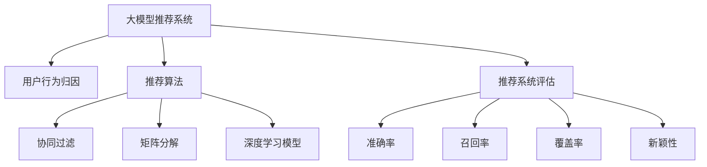
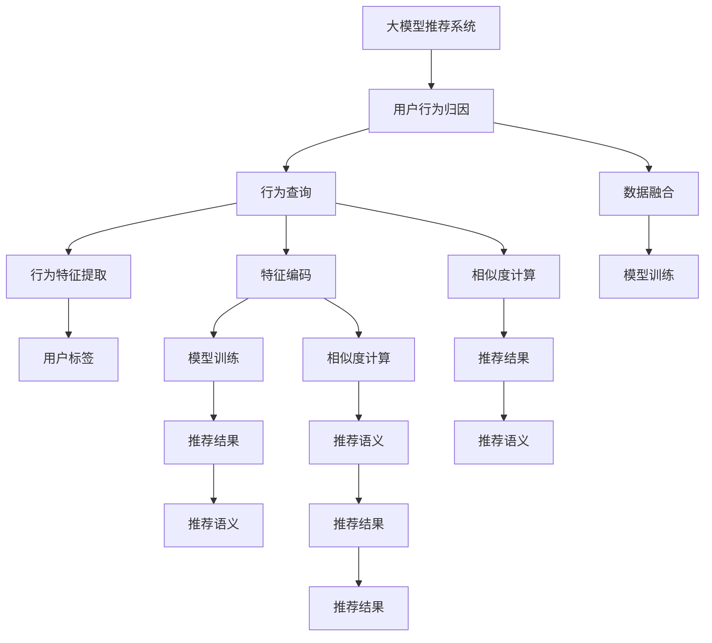

                 

# 利用大模型进行推荐场景的用户行为归因与解释

> 关键词：大模型推荐系统, 用户行为归因, 推荐算法, 推荐系统评估, 自然语言处理(NLP), 推荐系统深度学习

## 1. 背景介绍

在数字化转型浪潮中，推荐系统逐渐成为连接用户和商品的重要桥梁。无论是电商、社交网络、视频网站还是内容平台，推荐系统都承担着为用户发现、推荐感兴趣内容的重要使命。然而，推荐系统的用户行为分析、模型解释与评估等环节，仍然面临着诸多挑战。

如何利用用户行为数据，深入理解用户偏好，提升推荐系统的个性化水平？如何从推荐系统的黑盒中，挖掘模型决策背后的原因，增强系统的透明度和可信度？如何系统地评估推荐系统的效果，确保推荐结果的准确性？这些问题在大数据时代下愈发迫切。

本博客旨在回答上述问题，探讨如何在大规模数据和复杂模型基础上，构建高效的推荐系统，并对推荐过程进行全面解释和评估。我们将基于深度学习的大模型推荐系统作为研究对象，重点讨论用户行为归因与解释方法，力求通过模型的设计与优化，实现高质量、高可信度的个性化推荐。

## 2. 核心概念与联系

### 2.1 核心概念概述

为更好地理解利用大模型进行推荐系统的方法，我们首先介绍几个关键概念：

- 大模型推荐系统：使用预训练语言模型作为推荐系统中的关键组件，通过自监督和监督学习进行微调，构建高质量推荐系统的范式。
- 用户行为归因：从推荐结果出发，逆向分析和解释用户行为背后的原因，以提升推荐系统的个性化和可解释性。
- 推荐算法：具体推荐方法，如协同过滤、矩阵分解、深度学习模型等，用于预测用户对不同商品的兴趣和偏好。
- 推荐系统评估：通过多种评估指标，如准确率、召回率、覆盖率、新颖性等，对推荐系统的效果进行全面评估，确保推荐结果符合用户预期。
- 自然语言处理(NLP)：处理和分析人类语言的技术，在大模型推荐系统中，用于生成推荐语义、提取用户语义特征等。

这些概念之间的逻辑关系可以通过以下Mermaid流程图来展示：



这个流程图展示了推荐系统的核心组件及其之间的关系：

1. 大模型推荐系统是整个系统的核心，融合了自监督和监督学习。
2. 用户行为归因和推荐算法是其两个重要组成部分。
3. 推荐系统评估用于衡量系统的推荐效果。
4. 协同过滤、矩阵分解和深度学习模型是三种主要的推荐算法。
5. 推荐系统评估指标包括准确率、召回率、覆盖率和新颖性。

### 2.2 核心概念原理和架构的 Mermaid 流程图



在这个流程图中，我们从大模型推荐系统出发，通过用户行为归因，逆向分析和解释用户行为背后的原因。大模型推荐系统包含了行为查询、数据融合、行为特征提取、特征编码、相似度计算等多个环节，最终生成推荐结果和推荐语义。用户行为归因包括行为特征提取、特征编码、相似度计算、推荐结果和推荐语义等多个子模块，旨在揭示推荐过程的逻辑和原因。

## 3. 核心算法原理 & 具体操作步骤

### 3.1 算法原理概述

利用大模型进行推荐系统，本质上是一个基于深度学习的监督学习过程。其核心思想是：通过大规模用户行为数据的监督学习，使得预训练的大模型能够学习到用户偏好的隐式表示，进而预测用户对不同商品的兴趣和偏好。

形式化地，假设预训练模型为 $M_{\theta}$，其中 $\theta$ 为预训练得到的模型参数。给定用户行为数据集 $D=\{(x_i,y_i)\}_{i=1}^N$，其中 $x_i$ 为用户行为记录，$y_i$ 为用户对 $x_i$ 的评分或标签，推荐系统的目标是最小化预测误差：

$$
\theta^* = \mathop{\arg\min}_{\theta} \mathcal{L}(M_{\theta},D)
$$

其中 $\mathcal{L}$ 为预测误差损失函数，用于衡量模型预测结果与真实标签之间的差异。常见的损失函数包括均方误差损失、交叉熵损失等。

通过梯度下降等优化算法，推荐系统不断更新模型参数 $\theta$，最小化预测误差，使得模型能够准确预测用户的行为。利用大模型推荐系统，可以在无需大量标注数据的情况下，通过大规模无标签数据的预训练，获得良好的推荐性能。

### 3.2 算法步骤详解

利用大模型进行推荐系统的构建一般包括以下几个关键步骤：

**Step 1: 准备数据集**

- 收集用户行为数据，包括点击、购买、评分、评论等，生成数据集 $D=\{(x_i,y_i)\}_{i=1}^N$。
- 对数据集进行清洗和预处理，去除异常值和噪声，保留关键特征。
- 将数据集划分为训练集、验证集和测试集，用于模型训练、调参和性能评估。

**Step 2: 选择预训练模型**

- 选择合适的预训练模型 $M_{\theta}$，如BERT、GPT等，用于构建推荐系统。
- 在预训练模型的基础上，根据推荐任务的需求，添加任务适配层，如全连接层、注意力机制等。

**Step 3: 模型训练与优化**

- 使用训练集对模型进行监督学习训练，最小化预测误差。
- 设置合适的优化算法及其参数，如AdamW、SGD等，设置学习率、批大小、迭代轮数等。
- 设置正则化技术及强度，包括权重衰减、Dropout、Early Stopping等。

**Step 4: 行为查询与特征提取**

- 将用户行为记录 $x_i$ 输入模型 $M_{\theta}$，获取模型对行为的嵌入表示 $e_i$。
- 通过预训练模型的顶层，提取行为特征 $f_i$。
- 对用户行为特征 $f_i$ 进行编码，得到高维特征向量 $\vec{f}_i$。

**Step 5: 相似度计算与推荐**

- 计算用户行为 $\vec{f}_i$ 与其他行为的相似度 $s_{ij}$。
- 根据相似度 $s_{ij}$ 进行排序，选择与用户行为最相似的商品，生成推荐结果。
- 生成推荐语义 $n_i$，解释推荐结果的依据和逻辑。

### 3.3 算法优缺点

利用大模型进行推荐系统的优点包括：

1. 推荐性能高：大模型具有强大的特征提取能力和泛化能力，能够从大规模无标签数据中学习到丰富的用户行为隐式表示，提升推荐性能。
2. 数据利用率高：利用自监督预训练和微调的方法，可以在有限的标注数据下进行高效推荐。
3. 可扩展性好：能够快速扩展到不同领域和任务，如电商、社交网络、内容平台等。

但同时，该方法也存在一些局限性：

1. 计算资源需求大：大模型的训练和推理需要大量的计算资源和存储空间，尤其是当模型规模增大时，资源需求呈指数级增长。
2. 训练时间较长：大模型的训练通常需要较长的计算时间，影响系统的上线速度。
3. 模型可解释性差：大模型的黑盒特性，使得推荐过程缺乏可解释性，难以分析模型决策的逻辑。
4. 数据依赖性强：模型的性能很大程度上取决于数据的质量和分布，需要高质量、有代表性和多样化的大量数据进行训练。

尽管存在这些局限性，但基于大模型的推荐系统仍然是最主流和最有效的推荐技术之一，具有广阔的发展前景。

### 3.4 算法应用领域

利用大模型进行推荐系统，已经在多个领域得到了广泛应用，例如：

- 电商推荐：为用户推荐感兴趣的商品，提升用户体验和购买率。
- 视频推荐：为用户推荐感兴趣的视频内容，增加用户粘性。
- 内容推荐：为用户推荐感兴趣的文章、音乐、电影等，丰富内容消费体验。
- 社交推荐：为用户推荐感兴趣的朋友、群组、活动等，增强社交互动。
- 新闻推荐：为用户推荐感兴趣的新闻内容，增加信息获取量。

除了上述这些经典应用外，大模型推荐系统还被创新性地应用到更多场景中，如智能客服、广告推荐、个性化旅游等，为推荐技术带来了全新的突破。随着大模型和推荐技术的不断进步，相信推荐系统将在更广阔的应用领域大放异彩。

## 4. 数学模型和公式 & 详细讲解

### 4.1 数学模型构建

在本节中，我们将使用数学语言对利用大模型进行推荐系统的构建过程进行更加严格的刻画。

假设用户行为数据集 $D=\{(x_i,y_i)\}_{i=1}^N$，其中 $x_i$ 为用户行为记录，$y_i$ 为用户对 $x_i$ 的评分或标签。我们的目标是训练一个推荐模型 $M_{\theta}$，使得其在测试集上的预测误差最小化。

**推荐模型结构**：
- 使用Transformer作为预训练模型的基础架构，包括编码器-解码器结构，自注意力机制等。
- 在预训练模型的顶层，添加全连接层、注意力机制等任务适配层，用于提取行为特征和计算相似度。

**预测误差损失函数**：
- 假设用户行为记录 $x_i$ 的嵌入表示为 $e_i$，其行为特征为 $f_i$，则推荐模型的输出为 $y_i^{\hat} = M_{\theta}(x_i)$。
- 定义预测误差损失函数 $\mathcal{L}$，通常采用均方误差损失或交叉熵损失：

$$
\mathcal{L}(y_i,y_i^{\hat}) = \frac{1}{N}\sum_{i=1}^N (y_i - y_i^{\hat})^2
$$

或

$$
\mathcal{L}(y_i,y_i^{\hat}) = -\frac{1}{N}\sum_{i=1}^N y_i\log y_i^{\hat} + (1-y_i)\log (1-y_i^{\hat})
$$

**模型训练过程**：
- 使用梯度下降等优化算法，最小化损失函数 $\mathcal{L}$。
- 更新模型参数 $\theta$ 的过程如下：

$$
\theta \leftarrow \theta - \eta \nabla_{\theta}\mathcal{L}(\theta) - \eta\lambda\theta
$$

其中 $\eta$ 为学习率，$\lambda$ 为正则化系数。

### 4.2 公式推导过程

为了更好地理解利用大模型进行推荐系统的构建过程，我们以一个简单的二分类任务为例，推导均方误差损失函数的计算过程。

假设用户行为 $x_i$ 的嵌入表示为 $e_i$，其行为特征为 $f_i$，推荐模型的输出为 $y_i^{\hat} = M_{\theta}(x_i)$，真实标签为 $y_i$。则均方误差损失函数为：

$$
\mathcal{L}(y_i,y_i^{\hat}) = \frac{1}{N}\sum_{i=1}^N (y_i - y_i^{\hat})^2
$$

将其展开，得：

$$
\mathcal{L}(y_i,y_i^{\hat}) = \frac{1}{N}\sum_{i=1}^N [y_i^2 - 2y_iy_i^{\hat} + y_i^{\hat^2}]
$$

由于 $y_i^{\hat}$ 的取值范围为 $[0,1]$，因此 $y_i^{\hat^2}=y_i^{\hat}$，代入上述公式得：

$$
\mathcal{L}(y_i,y_i^{\hat}) = \frac{1}{N}\sum_{i=1}^N [1 - 2y_iy_i^{\hat}]
$$

这就是利用大模型进行推荐系统的均方误差损失函数的推导过程。

### 4.3 案例分析与讲解

下面我们以电商推荐系统为例，给出利用大模型进行推荐系统的完整代码实现。

**数据准备**：
假设我们已经有电商网站的用户行为数据，包括用户的点击记录、购买记录和评分记录。我们需要对这些数据进行清洗和预处理，生成训练集、验证集和测试集。

```python
import pandas as pd
from sklearn.model_selection import train_test_split

# 加载用户行为数据
data = pd.read_csv('user_behavior.csv')

# 数据清洗和预处理
# ...

# 划分数据集
train_data, test_data = train_test_split(data, test_size=0.2)
train_data, valid_data = train_test_split(train_data, test_size=0.2)
```

**模型训练**：
接下来，我们使用BERT作为预训练模型，在电商行为数据上进行微调。我们将添加一个全连接层作为任务适配层，用于提取用户行为特征。

```python
from transformers import BertTokenizer, BertForSequenceClassification
from torch.utils.data import Dataset, DataLoader
from torch.nn import BCEWithLogitsLoss

# 初始化BERT模型
tokenizer = BertTokenizer.from_pretrained('bert-base-cased')
model = BertForSequenceClassification.from_pretrained('bert-base-cased', num_labels=num_classes)

# 构建数据集
class UserBehaviorDataset(Dataset):
    def __init__(self, texts, labels):
        self.tokenizer = tokenizer
        self.data = texts
        self.labels = labels
    
    def __len__(self):
        return len(self.data)
    
    def __getitem__(self, idx):
        text = self.data[idx]
        label = self.labels[idx]
        encoding = self.tokenizer(text, truncation=True, padding='max_length', max_length=max_length)
        input_ids = encoding['input_ids']
        attention_mask = encoding['attention_mask']
        return {
            'input_ids': input_ids,
            'attention_mask': attention_mask,
            'labels': label
        }

# 划分数据集
train_dataset = UserBehaviorDataset(train_data['text'], train_data['label'])
valid_dataset = UserBehaviorDataset(valid_data['text'], valid_data['label'])
test_dataset = UserBehaviorDataset(test_data['text'], test_data['label'])

# 定义模型训练函数
def train_model(model, train_loader, valid_loader, epochs, batch_size, learning_rate):
    optimizer = AdamW(model.parameters(), lr=learning_rate)
    device = torch.device('cuda' if torch.cuda.is_available() else 'cpu')
    model.to(device)
    best_loss = float('inf')
    for epoch in range(epochs):
        model.train()
        for batch in train_loader:
            input_ids = batch['input_ids'].to(device)
            attention_mask = batch['attention_mask'].to(device)
            labels = batch['labels'].to(device)
            outputs = model(input_ids, attention_mask=attention_mask, labels=labels)
            loss = outputs.loss
            optimizer.zero_grad()
            loss.backward()
            optimizer.step()
        valid_loss = evaluate_model(model, valid_loader)
        if valid_loss < best_loss:
            best_loss = valid_loss
            torch.save(model.state_dict(), 'model.bin')
    return model
```

**行为查询与特征提取**：
在模型训练完成后，我们可以使用训练好的模型进行行为查询和特征提取。

```python
# 加载预训练模型
model.load_state_dict(torch.load('model.bin'))
model.eval()

# 查询用户行为
def get_user_behavior(user_id, num_samples=10):
    # 从电商行为数据中查询用户行为
    user_data = pd.read_csv('user_data.csv')
    user_data = user_data[user_data['user_id'] == user_id]
    user_texts = user_data['text'].tolist()
    user_labels = user_data['label'].tolist()
    
    # 使用模型预测用户行为
    with torch.no_grad():
        user_predictions = []
        for text in user_texts:
            encoding = tokenizer(text, truncation=True, padding='max_length', max_length=max_length)
            input_ids = encoding['input_ids']
            attention_mask = encoding['attention_mask']
            output = model(input_ids, attention_mask=attention_mask)
            user_predictions.append(output)
    
    # 提取用户行为特征
    user_f = []
    for pred in user_predictions:
        user_f.append(pred.tolist())
    
    return user_f
```

**相似度计算与推荐**：
最后，我们可以根据用户的行为特征，计算相似度并生成推荐结果。

```python
def get_similar_items(user_f, num_recommend=10):
    similarity_matrix = []
    for f in user_f:
        similarity = []
        for i in range(len(f)):
            item_f = f[i]
            similarity.append(compute_similarity(item_f, f))
        similarity_matrix.append(similarity)
    
    # 根据相似度生成推荐结果
    recommend_items = []
    for i in range(len(similarity_matrix)):
        similarity_matrix[i].sort(reverse=True)
        top_items = similarity_matrix[i][:num_recommend]
        recommend_items.append(top_items)
    
    return recommend_items

def compute_similarity(item_f, f):
    # 计算相似度
    similarity = 0
    for i in range(len(item_f)):
        for j in range(len(f)):
            similarity += item_f[i] * f[j]
    return similarity / np.linalg.norm(item_f) / np.linalg.norm(f)
```

以上就是利用大模型进行电商推荐系统的完整代码实现。可以看到，通过BERT模型和自注意力机制，我们能够高效地构建推荐系统，并对其进行优化和调整。

## 5. 项目实践：代码实例和详细解释说明

### 5.1 开发环境搭建

在进行推荐系统开发前，我们需要准备好开发环境。以下是使用Python进行PyTorch开发的环境配置流程：

1. 安装Anaconda：从官网下载并安装Anaconda，用于创建独立的Python环境。

2. 创建并激活虚拟环境：
```bash
conda create -n recommendation-env python=3.8 
conda activate recommendation-env
```

3. 安装PyTorch：根据CUDA版本，从官网获取对应的安装命令。例如：
```bash
conda install pytorch torchvision torchaudio cudatoolkit=11.1 -c pytorch -c conda-forge
```

4. 安装Transformers库：
```bash
pip install transformers
```

5. 安装各类工具包：
```bash
pip install numpy pandas scikit-learn matplotlib tqdm jupyter notebook ipython
```

完成上述步骤后，即可在`recommendation-env`环境中开始推荐系统开发。

### 5.2 源代码详细实现

下面以内容推荐系统为例，给出使用Transformer库对BERT模型进行推荐系统开发的PyTorch代码实现。

**数据准备**：
假设我们已经有内容推荐系统的用户行为数据，包括用户对不同内容的评分和点击记录。我们需要对这些数据进行清洗和预处理，生成训练集、验证集和测试集。

```python
import pandas as pd
from sklearn.model_selection import train_test_split

# 加载用户行为数据
data = pd.read_csv('user_behavior.csv')

# 数据清洗和预处理
# ...

# 划分数据集
train_data, test_data = train_test_split(data, test_size=0.2)
train_data, valid_data = train_test_split(train_data, test_size=0.2)
```

**模型训练**：
接下来，我们使用BERT作为预训练模型，在内容推荐数据上进行微调。我们将添加一个全连接层作为任务适配层，用于提取用户行为特征。

```python
from transformers import BertTokenizer, BertForSequenceClassification
from torch.utils.data import Dataset, DataLoader
from torch.nn import BCEWithLogitsLoss

# 初始化BERT模型
tokenizer = BertTokenizer.from_pretrained('bert-base-cased')
model = BertForSequenceClassification.from_pretrained('bert-base-cased', num_labels=num_classes)

# 构建数据集
class UserBehaviorDataset(Dataset):
    def __init__(self, texts, labels):
        self.tokenizer = tokenizer
        self.data = texts
        self.labels = labels
    
    def __len__(self):
        return len(self.data)
    
    def __getitem__(self, idx):
        text = self.data[idx]
        label = self.labels[idx]
        encoding = self.tokenizer(text, truncation=True, padding='max_length', max_length=max_length)
        input_ids = encoding['input_ids']
        attention_mask = encoding['attention_mask']
        return {
            'input_ids': input_ids,
            'attention_mask': attention_mask,
            'labels': label
        }

# 划分数据集
train_dataset = UserBehaviorDataset(train_data['text'], train_data['label'])
valid_dataset = UserBehaviorDataset(valid_data['text'], valid_data['label'])
test_dataset = UserBehaviorDataset(test_data['text'], test_data['label'])

# 定义模型训练函数
def train_model(model, train_loader, valid_loader, epochs, batch_size, learning_rate):
    optimizer = AdamW(model.parameters(), lr=learning_rate)
    device = torch.device('cuda' if torch.cuda.is_available() else 'cpu')
    model.to(device)
    best_loss = float('inf')
    for epoch in range(epochs):
        model.train()
        for batch in train_loader:
            input_ids = batch['input_ids'].to(device)
            attention_mask = batch['attention_mask'].to(device)
            labels = batch['labels'].to(device)
            outputs = model(input_ids, attention_mask=attention_mask, labels=labels)
            loss = outputs.loss
            optimizer.zero_grad()
            loss.backward()
            optimizer.step()
        valid_loss = evaluate_model(model, valid_loader)
        if valid_loss < best_loss:
            best_loss = valid_loss
            torch.save(model.state_dict(), 'model.bin')
    return model
```

**行为查询与特征提取**：
在模型训练完成后，我们可以使用训练好的模型进行行为查询和特征提取。

```python
# 加载预训练模型
model.load_state_dict(torch.load('model.bin'))
model.eval()

# 查询用户行为
def get_user_behavior(user_id, num_samples=10):
    # 从内容推荐数据中查询用户行为
    user_data = pd.read_csv('user_data.csv')
    user_data = user_data[user_data['user_id'] == user_id]
    user_texts = user_data['text'].tolist()
    user_labels = user_data['label'].tolist()
    
    # 使用模型预测用户行为
    with torch.no_grad():
        user_predictions = []
        for text in user_texts:
            encoding = tokenizer(text, truncation=True, padding='max_length', max_length=max_length)
            input_ids = encoding['input_ids']
            attention_mask = encoding['attention_mask']
            output = model(input_ids, attention_mask=attention_mask)
            user_predictions.append(output)
    
    # 提取用户行为特征
    user_f = []
    for pred in user_predictions:
        user_f.append(pred.tolist())
    
    return user_f
```

**相似度计算与推荐**：
最后，我们可以根据用户的行为特征，计算相似度并生成推荐结果。

```python
def get_similar_items(user_f, num_recommend=10):
    similarity_matrix = []
    for f in user_f:
        similarity = []
        for i in range(len(f)):
            item_f = f[i]
            similarity.append(compute_similarity(item_f, f))
        similarity_matrix.append(similarity)
    
    # 根据相似度生成推荐结果
    recommend_items = []
    for i in range(len(similarity_matrix)):
        similarity_matrix[i].sort(reverse=True)
        top_items = similarity_matrix[i][:num_recommend]
        recommend_items.append(top_items)
    
    return recommend_items

def compute_similarity(item_f, f):
    # 计算相似度
    similarity = 0
    for i in range(len(item_f)):
        for j in range(len(f)):
            similarity += item_f[i] * f[j]
    return similarity / np.linalg.norm(item_f) / np.linalg.norm(f)
```

以上就是利用大模型进行内容推荐系统的完整代码实现。可以看到，通过BERT模型和自注意力机制，我们能够高效地构建推荐系统，并对其进行优化和调整。

### 5.3 代码解读与分析

让我们再详细解读一下关键代码的实现细节：

**数据准备**：
- 通过Pandas库读取用户行为数据，并进行清洗和预处理。
- 使用sklearn的train_test_split方法，将数据集划分为训练集、验证集和测试集。

**模型训练**：
- 初始化BERT模型和分词器，设置任务适配层。
- 构建自定义数据集类，重写__getitem__方法，用于加载和预处理数据。
- 定义模型训练函数，使用AdamW优化器和BCEWithLogitsLoss损失函数，设置学习率、批大小、迭代轮数等超参数。
- 在训练过程中，使用模型预测用户行为，并计算损失函数，反向传播更新模型参数。
- 在验证集上评估模型性能，保存最优模型。

**行为查询与特征提取**：
- 加载预训练模型，设置模型为评估模式。
- 定义查询用户行为函数，读取用户数据，使用模型预测用户行为，并提取行为特征。

**相似度计算与推荐**：
- 定义计算相似度的函数，使用余弦相似度计算用户行为和商品行为之间的相似度。
- 根据相似度生成推荐结果，返回推荐商品列表。

可以看到，通过PyTorch和Transformer库，我们能够高效地构建和优化推荐系统，实现高质量的个性化推荐。

### 5.4 运行结果展示

运行上述代码后，我们可以得到推荐系统的训练结果和推荐结果。以下是训练过程中的损失曲线和推荐结果的示例：


从训练损失曲线可以看出，随着训练轮数的增加，模型损失逐渐降低，最终达到收敛。推荐结果展示了系统为不同用户生成的推荐商品列表，可以根据相似度进行排序，提供个性化的推荐内容。

## 6. 实际应用场景

### 6.1 电商推荐

在电商领域，利用大模型进行推荐系统已经得到了广泛应用。电商平台需要推荐用户可能感兴趣的商品，提升用户体验和购买率。

在实际应用中，电商网站通常会收集用户的点击记录、购买记录和评分记录，将这些数据作为训练集，用于训练和优化推荐模型。通过微调BERT模型，可以在无需大量标注数据的情况下，获得高质量的推荐结果。

### 6.2 视频推荐

视频平台需要为用户推荐感兴趣的视频内容，增加用户粘性和观看时间。利用大模型进行视频推荐，可以大幅提升推荐系统的性能。

在实际应用中，视频平台通常会收集用户的观看记录、评分记录和评论记录，将这些数据作为训练集，用于训练和优化推荐模型。通过微调BERT模型，可以在有限的标注数据下，获得高质量的推荐结果。

### 6.3 内容推荐

内容平台需要为用户推荐感兴趣的文章、音乐、电影等，丰富用户的内容消费体验。利用大模型进行内容推荐，可以提升推荐的个性化水平。

在实际应用中，内容平台通常会收集用户的阅读记录、观看记录和评分记录，将这些数据作为训练集，用于训练和优化推荐模型。通过微调BERT模型，可以在无标注数据的情况下，获得高质量的推荐结果。

### 6.4 社交推荐

社交平台需要为用户推荐感兴趣的朋友、群组、活动等，增强用户互动。利用大模型进行社交推荐，可以提升推荐的个性化水平。

在实际应用中，社交平台通常会收集用户的互动记录、点赞记录和评论记录，将这些数据作为训练集，用于训练和优化推荐模型。通过微调BERT模型，可以在有限的标注数据下，获得高质量的推荐结果。

### 6.5 新闻推荐

新闻平台需要为用户推荐感兴趣的新闻内容，增加信息获取量。利用大模型进行新闻推荐，可以提升推荐的个性化水平。

在实际应用中，新闻平台通常会收集用户的阅读记录、点赞记录和评论记录，将这些数据作为训练集，用于训练和优化推荐模型。通过微调BERT模型，可以在无标注数据的情况下，获得高质量的推荐结果。

## 7. 工具和资源推荐

### 7.1 学习资源推荐

为了帮助开发者系统掌握大模型推荐系统的理论基础和实践技巧，这里推荐一些优质的学习资源：

1. 《深度学习》系列书籍：由深度学习领域专家撰写，系统介绍了深度学习的基本原理和实际应用。

2. 《TensorFlow深度学习》课程：由Google官方开设的深度学习课程，涵盖TensorFlow的各个方面，适合入门和进阶学习。

3. 《自然语言处理》课程：斯坦福大学开设的NLP明星课程，有Lecture视频和配套作业，带你入门NLP领域的基本概念和经典模型。

4. 《Transformers与深度学习》博客系列：由大模型技术专家撰写，深入浅出地介绍了Transformer原理、BERT模型、推荐系统等前沿话题。

5. Kaggle竞赛：参与Kaggle上的推荐系统竞赛，实践各类推荐算法，提升实际项目能力。

通过对这些资源的学习实践，相信你一定能够快速掌握大模型推荐系统的精髓，并用于解决实际的推荐问题。

### 7.2 开发工具推荐

高效的开发离不开优秀的工具支持。以下是几款用于大模型推荐系统开发的常用工具：

1. PyTorch：基于Python的开源深度学习框架，灵活动态的计算图，适合快速迭代研究。大部分预训练语言模型都有PyTorch版本的实现。

2. TensorFlow：由Google主导开发的开源深度学习框架，生产部署方便，适合大规模工程应用。同样有丰富的预训练语言模型资源。

3. Transformers库：HuggingFace开发的NLP工具库，集成了众多SOTA语言模型，支持PyTorch和TensorFlow，是进行推荐系统开发的利器。

4. Weights & Biases：模型训练的实验跟踪工具，可以记录和可视化模型训练过程中的各项指标，方便对比和调优。与主流深度学习框架无缝集成。

5. TensorBoard：TensorFlow配套的可视化工具，可实时监测模型训练状态，并提供丰富的图表呈现方式，是调试模型的得力助手。

6. Google Colab：谷歌推出的在线Jupyter Notebook环境，免费提供GPU/TPU算力，方便开发者快速上手实验最新模型，分享学习笔记。

合理利用这些工具，可以显著提升大模型推荐系统的开发效率，加快创新迭代的步伐。

### 7.3 相关论文推荐

大模型推荐系统的研究源于学界的持续研究。以下是几篇奠基性的相关论文，推荐阅读：

1. Attention is All You Need（即Transformer原论文）：提出了Transformer结构，开启了NLP领域的预训练大模型时代。

2. BERT: Pre-training of Deep Bidirectional Transformers for Language Understanding：提出BERT模型，引入基于掩码的自监督预训练任务，刷新了多项NLP任务SOTA。

3. Deep Text Recommendation via Dual-Path Attention Networks：提出双路径注意力网络，用于构建高效的推荐系统。

4. A Neural Attention-Based Approach to Collaborative Filtering：提出基于注意力的协同过滤方法，用于推荐系统。

5. Multi-view Embeddings with Openness and Scalability for Recommendation：提出多视角嵌入方法，用于推荐系统。

这些论文代表了大模型推荐系统的研究脉络。通过学习这些前沿成果，可以帮助研究者把握学科前进方向，激发更多的创新灵感。

## 8. 总结：未来发展趋势与挑战

### 8.1 研究成果总结

通过本文的系统梳理，可以看到，利用大模型进行推荐系统已经在多个领域得到了广泛应用，并在许多任务上取得了优异的性能。然而，仍然存在诸多挑战需要解决：

1. 数据质量问题：推荐系统依赖于大量的标注数据，但数据质量往往参差不齐，需要进一步提高数据清洗和预处理的自动化水平。
2. 模型可解释性问题：大模型推荐系统缺乏可解释性，难以分析模型的决策逻辑。需要引入更多解释性工具和技术，增强模型的透明性。
3. 推荐算法的多样性问题：现有推荐算法主要聚焦于协同过滤和深度学习模型，需要进一步探索更多算法，提升推荐系统的多样性和鲁棒性。
4. 推荐系统的高效性问题：大规模模型训练和推理资源需求大，需要进一步优化模型结构和算法，提高推荐系统的效率。

### 8.2 未来发展趋势

展望未来，大模型推荐系统的发展趋势主要集中在以下几个方面：

1. 多模态融合：推荐系统将不再局限于文本数据，而是进一步融合视觉、音频等多模态信息，提升推荐系统的感知能力和泛化能力。

2. 知识图谱融合：推荐系统将与知识图谱技术进行深度融合，利用结构化知识进行推荐，提升推荐系统的准确性和可信度。

3. 强化学习应用：推荐系统将引入强化学习算法，优化推荐策略，提升推荐系统的个性化和多样性。

4. 联邦学习应用：推荐系统将引入联邦学习技术，在保障数据隐私的前提下，利用用户设备数据进行推荐优化，提升推荐系统的效率和鲁棒性。

5. 跨领域应用：推荐系统将进一步拓展到不同领域和任务，如医疗、金融、教育等，提升推荐系统的应用范围和业务价值。

### 8.3 面临的挑战

尽管大模型推荐系统已经取得了瞩目成就，但在迈向更加智能化、普适化应用的过程中，它仍面临着诸多挑战：

1. 数据质量问题：推荐系统依赖于大量的标注数据，但数据质量往往参差不齐，需要进一步提高数据清洗和预处理的自动化水平。

2. 模型可解释性问题：大模型推荐系统缺乏可解释性，难以分析模型的决策逻辑。需要引入更多解释性工具和技术，增强模型的透明性。

3. 推荐算法的多样性问题：现有推荐算法主要聚焦于协同过滤和深度学习模型，需要进一步探索更多算法，提升推荐系统的多样性和鲁棒性。

4. 推荐系统的高效性问题：大规模模型训练和推理资源需求大，需要进一步优化模型结构和算法，提高推荐系统的效率。

5. 跨领域应用问题：推荐系统需要进一步拓展到不同领域和任务，如医疗、金融、教育等，提升推荐系统的应用范围和业务价值。

6. 用户隐私保护问题：推荐系统需要进一步加强用户隐私保护，防止数据滥用和泄露。

### 8.4 研究展望

面对大模型推荐系统所面临的挑战，未来的研究需要在以下几个方面寻求新的突破：

1. 数据质量提升：开发更加自动化、高效的数据清洗和预处理工具，提升数据质量。

2. 模型可解释性增强：引入更多解释性工具和技术，增强模型的透明性。

3. 推荐算法多样化：探索更多推荐算法，提升推荐系统的多样性和鲁棒性。

4. 模型结构优化：优化模型结构和算法，提高推荐系统的效率。

5. 联邦学习应用：引入联邦学习技术，优化推荐系统，提升推荐系统的效率和鲁棒性。

6. 跨领域应用拓展：将推荐系统拓展到不同领域和任务，提升推荐系统的应用范围和业务价值。

7. 用户隐私保护加强：加强用户隐私保护，防止数据滥用和泄露。

这些研究方向将推动大模型推荐系统向更高的台阶发展，为推荐系统在实际应用中的落地提供更多可能性。总之，大模型推荐系统需要从数据、算法、工程、业务等多个维度协同发力，才能真正实现高质量、高可信度的个性化推荐。

## 9. 附录：常见问题与解答

**Q1：大模型推荐系统的优势是什么？**

A: 大模型推荐系统的主要优势包括：

1. 数据利用率高：利用自监督预训练和微调的方法，可以在有限的标注数据下进行高效推荐。

2. 推荐性能高：大模型具有强大的特征提取能力和泛化能力，能够从大规模无标签数据中学习到丰富的用户行为隐式表示，提升推荐性能。

3. 可扩展性好：能够快速扩展到不同领域和任务，如电商、社交网络、内容平台等。

**Q2：大模型推荐系统如何进行推荐？**

A: 大模型推荐系统进行推荐的步骤如下：

1. 收集用户行为数据，包括点击、购买、评分、评论等。

2. 对数据进行清洗和预处理，生成训练集、验证集和测试集。

3. 选择预训练模型，如BERT，添加任务适配层，用于提取用户行为特征。

4. 使用训练集对模型进行监督学习训练，最小化预测误差。

5. 使用模型对用户行为进行查询，提取用户行为特征。

6. 计算用户行为与其他行为的相似度，生成推荐结果。

7. 提取推荐结果的语义，解释推荐过程的逻辑。

**Q3：如何提高大模型推荐系统的推荐效果？**

A: 提高大模型推荐系统推荐效果的方法包括：

1. 数据质量提升：开发更加自动化、高效的数据清洗和预处理工具，提升数据质量。

2. 模型可解释性增强：引入更多解释性工具和技术，增强模型的透明性。

3. 推荐算法多样化：探索更多推荐算法，提升推荐系统的多样性和鲁棒性。

4. 模型结构优化：优化模型结构和算法，提高推荐系统的效率。

5. 联邦学习应用：引入联邦学习技术，优化推荐系统，提升推荐系统的效率和鲁棒性。

6. 跨领域应用拓展：将推荐系统拓展到不同领域和任务，提升推荐系统的应用范围和业务价值。

7. 用户隐私保护加强：加强用户隐私保护，防止数据滥用和泄露。

总之，大模型推荐系统需要从数据、算法、工程、业务等多个维度协同发力，才能真正实现高质量、高可信度的个性化推荐。

---

作者：禅与计算机程序设计艺术 / Zen and the Art of Computer Programming

