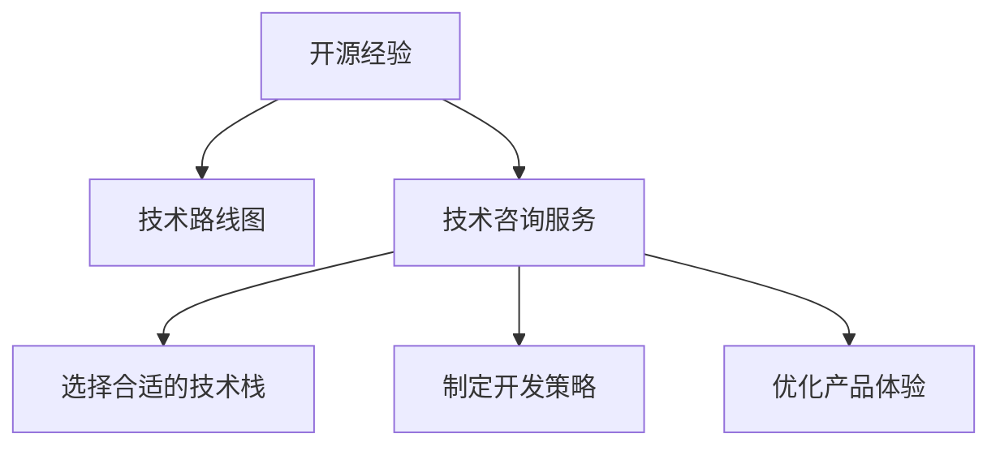

                 

# 利用开源经验提供技术路线图咨询服务

> 关键词：开源经验, 技术路线图, 咨询服务, 软件开发, 软件架构, 技术框架

## 1. 背景介绍

在当今快速发展的技术时代，开源技术已成为许多企业实现技术创新和产品迭代的重要驱动力。开源项目不仅提供了丰富的技术组件和工具，还蕴含了宝贵的开发经验和最佳实践。然而，对于许多企业来说，如何充分利用这些开源资源，打造出高效、稳定的软件系统，仍然是一个不小的挑战。本文旨在介绍一种利用开源经验提供技术路线图咨询服务的解决方案，帮助企业通过技术咨询的方式，有效利用开源资源，加速软件开发进程。

### 1.1 开源经验的重要性

开源经验是开发者和企业在长期的开发实践中积累下来的宝贵资产。它涵盖了从项目架构设计、代码实现、测试到部署和运维等各个环节的最佳实践和经验教训。对于新入行的开发者来说，利用这些经验可以大大缩短学习和实践的时间，提高开发效率；对于经验丰富的开发者来说，利用开源经验可以避免重复造轮子，集中精力解决业务核心问题。

### 1.2 技术咨询服务的需求

随着技术复杂度的不断提升，许多企业在软件开发过程中遇到了难题。尤其是在大型系统和分布式应用的开发中，技术挑战更加复杂，仅依靠内部团队难以高效解决。在这种情况下，企业往往需要外部专业技术的支持和指导，帮助他们规划技术路线图，选择合适的前端和后端技术框架，构建高效的软件架构，规避潜在的风险，加速产品开发和上线。

## 2. 核心概念与联系

为了更好地理解如何利用开源经验提供技术路线图咨询服务，本节将介绍几个核心概念及其相互关系：

### 2.1 核心概念概述

- **开源经验**：指开发者和企业在开源项目开发过程中积累的技术经验、最佳实践、开发指南等。这些经验通过文档、代码示例、社区讨论等形式公开，供其他人学习和借鉴。

- **技术路线图**：是企业为实现特定目标而制定的技术发展计划，包括选择合适的技术栈、工具和框架，以及制定开发、测试和部署策略。技术路线图帮助企业在技术方向上保持一致，确保开发工作有序进行。

- **技术咨询服务**：是指专业的技术顾问或咨询机构，通过提供专业的技术指导、分析、解决方案等，帮助企业解决技术难题、提升开发效率、优化产品体验的技术服务。

这些概念之间的逻辑关系可以通过以下Mermaid流程图来展示：



这个流程图展示了开源经验、技术路线图和技术咨询服务之间的联系：

1. **开源经验**为**技术路线图**提供了丰富的技术组件和实践指导。
2. **技术路线图**指导企业选择合适的**技术栈**和工具，并制定详细的**开发策略**。
3. **技术咨询服务**通过专业指导，帮助企业优化**产品体验**，实现技术目标。

## 3. 核心算法原理 & 具体操作步骤

### 3.1 算法原理概述

利用开源经验提供技术路线图咨询服务的基本原理是：通过分析开源项目的开发过程和文档，提取和总结其中的技术决策、架构设计、代码实现和最佳实践等经验，为企业提供定制化的技术路线图和咨询服务。

### 3.2 算法步骤详解

下面是基于开源经验提供技术路线图咨询服务的详细步骤：

**Step 1: 需求调研**
- 与企业技术团队进行详细沟通，了解其技术需求、产品目标、团队能力和现有技术栈。
- 确定技术咨询的目标，包括选择合适的技术栈、优化系统性能、提升开发效率等。

**Step 2: 开源项目分析**
- 从开源社区选择符合企业需求的开源项目进行深入分析。
- 收集开源项目的文档、代码示例、社区讨论等，理解其架构设计、实现细节和最佳实践。
- 对比开源项目与企业现有系统的差异，识别可迁移和借鉴的技术点。

**Step 3: 技术路线图设计**
- 根据企业需求和开源项目分析结果，设计技术路线图。
- 选择合适的开源组件和框架，确定项目的前端、后端和数据库技术栈。
- 制定详细的开发策略，包括代码规范、版本控制、持续集成和持续交付（CI/CD）流程。

**Step 4: 技术咨询实施**
- 根据技术路线图，提供定制化的技术咨询。
- 指导企业开发团队选择合适的开源组件和工具，进行系统架构设计和代码实现。
- 优化系统性能，提升开发效率，确保系统稳定性和可靠性。

**Step 5: 持续优化**
- 定期回访企业，了解系统运行情况和新的技术需求。
- 根据企业反馈和市场变化，调整和优化技术路线图和咨询服务。

### 3.3 算法优缺点

利用开源经验提供技术路线图咨询服务的优点包括：
1. **丰富经验借鉴**：通过分析开源项目，可以借鉴其中的最佳实践和经验教训，避免重复造轮子。
2. **快速上手**：开源项目通常有详细的文档和示例代码，可以快速上手，缩短开发时间。
3. **灵活性高**：开源社区更新迅速，可以随时获取最新的技术组件和工具，提升系统的前沿性。

然而，该方法也存在一些局限性：
1. **适用性有限**：开源项目适用于特定场景，不能完全覆盖企业所有需求。
2. **兼容性问题**：企业现有系统可能与开源项目不兼容，需要进行一定程度的适配。
3. **依赖开源社区**：依赖开源社区的更新和维护，可能面临社区不活跃或出现bug的风险。

尽管如此，利用开源经验提供技术路线图咨询服务，依然是一种高效、灵活、经济的解决方案，可以帮助企业快速构建高效的软件系统。

### 3.4 算法应用领域

基于开源经验的技术路线图咨询服务，在软件开发、系统架构设计、产品创新等领域都有广泛的应用：

1. **软件开发**：帮助企业选择合适的开源框架和组件，制定开发策略，提升开发效率。
2. **系统架构设计**：提供开源架构设计案例和最佳实践，帮助企业构建高效、可扩展的系统架构。
3. **产品创新**：借鉴开源社区的创新技术，加速产品的迭代和创新。
4. **运维优化**：利用开源运维工具和实践，提升系统的稳定性和可靠性。
5. **数据治理**：借助开源数据管理和分析工具，提升数据质量和利用效率。

这些应用领域展示了开源经验在技术咨询服务中的重要价值和广泛适用性。

## 4. 数学模型和公式 & 详细讲解 & 举例说明

### 4.1 数学模型构建

在技术咨询服务中，数学模型通常用于量化指标和分析性能。例如，利用性能指标公式可以评估系统的响应时间、吞吐量、并发处理能力等。下面以响应时间为例，介绍如何构建数学模型：

假设系统的平均响应时间为 $T$，平均请求间隔时间为 $I$，平均并发用户数为 $C$。响应时间的计算公式为：

$$
T = \frac{1}{C} + \frac{1}{C}\sum_{i=1}^{C}(\frac{1}{I})
$$

其中，$\frac{1}{I}$ 表示请求间隔时间内的处理时间。

### 4.2 公式推导过程

响应时间计算公式的推导过程如下：

- 假设系统有 $C$ 个并发用户，每个用户请求的平均响应时间为 $T$。
- 系统的平均请求间隔时间为 $I$，即在 $I$ 时间内有 $C$ 个请求到达。
- 每个请求的处理时间为 $1/I$，因为请求是平均分布的。
- 因此，每个请求的总处理时间为 $\frac{1}{I}$。
- 系统的总处理时间为 $\frac{1}{I} \times C$。
- 系统的响应时间为总处理时间加上固定的初始处理时间 $\frac{1}{C}$。

### 4.3 案例分析与讲解

以Netflix的推荐系统为例，分析如何利用开源经验提供技术咨询服务。Netflix 使用了Apache Spark进行大数据处理和机器学习，借助TensorFlow进行深度学习，使用Kubernetes进行容器化部署和自动化运维。通过借鉴这些开源实践，Netflix构建了高效、稳定的推荐系统，大幅提升了用户体验。

## 5. 项目实践：代码实例和详细解释说明

### 5.1 开发环境搭建

技术咨询服务的开发环境搭建相对简单，主要依赖于企业现有的开发工具和系统。以下是一些常用的工具和环境：

- **代码编辑器**：如Visual Studio Code、Atom等。
- **版本控制工具**：如Git、SVN等。
- **开发框架**：如Spring Boot、Flask等。
- **容器化工具**：如Docker、Kubernetes等。
- **项目管理工具**：如JIRA、Trello等。

### 5.2 源代码详细实现

以推荐系统为例，开源推荐系统项目如LensKit和MovieLens提供了丰富的推荐算法和实现，可以借鉴其代码实现和配置文件，进行快速开发。

以下是一个基于LensKit的推荐系统实现示例：

```python
from lenskit import Dataset, Algorithm, batch_train, rank_train
from lenskit import accuracy, precision_at_k, ndcg_at_k

# 加载数据集
dataset = Dataset.load('ratings.csv', sep='\t')

# 定义模型
model = Algorithm.load('mfe', use_build=True)

# 训练模型
result = batch_train(model, dataset, nfold=5)

# 评估模型性能
accuracy = accuracy(result)
precision = precision_at_k(result, k=10)
ndcg = ndcg_at_k(result, k=10)

print('Accuracy:', accuracy)
print('Precision at 10:', precision)
print('NDcg at 10:', ndcg)
```

### 5.3 代码解读与分析

上述代码展示了如何加载数据集、定义模型、训练模型和评估模型性能。其中，`LensKit`是一个开源推荐系统工具包，提供了多种推荐算法和评估指标。通过使用这些工具和算法，可以快速构建一个高效的推荐系统，实现商品推荐、用户画像等功能。

## 6. 实际应用场景

### 6.1 智能客服系统

利用开源经验提供技术咨询服务，可以帮助企业构建高效的智能客服系统。例如，借鉴开源智能对话系统如Dialogflow和Rasa，企业可以快速搭建智能问答和对话系统，提升客户体验。

### 6.2 电子商务平台

开源电子商务平台如Shopify和Magento提供了丰富的功能组件和配置选项，可以帮助企业快速构建和部署电商应用。通过利用开源社区的技术和工具，企业可以灵活定制电商功能，提升用户体验和销售转化率。

### 6.3 金融系统

在金融系统中，开源技术如Apache Kafka和Apache Spark可以用于实时数据处理和大数据分析，帮助企业构建高效、可靠的数据处理和分析系统。通过借鉴开源社区的最佳实践，企业可以提升系统的稳定性和安全性，确保金融数据的准确性和完整性。

### 6.4 未来应用展望

随着技术不断发展和演进，开源经验和技术咨询服务的应用领域将更加广泛。未来，利用开源经验提供技术咨询服务将成为企业技术创新的重要手段，帮助企业快速构建高效、可扩展的系统，提升产品竞争力。

## 7. 工具和资源推荐

### 7.1 学习资源推荐

以下是几本关于利用开源经验提供技术咨询服务的相关书籍和文章，推荐阅读：

- 《云计算架构指南》（陈毅飞著）：介绍了云架构设计的基本原则和最佳实践，适合初学者入门。
- 《开源社区的力量》（Jeff Howe著）：探讨了开源社区如何驱动技术创新和产品开发，帮助读者理解开源社区的重要性。
- 《如何构建一个高性能的软件系统》（Martin Fowler著）：介绍了构建高性能系统的设计原则和实践，适合开发者参考。

### 7.2 开发工具推荐

以下是一些常用的技术咨询服务开发工具，推荐使用：

- **版本控制工具**：如Git、SVN等，用于代码管理和版本控制。
- **项目管理工具**：如JIRA、Trello等，用于任务管理和团队协作。
- **容器化工具**：如Docker、Kubernetes等，用于应用部署和自动化运维。
- **开发框架**：如Spring Boot、Flask等，用于快速搭建应用系统。

### 7.3 相关论文推荐

以下是几篇关于开源经验和技术咨询服务的相关论文，推荐阅读：

- 《利用开源经验构建高性能系统》（Ward Cunningham著）：探讨了如何利用开源经验构建高效、可扩展的系统。
- 《开源社区在技术创新中的作用》（Richard Stallman著）：分析了开源社区如何促进技术创新和知识共享。
- 《开源软件开发的最佳实践》（Jesper Lorentzen等著）：介绍了开源项目开发的最佳实践，适合开发者参考。

## 8. 总结：未来发展趋势与挑战

### 8.1 总结

本文介绍了利用开源经验提供技术路线图咨询服务的解决方案，帮助企业通过技术咨询的方式，有效利用开源资源，加速软件开发进程。通过深入分析开源项目，提取和总结其中的技术决策、架构设计、实现细节和最佳实践等经验，为企业提供定制化的技术路线图和咨询服务。技术咨询服务的成功实践证明了开源经验在技术路线图规划和系统构建中的重要价值。

### 8.2 未来发展趋势

随着开源社区的不断发展和壮大，利用开源经验提供技术咨询服务将迎来更大的发展机遇。未来，技术咨询服务将更加注重与开源社区的协作和交流，及时获取最新的技术组件和工具，提升企业技术创新和产品迭代的能力。

### 8.3 面临的挑战

尽管利用开源经验提供技术咨询服务具有诸多优势，但在实际应用中也面临一些挑战：

1. **选择合适的开源组件**：开源组件繁多，选择合适且适配企业需求的组件需要时间和精力。
2. **集成和适配**：开源组件和企业现有系统可能存在兼容性问题，需要进行集成和适配。
3. **技术迁移风险**：开源组件更新迅速，企业需要时刻关注并及时迁移以保持系统的前沿性。
4. **开源社区维护**：开源组件的维护和更新依赖社区，社区活跃度可能影响系统的稳定性和可靠性。

### 8.4 研究展望

未来，利用开源经验提供技术咨询服务需要在以下几个方面进行探索和研究：

1. **自动化工具开发**：开发自动化工具，帮助企业快速识别和选择合适的开源组件，提升技术咨询的效率和准确性。
2. **跨平台兼容性**：研究跨平台兼容性的技术方案，确保开源组件在企业现有系统中的良好运行。
3. **持续集成和交付**：探索持续集成和交付（CI/CD）的最佳实践，提升系统的自动化水平和交付速度。
4. **开源社区参与**：鼓励企业积极参与开源社区的开发和贡献，提升企业的技术影响力和社区地位。
5. **技术咨询平台建设**：建立技术咨询服务平台，集中管理和展示开源组件和最佳实践，方便企业快速查找和使用。

这些研究方向将进一步提升利用开源经验提供技术咨询服务的效果和效率，帮助企业构建高效、可扩展的软件系统，实现技术创新和产品迭代。

## 9. 附录：常见问题与解答

**Q1: 如何选择合适的开源组件？**

A: 选择合适的开源组件需要考虑以下几个方面：
1. **功能需求**：根据企业需求，选择能够满足功能需求的开源组件。
2. **技术成熟度**：选择技术成熟、社区活跃的开源组件，确保系统的稳定性和可靠性。
3. **社区支持**：选择有良好社区支持和文档的开源组件，方便快速上手和解决问题。
4. **兼容性**：选择与企业现有系统兼容的开源组件，确保系统无缝集成。

**Q2: 如何处理开源组件的更新和适配？**

A: 处理开源组件的更新和适配需要以下步骤：
1. **关注社区更新**：定期关注开源社区的更新和发布，获取最新的组件和工具。
2. **版本兼容性**：选择与企业现有系统兼容的组件版本，避免版本冲突。
3. **功能适配**：根据企业需求，对开源组件进行功能适配，确保满足实际需求。
4. **自动化工具**：使用自动化工具和脚本，简化开源组件的迁移和适配过程。

**Q3: 如何提升开源组件的集成和适配效率？**

A: 提升开源组件的集成和适配效率需要以下措施：
1. **自动化部署**：使用自动化部署工具，如Ansible、Puppet等，简化组件的安装和配置。
2. **容器化技术**：使用容器化技术，如Docker、Kubernetes等，实现组件的快速部署和运维。
3. **模块化设计**：采用模块化设计，将组件拆分为多个模块，便于管理和扩展。
4. **持续集成和交付**：使用持续集成和交付（CI/CD）工具，实现组件的快速测试和部署。

**Q4: 如何构建高效的开源技术咨询服务？**

A: 构建高效的开源技术咨询服务需要以下措施：
1. **专家团队**：组建专业的技术顾问团队，具备丰富的开源经验和项目实践经验。
2. **沟通渠道**：建立与企业技术团队的沟通渠道，了解其需求和反馈。
3. **文档支持**：提供详细的文档和示例代码，帮助企业快速上手和解决问题。
4. **持续跟进**：定期回访企业，了解系统运行情况和新的技术需求，提供持续的支持和优化。

**Q5: 如何评估开源技术咨询服务的成果？**

A: 评估开源技术咨询服务的成果需要以下指标：
1. **系统性能**：评估系统的响应时间、吞吐量、并发处理能力等。
2. **功能实现**：评估系统功能是否满足企业需求。
3. **用户体验**：评估用户对系统的使用体验和满意度。
4. **技术债务**：评估系统是否存在技术债务和潜在的风险。

通过以上问题的回答，可以全面理解利用开源经验提供技术路线图咨询服务的技术细节和方法，帮助企业充分利用开源资源，加速技术创新和产品迭代。

