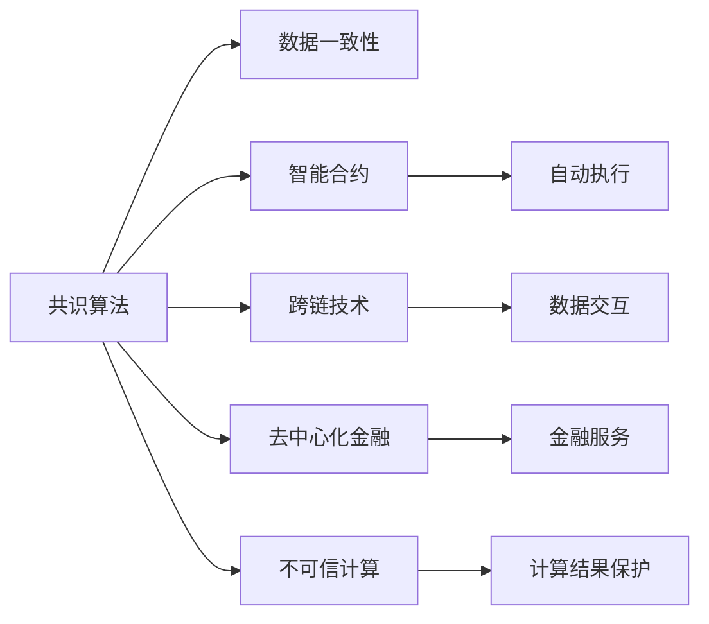

                 

# 利用技术优势进行区块链创新

在过去十年里，区块链技术已经从一个边缘研究领域发展成为一个全球关注的焦点。从加密货币比特币的诞生到全球企业对区块链技术的应用，区块链技术以其去中心化、不可篡改和透明的特性，对金融、供应链、医疗等多个行业产生了深远影响。然而，技术的成熟和普及并非一蹴而就，区块链技术仍面临着诸多挑战，包括性能瓶颈、扩展性问题、安全性隐患等。本文将从技术优势出发，探讨如何利用这些优势推动区块链技术的创新和应用。

## 1. 背景介绍

### 1.1 技术背景

区块链是一种分布式账本技术，通过去中心化的共识算法，确保数据的一致性和透明性。其核心优势包括：

- **去中心化**：无需中介机构，交易和数据由网络中所有参与者共同维护。
- **透明性**：所有交易记录公开可见，确保数据透明。
- **不可篡改性**：一旦数据被写入区块链，就无法被修改或删除。
- **安全性**：通过加密算法保护数据隐私和完整性。

这些优势使得区块链在金融、供应链、医疗等领域具有巨大的应用潜力。

### 1.2 技术发展

区块链技术的发展主要分为四个阶段：

- **第一代**：以比特币为代表，主要解决了支付问题，利用了区块链的去中心化和不可篡改特性。
- **第二代**：以以太坊为代表，引入了智能合约，扩展了区块链的应用范围，如DeFi、NFT等。
- **第三代**：以波卡(Polkadot)、索拉(Solana)为代表，通过创新共识算法和扩展技术，提升了区块链的性能和可扩展性。
- **第四代**：未来的区块链可能将更注重融合多模态数据，提供跨链、跨平台的数据整合和智能合约。

## 2. 核心概念与联系

### 2.1 核心概念

在探讨区块链技术的创新应用之前，先理解一些关键概念：

- **共识算法**：区块链中用于维护数据一致性的算法，如PoW、PoS、DPoS等。
- **智能合约**：一种基于区块链的编程语言，用于自动执行合同条款。
- **跨链技术**：实现区块链间的数据交互和价值转移。
- **去中心化金融(DeFi)**：通过智能合约在区块链上提供金融服务，如借贷、交易等。
- **不可信计算(Trusted Computing)**：利用区块链保护计算结果的完整性和隐私性。

### 2.2 核心概念联系

这些核心概念之间存在紧密的联系，通过融合和创新，可以拓展区块链技术的应用边界，提高其性能和安全性。以下Mermaid流程图展示了这些概念之间的联系：



这个流程图展示了共识算法如何确保数据一致性，智能合约如何实现自动执行，跨链技术如何实现数据交互，去中心化金融如何提供金融服务，不可信计算如何保护计算结果。这些概念的融合将推动区块链技术的全面发展。

## 3. 核心算法原理 & 具体操作步骤

### 3.1 算法原理概述

区块链技术的核心在于其去中心化、透明性和不可篡改性。这些特性使得区块链在数据记录、交易处理、合同执行等方面具有独特的优势。

### 3.2 算法步骤详解

以下以智能合约为例，详细解释基于区块链技术的算法步骤：

**Step 1: 定义合约条款**

智能合约是区块链上的一种自动执行的合同，需要定义清晰的合约条款，如合约启动条件、执行流程和终止条件等。

**Step 2: 编写合约代码**

合约代码使用区块链平台的编程语言（如Solidity）编写，并遵循该语言的标准和规则。

**Step 3: 部署合约**

将编写好的合约代码部署到区块链上，并设定启动参数。部署后的合约代码将不可更改，但可通过交易调用执行。

**Step 4: 执行合约**

当合约条件满足时，通过交易触发合约执行。合约自动执行预定的操作，如转账、交易等。

**Step 5: 验证和审计**

智能合约执行后，其结果和过程将公开可见，任何用户都可以验证合约执行的正确性。审计公司或社区成员也可对合约进行审核，确保其无漏洞。

### 3.3 算法优缺点

区块链技术的优点包括：

- **去中心化**：消除了中介机构，降低了交易成本。
- **透明性**：所有交易记录公开可见，提高了数据的可信度。
- **不可篡改性**：确保了数据的完整性和安全性。

缺点包括：

- **性能瓶颈**：高并发交易可能导致网络延迟和资源消耗。
- **扩展性问题**：目前大部分区块链网络的吞吐量较低，难以支持大规模应用。
- **安全性隐患**：智能合约和共识算法可能存在漏洞，可能导致数据泄露和攻击。

### 3.4 算法应用领域

区块链技术已经在金融、供应链、医疗等多个领域得到了广泛应用，展示了其强大的技术优势。

- **金融领域**：如DeFi、跨境支付、智能合约等。
- **供应链管理**：如溯源、物流追踪、合同执行等。
- **医疗领域**：如病历共享、药品追溯、患者隐私保护等。
- **公共服务**：如身份验证、投票系统、公共记录等。

## 4. 数学模型和公式 & 详细讲解

### 4.1 数学模型构建

区块链技术的数学模型主要包括哈希函数和共识算法。哈希函数用于确保数据的不可篡改性，共识算法用于维护数据的一致性。

### 4.2 公式推导过程

哈希函数的数学模型如下：

$$
H(m) = h_0(m_0, h_1(m_1, ..., h_{n-1}(m_{n-1})))
$$

其中 $m$ 为输入数据，$h_0$ 为哈希函数的主函数，$h_1$ 到 $h_{n-1}$ 为子函数。主函数和子函数均为单向函数，确保数据不可逆。

共识算法的数学模型如下：

$$
C = (V, P, R, Pc, D, S)
$$

其中 $V$ 为验证节点，$P$ 为交易池，$R$ 为共识规则，$Pc$ 为共识参数，$D$ 为数据源，$S$ 为共识结果。共识算法通过共识规则和共识参数，在验证节点间达成一致共识，确保数据的一致性和透明性。

### 4.3 案例分析与讲解

以比特币的共识算法PoW为例，分析其工作原理和特点：

**Step 1: 创建新区块**

每个区块包含一个或多个交易记录，每个区块头部包含前一个区块的哈希值、当前区块的哈希值、时间戳和难度参数。

**Step 2: 计算哈希值**

通过哈希函数计算当前区块的哈希值，确保区块数据的不可篡改性。

**Step 3: 验证和确认**

验证节点根据共识规则（如工作量证明）验证新区块，并在确认后添加至区块链。

**Step 4: 奖励机制**

通过奖励机制（如矿工奖励）激励验证节点参与网络维护。

## 5. 项目实践：代码实例和详细解释说明

### 5.1 开发环境搭建

在开始项目实践之前，需要搭建好开发环境。以下是使用Python和以太坊智能合约框架Solidity进行区块链开发的简单配置流程：

1. 安装Solidity：使用Solidity的官方安装包或通过GitHub获取最新的源代码，并配置环境变量。

2. 安装Truffle或Remix：这两个IDE支持Solidity的开发和测试，并提供了丰富的工具和插件。

3. 安装以太坊节点：如Geth，用于测试和部署智能合约。

### 5.2 源代码详细实现

以下是一个简单的智能合约示例，用于实现一个简单的投票系统：

```solidity
// SPDX-License-Identifier: MIT
pragma solidity ^0.8.0;

contract Voting {
    address public owner;
    uint public voteCount;
    uint public totalVotes;
    mapping(address => uint256) public voteBalance;
    
    event Vote(uint indexed _id, uint indexed _value);
    
    constructor() public {
        owner = msg.sender;
    }
    
    function vote(uint _id) public {
        require(msg.sender != address(0));
        require(voteCount < 1000);
        require(msg.value == 1 ether);
        
        voteBalance[msg.sender] += 1;
        totalVotes += 1;
        
        emit Vote(voteCount, _id);
    }
    
    function count() public view returns (uint) {
        return voteCount;
    }
}
```

### 5.3 代码解读与分析

- `contract Voting`：定义一个名为Voting的智能合约。
- `address public owner`：合约所有者的地址。
- `uint public voteCount`：已投票的数量。
- `uint public totalVotes`：总投票数。
- `mapping(address => uint256) public voteBalance`：每个地址的投票余额。
- `event Vote(uint indexed _id, uint indexed _value)`：定义一个事件，记录投票记录。
- `constructor()`：智能合约的构造函数，初始化所有者。
- `function vote(uint _id)`：投票函数，要求投票者必须是合约所有者，且没有超过投票次数限制。
- `function count()`：统计已投票数量的函数。

通过这个简单的智能合约，我们可以实现一个基本的投票系统，并统计投票结果。

### 5.4 运行结果展示

在测试环境下，我们可以通过Truffle或Remix IDE运行上述合约，并进行测试。例如，使用Ganache测试网络，可以通过以下步骤部署和调用合约：

1. 在Truffle环境下，运行`truffle develop`启动测试网络。
2. 在IDE中编写和编译合约。
3. 运行`truffle migrate --network ganache`将合约部署到测试网络。
4. 在IDE中调用合约函数，如`callVoting`函数进行投票，`getVotingCount`函数获取投票结果。

## 6. 实际应用场景

### 6.1 金融领域

在金融领域，区块链技术可以应用于DeFi、跨境支付、智能合约等。例如，DeFi借贷平台通过智能合约实现自动化借贷和还款，消除了中间环节，降低了交易成本。

### 6.2 供应链管理

区块链技术可以用于供应链的溯源、物流追踪和合同执行。例如，通过区块链记录产品的生产、运输和销售过程，确保数据的透明性和不可篡改性。

### 6.3 医疗领域

区块链技术可以用于病历共享、药品追溯和患者隐私保护。例如，通过区块链存储病历数据，确保数据的完整性和安全性。

### 6.4 未来应用展望

随着区块链技术的发展，未来的应用场景将更加广泛，例如：

- **去中心化身份认证**：通过区块链存储身份信息，确保身份的真实性和隐私性。
- **数字资产管理**：利用智能合约实现数字资产的自动管理和交易。
- **跨链数据交换**：通过跨链技术实现不同区块链之间的数据交互和价值转移。

## 7. 工具和资源推荐

### 7.1 学习资源推荐

以下是几部值得推荐的书籍和课程，帮助读者深入了解区块链技术：

1. 《区块链技术基础与应用》：作者BitGod，全面介绍了区块链的基本概念和应用场景。
2. 《Mastering Blockchain Development with Solidity》：一本Solidity编程指南，适合Solidity开发者入门。
3. 《Blockchain Basics》：Coursera上的区块链课程，由Vitalik Buterin讲解，适合初学者了解区块链基础。
4. 《Blockchain Revolution》：一本关于区块链发展的畅销书，详细描述了区块链技术的起源、发展和未来。

### 7.2 开发工具推荐

以下是一些推荐的区块链开发工具：

1. Solidity：以太坊平台的智能合约编程语言，提供丰富的开发和测试工具。
2. Truffle：一个智能合约开发框架，提供了IDE、测试网络、部署工具等。
3. Remix：一个基于Web的IDE，提供智能合约的编写、测试和部署。
4. Geth：以太坊官方的节点软件，用于测试和部署智能合约。

### 7.3 相关论文推荐

以下是几篇关于区块链技术的经典论文，建议阅读：

1. 《Bitcoin: A Peer-to-Peer Electronic Cash System》：中本聪的比特币白皮书，介绍比特币的工作原理和应用。
2. 《Ethereum Yellow Paper》：以太坊的白皮书，详细介绍了以太坊的技术架构和智能合约。
3. 《The Decentralized Web》：Vitalik Buterin的演讲，讨论了Web 3.0和区块链的未来。
4. 《Smart Contracts: A Survey of Research, Applications, and Challenges》：一篇关于智能合约的综述论文，总结了智能合约的研究进展和应用场景。

## 8. 总结：未来发展趋势与挑战

### 8.1 研究成果总结

区块链技术在去中心化、透明性和不可篡改性等方面具有巨大优势，已经被广泛应用于多个领域。通过智能合约和共识算法，区块链技术正在不断创新和拓展应用边界。

### 8.2 未来发展趋势

未来，区块链技术的发展方向包括：

1. **提高性能**：通过创新的共识算法和扩展技术，提升区块链的吞吐量和响应速度。
2. **增强安全性**：通过智能合约和共识算法的设计，确保数据的安全性和完整性。
3. **拓展应用**：将区块链技术与物联网、人工智能等技术融合，拓展应用场景。
4. **跨链互联**：通过跨链技术实现不同区块链之间的数据交互和价值转移。
5. **去中心化治理**：通过智能合约和共识算法，实现去中心化治理和社区管理。

### 8.3 面临的挑战

区块链技术在发展过程中仍然面临诸多挑战：

1. **性能瓶颈**：高并发交易可能导致网络延迟和资源消耗。
2. **扩展性问题**：目前大部分区块链网络的吞吐量较低，难以支持大规模应用。
3. **安全性隐患**：智能合约和共识算法可能存在漏洞，可能导致数据泄露和攻击。
4. **监管难题**：不同国家和地区的监管政策不同，对区块链技术的接受程度不同。
5. **法律和伦理问题**：区块链技术可能涉及隐私保护、数据泄露等问题。

### 8.4 研究展望

未来的区块链研究将集中在以下几个方向：

1. **提高性能**：开发新的共识算法和扩展技术，提升区块链的吞吐量和响应速度。
2. **增强安全性**：改进智能合约和共识算法的设计，确保数据的安全性和完整性。
3. **拓展应用**：将区块链技术与物联网、人工智能等技术融合，拓展应用场景。
4. **跨链互联**：实现不同区块链之间的数据交互和价值转移，构建开放、互通的区块链网络。
5. **去中心化治理**：通过智能合约和共识算法，实现去中心化治理和社区管理。

## 9. 附录：常见问题与解答

**Q1: 什么是区块链？**

A: 区块链是一种分布式账本技术，通过去中心化的共识算法，确保数据的一致性和透明性。

**Q2: 智能合约是如何工作的？**

A: 智能合约是一种基于区块链的编程语言，用于自动执行合同条款。通过编程定义合约条款，并在区块链上部署，智能合约可以自动执行和维护。

**Q3: 区块链技术有哪些应用场景？**

A: 区块链技术广泛应用于金融、供应链、医疗等多个领域，如DeFi、溯源、病历共享等。

**Q4: 如何确保区块链的安全性？**

A: 区块链的安全性主要依赖于共识算法和智能合约的设计。通过合理的共识算法和智能合约实现，可以有效防止数据泄露和攻击。

**Q5: 区块链的未来发展方向是什么？**

A: 未来，区块链技术将进一步提高性能、增强安全性、拓展应用场景、实现跨链互联和去中心化治理，推动区块链技术的全面发展。

---

作者：禅与计算机程序设计艺术 / Zen and the Art of Computer Programming

