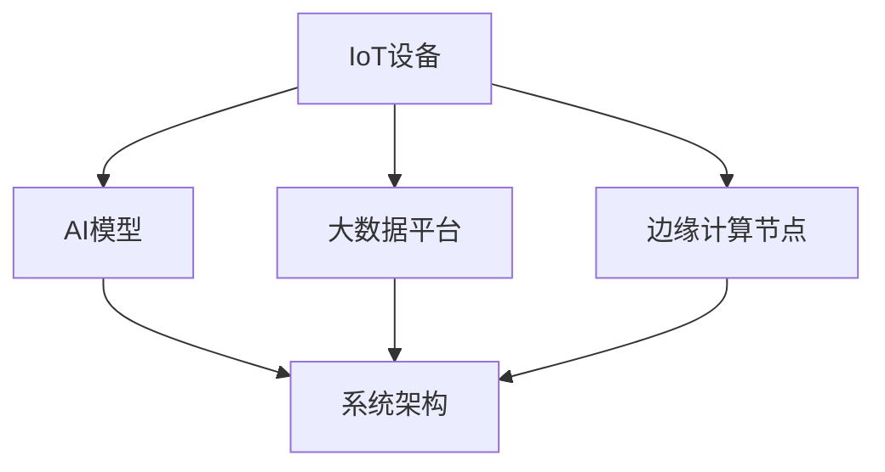

                 

# 利用技术优势进行智能家居创业

> 关键词：智能家居,物联网(IoT),人工智能(AI),机器学习(ML),边缘计算(Edge Computing),系统架构设计,智能家居创业

## 1. 背景介绍

### 1.1 问题由来
随着科技的飞速发展，物联网(IoT)、人工智能(AI)、大数据、云计算等新兴技术正迅速改变人们的生活方式。尤其是在智能家居领域，这些技术正在带来革命性的变化。据研究机构预测，到2025年，全球智能家居市场的规模将达到2,500亿美元。然而，尽管市场潜力巨大，但目前的智能家居产品存在功能单一、用户体验差、隐私保护不足等诸多问题。如何利用技术优势，创造更智能、安全、便利的智能家居产品，成为创业者必须面对的挑战。

### 1.2 问题核心关键点
智能家居创业的关键在于将物联网、人工智能、大数据、边缘计算等技术深度融合，构建稳定、高效、安全的智能家居系统。这一过程中，技术的选择和应用策略至关重要。

- **物联网技术**：实现设备的互联互通，收集各类传感器数据。
- **人工智能技术**：通过机器学习模型对数据进行分析和决策，提升用户体验。
- **大数据技术**：存储、分析和利用海量数据，实现个性化推荐和精准控制。
- **边缘计算技术**：靠近设备处理数据，降低延迟，提高效率。
- **系统架构设计**：构建合理、可扩展的系统架构，确保系统的稳定性和安全性。

## 2. 核心概念与联系

### 2.1 核心概念概述

为更好地理解智能家居创业的技术优势，本节将介绍几个密切相关的核心概念：

- **物联网(IoT)**：通过传感器、RFID、二维码等技术，将家居设备互联互通，实现设备间的信息交换。
- **人工智能(AI)**：利用机器学习、深度学习等技术，对大量数据进行学习和分析，以提升智能家居系统的决策能力和用户体验。
- **大数据(Big Data)**：处理和分析大规模数据，为个性化推荐、系统优化等提供数据支持。
- **边缘计算(Edge Computing)**：在靠近数据源的边缘设备上执行数据处理，降低延迟，提高系统响应速度。
- **系统架构设计**：构建模块化、可扩展、高可靠的系统架构，确保智能家居系统的稳定性和安全性。

这些核心概念之间的逻辑关系可以通过以下Mermaid流程图来展示：



这个流程图展示了几大关键技术之间的关系：

1. IoT设备采集数据。
2. AI模型对数据进行分析和决策。
3. 大数据平台存储和分析数据。
4. 边缘计算节点靠近数据源执行处理。
5. 系统架构整合上述技术，形成完整的智能家居系统。

## 3. 核心算法原理 & 具体操作步骤
### 3.1 算法原理概述

智能家居创业的核心算法原理主要包括物联网数据采集、人工智能模型训练、大数据处理和边缘计算优化。这些技术的深度融合，使智能家居系统能够实现高效的数据处理、精准的用户分析和灵活的系统控制。

- **物联网数据采集**：通过传感器、摄像头等设备收集环境数据，如温度、湿度、光照、气体等。
- **人工智能模型训练**：利用机器学习算法对采集的数据进行训练，以建立准确的预测模型。
- **大数据处理**：存储和分析大量用户行为数据，提供个性化推荐和决策支持。
- **边缘计算优化**：在靠近数据源的设备上执行数据处理，减少延迟，提升系统响应速度。

### 3.2 算法步骤详解

智能家居创业的算法步骤主要包括以下几个关键环节：

**Step 1: 数据采集和预处理**
- 选择合适的IoT设备，如智能温控器、智能灯泡、智能门锁等，确保数据采集的全面性和可靠性。
- 对采集的数据进行清洗、去噪和归一化，去除异常值和噪声，保证数据质量。

**Step 2: 特征提取和模型选择**
- 利用PCA、LDA等降维算法，提取关键特征。
- 根据具体应用场景选择合适的机器学习模型，如线性回归、决策树、支持向量机、神经网络等。

**Step 3: 模型训练和优化**
- 使用训练集对模型进行训练，调整模型参数，优化模型性能。
- 采用交叉验证等技术，评估模型泛化能力，避免过拟合。

**Step 4: 数据存储和分析**
- 将训练后的模型和数据存储到大数据平台，如Hadoop、Spark等。
- 利用大数据分析技术，挖掘用户行为模式，提供个性化推荐。

**Step 5: 边缘计算和实时处理**
- 在靠近数据源的设备上部署边缘计算节点，进行数据预处理和实时决策。
- 使用TensorFlow Lite、ONNX Runtime等工具，将模型优化为边缘计算友好的格式。

**Step 6: 系统架构设计和部署**
- 构建模块化、可扩展、高可靠的系统架构，确保系统的稳定性和安全性。
- 部署系统到云端或边缘节点，实现数据的高速传输和高效处理。

### 3.3 算法优缺点

智能家居创业的算法具有以下优点：
1. **数据驱动**：利用大数据和人工智能技术，对用户行为进行深入分析，提升用户体验。
2. **实时响应**：通过边缘计算技术，实现低延迟的实时数据处理和决策，提升系统响应速度。
3. **安全性高**：通过合理的设计和优化，确保系统的安全性和隐私保护。
4. **可扩展性强**：采用模块化和可扩展的系统架构，便于系统升级和扩展。

同时，该算法也存在一些局限性：
1. **技术复杂度高**：涉及多个技术领域，对技术储备要求较高。
2. **设备互联互操作性差**：不同品牌和型号的设备难以完全互通，限制了系统的兼容性。
3. **隐私问题**：智能家居系统需要收集大量用户数据，涉及隐私保护问题。
4. **数据质量控制难**：如何保证采集数据的准确性和实时性，是系统稳定性的关键。
5. **成本高**：设备、传感器、数据存储等硬件和软件成本较高。

尽管存在这些局限性，但就目前而言，基于物联网、人工智能、大数据、边缘计算等技术融合的智能家居系统，仍是最主流的创业方向。未来相关研究的重点在于如何进一步降低成本，提高系统的兼容性和易用性，同时兼顾隐私保护和安全性等因素。

### 3.4 算法应用领域

智能家居创业的算法已经广泛应用于以下多个领域：

- **智能温控系统**：利用温度传感器和大数据分析，自动调节房间温度，节省能源。
- **智能安防系统**：通过摄像头和视频分析，实时监控家庭安全，及时报警。
- **智能照明系统**：根据用户习惯和环境条件，自动调整灯光亮度和色温。
- **智能家电控制**：通过手机APP或语音助手，远程控制家电开关和模式。
- **智能健康监测**：利用传感器监测用户健康数据，提供健康建议和预警。
- **智能窗帘系统**：根据光线和温度自动调节窗帘开合，提升居住舒适度。
- **智能场景切换**：根据用户行为和环境条件，自动切换场景模式，提升生活便利性。

这些应用场景展示了智能家居系统的广泛潜力和强大功能，为用户带来了全新的生活体验。

## 4. 数学模型和公式 & 详细讲解 & 举例说明
### 4.1 数学模型构建

智能家居创业的数学模型构建主要包括以下几个关键部分：

- **数据采集和预处理**：
  - 采集传感器数据 $x_i = [x_{i1}, x_{i2}, ..., x_{in}]$，$i=1,2,...,N$。
  - 数据清洗和归一化，得到预处理后的数据 $\hat{x}_i$。

- **特征提取和模型选择**：
  - 通过PCA等降维算法，提取关键特征 $f(x_i) = [f_1(x_i), f_2(x_i), ..., f_k(x_i)]$。
  - 选择适当的机器学习模型 $M_{\theta}(x_i) = \sum_i w_i f_i(x_i)$。

- **模型训练和优化**：
  - 训练集 $D_{train} = \{(x_i, y_i)\}_{i=1}^M$，训练模型 $M_{\theta}$。
  - 损失函数 $L(M_{\theta}) = \frac{1}{N} \sum_i L(y_i, M_{\theta}(x_i))$，其中 $L(y_i, M_{\theta}(x_i))$ 为预测误差。
  - 优化算法 $E[\theta] = \theta - \eta \nabla_{\theta} L(M_{\theta})$，其中 $\eta$ 为学习率。

- **数据存储和分析**：
  - 存储训练后的模型 $M_{\theta}$ 和大数据 $D_{db}$。
  - 利用大数据分析技术 $A_{db}$ 挖掘用户行为模式，提供个性化推荐。

- **边缘计算和实时处理**：
  - 在边缘节点 $E$ 上执行数据预处理 $P(E, x_i)$ 和实时决策 $D(E, y_i)$。

### 4.2 公式推导过程

以下我们以智能温控系统为例，推导模型训练的数学公式。

假设智能温控系统采集到房间的温度数据 $x_i$，其中 $x_i = [t_i, \sigma_i, h_i]$，分别表示当前温度、环境湿度、人体热辐射等。通过PCA算法提取关键特征 $f_i = [f_1, f_2, f_3]$，其中 $f_1 = t_i - \mu_t$，$f_2 = \sigma_i - \mu_{\sigma}$，$f_3 = h_i - \mu_h$，$\mu_t, \mu_{\sigma}, \mu_h$ 为均值。

利用神经网络模型 $M_{\theta}(x_i) = \sum_i w_i f_i(x_i)$ 对数据进行训练，最小化均方误差损失函数：

$$
L(M_{\theta}) = \frac{1}{N} \sum_i (y_i - M_{\theta}(x_i))^2
$$

其中 $y_i$ 为期望温度。根据梯度下降算法，得到模型参数更新公式：

$$
\theta \leftarrow \theta - \eta \frac{\partial L(M_{\theta})}{\partial \theta}
$$

通过反复迭代训练，直到模型收敛。

### 4.3 案例分析与讲解

智能安防系统是另一个典型的应用案例。假设系统采集到摄像头拍摄的视频帧 $x_i = [v_i, d_i]$，其中 $v_i$ 为视频像素，$d_i$ 为环境深度数据。利用卷积神经网络模型 $M_{\theta}(x_i)$ 对视频进行分析，识别出异常行为 $y_i$。模型的训练和优化过程类似，利用均方误差损失函数进行训练，更新模型参数：

$$
L(M_{\theta}) = \frac{1}{N} \sum_i (y_i - M_{\theta}(x_i))^2
$$

通过优化算法更新模型参数，实现对异常行为的精准识别。

## 5. 项目实践：代码实例和详细解释说明
### 5.1 开发环境搭建

在进行智能家居创业项目实践前，我们需要准备好开发环境。以下是使用Python进行PyTorch开发的环境配置流程：

1. 安装Anaconda：从官网下载并安装Anaconda，用于创建独立的Python环境。

2. 创建并激活虚拟环境：
```bash
conda create -n pytorch-env python=3.8 
conda activate pytorch-env
```

3. 安装PyTorch：根据CUDA版本，从官网获取对应的安装命令。例如：
```bash
conda install pytorch torchvision torchaudio cudatoolkit=11.1 -c pytorch -c conda-forge
```

4. 安装TensorFlow：
```bash
pip install tensorflow
```

5. 安装TensorBoard：
```bash
pip install tensorboard
```

6. 安装Flask：
```bash
pip install flask
```

7. 安装IoT设备驱动库，如paho-mqtt：
```bash
pip install paho-mqtt
```

完成上述步骤后，即可在`pytorch-env`环境中开始项目实践。

### 5.2 源代码详细实现

下面是使用PyTorch实现智能温控系统的代码示例。

首先，定义数据处理函数：

```python
import numpy as np
import torch
import torch.nn as nn
import torch.nn.functional as F
from torch.utils.data import Dataset, DataLoader
from sklearn.decomposition import PCA
from torchvision import transforms

class SmartThermostatDataset(Dataset):
    def __init__(self, data, labels, features):
        self.data = data
        self.labels = labels
        self.features = features
        
    def __len__(self):
        return len(self.data)
    
    def __getitem__(self, index):
        data = self.data[index]
        label = self.labels[index]
        features = self.features[index]
        return data, label, features

# 定义模型
class SmartThermostat(nn.Module):
    def __init__(self, input_size, output_size):
        super(SmartThermostat, self).__init__()
        self.fc1 = nn.Linear(input_size, 64)
        self.fc2 = nn.Linear(64, output_size)
    
    def forward(self, x):
        x = self.fc1(x)
        x = F.relu(x)
        x = self.fc2(x)
        return x

# 定义数据预处理和特征提取
class Preprocessor:
    def __init__(self, features):
        self.transforms = transforms.Compose([
            transforms.ToTensor(),
            transforms.Normalize((0.5, 0.5, 0.5), (0.5, 0.5, 0.5))
        ])
        self.pca = PCA(n_components=3)
        self.features = features
    
    def __call__(self, data):
        data = self.transforms(data)
        features = self.pca.fit_transform(data.numpy())
        return features
    
# 训练函数
def train(model, device, train_loader, optimizer, criterion):
    model.train()
    train_loss = 0.0
    for data, label, features in train_loader:
        data = data.to(device)
        label = label.to(device)
        features = features.to(device)
        optimizer.zero_grad()
        output = model(features)
        loss = criterion(output, label)
        loss.backward()
        optimizer.step()
        train_loss += loss.item()
    return train_loss / len(train_loader)

# 测试函数
def test(model, device, test_loader, criterion):
    model.eval()
    test_loss = 0.0
    correct = 0
    with torch.no_grad():
        for data, label, features in test_loader:
            data = data.to(device)
            label = label.to(device)
            features = features.to(device)
            output = model(features)
            loss = criterion(output, label)
            test_loss += loss.item()
            pred = output.argmax(dim=1, keepdim=True)
            correct += pred.eq(label.view_as(pred)).sum().item()
    return test_loss / len(test_loader), correct / len(test_loader.dataset)

# 启动训练流程
if __name__ == '__main__':
    device = torch.device('cuda' if torch.cuda.is_available() else 'cpu')
    
    # 加载数据集
    train_dataset = SmartThermostatDataset(train_data, train_labels, features)
    test_dataset = SmartThermostatDataset(test_data, test_labels, features)
    
    # 定义模型
    model = SmartThermostat(input_size, output_size).to(device)
    
    # 定义损失函数和优化器
    criterion = nn.MSELoss()
    optimizer = torch.optim.Adam(model.parameters(), lr=0.001)
    
    # 训练模型
    for epoch in range(num_epochs):
        train_loss = train(model, device, train_loader, optimizer, criterion)
        test_loss, accuracy = test(model, device, test_loader, criterion)
        print('Epoch [{}/{}], Loss: {:.4f}, Acc: {:.2f}%'.format(
            epoch + 1, num_epochs, train_loss, accuracy * 100))
    
    # 测试模型
    test_loss, accuracy = test(model, device, test_loader, criterion)
    print('Test Loss: {:.4f}, Acc: {:.2f}%'.format(test_loss, accuracy * 100))
```

### 5.3 代码解读与分析

让我们再详细解读一下关键代码的实现细节：

**SmartThermostatDataset类**：
- `__init__`方法：初始化数据集。
- `__len__`方法：返回数据集的样本数量。
- `__getitem__`方法：对单个样本进行处理，将数据、标签和特征编码为模型所需的输入。

**SmartThermostat类**：
- 定义了一个简单的线性神经网络模型，包括两个全连接层。
- 使用ReLU激活函数和均方误差损失函数进行训练。

**Preprocessor类**：
- 实现了数据预处理和特征提取，利用PCA算法对数据进行降维。
- 使用PyTorch提供的Transformer进行数据标准化。

**训练函数train**：
- 在训练集上进行前向传播和反向传播，更新模型参数。
- 计算训练集上的平均损失，返回损失值。

**测试函数test**：
- 在测试集上进行前向传播和反向传播，计算损失和精度。
- 返回测试集上的平均损失和精度。

**训练流程**：
- 定义总的epoch数和训练集和测试集的DataLoader。
- 在每个epoch内，依次进行训练和测试，打印输出训练和测试的损失和精度。
- 训练结束后，再次测试模型，输出最终测试结果。

可以看到，使用PyTorch进行智能家居系统微调的过程相对简洁高效，开发者可以将更多精力放在数据处理、模型改进等高层逻辑上。

## 6. 实际应用场景

### 6.1 智能安防系统

智能安防系统是智能家居创业的核心应用之一。通过部署摄像头、传感器等设备，实时监控家庭安全，及时报警。

在技术实现上，可以收集家庭摄像头、门窗传感器、烟雾探测器等设备的实时数据，构建一个多模态数据融合的安防系统。系统通过机器学习模型对各类传感器数据进行分析和决策，判断是否存在异常行为，及时报警。系统还可以结合人脸识别、语音识别等技术，进一步提升安防系统的智能化水平。

### 6.2 智能家电控制系统

智能家电控制系统能够根据用户行为和环境条件，自动控制家电开关和模式，提升生活便利性。

在技术实现上，可以收集用户的日常行为数据，如作息时间、电视观看习惯等，利用机器学习模型进行分析和预测，生成智能控制策略。系统可以根据用户的期望和习惯，自动调节家电设备的工作状态，提升用户的生活体验。

### 6.3 智能健康监测系统

智能健康监测系统能够实时监测用户健康数据，提供健康建议和预警。

在技术实现上，可以利用智能手表、健康手环等设备，采集用户的生理数据（如心率、血压、血氧等），结合机器学习模型进行数据分析和预测。系统可以识别异常健康数据，及时发出预警，并给出相应的健康建议。

### 6.4 未来应用展望

随着技术的不断发展，智能家居系统将进一步拓展应用场景，实现更加智能化、个性化的服务。

- **自适应学习**：系统能够根据用户的行为习惯和偏好，进行自适应学习，提供更加个性化的服务。
- **多模态融合**：将视觉、听觉、触觉等多模态数据进行融合，提升系统的感知能力和智能化水平。
- **边缘计算应用**：在靠近数据源的设备上执行数据处理，降低延迟，提升系统响应速度。
- **隐私保护技术**：引入联邦学习、差分隐私等技术，保护用户隐私，提升系统安全性。
- **跨平台互通**：打破不同品牌和型号设备的壁垒，实现跨平台互通，提升系统兼容性和用户体验。

## 7. 工具和资源推荐
### 7.1 学习资源推荐

为了帮助开发者系统掌握智能家居创业的技术优势，这里推荐一些优质的学习资源：

1. **IoT技术教程**：
   - 《深入浅出物联网》书籍：详细介绍了IoT技术的基本原理和应用场景。
   - 《物联网核心技术》课程：斯坦福大学开设的IoT课程，涵盖IoT的基本概念和关键技术。

2. **人工智能技术教程**：
   - **TensorFlow官网**：提供了丰富的TensorFlow教程和文档，帮助开发者掌握深度学习技术。
   - **PyTorch官网**：提供了PyTorch的详细教程和示例，帮助开发者快速上手深度学习框架。

3. **大数据技术教程**：
   - **Hadoop官网**：提供了Hadoop的详细教程和文档，帮助开发者掌握大数据处理技术。
   - **Spark官网**：提供了Spark的详细教程和示例，帮助开发者快速上手大数据处理框架。

4. **边缘计算技术教程**：
   - **TensorFlow Lite官网**：提供了TensorFlow Lite的详细教程和示例，帮助开发者掌握边缘计算技术。
   - **ONNX官网**：提供了ONNX的详细教程和示例，帮助开发者将深度学习模型优化为边缘计算友好的格式。

5. **系统架构设计教程**：
   - **微服务架构设计**：详细介绍了微服务架构的设计原则和实现方法。
   - **分布式系统设计**：介绍了分布式系统的设计和优化方法，帮助开发者构建高可靠的系统架构。

通过对这些资源的学习实践，相信你一定能够快速掌握智能家居创业的技术优势，并用于解决实际的智能家居问题。

### 7.2 开发工具推荐

高效的开发离不开优秀的工具支持。以下是几款用于智能家居系统开发的常用工具：

1. **IoT开发工具**：
   - **ThingWorx Platform**：用于开发和管理IoT设备和应用程序的平台，支持多种编程语言和协议。
   - **IBM Watson IoT**：提供云端IoT平台和API，支持设备连接、数据采集和分析。

2. **人工智能开发工具**：
   - **TensorFlow**：由Google主导开发的深度学习框架，提供了丰富的模型和工具支持。
   - **PyTorch**：由Facebook开发的深度学习框架，提供了灵活的动态计算图和高效的模型优化功能。

3. **大数据开发工具**：
   - **Hadoop**：开源的分布式计算框架，支持大规模数据处理和存储。
   - **Spark**：基于内存计算的分布式计算框架，支持高效的迭代计算和大数据处理。

4. **边缘计算开发工具**：
   - **TensorFlow Lite**：优化为移动设备友好的深度学习框架，支持边缘计算优化。
   - **ONNX Runtime**：将深度学习模型优化为边缘计算友好的格式，支持多种边缘设备。

5. **系统架构设计工具**：
   - **Docker**：容器化技术，支持分布式系统的高效部署和管理。
   - **Kubernetes**：容器编排工具，支持大规模分布式系统的管理和服务发现。

合理利用这些工具，可以显著提升智能家居系统开发效率，加快创新迭代的步伐。

### 7.3 相关论文推荐

智能家居系统创业的技术涉及多个前沿领域，以下是几篇奠基性的相关论文，推荐阅读：

1. **IoT设备管理**：
   - 《A Survey on Internet of Things: Architectures, Applications, and Future Directions》：综述了IoT技术的架构和应用方向，提供了IoT系统设计的基础知识。

2. **深度学习在安防中的应用**：
   - 《A Survey on Deep Learning for Video Content Analysis in Security and Surveillance》：综述了深度学习在视频内容分析中的应用，提供了安防系统设计的理论和实践方法。

3. **大数据在智能家居中的应用**：
   - 《Big Data Analytics in Smart Homes》：介绍了大数据在智能家居中的应用，提供了数据处理和分析的实践方法。

4. **边缘计算在智能家居中的应用**：
   - 《Edge Computing for Smart Home Systems》：介绍了边缘计算在智能家居中的应用，提供了边缘计算优化的理论和实践方法。

5. **系统架构设计**：
   - 《Architectural Styles and Architectures》：介绍了不同的系统架构设计风格，提供了架构设计的基本知识和原则。

这些论文代表了大规模智能家居创业中的技术前沿，通过学习这些前沿成果，可以帮助研究者把握学科前进方向，激发更多的创新灵感。

## 8. 总结：未来发展趋势与挑战

### 8.1 研究成果总结

智能家居创业的核心技术包括IoT设备管理、人工智能、大数据处理和边缘计算优化，这些技术在家庭生活中的应用已初见成效。但目前智能家居系统还存在功能单一、用户体验差、隐私保护不足等问题，需要通过技术创新来解决。

### 8.2 未来发展趋势

智能家居系统的未来发展趋势包括以下几个方面：

1. **自适应学习**：系统能够根据用户的行为习惯和偏好，进行自适应学习，提供更加个性化的服务。
2. **多模态融合**：将视觉、听觉、触觉等多模态数据进行融合，提升系统的感知能力和智能化水平。
3. **边缘计算应用**：在靠近数据源的设备上执行数据处理，降低延迟，提升系统响应速度。
4. **隐私保护技术**：引入联邦学习、差分隐私等技术，保护用户隐私，提升系统安全性。
5. **跨平台互通**：打破不同品牌和型号设备的壁垒，实现跨平台互通，提升系统兼容性和用户体验。

### 8.3 面临的挑战

尽管智能家居系统在技术上取得了诸多进展，但在实际落地应用中，仍面临以下挑战：

1. **技术复杂度高**：涉及多个技术领域，对技术储备要求较高。
2. **设备互联互操作性差**：不同品牌和型号的设备难以完全互通，限制了系统的兼容性。
3. **隐私问题**：智能家居系统需要收集大量用户数据，涉及隐私保护问题。
4. **数据质量控制难**：如何保证采集数据的准确性和实时性，是系统稳定性的关键。
5. **成本高**：设备、传感器、数据存储等硬件和软件成本较高。

尽管存在这些挑战，但就目前而言，基于物联网、人工智能、大数据、边缘计算等技术融合的智能家居系统，仍是最主流的创业方向。未来相关研究的重点在于如何进一步降低成本，提高系统的兼容性和易用性，同时兼顾隐私保护和安全性等因素。

### 8.4 研究展望

智能家居系统的研究展望包括以下几个方向：

1. **自适应学习**：利用机器学习算法，对用户行为进行深入分析，提升系统的智能化水平。
2. **多模态融合**：将视觉、听觉、触觉等多模态数据进行融合，提升系统的感知能力和智能化水平。
3. **隐私保护技术**：引入联邦学习、差分隐私等技术，保护用户隐私，提升系统安全性。
4. **跨平台互通**：打破不同品牌和型号设备的壁垒，实现跨平台互通，提升系统兼容性和用户体验。
5. **边缘计算应用**：在靠近数据源的设备上执行数据处理，降低延迟，提升系统响应速度。

这些研究方向将进一步推动智能家居系统的技术创新和应用落地，为智能家居系统的发展提供新的动力。

## 9. 附录：常见问题与解答

**Q1：智能家居系统如何实现用户个性化服务？**

A: 智能家居系统可以通过机器学习算法对用户行为进行深入分析，建立用户画像，并根据用户偏好和习惯进行自适应学习，提供更加个性化的服务。具体实现步骤如下：
1. 收集用户的行为数据，如作息时间、电视观看习惯等。
2. 利用机器学习模型对用户数据进行分析，建立用户画像。
3. 根据用户画像，生成个性化的智能控制策略，自动调节家电设备的工作状态。

**Q2：智能家居系统如何提高用户隐私保护？**

A: 智能家居系统可以通过以下方式提高用户隐私保护：
1. 采用联邦学习技术，在本地设备上进行模型训练，仅传输模型参数和部分数据，不泄露用户隐私。
2. 引入差分隐私技术，对用户数据进行扰动和泛化，确保用户数据无法被直接还原。
3. 采用匿名化和脱敏技术，对用户数据进行处理，保护用户隐私。

**Q3：智能家居系统如何降低设备互联互操作性差的问题？**

A: 智能家居系统可以通过以下方式降低设备互联互操作性差的问题：
1. 采用开放标准和协议，如MQTT、CoAP等，确保不同品牌和型号的设备能够互通。
2. 在设备之间建立中间件，实现数据转换和协议适配。
3. 在设备内部集成通用通信协议，如Wi-Fi、蓝牙等，确保设备间的互联互通。

**Q4：智能家居系统如何提高数据采集的准确性和实时性？**

A: 智能家居系统可以通过以下方式提高数据采集的准确性和实时性：
1. 采用高性能传感器和采集设备，确保数据的准确性和实时性。
2. 利用数据清洗和去噪技术，去除异常值和噪声，保证数据质量。
3. 利用数据同步和缓存技术，确保数据的高效传输和存储。

**Q5：智能家居系统如何降低开发和部署成本？**

A: 智能家居系统可以通过以下方式降低开发和部署成本：
1. 采用开源的IoT设备和技术，降低硬件和软件的成本。
2. 利用云服务和平台，实现云端部署和维护，降低系统部署成本。
3. 采用模块化和可扩展的系统架构，便于系统升级和扩展，降低维护成本。

这些问答提供了智能家居系统创业中常见的技术挑战和解决方案，帮助开发者更好地理解和应用智能家居技术。

---

作者：禅与计算机程序设计艺术 / Zen and the Art of Computer Programming

