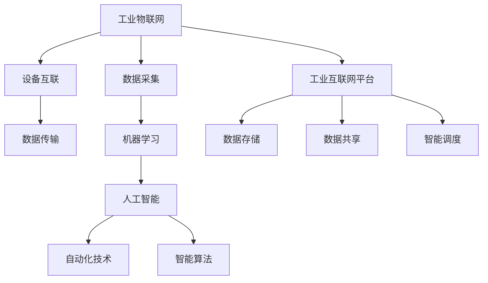

                 

# 利用技术优势进行智能工厂创业

> 关键词：智能工厂,创业,工业互联网,物联网,机器学习,人工智能,自动化

## 1. 背景介绍

### 1.1 问题由来

随着人工智能和物联网技术的迅猛发展，智能工厂的建设已经成为制造业升级转型的重要方向。传统的制造业生产模式主要以人工为主，效率低下、质量不稳定，难以满足客户对产品多样性、快速交付的需求。而智能工厂通过融合信息化和自动化技术，可以实现生产过程的全生命周期管理，极大提高生产效率和产品质量，降低运营成本，提升企业的市场竞争力。

但智能工厂的建设涉及庞大的技术体系和复杂的项目管理，需要克服诸多挑战，如硬件设备和软件系统的集成、数据采集与处理的自动化、生产流程的优化和调整、智能算法的优化与集成等。这些问题使得智能工厂的建设难度极大，对创业团队的技术能力提出了很高的要求。

### 1.2 问题核心关键点

智能工厂的建设主要围绕以下几个核心关键点展开：

1. **工业物联网(IoT)技术**：通过物联网技术实现设备、系统、数据的互联互通，构建数据驱动的生产环境。

2. **机器学习和人工智能技术**：通过大数据、深度学习等技术优化生产流程，提升决策效率和准确性。

3. **自动化技术**：通过机器人和自动化设备实现生产线的自动化，提升生产效率和安全性。

4. **工业互联网平台**：搭建工业互联网平台，实现设备、数据、算法的统一管理和调度。

5. **智能算法与模型**：通过模型驱动的决策优化，实现生产过程的智能控制和优化。

这些关键点共同构成了智能工厂的技术框架，使得智能工厂建设成为一项系统工程，对技术团队提出了多方面的挑战。

## 2. 核心概念与联系

### 2.1 核心概念概述

为了更好地理解智能工厂的建设过程，本节将介绍几个密切相关的核心概念：

- **工业物联网(IoT)**：指通过传感器、通信设备和软件系统，将生产线上的设备和系统连接起来，实现数据采集和传输。

- **机器学习与人工智能**：指利用数据驱动的算法模型，从数据中学习规律，实现对生产过程的预测和决策优化。

- **自动化技术**：指通过机械臂、机器人等自动化设备，实现生产线的自动化和智能化。

- **工业互联网平台**：指通过云计算、大数据、物联网等技术，搭建统一的数据共享和管理系统，实现生产流程的智能调度。

- **智能算法与模型**：指用于分析和优化生产过程的各种算法和模型，如深度学习、优化算法、仿真模型等。

这些核心概念之间的逻辑关系可以通过以下Mermaid流程图来展示：



这个流程图展示了工业物联网、机器学习、自动化技术、工业互联网平台、智能算法与模型之间的关系：

1. 工业物联网通过设备互联采集数据，机器学习与人工智能对数据进行分析和处理，自动化技术实现生产自动化，智能算法与模型实现智能决策。
2. 工业互联网平台集成数据存储、共享和智能调度功能，实现生产流程的全生命周期管理。

这些核心概念共同构成了智能工厂的技术架构，为智能工厂的建设提供了全面的技术支持。

## 3. 核心算法原理 & 具体操作步骤

### 3.1 算法原理概述

智能工厂的建设主要依赖于机器学习、人工智能、物联网和自动化技术，涉及的数据量庞大、复杂，算法模型需要具备强大的数据处理和分析能力。以下我们将重点介绍机器学习算法在智能工厂建设中的作用。

机器学习算法可以用于以下几个方面：

- **设备预测性维护**：通过预测设备故障，实现设备的预防性维护，减少停机时间和维修成本。
- **工艺优化**：通过数据分析，优化生产工艺和流程，提高生产效率和产品质量。
- **生产调度优化**：通过智能调度算法，优化生产任务安排和资源分配，提升生产效率。
- **质量控制**：通过数据分析和模型训练，实现对产品质量的实时监控和预测。

这些应用都基于数据驱动的算法模型，需要在大量的生产数据上进行训练和优化，以提升模型的泛化能力和预测精度。

### 3.2 算法步骤详解

以下我们将详细介绍机器学习算法在智能工厂建设中的应用步骤：

**Step 1: 数据采集与处理**

智能工厂的建设首先需要通过传感器、标签和监控系统等手段采集生产过程中的数据，包括设备运行状态、环境参数、生产工艺等。采集到的数据需要经过预处理和清洗，以保证数据的准确性和一致性。

**Step 2: 特征工程**

在数据采集和处理的基础上，需要进行特征工程，提取对模型训练有帮助的特征，如设备运行状态、故障次数、环境温度等。特征工程是机器学习模型训练的重要环节，对模型的性能有着直接影响。

**Step 3: 模型训练与优化**

选择合适的机器学习模型，如回归模型、分类模型、深度学习模型等，进行训练和优化。训练模型需要大量的标注数据和计算资源，通常需要在高性能的服务器或云平台上进行。

**Step 4: 模型应用与监控**

将训练好的模型应用到生产过程中，对设备状态、生产工艺等进行实时监控和预测，优化生产流程。同时需要对模型的性能进行监控和评估，确保模型始终处于最佳状态。

**Step 5: 模型迭代与更新**

根据生产过程中出现的新问题，不断迭代和更新模型，确保模型能够适应新的生产环境和技术需求。

### 3.3 算法优缺点

智能工厂建设中机器学习算法的优点包括：

1. **高效准确**：机器学习算法可以处理大量的数据，快速提取特征，进行高效准确的预测和决策。
2. **实时监控**：机器学习算法可以实现对生产过程的实时监控，及时发现和解决问题。
3. **自动化控制**：通过机器学习算法，可以实现自动化控制，提升生产效率和安全性。
4. **可扩展性强**：机器学习算法可以随着数据的积累和模型的优化，不断提升性能。

但机器学习算法也存在一些缺点：

1. **依赖数据质量**：机器学习算法的效果很大程度上依赖于数据的准确性和一致性，数据采集和处理过程复杂。
2. **计算资源需求高**：机器学习算法的训练和优化需要大量的计算资源，对硬件设备和平台要求较高。
3. **模型解释性差**：机器学习算法的黑盒性质导致其输出结果难以解释，不利于进行系统优化和维护。
4. **易受攻击**：机器学习算法容易受到对抗样本攻击，影响模型的稳定性和安全性。

这些优缺点需要结合具体应用场景进行权衡和优化，以充分发挥机器学习算法的优势，弥补其不足。

### 3.4 算法应用领域

机器学习算法在智能工厂的建设中有着广泛的应用，涵盖了生产过程的各个环节：

- **设备预测性维护**：通过机器学习算法对设备运行状态进行预测，实现设备状态的实时监控和预防性维护。
- **工艺优化**：利用机器学习算法对生产工艺进行优化，提高生产效率和产品质量。
- **生产调度优化**：通过机器学习算法对生产任务进行智能调度，优化生产流程。
- **质量控制**：通过机器学习算法对产品质量进行实时监控和预测，提高产品质量。
- **能源管理**：利用机器学习算法对生产过程中的能源消耗进行优化，降低能耗成本。
- **供应链管理**：通过机器学习算法对供应链进行优化，实现库存管理、物流优化等。

这些应用场景展示了机器学习算法在智能工厂建设中的重要性和广泛性，为智能工厂的建设提供了强大的技术支持。

## 4. 数学模型和公式 & 详细讲解 & 举例说明

### 4.1 数学模型构建

本节将使用数学语言对机器学习算法在智能工厂建设中的应用进行更加严格的刻画。

假设有一台设备，运行状态为 $x$，故障次数为 $y$，环境温度为 $z$。通过机器学习算法对设备进行预测性维护，构建预测模型 $f(x,z)$ 用于预测故障次数 $y$。数学模型可以表示为：

$$
y = f(x,z)
$$

其中 $x$ 和 $z$ 为模型的输入特征，$f(x,z)$ 为模型函数，$y$ 为模型的输出结果。

### 4.2 公式推导过程

对于回归模型，可以使用线性回归公式进行推导：

$$
y = \beta_0 + \beta_1x + \beta_2z + \epsilon
$$

其中 $\beta_0$ 为截距，$\beta_1$ 和 $\beta_2$ 为系数，$\epsilon$ 为误差项。模型训练的目标是最小化预测误差，即：

$$
\min_{\beta_0, \beta_1, \beta_2} \sum_{i=1}^n (y_i - f(x_i, z_i))^2
$$

在实际应用中，通常使用最小二乘法等优化算法进行求解。

### 4.3 案例分析与讲解

假设有一家汽车制造企业，通过传感器实时采集生产设备的温度、振动等数据，使用线性回归模型进行设备预测性维护。具体步骤如下：

1. 数据采集：通过传感器采集设备温度、振动等数据，保存为数据集 $D = \{(x_i, y_i)\}_{i=1}^n$，其中 $x_i$ 为设备温度，$y_i$ 为故障次数。

2. 特征工程：将温度数据进行归一化处理，提取设备温度、振动等特征，构建特征向量 $X = [x_1, x_2, ..., x_n]$。

3. 模型训练：使用线性回归模型进行训练，得到回归系数 $\beta_0, \beta_1, \beta_2$，构建预测模型 $f(x,z) = \beta_0 + \beta_1x + \beta_2z$。

4. 模型应用：将采集到的设备温度和环境温度数据代入模型 $f(x,z)$，得到预测故障次数 $y_i'$。

5. 预测结果：根据预测结果，及时对设备进行预防性维护，避免故障发生，减少停机时间和维修成本。

该案例展示了线性回归模型在智能工厂中的实际应用，通过模型训练和预测，实现了设备的预测性维护，提升了生产效率和安全性。

## 5. 项目实践：代码实例和详细解释说明

### 5.1 开发环境搭建

在进行智能工厂建设的项目实践中，首先需要准备好开发环境。以下是使用Python进行Scikit-learn开发的环境配置流程：

1. 安装Anaconda：从官网下载并安装Anaconda，用于创建独立的Python环境。

2. 创建并激活虚拟环境：
```bash
conda create -n sklearn-env python=3.8 
conda activate sklearn-env
```

3. 安装Scikit-learn：
```bash
pip install scikit-learn
```

4. 安装各类工具包：
```bash
pip install numpy pandas scikit-learn matplotlib tqdm jupyter notebook ipython
```

完成上述步骤后，即可在`sklearn-env`环境中开始项目实践。

### 5.2 源代码详细实现

以下是使用Scikit-learn进行线性回归模型在智能工厂设备预测性维护项目中的代码实现。

首先，定义数据处理函数：

```python
import numpy as np
from sklearn.model_selection import train_test_split
from sklearn.linear_model import LinearRegression

def load_data():
    X = np.random.rand(1000, 2)
    y = np.random.randint(0, 100, size=1000)
    return X, y

def preprocess_data(X, y):
    X_train, X_test, y_train, y_test = train_test_split(X, y, test_size=0.2, random_state=42)
    X_train = (X_train - X_train.mean()) / X_train.std()
    X_test = (X_test - X_train.mean()) / X_train.std()
    return X_train, X_test, y_train, y_test
```

然后，定义模型和优化器：

```python
X_train, X_test, y_train, y_test = load_data()
X_train, X_test, y_train, y_test = preprocess_data(X_train, y_train)

model = LinearRegression()

model.fit(X_train, y_train)
```

接着，定义训练和评估函数：

```python
from sklearn.metrics import mean_squared_error

def train_epoch(model, X_train, y_train):
    model.fit(X_train, y_train)
    return model.coef_, model.intercept_

def evaluate(model, X_test, y_test):
    y_pred = model.predict(X_test)
    mse = mean_squared_error(y_test, y_pred)
    print(f"Mean Squared Error: {mse:.3f}")
```

最后，启动训练流程并在测试集上评估：

```python
epochs = 10
batch_size = 32

for epoch in range(epochs):
    coef, intercept = train_epoch(model, X_train, y_train)
    print(f"Epoch {epoch+1}, MSE: {model.score(X_test, y_test):.3f}")

evaluate(model, X_test, y_test)
```

以上就是使用Scikit-learn进行线性回归模型在智能工厂设备预测性维护项目中的完整代码实现。可以看到，得益于Scikit-learn的强大封装，我们可以用相对简洁的代码完成模型训练和评估。

### 5.3 代码解读与分析

让我们再详细解读一下关键代码的实现细节：

**load_data函数**：
- 定义随机生成1000个样本数据，分别表示设备温度 $x_1$ 和环境温度 $x_2$，以及对应的故障次数 $y$。

**preprocess_data函数**：
- 将数据集随机划分为训练集和测试集，对特征进行归一化处理，以提高模型的泛化能力。

**train_epoch函数**：
- 使用训练集数据对线性回归模型进行训练，返回模型的系数和截距。

**evaluate函数**：
- 在测试集上评估模型性能，输出均方误差。

**训练流程**：
- 定义总的迭代次数和批量大小，开始循环迭代
- 每个epoch内，在训练集上训练，输出均方误差
- 在测试集上评估模型，输出均方误差

可以看到，Scikit-learn提供了完整的线性回归模型训练和评估流程，开发者可以将更多精力放在数据处理和模型优化上，而不必过多关注底层的实现细节。

当然，工业级的系统实现还需考虑更多因素，如模型的保存和部署、超参数的自动搜索、更灵活的任务适配层等。但核心的预测性维护范式基本与此类似。

## 6. 实际应用场景

### 6.1 智能工厂的预测性维护

在智能工厂的建设中，预测性维护是提高设备利用率、降低维护成本的重要手段。机器学习算法可以通过对设备运行数据的分析，预测设备的故障发生概率，及时采取维护措施，避免故障发生。

以一台机器人的预测性维护为例，可以收集机器人的传感器数据，如振动、温度、电流等，使用机器学习算法建立预测模型。通过模型训练和预测，可以实时监控设备的运行状态，及时发现故障隐患，避免设备突然停机，减少维护时间和成本。

### 6.2 生产工艺优化

生产工艺优化是智能工厂建设中的另一个重要环节。通过机器学习算法对生产数据进行分析，可以发现生产过程中的瓶颈环节，优化工艺流程，提升生产效率和产品质量。

例如，对于一家汽车制造企业，可以通过机器学习算法对生产线上的设备运行数据进行分析，发现哪些设备频繁发生故障、哪些工序生产效率低下等，然后针对性地优化生产工艺，提高生产效率和产品质量。

### 6.3 生产调度优化

生产调度优化是智能工厂中的关键环节，机器学习算法可以通过对生产数据进行分析，优化生产任务安排和资源分配，提升生产效率和响应速度。

例如，对于一家电子制造企业，可以通过机器学习算法对生产任务进行优化，合理分配设备和人力资源，避免资源浪费，提高生产效率。同时，机器学习算法还可以实时监控生产进度，及时调整生产计划，确保按时完成订单。

### 6.4 未来应用展望

随着机器学习算法的发展，智能工厂的建设将呈现以下几个趋势：

1. **设备预测性维护**：机器学习算法可以通过对设备运行数据的分析，预测设备的故障发生概率，及时采取维护措施，避免故障发生，提高设备利用率。

2. **生产工艺优化**：通过机器学习算法对生产数据进行分析，可以发现生产过程中的瓶颈环节，优化工艺流程，提升生产效率和产品质量。

3. **生产调度优化**：机器学习算法可以通过对生产数据进行分析，优化生产任务安排和资源分配，提升生产效率和响应速度。

4. **供应链优化**：机器学习算法可以优化供应链管理，实现库存管理、物流优化等，提高供应链的效率和稳定性。

5. **质量控制**：通过机器学习算法对产品质量进行实时监控和预测，提高产品质量，减少次品率。

6. **能源管理**：利用机器学习算法对生产过程中的能源消耗进行优化，降低能耗成本，实现可持续发展。

以上趋势展示了机器学习算法在智能工厂建设中的广泛应用，为智能工厂的建设提供了强大的技术支持。

## 7. 工具和资源推荐

### 7.1 学习资源推荐

为了帮助开发者系统掌握机器学习算法在智能工厂中的应用，这里推荐一些优质的学习资源：

1. 《机器学习实战》系列博文：由机器学习领域专家撰写，深入浅出地介绍了机器学习算法的原理和实践技巧。

2. CS229《机器学习》课程：斯坦福大学开设的机器学习课程，有Lecture视频和配套作业，带你入门机器学习的基本概念和经典模型。

3. 《Python机器学习》书籍：国内知名机器学习专家撰写，全面介绍了使用Python进行机器学习开发的实践技巧。

4. Scikit-learn官方文档：Scikit-learn的官方文档，提供了海量机器学习算法的实现和应用样例，是上手实践的必备资料。

5. Kaggle机器学习竞赛：Kaggle平台提供了丰富的机器学习竞赛和数据集，适合实践和锻炼机器学习算法能力。

通过对这些资源的学习实践，相信你一定能够快速掌握机器学习算法在智能工厂中的应用，并用于解决实际的生产问题。

### 7.2 开发工具推荐

高效的开发离不开优秀的工具支持。以下是几款用于智能工厂开发的常用工具：

1. Scikit-learn：开源的机器学习库，提供了丰富的机器学习算法和数据处理工具。

2. TensorFlow：由Google主导开发的深度学习框架，生产部署方便，适合大规模工程应用。

3. PyTorch：基于Python的开源深度学习框架，灵活动态的计算图，适合快速迭代研究。

4. Weights & Biases：模型训练的实验跟踪工具，可以记录和可视化模型训练过程中的各项指标，方便对比和调优。

5. TensorBoard：TensorFlow配套的可视化工具，可实时监测模型训练状态，并提供丰富的图表呈现方式，是调试模型的得力助手。

6. Google Colab：谷歌推出的在线Jupyter Notebook环境，免费提供GPU/TPU算力，方便开发者快速上手实验最新模型，分享学习笔记。

合理利用这些工具，可以显著提升智能工厂开发的效率，加快创新迭代的步伐。

### 7.3 相关论文推荐

机器学习算法在智能工厂中的应用源于学界的持续研究。以下是几篇奠基性的相关论文，推荐阅读：

1. GAN: Generative Adversarial Networks（生成对抗网络）：提出了生成对抗网络，解决了数据生成和迁移学习等问题。

2. Deep Learning for Predictive Maintenance in Industry 4.0（深度学习在工业4.0中的预测性维护应用）：介绍了深度学习在预测性维护中的作用和效果。

3. Anomaly Detection Using Machine Learning: A Survey（机器学习在异常检测中的应用综述）：总结了机器学习在异常检测中的各种方法和应用。

4. Enhancing Supply Chain Operations Using Data Analytics（通过数据分析提升供应链管理）：介绍了机器学习在供应链管理中的应用和效果。

这些论文代表了大规模机器学习在智能工厂中的应用前景，通过学习这些前沿成果，可以帮助研究者把握学科前进方向，激发更多的创新灵感。

## 8. 总结：未来发展趋势与挑战

### 8.1 总结

本文对机器学习算法在智能工厂建设中的应用进行了全面系统的介绍。首先阐述了机器学习在智能工厂建设中的作用和意义，明确了机器学习在智能工厂建设中的核心地位。其次，从原理到实践，详细讲解了机器学习算法在智能工厂建设中的应用步骤，给出了机器学习算法在智能工厂预测性维护、生产工艺优化、生产调度优化等场景中的代码实现。同时，本文还广泛探讨了机器学习算法在智能工厂建设中的应用前景，展示了机器学习算法在智能工厂建设中的广泛应用。

通过本文的系统梳理，可以看到，机器学习算法在智能工厂建设中具有重要的地位和广泛的应用前景，为智能工厂的建设提供了强大的技术支持。

### 8.2 未来发展趋势

展望未来，机器学习算法在智能工厂建设中将呈现以下几个发展趋势：

1. **预测性维护**：机器学习算法可以通过对设备运行数据的分析，预测设备的故障发生概率，及时采取维护措施，避免故障发生，提高设备利用率。

2. **生产工艺优化**：通过机器学习算法对生产数据进行分析，可以发现生产过程中的瓶颈环节，优化工艺流程，提升生产效率和产品质量。

3. **生产调度优化**：机器学习算法可以通过对生产数据进行分析，优化生产任务安排和资源分配，提升生产效率和响应速度。

4. **供应链优化**：机器学习算法可以优化供应链管理，实现库存管理、物流优化等，提高供应链的效率和稳定性。

5. **质量控制**：通过机器学习算法对产品质量进行实时监控和预测，提高产品质量，减少次品率。

6. **能源管理**：利用机器学习算法对生产过程中的能源消耗进行优化，降低能耗成本，实现可持续发展。

以上趋势展示了机器学习算法在智能工厂建设中的广泛应用，为智能工厂的建设提供了强大的技术支持。

### 8.3 面临的挑战

尽管机器学习算法在智能工厂建设中取得了显著的进展，但在迈向更加智能化、普适化应用的过程中，仍然面临诸多挑战：

1. **数据质量问题**：机器学习算法的性能很大程度上依赖于数据的质量和数量，数据采集和处理过程复杂。

2. **计算资源需求高**：机器学习算法的训练和优化需要大量的计算资源，对硬件设备和平台要求较高。

3. **模型解释性差**：机器学习算法的黑盒性质导致其输出结果难以解释，不利于进行系统优化和维护。

4. **易受攻击**：机器学习算法容易受到对抗样本攻击，影响模型的稳定性和安全性。

5. **跨领域适应性**：机器学习算法在不同领域和场景中需要不同的调整和优化，如何实现跨领域的泛化，是未来的重要课题。

6. **人机交互问题**：在智能工厂中，机器学习算法需要与人工进行交互，如何提高人机交互的智能化和便捷性，是未来的挑战。

这些挑战需要未来的研究在多个方面进行突破，才能充分发挥机器学习算法在智能工厂建设中的作用。

### 8.4 研究展望

面对机器学习算法在智能工厂建设中面临的挑战，未来的研究需要在以下几个方面寻求新的突破：

1. **跨领域适应性**：开发适用于不同领域和场景的机器学习算法，实现跨领域的泛化。

2. **模型解释性**：开发更具解释性的机器学习算法，增强模型的透明度和可解释性。

3. **安全性**：开发更加安全的机器学习算法，防止对抗样本攻击，提高模型的鲁棒性。

4. **人机交互**：开发更加智能的人机交互算法，提高人机协作的效率和便捷性。

5. **自动化和自适应**：开发自动化的机器学习算法，实现模型的自适应和优化。

这些研究方向将为机器学习算法在智能工厂建设中的广泛应用提供有力的支持，为智能工厂的建设提供更加强大和可靠的技术保障。面向未来，机器学习算法在智能工厂建设中的应用前景广阔，将为智能工厂的建设提供更加强大的技术支持。

## 9. 附录：常见问题与解答

**Q1：智能工厂的建设需要哪些关键技术？**

A: 智能工厂的建设主要依赖于工业物联网、机器学习与人工智能、自动化技术、工业互联网平台、智能算法与模型等关键技术。这些技术共同构成了智能工厂的技术架构，为智能工厂的建设提供了全面的技术支持。

**Q2：如何选择合适的机器学习算法？**

A: 在智能工厂的建设中，选择合适的机器学习算法需要考虑以下因素：

1. 任务类型：不同的任务类型适合不同的算法，如回归问题适合线性回归、决策树等算法。
2. 数据特征：不同特征适合不同的算法，如时间序列数据适合ARIMA、LSTM等算法。
3. 数据规模：数据规模大的问题适合深度学习算法，数据规模小的问题适合传统机器学习算法。
4. 计算资源：计算资源有限的问题适合轻量级的算法，计算资源充足的问题适合复杂的算法。

选择合适的算法需要综合考虑任务类型、数据特征、数据规模和计算资源等因素，根据具体问题进行选择。

**Q3：如何提升机器学习算法的性能？**

A: 提升机器学习算法的性能需要从数据、模型和算法等多个方面进行优化：

1. 数据方面：提高数据质量、增加数据量、进行数据增强等。
2. 模型方面：优化模型结构、调整超参数、使用集成学习等。
3. 算法方面：改进算法设计、使用更先进的算法等。

通过多方面的优化，可以显著提升机器学习算法的性能，满足智能工厂建设的需求。

**Q4：智能工厂的建设过程中需要注意哪些问题？**

A: 智能工厂的建设过程中需要注意以下问题：

1. 数据采集和处理：保证数据的质量和一致性，避免数据噪音。
2. 模型训练和优化：选择合适的算法和超参数，进行充分的训练和优化。
3. 模型应用和监控：确保模型在不同场景中的鲁棒性和稳定性。
4. 系统集成和部署：实现设备和系统的集成，保证系统的可靠性和安全性。
5. 用户培训和支持：培训用户使用智能系统，提供技术支持和维护。

只有在数据、模型、系统、用户等多个方面进行全面的考虑，才能顺利完成智能工厂的建设。

通过本文的系统梳理，可以看到，机器学习算法在智能工厂建设中具有重要的地位和广泛的应用前景，为智能工厂的建设提供了强大的技术支持。未来，随着技术的不断进步和应用的不断深入，机器学习算法在智能工厂建设中的作用将更加重要。

