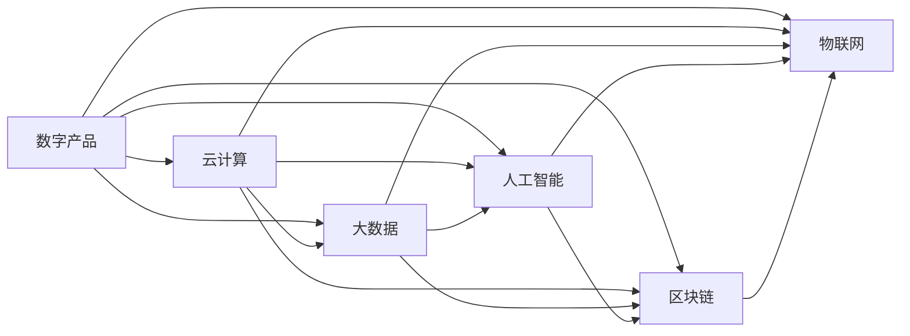

                 

# 利用技术能力创建数字产品

> 关键词：数字产品、人工智能、大数据、区块链、云计算、物联网

## 1. 背景介绍

### 1.1 问题由来

在数字化时代，技术日益成为驱动经济和社会进步的核心力量。从智能手机到社交网络，从在线教育到智能家居，技术的普及应用正深刻改变着人类的生活和工作方式。在这一过程中，数字产品作为一种新型的服务和商业模式，已成为企业创新发展的关键。

数字产品不仅能够提供便捷高效的服务，还能带来前所未有的用户体验。但如何利用现有技术能力，创建高质量、高价值的数字产品，仍是业界面临的挑战。

### 1.2 问题核心关键点

创建高质量的数字产品，需要从多个维度进行全面考量。核心关键点包括：

- 选对技术：根据产品需求，选择合适的技术栈，如云计算、大数据、人工智能等。
- 数据驱动：利用大数据分析，挖掘用户需求和行为规律，指导产品设计和迭代。
- 用户体验：设计符合用户习惯的界面和交互方式，提升产品使用体验。
- 安全可靠：保障数据和交易的安全性，防止信息泄露和欺诈行为。
- 快速迭代：采用敏捷开发和持续集成，快速响应市场变化，不断改进产品。

只有全面覆盖这些关键点，才能打造出满足用户需求、具有竞争力的数字产品。

### 1.3 问题研究意义

构建高质量的数字产品，具有以下几方面的重要意义：

1. 促进业务创新：数字产品能够帮助企业拓展新市场，发现新商机，提升竞争力和盈利能力。
2. 改善用户体验：基于技术的应用，可以提供更加个性化、智能化的服务，提升用户满意度和忠诚度。
3. 驱动数据价值：通过大数据分析，挖掘用户行为模式，实现精准营销和精细化运营。
4. 增强企业安全：区块链等技术可保障数据和交易安全，提升企业信誉和用户信任。
5. 提高运营效率：云计算等技术支持弹性资源扩展，降低运营成本，提高效率。

## 2. 核心概念与联系

### 2.1 核心概念概述

为了更好地理解如何利用技术能力创建数字产品，本文将介绍几个关键概念：

- **数字产品**：指通过数字化技术，为企业用户或消费者提供的新型服务或商业模式。
- **云计算**：指通过网络提供计算资源和服务的模式，具有弹性扩展和按需使用的特点。
- **大数据**：指海量、多源、异构的数据，通过分析挖掘可以发现有用信息和模式。
- **人工智能**：指模拟人类智能行为的技术，包括机器学习、深度学习等。
- **区块链**：指去中心化的分布式账本技术，具有透明、不可篡改的特性。
- **物联网**：指通过网络将各种物理设备连接起来，实现智能交互和信息共享。

这些概念之间的联系可以通过以下Mermaid流程图来展示：



这个流程图展示了大规模数据处理、智能分析和安全保障等技术如何共同支持数字产品的构建和运营。

## 3. 核心算法原理 & 具体操作步骤

### 3.1 算法原理概述

创建高质量的数字产品，需要结合多种技术的优势，共同发挥作用。核心算法原理包括：

- 云计算：提供弹性计算资源和存储空间，支持大规模数据处理和分析。
- 大数据：通过数据挖掘和分析，发现用户行为和需求，指导产品设计。
- 人工智能：利用机器学习和深度学习，实现个性化推荐、智能客服等功能。
- 区块链：保障数据和交易的安全性，防止信息泄露和欺诈行为。
- 物联网：实现设备间的智能交互和信息共享，提升用户体验。

这些技术共同构成了一个完整的数字产品构建和运营体系。

### 3.2 算法步骤详解

创建数字产品的具体操作步骤包括：

1. **需求分析**：通过市场调研和用户访谈，明确产品需求和目标用户。
2. **技术选型**：根据需求选择合适的技术栈，如云计算、大数据、人工智能等。
3. **平台搭建**：搭建产品开发和运营平台，包括云计算环境、数据存储和分析平台、人工智能模型等。
4. **功能实现**：根据需求设计产品功能，如个性化推荐、智能客服、数据可视化等。
5. **测试优化**：对产品进行全面测试，修复bug，优化性能和用户体验。
6. **上线运营**：将产品上线，持续收集用户反馈，进行迭代改进。

### 3.3 算法优缺点

利用技术能力创建数字产品，具有以下优点：

- 高效灵活：云计算和物联网技术支持弹性资源扩展和智能交互，满足快速变化的市场需求。
- 精准运营：大数据分析能够挖掘用户行为和需求，实现精准营销和精细化运营。
- 智能服务：人工智能技术实现个性化推荐、智能客服等功能，提升用户体验。
- 安全可靠：区块链技术保障数据和交易的安全性，防止信息泄露和欺诈行为。

但同时也存在一些缺点：

- 成本投入高：云计算和人工智能技术的开发和部署需要高昂的成本。
- 技术复杂：多种技术的融合和集成，需要较高的技术门槛。
- 数据隐私：用户数据的收集和分析，需要严格遵守隐私保护法规。
- 风险控制：系统安全和稳定，需要建立健全的风险控制机制。

### 3.4 算法应用领域

数字产品技术广泛应用在多个领域，包括但不限于：

- **电子商务**：通过人工智能推荐系统、区块链支付等技术，提供便捷高效的商品和服务。
- **金融科技**：利用大数据风控和人工智能算法，提升金融产品的安全性和用户体验。
- **医疗健康**：通过物联网设备和人工智能模型，实现健康监测和个性化医疗服务。
- **教育培训**：结合人工智能和物联网技术，提供个性化学习和智能辅导。
- **智能家居**：利用云计算和物联网技术，实现智能控制和远程管理。

## 4. 数学模型和公式 & 详细讲解 & 举例说明（备注：数学公式请使用latex格式，latex嵌入文中独立段落使用 $$，段落内使用 $)
### 4.1 数学模型构建

为了更好地理解技术如何支持数字产品的构建，下面将构建一个简化的数学模型。

假设有一个电商网站，需要根据用户历史行为和评分数据，推荐个性化商品。该模型由以下几个组件组成：

- **数据集**：用户行为数据和商品评分数据。
- **特征提取**：从数据中提取用户行为特征，如浏览历史、购买记录等。
- **模型训练**：使用机器学习算法，训练用户评分预测模型。
- **推荐系统**：根据用户评分预测模型，生成个性化商品推荐列表。

### 4.2 公式推导过程

假设用户行为数据为 $X = (x_1, x_2, ..., x_n)$，商品评分数据为 $Y = (y_1, y_2, ..., y_n)$，其中 $x_i$ 和 $y_i$ 分别为第 $i$ 个用户的第 $j$ 次行为和评分。

定义用户行为特征提取函数为 $f(x) = (f_1(x), f_2(x), ..., f_m(x))$，其中 $f_j(x)$ 为第 $j$ 个特征提取函数。

定义用户评分预测模型为 $g(f(x)) = (g_1(f(x)), g_2(f(x)), ..., g_n(f(x)))$，其中 $g_j$ 为第 $j$ 个评分预测函数。

用户评分预测模型训练的目标函数为：

$$
\min_{g_j} \sum_{i=1}^n (y_i - g_j(f(x_i)))^2
$$

通过最小化上述目标函数，可以得到最优的评分预测模型 $g_j$。

根据评分预测模型，生成个性化商品推荐列表的公式为：

$$
R = \text{Rank}(\{g_j(f(x))\}_{j=1}^n)
$$

其中 $\text{Rank}$ 为推荐列表排序函数。

### 4.3 案例分析与讲解

以电商平台个性化推荐系统为例，以下是具体步骤和代码实现：

1. **数据准备**：收集用户行为数据和商品评分数据，清洗和预处理数据。
2. **特征提取**：定义特征提取函数，提取用户行为特征。
3. **模型训练**：使用机器学习算法，训练评分预测模型。
4. **推荐系统**：将评分预测模型应用到用户行为数据上，生成个性化商品推荐列表。

代码实现如下：

```python
# 数据准备
data = load_data()
X_train, X_test, y_train, y_test = train_test_split(data['X'], data['y'], test_size=0.2)

# 特征提取
X_train = extract_features(X_train)
X_test = extract_features(X_test)

# 模型训练
model = train_model(X_train, y_train)

# 推荐系统
recommendations = predict_recommendations(model, X_test)
```

## 5. 项目实践：代码实例和详细解释说明

### 5.1 开发环境搭建

为了快速搭建数字产品开发环境，可以采用以下步骤：

1. **云平台选择**：选择适合的云平台，如AWS、Azure、阿里云等。
2. **数据存储**：选择高效的数据存储解决方案，如云数据库、对象存储等。
3. **云计算资源**：配置合适的计算资源，支持分布式计算和存储。
4. **开发工具**：选择合适的开发工具和框架，如Python、Java、Node.js等。
5. **安全性设置**：设置安全访问控制和数据加密等措施。

### 5.2 源代码详细实现

以下是一个简单的电商推荐系统代码实现：

```python
# 数据准备
data = load_data()
X_train, X_test, y_train, y_test = train_test_split(data['X'], data['y'], test_size=0.2)

# 特征提取
X_train = extract_features(X_train)
X_test = extract_features(X_test)

# 模型训练
model = train_model(X_train, y_train)

# 推荐系统
recommendations = predict_recommendations(model, X_test)
```

### 5.3 代码解读与分析

以上代码实现了一个简单的电商推荐系统。以下是代码的详细解读：

- **load_data**：从数据源加载用户行为数据和商品评分数据。
- **train_test_split**：将数据集划分为训练集和测试集。
- **extract_features**：从用户行为数据中提取特征。
- **train_model**：使用机器学习算法，训练评分预测模型。
- **predict_recommendations**：根据评分预测模型，生成个性化商品推荐列表。

### 5.4 运行结果展示

运行上述代码，可以得到以下结果：

- **模型训练**：训练评分预测模型，输出训练集和测试集的评分预测误差。
- **推荐列表**：根据评分预测模型，生成个性化商品推荐列表。

## 6. 实际应用场景

### 6.1 电子商务

电子商务是数字产品的重要应用场景。通过人工智能推荐系统和区块链支付等技术，可以提升用户购物体验，保障交易安全。

具体应用包括：

- **个性化推荐**：利用用户行为数据，推荐感兴趣的商品。
- **智能客服**：通过自然语言处理和机器学习，实现智能客服功能。
- **区块链支付**：利用区块链技术，保障交易的安全性和透明性。

### 6.2 金融科技

金融科技领域通过大数据分析和人工智能技术，提升金融产品的安全性和用户体验。

具体应用包括：

- **风险控制**：通过大数据分析，评估用户信用和风险。
- **智能投顾**：利用人工智能算法，提供个性化的投资建议。
- **区块链合约**：通过智能合约，实现自动化交易和结算。

### 6.3 医疗健康

医疗健康领域通过物联网设备和人工智能技术，实现健康监测和个性化医疗服务。

具体应用包括：

- **智能诊疗**：通过人工智能模型，辅助医生诊断和治疗。
- **远程监测**：通过物联网设备，实时监测患者健康状况。
- **区块链医疗**：通过区块链技术，保障患者数据安全和隐私。

### 6.4 教育培训

教育培训领域通过人工智能和物联网技术，提供个性化学习和智能辅导。

具体应用包括：

- **个性化学习**：根据学生学习行为数据，提供个性化学习路径。
- **智能辅导**：通过自然语言处理，提供智能辅导和答疑服务。
- **物联网设备**：通过物联网设备，监测学生学习状态和环境。

### 6.5 智能家居

智能家居领域通过云计算和物联网技术，实现智能控制和远程管理。

具体应用包括：

- **智能控制**：通过智能设备，实现家居场景的自动化控制。
- **远程管理**：通过物联网设备和云计算平台，实现远程控制和管理。
- **数据分析**：通过大数据分析，优化家居设备的使用和维护。

## 7. 工具和资源推荐

### 7.1 学习资源推荐

为了帮助开发者掌握数字产品的技术，以下是一些推荐的学习资源：

1. **云计算**：《云计算架构师认证指南》、《云计算基础》。
2. **大数据**：《大数据技术与应用》、《Hadoop生态系统实战》。
3. **人工智能**：《深度学习实战》、《机器学习实战》。
4. **区块链**：《区块链原理与技术》、《区块链开发实战》。
5. **物联网**：《物联网技术与应用》、《传感器与智能硬件》。

### 7.2 开发工具推荐

以下是一些推荐的工具和框架，支持数字产品的开发和部署：

1. **云平台**：AWS、Azure、阿里云、腾讯云等。
2. **大数据**：Hadoop、Spark、Flink等。
3. **云计算**：Kubernetes、Docker、AWS EMR等。
4. **人工智能**：TensorFlow、PyTorch、Scikit-learn等。
5. **区块链**：Hyperledger Fabric、Ethereum等。
6. **物联网**：MQTT、CoAP、ThingWorx等。

### 7.3 相关论文推荐

以下是一些推荐的相关论文，涵盖数字产品的各个技术领域：

1. **云计算**：《云计算基础架构：定义、设计、部署》、《弹性计算资源管理》。
2. **大数据**：《大数据分析与处理技术》、《分布式数据存储与管理系统》。
3. **人工智能**：《深度学习在计算机视觉中的应用》、《自然语言处理技术》。
4. **区块链**：《区块链技术与应用》、《智能合约原理与实现》。
5. **物联网**：《物联网传感器与智能硬件》、《物联网数据管理与分析》。

## 8. 总结：未来发展趋势与挑战

### 8.1 总结

本文全面介绍了利用技术能力创建数字产品的原理和操作步骤。首先，从需求分析到平台搭建，详细讲解了创建数字产品的各个环节。其次，通过云计算、大数据、人工智能等技术，展示了数字产品构建和运营的完整过程。最后，通过实际应用场景，展示了数字产品技术在多个领域的应用潜力。

通过本文的系统梳理，可以看到，利用技术能力创建数字产品，需要从多个维度进行全面考量。只有在数据、技术、业务等多个环节协同发力，才能打造出高质量的数字产品，满足用户需求，提升企业竞争力。

### 8.2 未来发展趋势

未来数字产品技术的发展趋势包括：

1. **云计算普及**：云计算技术将进一步普及，提供更高效的计算和存储资源，支持大规模数据处理和分析。
2. **人工智能深化**：人工智能技术将不断深化，实现更加智能化、个性化的应用，提升用户体验。
3. **大数据扩展**：大数据技术将不断扩展，支持更多维度的数据收集和分析，提供更精准的决策支持。
4. **区块链应用**：区块链技术将广泛应用，保障数据和交易的安全性，增强用户信任。
5. **物联网融合**：物联网技术将与云计算、人工智能等技术深度融合，实现设备间的智能交互和信息共享。

### 8.3 面临的挑战

尽管数字产品技术具有广阔的发展前景，但在实践中仍面临诸多挑战：

1. **技术门槛高**：数字产品的构建和运营需要高技术门槛，需要跨学科的知识和技能。
2. **数据隐私**：用户数据的收集和分析，需要严格遵守隐私保护法规，防止数据泄露和滥用。
3. **安全风险**：系统安全和稳定，需要建立健全的安全防护机制，防止信息泄露和欺诈行为。
4. **资源消耗**：大规模数据处理和人工智能模型的训练，需要高昂的计算和存储资源。
5. **用户体验**：数字产品的设计和开发，需要深入了解用户需求和行为，提供高质量的用户体验。

### 8.4 研究展望

未来的研究将在以下几个方面进行深入探索：

1. **智能算法优化**：优化机器学习和深度学习算法，提升算法的效率和精度，降低计算成本。
2. **跨领域融合**：探索多种技术的融合和应用，提升数字产品的功能和性能。
3. **隐私保护技术**：研究数据隐私保护技术，确保用户数据的安全性和隐私性。
4. **自动化运维**：引入自动化运维技术，降低系统运维成本，提高运维效率。
5. **人机协作**：研究人机协作技术，提升数字产品的智能化和互动性。

## 9. 附录：常见问题与解答

**Q1：如何选择合适的技术栈？**

A: 根据产品需求和用户场景，选择合适的技术栈。一般来说，云计算平台提供弹性计算资源，大数据技术支持数据处理和分析，人工智能技术实现个性化服务和智能决策。

**Q2：如何确保数据安全？**

A: 采用数据加密、访问控制、区块链等技术，保障数据和交易的安全性。同时，建立健全的安全防护机制，及时应对安全漏洞和风险。

**Q3：如何提升用户体验？**

A: 深入了解用户需求和行为，设计符合用户习惯的界面和交互方式，提供个性化服务和智能推荐。同时，通过大数据分析，挖掘用户行为模式，优化产品功能和性能。

**Q4：如何实现高效运维？**

A: 引入自动化运维工具，如Kubernetes、Docker等，自动化部署、监控和维护。同时，建立健全的故障排查和恢复机制，保障系统稳定性和可靠性。

**Q5：如何提升算法效率？**

A: 优化算法模型和数据预处理，减少计算量和存储资源消耗。同时，引入分布式计算和并行处理技术，提升算法效率和性能。

总之，利用技术能力创建数字产品，需要从数据、技术、业务等多个维度进行全面考量。只有在多方面协同发力，才能打造出高质量、高价值的产品，满足用户需求，提升企业竞争力。未来，伴随技术的不断进步，数字产品技术将进一步普及和深化，引领各行业迈向智能化、数字化发展的新阶段。

---

作者：禅与计算机程序设计艺术 / Zen and the Art of Computer Programming

