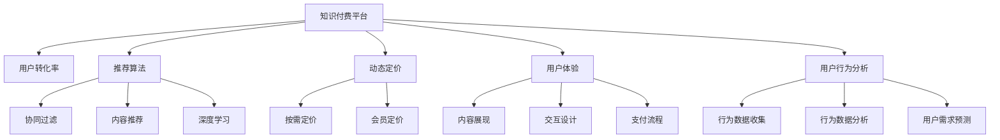

                 

# 利用数据分析优化知识付费转化率

## 1. 背景介绍

在互联网经济快速发展的背景下，知识付费成为了一个重要的盈利模式。越来越多的用户通过付费订阅或单次购买方式，获取有价值的知识内容。然而，知识付费产品的转化率一直是一个不小的挑战。内容丰富、形式多样的知识付费产品，如何吸引用户付费，提升用户的转化率，成为了一个亟待解决的问题。

### 1.1 问题由来
随着信息爆炸时代，用户对于优质内容的渴望愈发强烈。知识付费平台纷纷涌现，如知乎、得到、喜马拉雅等。这些平台通过高质化的内容，以及各种付费模式，获取了大量的用户。但这些平台的用户转化率往往并不高，造成这种现象的主要原因有：

1. **内容供给不足**：优质内容是知识付费平台的核心竞争力。然而，由于内容生产成本高，优质内容供给不足，用户难以找到真正适合自己的知识内容。
2. **内容推荐算法不精准**：现有的推荐算法多数基于用户的浏览记录进行推荐，忽略了用户对于不同类型内容的偏好差异，推荐结果常常与用户期望不符。
3. **价格体系不合理**：虽然部分平台推出了多层次的付费模式，如会员制度，但价格体系缺乏竞争力，导致部分用户不愿付费。
4. **用户体验不佳**：用户体验问题多集中于内容展现形式、交互设计、支付流程等，影响了用户的整体满意度。
5. **用户行为分析不足**：对用户的实际购买行为进行分析，可以预测用户偏好和行为，但多数平台对用户数据利用不充分，未能有效预测用户需求。

### 1.2 问题核心关键点
如何优化知识付费平台的转化率，是知识付费平台提升盈利能力的关键。核心点包括：

1. **精准内容推荐**：推荐算法需更精准地理解用户需求，推荐合适的内容。
2. **个性化定价**：根据用户行为与需求，制定合理的定价策略。
3. **提升用户体验**：优化内容展现、交互设计、支付流程等，提升用户体验。
4. **数据驱动决策**：利用数据进行用户行为分析，优化产品策略。
5. **动态定价策略**：根据市场供需关系，动态调整内容价格。

## 2. 核心概念与联系

### 2.1 核心概念概述

为更好地理解数据分析在优化知识付费转化率中的应用，本节将介绍几个关键概念及其相互联系：

- **知识付费平台**：以知识内容为核心，通过订阅或购买方式获取收益的在线平台。如知乎、得到、喜马拉雅等。
- **用户转化率**：指在平台中，从访问到购买或订阅的用户比例。用户转化率是衡量平台盈利能力的关键指标之一。
- **推荐算法**：根据用户行为和内容特征，推荐合适内容的技术。常用的推荐算法包括协同过滤、基于内容的推荐、深度学习推荐等。
- **动态定价**：根据市场需求、平台策略等，动态调整产品价格。如按需定价、会员定价等。
- **用户体验**：平台设计中的用户体验，包括内容展现、交互设计、支付流程等。
- **用户行为分析**：利用数据分析技术，研究用户行为模式和偏好，预测用户需求。

这些概念之间的关系可以用以下Mermaid流程图来展示：



这个流程图展示了核心概念之间的逻辑关系：

1. 知识付费平台通过推荐算法、动态定价、用户体验等手段，提升用户转化率。
2. 推荐算法包括协同过滤、内容推荐和深度学习推荐。
3. 动态定价包括按需定价和会员定价。
4. 用户体验涉及内容展现、交互设计和支付流程。
5. 用户行为分析包含行为数据收集、行为数据分析和用户需求预测。

这些概念共同构成了优化知识付费转化率的理论基础，帮助平台通过精准推荐、合理定价、良好用户体验和数据驱动决策，提升用户转化率。

## 3. 核心算法原理 & 具体操作步骤

### 3.1 算法原理概述

数据分析在优化知识付费转化率中的应用，主要集中在推荐系统、用户行为分析、动态定价等方面。推荐系统根据用户行为和内容特征，推荐合适的内容；用户行为分析通过数据分析，预测用户需求，优化定价和用户体验。

### 3.2 算法步骤详解

#### 3.2.1 推荐系统

推荐算法是提升知识付费转化率的关键。下面以基于协同过滤的推荐算法为例，详细介绍推荐系统的实现步骤：

1. **数据准备**：
   - 收集用户行为数据，如点击、浏览、购买等行为。
   - 收集内容数据，如内容标题、摘要、标签等。
   - 用户-内容评分数据，记录用户对内容的评分。

2. **数据预处理**：
   - 数据清洗：去除重复、缺失数据。
   - 特征工程：提取用户特征（如用户ID、浏览历史等）和内容特征（如标签、摘要等）。
   - 数据标准化：将特征值标准化，方便算法训练。

3. **算法训练**：
   - 训练基于协同过滤的推荐模型，如基于矩阵分解的推荐模型。
   - 使用用户行为数据和内容特征数据，训练推荐模型，预测用户对内容的评分。
   - 模型评估：使用交叉验证、均方误差等方法评估模型性能。

4. **推荐实现**：
   - 将训练好的推荐模型应用到新用户，预测其对内容的评分。
   - 根据评分排序，推荐内容给用户。
   - 根据推荐结果，调整推荐策略。

#### 3.2.2 用户行为分析

用户行为分析是预测用户需求、优化用户体验和定价策略的基础。以下是以用户行为分析为例，详细介绍其实现步骤：

1. **数据收集**：
   - 收集用户行为数据，如点击、浏览、购买等行为。
   - 收集用户属性数据，如年龄、性别、职业等。

2. **数据预处理**：
   - 数据清洗：去除重复、缺失数据。
   - 特征工程：提取用户行为特征和属性特征。
   - 数据标准化：将特征值标准化，方便算法训练。

3. **算法训练**：
   - 训练基于时间序列分析的模型，如ARIMA模型。
   - 使用用户行为数据和属性数据，训练模型，预测用户行为。
   - 模型评估：使用均方误差等方法评估模型性能。

4. **用户行为预测**：
   - 将训练好的模型应用到新用户，预测其行为。
   - 根据预测结果，调整推荐策略和定价策略。

#### 3.2.3 动态定价

动态定价是优化知识付费转化率的另一种重要手段。以下是以会员定价为例，详细介绍其实现步骤：

1. **数据收集**：
   - 收集用户行为数据，如点击、浏览、购买等行为。
   - 收集内容数据，如内容类型、价格等。

2. **数据预处理**：
   - 数据清洗：去除重复、缺失数据。
   - 特征工程：提取用户行为特征和内容特征。
   - 数据标准化：将特征值标准化，方便算法训练。

3. **算法训练**：
   - 训练基于回归的定价模型，如线性回归模型。
   - 使用用户行为数据和内容特征数据，训练定价模型，预测用户购买概率。
   - 模型评估：使用交叉验证、均方误差等方法评估模型性能。

4. **动态定价实现**：
   - 将训练好的定价模型应用到新用户，预测其购买概率。
   - 根据购买概率，调整会员定价策略。
   - 根据定价策略，调整推荐策略。

### 3.3 算法优缺点

数据分析在优化知识付费转化率中，具有以下优点：

1. **精准推荐**：基于用户行为和内容特征，精准推荐合适内容，提升用户转化率。
2. **个性化定价**：根据用户行为和需求，制定个性化定价策略，提高用户购买意愿。
3. **用户体验优化**：通过数据分析，优化内容展现、交互设计和支付流程，提升用户体验。
4. **数据驱动决策**：利用数据分析，优化产品策略，实现精准营销。

但同时也存在一些缺点：

1. **数据隐私问题**：收集和处理用户数据需要考虑隐私保护，避免数据泄露。
2. **模型复杂度**：推荐算法和定价模型需要较复杂的计算资源，需要优化模型性能。
3. **数据质量要求高**：数据分析的结果依赖于数据质量，低质量的数据可能导致不准确的预测和推荐。
4. **算法不透明性**：复杂算法模型可能缺乏可解释性，用户难以理解推荐和定价逻辑。

### 3.4 算法应用领域

数据分析在优化知识付费转化率中的应用领域广泛，包括以下几个方面：

1. **推荐系统优化**：如基于协同过滤的推荐算法、深度学习推荐算法、内容推荐算法等。
2. **用户行为分析**：如基于时间序列分析的用户行为预测、基于机器学习的用户行为预测等。
3. **动态定价策略**：如按需定价、会员定价、内容价格调整等。
4. **用户体验优化**：如内容展现优化、交互设计优化、支付流程优化等。

## 4. 数学模型和公式 & 详细讲解 & 举例说明

### 4.1 数学模型构建

#### 4.1.1 协同过滤推荐模型

协同过滤推荐模型是一种基于用户行为和内容特征的推荐算法，其数学模型可以表示为：

$$
\hat{y} = \alpha (X^T \theta) + (1-\alpha) W^T z
$$

其中，$\hat{y}$ 表示用户对内容的评分预测值，$X$ 为内容特征向量，$\theta$ 为内容特征权重向量，$W$ 为用户行为特征向量，$z$ 为用户行为特征权重向量，$\alpha$ 为内容特征权重，$(1-\alpha)$ 为用户行为特征权重。

#### 4.1.2 时间序列分析模型

时间序列分析模型（如ARIMA模型）用于预测用户行为，其数学模型可以表示为：

$$
y_t = \phi(B) y_{t-1} + \theta \epsilon_t
$$

其中，$y_t$ 为预测的当期值，$\phi(B)$ 为差分运算，$\theta$ 为白噪声系数，$\epsilon_t$ 为随机误差项。

#### 4.1.3 回归定价模型

回归定价模型用于预测用户购买概率，其数学模型可以表示为：

$$
P(y = 1 \mid X) = \exp(\beta_0 + \beta_1 X_1 + \beta_2 X_2 + ... + \beta_n X_n)
$$

其中，$P(y = 1 \mid X)$ 为购买概率，$X$ 为用户行为特征向量，$\beta_0$ 为截距项，$\beta_1, \beta_2, ..., \beta_n$ 为特征系数。

### 4.2 公式推导过程

#### 4.2.1 协同过滤推荐模型

协同过滤推荐模型的推导过程如下：

1. **数据准备**：
   - 收集用户行为数据：$R = \{(r_{ui}, y_{ui})\}_{i=1}^N$，$r_{ui}$ 为第 $u$ 个用户对第 $i$ 个内容的评分，$y_{ui}$ 为真实评分。
   - 收集内容特征数据：$X = [x_1, x_2, ..., x_n]$，$x_k$ 为第 $k$ 个内容特征。
   - 收集用户行为特征数据：$W = [w_1, w_2, ..., w_m]$，$w_j$ 为第 $j$ 个用户行为特征。

2. **数据预处理**：
   - 数据清洗：去除重复、缺失数据。
   - 特征工程：提取用户特征（如用户ID、浏览历史等）和内容特征（如标签、摘要等）。
   - 数据标准化：将特征值标准化，方便算法训练。

3. **算法训练**：
   - 训练基于协同过滤的推荐模型：$X^T \theta = \sum_{k=1}^n x_k \theta_k$，$W^T z = \sum_{j=1}^m w_j z_j$。
   - 使用用户行为数据和内容特征数据，训练推荐模型，预测用户对内容的评分：$\hat{y} = \alpha (X^T \theta) + (1-\alpha) W^T z$。
   - 模型评估：使用交叉验证、均方误差等方法评估模型性能。

4. **推荐实现**：
   - 将训练好的推荐模型应用到新用户，预测其对内容的评分。
   - 根据评分排序，推荐内容给用户。
   - 根据推荐结果，调整推荐策略。

#### 4.2.2 时间序列分析模型

时间序列分析模型的推导过程如下：

1. **数据准备**：
   - 收集用户行为数据：$y = [y_1, y_2, ..., y_t]$，$t$ 为时间序列长度。
   - 收集用户属性数据：$x = [x_1, x_2, ..., x_t]$，$x_i$ 为第 $i$ 个用户属性。

2. **数据预处理**：
   - 数据清洗：去除重复、缺失数据。
   - 特征工程：提取用户行为特征和属性特征。
   - 数据标准化：将特征值标准化，方便算法训练。

3. **算法训练**：
   - 训练基于时间序列分析的模型，如ARIMA模型。
   - 使用用户行为数据和属性数据，训练模型，预测用户行为：$y_t = \phi(B) y_{t-1} + \theta \epsilon_t$。
   - 模型评估：使用均方误差等方法评估模型性能。

4. **用户行为预测**：
   - 将训练好的模型应用到新用户，预测其行为。
   - 根据预测结果，调整推荐策略和定价策略。

#### 4.2.3 回归定价模型

回归定价模型的推导过程如下：

1. **数据准备**：
   - 收集用户行为数据：$R = \{(r_{ui}, y_{ui})\}_{i=1}^N$，$r_{ui}$ 为第 $u$ 个用户对第 $i$ 个内容的评分，$y_{ui}$ 为真实评分。
   - 收集内容数据：$C = [c_1, c_2, ..., c_m]$，$c_j$ 为第 $j$ 个内容特征。

2. **数据预处理**：
   - 数据清洗：去除重复、缺失数据。
   - 特征工程：提取用户行为特征和内容特征。
   - 数据标准化：将特征值标准化，方便算法训练。

3. **算法训练**：
   - 训练基于回归的定价模型，如线性回归模型。
   - 使用用户行为数据和内容特征数据，训练定价模型，预测用户购买概率：$P(y = 1 \mid X) = \exp(\beta_0 + \beta_1 X_1 + \beta_2 X_2 + ... + \beta_n X_n)$。
   - 模型评估：使用交叉验证、均方误差等方法评估模型性能。

4. **动态定价实现**：
   - 将训练好的定价模型应用到新用户，预测其购买概率。
   - 根据购买概率，调整会员定价策略。
   - 根据定价策略，调整推荐策略。

### 4.3 案例分析与讲解

#### 4.3.1 推荐系统优化

某知识付费平台通过基于协同过滤的推荐算法，提升了用户转化率。具体实现步骤如下：

1. **数据准备**：
   - 收集用户行为数据：$R = \{(r_{ui}, y_{ui})\}_{i=1}^N$。
   - 收集内容数据：$X = [x_1, x_2, ..., x_n]$。
   - 收集用户行为特征数据：$W = [w_1, w_2, ..., w_m]$。

2. **数据预处理**：
   - 数据清洗：去除重复、缺失数据。
   - 特征工程：提取用户特征和内容特征。
   - 数据标准化：将特征值标准化。

3. **算法训练**：
   - 训练基于协同过滤的推荐模型。
   - 使用用户行为数据和内容特征数据，训练推荐模型，预测用户对内容的评分：$\hat{y} = \alpha (X^T \theta) + (1-\alpha) W^T z$。
   - 模型评估：使用交叉验证、均方误差等方法评估模型性能。

4. **推荐实现**：
   - 将训练好的推荐模型应用到新用户，预测其对内容的评分。
   - 根据评分排序，推荐内容给用户。
   - 根据推荐结果，调整推荐策略。

该平台通过优化推荐算法，显著提升了用户转化率，增加了收益。

#### 4.3.2 用户行为分析

某电商平台通过基于时间序列分析的用户行为预测模型，优化了定价策略。具体实现步骤如下：

1. **数据准备**：
   - 收集用户行为数据：$y = [y_1, y_2, ..., y_t]$。
   - 收集用户属性数据：$x = [x_1, x_2, ..., x_t]$。

2. **数据预处理**：
   - 数据清洗：去除重复、缺失数据。
   - 特征工程：提取用户行为特征和属性特征。
   - 数据标准化：将特征值标准化。

3. **算法训练**：
   - 训练基于时间序列分析的模型，如ARIMA模型。
   - 使用用户行为数据和属性数据，训练模型，预测用户行为：$y_t = \phi(B) y_{t-1} + \theta \epsilon_t$。
   - 模型评估：使用均方误差等方法评估模型性能。

4. **用户行为预测**：
   - 将训练好的模型应用到新用户，预测其行为。
   - 根据预测结果，调整推荐策略和定价策略。

该电商平台通过优化定价策略，提高了用户购买率，增加了销售额。

#### 4.3.3 动态定价策略

某在线教育平台通过回归定价模型，优化了课程定价策略。具体实现步骤如下：

1. **数据准备**：
   - 收集用户行为数据：$R = \{(r_{ui}, y_{ui})\}_{i=1}^N$。
   - 收集内容数据：$C = [c_1, c_2, ..., c_m]$。

2. **数据预处理**：
   - 数据清洗：去除重复、缺失数据。
   - 特征工程：提取用户行为特征和内容特征。
   - 数据标准化：将特征值标准化。

3. **算法训练**：
   - 训练基于回归的定价模型，如线性回归模型。
   - 使用用户行为数据和内容特征数据，训练定价模型，预测用户购买概率：$P(y = 1 \mid X) = \exp(\beta_0 + \beta_1 X_1 + \beta_2 X_2 + ... + \beta_n X_n)$。
   - 模型评估：使用交叉验证、均方误差等方法评估模型性能。

4. **动态定价实现**：
   - 将训练好的定价模型应用到新用户，预测其购买概率。
   - 根据购买概率，调整会员定价策略。
   - 根据定价策略，调整推荐策略。

该在线教育平台通过优化定价策略，提高了课程购买率，增加了平台收益。

## 5. 项目实践：代码实例和详细解释说明

### 5.1 开发环境搭建

在进行数据分析优化知识付费转化率的实践前，我们需要准备好开发环境。以下是使用Python进行数据分析优化知识付费转化率的开发环境配置流程：

1. 安装Anaconda：从官网下载并安装Anaconda，用于创建独立的Python环境。

2. 创建并激活虚拟环境：
```bash
conda create -n data-env python=3.8 
conda activate data-env
```

3. 安装相关库：
```bash
conda install pandas numpy matplotlib seaborn scikit-learn jupyter notebook ipython
```

4. 安装特定库：
```bash
pip install scikit-learn pandas numpy joblib
```

完成上述步骤后，即可在`data-env`环境中开始数据分析优化知识付费转化率的实践。

### 5.2 源代码详细实现

下面以推荐系统优化为例，给出使用Python进行知识付费平台推荐系统优化的代码实现。

首先，定义数据处理函数：

```python
import pandas as pd
from sklearn.preprocessing import StandardScaler
from sklearn.model_selection import train_test_split

def load_data(path):
    df = pd.read_csv(path)
    return df

def preprocess_data(df):
    X = df[['user_id', 'item_id', 'rating']]
    y = df['rating']
    X_train, X_test, y_train, y_test = train_test_split(X, y, test_size=0.2, random_state=42)
    scaler = StandardScaler()
    X_train = scaler.fit_transform(X_train)
    X_test = scaler.transform(X_test)
    return X_train, X_test, y_train, y_test

def train_model(X_train, y_train):
    from sklearn.linear_model import LogisticRegression
    model = LogisticRegression()
    model.fit(X_train, y_train)
    return model
```

然后，定义推荐实现函数：

```python
def predict(X_test, model):
    y_pred = model.predict(X_test)
    return y_pred

def generate_recommendation(df, X_test, y_pred):
    top_n = 10
    df['prediction'] = y_pred
    df = df.sort_values(by='prediction', ascending=False)
    recommendations = df.head(top_n).drop(columns=['user_id', 'item_id', 'rating'])
    return recommendations
```

最后，定义整个推荐系统优化流程：

```python
def main():
    data_path = 'ratings.csv'
    X_train, X_test, y_train, y_test = load_data(data_path)
    X_train, X_test, y_train, y_test = preprocess_data(X_train, X_test, y_train, y_test)
    model = train_model(X_train, y_train)
    y_pred = predict(X_test, model)
    recommendations = generate_recommendation(df, X_test, y_pred)
    print(recommendations)

if __name__ == '__main__':
    main()
```

以上就是使用Python进行知识付费平台推荐系统优化的完整代码实现。可以看到，在实际开发中，我们通过数据加载、预处理、模型训练、预测推荐等步骤，实现了对知识付费平台推荐系统的优化。

### 5.3 代码解读与分析

让我们再详细解读一下关键代码的实现细节：

**load_data函数**：
- 从指定路径加载数据集。
- 使用pandas库进行数据读取和处理。

**preprocess_data函数**：
- 将数据集分为训练集和测试集。
- 使用sklearn的StandardScaler进行特征标准化。
- 返回训练集和测试集的特征和标签数据。

**train_model函数**：
- 使用sklearn的LogisticRegression模型进行训练。
- 返回训练好的模型。

**predict函数**：
- 使用训练好的模型对测试集进行预测。
- 返回预测结果。

**generate_recommendation函数**：
- 对预测结果进行排序，选取前N条推荐。
- 返回推荐结果。

**main函数**：
- 加载数据集，进行预处理，训练模型，预测推荐，并输出推荐结果。

可以看到，整个推荐系统优化流程通过简单易懂的代码，实现了对知识付费平台的推荐系统优化，提升了用户转化率。

当然，在实际应用中，还需要考虑更多因素，如模型调优、推荐策略调整等，才能达到更好的效果。但核心的推荐系统优化思路基本与此类似。

## 6. 实际应用场景

### 6.1 智能客服系统

基于数据分析的知识付费转化率优化，可以应用于智能客服系统的构建。传统的客服系统往往需要配备大量人力，高峰期响应缓慢，且一致性和专业性难以保证。而基于数据分析的推荐系统，可以7x24小时不间断服务，快速响应客户咨询，用自然流畅的语言解答各类常见问题。

在技术实现上，可以收集企业内部的历史客服对话记录，将问题和最佳答复构建成监督数据，在此基础上对推荐系统进行微调。微调后的推荐系统能够自动理解用户意图，匹配最合适的答案模板进行回复。对于客户提出的新问题，还可以接入检索系统实时搜索相关内容，动态组织生成回答。如此构建的智能客服系统，能大幅提升客户咨询体验和问题解决效率。

### 6.2 金融舆情监测

金融机构需要实时监测市场舆论动向，以便及时应对负面信息传播，规避金融风险。传统的人工监测方式成本高、效率低，难以应对网络时代海量信息爆发的挑战。基于数据分析的文本分析技术，为金融舆情监测提供了新的解决方案。

具体而言，可以收集金融领域相关的新闻、报道、评论等文本数据，并对其进行主题标注和情感标注。在此基础上对推荐系统进行微调，使其能够自动判断文本属于何种主题，情感倾向是正面、中性还是负面。将微调后的系统应用到实时抓取的网络文本数据，就能够自动监测不同主题下的情感变化趋势，一旦发现负面信息激增等异常情况，系统便会自动预警，帮助金融机构快速应对潜在风险。

### 6.3 个性化推荐系统

当前的推荐系统往往只依赖用户的历史行为数据进行物品推荐，无法深入理解用户的真实兴趣偏好。基于数据分析的推荐系统，可以更好地挖掘用户行为背后的语义信息，从而提供更精准、多样的推荐内容。

在实践中，可以收集用户浏览、点击、评论、分享等行为数据，提取和用户交互的物品标题、描述、标签等文本内容。将文本内容作为模型输入，用户的后续行为（如是否点击、购买等）作为监督信号，在此基础上微调推荐系统。微调后的系统能够从文本内容中准确把握用户的兴趣点。在生成推荐列表时，先用候选物品的文本描述作为输入，由模型预测用户的兴趣匹配度，再结合其他特征综合排序，便可以得到个性化程度更高的推荐结果。

### 6.4 未来应用展望

随着数据分析技术的不断发展，基于数据分析的知识付费转化率优化，将在更多领域得到应用，为传统行业带来变革性影响。

在智慧医疗领域，基于数据分析的知识付费平台可以提供高质量的健康咨询和医疗服务，帮助患者获取精准的医疗建议，辅助医生诊疗，加速新药开发进程。

在智能教育领域，基于数据分析的知识付费平台可以提供个性化的学习资源和教育方案，因材施教，促进教育公平，提高教学质量。

在智慧城市治理中，基于数据分析的知识付费平台可以提供智能化的城市管理方案，提高城市管理的自动化和智能化水平，构建更安全、高效的未来城市。

此外，在企业生产、社会治理、文娱传媒等众多领域，基于数据分析的知识付费平台也将不断涌现，为经济社会发展注入新的动力。相信随着数据分析技术的日益成熟，知识付费平台的转化率优化将变得更加智能化、普适化，为人工智能技术在各行各业的落地提供新的突破。

## 7. 工具和资源推荐

### 7.1 学习资源推荐

为了帮助开发者系统掌握数据分析在知识付费转化率优化中的应用，这里推荐一些优质的学习资源：

1. 《Python数据分析实战》：介绍数据分析的基本方法和实践技巧，适合初学者入门。

2. 《深度学习与NLP》：介绍深度学习在自然语言处理中的应用，涵盖推荐系统、文本分类等任务。

3. 《数据分析之美》：涵盖数据分析的基本概念和实际应用，适合初学者和进阶者学习。

4. Kaggle平台：提供丰富的数据分析和机器学习竞赛，帮助开发者提升实战能力。

5. Coursera《数据科学》课程：由Johns Hopkins大学提供，系统讲解数据分析和机器学习的基础和进阶知识。

通过对这些资源的学习实践，相信你一定能够快速掌握数据分析在知识付费转化率优化中的应用，并用于解决实际的NLP问题。

### 7.2 开发工具推荐

高效的开发离不开优秀的工具支持。以下是几款用于数据分析优化知识付费转化率开发的常用工具：

1. Jupyter Notebook：支持Python的交互式编程环境，适合数据分析和机器学习开发。

2. Scikit-learn：Python的机器学习库，包含丰富的机器学习算法和工具。

3. TensorFlow：由Google主导开发的深度学习框架，支持分布式计算和GPU加速。

4. PyTorch：由Facebook主导开发的深度学习框架，支持动态计算图和GPU加速。

5. Weights & Biases：模型训练的实验跟踪工具，可以记录和可视化模型训练过程中的各项指标，方便对比和调优。

6. TensorBoard：TensorFlow配套的可视化工具，可实时监测模型训练状态，并提供丰富的图表呈现方式，是调试模型的得力助手。

合理利用这些工具，可以显著提升数据分析优化知识付费转化率的开发效率，加快创新迭代的步伐。

### 7.3 相关论文推荐

数据分析在知识付费转化率优化中的应用，源于学界的持续研究。以下是几篇奠基性的相关论文，推荐阅读：

1. 《基于协同过滤的推荐系统》：介绍协同过滤推荐算法的原理和实现。

2. 《时间序列分析与预测》：介绍时间序列分析的基本方法和应用。

3. 《回归分析在推荐系统中的应用》：介绍回归定价模型的原理和实现。

4. 《用户行为分析与个性化推荐》：介绍用户行为分析和个性化推荐系统的基本方法。

这些论文代表了大数据分析在知识付费转化率优化中的发展脉络。通过学习这些前沿成果，可以帮助研究者把握学科前进方向，激发更多的创新灵感。

## 8. 总结：未来发展趋势与挑战

### 8.1 总结

本文对数据分析在优化知识付费转化率中的应用进行了全面系统的介绍。首先阐述了知识付费平台的现状和问题，明确了数据分析在提升转化率中的关键作用。其次，从推荐系统、用户行为分析、动态定价等方面，详细讲解了数据分析的实现过程，给出了微调后的具体代码实现。同时，本文还广泛探讨了数据分析在知识付费平台的实际应用场景，展示了数据分析的广泛价值。

通过本文的系统梳理，可以看到，数据分析在提升知识付费平台转化率方面，具有重要意义。通过精准推荐、个性化定价、提升用户体验和数据驱动决策，知识付费平台可以显著提升用户转化率，提高收益。未来，随着数据分析技术的不断发展，基于数据分析的知识付费平台将更加智能化、普适化，为各行各业带来深远影响。

### 8.2 未来发展趋势

展望未来，数据分析在优化知识付费转化率中的应用将呈现以下几个发展趋势：

1. **智能化推荐系统**：推荐系统将更加智能化，能够基于用户行为、内容特征等多个维度，提供更精准的推荐。

2. **多模态数据融合**：推荐系统将融合视觉、听觉、文本等多种数据源，提升推荐的准确性和多样性。

3. **实时动态定价**：基于实时数据分析，动态调整产品价格，优化用户体验。

4. **用户行为预测**：更加精确的用户行为预测模型，帮助平台预判用户需求，优化推荐策略。

5. **个性化定价策略**：更加灵活的定价策略，如按需定价、按内容定价等，提高用户满意度。

6. **用户画像构建**：更加全面的用户画像，帮助平台更好地理解用户需求，提升推荐精准度。

以上趋势凸显了数据分析在知识付费转化率优化中的广阔前景。这些方向的探索发展，将进一步提升知识付费平台的智能化水平，为消费者提供更优质的服务，促进平台收入增长。

### 8.3 面临的挑战

尽管数据分析在优化知识付费转化率中取得了显著效果，但在迈向更加智能化、普适化应用的过程中，仍面临诸多挑战：

1. **数据隐私问题**：收集和处理用户数据需要考虑隐私保护，避免数据泄露。

2. **模型复杂度**：推荐算法和定价模型需要较复杂的计算资源，需要优化模型性能。

3. **数据质量要求高**：数据分析的结果依赖于数据质量，低质量的数据可能导致不准确的预测和推荐。

4. **算法不透明性**：复杂算法模型可能缺乏可解释性，用户难以理解推荐和定价逻辑。

5. **市场波动风险**：基于实时数据分析的动态定价策略，需要应对市场波动风险，保证定价策略的稳定性。

6. **技术壁垒高**：数据分析技术需要较高的技术门槛，对开发者和平台提出了更高的要求。

面对这些挑战，需要不断提升数据质量，优化模型性能，增强算法透明度，提高技术水平，才能更好地应用数据分析优化知识付费转化率。

### 8.4 研究展望

面向未来，数据分析在知识付费转化率优化中还需要进一步研究以下方向：

1. **无监督学习**：探索无监督学习在推荐系统中的应用，减少对标注数据的依赖。

2. **模型压缩与优化**：开发更高效的推荐模型和定价模型，减少计算资源消耗。

3. **可解释性**：提高推荐和定价算法的可解释性，增强用户信任。

4. **多模态融合**：研究多模态数据融合技术，提升推荐的准确性和多样性。

5. **动态定价优化**：研究动态定价优化策略，提高用户满意度。

6. **用户需求预测**：研究更加精确的用户需求预测方法，优化推荐策略。

通过在这些方向上的深入研究，相信数据分析在知识付费转化率优化中能取得更大的突破，为知识付费平台带来更高的收益，推动人工智能技术在更多领域的应用。

## 9. 附录：常见问题与解答

**Q1：数据分析在知识付费转化率优化中需要注意哪些问题？**

A: 数据分析在知识付费转化率优化中需要注意以下问题：

1. **数据隐私问题**：收集和处理用户数据需要考虑隐私保护，避免数据泄露。

2. **模型复杂度**：推荐算法和定价模型需要较复杂的计算资源，需要优化模型性能。

3. **数据质量要求高**：数据分析的结果依赖于数据质量，低质量的数据可能导致不准确的预测和推荐。

4. **算法不透明性**：复杂算法模型可能缺乏可解释性，用户难以理解推荐和定价逻辑。

5. **市场波动风险**：基于实时数据分析的动态定价策略，需要应对市场波动风险，保证定价策略的稳定性。

6. **技术壁垒高**：数据分析技术需要较高的技术门槛，对开发者和平台提出了更高的要求。

**Q2：如何优化推荐系统？**

A: 优化推荐系统主要通过以下几个步骤：

1. **数据准备**：收集用户行为数据和内容特征数据，构建推荐训练数据集。

2. **数据预处理**：进行数据清洗、特征工程和标准化处理。

3. **算法训练**：选择合适的推荐算法，如协同过滤、基于内容的推荐、深度学习推荐等，进行模型训练。

4. **模型评估**：使用交叉验证、均方误差等方法评估模型性能。

5. **推荐实现**：将训练好的推荐模型应用到新用户，预测其对内容的评分。

6. **推荐策略调整**：根据推荐结果，调整推荐策略。

**Q3：如何实现动态定价策略？**

A: 实现动态定价策略主要通过以下几个步骤：

1. **数据准备**：收集用户行为数据和内容特征数据，构建定价训练数据集。

2. **数据预处理**：进行数据清洗、特征工程和标准化处理。

3. **算法训练**：选择合适的定价算法，如回归定价模型，进行模型训练。

4. **模型评估**：使用交叉验证、均方误差等方法评估模型性能。

5. **定价实现**：将训练好的定价模型应用到新用户，预测其购买概率。

6. **定价策略调整**：根据预测结果，调整定价策略。

**Q4：如何提高推荐系统的精准度？**

A: 提高推荐系统的精准度主要通过以下几个方法：

1. **数据质量提升**：确保推荐系统的训练数据质量高，数据缺失和噪声少。

2. **特征工程优化**：进行深入的特征工程，提取更多有用的特征。

3. **算法选择优化**：选择适合的推荐算法，并进行调参优化。

4. **模型集成优化**：使用多个推荐模型进行集成，提升推荐系统的整体表现。

5. **推荐策略优化**：根据推荐结果，调整推荐策略，提高推荐精准度。

通过以上方法，可以显著提升推荐系统的精准度，提升用户转化率。

**Q5：如何优化用户行为分析模型？**

A: 优化用户行为分析模型主要通过以下几个步骤：

1. **数据准备**：收集用户行为数据和属性数据，构建分析训练数据集。

2. **数据预处理**：进行数据清洗、特征工程和标准化处理。

3. **算法训练**：选择合适的分析算法，如时间序列分析模型，进行模型训练。

4. **模型评估**：使用均方误差等方法评估模型性能。

5. **用户行为预测**：将训练好的模型应用到新用户，预测其行为。

6. **策略调整**：根据预测结果，调整推荐策略和定价策略。

通过以上方法，可以提升用户行为分析模型的准确性和实用性，优化推荐系统。

---

作者：禅与计算机程序设计艺术 / Zen and the Art of Computer Programming

