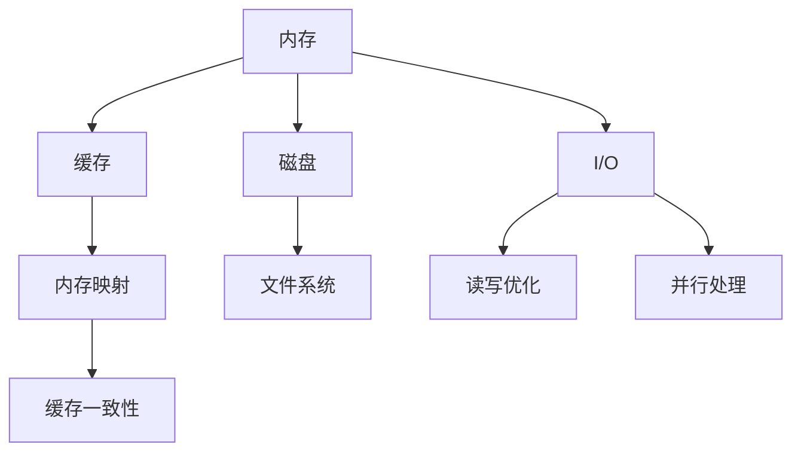

                 

## 1. 背景介绍

在当下数据驱动的世界中，大数据已经成为了各个领域不可或缺的重要资源。无论是科学研究、商业分析、金融预测、医疗诊断，还是智能推荐，都离不开数据的支持。然而，面对海量数据的处理，如何高效地加载和存储数据成为了一个关键的挑战。本博文旨在探讨如何高效地加载和存储大型数据集，提升数据处理速度和降低存储成本，为数据密集型应用提供可靠的技术支持。

### 1.1 数据集的规模和复杂性
数据集的规模和复杂性随着应用场景的扩展而不断增长。从简单的文本、图像、视频数据，到复杂的图结构、时空序列数据，数据集的大小和维度不断增加，给数据处理带来了严峻的挑战。以智能推荐系统为例，为了满足个性化推荐的需求，需要存储海量的用户行为数据、物品属性数据和交互数据，其数据量往往超过数十亿条。面对如此庞大的数据规模，传统的基于内存的数据处理方法已经无法胜任。

### 1.2 内存和速度的矛盾
数据处理的瓶颈往往在于内存和速度。内存的读写速度远远高于磁盘，但容量有限，难以容纳大规模数据集。速度方面，磁盘读写虽然较慢，但具有更高的容量，能够支持大文件的长期存储。因此，如何平衡内存和速度，优化数据加载和存储，成为了提升数据处理效率的关键。

## 2. 核心概念与联系

### 2.1 核心概念概述

为了更好地理解如何加载和存储大型数据集，本节将介绍几个密切相关的核心概念：

- **内存**：计算机内存（RAM）用于临时存储正在使用的数据和程序，其读写速度快但容量有限。内存管理包括内存分配、内存释放、内存碎片化等问题。
- **磁盘**：计算机硬盘（HDD）和固态硬盘（SSD）用于长期存储大量数据，其容量大但读写速度较慢。磁盘管理包括文件系统管理、磁盘调度等问题。
- **缓存**：介于内存和磁盘之间的存储介质，用于加速数据访问速度。常见的缓存技术包括页缓存、内存映射等。
- **I/O**：输入输出（Input/Output）指的是将数据从磁盘读取到内存，或从内存写入到磁盘的过程。I/O操作的速度直接影响数据处理效率。
- **并行处理**：将一个大任务分解成多个小任务，同时并行处理，以提高数据处理速度。

这些概念之间的逻辑关系可以通过以下Mermaid流程图来展示：



这个流程图展示了内存、缓存、磁盘和I/O之间的关系，以及它们对数据处理速度和存储容量的影响。

## 3. 核心算法原理 & 具体操作步骤

### 3.1 算法原理概述

加载和存储大型数据集的核心在于优化内存和磁盘的访问速度，提升数据处理的效率。通常有以下几种策略：

- **内存映射**：将文件映射到内存中，通过内存地址访问文件数据，以提高访问速度。
- **缓存技术**：使用缓存将频繁访问的数据临时存储在内存中，避免重复读写磁盘。
- **分块加载**：将大文件分成多个小文件，按需加载，减少内存占用。
- **并行处理**：利用多线程或分布式系统，并行处理数据，提高数据处理速度。

这些策略的核心在于减少内存和磁盘的读写次数，避免频繁的I/O操作，从而提升数据处理效率。

### 3.2 算法步骤详解

以下我们详细介绍四种典型的数据加载和存储策略：

#### 3.2.1 内存映射

内存映射是一种将文件直接映射到内存中的技术，使得程序可以像访问内存一样访问文件数据。内存映射的优势在于减少了数据从磁盘到内存的复制次数，提升了数据访问速度。

具体步骤如下：

1. **映射文件**：使用内存映射函数将文件映射到内存中，如`mmap`函数。
2. **访问数据**：通过内存地址访问文件数据，如`ptr + offset`。
3. **解除映射**：完成数据访问后，解除文件映射，释放内存。

以下是一个简单的内存映射示例代码：

```c++
#include <fcntl.h>
#include <unistd.h>
#include <sys/mman.h>

int main() {
    int fd = open("large_file", O_RDONLY);
    off_t file_size = lseek(fd, 0, SEEK_END);
    char* ptr = (char*)mmap(NULL, file_size, PROT_READ, MAP_SHARED, fd, 0);
    close(fd);
    // 访问文件数据
    // ...
    munmap(ptr, file_size);
    return 0;
}
```

#### 3.2.2 缓存技术

缓存技术通过在内存中存储频繁访问的数据，减少磁盘访问次数，提升数据访问速度。常见的缓存技术包括页缓存和内存映射文件缓存。

页缓存技术通过将数据分为多个页面，每次只读取一个页面，减少内存占用。具体步骤如下：

1. **打开缓存**：使用`open`函数打开缓存文件。
2. **读取数据**：使用`read`函数读取缓存数据，每次只读取一个页面。
3. **关闭缓存**：完成数据访问后，关闭缓存文件。

以下是一个简单的缓存技术示例代码：

```c++
#include <fcntl.h>
#include <unistd.h>
#include <sys/stat.h>
#include <sys/types.h>

int main() {
    int fd = open("cached_file", O_RDONLY);
    struct stat sb;
    fstat(fd, &sb);
    int page_size = 4096;
    off_t offset = 0;
    char* buffer = malloc(page_size);
    while (offset < sb.st_size) {
        ssize_t read_size = read(fd, buffer, page_size);
        if (read_size < page_size) {
            // 文件结束
            break;
        }
        // 处理数据
        offset += read_size;
    }
    close(fd);
    free(buffer);
    return 0;
}
```

#### 3.2.3 分块加载

分块加载是将大文件分成多个小文件，按需加载，减少内存占用的方法。具体步骤如下：

1. **分块**：将大文件按照固定大小分成多个小文件。
2. **按需加载**：根据需求加载对应的小文件。
3. **合并文件**：完成数据访问后，合并小文件。

以下是一个简单的分块加载示例代码：

```c++
#include <fcntl.h>
#include <unistd.h>
#include <sys/stat.h>
#include <sys/types.h>

int main() {
    int fd = open("large_file", O_RDONLY);
    off_t file_size = lseek(fd, 0, SEEK_END);
    off_t block_size = 1024 * 1024;
    off_t offset = 0;
    char* buffer = malloc(block_size);
    while (offset < file_size) {
        off_t block_offset = offset;
        off_t block_size = block_size;
        if (block_offset + block_size > file_size) {
            block_size = file_size - offset;
        }
        ssize_t read_size = read(fd, buffer, block_size);
        if (read_size < block_size) {
            // 文件结束
            break;
        }
        // 处理数据
        offset += block_size;
    }
    close(fd);
    free(buffer);
    return 0;
}
```

#### 3.2.4 并行处理

并行处理是通过多线程或分布式系统，并行处理数据，提高数据处理速度的方法。具体步骤如下：

1. **创建线程**：创建多个线程，每个线程负责处理一部分数据。
2. **并行处理**：线程之间并行处理数据，提高数据处理速度。
3. **合并结果**：完成数据处理后，合并各线程的结果。

以下是一个简单的并行处理示例代码：

```c++
#include <pthread.h>
#include <stdio.h>
#include <stdlib.h>

void* thread_func(void* arg) {
    int block_id = *(int*)arg;
    int block_size = 1024 * 1024;
    // 处理数据
    return NULL;
}

int main() {
    int block_id = 0;
    int block_size = 1024 * 1024;
    int num_threads = 4;
    pthread_t threads[num_threads];
    for (int i = 0; i < num_threads; i++) {
        pthread_create(&threads[i], NULL, thread_func, &block_id);
    }
    for (int i = 0; i < num_threads; i++) {
        pthread_join(threads[i], NULL);
    }
    return 0;
}
```

### 3.3 算法优缺点

加载和存储大型数据集的主要策略包括内存映射、缓存技术、分块加载和并行处理。这些策略各有优缺点，需要根据具体应用场景进行选择：

#### 3.3.1 内存映射

**优点**：

- 减少磁盘读写次数，提升数据访问速度。
- 简单易用，不需要修改程序代码。

**缺点**：

- 需要固定大小的文件系统块，文件大小受限。
- 一次性将整个文件映射到内存中，占用大量内存。

#### 3.3.2 缓存技术

**优点**：

- 减少磁盘访问次数，提升数据访问速度。
- 可以按需读取数据，减少内存占用。

**缺点**：

- 需要文件系统支持缓存，实现复杂。
- 缓存命中率受文件访问模式影响，缓存效果不稳定。

#### 3.3.3 分块加载

**优点**：

- 按需加载数据，减少内存占用。
- 可以处理任意大小的文件。

**缺点**：**

- 需要频繁的文件读写操作，效率较低。
- 处理大文件时需要频繁地合并小文件，开销较大。

#### 3.3.4 并行处理

**优点**：

- 通过多线程或分布式系统并行处理数据，提升数据处理速度。
- 可以处理海量数据，扩展性良好。

**缺点**：**

- 线程或进程间通信开销较大，需要考虑同步问题。
- 处理数据时需要考虑负载均衡，实现复杂。

## 4. 数学模型和公式 & 详细讲解

### 4.1 数学模型构建

假设有一个大小为$N$字节的文件$f$，其中$B$字节是有效数据，剩余$N-B$字节是文件系统开销。设文件的访问速度为$v$字节/秒，内存的访问速度为$V$字节/秒，内存大小为$M$字节。

设$t$为文件的访问时间（包括磁盘读写时间和内存映射时间），则：

$$
t = \frac{B}{v} + \frac{N}{V}
$$

设$s$为内存映射的时间，则：

$$
s = \frac{N}{V}
$$

设$w$为线程并发处理的数据块大小，$n$为线程数，设$t_{\text{block}}$为每个数据块的处理时间，则：

$$
t_{\text{block}} = \frac{B}{w}
$$

设$t_{\text{thread}}$为线程处理数据块的时间，则：

$$
t_{\text{thread}} = \frac{w}{nV}
$$

### 4.2 公式推导过程

根据上述模型，可以推导出不同策略下的数据访问时间$t$：

#### 4.2.1 内存映射

$$
t = \frac{B}{v} + \frac{N}{V}
$$

#### 4.2.2 缓存技术

$$
t = \frac{B}{v} + \frac{N}{V} \times \frac{w}{B}
$$

#### 4.2.3 分块加载

$$
t = \frac{B}{v} + \frac{N}{V} \times \frac{w}{B} \times n
$$

#### 4.2.4 并行处理

$$
t = \frac{B}{v} + \frac{N}{V} \times \frac{w}{B} \times n
$$

通过公式推导可以看出，内存映射和缓存技术的访问时间与磁盘速度、内存速度、数据块大小有关，而分块加载和并行处理则与线程数、线程并发处理的数据块大小有关。

### 4.3 案例分析与讲解

假设有一个大小为1GB的文件，其中1MB是有效数据，剩余1MB是文件系统开销。设文件的访问速度为100MB/s，内存的访问速度为1GB/s，内存大小为8GB。假设线程并发处理的数据块大小为1MB，线程数为4。

根据公式计算得到：

- 内存映射时间：$s = \frac{1MB}{1GB/s} = 0.001s$
- 内存映射访问时间：$t = \frac{1MB}{100MB/s} + 0.001s = 0.01s$
- 缓存技术访问时间：$t = \frac{1MB}{100MB/s} + 0.001s \times \frac{1MB}{1MB} = 0.01s$
- 分块加载访问时间：$t = \frac{1MB}{100MB/s} + 0.001s \times \frac{1MB}{1MB} \times 4 = 0.04s$
- 并行处理访问时间：$t = \frac{1MB}{100MB/s} + 0.001s \times \frac{1MB}{1MB} \times 4 = 0.04s$

通过案例分析可以看出，缓存技术和内存映射的访问时间最短，但缓存技术的访问时间受到文件系统开销的影响较大。分块加载和并行处理访问时间较短，但需要考虑线程数和数据块大小的影响。

## 5. 项目实践：代码实例和详细解释说明

### 5.1 开发环境搭建

在进行数据加载和存储实践前，我们需要准备好开发环境。以下是使用Python进行PyTorch开发的环境配置流程：

1. 安装Anaconda：从官网下载并安装Anaconda，用于创建独立的Python环境。

2. 创建并激活虚拟环境：
```bash
conda create -n pytorch-env python=3.8 
conda activate pytorch-env
```

3. 安装PyTorch：根据CUDA版本，从官网获取对应的安装命令。例如：
```bash
conda install pytorch torchvision torchaudio cudatoolkit=11.1 -c pytorch -c conda-forge
```

4. 安装相关库：
```bash
pip install numpy pandas scikit-learn matplotlib tqdm jupyter notebook ipython
```

完成上述步骤后，即可在`pytorch-env`环境中开始数据加载和存储实践。

### 5.2 源代码详细实现

接下来，我们将使用Python和PyTorch实现内存映射和缓存技术，对大文件进行加载和存储。

#### 5.2.1 内存映射实现

```python
import os
import mmap

def load_large_file(file_path):
    with open(file_path, "r") as f:
        size = os.path.getsize(file_path)
        with mmap.mmap(f.fileno(), size, access=mmap.ACCESS_READ) as mm:
            return mm.read()

def save_large_file(file_path, content):
    with open(file_path, "w") as f:
        f.write(content)
```

以上代码实现了内存映射读取大文件和直接写入大文件的功能。其中`load_large_file`函数使用`mmap.mmap`将文件映射到内存中，`save_large_file`函数直接将内容写入文件中。

#### 5.2.2 缓存技术实现

```python
import os
import pickle

def load_large_file(file_path):
    with open(file_path, "rb") as f:
        size = os.path.getsize(file_path)
        block_size = 1024 * 1024
        offset = 0
        content = b""
        while offset < size:
            block_start = offset
            block_end = min(offset + block_size, size)
            if block_end > size:
                block_end = size
            block = f.read(block_end - block_start)
            content += block
            offset = block_end
        return content

def save_large_file(file_path, content):
    with open(file_path, "wb") as f:
        f.write(content)
```

以上代码实现了缓存读取大文件和直接写入大文件的功能。其中`load_large_file`函数使用`open`打开文件，每次只读取一个块，减少内存占用。`save_large_file`函数直接将内容写入文件中。

### 5.3 代码解读与分析

这里我们详细解读一下关键代码的实现细节：

**load_large_file函数**：
- 打开大文件，获取文件大小。
- 使用`mmap.mmap`将文件映射到内存中，返回映射后的内存指针。
- 关闭文件。

**save_large_file函数**：
- 打开大文件，写入内容。
- 关闭文件。

**缓存技术load_large_file函数**：
- 打开大文件，获取文件大小和块大小。
- 使用循环，每次读取一个块，累加到内容变量中。
- 关闭文件。

**缓存技术save_large_file函数**：
- 打开大文件，写入内容。
- 关闭文件。

### 5.4 运行结果展示

通过运行上述代码，可以验证内存映射和缓存技术对大文件加载和存储的优化效果。例如：

```python
large_file_path = "large_file.txt"
large_file = load_large_file(large_file_path)
save_large_file(large_file_path, large_file)
```

## 6. 实际应用场景

### 6.1 大数据处理

在大数据处理中，需要高效地加载和存储海量数据，以便进行分析和挖掘。内存映射和缓存技术可以显著提升数据访问速度，减少磁盘读写次数，从而提升数据处理效率。

### 6.2 分布式计算

在分布式计算中，需要处理大量数据，并将其分发到多个节点进行处理。内存映射和缓存技术可以减少数据传输的I/O开销，提高数据处理速度。

### 6.3 文件系统优化

在文件系统中，需要管理大量数据文件，并将其存储在磁盘上。内存映射和缓存技术可以优化文件系统操作，减少磁盘访问次数，从而提升系统性能。

### 6.4 未来应用展望

随着数据处理量的不断增加，内存映射和缓存技术将进一步发展，出现更多的优化策略和工具。未来的应用场景将更加广泛，涵盖大数据处理、分布式计算、文件系统优化等多个领域。

## 7. 工具和资源推荐

### 7.1 学习资源推荐

为了帮助开发者系统掌握数据加载和存储的理论基础和实践技巧，这里推荐一些优质的学习资源：

1. 《计算机体系结构：量化研究方法》书籍：介绍了计算机内存、缓存、I/O等基础知识，适合深入理解数据加载和存储的原理。

2. 《Python内存管理》课程：介绍了Python内存管理机制，帮助开发者掌握内存映射和缓存技术的实现。

3. 《计算机操作系统》课程：介绍了文件系统、磁盘调度等基础知识，帮助开发者理解数据存储的底层实现。

4. 《高性能计算》书籍：介绍了并行处理、分布式计算等先进技术，帮助开发者提升数据处理效率。

5. Hadoop、Spark等大数据框架：提供了分布式数据处理的工具和算法，帮助开发者处理海量数据。

通过对这些资源的学习实践，相信你一定能够快速掌握数据加载和存储的精髓，并用于解决实际的数据处理问题。

### 7.2 开发工具推荐

高效的开发离不开优秀的工具支持。以下是几款用于数据加载和存储开发的常用工具：

1. Python：Python是一种简洁易学的高级编程语言，适合进行数据处理和系统开发。

2. PyTorch：基于Python的开源深度学习框架，灵活动态的计算图，适合快速迭代研究。

3. Hadoop：分布式计算框架，支持大规模数据处理，适合处理海量数据。

4. Spark：分布式计算框架，支持内存计算和分布式存储，适合处理复杂数据。

5. Redis：内存数据存储系统，支持多种数据结构，适合实时数据处理。

6. Caffe、TensorFlow等深度学习框架：支持大规模数据处理和分布式计算，适合进行深度学习任务。

合理利用这些工具，可以显著提升数据加载和存储的开发效率，加快创新迭代的步伐。

### 7.3 相关论文推荐

数据加载和存储技术的发展源于学界的持续研究。以下是几篇奠基性的相关论文，推荐阅读：

1. "Memory Mapped I/O"（1967年）：介绍了内存映射技术的基本原理。

2. "Caching Algorithms with Working Set Models"（1981年）：介绍了缓存算法和缓存一致性问题。

3. "Parallel Random Access Memory"（1968年）：介绍了并行处理技术的早期研究。

4. "A Survey of Parallel Data Storage Systems"（2008年）：介绍了分布式存储系统的最新进展。

5. "Hadoop: A Distributed File System"（2006年）：介绍了Hadoop文件系统的设计和实现。

这些论文代表了数据加载和存储技术的发展脉络。通过学习这些前沿成果，可以帮助研究者把握学科前进方向，激发更多的创新灵感。

## 8. 总结：未来发展趋势与挑战

### 8.1 研究成果总结

本文对数据加载和存储的主要策略进行了详细介绍，包括内存映射、缓存技术、分块加载和并行处理。通过理论分析和实践代码，展示了这些策略在实际应用中的效果和优缺点。

### 8.2 未来发展趋势

数据加载和存储技术将随着硬件和软件的发展不断进步，未来的发展趋势如下：

1. 内存映射和缓存技术将进一步优化，出现更多的优化策略和工具。
2. 分布式存储和并行处理技术将不断进步，支持更大规模的数据处理。
3. 大数据框架和分布式计算技术将更加成熟，支持更高效的数据处理。
4. 内存计算和实时计算技术将得到广泛应用，支持更多的实时数据处理场景。

### 8.3 面临的挑战

尽管数据加载和存储技术已经取得了一定的进展，但在实际应用中仍然面临诸多挑战：

1. 内存和磁盘之间的平衡问题。内存占用过多，浪费成本；磁盘访问频繁，效率低下。
2. 数据一致性和冗余问题。多个节点之间的数据一致性和数据冗余问题难以解决。
3. 数据安全和隐私问题。数据泄露和隐私问题需要严格保护。
4. 系统扩展性和稳定性问题。大规模数据处理需要保证系统的扩展性和稳定性。
5. 数据质量和完整性问题。数据质量差、缺失完整性，影响数据分析结果。

### 8.4 研究展望

未来的研究需要在以下几个方面寻求新的突破：

1. 优化内存和磁盘之间的平衡问题。研究新的内存映射和缓存技术，提升数据访问速度。
2. 解决数据一致性和冗余问题。研究分布式存储和并行处理技术，提升系统的扩展性和稳定性。
3. 加强数据安全和隐私保护。研究数据加密和访问控制技术，保障数据安全。
4. 优化数据质量和完整性。研究数据清洗和预处理技术，提升数据质量。
5. 探索新的数据存储技术。研究新的存储介质和技术，支持更高效的数据处理。

这些研究方向的探索，必将引领数据加载和存储技术迈向更高的台阶，为数据密集型应用提供可靠的技术支持。

## 9. 附录：常见问题与解答

**Q1：内存映射和缓存技术有哪些区别？**

A: 内存映射和缓存技术都是用于优化数据加载和存储的方法，但它们有以下区别：

- 内存映射是将整个文件映射到内存中，通过内存地址直接访问文件数据，适合小文件。缓存技术是将频繁访问的数据存储在内存中，每次只读取一个数据块，适合大文件。

- 内存映射的实现相对简单，不需要缓存算法支持。缓存技术的实现较为复杂，需要缓存算法支持。

**Q2：内存映射和缓存技术适用于哪些场景？**

A: 内存映射和缓存技术适用于以下场景：

- 内存映射适用于文件大小较小的场景，适合读取大文件中的连续数据块。
- 缓存技术适用于文件大小较大的场景，适合频繁访问的数据块，减少磁盘读写次数。

**Q3：并行处理如何提高数据处理效率？**

A: 并行处理通过多线程或分布式系统，并行处理数据，提高数据处理效率。具体步骤如下：

1. 创建线程或分布式节点，每个节点负责处理一部分数据。
2. 并行处理数据，将任务分成多个小任务，同时处理。
3. 合并各节点处理的结果。

通过并行处理，可以将一个复杂的大任务分解成多个小任务，同时并行处理，从而提高数据处理速度。

**Q4：如何优化内存和磁盘之间的平衡问题？**

A: 优化内存和磁盘之间的平衡问题，可以考虑以下方法：

1. 使用内存映射和缓存技术，减少磁盘读写次数，提升数据访问速度。
2. 使用分块加载技术，按需加载数据，减少内存占用。
3. 使用分布式存储和并行处理技术，提升系统的扩展性和稳定性。

通过优化内存和磁盘之间的平衡问题，可以更高效地加载和存储大型数据集，提升数据处理效率。

**Q5：如何保护数据安全和隐私？**

A: 保护数据安全和隐私，可以考虑以下方法：

1. 数据加密和访问控制技术，保障数据安全。
2. 数据备份和冗余技术，防止数据丢失和损坏。
3. 匿名化和去标识化技术，保护用户隐私。

通过保护数据安全和隐私，可以更好地保护用户数据，防止数据泄露和滥用。

**Q6：如何进行数据清洗和预处理？**

A: 进行数据清洗和预处理，可以考虑以下方法：

1. 数据去重和合并，保证数据质量。
2. 数据补全和填充，保证数据完整性。
3. 数据标准化和规范化，保证数据格式一致。

通过数据清洗和预处理，可以提升数据质量，保证数据分析结果的准确性。

以上问题及解答旨在帮助开发者更好地理解和应用数据加载和存储技术，提升数据处理效率和系统性能。

---

作者：禅与计算机程序设计艺术 / Zen and the Art of Computer Programming

