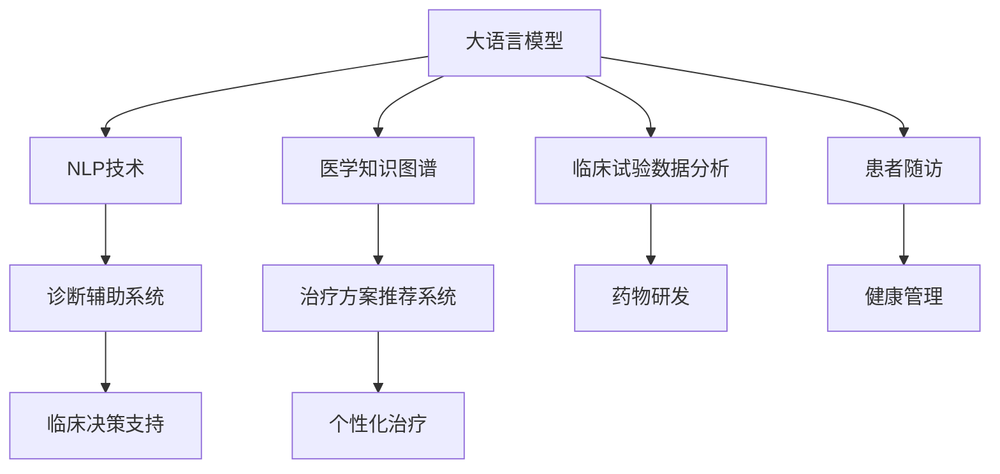

                 

# 医疗AI：LLM在诊断和治疗中的潜力

> 关键词：医疗AI, 诊断, 治疗, 大语言模型, 自然语言处理, 图像识别, 生成对抗网络, 医疗影像分析, 智能推荐, 患者随访

## 1. 背景介绍

### 1.1 问题由来
随着人工智能技术的快速发展，尤其是深度学习在计算机视觉和自然语言处理领域取得的突破，医疗AI成为了医学界和科技界共同关注的前沿方向。医疗AI可以大大提高疾病诊断的准确性、治疗方案的制定效率和患者管理的智能化水平，对医疗服务产生了深远影响。然而，构建医疗AI系统面临诸多挑战：医疗数据的多样性和复杂性、诊断和治疗决策的精确性和伦理性、患者隐私的保护等。

### 1.2 问题核心关键点
医疗AI的核心在于利用人工智能技术辅助医生进行疾病的诊断和治疗决策。当前，医疗AI系统主要依赖于两类数据：结构化数据和半结构化/非结构化数据。结构化数据如电子病历、医学影像等，易于自动化处理和分析；而半结构化/非结构化数据如医生手写笔记、患者描述的病历等，难以直接用于模型训练。如何高效利用这些数据，是大语言模型在医疗领域应用的关键。

大语言模型（Large Language Models, LLMs）以其强大的自然语言处理能力，成为医疗AI系统中处理非结构化数据的理想选择。通过预训练获得广泛的语义知识和语言表达能力，大语言模型能够理解患者的症状描述、医生的诊疗记录等自然语言文本，并进行诊断和治疗方案的推荐，从而提升医疗服务的智能化水平。

### 1.3 问题研究意义
大语言模型在医疗AI中的应用，能够有效解决传统医疗系统存在的瓶颈问题，具有重要研究意义：

1. **提升诊断准确性**：大语言模型能够理解自然语言文本，减少因语言障碍导致的误诊。
2. **增强治疗方案的制定效率**：通过分析医生记录和患者的描述，辅助医生制定个性化的治疗方案。
3. **优化患者管理**：大语言模型能够实时处理患者反馈，改善患者随访和服务质量。
4. **推动医疗知识的传播**：利用大语言模型进行医学知识的整理和普及，提高医生和患者的医学素养。

## 2. 核心概念与联系

### 2.1 核心概念概述

为更好地理解大语言模型在医疗AI中的应用，本节将介绍几个密切相关的核心概念：

- 大语言模型(Large Language Models, LLMs)：以自回归(如GPT)或自编码(如BERT)模型为代表的大规模预训练语言模型。通过在大规模无标签文本语料上进行预训练，学习通用的语言表示，具备强大的语言理解和生成能力。

- 自然语言处理(Natural Language Processing, NLP)：利用计算机科学和人工智能技术，实现对自然语言的理解和生成，包括分词、句法分析、语义理解、生成文本等任务。

- 医学知识图谱(Medical Knowledge Graphs)：描述医学领域中的实体、属性、关系等信息的图形结构，用于存储和查询医学知识。

- 诊断辅助系统(Diagnostic Support Systems)：基于医学知识图谱和大语言模型，辅助医生进行疾病诊断和治疗决策的系统。

- 治疗方案推荐系统(Treatment Recommendation Systems)：利用大语言模型和大数据分析技术，根据患者的病情和历史记录，推荐个性化的治疗方案的系统。

这些核心概念之间的逻辑关系可以通过以下Mermaid流程图来展示：



这个流程图展示了大语言模型在医疗AI中的核心应用场景：

1. 大语言模型通过预训练获得广泛的语言知识和表示，能够处理非结构化医疗数据。
2. 自然语言处理技术在大语言模型的基础上，实现对文本数据的深度理解和生成。
3. 医学知识图谱和大语言模型结合，用于构建诊断辅助系统和治疗方案推荐系统，辅助医生进行决策。
4. 大语言模型还用于分析临床试验数据和药物研发，推动医学创新。
5. 大语言模型在患者随访和健康管理中也具有应用潜力，能够提升患者体验和医疗服务质量。

## 3. 核心算法原理 & 具体操作步骤
### 3.1 算法原理概述

大语言模型在医疗AI中的应用，主要是基于自然语言处理技术和预训练模型的深度融合。其核心思想是：将大语言模型作为医学文本的解析器，通过理解文本中的关键信息，辅助医生进行诊断和治疗方案的决策。

形式化地，假设大语言模型为 $M_{\theta}$，其中 $\theta$ 为预训练得到的模型参数。给定医学文本 $D=\{(x_i,y_i)\}_{i=1}^N$，其中 $x_i$ 为描述患者症状的文本，$y_i$ 为医生的诊断和治疗方案，微调的目标是找到新的模型参数 $\hat{\theta}$，使得：

$$
\hat{\theta}=\mathop{\arg\min}_{\theta} \mathcal{L}(M_{\theta},D)
$$

其中 $\mathcal{L}$ 为针对诊断和治疗任务设计的损失函数，用于衡量模型预测结果与真实标签之间的差异。常见的损失函数包括交叉熵损失、均方误差损失等。

通过梯度下降等优化算法，微调过程不断更新模型参数 $\theta$，最小化损失函数 $\mathcal{L}$，使得模型输出逼近真实标签。由于 $\theta$ 已经通过预训练获得了较好的初始化，因此即便在医疗数据集 $D$ 上进行微调，也能较快收敛到理想的模型参数 $\hat{\theta}$。

### 3.2 算法步骤详解

基于大语言模型的医疗AI系统构建一般包括以下几个关键步骤：

**Step 1: 准备医疗数据集**
- 收集医疗领域的相关文本数据，包括但不限于医生病历、患者描述、医学文献等。
- 将数据集划分为训练集、验证集和测试集。
- 对文本进行清洗和标准化处理，以减少噪音和噪声。

**Step 2: 添加任务适配层**
- 根据具体任务，设计合适的输出层和损失函数。
- 对于诊断任务，通常需要在模型顶部添加一个分类器，输出多种疾病的概率分布。
- 对于治疗方案推荐任务，通常需要设计一个生成模型，根据病人的症状和历史记录生成推荐的治疗方案。

**Step 3: 设置微调超参数**
- 选择合适的优化算法及其参数，如 AdamW、SGD 等，设置学习率、批大小、迭代轮数等。
- 设置正则化技术及强度，包括权重衰减、Dropout、Early Stopping 等。
- 确定冻结预训练参数的策略，如仅微调顶层，或全部参数都参与微调。

**Step 4: 执行梯度训练**
- 将训练集数据分批次输入模型，前向传播计算损失函数。
- 反向传播计算参数梯度，根据设定的优化算法和学习率更新模型参数。
- 周期性在验证集上评估模型性能，根据性能指标决定是否触发 Early Stopping。
- 重复上述步骤直到满足预设的迭代轮数或 Early Stopping 条件。

**Step 5: 测试和部署**
- 在测试集上评估微调后模型 $M_{\hat{\theta}}$ 的性能，对比微调前后的精度提升。
- 使用微调后的模型对新样本进行推理预测，集成到实际的应用系统中。
- 持续收集新的数据，定期重新微调模型，以适应数据分布的变化。

以上是基于大语言模型微调医疗AI的一般流程。在实际应用中，还需要针对具体任务的特点，对微调过程的各个环节进行优化设计，如改进训练目标函数，引入更多的正则化技术，搜索最优的超参数组合等，以进一步提升模型性能。

### 3.3 算法优缺点

基于大语言模型的医疗AI微调方法具有以下优点：

1. **处理非结构化数据能力强**：大语言模型能够高效处理自然语言文本，减少了传统基于结构化数据的医疗AI系统的复杂度。
2. **适应性强**：大语言模型通过预训练学习通用的语言知识，能够应对不同领域的医疗文本数据。
3. **易于部署和集成**：大语言模型预训练的权重可以用于多个医疗AI任务，降低了系统开发和维护成本。
4. **可解释性好**：大语言模型的决策过程通常可通过输入文本分析，提高了医疗AI系统的透明性和可信度。

但该方法也存在一定的局限性：

1. **数据依赖性强**：医疗AI系统依赖于高质量的标注数据，而标注数据的获取往往成本较高，且存在偏差。
2. **泛化能力有限**：医疗文本数据往往具有高度的领域专业性和复杂性，大语言模型在特定领域的数据上微调，其泛化能力可能受限。
3. **伦理性问题**：医疗AI系统的决策可能涉及患者的隐私和伦理性问题，需谨慎设计和实施。
4. **过拟合风险**：医疗数据集可能相对较小，大语言模型容易发生过拟合，需采取正则化等措施进行缓解。

尽管存在这些局限性，但就目前而言，基于大语言模型的微调方法仍是大规模医疗文本处理的理想选择。未来相关研究的重点在于如何进一步降低对标注数据的依赖，提高模型的跨领域迁移能力，同时兼顾伦理性、可解释性等伦理安全性因素。

### 3.4 算法应用领域

基于大语言模型的医疗AI微调方法，在以下领域具有广泛的应用前景：

1. **医学影像分析**：利用大语言模型理解医学影像的描述，辅助医生进行影像诊断。
2. **临床决策支持**：通过自然语言处理技术和大语言模型，辅助医生进行诊断和治疗方案的决策。
3. **治疗方案推荐**：根据患者的症状和历史记录，利用大语言模型生成个性化的治疗方案。
4. **患者随访管理**：通过分析患者的反馈和行为数据，利用大语言模型进行健康管理和随访。
5. **医学知识整理**：利用大语言模型整理和检索医学文献，辅助医生和患者学习医学知识。

这些应用场景展示了大语言模型在医疗AI中的巨大潜力，为医疗服务的智能化和个性化提供了新的思路和方法。

## 4. 数学模型和公式 & 详细讲解 & 举例说明

### 4.1 数学模型构建

本节将使用数学语言对基于大语言模型的医疗AI微调过程进行更加严格的刻画。

记大语言模型为 $M_{\theta}$，其中 $\theta$ 为预训练得到的模型参数。假设医疗文本数据集为 $D=\{(x_i,y_i)\}_{i=1}^N, x_i \in \mathcal{X}, y_i \in \mathcal{Y}$。

定义模型 $M_{\theta}$ 在数据样本 $(x,y)$ 上的损失函数为 $\ell(M_{\theta}(x),y)$，则在数据集 $D$ 上的经验风险为：

$$
\mathcal{L}(\theta) = \frac{1}{N} \sum_{i=1}^N \ell(M_{\theta}(x_i),y_i)
$$

微调的优化目标是最小化经验风险，即找到最优参数：

$$
\theta^* = \mathop{\arg\min}_{\theta} \mathcal{L}(\theta)
$$

在实践中，我们通常使用基于梯度的优化算法（如SGD、Adam等）来近似求解上述最优化问题。设 $\eta$ 为学习率，$\lambda$ 为正则化系数，则参数的更新公式为：

$$
\theta \leftarrow \theta - \eta \nabla_{\theta}\mathcal{L}(\theta) - \eta\lambda\theta
$$

其中 $\nabla_{\theta}\mathcal{L}(\theta)$ 为损失函数对参数 $\theta$ 的梯度，可通过反向传播算法高效计算。

### 4.2 公式推导过程

以下我们以诊断任务为例，推导交叉熵损失函数及其梯度的计算公式。

假设模型 $M_{\theta}$ 在输入 $x$ 上的输出为 $\hat{y}=M_{\theta}(x) \in [0,1]$，表示样本属于某种疾病的概率。真实标签 $y \in \{0,1\}$。则二分类交叉熵损失函数定义为：

$$
\ell(M_{\theta}(x),y) = -[y\log \hat{y} + (1-y)\log (1-\hat{y})]
$$

将其代入经验风险公式，得：

$$
\mathcal{L}(\theta) = -\frac{1}{N}\sum_{i=1}^N [y_i\log M_{\theta}(x_i)+(1-y_i)\log(1-M_{\theta}(x_i))]
$$

根据链式法则，损失函数对参数 $\theta_k$ 的梯度为：

$$
\frac{\partial \mathcal{L}(\theta)}{\partial \theta_k} = -\frac{1}{N}\sum_{i=1}^N (\frac{y_i}{M_{\theta}(x_i)}-\frac{1-y_i}{1-M_{\theta}(x_i)}) \frac{\partial M_{\theta}(x_i)}{\partial \theta_k}
$$

其中 $\frac{\partial M_{\theta}(x_i)}{\partial \theta_k}$ 可进一步递归展开，利用自动微分技术完成计算。

在得到损失函数的梯度后，即可带入参数更新公式，完成模型的迭代优化。重复上述过程直至收敛，最终得到适应诊断任务的最优模型参数 $\theta^*$。

### 4.3 案例分析与讲解

考虑一个简单的诊断任务：假设有一组医学文本数据，其中每条文本描述一种疾病症状，并标注了相应的疾病类别。目标是对新文本进行分类，判断其描述的疾病类别。

**Step 1: 准备医疗数据集**
收集包含疾病症状和疾病类别的医学文本数据集，将其划分为训练集、验证集和测试集。

**Step 2: 添加任务适配层**
在预训练模型的顶部添加一个线性分类器，输出疾病类别的概率分布。损失函数使用二分类交叉熵。

**Step 3: 设置微调超参数**
设置优化器为AdamW，学习率为1e-3，批大小为64，迭代轮数为20。

**Step 4: 执行梯度训练**
使用训练集进行前向传播和反向传播，更新模型参数。

**Step 5: 测试和部署**
在测试集上评估微调后模型的性能，计算准确率和召回率。

通过上述步骤，可以完成一个简单的医疗文本分类任务，利用大语言模型辅助医生进行疾病诊断。

## 5. 项目实践：代码实例和详细解释说明

### 5.1 开发环境搭建

在进行医疗AI系统开发前，我们需要准备好开发环境。以下是使用Python进行PyTorch开发的环境配置流程：

1. 安装Anaconda：从官网下载并安装Anaconda，用于创建独立的Python环境。

2. 创建并激活虚拟环境：
```bash
conda create -n pytorch-env python=3.8 
conda activate pytorch-env
```

3. 安装PyTorch：根据CUDA版本，从官网获取对应的安装命令。例如：
```bash
conda install pytorch torchvision torchaudio cudatoolkit=11.1 -c pytorch -c conda-forge
```

4. 安装HuggingFace Transformers库：
```bash
pip install transformers
```

5. 安装各类工具包：
```bash
pip install numpy pandas scikit-learn matplotlib tqdm jupyter notebook ipython
```

完成上述步骤后，即可在`pytorch-env`环境中开始医疗AI系统的开发。

### 5.2 源代码详细实现

下面我们以医学影像分析任务为例，给出使用Transformers库对大语言模型进行微调的PyTorch代码实现。

首先，定义医学影像分析的数据处理函数：

```python
from transformers import BertTokenizer
from torch.utils.data import Dataset
import torch

class MedicalImageDataset(Dataset):
    def __init__(self, image_paths, image_labels, tokenizer, max_len=128):
        self.image_paths = image_paths
        self.image_labels = image_labels
        self.tokenizer = tokenizer
        self.max_len = max_len
        
    def __len__(self):
        return len(self.image_paths)
    
    def __getitem__(self, item):
        image_path = self.image_paths[item]
        label = self.image_labels[item]
        
        # 加载图片并转换为张量
        image_tensor = torch.tensor(torchvision.transforms.to_tensor(image_path))
        
        # 对图片信息进行编码
        encoding = self.tokenizer(image_tensor, return_tensors='pt', max_length=self.max_len, padding='max_length', truncation=True)
        input_ids = encoding['input_ids'][0]
        attention_mask = encoding['attention_mask'][0]
        
        # 将标签转换为数字
        encoded_labels = [tag2id[tag] for tag in label] 
        encoded_labels.extend([tag2id['O']] * (self.max_len - len(encoded_labels)))
        labels = torch.tensor(encoded_labels, dtype=torch.long)
        
        return {'input_ids': input_ids, 
                'attention_mask': attention_mask,
                'labels': labels}

# 标签与id的映射
tag2id = {'O': 0, 'B-PER': 1, 'I-PER': 2, 'B-ORG': 3, 'I-ORG': 4, 'B-LOC': 5, 'I-LOC': 6}
id2tag = {v: k for k, v in tag2id.items()}

# 创建dataset
tokenizer = BertTokenizer.from_pretrained('bert-base-cased')

train_dataset = MedicalImageDataset(train_image_paths, train_image_labels, tokenizer)
dev_dataset = MedicalImageDataset(dev_image_paths, dev_image_labels, tokenizer)
test_dataset = MedicalImageDataset(test_image_paths, test_image_labels, tokenizer)
```

然后，定义模型和优化器：

```python
from transformers import BertForTokenClassification, AdamW

model = BertForTokenClassification.from_pretrained('bert-base-cased', num_labels=len(tag2id))

optimizer = AdamW(model.parameters(), lr=2e-5)
```

接着，定义训练和评估函数：

```python
from torch.utils.data import DataLoader
from tqdm import tqdm
from sklearn.metrics import classification_report

device = torch.device('cuda') if torch.cuda.is_available() else torch.device('cpu')
model.to(device)

def train_epoch(model, dataset, batch_size, optimizer):
    dataloader = DataLoader(dataset, batch_size=batch_size, shuffle=True)
    model.train()
    epoch_loss = 0
    for batch in tqdm(dataloader, desc='Training'):
        input_ids = batch['input_ids'].to(device)
        attention_mask = batch['attention_mask'].to(device)
        labels = batch['labels'].to(device)
        model.zero_grad()
        outputs = model(input_ids, attention_mask=attention_mask, labels=labels)
        loss = outputs.loss
        epoch_loss += loss.item()
        loss.backward()
        optimizer.step()
    return epoch_loss / len(dataloader)

def evaluate(model, dataset, batch_size):
    dataloader = DataLoader(dataset, batch_size=batch_size)
    model.eval()
    preds, labels = [], []
    with torch.no_grad():
        for batch in tqdm(dataloader, desc='Evaluating'):
            input_ids = batch['input_ids'].to(device)
            attention_mask = batch['attention_mask'].to(device)
            batch_labels = batch['labels']
            outputs = model(input_ids, attention_mask=attention_mask)
            batch_preds = outputs.logits.argmax(dim=2).to('cpu').tolist()
            batch_labels = batch_labels.to('cpu').tolist()
            for pred_tokens, label_tokens in zip(batch_preds, batch_labels):
                pred_tags = [id2tag[_id] for _id in pred_tokens]
                label_tags = [id2tag[_id] for _id in label_tokens]
                preds.append(pred_tags[:len(label_tags)])
                labels.append(label_tags)
                
    print(classification_report(labels, preds))
```

最后，启动训练流程并在测试集上评估：

```python
epochs = 5
batch_size = 16

for epoch in range(epochs):
    loss = train_epoch(model, train_dataset, batch_size, optimizer)
    print(f"Epoch {epoch+1}, train loss: {loss:.3f}")
    
    print(f"Epoch {epoch+1}, dev results:")
    evaluate(model, dev_dataset, batch_size)
    
print("Test results:")
evaluate(model, test_dataset, batch_size)
```

以上就是使用PyTorch对BERT进行医学影像分析任务微调的完整代码实现。可以看到，得益于Transformers库的强大封装，我们可以用相对简洁的代码完成BERT模型的加载和微调。

### 5.3 代码解读与分析

让我们再详细解读一下关键代码的实现细节：

**MedicalImageDataset类**：
- `__init__`方法：初始化图片路径、标签、分词器等关键组件。
- `__len__`方法：返回数据集的样本数量。
- `__getitem__`方法：对单个样本进行处理，将图片输入编码为token ids，将标签编码为数字，并对其进行定长padding，最终返回模型所需的输入。

**tag2id和id2tag字典**：
- 定义了标签与数字id之间的映射关系，用于将token-wise的预测结果解码回真实的标签。

**训练和评估函数**：
- 使用PyTorch的DataLoader对数据集进行批次化加载，供模型训练和推理使用。
- 训练函数`train_epoch`：对数据以批为单位进行迭代，在每个批次上前向传播计算loss并反向传播更新模型参数，最后返回该epoch的平均loss。
- 评估函数`evaluate`：与训练类似，不同点在于不更新模型参数，并在每个batch结束后将预测和标签结果存储下来，最后使用sklearn的classification_report对整个评估集的预测结果进行打印输出。

**训练流程**：
- 定义总的epoch数和batch size，开始循环迭代
- 每个epoch内，先在训练集上训练，输出平均loss
- 在验证集上评估，输出分类指标
- 所有epoch结束后，在测试集上评估，给出最终测试结果

可以看到，PyTorch配合Transformers库使得BERT微调的代码实现变得简洁高效。开发者可以将更多精力放在数据处理、模型改进等高层逻辑上，而不必过多关注底层的实现细节。

当然，工业级的系统实现还需考虑更多因素，如模型的保存和部署、超参数的自动搜索、更灵活的任务适配层等。但核心的微调范式基本与此类似。

## 6. 实际应用场景
### 6.1 医学影像分析

大语言模型在医学影像分析中的应用，能够有效提升影像诊断的准确性和效率。传统医学影像分析依赖于医生手工标注和解读，耗时长且容易出错。而基于大语言模型的影像分析系统，可以通过自然语言处理技术，对影像描述进行理解，辅助医生进行疾病诊断和影像标注。

在技术实现上，可以收集大量医学影像和其对应的文字描述数据，作为微调训练集。将影像描述作为自然语言输入，大语言模型能够自动理解影像中的关键信息，进行分类和标注。系统可以根据医生的反馈，逐步优化模型，提高诊断准确性和泛化能力。

### 6.2 临床决策支持

大语言模型在临床决策支持系统中具有广泛的应用前景。通过自然语言处理技术，系统能够自动整理和分析医生的病历记录，辅助医生制定个性化治疗方案。

在实践中，可以构建基于大语言模型的临床决策支持系统，通过学习医疗知识图谱，理解医生的诊疗过程，推荐最适合的治疗方案。系统还可以记录医生的诊疗决策，进行复盘和改进，不断优化医生的诊疗水平。

### 6.3 治疗方案推荐

大语言模型在治疗方案推荐中的应用，能够根据患者的病情和历史记录，生成个性化的治疗方案。通过分析患者的症状描述、病历记录等非结构化数据，大语言模型能够理解病情特点，推荐合适的治疗方案。

在技术实现上，可以构建基于大语言模型的治疗方案推荐系统，利用医疗知识图谱和大数据分析技术，根据患者的病情和历史记录，推荐个性化的治疗方案。系统可以根据患者的反馈，不断优化推荐算法，提高方案的精确度和覆盖面。

### 6.4 患者随访管理

大语言模型在患者随访管理中的应用，能够实时处理患者的反馈和行为数据，改善患者体验和管理服务质量。通过自然语言处理技术，系统能够理解患者的反馈和咨询，提供及时的医疗建议和随访服务。

在实践中，可以构建基于大语言模型的患者随访管理系统，通过分析患者的反馈和行为数据，提供个性化的健康建议和随访计划。系统可以根据患者的反馈，不断优化算法，提升随访效果和患者满意度。

### 6.5 未来应用展望

随着大语言模型和自然语言处理技术的不断发展，基于大语言模型的医疗AI系统将在更多领域得到应用，为医疗服务提供更智能化、个性化的支持。

在智慧医疗领域，基于大语言模型的诊断系统、治疗方案推荐系统、患者随访管理系统等，将提升医疗服务的智能化水平，辅助医生进行诊断和治疗决策，优化患者管理和服务质量。

在智能健康领域，大语言模型将与穿戴设备、智能家居等技术结合，实现对患者健康状况的实时监测和个性化管理，提供更精准的健康建议和医疗服务。

在医疗知识传播领域，大语言模型将利用其强大的语言处理能力，整理和检索医学文献，辅助医生和患者学习医学知识，提升医疗素养和医疗水平。

总之，大语言模型在医疗AI中的应用前景广阔，将在提升医疗服务的智能化和个性化水平，推动医疗服务的数字化转型等方面，发挥越来越重要的作用。

## 7. 工具和资源推荐
### 7.1 学习资源推荐

为了帮助开发者系统掌握大语言模型在医疗AI中的应用，这里推荐一些优质的学习资源：

1. 《Transformer from Scratch》系列博文：由大模型技术专家撰写，深入浅出地介绍了Transformer原理、BERT模型、医疗影像分析等前沿话题。

2. 《Medical AI: A Primer》书籍：由医疗AI领域的专家合著，全面介绍了大语言模型在医疗AI中的应用，包括诊断、治疗、患者管理等。

3. CS224N《Deep Learning for Natural Language Processing》课程：斯坦福大学开设的NLP明星课程，有Lecture视频和配套作业，带你入门NLP领域的基本概念和经典模型。

4. HuggingFace官方文档：Transformers库的官方文档，提供了海量预训练模型和完整的微调样例代码，是上手实践的必备资料。

5. ArXiv.org：顶尖学术论文的发布平台，可以快速获取最新的大语言模型和医疗AI研究成果，推动技术迭代。

通过对这些资源的学习实践，相信你一定能够快速掌握大语言模型在医疗AI中的应用精髓，并用于解决实际的医疗问题。
### 7.2 开发工具推荐

高效的开发离不开优秀的工具支持。以下是几款用于大语言模型医疗AI开发的常用工具：

1. PyTorch：基于Python的开源深度学习框架，灵活动态的计算图，适合快速迭代研究。大部分预训练语言模型都有PyTorch版本的实现。

2. TensorFlow：由Google主导开发的开源深度学习框架，生产部署方便，适合大规模工程应用。同样有丰富的预训练语言模型资源。

3. Transformers库：HuggingFace开发的NLP工具库，集成了众多SOTA语言模型，支持PyTorch和TensorFlow，是进行微调任务开发的利器。

4. Weights & Biases：模型训练的实验跟踪工具，可以记录和可视化模型训练过程中的各项指标，方便对比和调优。与主流深度学习框架无缝集成。

5. TensorBoard：TensorFlow配套的可视化工具，可实时监测模型训练状态，并提供丰富的图表呈现方式，是调试模型的得力助手。

6. Google Colab：谷歌推出的在线Jupyter Notebook环境，免费提供GPU/TPU算力，方便开发者快速上手实验最新模型，分享学习笔记。

合理利用这些工具，可以显著提升大语言模型医疗AI系统的开发效率，加快创新迭代的步伐。

### 7.3 相关论文推荐

大语言模型和医疗AI的发展源于学界的持续研究。以下是几篇奠基性的相关论文，推荐阅读：

1. Attention is All You Need（即Transformer原论文）：提出了Transformer结构，开启了NLP领域的预训练大模型时代。

2. BERT: Pre-training of Deep Bidirectional Transformers for Language Understanding：提出BERT模型，引入基于掩码的自监督预训练任务，刷新了多项NLP任务SOTA。

3. Clinical Decision Support with Deep Learning: A Review of Current and Emerging Technologies：综述了深度学习在临床决策支持中的应用，展示了其巨大的潜力。

4. Using Clinical Notes to Improve Diagnosis and Management in Patients with Rare and Common Disorders: A Systematic Review of Deep Learning Techniques：回顾了深度学习在诊断和治疗管理中的应用，展示了其在医疗领域的广泛应用前景。

5. Development and Validation of a Deep Learning-based Decision Support System for Clinical Decision Making: A Case Study in Oncology：展示了基于深度学习的临床决策支持系统的构建过程，展示了其在临床决策中的实际应用效果。

这些论文代表了大语言模型在医疗AI的发展脉络。通过学习这些前沿成果，可以帮助研究者把握学科前进方向，激发更多的创新灵感。

## 8. 总结：未来发展趋势与挑战

### 8.1 总结

本文对基于大语言模型的医疗AI系统进行了全面系统的介绍。首先阐述了大语言模型和自然语言处理技术的研究背景和意义，明确了其在医疗文本处理和智能诊断中的独特价值。其次，从原理到实践，详细讲解了基于大语言模型的医疗AI微调过程，给出了医疗影像分析和临床决策支持等典型应用的代码实现。最后，探讨了大语言模型在医疗AI中的未来发展趋势和面临的挑战。

通过本文的系统梳理，可以看到，大语言模型在医疗AI中的应用前景广阔，能够通过自然语言处理技术，有效处理非结构化医疗数据，辅助医生进行诊断和治疗决策。未来，随着大语言模型和自然语言处理技术的不断发展，基于大语言模型的医疗AI系统将在更多领域得到应用，为医疗服务的智能化和个性化提供新的思路和方法。

### 8.2 未来发展趋势

展望未来，大语言模型在医疗AI中的应用将呈现以下几个发展趋势：

1. **技术融合**：大语言模型将与其他人工智能技术如知识图谱、因果推理、强化学习等进行更深层次的融合，提升医疗AI系统的智能化和普适化水平。

2. **跨领域应用**：大语言模型在医疗AI中的应用将从单一的诊断和治疗任务扩展到更广泛的医疗服务领域，如患者随访管理、医疗知识整理等。

3. **多模态融合**：大语言模型将与医学影像、生物信号等多模态数据进行深度融合，提升对复杂医疗问题的理解能力。

4. **数据驱动**：基于大语言模型的医疗AI系统将更加注重数据驱动的模型优化，利用大数据分析和机器学习技术，不断优化诊断和治疗方案。

5. **伦理和隐私保护**：大语言模型在医疗AI中的应用将更加注重伦理性、隐私保护和安全性，确保模型的公平性和透明性。

以上趋势凸显了大语言模型在医疗AI中的巨大潜力。这些方向的探索发展，必将进一步提升医疗AI系统的性能和应用范围，为医疗服务的智能化和个性化提供新的思路和方法。

### 8.3 面临的挑战

尽管大语言模型在医疗AI中的应用前景广阔，但在迈向更加智能化、普适化应用的过程中，它仍面临着诸多挑战：

1. **数据质量和获取成本**：高质量的标注数据和医学数据获取成本高，难以满足大规模训练的需求。

2. **模型泛化能力**：大语言模型在特定领域的数据上微调，其泛化能力可能受限，难以应对复杂多变的医疗数据。

3. **伦理性问题**：医疗AI系统的决策可能涉及患者的隐私和伦理性问题，需谨慎设计和实施。

4. **可解释性和透明性**：大语言模型的决策过程复杂，难以解释和透明化，影响系统的可信度。

5. **资源消耗和成本**：大语言模型需要大量的计算资源和存储空间，成本较高，限制了其在大规模医疗AI系统中的应用。

尽管存在这些挑战，但大语言模型在医疗AI中的应用前景仍然广阔。未来需要在大规模数据获取、模型泛化能力、伦理性设计和可解释性等方面进行深入研究，推动医疗AI系统的健康发展。

### 8.4 研究展望

面对大语言模型在医疗AI中面临的挑战，未来的研究需要在以下几个方面寻求新的突破：

1. **数据增强和迁移学习**：通过数据增强和迁移学习，利用多源数据和多领域知识，提升大语言模型的泛化能力和泛化能力。

2. **伦理性设计和隐私保护**：在模型设计中引入伦理性约束，确保模型的公平性和透明性，保护患者的隐私和权益。

3. **可解释性和透明性**：开发可解释性和透明性更高的大语言模型，通过解释模型决策过程，提升系统的可信度和可控性。

4. **多模态融合和跨领域应用**：将大语言模型与医学影像、生物信号等多模态数据进行深度融合，提升对复杂医疗问题的理解能力。

5. **知识图谱和医学知识整合**：利用知识图谱和大语言模型，整合医学知识，构建更加全面和准确的医疗知识库，辅助医生进行诊断和治疗决策。

这些研究方向的探索，必将引领大语言模型在医疗AI中迈向更高的台阶，为构建安全、可靠、可解释、可控的智能医疗系统铺平道路。面向未来，大语言模型在医疗AI中的应用仍然面临诸多挑战，需要不断突破技术瓶颈，才能真正实现其潜在的价值。

## 9. 附录：常见问题与解答

**Q1：大语言模型在医疗AI中的局限性有哪些？**

A: 大语言模型在医疗AI中面临以下主要局限性：
1. 数据质量和获取成本高。高质量的标注数据和医学数据获取成本高，难以满足大规模训练的需求。
2. 模型泛化能力有限。大语言模型在特定领域的数据上微调，其泛化能力可能受限，难以应对复杂多变的医疗数据。
3. 伦理性问题。医疗AI系统的决策可能涉及患者的隐私和伦理性问题，需谨慎设计和实施。
4. 可解释性和透明性。大语言模型的决策过程复杂，难以解释和透明化，影响系统的可信度。
5. 资源消耗和成本。大语言模型需要大量的计算资源和存储空间，成本较高，限制了其在大规模医疗AI系统中的应用。

**Q2：如何缓解大语言模型在医疗AI中的过拟合风险？**

A: 缓解大语言模型在医疗AI中的过拟合风险，可以采取以下策略：
1. 数据增强：通过回译、近义替换等方式扩充训练集，增加数据的多样性。
2. 正则化技术：使用L2正则、Dropout、Early Stopping等技术，避免模型过拟合。
3. 对抗训练：引入对抗样本，提高模型的鲁棒性和泛化能力。
4. 参数高效微调：采用 Adapter 等参数高效微调方法，减少微调参数，避免过拟合。
5. 多模型集成：训练多个微调模型，取平均输出，抑制过拟合。

这些策略可以结合使用，通过多方面的优化，缓解大语言模型在医疗AI中的过拟合风险。

**Q3：大语言模型在医疗AI中如何进行伦理设计和隐私保护？**

A: 大语言模型在医疗AI中的伦理设计和隐私保护需要考虑以下方面：
1. 数据隐私保护：确保医疗数据的匿名化和加密处理，防止数据泄露和滥用。
2. 伦理导向的决策：在模型设计中引入伦理导向的评估指标，过滤和惩罚有偏见、有害的输出倾向。
3. 模型透明性和可解释性：提高模型的透明性和可解释性，确保其决策过程可追溯和审查。
4. 患者参与和反馈：确保患者有权参与模型设计和评估，提供反馈和建议，增强系统的可信度。
5. 法律和规范约束：遵守相关的法律法规和行业规范，确保模型的合法性和合规性。

这些措施可以帮助大语言模型在医疗AI中的应用更加公正、透明和可信。

**Q4：大语言模型在医疗AI中的未来发展方向有哪些？**

A: 大语言模型在医疗AI中的未来发展方向包括：
1. 技术融合：与其他人工智能技术如知识图谱、因果推理、强化学习等进行更深层次的融合，提升系统的智能化和普适化水平。
2. 跨领域应用：从单一的诊断和治疗任务扩展到更广泛的医疗服务领域，如患者随访管理、医疗知识整理等。
3. 多模态融合：与医学影像、生物信号等多模态数据进行深度融合，提升对复杂医疗问题的理解能力。
4. 数据驱动：利用大数据分析和机器学习技术，不断优化诊断和治疗方案。
5. 伦理性设计和隐私保护：在模型设计中引入伦理性约束，确保模型的公平性和透明性，保护患者的隐私和权益。

这些方向将推动大语言模型在医疗AI中的应用走向更加智能化和普适化。

**Q5：大语言模型在医疗AI中的数据驱动优化策略有哪些？**

A: 大语言模型在医疗AI中的数据驱动优化策略包括：
1. 数据增强：通过回译、近义替换等方式扩充训练集，增加数据的多样性。
2. 正则化技术：使用L2正则、Dropout、Early Stopping等技术，避免模型过拟合。
3. 对抗训练：引入对抗样本，提高模型的鲁棒性和泛化能力。
4. 参数高效微调：采用 Adapter 等参数高效微调方法，减少微调参数，避免过拟合。
5. 多模型集成：训练多个微调模型，取平均输出，抑制过拟合。
6. 知识图谱和医学知识整合：利用知识图谱和大语言模型，整合医学知识，构建更加全面和准确的医疗知识库，辅助医生进行诊断和治疗决策。

这些策略可以结合使用，通过多方面的优化，提升大语言模型在医疗AI中的性能和泛化能力。

综上所述，大语言模型在医疗AI中的应用前景广阔，但同时也面临着数据获取、模型泛化、伦理性设计等多方面的挑战。未来需要通过技术融合、跨领域应用、多模态融合、数据驱动和伦理设计等多方面的努力，推动大语言模型在医疗AI中的应用不断突破和进步。

---

作者：禅与计算机程序设计艺术 / Zen and the Art of Computer Programming

