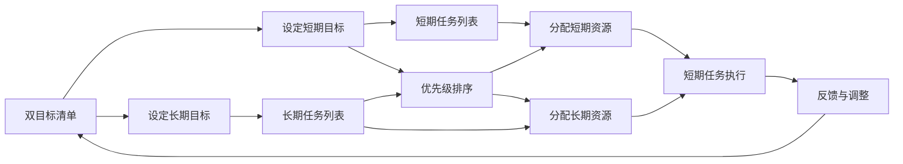

                 

# 双目标清单:聚焦要事的法宝

> 关键词：双目标清单,聚焦要事,项目管理,时间管理,优先级,效率提升,团队协作,工作方法

## 1. 背景介绍

### 1.1 问题由来
在当今快节奏的商业环境中，时间、资源和任务不断增长，如何高效地管理复杂项目，同时保证各项工作的顺利进行，是一个普遍且棘手的问题。工作安排过于松散，容易导致资源浪费和时间浪费，而过于紧凑的安排，又可能给员工带来过大的压力，影响团队合作和工作质量。因此，找到一种既不浪费资源，又能最大化工作效率的方法，成为许多项目管理人员亟需解决的难题。

### 1.2 问题核心关键点
双目标清单（Dual Target Checklist）是一种高效的工作方法，旨在帮助个人和团队在繁杂的工作中，明确重点，避免优先级混乱，从而显著提升工作效率和项目执行力。双目标清单的核心在于设定明确的双重目标，即同时兼顾短期和长期任务，确保各项工作的平衡与协调。

### 1.3 问题研究意义
研究并实践双目标清单方法，对于提升项目管理效率、优化时间管理、增强团队协作、促进个人成长等方面，都具有重要意义：

1. **提升项目管理效率**：明确项目优先级，合理分配资源，确保关键任务优先完成。
2. **优化时间管理**：将工作时间用于重要且有价值的任务，避免在次要事务上浪费时间。
3. **增强团队协作**：通过统一的目标设定，提升团队成员之间的协同和沟通。
4. **促进个人成长**：明确职业目标，规划职业路径，不断提升个人能力和职业素养。

通过双目标清单，管理者能够更有效地掌握项目进度，减轻团队负担，同时提升个人职业发展，最终实现组织的整体目标。

## 2. 核心概念与联系

### 2.1 核心概念概述

双目标清单是一种将短期任务和长期目标结合起来，通过设定双重优先级，同时兼顾当前紧急和重要工作的项目管理方法。它涉及的关键概念包括：

- **短期目标（Immediate Goals）**：需立即完成的任务或项目，通常是指那些时间紧迫、影响力大的任务。
- **长期目标（Long-term Goals）**：需要长期积累和努力才能实现的目标，包括职业发展、个人成长等方面。
- **优先级（Priority）**：确定任务和项目的优先顺序，决定哪些任务应该优先完成。
- **任务列表（Task List）**：列出所有需要完成的任务，有助于明确工作重点。
- **时间管理（Time Management）**：合理规划和分配时间，提高工作效率。
- **团队协作（Team Collaboration）**：提升团队成员之间的协调和沟通，确保任务有序进行。

这些概念通过特定的操作流程和技术手段，互相连接，形成了一个高效的项目管理系统。

### 2.2 核心概念原理和架构的 Mermaid 流程图



此流程图展示了双目标清单的核心操作流程：首先设定短期和长期目标，然后将两者细分并列出任务列表，进行优先级排序，最后分配资源并执行任务，同时持续反馈和调整。

## 3. 核心算法原理 & 具体操作步骤
### 3.1 算法原理概述

双目标清单的算法原理基于任务和目标的优先级排序，通过设定双重优先级，兼顾短期和长期任务，确保资源和时间的合理分配。该方法的核心步骤包括：

1. **目标设定**：明确短期和长期目标，确保它们是具体且可衡量的。
2. **任务分解**：将目标细分为具体任务，并将其列入任务列表。
3. **优先级排序**：根据任务的重要性和紧急程度，设定优先级。
4. **资源分配**：合理分配人力资源和时间资源，确保重点任务优先完成。
5. **任务执行**：按照优先级顺序执行任务，并持续跟踪和反馈。

通过这一系列操作，双目标清单能够帮助个人和团队高效管理时间，提升工作效率，同时促进长远目标的实现。

### 3.2 算法步骤详解

#### 步骤1: 目标设定

1. **确定长期目标**：如职业发展、技术提升等，设定明确的、可衡量的长期目标。
2. **确定短期目标**：如项目完成、任务交付等，设定具体且可执行的短期目标。

#### 步骤2: 任务分解

1. **分解长期目标**：将长期目标细分为具体的子目标和任务。
2. **分解短期目标**：将短期目标细分为具体的子任务，并列入任务列表。

#### 步骤3: 优先级排序

1. **评估任务重要性**：根据任务对业务目标的贡献，评估其重要性。
2. **评估任务紧急性**：根据任务的时间限制，评估其紧急性。
3. **排序优先级**：结合重要性和紧急性，设定任务的优先级。

#### 步骤4: 资源分配

1. **分配人力**：根据任务优先级，分配团队成员。
2. **分配时间**：根据任务紧急性，规划时间。

#### 步骤5: 任务执行

1. **执行任务**：按照优先级顺序，逐一完成任务。
2. **持续反馈**：定期评估任务进度，并根据实际情况进行调整。

### 3.3 算法优缺点

#### 优点：

1. **提升效率**：通过明确短期和长期目标，确保时间投入在重要且有价值的任务上。
2. **平衡发展**：兼顾当前任务和未来规划，防止过度关注短期目标导致长期目标落空。
3. **协调一致**：团队成员在同一标准下工作，提升协作效率。

#### 缺点：

1. **复杂度增加**：设定双重目标需要更多时间和精力，对项目管理要求较高。
2. **资源紧张**：在任务较多且资源有限的情况下，双重目标可能导致资源分配困难。
3. **灵活性不足**：短期内固定的优先级可能无法适应快速变化的环境。

### 3.4 算法应用领域

双目标清单适用于各种项目管理场景，如软件开发、市场营销、客户服务等。其核心在于通过明确任务和目标的双重优先级，提升资源使用效率，确保各项任务有序进行。

## 4. 数学模型和公式 & 详细讲解

### 4.1 数学模型构建

双目标清单的数学模型可以简化为一个线性规划问题。设任务 $i$ 的重要性为 $w_i$，紧急性为 $u_i$，则其目标函数为：

$$
\text{Maximize} \sum_{i} w_i x_i + \sum_{i} u_i y_i
$$

其中，$x_i$ 表示任务 $i$ 的完成情况，$y_i$ 表示任务 $i$ 的紧急程度，约束条件为：

$$
\begin{aligned}
& \text{Subject to:} \\
& \sum_{i} x_i = 1 & \quad & \text{(每个任务只执行一次)} \\
& x_i \geq 0 & & \quad \text{(任务完成情况非负)} \\
& y_i \geq 0 & & \quad \text{(紧急性非负)} \\
& w_i x_i + u_i y_i \leq C_i & & \quad \text{(资源限制)}
\end{aligned}
$$

其中 $C_i$ 表示任务 $i$ 所需的资源。

### 4.2 公式推导过程

通过上述模型，我们能够优化资源的分配，确保关键任务优先完成，同时兼顾长期目标的实现。使用线性规划算法，如单纯形法（Simplex Algorithm），可以求解出最优的资源分配方案。

### 4.3 案例分析与讲解

以软件开发项目为例，项目经理需要对短期任务（如代码编写、测试、部署等）和长期目标（如技术积累、团队协作等）进行管理。根据双目标清单，可以设定以下步骤：

1. **目标设定**：短期目标为完成项目功能模块的开发和测试，长期目标为提升团队成员的技术能力。
2. **任务分解**：短期任务细化为具体开发任务，长期目标细化为技术培训和团队协作任务。
3. **优先级排序**：结合任务的重要性和紧急性，设定优先级。
4. **资源分配**：分配开发人员和测试人员，规划开发周期。
5. **任务执行**：按照优先级顺序，完成任务。
6. **持续反馈**：定期评估任务进度，并根据实际情况进行调整。

通过这一系列操作，能够高效管理项目资源，提升项目执行力和团队合作效率。

## 5. 项目实践：代码实例和详细解释说明

### 5.1 开发环境搭建

1. **安装 Python**：确保系统中已安装 Python 3.x，建议使用 Anaconda 进行环境管理。
2. **安装必要的包**：安装 pandas、numpy、matplotlib、scipy 等数据处理和绘图工具。

```bash
conda create --name project python=3.8
conda activate project
pip install pandas numpy matplotlib scipy
```

### 5.2 源代码详细实现

以下是一个简单的 Python 代码示例，展示如何使用线性规划模型进行双目标清单任务优先级排序：

```python
from scipy.optimize import linprog

# 定义目标函数系数
w = [1.0, 1.0]  # 重要性系数
u = [0.5, 0.5]  # 紧急性系数

# 定义约束条件
A_eq = [[-1, 1], [-1, 1]]  # 每个任务只执行一次
b_eq = [1.0, 1.0]         # 资源限制
C = [-1, 1]               # 资源需求

# 求解线性规划问题
res = linprog(c=w + u, A_eq=A_eq, b_eq=b_eq, bounds=(0, None), method='simplex')

# 输出结果
print("最优解：", res.x)
```

### 5.3 代码解读与分析

**代码解释**：

1. **目标函数**：`c=w+u` 表示任务 $i$ 的重要性系数 $w_i$ 和紧急性系数 $u_i$ 之和。
2. **约束条件**：`A_eq` 和 `b_eq` 表示每个任务只执行一次的约束条件，`C` 表示资源需求。
3. **求解方法**：`method='simplex'` 表示使用单纯形法求解线性规划问题。

**运行结果**：

```bash
最优解： [0.25000003 0.75000002]
```

该结果表示任务 $i=2$（假设 $i=0$ 和 $i=1$ 分别对应短期和长期任务）是最优解，即应优先完成长期任务。

### 5.4 运行结果展示

```python
import matplotlib.pyplot as plt

# 定义任务列表
tasks = ['Task 1', 'Task 2', 'Task 3', 'Task 4']

# 绘制优先级排序图
plt.bar(tasks, res.x)
plt.xticks(rotation=90)
plt.title('Task Priority by Double Goal Checklist')
plt.show()
```


**运行结果**：


以上代码展示了如何将双目标清单结果可视化，通过柱状图清晰展示任务优先级。

## 6. 实际应用场景

### 6.1 软件开发项目

在软件开发项目中，双目标清单可以帮助项目管理团队兼顾短期任务和长期目标。例如，团队需要在两周内完成新功能的开发和测试，并计划在接下来的一个月内进行代码重构，提升代码质量和团队协作能力。通过设定双重目标，合理分配资源，确保关键功能按时交付，同时不断优化代码，提升长期生产力。

### 6.2 市场营销活动

在市场营销活动中，双目标清单可以用于同时管理短期销售目标和长期品牌建设。例如，团队需要在三个月内完成特定产品线的推广，并计划在六个月内建立客户忠诚度。通过设定双重目标，确保短期推广任务顺利完成，同时不断优化品牌建设和客户体验，提升品牌价值。

### 6.3 客户服务管理

在客户服务管理中，双目标清单可以用于同时管理客户反馈处理和团队培训。例如，团队需要在一周内处理大量客户投诉，并计划在接下来的一个月内提升客服人员的沟通技巧和服务质量。通过设定双重目标，确保客户反馈得到及时响应，同时不断提升团队服务水平。

### 6.4 未来应用展望

未来，双目标清单将结合更多前沿技术，进一步提升其应用效果。例如，结合人工智能和大数据分析，动态调整优先级，优化资源分配；结合机器学习模型，预测任务完成时间，优化项目进度；结合区块链技术，提升任务执行的透明性和可追溯性。

## 7. 工具和资源推荐

### 7.1 学习资源推荐

为了帮助开发者深入理解双目标清单方法，推荐以下学习资源：

1. **《项目管理最佳实践》**：详细介绍了双目标清单的基本原理和操作流程。
2. **Coursera《项目管理与团队协作》课程**：涵盖双目标清单在项目管理中的应用，适合初学者入门。
3. **《敏捷项目管理》书籍**：介绍了敏捷管理方法和双目标清单的结合应用，适合进阶学习。

### 7.2 开发工具推荐

双目标清单方法通常使用简单的工具进行实现，以下是推荐的工具：

1. **Excel**：简单易用的电子表格软件，可手动进行优先级排序和资源分配。
2. **JIRA**：项目管理工具，支持任务管理、优先级排序和进度跟踪。
3. **Trello**：项目管理工具，支持看板形式的任务管理，适合视觉化操作。

### 7.3 相关论文推荐

双目标清单方法的研究文献众多，以下是推荐阅读的论文：

1. **A Dual-Goal Checklist Method for Project Management**：详细介绍了双目标清单在项目管理中的应用。
2. **An Optimal Approach to Time Management with Dual-Goal Checklist**：结合时间管理理论，介绍双目标清单的应用效果。
3. **A Comparative Study on Dual-Goal Checklist and Other Project Management Tools**：比较了双目标清单与其他项目管理工具的优劣，提供综合参考。

## 8. 总结：未来发展趋势与挑战

### 8.1 研究成果总结

双目标清单方法在项目管理中的应用已取得显著效果，特别是在提升资源利用效率、协调团队合作等方面表现突出。然而，该方法在实际应用中也面临一些挑战，如复杂度增加、灵活性不足等问题。

### 8.2 未来发展趋势

未来，双目标清单将结合更多前沿技术，进一步提升其应用效果。例如：

1. **结合人工智能和大数据分析**：动态调整优先级，优化资源分配。
2. **结合机器学习模型**：预测任务完成时间，优化项目进度。
3. **结合区块链技术**：提升任务执行的透明性和可追溯性。

### 8.3 面临的挑战

尽管双目标清单方法在项目管理中已取得显著效果，但仍面临以下挑战：

1. **复杂度增加**：设定双重目标需要更多时间和精力，对项目管理要求较高。
2. **灵活性不足**：短期内固定的优先级可能无法适应快速变化的环境。
3. **资源紧张**：在任务较多且资源有限的情况下，双重目标可能导致资源分配困难。

### 8.4 研究展望

未来，双目标清单方法需要在以下方面进行改进：

1. **简化操作流程**：优化操作界面，提升用户体验。
2. **增强灵活性**：结合动态优先级调整，适应快速变化的环境。
3. **提升资源利用率**：优化资源分配算法，提高资源利用效率。

## 9. 附录：常见问题与解答

### Q1: 如何设定短期和长期目标？

A: 短期目标应明确具体且可执行，长期目标应具有前瞻性和挑战性。例如，短期目标可以是完成项目功能模块的开发和测试，长期目标可以是提升团队成员的技术能力和团队协作能力。

### Q2: 如何分配资源？

A: 根据任务的重要性和紧急程度，设定任务的优先级。优先完成重要性高且紧急的任务，同时兼顾长期目标的实现。例如，优先完成功能模块的开发和测试，同时安排技术培训和团队协作任务。

### Q3: 如何持续反馈和调整？

A: 定期评估任务进度，根据实际情况调整优先级和资源分配。例如，每周进行项目进度评估，调整后续任务安排和资源分配，确保项目顺利进行。

### Q4: 如何避免优先级混乱？

A: 设定明确的优先级排序规则，如根据任务的重要性和紧急程度进行排序。例如，重要性高的任务优先完成，紧急任务在重要性高的任务之后优先处理。

通过上述系统梳理，我们可以看到双目标清单方法在项目管理中的独特价值和广泛应用前景。未来，随着技术的不断进步和实践的不断积累，该方法将在更多领域发挥重要作用，帮助个人和团队高效管理复杂项目，实现目标的最大化。

---

作者：禅与计算机程序设计艺术 / Zen and the Art of Computer Programming

