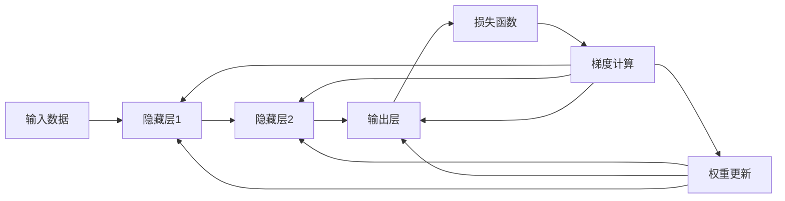

                 

# 反向传播详解：梯度和权重更新

> 关键词：反向传播, 梯度, 权重更新, 深度学习, 神经网络, 优化算法, 计算图

## 1. 背景介绍

在深度学习领域，反向传播算法（Backpropagation）是最为核心和基础的概念之一。它是一种用于训练神经网络，计算模型参数梯度的技术，通过反向传播的链式法则计算损失函数对参数的梯度。本文将深入探讨反向传播的原理、梯度和权重更新的具体操作步骤，以及其在深度学习领域的应用和局限性。

## 2. 核心概念与联系

### 2.1 核心概念概述

为了更好地理解反向传播算法，首先需要了解几个关键概念：

- **神经网络（Neural Network）**：由多层神经元组成的计算模型，通过权重和偏置来建立输入与输出之间的映射关系。
- **损失函数（Loss Function）**：衡量模型预测输出与真实标签之间的差距，常用有交叉熵、均方误差等。
- **梯度（Gradient）**：损失函数对模型参数的偏导数，表示参数对损失函数的影响程度。
- **权重更新（Weight Update）**：根据梯度更新模型参数的过程，以调整模型输出，最小化损失函数。

这些概念通过反向传播算法紧密联系在一起。通过反向传播，模型能够自动计算损失函数对各个参数的梯度，进而调整权重，优化模型性能。

### 2.2 核心概念原理和架构的 Mermaid 流程图



这张图展示了神经网络的结构和反向传播的计算流程：
1. 输入数据首先经过多个隐藏层，最终到达输出层，并计算出损失函数。
2. 损失函数通过链式法则求出各层参数的梯度。
3. 梯度通过反向传播从输出层传回各个隐藏层。
4. 权重更新使用梯度进行参数调整，完成一次完整的反向传播和权重更新过程。

## 3. 核心算法原理 & 具体操作步骤

### 3.1 算法原理概述

反向传播算法基于链式法则，通过对模型输出与损失函数之间的导数关系进行求解，得到每个模型参数的梯度。算法步骤如下：

1. 前向传播：将输入数据通过神经网络，计算出输出。
2. 计算损失函数：将模型输出与真实标签进行对比，计算出损失值。
3. 反向传播：通过链式法则求出损失函数对每个参数的偏导数，即梯度。
4. 权重更新：使用梯度下降等优化算法，更新模型参数。

### 3.2 算法步骤详解

下面是反向传播算法的详细步骤：

**Step 1: 前向传播计算输出**

对于任意一个样本 $x$，前向传播计算神经网络输出 $y$：

$$
y = f(\theta) = \sigma(\theta \cdot x + b)
$$

其中 $\sigma$ 为激活函数，$\theta$ 和 $b$ 分别为权重和偏置。前向传播可以递归展开为：

$$
y^{(l)} = f^{(l)}(\theta^{(l)}) = \sigma(\theta^{(l)} \cdot y^{(l-1)} + b^{(l)})
$$

对于 $l=1$，输入层，$y^{(0)}=x$。

**Step 2: 计算损失函数**

假设模型输出 $y$ 与真实标签 $t$ 的损失函数为 $L$，使用均方误差作为示例：

$$
L = \frac{1}{n} \sum_{i=1}^n (y_i - t_i)^2
$$

**Step 3: 反向传播计算梯度**

根据链式法则，梯度 $\nabla_{\theta}L$ 可分解为：

$$
\nabla_{\theta}L = \frac{\partial L}{\partial \theta} = \frac{\partial L}{\partial y} \cdot \frac{\partial y}{\partial \theta}
$$

其中 $\frac{\partial y}{\partial \theta}$ 即为后向传播计算的结果。

使用链式法则，逐层反向计算，得到每个参数的梯度：

$$
\frac{\partial L}{\partial \theta^{(l)}} = \frac{\partial L}{\partial y^{(l)}} \cdot \frac{\partial y^{(l)}}{\partial \theta^{(l)}}
$$

对于隐藏层的梯度，有：

$$
\frac{\partial L}{\partial \theta^{(l)}} = \frac{\partial L}{\partial y^{(l)}} \cdot \frac{\partial y^{(l)}}{\partial z^{(l)}} \cdot \frac{\partial z^{(l)}}{\partial \theta^{(l)}}
$$

其中 $z^{(l)}$ 为层 $l$ 的输入，$y^{(l)}$ 为层 $l$ 的输出，$\frac{\partial y^{(l)}}{\partial z^{(l)}}$ 为层 $l$ 的导数。

**Step 4: 权重更新**

使用梯度下降等优化算法，更新模型参数：

$$
\theta^{(l)} \leftarrow \theta^{(l)} - \eta \nabla_{\theta^{(l)}} L
$$

其中 $\eta$ 为学习率，$\nabla_{\theta^{(l)}} L$ 为层 $l$ 的梯度。

### 3.3 算法优缺点

反向传播算法具有以下优点：

1. **高效计算**：通过链式法则，可以高效计算出模型参数的梯度，避免了大量重复计算。
2. **可扩展性**：适用于各种规模的神经网络，能够轻松扩展到大规模数据集和多维模型。
3. **精度高**：通过多层反向传播，可以精确计算出每个参数对损失函数的贡献。

然而，反向传播算法也存在一些局限性：

1. **梯度消失和爆炸**：当参数层数较多时，梯度在反向传播过程中可能逐渐消失或爆炸，导致模型难以收敛。
2. **计算复杂度高**：反向传播需要计算梯度，计算复杂度较高，训练大型模型时耗时较长。
3. **参数敏感性**：对学习率等超参数的选择较为敏感，不同学习率可能导致不同的收敛速度和效果。

### 3.4 算法应用领域

反向传播算法广泛应用于深度学习中的各种任务，包括但不限于：

- 图像识别：如CNN、ResNet等模型，通过反向传播优化卷积核权重和偏置。
- 自然语言处理：如RNN、LSTM等模型，通过反向传播优化模型参数。
- 语音识别：如RNN-T等模型，通过反向传播优化模型参数。
- 推荐系统：如协同过滤模型，通过反向传播优化用户和物品嵌入。

## 4. 数学模型和公式 & 详细讲解 & 举例说明

### 4.1 数学模型构建

在反向传播中，模型参数的更新依赖于梯度的计算。假设一个具有 $n$ 个神经元的神经网络，其中每个神经元有 $m$ 个输入和 $k$ 个输出。模型参数 $\theta$ 包括 $k$ 个权重矩阵 $W$ 和 $m$ 个偏置向量 $b$。

前向传播的输出 $y$ 为：

$$
y = f(\theta \cdot x + b)
$$

其中 $f$ 为激活函数。

损失函数 $L$ 为：

$$
L = \frac{1}{n} \sum_{i=1}^n (y_i - t_i)^2
$$

其中 $t$ 为真实标签。

### 4.2 公式推导过程

假设有一个简单的全连接神经网络，其中隐藏层 $l$ 的输出 $y^{(l)}$ 和激活函数 $f$ 为：

$$
y^{(l)} = f^{(l)}(\theta^{(l)}) = \sigma(\theta^{(l)} \cdot y^{(l-1)} + b^{(l)})
$$

其中 $\theta^{(l)}$ 和 $b^{(l)}$ 分别为权重和偏置。

损失函数 $L$ 为：

$$
L = \frac{1}{n} \sum_{i=1}^n (y_i - t_i)^2
$$

对于第 $l$ 层的梯度 $\nabla_{\theta^{(l)}} L$，使用链式法则进行推导：

$$
\nabla_{\theta^{(l)}} L = \frac{\partial L}{\partial y^{(l)}} \cdot \frac{\partial y^{(l)}}{\partial \theta^{(l)}}
$$

其中 $\frac{\partial y^{(l)}}{\partial \theta^{(l)}}$ 为：

$$
\frac{\partial y^{(l)}}{\partial \theta^{(l)}} = \frac{\partial y^{(l)}}{\partial z^{(l)}} \cdot \frac{\partial z^{(l)}}{\partial \theta^{(l)}}
$$

其中 $z^{(l)}$ 为层 $l$ 的输入。

对于隐藏层 $l$ 的输入 $z^{(l)}$，有：

$$
z^{(l)} = y^{(l-1)}
$$

因此：

$$
\frac{\partial z^{(l)}}{\partial \theta^{(l)}} = \frac{\partial y^{(l-1)}}{\partial \theta^{(l-1)}} \cdot \frac{\partial \theta^{(l-1)}}{\partial \theta^{(l)}}
$$

代入 $\frac{\partial y^{(l)}}{\partial \theta^{(l)}}$，得到：

$$
\nabla_{\theta^{(l)}} L = \frac{\partial L}{\partial y^{(l)}} \cdot \frac{\partial y^{(l)}}{\partial z^{(l)}} \cdot \frac{\partial z^{(l)}}{\partial \theta^{(l-1)}} \cdot \frac{\partial \theta^{(l-1)}}{\partial \theta^{(l)}}
$$

对于输出层，有：

$$
\nabla_{\theta^{(L)}} L = \frac{\partial L}{\partial y^{(L)}} \cdot \frac{\partial y^{(L)}}{\partial z^{(L)}} \cdot \frac{\partial z^{(L)}}{\partial \theta^{(L-1)}} \cdot \frac{\partial \theta^{(L-1)}}{\partial \theta^{(L)}}
$$

其中 $L$ 为输出层。

### 4.3 案例分析与讲解

假设有一个简单的二分类模型，包含一个输入层、一个隐藏层和一个输出层。输入层有2个神经元，隐藏层有3个神经元，输出层有1个神经元。激活函数使用 $f(x) = \frac{1}{1+e^{-x}}$。

对于输入 $x=[0.1, 0.2]$，输出 $y$ 为：

$$
y = f(\theta^{(1)} \cdot x + b^{(1)}) = \frac{1}{1+e^{-(\theta^{(1)} \cdot x + b^{(1)})}}
$$

隐藏层 $l=1$ 的输出 $y^{(1)}$ 为：

$$
y^{(1)} = f^{(1)}(\theta^{(1)}) = \frac{1}{1+e^{-(\theta^{(1)} \cdot y^{(0)} + b^{(1)})}}
$$

其中 $y^{(0)} = x$。

输出层的梯度 $\nabla_{\theta^{(3)}} L$ 为：

$$
\nabla_{\theta^{(3)}} L = \frac{\partial L}{\partial y^{(3)}} \cdot \frac{\partial y^{(3)}}{\partial z^{(3)}} \cdot \frac{\partial z^{(3)}}{\partial \theta^{(2)}} \cdot \frac{\partial \theta^{(2)}}{\partial \theta^{(3)}}
$$

其中 $\frac{\partial y^{(3)}}{\partial z^{(3)}} = \frac{\partial y^{(3)}}{\partial \theta^{(3)}} \cdot \frac{\partial \theta^{(3)}}{\partial z^{(3)}}$。

输出层的损失函数 $L$ 为：

$$
L = (y - t)^2
$$

其中 $t$ 为真实标签。

## 5. 项目实践：代码实例和详细解释说明

### 5.1 开发环境搭建

为了进行反向传播算法的实践，需要搭建一个Python开发环境，包括深度学习框架和相应的库。以下是Python开发环境的搭建步骤：

1. 安装Anaconda：从官网下载并安装Anaconda，用于创建独立的Python环境。

2. 创建并激活虚拟环境：
```bash
conda create -n deep_learning python=3.8 
conda activate deep_learning
```

3. 安装TensorFlow和PyTorch：根据CUDA版本，从官网获取对应的安装命令。例如：
```bash
conda install tensorflow pytorch cudatoolkit=11.1 -c pytorch -c conda-forge
```

4. 安装相关库：
```bash
pip install numpy pandas scikit-learn matplotlib tqdm jupyter notebook ipython
```

5. 安装TensorBoard：
```bash
pip install tensorboard
```

完成上述步骤后，即可在`deep_learning`环境中开始反向传播算法的实践。

### 5.2 源代码详细实现

下面我们以一个简单的全连接神经网络为例，使用TensorFlow实现反向传播算法的代码实现。

首先，定义神经网络模型：

```python
import tensorflow as tf

class NeuralNetwork(tf.keras.Model):
    def __init__(self, units):
        super(NeuralNetwork, self).__init__()
        self.fc1 = tf.keras.layers.Dense(units, activation='relu')
        self.fc2 = tf.keras.layers.Dense(1, activation='sigmoid')

    def call(self, x):
        x = self.fc1(x)
        x = self.fc2(x)
        return x
```

接着，定义损失函数和优化器：

```python
def loss_fn(y_true, y_pred):
    return tf.keras.losses.binary_crossentropy(y_true, y_pred)

optimizer = tf.keras.optimizers.Adam(learning_rate=0.001)
```

然后，定义训练和评估函数：

```python
def train_step(x, y):
    with tf.GradientTape() as tape:
        y_pred = model(x)
        loss = loss_fn(y, y_pred)
    gradients = tape.gradient(loss, model.trainable_variables)
    optimizer.apply_gradients(zip(gradients, model.trainable_variables))

def evaluate_step(x, y):
    y_pred = model(x)
    loss = loss_fn(y, y_pred)
    return loss
```

最后，启动训练流程并在测试集上评估：

```python
epochs = 100
batch_size = 32

for epoch in range(epochs):
    for x, y in train_dataset:
        train_step(x, y)
    loss = evaluate_step(test_dataset)
    print(f"Epoch {epoch+1}, loss: {loss:.4f}")
```

以上就是使用TensorFlow进行反向传播算法实现的完整代码。可以看到，TensorFlow的高级API使得反向传播的实现变得简洁高效。

### 5.3 代码解读与分析

让我们再详细解读一下关键代码的实现细节：

**NeuralNetwork类**：
- `__init__`方法：初始化网络层。
- `call`方法：定义前向传播的计算过程。

**损失函数和优化器**：
- 使用TensorFlow的内置损失函数和优化器，简化了代码实现。

**train_step和evaluate_step函数**：
- 使用`GradientTape`记录梯度，通过`apply_gradients`更新模型参数。
- 计算损失函数，返回模型在测试集上的损失值。

**训练流程**：
- 定义总的epoch数和batch size，开始循环迭代
- 每个epoch内，在训练集上训练，输出平均损失
- 在测试集上评估，给出最终测试结果

可以看到，TensorFlow框架提供了丰富的深度学习API，使得反向传播的实现变得简单直观。

## 6. 实际应用场景

### 6.1 图像识别

在图像识别任务中，反向传播算法被广泛用于训练卷积神经网络（CNN）。通过反向传播，网络可以自动学习图像特征，从而实现高效的图像分类、检测和分割。

### 6.2 自然语言处理

在自然语言处理领域，反向传播算法被用于训练循环神经网络（RNN）和长短期记忆网络（LSTM）。通过反向传播，网络可以自动学习语言的语法和语义规则，从而实现高效的文本分类、语言生成和机器翻译。

### 6.3 语音识别

在语音识别任务中，反向传播算法被用于训练深度神经网络（DNN）。通过反向传播，网络可以自动学习语音特征，从而实现高效的语音识别和语音合成。

### 6.4 未来应用展望

随着反向传播算法的不断优化和改进，未来的深度学习模型将能够处理更加复杂的任务。

1. 模型规模增大。未来的深度学习模型将拥有更多的参数和更深的层次，能够处理更大规模的数据和更复杂的结构。
2. 计算速度提升。通过硬件加速和优化算法，未来模型的训练速度将大幅提升，能够实时处理大量数据。
3. 自动化程度提高。未来的深度学习模型将具备更高的自动化水平，能够自动选择最优的超参数和优化算法，提升模型的效果和性能。
4. 模型应用广泛。未来的深度学习模型将应用于更多领域，如医疗、金融、教育等，推动各个行业的数字化转型。

## 7. 工具和资源推荐

### 7.1 学习资源推荐

为了帮助开发者系统掌握反向传播算法的理论基础和实践技巧，这里推荐一些优质的学习资源：

1. 《深度学习》书籍：由Ian Goodfellow等人编写，系统介绍了深度学习的基本概念和算法，包括反向传播和优化算法。

2. CS231n《深度学习与计算机视觉》课程：斯坦福大学开设的深度学习课程，涵盖了深度学习在计算机视觉领域的应用，包括反向传播和模型训练。

3. CS224N《深度学习与自然语言处理》课程：斯坦福大学开设的NLP课程，详细讲解了深度学习在NLP领域的应用，包括反向传播和优化算法。

4. PyTorch官方文档：PyTorch的官方文档，提供了大量的深度学习API和教程，帮助开发者快速上手反向传播算法。

5. TensorFlow官方文档：TensorFlow的官方文档，提供了丰富的深度学习API和教程，帮助开发者快速实现反向传播算法。

通过对这些资源的学习实践，相信你一定能够快速掌握反向传播算法的精髓，并用于解决实际的深度学习问题。

### 7.2 开发工具推荐

高效的开发离不开优秀的工具支持。以下是几款用于深度学习开发的常用工具：

1. PyTorch：基于Python的开源深度学习框架，灵活动态的计算图，适合快速迭代研究。

2. TensorFlow：由Google主导开发的开源深度学习框架，生产部署方便，适合大规模工程应用。

3. Keras：高层次的深度学习API，提供简洁易用的接口，适合快速原型开发。

4. Weights & Biases：模型训练的实验跟踪工具，可以记录和可视化模型训练过程中的各项指标，方便对比和调优。

5. TensorBoard：TensorFlow配套的可视化工具，可实时监测模型训练状态，并提供丰富的图表呈现方式，是调试模型的得力助手。

合理利用这些工具，可以显著提升深度学习模型的开发效率，加快创新迭代的步伐。

### 7.3 相关论文推荐

反向传播算法的发展源于学界的持续研究。以下是几篇奠基性的相关论文，推荐阅读：

1. A Network for Loosely Specified Information Retrieval（即DNN原论文）：提出了深度神经网络，通过反向传播学习特征表示。

2. Backpropagation Applied to Handwritten Zip Code Recognition（即BP神经网络原论文）：引入了BP算法，通过反向传播优化网络参数，实现了手写数字识别。

3. Gradient-Based Methods for Generalization of Deep Architectures（梯度下降的优化算法）：引入了梯度下降算法，通过反向传播优化网络参数，实现了模型训练。

4. Adaptive Gradient Algorithms for Online Neural Networks（自适应梯度算法）：引入了自适应梯度算法，提高了反向传播的效率和稳定性。

5. Layer-wise Training of Deep Neural Networks（分层训练算法）：引入了分层训练算法，优化了反向传播的计算过程。

这些论文代表了大规模反向传播算法的发展脉络。通过学习这些前沿成果，可以帮助研究者把握学科前进方向，激发更多的创新灵感。

## 8. 总结：未来发展趋势与挑战

### 8.1 总结

本文对反向传播算法的原理、梯度和权重更新的具体操作步骤进行了全面系统的介绍。首先阐述了反向传播算法的背景和意义，明确了其在深度学习中的重要地位。其次，从原理到实践，详细讲解了反向传播的数学模型和公式推导，给出了深度学习模型的代码实现。同时，本文还广泛探讨了反向传播算法在深度学习领域的应用和局限性。

通过本文的系统梳理，可以看到，反向传播算法是深度学习中最基础、最关键的概念之一，通过高效计算梯度和权重更新，优化了模型的训练过程。尽管反向传播算法已经广泛应用，但在面对复杂任务和大规模数据时，仍需不断优化和改进，以提高模型的训练效率和性能。

### 8.2 未来发展趋势

展望未来，反向传播算法将呈现以下几个发展趋势：

1. 模型结构更加复杂。未来的深度学习模型将拥有更深的层次和更多的参数，能够处理更大规模的数据和更复杂的结构。
2. 优化算法更加多样。未来的深度学习模型将采用更多样化的优化算法，如AdamW、Adafactor等，提高模型的训练效率和性能。
3. 分布式训练更加普及。未来的深度学习模型将采用分布式训练，利用多台机器加速模型训练，处理更大规模的数据。
4. 自适应学习更加普遍。未来的深度学习模型将具备更强的自适应学习能力，能够根据数据分布和模型表现自动调整学习率等超参数，提升模型的效果和性能。

### 8.3 面临的挑战

尽管反向传播算法已经取得了显著的进展，但在迈向更加智能化、普适化应用的过程中，仍面临诸多挑战：

1. 模型规模增大。随着模型参数的增加，反向传播算法的计算复杂度将大幅提升，需要更高效的硬件和算法支持。
2. 数据量需求增加。随着模型复杂度的增加，反向传播算法对数据的需求也随之增加，需要更丰富的训练数据。
3. 过拟合问题加剧。模型复杂度增加可能导致过拟合问题加剧，需要更有效的正则化和数据增强方法。
4. 计算资源消耗增加。反向传播算法需要大量的计算资源，如何降低计算资源消耗，提高训练效率，将是未来重要的研究方向。

### 8.4 研究展望

面对反向传播算法所面临的挑战，未来的研究需要在以下几个方面寻求新的突破：

1. 探索更高效的优化算法。开发更加高效的优化算法，如自适应梯度算法、参数化梯度算法等，提高反向传播算法的计算效率。
2. 引入更有效的正则化方法。采用更加有效的正则化方法，如Dropout、Batch Normalization等，减少过拟合风险，提升模型泛化能力。
3. 优化数据获取和预处理。改进数据获取和预处理流程，获取更丰富、更高质量的训练数据，提高反向传播算法的训练效果。
4. 引入更智能的学习机制。开发更智能的学习机制，如元学习、自监督学习等，提高反向传播算法的训练效率和性能。

这些研究方向将引领反向传播算法走向新的高度，为深度学习技术的发展注入新的动力。面向未来，反向传播算法需要在理论和技术上不断突破，以适应更复杂、更广泛的应用场景。

## 9. 附录：常见问题与解答

**Q1：反向传播算法是否适用于所有深度学习模型？**

A: 反向传播算法适用于所有前向传播的神经网络模型。但由于反向传播算法的计算复杂度和收敛速度与模型结构有关，某些复杂的模型可能存在梯度消失或爆炸的问题，需要特殊处理。

**Q2：反向传播算法在训练过程中如何避免过拟合？**

A: 避免过拟合的方法包括：
1. 数据增强：通过扩充训练数据，提高模型的泛化能力。
2. 正则化：使用L1、L2正则、Dropout等方法，限制模型复杂度。
3. 早停策略：在验证集性能不再提升时，提前停止训练，防止过拟合。
4. 批标准化：在每一层输入上进行归一化，提高模型的训练效率和稳定性。

**Q3：反向传播算法在训练过程中如何调节学习率？**

A: 学习率的调节方法包括：
1. 固定学习率：根据经验手动调节学习率，常见的有0.01、0.001等。
2. 学习率衰减：在训练过程中逐步降低学习率，防止过拟合，常见的有学习率衰减策略。
3. 自适应学习率：使用如AdamW等自适应学习率算法，根据模型参数的梯度自适应调整学习率，提高训练效率。

**Q4：反向传播算法在训练过程中如何避免梯度消失和爆炸？**

A: 避免梯度消失和爆炸的方法包括：
1. 权重初始化：使用如Xavier初始化等方法，保证权重初值分布合理。
2. 梯度裁剪：对梯度进行裁剪，防止梯度爆炸。
3. 激活函数选择：使用如ReLU、Leaky ReLU等激活函数，缓解梯度消失问题。
4. 残差连接：使用残差连接等方法，缓解梯度消失和爆炸问题。

**Q5：反向传播算法在训练过程中如何处理大规模数据？**

A: 处理大规模数据的方法包括：
1. 分布式训练：使用多台机器进行模型训练，提高训练效率。
2. 数据分批处理：将数据分成多个批次进行训练，提高模型性能。
3. 数据预处理：使用数据预处理技术，如数据去重、数据清洗等，提高数据质量。
4. 模型压缩：使用模型压缩技术，减少模型参数量，提高模型性能。

这些方法可以有效地处理大规模数据，提升反向传播算法的训练效率和性能。

---

作者：禅与计算机程序设计艺术 / Zen and the Art of Computer Programming

