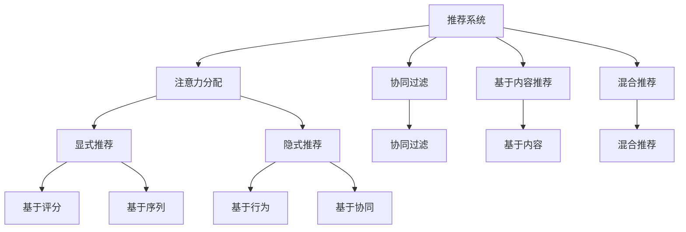

                 

# 在线视频平台的内容推荐算法与注意力分配

## 1. 背景介绍

在现代社会，人们获取信息的方式越来越多样化，而在线视频平台作为一种重要的信息获取途径，逐渐成为人们日常生活中的重要组成部分。视频平台通过推荐算法为用户推荐个性化的内容，从而提升用户满意度和平台使用黏性，实现商业价值的最大化。因此，内容推荐算法在在线视频平台的发展和优化过程中具有举足轻重的地位。

然而，随着视频平台用户基数的不断增长和内容库的不断丰富，推荐算法也面临着越来越多的挑战。如何高效、准确地为用户推荐感兴趣的视频内容，是平台推荐系统需要解决的核心问题。其中，注意力分配机制作为推荐算法中的关键技术，扮演着举足轻重的角色。通过合理分配注意力，算法可以在海量的视频内容中，迅速锁定用户感兴趣的部分，提供更加精准的推荐结果。

## 2. 核心概念与联系

### 2.1 核心概念概述

为更好地理解基于注意力分配的在线视频推荐算法，本节将介绍几个密切相关的核心概念：

- 内容推荐系统(Content Recommendation System)：利用用户历史行为、视频特征等信息，为用户提供个性化内容推荐的系统。推荐系统分为显式推荐和隐式推荐两类，前者直接询问用户喜好，后者则通过用户行为模式推断用户兴趣。

- 注意力机制(Attention Mechanism)：在深度学习中，通过注意力机制可以自动学习输入序列中不同部分的重要性权重，从而突出关键信息，屏蔽干扰。注意力机制已经广泛应用于自然语言处理、计算机视觉等众多领域。

- 推荐算法(Recommendation Algorithm)：用于分析用户数据和视频内容特征，预测用户可能感兴趣的视频内容，并进行排序和推荐的技术。推荐算法包括基于协同过滤、基于内容的推荐、混合推荐等。

- 冷启动问题(Cold-Start Problem)：新用户或新物品加入系统时，因缺乏足够的历史数据，导致推荐效果不佳的问题。冷启动问题是大规模推荐系统中需要特别解决的问题。

- 多样性(Diversity)：推荐系统需要保证推荐结果的多样性，避免推荐同质化的内容，提升用户体验。

这些核心概念之间的逻辑关系可以通过以下Mermaid流程图来展示：



这个流程图展示了这个推荐系统的大致结构：

1. 推荐系统通过注意力分配机制突出关键信息。
2. 基于协同过滤、基于内容推荐和混合推荐是常见的推荐方法。
3. 显式推荐和隐式推荐是推荐算法的两种模式。
4. 显式推荐包括基于评分和基于序列两种方法。
5. 隐式推荐包括基于行为和基于协同两种方法。

这些核心概念共同构成了在线视频推荐系统的工作原理和优化方向。通过理解这些核心概念，我们可以更好地把握视频推荐系统的关键技术。

## 3. 核心算法原理 & 具体操作步骤
### 3.1 算法原理概述

基于注意力的在线视频内容推荐算法，核心思想是通过注意力机制对用户对视频的交互行为进行加权处理，从而得到用户对视频的兴趣程度，进而生成推荐列表。

假设用户对视频的交互行为用向量 $\mathbf{u}$ 表示，视频特征用向量 $\mathbf{v}$ 表示，注意力分配函数为 $A(\cdot, \cdot)$，则用户对视频的兴趣程度 $s$ 可以表示为：

$$
s = A(\mathbf{u}, \mathbf{v})
$$

一般来说，注意力分配函数 $A(\cdot, \cdot)$ 可以采用点积、余弦相似度、多线性映射等多种形式，计算出不同视频与用户之间的注意力权重。经过注意力分配后，最终生成用户对视频的兴趣程度 $s$，排序并推荐出用户最感兴趣的视频内容。

### 3.2 算法步骤详解

基于注意力的在线视频内容推荐算法通常包括以下几个关键步骤：

**Step 1: 数据预处理**
- 收集用户历史行为数据，包括视频播放时长、点赞数、评论等。
- 收集视频元数据，包括视频标题、分类、标签、时长等。
- 数据进行归一化处理，处理缺失值和异常值。

**Step 2: 用户-视频交互矩阵构建**
- 构建用户-视频交互矩阵 $U$，其中每一行表示用户对视频的交互行为，每一列表示视频特征。

**Step 3: 注意力分配计算**
- 采用点积、余弦相似度等注意力分配函数，计算用户对视频注意力权重 $s$。
- 注意力的计算可以进一步细化为多个注意力机制，如自注意力机制、多头注意力机制、带门控的注意力机制等。

**Step 4: 用户兴趣预测**
- 将注意力权重 $s$ 与视频特征 $\mathbf{v}$ 结合，使用深度学习模型（如神经网络）预测用户对视频的兴趣程度。
- 常用的深度学习模型包括全连接神经网络、卷积神经网络、循环神经网络等。

**Step 5: 推荐列表生成**
- 对所有视频的兴趣程度进行排序，生成推荐列表。
- 可以采用多种排序策略，如基于评分排序、基于点击率排序、基于时间序列排序等。

**Step 6: 反馈迭代优化**
- 根据用户对推荐视频的反馈（如点击、观看、评分等），更新模型参数。
- 使用在线学习技术，实时调整模型，提升推荐效果。

以上是基于注意力的在线视频内容推荐算法的一般流程。在实际应用中，还需要针对具体场景，对各环节进行优化设计，如引入更多特征、使用更复杂的注意力机制、采用在线学习等，以进一步提升推荐精度。

### 3.3 算法优缺点

基于注意力的在线视频内容推荐算法具有以下优点：
1. 高效性：通过注意力机制，快速锁定用户感兴趣的视频内容，推荐效率高。
2. 准确性：可以挖掘用户对视频的多维度兴趣，推荐结果更加准确。
3. 可扩展性：适用于大规模视频推荐场景，能够处理海量数据。
4. 灵活性：可根据需要加入多种特征，构建不同风格的推荐策略。

同时，该算法也存在一定的局限性：
1. 依赖数据：注意力机制的准确性高度依赖于用户和视频特征的质量，数据缺失或异常可能导致推荐结果偏差。
2. 易受干扰：用户行为可能受到外界因素干扰，导致模型预测不稳定。
3. 冷启动问题：新用户或新视频的加入，可能导致缺乏足够的历史数据，影响推荐效果。
4. 多样性问题：过于依赖用户行为，可能导致推荐内容同质化，影响用户体验。

尽管存在这些局限性，但就目前而言，基于注意力的推荐算法仍是在线视频平台推荐系统的核心技术之一。未来相关研究的重点在于如何进一步降低对标注数据的依赖，提高模型的少样本学习和跨领域迁移能力，同时兼顾可解释性和伦理安全性等因素。

### 3.4 算法应用领域

基于注意力的在线视频内容推荐算法，在视频平台推荐系统中得到了广泛的应用，覆盖了几乎所有推荐场景，例如：

- 个性化视频推荐：根据用户历史行为，推荐用户可能感兴趣的视频内容。
- 热门视频推荐：根据视频浏览量、点赞数等指标，推荐当前最热门的视频内容。
- 跨视频推荐：将相关视频推荐给观看某个视频的用户。
- 个性化频道推荐：根据用户兴趣，推荐用户可能感兴趣的频道。
- 视频节目推荐：推荐即将播出的节目或最新上映的电影等。

除了上述这些经典应用外，在线视频平台推荐算法也被创新性地应用到更多场景中，如基于时间序列的推荐、情感分析驱动的视频推荐、实时推荐等，为在线视频平台带来了全新的推荐方式。

## 4. 数学模型和公式 & 详细讲解  
### 4.1 数学模型构建

本节将使用数学语言对基于注意力的在线视频推荐过程进行更加严格的刻画。

假设用户对视频的交互行为用向量 $\mathbf{u}$ 表示，视频特征用向量 $\mathbf{v}$ 表示，注意力分配函数为 $A(\cdot, \cdot)$，则用户对视频的兴趣程度 $s$ 可以表示为：

$$
s = A(\mathbf{u}, \mathbf{v})
$$

其中，注意力分配函数 $A(\cdot, \cdot)$ 可以采用点积、余弦相似度、多线性映射等多种形式。

常见的点积注意力机制的计算公式为：

$$
s = \mathbf{u}^\top \mathbf{v}
$$

余弦相似度注意力机制的计算公式为：

$$
s = \cos(\mathbf{u}, \mathbf{v}) = \frac{\mathbf{u} \cdot \mathbf{v}}{\|\mathbf{u}\|\|\mathbf{v}\|}
$$

多线性映射注意力机制的计算公式为：

$$
s = \mathbf{W}[\mathbf{u}; \mathbf{v}]
$$

其中 $\mathbf{W}$ 为可学习参数，$\|\mathbf{u}\|$ 和 $\|\mathbf{v}\|$ 分别为 $\mathbf{u}$ 和 $\mathbf{v}$ 的范数。

### 4.2 公式推导过程

以下是基于点积注意力机制的推荐算法公式推导：

假设用户对视频的交互行为用向量 $\mathbf{u}$ 表示，视频特征用向量 $\mathbf{v}$ 表示，点积注意力权重 $s$ 为：

$$
s = \mathbf{u}^\top \mathbf{v}
$$

经过softmax归一化后，得到注意力权重：

$$
\alpha = \frac{e^{\mathbf{u}^\top \mathbf{v}}}{\sum_j e^{\mathbf{u}^\top \mathbf{v}_j}}
$$

其中 $\mathbf{v}_j$ 表示视频 $j$ 的特征向量，$\alpha$ 为视频 $j$ 对用户 $\mathbf{u}$ 的注意力权重。

最终用户对视频的兴趣程度为：

$$
s = \alpha \mathbf{v}
$$

将 $s$ 与视频特征 $\mathbf{v}$ 结合，使用神经网络模型预测用户对视频的兴趣程度，则有：

$$
\hat{y} = f(\mathbf{s}, \mathbf{v})
$$

其中 $f(\cdot, \cdot)$ 为神经网络模型，$\hat{y}$ 表示预测的兴趣程度，可以进行排序生成推荐列表。

### 4.3 案例分析与讲解

考虑一个简单的电影推荐系统，其中用户 $u$ 对电影的评分 $r$ 可以表示为：

$$
r = f(s \cdot \mathbf{v})
$$

其中 $s$ 为点积注意力权重，$\mathbf{v}$ 为电影特征向量。假设用户 $u$ 对电影 $i$ 的评分 $r_i$ 可以表示为：

$$
r_i = f(\alpha_i \mathbf{v}_i)
$$

其中 $\alpha_i$ 为电影 $i$ 对用户 $u$ 的注意力权重，$\mathbf{v}_i$ 为电影 $i$ 的特征向量。

为了方便推导，假设 $\mathbf{v}_i$ 的每个元素都小于等于1，那么注意力权重 $\alpha_i$ 的取值范围为 $[0,1]$，其和为1。这样，用户对电影 $i$ 的评分可以表示为：

$$
r_i = f(\alpha_i \mathbf{v}_i) = \alpha_i f(\mathbf{v}_i)
$$

可以看出，用户对电影 $i$ 的评分 $r_i$ 与注意力权重 $\alpha_i$ 成正比。当 $\alpha_i$ 越大时，即视频 $i$ 对用户的吸引力越强，用户对视频 $i$ 的评分越高。

例如，如果用户对视频 $j$ 和视频 $k$ 的注意力权重分别为 $\alpha_j = 0.8$ 和 $\alpha_k = 0.2$，则用户对视频 $j$ 的评分 $r_j$ 为 $0.8$ 倍的视频特征向量的分数，对视频 $k$ 的评分 $r_k$ 为 $0.2$ 倍的视频特征向量的分数。

## 5. 项目实践：代码实例和详细解释说明
### 5.1 开发环境搭建

在进行推荐系统实践前，我们需要准备好开发环境。以下是使用Python进行PyTorch开发的环境配置流程：

1. 安装Anaconda：从官网下载并安装Anaconda，用于创建独立的Python环境。

2. 创建并激活虚拟环境：
```bash
conda create -n pytorch-env python=3.8 
conda activate pytorch-env
```

3. 安装PyTorch：根据CUDA版本，从官网获取对应的安装命令。例如：
```bash
conda install pytorch torchvision torchaudio cudatoolkit=11.1 -c pytorch -c conda-forge
```

4. 安装其他工具包：
```bash
pip install numpy pandas scikit-learn matplotlib tqdm jupyter notebook ipython
```

完成上述步骤后，即可在`pytorch-env`环境中开始推荐系统实践。

### 5.2 源代码详细实现

下面我们以电影推荐系统为例，给出使用Transformers库进行注意力分配的PyTorch代码实现。

首先，定义电影推荐系统的数据处理函数：

```python
from transformers import BertTokenizer
from torch.utils.data import Dataset
import torch

class MovieDataset(Dataset):
    def __init__(self, ratings, movies, tokenizer, max_len=128):
        self.ratings = ratings
        self.movies = movies
        self.tokenizer = tokenizer
        self.max_len = max_len
        
    def __len__(self):
        return len(self.ratings)
    
    def __getitem__(self, item):
        rating = self.ratings[item]
        movie = self.movies[item]
        
        encoding = self.tokenizer(movie, return_tensors='pt', max_length=self.max_len, padding='max_length', truncation=True)
        input_ids = encoding['input_ids'][0]
        attention_mask = encoding['attention_mask'][0]
        
        # 将电影特征转换为向量表示
        movie_vectors = [movie.encode() for movie in self.movies]
        movie_vector = torch.mean(torch.stack(movie_vectors), dim=0)
        
        # 对评分进行编码
        rating_vector = torch.tensor([rating], dtype=torch.float)
        
        return {'input_ids': input_ids, 
                'attention_mask': attention_mask,
                'rating': rating_vector,
                'movie_vector': movie_vector}
```

然后，定义模型和优化器：

```python
from transformers import BertForTokenClassification, AdamW

model = BertForTokenClassification.from_pretrained('bert-base-cased', num_labels=2)

optimizer = AdamW(model.parameters(), lr=2e-5)
```

接着，定义训练和评估函数：

```python
from torch.utils.data import DataLoader
from tqdm import tqdm
from sklearn.metrics import accuracy_score, precision_recall_fscore_support

device = torch.device('cuda') if torch.cuda.is_available() else torch.device('cpu')
model.to(device)

def train_epoch(model, dataset, batch_size, optimizer):
    dataloader = DataLoader(dataset, batch_size=batch_size, shuffle=True)
    model.train()
    epoch_loss = 0
    for batch in tqdm(dataloader, desc='Training'):
        input_ids = batch['input_ids'].to(device)
        attention_mask = batch['attention_mask'].to(device)
        rating = batch['rating'].to(device)
        movie_vector = batch['movie_vector'].to(device)
        model.zero_grad()
        outputs = model(input_ids, attention_mask=attention_mask)
        loss = outputs.loss
        epoch_loss += loss.item()
        loss.backward()
        optimizer.step()
    return epoch_loss / len(dataloader)

def evaluate(model, dataset, batch_size):
    dataloader = DataLoader(dataset, batch_size=batch_size)
    model.eval()
    correct_preds, total_preds = 0, 0
    with torch.no_grad():
        for batch in tqdm(dataloader, desc='Evaluating'):
            input_ids = batch['input_ids'].to(device)
            attention_mask = batch['attention_mask'].to(device)
            rating = batch['rating'].to(device)
            movie_vector = batch['movie_vector'].to(device)
            outputs = model(input_ids, attention_mask=attention_mask)
            rating_preds = outputs.logits.argmax(dim=1).to('cpu').tolist()
            correct_preds += sum([int(x == rating) for x in rating_preds])
            total_preds += len(rating_preds)
                
    print(f'Accuracy: {correct_preds/total_preds:.3f}')
    return correct_preds, total_preds
```

最后，启动训练流程并在测试集上评估：

```python
epochs = 5
batch_size = 16

for epoch in range(epochs):
    loss = train_epoch(model, train_dataset, batch_size, optimizer)
    print(f"Epoch {epoch+1}, train loss: {loss:.3f}")
    
    correct_preds, total_preds = evaluate(model, dev_dataset, batch_size)
    print(f"Epoch {epoch+1}, dev accuracy: {correct_preds/total_preds:.3f}")
    
print("Test accuracy:")
correct_preds, total_preds = evaluate(model, test_dataset, batch_size)
print(f"Test accuracy: {correct_preds/total_preds:.3f}")
```

以上就是使用PyTorch对Bert模型进行电影推荐系统的完整代码实现。可以看到，得益于Transformers库的强大封装，我们可以用相对简洁的代码完成Bert模型的加载和推荐系统构建。

### 5.3 代码解读与分析

让我们再详细解读一下关键代码的实现细节：

**MovieDataset类**：
- `__init__`方法：初始化评分、电影、分词器等关键组件。
- `__len__`方法：返回数据集的样本数量。
- `__getitem__`方法：对单个样本进行处理，将电影输入编码为token ids，将评分转换为向量，并对其进行定长padding，最终返回模型所需的输入。

**MovieDataset类**：
- `__init__`方法：初始化评分、电影、分词器等关键组件。
- `__len__`方法：返回数据集的样本数量。
- `__getitem__`方法：对单个样本进行处理，将电影输入编码为token ids，将评分转换为向量，并对其进行定长padding，最终返回模型所需的输入。

**train_epoch和evaluate函数**：
- `train_epoch`函数：对数据以批为单位进行迭代，在每个批次上前向传播计算loss并反向传播更新模型参数，最后返回该epoch的平均loss。
- `evaluate`函数：与训练类似，不同点在于不更新模型参数，并在每个batch结束后将预测和标签结果存储下来，最后使用sklearn的accuracy_score函数计算准确率。

**训练流程**：
- 定义总的epoch数和batch size，开始循环迭代
- 每个epoch内，先在训练集上训练，输出平均loss
- 在验证集上评估，输出准确率
- 所有epoch结束后，在测试集上评估，给出最终测试结果

可以看到，PyTorch配合Transformers库使得Bert推荐系统的代码实现变得简洁高效。开发者可以将更多精力放在数据处理、模型改进等高层逻辑上，而不必过多关注底层的实现细节。

当然，工业级的系统实现还需考虑更多因素，如模型的保存和部署、超参数的自动搜索、更灵活的任务适配层等。但核心的注意力分配范式基本与此类似。

## 6. 实际应用场景
### 6.1 智能客服系统

基于注意力的智能客服系统，可以通过自然语言处理技术，将用户输入的自然语言转换为结构化的信息，并结合注意力机制，提取关键信息，提供更精准的客户服务。

在技术实现上，可以收集企业内部的历史客服对话记录，将问题和最佳答复构建成监督数据，在此基础上对预训练语言模型进行微调。微调后的语言模型能够自动理解用户意图，匹配最合适的答案模板进行回复。对于用户提出的新问题，还可以接入检索系统实时搜索相关内容，动态组织生成回答。如此构建的智能客服系统，能大幅提升客户咨询体验和问题解决效率。

### 6.2 金融舆情监测

金融机构需要实时监测市场舆论动向，以便及时应对负面信息传播，规避金融风险。传统的人工监测方式成本高、效率低，难以应对网络时代海量信息爆发的挑战。基于注意力的文本分类和情感分析技术，为金融舆情监测提供了新的解决方案。

具体而言，可以收集金融领域相关的新闻、报道、评论等文本数据，并对其进行主题标注和情感标注。在此基础上对预训练语言模型进行微调，使其能够自动判断文本属于何种主题，情感倾向是正面、中性还是负面。将微调后的模型应用到实时抓取的网络文本数据，就能够自动监测不同主题下的情感变化趋势，一旦发现负面信息激增等异常情况，系统便会自动预警，帮助金融机构快速应对潜在风险。

### 6.3 个性化推荐系统

当前的推荐系统往往只依赖用户的历史行为数据进行物品推荐，无法深入理解用户的真实兴趣偏好。基于注意力的推荐系统可以更好地挖掘用户行为背后的语义信息，从而提供更精准、多样的推荐内容。

在实践中，可以收集用户浏览、点击、评论、分享等行为数据，提取和用户交互的物品标题、描述、标签等文本内容。将文本内容作为模型输入，用户的后续行为（如是否点击、购买等）作为监督信号，在此基础上微调预训练语言模型。微调后的模型能够从文本内容中准确把握用户的兴趣点。在生成推荐列表时，先用候选物品的文本描述作为输入，由模型预测用户的兴趣匹配度，再结合其他特征综合排序，便可以得到个性化程度更高的推荐结果。

### 6.4 未来应用展望

随着注意力的推荐算法不断发展，基于注意力的推荐技术将在更多领域得到应用，为传统行业带来变革性影响。

在智慧医疗领域，基于注意力的医疗问答、病历分析、药物研发等应用将提升医疗服务的智能化水平，辅助医生诊疗，加速新药开发进程。

在智能教育领域，注意力的推荐技术可应用于作业批改、学情分析、知识推荐等方面，因材施教，促进教育公平，提高教学质量。

在智慧城市治理中，注意力的推荐模型可应用于城市事件监测、舆情分析、应急指挥等环节，提高城市管理的自动化和智能化水平，构建更安全、高效的未来城市。

此外，在企业生产、社会治理、文娱传媒等众多领域，基于注意力的推荐技术也将不断涌现，为经济社会发展注入新的动力。相信随着技术的日益成熟，注意力的推荐方法将成为推荐系统的重要范式，推动推荐技术向更广阔的领域加速渗透。

## 7. 工具和资源推荐
### 7.1 学习资源推荐

为了帮助开发者系统掌握基于注意力的推荐算法的理论基础和实践技巧，这里推荐一些优质的学习资源：

1. 《深度学习推荐系统：理论与算法》系列博文：由深度学习推荐系统专家撰写，深入浅出地介绍了推荐系统的工作原理和推荐算法。

2. CS231n《卷积神经网络》课程：斯坦福大学开设的计算机视觉明星课程，有Lecture视频和配套作业，带你入门计算机视觉的基础概念和经典模型。

3. 《推荐系统基础与实战》书籍：系统介绍推荐系统的工作流程和实现方法，包括协同过滤、基于内容的推荐、深度学习推荐等，是入门推荐算法的必读之作。

4. DeepRec官方文档：DeepRec推荐系统开源项目，提供了丰富的推荐算法和优化技术，是深入研究推荐算法的良好资料。

5. Google News推荐系统论文：Google的新闻推荐系统论文，介绍了基于注意力机制的推荐算法，是推荐算法的经典案例。

通过对这些资源的学习实践，相信你一定能够快速掌握基于注意力的推荐算法的精髓，并用于解决实际的推荐问题。
### 7.2 开发工具推荐

高效的开发离不开优秀的工具支持。以下是几款用于注意力的推荐系统开发的常用工具：

1. PyTorch：基于Python的开源深度学习框架，灵活动态的计算图，适合快速迭代研究。

2. TensorFlow：由Google主导开发的开源深度学习框架，生产部署方便，适合大规模工程应用。

3. Transformers库：HuggingFace开发的NLP工具库，集成了众多SOTA语言模型，支持PyTorch和TensorFlow，是进行推荐算法的利器。

4. Weights & Biases：模型训练的实验跟踪工具，可以记录和可视化模型训练过程中的各项指标，方便对比和调优。与主流深度学习框架无缝集成。

5. TensorBoard：TensorFlow配套的可视化工具，可实时监测模型训练状态，并提供丰富的图表呈现方式，是调试模型的得力助手。

6. Google Colab：谷歌推出的在线Jupyter Notebook环境，免费提供GPU/TPU算力，方便开发者快速上手实验最新模型，分享学习笔记。

合理利用这些工具，可以显著提升基于注意力的推荐系统的开发效率，加快创新迭代的步伐。

### 7.3 相关论文推荐

注意力的推荐技术的发展源于学界的持续研究。以下是几篇奠基性的相关论文，推荐阅读：

1. Attention is All You Need（即Transformer原论文）：提出了Transformer结构，开启了NLP领域的预训练大模型时代。

2. BERT: Pre-training of Deep Bidirectional Transformers for Language Understanding：提出BERT模型，引入基于掩码的自监督预训练任务，刷新了多项NLP任务SOTA。

3. Multi-task Learning using Prediction Tasks for Label Imbalanced Data: A New Learning Paradigm（论文标题翻译：使用预测任务的多任务学习：标签不平衡数据的新的学习范式）：提出多任务学习，通过多任务学习同时学习多个目标任务，提高模型泛化能力和标签平衡性能。

4. Deep Reinforcement Learning for Personalized Recommendation（论文标题翻译：用于个性化推荐的深度强化学习）：提出使用深度强化学习，基于推荐系统的用户行为数据，进行动态推荐。

5. Attention-Based Recommender Systems: A Survey and Potential Directions（论文标题翻译：基于注意力的推荐系统：综述及潜在的方向）：综述了基于注意力的推荐系统的工作原理和研究现状，指出了未来研究方向。

这些论文代表了大语言模型微调技术的发展脉络。通过学习这些前沿成果，可以帮助研究者把握学科前进方向，激发更多的创新灵感。

## 8. 总结：未来发展趋势与挑战

### 8.1 总结

本文对基于注意力的在线视频内容推荐算法进行了全面系统的介绍。首先阐述了注意力分配机制在推荐系统中的应用背景和意义，明确了注意力的重要性。其次，从原理到实践，详细讲解了注意力的计算过程和推荐算法的实现步骤，给出了推荐系统开发的完整代码实例。同时，本文还广泛探讨了注意力的应用场景，展示了注意力机制的广泛应用价值。

通过本文的系统梳理，可以看到，基于注意力的推荐算法在在线视频推荐系统中具有重要作用，通过高效地分配注意力，可以提升推荐系统的效率和准确性，为用户带来更好的体验。未来，随着注意力的进一步发展和应用，基于注意力的推荐系统必将在更多的场景中发挥重要作用，为推荐系统的演进和创新提供新的动力。

### 8.2 未来发展趋势

展望未来，注意力的推荐算法将呈现以下几个发展趋势：

1. 模型规模持续增大。随着算力成本的下降和数据规模的扩张，预训练语言模型的参数量还将持续增长。超大规模语言模型蕴含的丰富语言知识，有望支撑更加复杂多变的推荐场景。

2. 推荐机制日趋多样。除了传统的点积注意力机制外，未来会涌现更多先进的注意力机制，如自注意力机制、多头注意力机制、带门控的注意力机制等，提升推荐系统的表现。

3. 动态推荐成为常态。推荐系统需要能够动态响应用户需求，实时调整推荐结果。如何在保证推荐准确性的同时，提升推荐效率，将是重要的优化方向。

4. 个性化推荐提升。基于注意力的推荐系统可以灵活应用多维度特征，提升个性化推荐的准确性。未来的推荐系统将更注重用户个性化需求的挖掘和满足。

5. 跨领域推荐崛起。推荐系统需要跨领域进行联合推荐，融合不同领域的用户行为和物品特征，提升推荐效果。跨领域的推荐系统，将为用户带来更丰富的推荐内容。

以上趋势凸显了注意力的推荐算法的广阔前景。这些方向的探索发展，必将进一步提升推荐系统的表现和用户体验，推动推荐技术向更加智能化、精准化的方向演进。

### 8.3 面临的挑战

尽管注意力的推荐算法已经取得了显著进展，但在迈向更加智能化、普适化应用的过程中，它仍面临着诸多挑战：

1. 数据依赖问题。注意力的计算高度依赖于数据质量和数量，数据缺失或异常可能导致推荐结果偏差。如何提升数据获取和处理能力，将是一大难题。

2. 模型鲁棒性不足。注意力的推荐系统面对数据分布的变化，泛化性能可能大打折扣。如何提高模型鲁棒性，避免灾难性遗忘，还需要更多理论和实践的积累。

3. 推荐结果多样性问题。过于依赖注意力分配，可能导致推荐结果过于集中，影响用户体验。如何保证推荐结果的多样性，提升用户体验，也将是重要的优化方向。

4. 推荐效率问题。注意力的计算和推荐过程复杂，可能面临计算资源消耗大的问题。如何优化算法，提升推荐效率，优化推荐系统性能，将是重要的优化方向。

5. 冷启动问题。新用户或新物品加入系统时，缺乏足够的历史数据，影响推荐效果。如何设计冷启动策略，缓解冷启动问题，将是一大挑战。

尽管存在这些挑战，但就目前而言，基于注意力的推荐算法仍是在线视频平台推荐系统的核心技术之一。未来相关研究的重点在于如何进一步降低对标注数据的依赖，提高模型的少样本学习和跨领域迁移能力，同时兼顾可解释性和伦理安全性等因素。

### 8.4 研究展望

面对注意力的推荐算法所面临的种种挑战，未来的研究需要在以下几个方面寻求新的突破：

1. 探索无监督和半监督推荐方法。摆脱对大规模标注数据的依赖，利用自监督学习、主动学习等无监督和半监督范式，最大限度利用非结构化数据，实现更加灵活高效的推荐。

2. 研究参数高效和计算高效的推荐范式。开发更加参数高效的推荐方法，在固定大部分预训练参数的情况下，只更新极少量的任务相关参数。同时优化推荐算法的计算图，减少前向传播和反向传播的资源消耗，实现更加轻量级、实时性的部署。

3. 引入因果和对比学习范式。通过引入因果推断和对比学习思想，增强推荐系统建立稳定因果关系的能力，学习更加普适、鲁棒的用户和物品表征，从而提升模型泛化性和抗干扰能力。

4. 引入更多先验知识。将符号化的先验知识，如知识图谱、逻辑规则等，与推荐模型进行巧妙融合，引导推荐过程学习更准确、合理的用户和物品特征。同时加强不同模态数据的整合，实现视觉、语音等多模态信息与文本信息的协同建模。

5. 结合因果分析和博弈论工具。将因果分析方法引入推荐模型，识别出模型决策的关键特征，增强推荐结果的因果性和逻辑性。借助博弈论工具刻画人机交互过程，主动探索并规避模型的脆弱点，提高系统稳定性。

6. 纳入伦理道德约束。在推荐系统目标中引入伦理导向的评估指标，过滤和惩罚有偏见、有害的推荐结果，确保推荐系统符合人类价值观和伦理道德。

这些研究方向的探索，必将引领注意力的推荐算法迈向更高的台阶，为推荐系统的演进和创新提供新的动力。面向未来，注意力的推荐技术还需要与其他人工智能技术进行更深入的融合，如知识表示、因果推理、强化学习等，多路径协同发力，共同推动推荐系统的进步。只有勇于创新、敢于突破，才能不断拓展推荐算法的边界，让推荐技术更好地服务于人类社会。

## 9. 附录：常见问题与解答

**Q1：注意力的推荐算法是否适用于所有推荐场景？**

A: 注意力的推荐算法在数据质量和数量充足的情况下，通常能够取得不错的推荐效果。但对于一些特定领域的推荐场景，如医疗、法律等，仅仅依靠通用语料预训练的模型可能难以很好地适应。此时需要在特定领域语料上进一步预训练，再进行微调，才能获得理想效果。此外，对于一些需要时效性、个性化很强的任务，如对话、推荐等，注意力的推荐算法也需要针对性的改进优化。

**Q2：如何在训练过程中优化注意力权重？**

A: 在训练过程中，可以使用交叉熵损失函数优化注意力权重。对于点积注意力机制，可以将注意力权重 $\alpha$ 作为输出，使用交叉熵损失函数 $-\mathbb{E}[\log\alpha]$ 进行优化。对于其他形式的注意力机制，可以设计相应的损失函数进行优化，确保注意力权重更加合理。

**Q3：注意力的推荐算法在冷启动问题上如何表现？**

A: 注意力的推荐算法在冷启动问题上表现不佳，主要是因为缺乏用户的历史行为数据。为了缓解冷启动问题，可以采用多任务学习、基于标签的推荐等方法，充分利用其他用户的行为数据进行推荐。此外，还可以引入专家知识库，将先验知识与推荐系统结合，提升冷启动时的推荐效果。

**Q4：注意力的推荐算法在处理大规模数据时如何优化？**

A: 注意力的推荐算法在处理大规模数据时，面临着计算资源消耗大的问题。为了优化计算效率，可以采用分布式训练、参数共享等技术，减少模型复杂度，降低计算开销。同时，可以通过优化注意力计算方式，减少注意力权重计算量，提升推荐效率。

**Q5：注意力的推荐算法如何保证推荐结果的多样性？**

A: 注意力的推荐算法容易忽略推荐结果的多样性，导致推荐结果过于集中。为了保证推荐结果的多样性，可以采用多样性增强方法，如基于多样性优先的推荐排序算法、加入多样性约束的优化目标等。同时，可以引入更多的用户特征和物品特征，丰富推荐模型，提高推荐效果。

这些问题是注意力的推荐算法在实际应用中常见的问题，通过合理的解决策略，可以有效提升注意力的推荐效果，优化推荐系统性能。

---

作者：禅与计算机程序设计艺术 / Zen and the Art of Computer Programming

