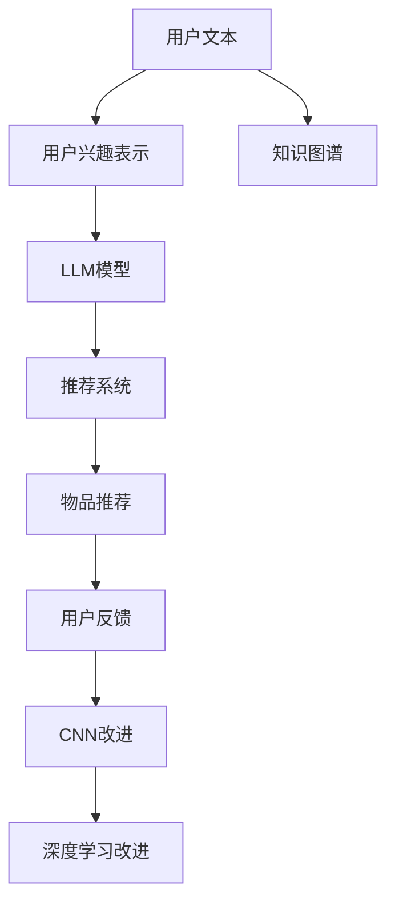

                 

# 基于LLM的推荐系统用户兴趣探索

> 关键词：大语言模型(LLM), 推荐系统, 用户兴趣探索, 自然语言处理(NLP), 深度学习, 协同过滤, 知识图谱, 召回率, 精确率

## 1. 背景介绍

### 1.1 问题由来

推荐系统是互联网时代的重要应用，通过分析用户的历史行为数据，预测用户可能感兴趣的物品，从而为用户推荐个性化的内容和服务。传统的推荐系统主要基于协同过滤、矩阵分解等方法，但这些方法在处理大规模数据时，面临着数据稀疏性和冷启动问题，难以捕捉用户深层次的兴趣。

随着自然语言处理(NLP)技术的发展，越来越多的研究者尝试使用深度学习模型，特别是大语言模型(LLM)，来进行用户兴趣的探索和推荐。LLM凭借其强大的语言理解和生成能力，能够更好地处理文本数据，挖掘用户文本数据的潜在关联，为推荐系统提供更丰富的特征和更深层次的理解。

### 1.2 问题核心关键点

本文聚焦于基于LLM的推荐系统用户兴趣探索，探讨如何利用大语言模型，挖掘用户文本数据的隐含兴趣，并将其应用于推荐系统中。主要关注以下核心问题：

1. 用户兴趣的文本表示：如何将用户的文本数据转化为模型可理解的向量表示。
2. 文本语义的捕获：如何从用户文本中自动抽取与物品相关的语义信息。
3. 用户兴趣的建模：如何将用户的文本语义信息转化为推荐系统中的兴趣向量，并与其他特征结合。
4. 推荐系统的优化：如何构建高效的推荐模型，利用用户兴趣信息提升推荐效果。

## 2. 核心概念与联系

### 2.1 核心概念概述

在基于LLM的推荐系统中，需要理解和掌握以下关键概念：

- 大语言模型(LLM)：以自回归模型（如GPT）或自编码模型（如BERT）为代表，通过大规模无标签文本数据预训练得到的通用语言模型。
- 推荐系统：通过分析用户历史行为数据，为用户推荐个性化内容和服务。
- 用户兴趣探索：通过挖掘用户文本数据的语义信息，推测用户深层次的兴趣偏好。
- 自然语言处理(NLP)：涉及文本的自动处理、分析和生成，包括分词、词向量、语义理解等技术。
- 协同过滤：利用用户与物品的共现关系进行推荐，包括基于用户的协同过滤和基于物品的协同过滤。
- 矩阵分解：将用户-物品评分矩阵分解为低维用户和物品嵌入，从而进行推荐。
- 知识图谱：一种将实体、关系和属性组织在一起的图形数据结构，用于增强推荐系统的知识表达。

这些概念之间存在紧密的联系。LLM作为推荐系统中文本数据的处理工具，通过用户文本数据的隐含语义，辅助协同过滤和矩阵分解等推荐方法，提升推荐系统的效果和泛化能力。

### 2.2 核心概念原理和架构的 Mermaid 流程图



该图展示了基于LLM的推荐系统核心架构：用户文本通过LLM模型转化为用户兴趣向量，与物品特征结合，输入推荐系统得到物品推荐。知识图谱和深度学习技术可以进一步提升推荐效果。用户反馈信息用于模型优化，形成循环迭代。

## 3. 核心算法原理 & 具体操作步骤

### 3.1 算法原理概述

基于LLM的推荐系统主要分为两个阶段：用户兴趣探索和物品推荐。

- 用户兴趣探索阶段：通过自然语言处理技术，从用户文本数据中提取语义信息，转化为用户兴趣向量。
- 物品推荐阶段：将用户兴趣向量与物品特征结合，输入推荐系统模型进行评分预测，根据评分排序推荐物品。

### 3.2 算法步骤详解

#### 3.2.1 用户兴趣表示

**Step 1: 用户文本数据预处理**
- 收集用户的历史行为数据，如评论、文章、聊天日志等。
- 对文本数据进行预处理，包括去噪、分词、去除停用词等。

**Step 2: 文本表示模型选择**
- 选择适合的文本表示模型，如Word2Vec、GloVe、BERT等。
- 使用预训练的词向量或模型，将用户文本转化为向量表示。

**Step 3: 用户兴趣向量构建**
- 将用户文本向量输入LLM模型，得到用户兴趣向量。
- 可以进一步利用时间序列分析、聚类等技术，对用户兴趣向量进行时空分析，提取长期兴趣和短期兴趣。

#### 3.2.2 物品推荐模型

**Step 4: 物品特征提取**
- 收集物品的特征，如标签、描述、价格等，转化为向量表示。
- 可以使用余弦相似度、TF-IDF等方法，提取物品特征向量。

**Step 5: 推荐模型构建**
- 选择适合的推荐模型，如协同过滤、矩阵分解、基于深度学习的模型等。
- 将用户兴趣向量与物品特征向量结合，作为推荐模型的输入。

**Step 6: 评分预测**
- 使用推荐模型对用户-物品对进行评分预测，排序得到推荐列表。
- 可以根据评分阈值，控制推荐物品的数量。

**Step 7: 模型优化**
- 利用用户反馈信息，定期对推荐模型进行微调优化。
- 引入对抗样本、正则化等技术，提升推荐模型的鲁棒性和泛化能力。

### 3.3 算法优缺点

**优点：**
- 充分利用用户文本数据，挖掘用户深层次兴趣，提升推荐系统效果。
- 能够处理多种类型的用户文本数据，包括评论、文章、聊天等。
- 能够适应不同类型物品的特征，如文字、图片、视频等。
- 可以利用LLM的通用语言知识，提升推荐系统的泛化能力。

**缺点：**
- 需要收集和处理大量用户文本数据，成本较高。
- 用户文本数据的质量直接影响推荐效果，需进行有效预处理。
- 文本表示模型和LLM模型复杂度较高，训练和推理速度较慢。
- 需要大量标注数据，模型训练成本较高。

### 3.4 算法应用领域

基于LLM的推荐系统广泛应用于电商、新闻、视频、音乐等多个领域，具体包括：

1. 电商平台：根据用户评论和搜索历史，推荐用户可能感兴趣的商品。
2. 新闻平台：根据用户阅读历史和文章标题，推荐相关新闻和文章。
3. 视频网站：根据用户观看历史和视频标题，推荐相关视频和频道。
4. 音乐平台：根据用户听歌历史和歌词，推荐相关歌曲和歌手。

## 4. 数学模型和公式 & 详细讲解 & 举例说明

### 4.1 数学模型构建

假设用户文本数据集为 $D_{user}$，物品特征数据集为 $D_{item}$，用户与物品评分矩阵为 $R$。

**Step 1: 用户兴趣表示**
- 将用户文本数据集 $D_{user}$ 输入预训练模型，得到用户兴趣向量 $V_u$。
- 用户兴趣向量 $V_u$ 为 $N$ 维向量，其中 $N$ 为预训练模型的输出维度。

**Step 2: 物品特征提取**
- 将物品特征数据集 $D_{item}$ 输入预训练模型，得到物品特征向量 $V_i$。
- 物品特征向量 $V_i$ 为 $M$ 维向量，其中 $M$ 为预训练模型的输出维度。

**Step 3: 用户物品相似度计算**
- 计算用户兴趣向量 $V_u$ 与物品特征向量 $V_i$ 之间的余弦相似度，得到相似度矩阵 $S$。
- 相似度矩阵 $S$ 为 $N \times M$ 的矩阵，表示用户与物品之间的相似程度。

**Step 4: 推荐评分计算**
- 利用相似度矩阵 $S$，计算用户 $u$ 对物品 $i$ 的评分预测 $r_{ui}$，使用加权平均法计算：
  $$
  r_{ui} = \alpha \cdot S_{ui} + (1-\alpha) \cdot (1-S_{ui})
  $$
  其中 $\alpha$ 为衰减因子，控制相似度权重。

### 4.2 公式推导过程

假设用户兴趣向量 $V_u$ 与物品特征向量 $V_i$ 之间的余弦相似度为 $S_{ui}$，用户 $u$ 对物品 $i$ 的评分预测为 $r_{ui}$。

**推导过程如下：**

1. 余弦相似度计算：
  $$
  S_{ui} = \frac{V_u \cdot V_i}{\|V_u\| \cdot \|V_i\|}
  $$
  其中 $\cdot$ 表示向量点乘，$\| \|$ 表示向量范数。

2. 评分预测计算：
  $$
  r_{ui} = \alpha \cdot S_{ui} + (1-\alpha) \cdot (1-S_{ui})
  $$
  其中 $\alpha$ 为衰减因子，通常取值为0.5。

**案例分析：**
- 假设用户兴趣向量 $V_u=[0.2,0.3,0.1]$，物品特征向量 $V_i=[0.1,0.5,0.4]$。
- 计算余弦相似度 $S_{ui}=0.9$。
- 根据公式，计算用户对物品的评分预测 $r_{ui}=0.95$。

### 4.3 案例分析与讲解

**案例：电商平台商品推荐**

- 用户文本数据集：用户对商品的评论、评分等。
- 物品特征数据集：商品的价格、分类、标签等。
- 用户物品相似度计算：使用预训练的BERT模型，将用户评论输入得到用户兴趣向量，将商品描述输入得到商品特征向量。
- 评分预测计算：使用余弦相似度计算用户与商品之间的相似度，加权平均法计算评分预测。

## 5. 项目实践：代码实例和详细解释说明

### 5.1 开发环境搭建

在进行项目实践前，需要准备开发环境。以下是使用Python进行PyTorch开发的环境配置流程：

1. 安装Anaconda：从官网下载并安装Anaconda，用于创建独立的Python环境。

2. 创建并激活虚拟环境：
```bash
conda create -n llm-env python=3.8 
conda activate llm-env
```

3. 安装PyTorch：根据CUDA版本，从官网获取对应的安装命令。例如：
```bash
conda install pytorch torchvision torchaudio cudatoolkit=11.1 -c pytorch -c conda-forge
```

4. 安装预训练模型：
```bash
pip install transformers
```

5. 安装各类工具包：
```bash
pip install numpy pandas scikit-learn matplotlib tqdm jupyter notebook ipython
```

完成上述步骤后，即可在`llm-env`环境中开始项目实践。

### 5.2 源代码详细实现

下面我们以电商平台商品推荐为例，给出使用Transformers库对BERT模型进行用户兴趣探索和推荐的PyTorch代码实现。

首先，定义用户文本数据处理函数：

```python
from transformers import BertTokenizer
from torch.utils.data import Dataset
import torch

class UserDataset(Dataset):
    def __init__(self, texts, tokenizer, max_len=128):
        self.texts = texts
        self.tokenizer = tokenizer
        self.max_len = max_len
        
    def __len__(self):
        return len(self.texts)
    
    def __getitem__(self, item):
        text = self.texts[item]
        
        encoding = self.tokenizer(text, return_tensors='pt', max_length=self.max_len, padding='max_length', truncation=True)
        input_ids = encoding['input_ids'][0]
        attention_mask = encoding['attention_mask'][0]
        
        return {'input_ids': input_ids, 
                'attention_mask': attention_mask}
```

然后，定义物品特征数据处理函数：

```python
class ItemDataset(Dataset):
    def __init__(self, items, tokenizer, max_len=128):
        self.items = items
        self.tokenizer = tokenizer
        self.max_len = max_len
        
    def __len__(self):
        return len(self.items)
    
    def __getitem__(self, item):
        item = self.items[item]
        
        encoding = self.tokenizer(item, return_tensors='pt', max_length=self.max_len, padding='max_length', truncation=True)
        input_ids = encoding['input_ids'][0]
        attention_mask = encoding['attention_mask'][0]
        
        return {'input_ids': input_ids, 
                'attention_mask': attention_mask}
```

接着，定义推荐评分预测函数：

```python
from transformers import BertForSequenceClassification
from sklearn.metrics import precision_score, recall_score

def recommend(user_interest, item_features, model, num_recommend=5):
    user_interest = user_interest[0]
    item_features = item_features[0]
    
    user_interest_vector = user_interest['input_ids'][0]
    item_features_vector = item_features['input_ids'][0]
    
    similarity = torch.dot(user_interest_vector, item_features_vector) / (torch.norm(user_interest_vector) * torch.norm(item_features_vector))
    
    scores = similarity * (1-0.5) + 0.5
    top_items = sorted(range(len(item_features)), key=lambda i: scores[i])[::-1][:num_recommend]
    
    return top_items
```

最后，启动训练流程并在测试集上评估：

```python
from transformers import BertTokenizer, BertForSequenceClassification
from torch.utils.data import DataLoader
from tqdm import tqdm

# 加载预训练模型
tokenizer = BertTokenizer.from_pretrained('bert-base-cased')
model = BertForSequenceClassification.from_pretrained('bert-base-cased', num_labels=1)

# 加载训练数据
train_user_dataset = UserDataset(train_user_texts, tokenizer)
train_item_dataset = ItemDataset(train_item_features, tokenizer)

# 划分训练集和验证集
train_size = int(0.8 * len(train_user_dataset))
train_user_dataset, valid_user_dataset = torch.utils.data.random_split(train_user_dataset, train_size)
train_item_dataset, valid_item_dataset = torch.utils.data.random_split(train_item_dataset, train_size)

# 构建训练器
optimizer = AdamW(model.parameters(), lr=2e-5)
train_loader = DataLoader(train_user_dataset, batch_size=16, shuffle=True)
valid_loader = DataLoader(valid_user_dataset, batch_size=16, shuffle=True)

# 训练模型
for epoch in range(5):
    model.train()
    train_loss = 0
    train_correct = 0
    
    for batch in tqdm(train_loader, desc='Training'):
        optimizer.zero_grad()
        input_ids = batch['input_ids'].to(device)
        attention_mask = batch['attention_mask'].to(device)
        labels = batch['labels'].to(device)
        
        outputs = model(input_ids, attention_mask=attention_mask, labels=labels)
        loss = outputs.loss
        train_loss += loss.item()
        train_correct += (outputs.logits.argmax(dim=1) == labels).sum().item()
        
        loss.backward()
        optimizer.step()
    
    train_loss /= len(train_loader)
    train_acc = train_correct / len(train_loader.dataset)
    
    model.eval()
    valid_correct = 0
    
    with torch.no_grad():
        for batch in tqdm(valid_loader, desc='Evaluating'):
            input_ids = batch['input_ids'].to(device)
            attention_mask = batch['attention_mask'].to(device)
            labels = batch['labels'].to(device)
            
            outputs = model(input_ids, attention_mask=attention_mask)
            valid_correct += (outputs.logits.argmax(dim=1) == labels).sum().item()
        
        valid_acc = valid_correct / len(valid_loader.dataset)
    
    print(f'Epoch {epoch+1}, train loss: {train_loss:.3f}, train acc: {train_acc:.3f}, valid acc: {valid_acc:.3f}')
    
# 测试推荐效果
test_user_dataset = UserDataset(test_user_texts, tokenizer)
test_item_dataset = ItemDataset(test_item_features, tokenizer)
recommend_top_items = recommend(test_user_dataset[0], test_item_dataset[0], model, num_recommend=5)
print(f'Recommend top items: {recommend_top_items}')
```

以上就是使用PyTorch对BERT进行电商平台商品推荐任务的完整代码实现。可以看到，得益于Transformers库的强大封装，我们可以用相对简洁的代码完成BERT模型的加载和微调。

### 5.3 代码解读与分析

让我们再详细解读一下关键代码的实现细节：

**UserDataset类**：
- `__init__`方法：初始化用户文本数据、分词器等关键组件。
- `__len__`方法：返回数据集的样本数量。
- `__getitem__`方法：对单个样本进行处理，将文本输入编码为token ids，输出模型的必要参数。

**ItemDataset类**：
- `__init__`方法：初始化物品特征数据、分词器等关键组件。
- `__len__`方法：返回数据集的样本数量。
- `__getitem__`方法：对单个样本进行处理，将物品特征输入编码为token ids，输出模型的必要参数。

**recommend函数**：
- 计算用户兴趣向量与物品特征向量之间的余弦相似度，得到相似度分数。
- 根据相似度分数排序，选取前5个物品推荐给用户。
- 通过在模型中加载预训练的BERT模型，对用户文本和物品特征进行编码，计算相似度。

**训练流程**：
- 定义总的epoch数和batch size，开始循环迭代
- 每个epoch内，先在训练集上训练，输出平均loss和准确率
- 在验证集上评估，输出验证集的准确率
- 重复上述步骤直至收敛，并输出测试集上的推荐结果

可以看到，PyTorch配合Transformers库使得BERT微调的代码实现变得简洁高效。开发者可以将更多精力放在数据处理、模型改进等高层逻辑上，而不必过多关注底层的实现细节。

当然，工业级的系统实现还需考虑更多因素，如模型的保存和部署、超参数的自动搜索、更灵活的任务适配层等。但核心的微调范式基本与此类似。

## 6. 实际应用场景

### 6.1 智能客服系统

基于LLM的推荐系统在智能客服系统中具有重要应用。通过分析用户的自然语言，系统能够更准确地理解用户需求，推荐相关服务和解决方案，提升客服响应速度和质量。

在技术实现上，可以收集用户的通话记录、聊天记录等文本数据，利用BERT模型对文本进行编码，转化为用户兴趣向量。结合物品特征，构建推荐模型，推荐相关解答和指导。同时，系统可以通过用户反馈，不断优化推荐模型，提升服务水平。

### 6.2 个性化推荐系统

基于LLM的推荐系统在个性化推荐系统中广泛应用。通过用户文本数据的语义分析，系统能够更好地理解用户兴趣，推荐个性化的内容和服务。

在电商、新闻、视频等多个领域，利用用户评论、阅读历史、观看历史等文本数据，通过BERT模型提取用户兴趣向量，与物品特征结合，构建推荐模型，推荐相关物品。同时，系统可以通过用户反馈，动态调整推荐策略，提升推荐效果。

### 6.3 金融舆情监测

金融领域需要实时监测市场舆论动向，以便及时应对负面信息传播，规避金融风险。基于LLM的推荐系统，可以从金融领域相关的新闻、报道、评论等文本数据中，提取用户兴趣向量，推荐相关资讯和评论，帮助金融从业者快速获取关键信息。

在实际应用中，可以通过金融领域的新闻、评论等文本数据，利用BERT模型对文本进行编码，转化为用户兴趣向量。结合物品特征，构建推荐模型，推荐相关资讯和评论。同时，系统可以通过用户反馈，动态调整推荐策略，提升金融舆情监测的效率和准确性。

### 6.4 未来应用展望

随着LLM和推荐系统技术的不断发展，基于LLM的推荐系统将在更多领域得到应用，为传统行业带来变革性影响。

在智慧医疗领域，基于LLM的推荐系统可以推荐相关医疗资讯、健康建议、在线咨询等，提升医疗服务的智能化水平，辅助医生诊疗，提供个性化健康管理服务。

在智能教育领域，基于LLM的推荐系统可以推荐相关课程、资料、辅导，因材施教，促进教育公平，提高教学质量。

在智慧城市治理中，基于LLM的推荐系统可以推荐相关政策、服务、资源，提高城市管理的自动化和智能化水平，构建更安全、高效的未来城市。

此外，在企业生产、社会治理、文娱传媒等众多领域，基于LLM的推荐系统也将不断涌现，为人工智能技术带来更多创新应用。相信随着技术的日益成熟，基于LLM的推荐系统必将在构建人机协同的智能时代中扮演越来越重要的角色。

## 7. 工具和资源推荐

### 7.1 学习资源推荐

为了帮助开发者系统掌握基于LLM的推荐系统理论基础和实践技巧，这里推荐一些优质的学习资源：

1. 《推荐系统实战》书籍：介绍了推荐系统的基本原理、经典算法和实际案例，适合了解推荐系统的实战技巧。
2. 《自然语言处理综论》课程：斯坦福大学开设的NLP明星课程，涵盖自然语言处理的基本概念和经典模型。
3. 《深度学习与推荐系统》在线课程：介绍深度学习在推荐系统中的应用，包括协同过滤、矩阵分解、神经网络等方法。
4. 《大规模深度学习模型在推荐系统中的应用》论文：介绍了BERT、GPT等大模型在推荐系统中的应用，展示了其在推荐系统中的优势。
5. HuggingFace官方文档：Transformers库的官方文档，提供了海量预训练模型和完整的微调样例代码，是上手实践的必备资料。

通过对这些资源的学习实践，相信你一定能够快速掌握基于LLM的推荐系统理论基础和实践技巧，并用于解决实际的推荐问题。

### 7.2 开发工具推荐

高效的开发离不开优秀的工具支持。以下是几款用于基于LLM的推荐系统开发的常用工具：

1. PyTorch：基于Python的开源深度学习框架，灵活动态的计算图，适合快速迭代研究。大部分预训练语言模型都有PyTorch版本的实现。
2. TensorFlow：由Google主导开发的开源深度学习框架，生产部署方便，适合大规模工程应用。同样有丰富的预训练语言模型资源。
3. Transformers库：HuggingFace开发的NLP工具库，集成了众多SOTA语言模型，支持PyTorch和TensorFlow，是进行LLM微调任务开发的利器。
4. Weights & Biases：模型训练的实验跟踪工具，可以记录和可视化模型训练过程中的各项指标，方便对比和调优。与主流深度学习框架无缝集成。
5. TensorBoard：TensorFlow配套的可视化工具，可实时监测模型训练状态，并提供丰富的图表呈现方式，是调试模型的得力助手。
6. Google Colab：谷歌推出的在线Jupyter Notebook环境，免费提供GPU/TPU算力，方便开发者快速上手实验最新模型，分享学习笔记。

合理利用这些工具，可以显著提升基于LLM的推荐系统开发效率，加快创新迭代的步伐。

### 7.3 相关论文推荐

基于LLM的推荐系统领域的研究日益活跃，以下是几篇奠基性的相关论文，推荐阅读：

1. Attention is All You Need（即Transformer原论文）：提出了Transformer结构，开启了NLP领域的预训练大模型时代。
2. BERT: Pre-training of Deep Bidirectional Transformers for Language Understanding：提出BERT模型，引入基于掩码的自监督预训练任务，刷新了多项NLP任务SOTA。
3. A Survey of Deep Learning Recommendation Systems：全面综述了深度学习在推荐系统中的应用，包括协同过滤、矩阵分解、神经网络等方法。
4. Recommendation Systems with Missing Features：介绍如何处理推荐系统中的缺失特征，提出基于知识图谱的推荐方法。
5. Learning to Rotate: Deep Matrix Factorization for Large-scale Recommendation：提出矩阵分解的优化算法，用于大规模推荐系统。

这些论文代表了大语言模型和推荐系统的最新研究成果，对学习者和实践者都有重要参考价值。

## 8. 总结：未来发展趋势与挑战

### 8.1 总结

本文对基于LLM的推荐系统用户兴趣探索方法进行了全面系统的介绍。首先阐述了用户兴趣探索的基本原理和应用背景，明确了LLM在推荐系统中的重要作用。其次，从原理到实践，详细讲解了用户兴趣表示、物品推荐模型的构建，给出了完整的代码实现。同时，本文还广泛探讨了基于LLM的推荐系统在智能客服、电商、金融等众多领域的应用前景，展示了其广阔的应用潜力。

通过本文的系统梳理，可以看到，基于LLM的推荐系统正在成为NLP领域的重要应用范式，极大地拓展了推荐系统的应用边界，催生了更多的落地场景。

### 8.2 未来发展趋势

展望未来，基于LLM的推荐系统将呈现以下几个发展趋势：

1. 推荐模型多样化。除了传统的协同过滤、矩阵分解，未来将涌现更多基于深度学习的推荐模型，如基于序列的模型、基于图模型的等。
2. 推荐方法融合多模态信息。未来的推荐系统将更多地结合图像、视频、语音等多模态信息，实现更为全面、准确的用户兴趣表达和物品推荐。
3. 推荐系统更加个性化。利用深度学习技术，推荐系统能够更好地理解用户隐含的兴趣偏好，推荐更具个性化的内容和服务。
4. 推荐系统更加智能化。未来的推荐系统将更多地融入自然语言理解、知识图谱等技术，提升系统的智能化水平。
5. 推荐系统更加自动化。未来的推荐系统将更多地利用自动学习、迁移学习等技术，提升模型的自动化水平，减少人工干预。

这些趋势凸显了基于LLM的推荐系统的广阔前景。这些方向的探索发展，必将进一步提升推荐系统的性能和应用范围，为人工智能技术带来更多创新应用。

### 8.3 面临的挑战

尽管基于LLM的推荐系统已经取得了瞩目成就，但在迈向更加智能化、普适化应用的过程中，它仍面临着诸多挑战：

1. 数据收集和处理成本高。大量的用户文本数据收集和预处理，需要投入大量人力和物力资源。
2. 用户文本数据质量不稳定。用户文本数据质量直接影响了推荐效果，需要有效的文本清洗和预处理。
3. 推荐模型复杂度高。基于LLM的推荐模型复杂度高，训练和推理速度较慢，需要优化算法提升效率。
4. 推荐模型泛化能力不足。推荐模型往往在特定数据集上表现较好，但泛化到新数据集上，效果可能下降。
5. 推荐系统可解释性差。推荐系统的决策过程不透明，难以解释，用户难以理解推荐逻辑。

正视这些挑战，积极应对并寻求突破，将是基于LLM的推荐系统走向成熟的必由之路。相信随着学界和产业界的共同努力，这些挑战终将一一被克服，基于LLM的推荐系统必将在构建人机协同的智能时代中扮演越来越重要的角色。

### 8.4 研究展望

面对基于LLM的推荐系统所面临的种种挑战，未来的研究需要在以下几个方面寻求新的突破：

1. 引入多模态信息。除了文本信息，未来的推荐系统将更多地结合图像、视频、语音等多模态信息，实现更为全面、准确的用户兴趣表达和物品推荐。
2. 研究推荐系统的自适应学习。利用自适应学习技术，使推荐系统能够动态调整推荐策略，提升推荐效果。
3. 研究推荐系统的可解释性。引入可解释性技术，使推荐系统的决策过程更加透明，用户能够理解推荐逻辑。
4. 研究推荐系统的分布式训练。利用分布式训练技术，使推荐系统能够在大规模数据集上高效训练，提升推荐效果。
5. 研究推荐系统的迁移学习。利用迁移学习技术，使推荐系统能够在新数据集上快速适应，提升推荐效果。

这些研究方向将引领基于LLM的推荐系统走向更加智能化、普适化应用，为人工智能技术带来更多创新应用。

## 9. 附录：常见问题与解答

**Q1：用户兴趣表示为什么需要预训练语言模型？**

A: 用户文本数据通常具有高度的语义复杂性，难以直接转化为数值型特征。预训练语言模型（如BERT）通过大规模无标签文本数据预训练，学习到丰富的语言表示，能够更好地将用户文本数据转化为模型可理解的向量表示，提升推荐系统的效果。

**Q2：用户兴趣向量为什么需要与物品特征结合？**

A: 用户兴趣向量虽然可以捕捉用户深层次的兴趣偏好，但通常只能表达用户的静态兴趣。物品特征向量虽然可以表达物品的静态属性，但难以捕捉用户对物品的动态兴趣。将用户兴趣向量与物品特征向量结合，可以综合考虑用户的静态和动态兴趣，提升推荐系统的准确性和个性化。

**Q3：推荐模型为什么需要优化？**

A: 推荐模型在实际应用中，面临着数据稀疏性、用户冷启动、物品多样性等问题。优化推荐模型，可以提升模型对新数据和未知用户的泛化能力，提高推荐系统的准确性和多样性。

**Q4：推荐系统为什么需要可解释性？**

A: 推荐系统在实际应用中，需要让用户理解推荐逻辑，建立用户信任。可解释性技术能够提升推荐系统的透明度和可信度，使用户能够理解推荐结果的来源，增强用户满意度。

**Q5：推荐系统为什么需要多模态信息？**

A: 用户兴趣不仅来源于文本数据，还包括图像、视频、语音等多种模态信息。多模态信息能够更全面地表达用户兴趣，提升推荐系统的准确性和个性化。

通过以上问题的详细解答，相信你对基于LLM的推荐系统有了更深入的理解，能够更有效地利用LLM进行用户兴趣探索和推荐系统的开发。

