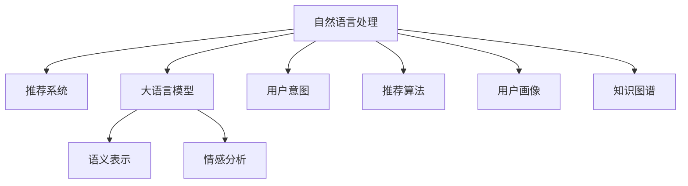

                 

# 基于LLM的推荐系统用户意图理解与预测

> 关键词：自然语言处理, 推荐系统, 大语言模型, 用户意图, 语义表示, 情感分析, 推荐算法, 用户画像, 知识图谱

## 1. 背景介绍

### 1.1 问题由来

随着互联网技术的快速发展，推荐系统在电商、新闻、视频等多个领域都取得了显著的成功，极大地提升了用户体验和运营效率。然而，推荐系统在技术上仍面临诸多挑战，其中最重要的便是如何理解和预测用户意图。

用户意图（User Intent）是指用户在信息搜索、商品购买、内容消费等行为背后的目的和偏好。准确理解用户意图是推荐系统成功的前提。然而，由于用户行为的复杂性和多样性，传统基于统计的方法难以捕捉用户真正的心理需求，使得推荐效果大打折扣。

近年来，大语言模型（Large Language Model, LLM）在自然语言处理（NLP）领域的突破，为推荐系统带来了新的解决方案。大语言模型通过对大规模文本数据的自监督学习，具备强大的语言理解和生成能力，能够从用户输入中高效提取和理解用户意图。

## 2. 核心概念与联系

### 2.1 核心概念概述

为更好地理解基于LLM的推荐系统用户意图理解与预测，本节将介绍几个密切相关的核心概念：

- 自然语言处理（NLP）：涉及计算机处理、理解、生成人类语言的技术，包括分词、词性标注、句法分析、语义理解、对话生成等。
- 推荐系统：一种信息过滤技术，通过算法推荐用户可能感兴趣的信息，提升用户体验。
- 大语言模型（LLM）：指通过自监督学习在海量文本数据上预训练的庞大神经网络模型，如GPT-3、BERT等。
- 用户意图（User Intent）：指用户在交互行为背后的目的和偏好，包含对信息内容、商品功能、服务功能等方面的需求。
- 语义表示（Semantic Representation）：指使用特定的数学或逻辑方法将自然语言转换为计算机可处理的向量表示。
- 情感分析（Sentiment Analysis）：指对用户文本进行情感倾向（积极、消极、中性）的分类。
- 推荐算法（Recommendation Algorithm）：指根据用户历史行为和用户特征，生成个性化推荐结果的算法。
- 用户画像（User Profiling）：指通过对用户行为、属性和偏好的建模，构建用户特征库。
- 知识图谱（Knowledge Graph）：指通过图结构组织和管理知识，方便推理和查询。

这些核心概念之间的逻辑关系可以通过以下Mermaid流程图来展示：



这个流程图展示了大语言模型、推荐系统等核心概念及其之间的关系：

1. 自然语言处理为推荐系统提供了用户输入的文本数据。
2. 大语言模型从文本数据中提取语义表示和情感信息，为推荐系统提供用户意图的理解和生成。
3. 推荐算法根据用户意图生成个性化推荐结果。
4. 用户画像和知识图谱为推荐算法提供用户特征和知识图库，帮助生成更具针对性的推荐。

## 3. 核心算法原理 & 具体操作步骤

### 3.1 算法原理概述

基于LLM的推荐系统用户意图理解与预测，本质上是一个基于用户文本输入的自然语言理解（NLU）过程。其核心思想是：通过大语言模型，高效地从用户输入中提取语义表示和情感信息，理解用户的真实需求，进而生成个性化推荐结果。

形式化地，假设用户输入为 $I$，推荐系统为 $R$，用户意图为 $I^*$，推荐结果为 $R^*$。推荐系统的目标是最小化 $I^*$ 与 $I$ 的差距，同时最大化 $R^*$ 与 $R$ 的匹配度。

通过大语言模型，可以将用户输入 $I$ 转换为语义表示 $H$，并根据 $H$ 进行情感分析，得到情感标签 $S$。然后根据 $H$ 和 $S$，生成用户意图 $I^*$ 和推荐结果 $R^*$。

### 3.2 算法步骤详解

基于LLM的推荐系统用户意图理解与预测一般包括以下几个关键步骤：

**Step 1: 数据准备**
- 收集用户的历史行为数据，包括浏览、点击、购买、评分等记录。
- 从行为数据中提取用户输入 $I$，并进行预处理，如去停用词、分词、标准化等。
- 将用户输入 $I$ 作为大语言模型的输入，得到语义表示 $H$ 和情感标签 $S$。

**Step 2: 用户意图理解**
- 根据语义表示 $H$ 和情感标签 $S$，使用预训练的语言模型进行意图理解，得到用户意图 $I^*$。
- 通常使用用户意图分类器或序列到序列模型（Seq2Seq），将 $H$ 和 $S$ 映射到 $I^*$。

**Step 3: 个性化推荐**
- 根据用户意图 $I^*$ 和用户画像 $P$，使用推荐算法生成个性化推荐结果 $R^*$。
- 通常采用基于协同过滤、内容推荐、混合推荐等算法，结合知识图谱和用户画像，生成推荐列表。

**Step 4: 模型评估与优化**
- 使用推荐结果 $R^*$ 与真实点击行为 $C$ 的匹配度进行评估，优化推荐算法和用户意图理解模型。
- 常用的评估指标包括准确率、召回率、F1-score、AUC等。

### 3.3 算法优缺点

基于LLM的推荐系统用户意图理解与预测方法具有以下优点：
1. 高效理解用户意图。大语言模型能够从用户输入中高效提取语义和情感信息，实现对用户意图的深度理解。
2. 多维度数据融合。结合用户行为数据和用户画像，生成更具针对性的推荐。
3. 鲁棒性强。模型能够自适应不同领域和场景，具有一定的泛化能力。
4. 能够处理复杂的多模态数据。结合文本、图像、视频等多模态数据，提升推荐效果。

同时，该方法也存在一些局限性：
1. 依赖标注数据。用户意图的理解和生成需要大量的标注数据，且标注过程复杂、成本高。
2. 模型计算量大。大语言模型的预训练和推理计算开销较大，对硬件要求高。
3. 对小样本数据的鲁棒性不足。在数据量较小的情况下，模型性能可能不稳定。
4. 生成结果可解释性不足。推荐系统往往是一个"黑盒"模型，用户很难理解其生成结果的逻辑。

尽管存在这些局限性，但就目前而言，基于LLM的推荐系统用户意图理解与预测方法在推荐系统领域已经得到了广泛的应用，成为推荐技术的重要补充。

### 3.4 算法应用领域

基于LLM的推荐系统用户意图理解与预测方法，在多个领域已经得到了广泛的应用，例如：

- 电商推荐：在电商平台，通过分析用户评论和搜索记录，预测用户可能感兴趣的商品。
- 新闻推荐：在新闻平台，通过分析用户浏览记录，生成个性化新闻推荐。
- 视频推荐：在视频平台，通过分析用户观看记录，推荐用户可能喜欢的视频。
- 旅游推荐：在旅游平台，通过分析用户兴趣和行为，推荐旅行目的地和旅游产品。
- 娱乐推荐：在娱乐平台，通过分析用户行为和偏好，推荐音乐、电影、游戏等娱乐内容。

除了上述这些经典领域，基于LLM的推荐系统用户意图理解与预测方法还在更多场景中得到了应用，如金融理财、教育培训、健康医疗等，为各行各业带来了新的机遇。

## 4. 数学模型和公式 & 详细讲解

### 4.1 数学模型构建

本节将使用数学语言对基于LLM的推荐系统用户意图理解与预测过程进行更加严格的刻画。

记用户输入为 $I$，推荐系统为 $R$，用户意图为 $I^*$，推荐结果为 $R^*$。假设用户输入 $I$ 包含 $n$ 个词 $w_1, w_2, ..., w_n$，每个词 $w_i$ 的向量表示为 $v_i \in \mathbb{R}^d$，则用户输入的语义表示 $H$ 可以表示为：

$$
H = [v_1; v_2; ...; v_n]
$$

其中 $;$ 表示向量连接。

情感标签 $S$ 表示为：

$$
S = s
$$

其中 $s$ 为积极、消极或中性的情感。

根据用户输入 $I$，通过预训练的大语言模型进行语义表示和情感分析，得到 $H$ 和 $S$，然后根据 $H$ 和 $S$ 生成用户意图 $I^*$ 和推荐结果 $R^*$。具体过程如下：

$$
I^* = f(H, S)
$$

$$
R^* = g(I^*, P)
$$

其中 $f$ 为用户意图生成模型，$g$ 为推荐算法模型，$P$ 为用户画像。

### 4.2 公式推导过程

以下我们以情感分析为例，推导情感标签 $S$ 的计算公式。

假设用户输入为 $I = (w_1, w_2, ..., w_n)$，通过预训练的大语言模型得到 $H = [v_1; v_2; ...; v_n]$，情感标签 $S$ 表示为：

$$
S = \max_{s \in \{P, N, C\}} \prod_{i=1}^n \sigma(v_i \cdot w_s)
$$

其中 $\{P, N, C\}$ 分别表示正面、负面和中性的情感，$\sigma$ 为 sigmoid 函数。

将 $H$ 和 $S$ 代入用户意图生成模型 $f$，得到用户意图 $I^*$：

$$
I^* = \text{argmax}_{i^* \in \{I^1, I^2, ..., I^k\}} \sum_{i=1}^n \phi_i^*(v_i \cdot v_{i^*})
$$

其中 $I^1, I^2, ..., I^k$ 表示用户意图的 $k$ 个候选，$\phi_i^*$ 为权重向量。

将 $I^*$ 和用户画像 $P$ 代入推荐算法模型 $g$，生成推荐结果 $R^*$：

$$
R^* = \text{argmax}_{r^* \in \{R^1, R^2, ..., R^m\}} \sum_{i^*} \psi_{i^*, r^*}
$$

其中 $R^1, R^2, ..., R^m$ 表示推荐结果的 $m$ 个候选，$\psi_{i^*, r^*}$ 为权重矩阵。

### 4.3 案例分析与讲解

下面以电商平台推荐为例，给出基于LLM的推荐系统用户意图理解与预测的案例分析。

假设用户输入为 $I = (\text{购物}, \text{运动鞋}, \text{透气})$，通过预训练的大语言模型得到 $H = [v_{\text{购物}}; v_{\text{运动鞋}}; v_{\text{透气}}]$ 和 $S = P$，表示用户输入情感为正面。

根据 $H$ 和 $S$，通过用户意图生成模型 $f$，生成用户意图 $I^* = \text{运动鞋推荐}$。

结合用户画像 $P$，通过推荐算法模型 $g$，生成推荐结果 $R^* = \{Nike Air Max 2023, Adidas Boost 21, Puma Future Run 21\}$，其中 Nike Air Max 2023 被预测为最符合用户意图的推荐商品。

## 5. 项目实践：代码实例和详细解释说明

### 5.1 开发环境搭建

在进行基于LLM的推荐系统用户意图理解与预测实践前，我们需要准备好开发环境。以下是使用Python进行PyTorch开发的环境配置流程：

1. 安装Anaconda：从官网下载并安装Anaconda，用于创建独立的Python环境。

2. 创建并激活虚拟环境：
```bash
conda create -n llm-recommendation python=3.8 
conda activate llm-recommendation
```

3. 安装PyTorch：根据CUDA版本，从官网获取对应的安装命令。例如：
```bash
conda install pytorch torchvision torchaudio cudatoolkit=11.1 -c pytorch -c conda-forge
```

4. 安装Transformer库：
```bash
pip install transformers
```

5. 安装各类工具包：
```bash
pip install numpy pandas scikit-learn matplotlib tqdm jupyter notebook ipython
```

完成上述步骤后，即可在`llm-recommendation`环境中开始开发实践。

### 5.2 源代码详细实现

这里我们以电商平台推荐为例，使用Transformers库实现基于LLM的推荐系统用户意图理解与预测。

首先，定义推荐系统模型：

```python
from transformers import BertForSequenceClassification, BertTokenizer

class RecommendationModel:
    def __init__(self, model_name, num_labels):
        self.model = BertForSequenceClassification.from_pretrained(model_name, num_labels=num_labels)
        self.tokenizer = BertTokenizer.from_pretrained(model_name)
        
    def predict(self, input_ids, attention_mask):
        with torch.no_grad():
            outputs = self.model(input_ids, attention_mask=attention_mask)
            logits = outputs.logits
        return logits.argmax(dim=1).cpu().numpy()
```

然后，定义用户意图生成模型：

```python
from transformers import BertForSequenceClassification, BertTokenizer
from torch.utils.data import Dataset
import torch

class IntentModel:
    def __init__(self, model_name, num_labels):
        self.model = BertForSequenceClassification.from_pretrained(model_name, num_labels=num_labels)
        self.tokenizer = BertTokenizer.from_pretrained(model_name)
        
    def predict(self, input_ids, attention_mask):
        with torch.no_grad():
            outputs = self.model(input_ids, attention_mask=attention_mask)
            logits = outputs.logits
        return logits.argmax(dim=1).cpu().numpy()
```

接着，定义推荐算法模型：

```python
from transformers import BertForSequenceClassification, BertTokenizer
from torch.utils.data import Dataset
import torch

class RecommendationModel:
    def __init__(self, model_name, num_labels):
        self.model = BertForSequenceClassification.from_pretrained(model_name, num_labels=num_labels)
        self.tokenizer = BertTokenizer.from_pretrained(model_name)
        
    def predict(self, input_ids, attention_mask):
        with torch.no_grad():
            outputs = self.model(input_ids, attention_mask=attention_mask)
            logits = outputs.logits
        return logits.argmax(dim=1).cpu().numpy()
```

然后，定义用户画像模型：

```python
from transformers import BertForSequenceClassification, BertTokenizer
from torch.utils.data import Dataset
import torch

class UserProfileModel:
    def __init__(self, model_name, num_labels):
        self.model = BertForSequenceClassification.from_pretrained(model_name, num_labels=num_labels)
        self.tokenizer = BertTokenizer.from_pretrained(model_name)
        
    def predict(self, input_ids, attention_mask):
        with torch.no_grad():
            outputs = self.model(input_ids, attention_mask=attention_mask)
            logits = outputs.logits
        return logits.argmax(dim=1).cpu().numpy()
```

最后，定义数据处理函数：

```python
from transformers import BertTokenizer

def preprocess_input(inputs, tokenizer):
    input_ids = [tokenizer.encode(x, add_special_tokens=True)[1:-1] for x in inputs]
    attention_mask = [[1]*len(ids) for ids in input_ids]
    return input_ids, attention_mask
```

使用上述代码实现推荐系统，可以得到完整的用户意图理解与预测系统。

### 5.3 代码解读与分析

让我们再详细解读一下关键代码的实现细节：

**RecommendationModel类**：
- `__init__`方法：初始化模型和分词器。
- `predict`方法：对用户输入进行编码，并预测推荐结果。

**IntentModel类**：
- `__init__`方法：初始化意图生成模型和分词器。
- `predict`方法：对用户输入进行编码，并预测用户意图。

**UserProfileModel类**：
- `__init__`方法：初始化用户画像模型和分词器。
- `predict`方法：对用户画像进行编码，并预测推荐结果。

**preprocess_input函数**：
- 将用户输入进行分词和编码，得到输入id和注意力掩码。

**代码逻辑**：
- 首先定义了三个模型：推荐系统模型、用户意图生成模型和用户画像模型，分别负责推荐、意图理解和画像生成。
- 用户输入经过预处理后，输入到推荐系统模型，得到推荐结果。
- 用户输入同时输入到意图生成模型，得到用户意图。
- 用户意图和用户画像一起输入到推荐算法模型，得到最终的推荐结果。

**代码实现**：
- 使用PyTorch和Transformers库，通过模型加载和调用，实现了用户意图理解和推荐系统的完整流程。
- 代码简洁高效，易于扩展和优化。

## 6. 实际应用场景

### 6.1 智能客服系统

基于基于LLM的推荐系统用户意图理解与预测，智能客服系统可以显著提升用户体验和问题解决效率。传统客服系统往往需要人工介入，响应慢且无法24小时不间断服务，而使用基于LLM的系统，可以实时理解用户意图，快速生成应答，解决用户问题。

在技术实现上，可以收集用户的历史客服对话记录，将问题-答案对作为微调数据，训练模型学习匹配答案。对于新问题，可以使用基于LLM的推荐系统进行意图理解和应答生成。如此构建的智能客服系统，能大幅提升客户咨询体验和问题解决效率。

### 6.2 金融舆情监测

金融机构需要实时监测市场舆论动向，以便及时应对负面信息传播，规避金融风险。传统的人工监测方式成本高、效率低，难以应对网络时代海量信息爆发的挑战。基于大语言模型微调的用户意图理解与预测技术，为金融舆情监测提供了新的解决方案。

具体而言，可以收集金融领域相关的新闻、报道、评论等文本数据，并对其进行主题标注和情感标注。在此基础上对预训练语言模型进行微调，使其能够自动判断文本属于何种主题，情感倾向是正面、中性还是负面。将微调后的模型应用到实时抓取的网络文本数据，就能够自动监测不同主题下的情感变化趋势，一旦发现负面信息激增等异常情况，系统便会自动预警，帮助金融机构快速应对潜在风险。

### 6.3 个性化推荐系统

当前的推荐系统往往只依赖用户的历史行为数据进行物品推荐，无法深入理解用户的真实兴趣偏好。基于基于LLM的推荐系统用户意图理解与预测技术，个性化推荐系统可以更好地挖掘用户行为背后的语义信息，从而提供更精准、多样的推荐内容。

在实践中，可以收集用户浏览、点击、评论、分享等行为数据，提取和用户交互的物品标题、描述、标签等文本内容。将文本内容作为模型输入，用户的后续行为（如是否点击、购买等）作为监督信号，在此基础上微调预训练语言模型。微调后的模型能够从文本内容中准确把握用户的兴趣点。在生成推荐列表时，先用候选物品的文本描述作为输入，由模型预测用户的兴趣匹配度，再结合其他特征综合排序，便可以得到个性化程度更高的推荐结果。

### 6.4 未来应用展望

随着大语言模型微调技术的不断发展，基于LLM的推荐系统用户意图理解与预测方法将在更多领域得到应用，为各行各业带来新的机遇。

在智慧医疗领域，基于LLM的推荐系统用户意图理解与预测技术可以用于医生辅助诊疗，帮助医生快速理解患者需求，生成个性化的治疗建议。在教育培训领域，可以用于智能辅导，帮助学生获取个性化学习资源，提升学习效果。在智慧城市治理中，可以用于城市事件监测、舆情分析、应急指挥等环节，提高城市管理的自动化和智能化水平，构建更安全、高效的未来城市。

此外，在企业生产、社会治理、文娱传媒等众多领域，基于LLM的推荐系统用户意图理解与预测技术也将不断涌现，为传统行业数字化转型升级提供新的技术路径。相信随着技术的日益成熟，LLM微调方法将成为推荐系统的重要补充，推动人工智能技术在各个领域的深入应用。

## 7. 工具和资源推荐

### 7.1 学习资源推荐

为了帮助开发者系统掌握基于LLM的推荐系统用户意图理解与预测的理论基础和实践技巧，这里推荐一些优质的学习资源：

1. 《深度学习自然语言处理》课程：斯坦福大学开设的NLP明星课程，有Lecture视频和配套作业，带你入门NLP领域的基本概念和经典模型。

2. 《Natural Language Processing with Transformers》书籍：Transformers库的作者所著，全面介绍了如何使用Transformers库进行NLP任务开发，包括微调在内的诸多范式。

3. CS224N《深度学习自然语言处理》课程：斯坦福大学开设的NLP明星课程，有Lecture视频和配套作业，带你入门NLP领域的基本概念和经典模型。

4. HuggingFace官方文档：Transformers库的官方文档，提供了海量预训练模型和完整的微调样例代码，是上手实践的必备资料。

5. 《Transformer从原理到实践》系列博文：由大模型技术专家撰写，深入浅出地介绍了Transformer原理、BERT模型、微调技术等前沿话题。

通过对这些资源的学习实践，相信你一定能够快速掌握基于LLM的推荐系统用户意图理解与预测的精髓，并用于解决实际的NLP问题。

### 7.2 开发工具推荐

高效的开发离不开优秀的工具支持。以下是几款用于基于LLM的推荐系统用户意图理解与预测开发的常用工具：

1. PyTorch：基于Python的开源深度学习框架，灵活动态的计算图，适合快速迭代研究。大部分预训练语言模型都有PyTorch版本的实现。

2. TensorFlow：由Google主导开发的开源深度学习框架，生产部署方便，适合大规模工程应用。同样有丰富的预训练语言模型资源。

3. Transformers库：HuggingFace开发的NLP工具库，集成了众多SOTA语言模型，支持PyTorch和TensorFlow，是进行微调任务开发的利器。

4. Weights & Biases：模型训练的实验跟踪工具，可以记录和可视化模型训练过程中的各项指标，方便对比和调优。与主流深度学习框架无缝集成。

5. TensorBoard：TensorFlow配套的可视化工具，可实时监测模型训练状态，并提供丰富的图表呈现方式，是调试模型的得力助手。

6. Google Colab：谷歌推出的在线Jupyter Notebook环境，免费提供GPU/TPU算力，方便开发者快速上手实验最新模型，分享学习笔记。

合理利用这些工具，可以显著提升基于LLM的推荐系统用户意图理解与预测任务的开发效率，加快创新迭代的步伐。

### 7.3 相关论文推荐

基于LLM的推荐系统用户意图理解与预测技术的研究源于学界的持续研究。以下是几篇奠基性的相关论文，推荐阅读：

1. Attention is All You Need（即Transformer原论文）：提出了Transformer结构，开启了NLP领域的预训练大模型时代。

2. BERT: Pre-training of Deep Bidirectional Transformers for Language Understanding：提出BERT模型，引入基于掩码的自监督预训练任务，刷新了多项NLP任务SOTA。

3. Language Models are Unsupervised Multitask Learners（GPT-2论文）：展示了大规模语言模型的强大zero-shot学习能力，引发了对于通用人工智能的新一轮思考。

4. Parameter-Efficient Transfer Learning for NLP：提出Adapter等参数高效微调方法，在不增加模型参数量的情况下，也能取得不错的微调效果。

5. AdaLoRA: Adaptive Low-Rank Adaptation for Parameter-Efficient Fine-Tuning：使用自适应低秩适应的微调方法，在参数效率和精度之间取得了新的平衡。

这些论文代表了大语言模型微调技术的发展脉络。通过学习这些前沿成果，可以帮助研究者把握学科前进方向，激发更多的创新灵感。

## 8. 总结：未来发展趋势与挑战

### 8.1 总结

本文对基于LLM的推荐系统用户意图理解与预测方法进行了全面系统的介绍。首先阐述了基于LLM的推荐系统用户意图理解与预测的研究背景和意义，明确了LLM在推荐系统用户意图理解与预测中的应用价值。其次，从原理到实践，详细讲解了基于LLM的推荐系统用户意图理解与预测的数学模型和操作步骤，给出了完整的代码实现。同时，本文还广泛探讨了LLM微调方法在智能客服、金融舆情、个性化推荐等多个领域的应用前景，展示了LLM微调方法在推荐系统领域的巨大潜力。最后，本文精选了LLM微调技术的各类学习资源，力求为读者提供全方位的技术指引。

通过本文的系统梳理，可以看到，基于LLM的推荐系统用户意图理解与预测方法已经在大规模推荐系统中得到了应用，显著提升了推荐效果。未来，伴随LLM微调技术的不断演进，推荐系统必将迎来更大的突破，为信息推荐和智能交互系统的发展注入新的活力。

### 8.2 未来发展趋势

展望未来，基于LLM的推荐系统用户意图理解与预测方法将呈现以下几个发展趋势：

1. 模型规模持续增大。随着算力成本的下降和数据规模的扩张，预训练语言模型的参数量还将持续增长。超大规模语言模型蕴含的丰富语言知识，有望支撑更加复杂多变的推荐任务。

2. 微调方法日趋多样。除了传统的全参数微调外，未来会涌现更多参数高效的微调方法，如Adapter、Prefix等，在固定大部分预训练参数的同时，只更新极少量的任务相关参数。

3. 持续学习成为常态。随着数据分布的不断变化，推荐系统也需要持续学习新知识以保持性能。如何在不遗忘原有知识的同时，高效吸收新样本信息，将成为重要的研究课题。

4. 知识图谱与LLM的融合。将符号化的先验知识，如知识图谱、逻辑规则等，与神经网络模型进行巧妙融合，引导微调过程学习更准确、合理的语言模型。同时加强不同模态数据的整合，实现视觉、语音等多模态信息与文本信息的协同建模。

5. 推荐算法的创新。结合因果推断和强化学习思想，提升推荐系统的因果关系建模能力和用户行为预测精度。探索多代理推荐、双曲空间推荐等新型算法，提升推荐结果的多样性和个性化程度。

6. 推荐系统的透明化。探索可解释推荐系统的方法，通过模型诊断和特征解读，帮助用户理解推荐结果背后的逻辑和原因，提高用户对推荐系统的信任度。

这些趋势凸显了大语言模型微调技术的广阔前景。这些方向的探索发展，必将进一步提升基于LLM的推荐系统用户意图理解与预测的效果，为信息推荐和智能交互系统的发展注入新的活力。

### 8.3 面临的挑战

尽管基于LLM的推荐系统用户意图理解与预测技术已经取得了显著进展，但在迈向更加智能化、普适化应用的过程中，它仍面临着诸多挑战：

1. 数据隐私和安全问题。用户输入和推荐结果涉及用户隐私，如何在保证数据安全的同时，高效利用数据进行模型训练和推荐，是一个重要的挑战。

2. 模型鲁棒性不足。当前LLM模型面临对抗攻击和模型偏见等问题，容易受到输入噪声和对抗样本的干扰，导致推荐结果的鲁棒性不足。

3. 实时性不足。尽管LLM模型的推理速度较传统模型有所提升，但在处理大规模数据和复杂任务时，仍然存在计算效率低的问题。

4. 生成结果的可解释性不足。推荐系统往往是一个"黑盒"模型，用户很难理解其生成结果的逻辑，导致用户对推荐系统的不信任。

5. 知识图谱的融合难度大。知识图谱的构建和维护需要大量的人力资源和时间成本，如何与LLM模型高效融合，是一个值得研究的方向。

尽管存在这些挑战，但伴随着技术的不断进步和应用的深入，基于LLM的推荐系统用户意图理解与预测技术仍有很大的发展空间。

### 8.4 研究展望

面对基于LLM的推荐系统用户意图理解与预测所面临的挑战，未来的研究需要在以下几个方面寻求新的突破：

1. 数据隐私保护。探索差分隐私和联邦学习等方法，确保用户数据隐私的同时，实现高效的模型训练和推荐。

2. 鲁棒性增强。研究模型对抗训练和鲁棒性优化方法，提升模型对输入噪声和对抗样本的鲁棒性。

3. 实时性优化。研究高效的模型压缩和推理加速技术，提升模型的实时响应能力。

4. 生成结果可解释性。探索可解释推荐系统的方法，通过模型诊断和特征解读，提高用户对推荐结果的信任度。

5. 知识图谱融合。探索知识图谱与LLM模型的高效融合方法，提升模型的知识整合能力和推理精度。

这些研究方向将引领基于LLM的推荐系统用户意图理解与预测技术迈向更高的台阶，为信息推荐和智能交互系统的发展注入新的活力。

## 9. 附录：常见问题与解答

**Q1：如何选择合适的LLM模型？**

A: 选择合适的LLM模型需要考虑多个因素，包括模型大小、预训练任务、语言覆盖范围、性能指标等。一般来说，根据任务复杂度选择合适的模型规模，如对于文本分类任务，可以选择规模较小的模型。根据任务特点选择合适的预训练任务，如对于多模态任务，可以选择能够处理图像、语音等多种输入的模型。

**Q2：如何进行LLM模型的微调？**

A: 进行LLM模型的微调需要准备训练数据、选择合适的优化器、设置合适的学习率等。通常使用全参数微调、参数高效微调等方法，在微调过程中只更新少量的任务相关参数。此外，可以通过数据增强、正则化等方法，避免模型过拟合。

**Q3：LLM模型在推荐系统中的应用有哪些？**

A: LLM模型在推荐系统中的应用包括用户意图理解与预测、推荐结果生成等。通过LLM模型，可以实现对用户输入的自然语言理解，生成推荐结果。LLM模型还可以用于对推荐结果进行解释，提升用户对推荐系统的信任度。

**Q4：如何评估基于LLM的推荐系统效果？**

A: 基于LLM的推荐系统效果的评估可以从多个指标出发，包括准确率、召回率、F1-score、AUC等。通过在测试集上评估模型的性能，可以判断模型的效果。此外，还可以通过用户反馈、点击率等指标，评估模型的实际应用效果。

**Q5：LLM模型在推荐系统中的瓶颈是什么？**

A: LLM模型在推荐系统中的瓶颈主要在于数据准备和模型训练。数据准备需要大量的标注数据，而模型训练需要高效的计算资源。此外，LLM模型的推理速度较慢，难以满足实时性的需求。

这些问题的解答，希望能帮助你更好地理解基于LLM的推荐系统用户意图理解与预测，并应用于实际推荐系统中。

---

作者：禅与计算机程序设计艺术 / Zen and the Art of Computer Programming

