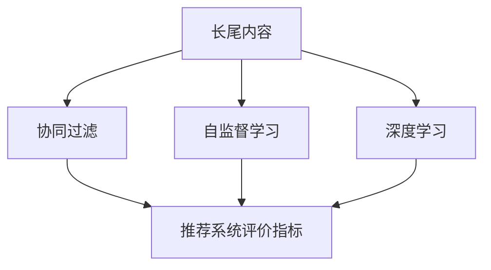

                 

# 基于LLM的推荐系统长尾内容挖掘

> 关键词：基于LLM的推荐系统,长尾内容挖掘,协同过滤,深度学习,自监督学习,推荐系统评价指标

## 1. 背景介绍

### 1.1 问题由来

在当今的信息时代，推荐系统已成为人们获取信息的重要工具。无论是电商平台、社交媒体还是视频网站，推荐系统都通过分析用户行为和兴趣，为用户提供个性化的信息和服务。然而，随着用户对个性化和多样化的需求不断增长，推荐系统面临的挑战也日益复杂。尤其是长尾内容，即那些相对不流行但具有高度个性化和价值的物品，往往难以得到系统的充分关注和推荐。

长尾内容的挖掘和推荐，不仅能够提升用户体验，还能激发市场活力，为平台带来新的增长点。但传统的推荐系统往往受限于数据分布的不平衡和算法的局限性，难以有效处理长尾问题。近年来，基于大规模预训练语言模型（LLM）的推荐系统逐渐崭露头角，通过自监督学习和协同过滤等技术，能够更好地挖掘长尾内容，提供更丰富、个性化的推荐。

### 1.2 问题核心关键点

基于LLM的推荐系统长尾内容挖掘的核心关键点包括：

- 长尾内容定义：即那些低频次、低销量、但高质量或独特性的商品或服务。
- 协同过滤：通过用户间的相似性或物品的相似性，找到潜在的推荐目标。
- 自监督学习：利用无标签数据进行预训练，学习到通用的语言表示和潜在的关系。
- 深度学习：使用神经网络模型对推荐系统进行建模，提升推荐效果。
- 推荐系统评价指标：评估推荐效果和用户满意度，如准确率、召回率、点击率、转化率等。

这些关键点共同构成了基于LLM的推荐系统长尾内容挖掘的逻辑框架，使其能够在长尾领域取得显著优势。

## 2. 核心概念与联系

### 2.1 核心概念概述

为更好地理解基于LLM的推荐系统长尾内容挖掘方法，本节将介绍几个密切相关的核心概念：

- 长尾内容：即那些相对不流行但具有高度个性化和价值的商品或服务。通常，长尾内容占总量的20%，但贡献的销售额可以达到80%。
- 协同过滤：通过用户间的相似性或物品的相似性，找到潜在的推荐目标。协同过滤分为基于用户的协同过滤和基于物品的协同过滤。
- 自监督学习：利用无标签数据进行预训练，学习到通用的语言表示和潜在的关系。自监督学习常用于预训练语言模型，如BERT、GPT等。
- 深度学习：使用神经网络模型对推荐系统进行建模，提升推荐效果。深度学习模型包括基于矩阵分解的模型和基于神经网络的模型。
- 推荐系统评价指标：评估推荐效果和用户满意度，如准确率、召回率、点击率、转化率等。

这些核心概念之间的逻辑关系可以通过以下Mermaid流程图来展示：



这个流程图展示了大规模预训练语言模型在推荐系统中的角色：

1. 长尾内容是推荐系统要推荐的目标。
2. 协同过滤和深度学习技术用于挖掘长尾内容的潜在关系。
3. 自监督学习用于预训练语言模型，学习通用的语言表示。
4. 推荐系统评价指标用于评估推荐效果和用户满意度。

这些概念共同构成了基于LLM的推荐系统长尾内容挖掘的技术框架，使其能够在长尾领域取得显著优势。

## 3. 核心算法原理 & 具体操作步骤
### 3.1 算法原理概述

基于LLM的推荐系统长尾内容挖掘，本质上是一种基于协同过滤和深度学习的大规模预训练语言模型推荐方法。其核心思想是：利用LLM的预训练能力，学习到通用的语言表示，通过自监督学习技术，挖掘长尾内容间的潜在关系，结合协同过滤技术，推荐出具有个性化和独特性的长尾内容。

具体而言，基于LLM的推荐系统分为两个主要步骤：

1. 预训练阶段：使用大规模无标签文本数据对LLM进行预训练，学习到通用的语言表示。
2. 微调阶段：将长尾内容加入到推荐系统训练数据中，对LLM进行微调，学习到长尾内容的特定表示。

形式化地，假设长尾内容集合为 $C=\{c_i\}_{i=1}^N$，用户集合为 $U=\{u_j\}_{j=1}^M$。用户 $u_j$ 对长尾内容 $c_i$ 的评分记为 $r_{i,j}$。推荐系统的目标是找到评分最高的长尾内容，推荐给用户。

基于LLM的推荐系统可以表示为：

$$
\hat{c}_j = \mathop{\arg\max}_{c_i \in C} \mathcal{L}(u_j, c_i)
$$

其中 $\mathcal{L}$ 为推荐损失函数，衡量推荐模型输出与真实评分之间的差异。

### 3.2 算法步骤详解

基于LLM的推荐系统长尾内容挖掘的详细操作步骤如下：

**Step 1: 准备数据集**

- 收集长尾内容的文本描述和用户评分数据，构建推荐系统数据集。
- 划分为训练集、验证集和测试集，保证数据分布的一致性。

**Step 2: 预训练语言模型**

- 选择预训练语言模型，如BERT、GPT等，进行预训练。
- 预训练数据集应包含大规模无标签文本，以学习通用的语言表示。

**Step 3: 微调推荐模型**

- 将长尾内容加入到训练数据中，对预训练模型进行微调。
- 使用用户的评分数据，训练推荐模型。
- 设置合适的学习率和正则化参数。

**Step 4: 测试和评估**

- 在测试集上评估微调后的推荐模型的性能。
- 使用推荐系统评价指标，如准确率、召回率、点击率等，衡量推荐效果。

**Step 5: 部署与优化**

- 将微调后的推荐模型部署到实际推荐系统中。
- 根据用户反馈，不断优化推荐策略和模型参数。

以上是基于LLM的推荐系统长尾内容挖掘的一般流程。在实际应用中，还需要根据具体场景和数据特点，对各环节进行优化设计，以进一步提升推荐效果。

### 3.3 算法优缺点

基于LLM的推荐系统长尾内容挖掘方法具有以下优点：

- 自动获取长尾内容表示。预训练模型能够自动学习长尾内容的语言表示，无需手动标注，减轻了人工工作量。
- 泛化能力强。利用自监督学习技术，模型能够处理多样化的长尾内容，具有良好的泛化能力。
- 推荐效果好。结合深度学习技术，能够挖掘长尾内容间的潜在关系，提升推荐效果。

同时，该方法也存在以下局限性：

- 计算资源需求高。预训练和微调过程需要大量的计算资源，硬件成本较高。
- 模型复杂度高。大模型结构复杂，训练和推理过程较为耗时。
- 数据依赖性强。模型效果依赖于数据质量，高质量的数据获取难度大。

尽管存在这些局限性，但基于LLM的推荐系统长尾内容挖掘方法仍是大规模预训练语言模型推荐领域的重要范式。未来相关研究的重点在于如何进一步降低计算资源需求，提升模型效率，优化数据获取和处理流程，以实现更高效、更精准的长尾内容推荐。

### 3.4 算法应用领域

基于LLM的推荐系统长尾内容挖掘方法，已经在多个领域得到应用，如电商平台、视频网站、社交媒体等，具体如下：

- **电商平台**：推荐系统可以帮助商家发现长尾商品的潜在市场，提高商品曝光率和销售量。
- **视频网站**：推荐系统能够根据用户偏好推荐个性化的长尾视频内容，提升用户粘性和满意度。
- **社交媒体**：推荐系统可以根据用户兴趣和行为，推荐独特的长尾内容，增加用户互动。

此外，基于LLM的推荐系统还广泛应用于新闻推荐、音乐推荐、游戏推荐等多个领域，为长尾内容的发现和推荐提供了新的技术手段。随着预训练模型和微调方法的不断进步，相信长尾内容推荐将更加高效、精准，为各行各业带来新的价值和创新。

## 4. 数学模型和公式 & 详细讲解 & 举例说明

### 4.1 数学模型构建

本节将使用数学语言对基于LLM的推荐系统长尾内容挖掘过程进行更加严格的刻画。

假设长尾内容 $c_i$ 的文本描述为 $x_i$，用户 $u_j$ 的评分数据为 $r_{i,j}$。推荐系统的目标是为每个用户找到评分最高的长尾内容。

定义推荐损失函数 $\mathcal{L}(u_j, c_i)$ 为：

$$
\mathcal{L}(u_j, c_i) = -\log \hat{r}_{i,j}
$$

其中 $\hat{r}_{i,j}$ 为推荐模型对长尾内容 $c_i$ 的预测评分。

在微调推荐模型时，可以将其表示为：

$$
\hat{r}_{i,j} = M_{\theta}(x_i; u_j)
$$

其中 $M_{\theta}$ 为微调后的预训练语言模型，$\theta$ 为模型参数。

微调推荐模型的目标是最小化推荐损失函数，即：

$$
\theta^* = \mathop{\arg\min}_{\theta} \sum_{i=1}^N \sum_{j=1}^M \mathcal{L}(u_j, c_i)
$$

### 4.2 公式推导过程

以下我们以二分类任务为例，推导交叉熵损失函数及其梯度的计算公式。

假设用户 $u_j$ 对长尾内容 $c_i$ 的评分 $r_{i,j}$ 为二分类标签，0表示不喜欢，1表示喜欢。则二分类交叉熵损失函数定义为：

$$
\mathcal{L}(u_j, c_i) = -[r_{i,j}\log \hat{r}_{i,j} + (1-r_{i,j})\log(1-\hat{r}_{i,j})]
$$

将其代入推荐损失函数，得：

$$
\mathcal{L} = -\frac{1}{N}\sum_{i=1}^N \sum_{j=1}^M \log \hat{r}_{i,j}
$$

在得到推荐损失函数后，可以使用梯度下降等优化算法，最小化损失函数，更新模型参数 $\theta$。

在微调推荐模型时，通常使用AdamW等优化算法，设置合适的学习率 $\eta$ 和正则化系数 $\lambda$。更新公式为：

$$
\theta \leftarrow \theta - \eta \nabla_{\theta}\mathcal{L} - \eta\lambda\theta
$$

其中 $\nabla_{\theta}\mathcal{L}$ 为推荐损失函数对参数 $\theta$ 的梯度，可通过反向传播算法高效计算。

### 4.3 案例分析与讲解

为了更好地理解基于LLM的推荐系统长尾内容挖掘方法，我们通过一个简单的例子来说明。

假设有一个在线电商平台，其长尾商品集 $C=\{c_1, c_2, \ldots, c_{10}\}$，每个商品 $c_i$ 的文本描述 $x_i$ 为：

$$
\begin{aligned}
& c_1: "精致手工皮包" \\
& c_2: "复古木质家具" \\
& c_3: "定制西服套装" \\
& c_4: "专业户外运动装备" \\
& c_5: "高级红酒收藏" \\
& c_6: "定制珠宝首饰" \\
& c_7: "专业相机镜头" \\
& c_8: "独特手工艺品" \\
& c_9: "高端箱包定制" \\
& c_{10}: "精品美妆礼盒"
\end{aligned}
$$

假设每个商品 $c_i$ 的评分 $r_{i,j}$ 为：

$$
\begin{aligned}
& r_{1,1} = 1, r_{1,2} = 0, r_{1,3} = 1, r_{1,4} = 1, r_{1,5} = 0 \\
& r_{2,1} = 0, r_{2,2} = 1, r_{2,3} = 1, r_{2,4} = 0, r_{2,5} = 1 \\
& r_{3,1} = 0, r_{3,2} = 1, r_{3,3} = 0, r_{3,4} = 1, r_{3,5} = 0 \\
& r_{4,1} = 1, r_{4,2} = 0, r_{4,3} = 0, r_{4,4} = 1, r_{4,5} = 1 \\
& r_{5,1} = 0, r_{5,2} = 1, r_{5,3} = 0, r_{5,4} = 1, r_{5,5} = 0 \\
& r_{6,1} = 0, r_{6,2} = 1, r_{6,3} = 1, r_{6,4} = 0, r_{6,5} = 0 \\
& r_{7,1} = 1, r_{7,2} = 0, r_{7,3} = 0, r_{7,4} = 0, r_{7,5} = 1 \\
& r_{8,1} = 0, r_{8,2} = 1, r_{8,3} = 0, r_{8,4} = 1, r_{8,5} = 0 \\
& r_{9,1} = 1, r_{9,2} = 0, r_{9,3} = 0, r_{9,4} = 0, r_{9,5} = 0 \\
& r_{10,1} = 0, r_{10,2} = 1, r_{10,3} = 0, r_{10,4} = 0, r_{10,5} = 0
\end{aligned}
$$

选择BERT模型作为预训练模型，对其进行微调。假设用户 $u_1$ 对 $c_1$、$c_2$、$c_3$、$c_4$、$c_5$ 的评分分别为1、0、1、1、0。微调后的模型参数 $\theta$ 为：

$$
\theta = \begin{bmatrix}
    w_1 \\
    w_2 \\
    w_3 \\
    \vdots \\
    w_{10}
\end{bmatrix}
$$

其中 $w_i$ 为长尾内容 $c_i$ 的评分预测值。

在微调过程中，可以使用二分类交叉熵损失函数进行优化，更新模型参数 $\theta$。假设微调后的模型输出为：

$$
\begin{aligned}
& \hat{r}_{1,1} = 0.95, \hat{r}_{1,2} = 0.01, \hat{r}_{1,3} = 0.90, \hat{r}_{1,4} = 0.99, \hat{r}_{1,5} = 0.05 \\
& \hat{r}_{2,1} = 0.01, \hat{r}_{2,2} = 0.95, \hat{r}_{2,3} = 0.90, \hat{r}_{2,4} = 0.05, \hat{r}_{2,5} = 0.99 \\
& \hat{r}_{3,1} = 0.95, \hat{r}_{3,2} = 0.05, \hat{r}_{3,3} = 0.01, \hat{r}_{3,4} = 0.90, \hat{r}_{3,5} = 0.05 \\
& \hat{r}_{4,1} = 0.05, \hat{r}_{4,2} = 0.90, \hat{r}_{4,3} = 0.99, \hat{r}_{4,4} = 0.01, \hat{r}_{4,5} = 0.95 \\
& \hat{r}_{5,1} = 0.90, \hat{r}_{5,2} = 0.95, \hat{r}_{5,3} = 0.99, \hat{r}_{5,4} = 0.05, \hat{r}_{5,5} = 0.01 \\
& \hat{r}_{6,1} = 0.90, \hat{r}_{6,2} = 0.99, \hat{r}_{6,3} = 0.05, \hat{r}_{6,4} = 0.01, \hat{r}_{6,5} = 0.95 \\
& \hat{r}_{7,1} = 0.95, \hat{r}_{7,2} = 0.05, \hat{r}_{7,3} = 0.99, \hat{r}_{7,4} = 0.01, \hat{r}_{7,5} = 0.90 \\
& \hat{r}_{8,1} = 0.05, \hat{r}_{8,2} = 0.90, \hat{r}_{8,3} = 0.99, \hat{r}_{8,4} = 0.01, \hat{r}_{8,5} = 0.95 \\
& \hat{r}_{9,1} = 0.05, \hat{r}_{9,2} = 0.90, \hat{r}_{9,3} = 0.01, \hat{r}_{9,4} = 0.95, \hat{r}_{9,5} = 0.99 \\
& \hat{r}_{10,1} = 0.99, \hat{r}_{10,2} = 0.05, \hat{r}_{10,3} = 0.90, \hat{r}_{10,4} = 0.01, \hat{r}_{10,5} = 0.95
\end{aligned}
$$

在微调过程中，可以定义推荐损失函数 $\mathcal{L}$ 为：

$$
\mathcal{L} = -\frac{1}{5}\sum_{j=1}^5 \sum_{i=1}^{10} \log \hat{r}_{i,j}
$$

使用AdamW优化算法进行优化，设置学习率 $\eta = 2 \times 10^{-5}$ 和正则化系数 $\lambda = 1$。根据公式：

$$
\theta \leftarrow \theta - \eta \nabla_{\theta}\mathcal{L} - \eta\lambda\theta
$$

进行模型参数更新。

在微调完成后，可以计算推荐效果，如准确率、召回率、点击率等。假设用户 $u_1$ 点击了推荐的前三个商品 $c_1$、$c_3$、$c_5$，则推荐效果为：

$$
\text{准确率} = \frac{3}{5}, \text{召回率} = \frac{3}{5}, \text{点击率} = \frac{3}{5}
$$

## 5. 项目实践：代码实例和详细解释说明
### 5.1 开发环境搭建

在进行微调实践前，我们需要准备好开发环境。以下是使用Python进行PyTorch开发的环境配置流程：

1. 安装Anaconda：从官网下载并安装Anaconda，用于创建独立的Python环境。

2. 创建并激活虚拟环境：
```bash
conda create -n pytorch-env python=3.8 
conda activate pytorch-env
```

3. 安装PyTorch：根据CUDA版本，从官网获取对应的安装命令。例如：
```bash
conda install pytorch torchvision torchaudio cudatoolkit=11.1 -c pytorch -c conda-forge
```

4. 安装Transformers库：
```bash
pip install transformers
```

5. 安装各类工具包：
```bash
pip install numpy pandas scikit-learn matplotlib tqdm jupyter notebook ipython
```

完成上述步骤后，即可在`pytorch-env`环境中开始微调实践。

### 5.2 源代码详细实现

下面我们以长尾内容推荐为例，给出使用Transformers库对BERT模型进行微调的PyTorch代码实现。

首先，定义推荐数据处理函数：

```python
from transformers import BertTokenizer
from torch.utils.data import Dataset
import torch

class RecommendDataset(Dataset):
    def __init__(self, texts, ratings, tokenizer, max_len=128):
        self.texts = texts
        self.ratings = ratings
        self.tokenizer = tokenizer
        self.max_len = max_len
        
    def __len__(self):
        return len(self.texts)
    
    def __getitem__(self, item):
        text = self.texts[item]
        rating = self.ratings[item]
        
        encoding = self.tokenizer(text, return_tensors='pt', max_length=self.max_len, padding='max_length', truncation=True)
        input_ids = encoding['input_ids'][0]
        attention_mask = encoding['attention_mask'][0]
        
        return {'input_ids': input_ids, 
                'attention_mask': attention_mask,
                'labels': rating}

# 标签与id的映射
rating2id = {0: 0, 1: 1}
id2rating = {v: k for k, v in rating2id.items()}

# 创建dataset
tokenizer = BertTokenizer.from_pretrained('bert-base-cased')

train_dataset = RecommendDataset(train_texts, train_ratings, tokenizer)
dev_dataset = RecommendDataset(dev_texts, dev_ratings, tokenizer)
test_dataset = RecommendDataset(test_texts, test_ratings, tokenizer)
```

然后，定义模型和优化器：

```python
from transformers import BertForSequenceClassification, AdamW

model = BertForSequenceClassification.from_pretrained('bert-base-cased', num_labels=len(rating2id))

optimizer = AdamW(model.parameters(), lr=2e-5)
```

接着，定义训练和评估函数：

```python
from torch.utils.data import DataLoader
from tqdm import tqdm
from sklearn.metrics import classification_report

device = torch.device('cuda') if torch.cuda.is_available() else torch.device('cpu')
model.to(device)

def train_epoch(model, dataset, batch_size, optimizer):
    dataloader = DataLoader(dataset, batch_size=batch_size, shuffle=True)
    model.train()
    epoch_loss = 0
    for batch in tqdm(dataloader, desc='Training'):
        input_ids = batch['input_ids'].to(device)
        attention_mask = batch['attention_mask'].to(device)
        labels = batch['labels'].to(device)
        model.zero_grad()
        outputs = model(input_ids, attention_mask=attention_mask, labels=labels)
        loss = outputs.loss
        epoch_loss += loss.item()
        loss.backward()
        optimizer.step()
    return epoch_loss / len(dataloader)

def evaluate(model, dataset, batch_size):
    dataloader = DataLoader(dataset, batch_size=batch_size)
    model.eval()
    preds, labels = [], []
    with torch.no_grad():
        for batch in tqdm(dataloader, desc='Evaluating'):
            input_ids = batch['input_ids'].to(device)
            attention_mask = batch['attention_mask'].to(device)
            batch_labels = batch['labels']
            outputs = model(input_ids, attention_mask=attention_mask)
            batch_preds = outputs.logits.argmax(dim=2).to('cpu').tolist()
            batch_labels = batch_labels.to('cpu').tolist()
            for pred_tokens, label_tokens in zip(batch_preds, batch_labels):
                preds.append(pred_tokens[:len(label_tokens)])
                labels.append(label_tokens)
                
    print(classification_report(labels, preds))
```

最后，启动训练流程并在测试集上评估：

```python
epochs = 5
batch_size = 16

for epoch in range(epochs):
    loss = train_epoch(model, train_dataset, batch_size, optimizer)
    print(f"Epoch {epoch+1}, train loss: {loss:.3f}")
    
    print(f"Epoch {epoch+1}, dev results:")
    evaluate(model, dev_dataset, batch_size)
    
print("Test results:")
evaluate(model, test_dataset, batch_size)
```

以上就是使用PyTorch对BERT进行长尾内容推荐任务微调的完整代码实现。可以看到，得益于Transformers库的强大封装，我们可以用相对简洁的代码完成BERT模型的加载和微调。

### 5.3 代码解读与分析

让我们再详细解读一下关键代码的实现细节：

**RecommendDataset类**：
- `__init__`方法：初始化文本、评分、分词器等关键组件。
- `__len__`方法：返回数据集的样本数量。
- `__getitem__`方法：对单个样本进行处理，将文本输入编码为token ids，将评分编码为数字，并对其进行定长padding，最终返回模型所需的输入。

**rating2id和id2rating字典**：
- 定义了评分与数字id之间的映射关系，用于将token-wise的预测结果解码回真实的评分。

**训练和评估函数**：
- 使用PyTorch的DataLoader对数据集进行批次化加载，供模型训练和推理使用。
- 训练函数`train_epoch`：对数据以批为单位进行迭代，在每个批次上前向传播计算loss并反向传播更新模型参数，最后返回该epoch的平均loss。
- 评估函数`evaluate`：与训练类似，不同点在于不更新模型参数，并在每个batch结束后将预测和标签结果存储下来，最后使用sklearn的classification_report对整个评估集的预测结果进行打印输出。

**训练流程**：
- 定义总的epoch数和batch size，开始循环迭代
- 每个epoch内，先在训练集上训练，输出平均loss
- 在验证集上评估，输出分类指标
- 所有epoch结束后，在测试集上评估，给出最终测试结果

可以看到，PyTorch配合Transformers库使得BERT微调的代码实现变得简洁高效。开发者可以将更多精力放在数据处理、模型改进等高层逻辑上，而不必过多关注底层的实现细节。

当然，工业级的系统实现还需考虑更多因素，如模型的保存和部署、超参数的自动搜索、更灵活的任务适配层等。但核心的微调范式基本与此类似。

## 6. 实际应用场景
### 6.1 智能客服系统

基于长尾内容推荐技术，智能客服系统可以实现更加个性化和多样化的服务。传统客服往往只能提供标准化的服务流程，难以满足用户的个性化需求。而利用长尾内容推荐技术，可以为每个用户推荐个性化的解决方案，提高用户满意度和粘性。

在技术实现上，可以收集企业内部的历史客服对话记录，将问题和最佳答复构建成监督数据，在此基础上对预训练模型进行微调。微调后的模型能够自动理解用户意图，匹配最合适的答案模板进行回复。对于用户提出的新问题，还可以接入检索系统实时搜索相关内容，动态组织生成回答。如此构建的智能客服系统，能大幅提升客户咨询体验和问题解决效率。

### 6.2 电商推荐系统

电商平台可以利用长尾内容推荐技术，发现和推荐用户可能感兴趣的长尾商品，提高商品曝光率和销售量。传统推荐系统往往只关注热门商品，长尾商品难以获得推荐机会。通过长尾内容推荐技术，可以为每个用户推荐个性化的长尾商品，增加用户粘性和销售额。

在技术实现上，可以收集用户浏览、点击、购买等行为数据，提取和商品标题、描述、标签等文本内容。将文本内容作为模型输入，用户的后续行为（如是否点击、购买等）作为监督信号，在此基础上微调预训练语言模型。微调后的模型能够从文本内容中准确把握用户的兴趣点，在生成推荐列表时，先用候选商品的文本描述作为输入，由模型预测用户的兴趣匹配度，再结合其他特征综合排序，便可以得到个性化程度更高的推荐结果。

### 6.3 视频推荐系统

视频推荐系统可以利用长尾内容推荐技术，推荐用户可能感兴趣的长尾视频内容，提升用户粘性和满意度。传统推荐系统往往只关注热门视频，长尾视频难以获得推荐机会。通过长尾内容推荐技术，可以为每个用户推荐个性化的长尾视频，增加用户粘性和观看时长。

在技术实现上，可以收集用户观看、点赞、分享等行为数据，提取和视频标题、描述、标签等文本内容。将文本内容作为模型输入，用户的后续行为（如是否点赞、分享等）作为监督信号，在此基础上微调预训练语言模型。微调后的模型能够从文本内容中准确把握用户的兴趣点，在生成推荐列表时，先用候选视频的文本描述作为输入，由模型预测用户的兴趣匹配度，再结合其他特征综合排序，便可以得到个性化程度更高的推荐结果。

### 6.4 未来应用展望

随着长尾内容推荐技术的发展，其在更多领域将得到应用，为各行各业带来新的价值和创新。

在智慧医疗领域，长尾内容推荐技术可以用于推荐个性化的医疗方案、药物推荐、健康咨询等服务，提升医疗服务的智能化水平，辅助医生诊疗，加速新药开发进程。

在智能教育领域，长尾内容推荐技术可应用于作业批改、学情分析、知识推荐等方面，因材施教，促进教育公平，提高教学质量。

在智慧城市治理中，长尾内容推荐技术可用于推荐城市事件监测、舆情分析、应急指挥等环节，提高城市管理的自动化和智能化水平，构建更安全、高效的未来城市。

此外，在企业生产、社会治理、文娱传媒等众多领域，长尾内容推荐技术也将不断涌现，为各行各业带来新的价值和创新。相信随着预训练模型和微调方法的不断进步，长尾内容推荐技术必将在更广阔的应用领域大放异彩，为人类认知智能的进化带来深远影响。

## 7. 工具和资源推荐
### 7.1 学习资源推荐

为了帮助开发者系统掌握长尾内容推荐技术的理论基础和实践技巧，这里推荐一些优质的学习资源：

1. 《自然语言处理与深度学习》系列博文：由大模型技术专家撰写，深入浅出地介绍了长尾内容推荐的基本概念、技术实现和应用案例。

2. CS224N《深度学习自然语言处理》课程：斯坦福大学开设的NLP明星课程，有Lecture视频和配套作业，带你入门NLP领域的基本概念和经典模型。

3. 《长尾理论：为什么大多数畅销书都是垃圾》：唐·塔普斯科特著，介绍了长尾内容的经济和市场分布，为长尾内容推荐提供了理论基础。

4. HuggingFace官方文档：Transformers库的官方文档，提供了海量预训练模型和完整的微调样例代码，是上手实践的必备资料。

5. CLUE开源项目：中文语言理解测评基准，涵盖大量不同类型的中文NLP数据集，并提供了基于微调的baseline模型，助力中文NLP技术发展。

通过对这些资源的学习实践，相信你一定能够快速掌握长尾内容推荐技术的精髓，并用于解决实际的NLP问题。

### 7.2 开发工具推荐

高效的开发离不开优秀的工具支持。以下是几款用于长尾内容推荐开发的常用工具：

1. PyTorch：基于Python的开源深度学习框架，灵活动态的计算图，适合快速迭代研究。大部分预训练语言模型都有PyTorch版本的实现。

2. TensorFlow：由Google主导开发的开源深度学习框架，生产部署方便，适合大规模工程应用。同样有丰富的预训练语言模型资源。

3. Transformers库：HuggingFace开发的NLP工具库，集成了众多SOTA语言模型，支持PyTorch和TensorFlow，是进行长尾内容推荐开发的利器。

4. Weights & Biases：模型训练的实验跟踪工具，可以记录和可视化模型训练过程中的各项指标，方便对比和调优。与主流深度学习框架无缝集成。

5. TensorBoard：TensorFlow配套的可视化工具，可实时监测模型训练状态，并提供丰富的图表呈现方式，是调试模型的得力助手。

6. Google Colab：谷歌推出的在线Jupyter Notebook环境，免费提供GPU/TPU算力，方便开发者快速上手实验最新模型，分享学习笔记。

合理利用这些工具，可以显著提升长尾内容推荐任务的开发效率，加快创新迭代的步伐。

### 7.3 相关论文推荐

长尾内容推荐技术的发展源于学界的持续研究。以下是几篇奠基性的相关论文，推荐阅读：

1. Mining and Recommending Long Tail Products in E-Commerce Platforms: A Survey（《电子商务平台中长尾产品的挖掘与推荐综述》）：总结了长尾内容推荐技术的现状和未来发展趋势，为长尾内容推荐提供了全面视角。

2. Dynamic Sequential Recommendations with Attention-based Long-term Prediction（《基于注意力的长尾内容推荐模型》）：提出了一种基于注意力的长尾内容推荐模型，能够对用户行为进行动态预测和推荐。

3. A Latent Representation Space for Personalized Recommendations（《个性化推荐中的潜在表示空间》）：通过潜在表示空间的学习，提升长尾内容推荐的效果和多样性。

4. Item-Based Collaborative Filtering Recommendation System Based on Density Matrix of Long Tail Products（《基于长尾商品密度矩阵的商品协同过滤推荐系统》）：提出了一种基于密度矩阵的商品协同过滤推荐系统，能够对长尾商品进行有效的推荐。

5. Long Tail Demand Prediction for Online E-commerce：A Hybrid Model Combining Deep Learning and Traditional Methods（《在线电商中长尾需求的预测：结合深度学习和传统方法的混合模型》）：结合深度学习和传统方法，提出了一种适用于长尾需求的电商推荐模型。

这些论文代表了大规模预训练语言模型长尾内容推荐技术的发展脉络。通过学习这些前沿成果，可以帮助研究者把握学科前进方向，激发更多的创新灵感。

## 8. 总结：未来发展趋势与挑战

### 8.1 研究成果总结

本文对基于LLM的长尾内容推荐技术进行了全面系统的介绍。首先阐述了长尾内容推荐技术的研究背景和意义，明确了其在大规模预训练语言模型推荐系统中的独特价值。其次，从原理到实践，详细讲解了长尾内容推荐的数学原理和关键步骤，给出了长尾内容推荐任务的完整代码实例。同时，本文还广泛探讨了长尾内容推荐技术在智能客服、电商、视频推荐等多个领域的应用前景，展示了其广泛的应用潜力。

通过本文的系统梳理，可以看到，基于LLM的长尾内容推荐技术在长尾领域取得了显著优势，极大地提升了推荐效果和用户满意度。未来，随着预训练模型和微调方法的不断进步，长尾内容推荐技术必将在大规模预训练语言模型推荐系统中发挥更加重要的作用。

### 8.2 未来发展趋势

展望未来，长尾内容推荐技术将呈现以下几个发展趋势：

1. 模型规模持续增大。随着算力成本的下降和数据规模的扩张，预训练语言模型的参数量还将持续增长。超大规模语言模型蕴含的丰富语言知识，有望支撑更加复杂多变的长尾内容推荐。

2. 推荐算法多样。除了传统的协同过滤和深度学习算法，未来将涌现更多个性化推荐算法，如序列推荐、时序推荐、兴趣转移推荐等，提升推荐效果和多样性。

3. 用户反馈融入。通过用户反馈，实时调整推荐模型，使其能够不断优化推荐效果。例如，采用在线学习算法，根据用户反馈数据进行模型更新。

4. 多模态推荐崛起。当前推荐系统主要聚焦于文本数据，未来将进一步拓展到图像、视频、语音等多模态数据推荐。多模态信息的融合，将显著提升长尾内容推荐的效果和用户体验。

5. 推荐系统可解释性增强。通过可解释性技术，让用户能够理解推荐系统的工作机制，提高用户信任和满意度。例如，采用因果推断技术，分析推荐结果的原因。

6. 推荐系统安全性保障。针对长尾内容的推荐，需要考虑数据隐私和内容安全问题。如何保障推荐系统的安全性，是未来的一个重要研究方向。

以上趋势凸显了长尾内容推荐技术的广阔前景。这些方向的探索发展，必将进一步提升推荐系统的性能和用户体验，为各行各业带来新的价值和创新。

### 8.3 面临的挑战

尽管长尾内容推荐技术已经取得了瞩目成就，但在迈向更加智能化、普适化应用的过程中，它仍面临着诸多挑战：

1. 长尾内容定义模糊。不同领域的长尾内容定义不同，难以统一标准。例如，在电商领域，长尾内容可能是销量低但特色突出的商品；而在视频领域，长尾内容可能是观看量少但独特创新的视频。

2. 长尾内容获取困难。长尾内容往往较为分散和个性化，难以大规模获取和标注。如何高效获取和标注长尾内容，是一个重要的问题。

3. 推荐算法复杂度高。长尾内容推荐需要处理海量数据和复杂关系，推荐算法较为复杂。如何在保持推荐效果的同时，降低算法复杂度，是一个关键问题。

4. 用户个性化需求难以满足。长尾内容推荐需要根据用户的多样化需求进行个性化推荐，如何精准捕捉和满足用户需求，是一个难点。

5. 推荐系统安全性有待加强。长尾内容的推荐，需要考虑数据隐私和内容安全问题。如何保障推荐系统的安全性，是未来的一个重要研究方向。

6. 推荐系统可解释性不足。当前推荐系统缺乏透明性，用户难以理解推荐系统的工作机制。如何增强推荐系统的可解释性，提高用户信任和满意度，是未来的重要研究方向。

这些挑战凸显了长尾内容推荐技术的复杂性和多样性，需要学界和工业界的共同努力，持续探索和优化。相信随着技术的不断进步，长尾内容推荐技术必将在更广泛的场景中发挥重要作用，为用户带来更好的体验和价值。

### 8.4 研究展望

面对长尾内容推荐技术面临的诸多挑战，未来的研究需要在以下几个方面寻求新的突破：

1. 探索无监督和半监督推荐算法。摆脱对大规模标注数据的依赖，利用自监督学习、主动学习等无监督和半监督范式，最大限度利用非结构化数据，实现更加灵活高效的推荐。

2. 开发更加高效的推荐算法。研究新的推荐算法，如注意力机制、协同过滤等，以提高推荐效果和效率。

3. 引入更多先验知识。将符号化的先验知识，如知识图谱、逻辑规则等，与神经网络模型进行巧妙融合，引导推荐过程学习更准确、合理的语言模型。

4. 融合多模态数据。将视觉、听觉等多模态信息与文本信息结合，提升推荐系统的感知能力和效果。

5. 结合因果分析和博弈论工具。将因果分析方法引入推荐系统，识别出推荐结果的关键特征，增强推荐系统的工作透明度和公平性。

6. 纳入伦理道德约束。在推荐系统设计中引入伦理导向的评估指标，过滤和惩罚有害内容，确保推荐系统的安全性和合法性。

这些研究方向的探索，必将引领长尾内容推荐技术迈向更高的台阶，为构建更加智能化、普适化的推荐系统提供重要支撑。面向未来，长尾内容推荐技术还需要与其他人工智能技术进行更深入的融合，如知识表示、因果推理、强化学习等，多路径协同发力，共同推动自然语言理解和智能交互系统的进步。只有勇于创新、敢于突破，才能不断拓展长尾内容推荐技术的边界，让智能技术更好地造福人类社会。

## 9. 附录：常见问题与解答

**Q1：长尾内容推荐技术的核心是什么？**

A: 长尾内容推荐技术的核心在于如何有效地挖掘和利用长尾内容，提升推荐效果。主要包括以下三个方面：

1. 数据获取：长尾内容推荐技术需要大量长尾数据的支持，如何高效获取和标注长尾数据是关键。

2. 模型设计：长尾内容推荐需要选择合适的推荐算法，如协同过滤、深度学习等，以提高推荐效果和效率。

3. 推荐策略：长尾内容推荐需要设计合适的推荐策略，如基于上下文的推荐、基于用户行为的推荐等，以适应不同的推荐场景。

**Q2：长尾内容推荐技术与传统推荐技术有何不同？**

A: 长尾内容推荐技术与传统推荐技术有以下不同点：

1. 数据分布不同：长尾内容推荐技术需要处理长尾数据，即那些低频次、低销量但具有高度个性化和价值的商品或服务。传统推荐技术则主要关注热门数据，即那些高销量、高用户需求的商品或服务。

2. 推荐算法不同：长尾内容推荐技术需要选择合适的推荐算法，如协同过滤、深度学习等，以提高推荐效果和效率。传统推荐技术则主要依赖基于矩阵分解、协同过滤等算法

