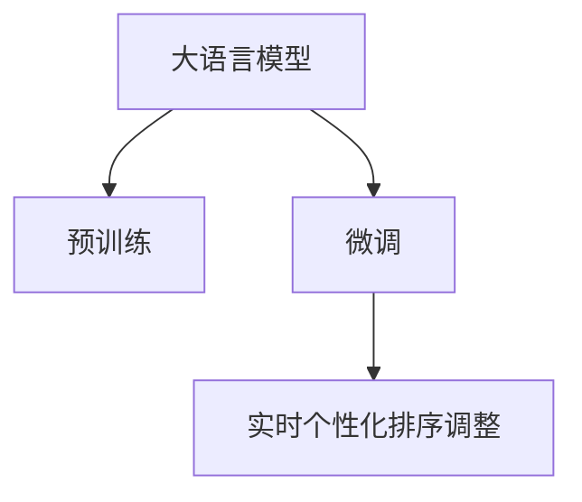

                 

# 基于大模型的推荐系统实时个性化排序调整

## 1. 背景介绍

推荐系统在电子商务、新闻媒体、社交网络等领域发挥着越来越重要的作用。随着用户数量和数据量的快速增长，推荐系统面临着算法复杂度大、实时性要求高、个性化需求强等多重挑战。在传统的协同过滤、基于内容的推荐等方法无法满足这些要求的情况下，基于大模型的推荐系统应运而生。

## 2. 核心概念与联系

### 2.1 核心概念概述

基于大模型的推荐系统是利用大语言模型进行个性化推荐的一种先进技术。其核心思想是通过对大规模无标签文本进行预训练，学习语言的知识表示，然后在实际推荐任务上微调，以获得更精准的推荐效果。

- **大语言模型（Large Language Models, LLMs）**：如GPT-3、BERT等。通过大规模语料预训练，学习到语言的通用表示，具备强大的语言理解和生成能力。
- **推荐系统**：如协同过滤、基于内容的推荐等。通过用户行为数据和物品属性等，推荐用户可能感兴趣的商品、内容等。
- **实时个性化排序调整**：利用大语言模型对推荐结果进行个性化排序和实时调整，提升推荐的实时性和个性化水平。

### 2.2 核心概念原理和架构的 Mermaid 流程图



该图展示了基于大模型的推荐系统的核心架构：

1. **大语言模型**：通过预训练学习语言知识表示。
2. **微调**：在推荐任务上进行微调，学习具体任务的知识表示。
3. **实时个性化排序调整**：利用微调后的模型进行个性化推荐，并进行实时排序和调整。

## 3. 核心算法原理 & 具体操作步骤

### 3.1 算法原理概述

基于大模型的推荐系统利用大语言模型进行推荐，其核心思想是将预训练语言模型作为特征提取器，通过微调学习特定任务的推荐知识表示，从而实现个性化的推荐。具体步骤如下：

1. 对大语言模型进行预训练，学习通用的语言表示。
2. 在推荐任务上微调模型，学习推荐任务的特征表示。
3. 利用微调后的模型对用户行为数据进行处理，进行个性化推荐。
4. 实时收集用户反馈，调整模型参数，实现个性化排序调整。

### 3.2 算法步骤详解

#### 3.2.1 数据准备

1. **用户行为数据**：收集用户的历史行为数据，包括浏览记录、购买记录、评分记录等。
2. **物品属性数据**：收集物品的属性信息，如价格、类别、描述等。
3. **预训练数据**：收集大规模无标签文本数据，如新闻、书籍、电影评论等，用于大语言模型的预训练。

#### 3.2.2 大语言模型预训练

1. **模型选择**：选择大语言模型，如GPT-3、BERT等。
2. **训练**：在大规模无标签文本数据上进行预训练，学习通用的语言表示。
3. **保存**：保存预训练的模型参数，用于后续微调。

#### 3.2.3 微调

1. **任务定义**：根据推荐任务，定义输入输出格式。如输入为物品的ID和属性，输出为推荐结果。
2. **模型选择**：选择预训练后的模型作为初始化参数。
3. **模型微调**：在推荐任务上进行微调，学习推荐特征表示。
4. **保存**：保存微调后的模型参数，用于后续推荐。

#### 3.2.4 实时个性化排序调整

1. **推荐计算**：利用微调后的模型计算推荐结果。
2. **排序调整**：根据用户行为数据进行实时排序调整。
3. **反馈更新**：收集用户反馈数据，更新模型参数。

## 4. 数学模型和公式 & 详细讲解 & 举例说明

### 4.1 数学模型构建

设大语言模型为 $M_{\theta}$，用户行为数据为 $X$，物品属性数据为 $Y$，推荐任务为 $T$。假设推荐结果为 $R = f_{\theta}(X, Y)$。

### 4.2 公式推导过程

1. **预训练损失函数**：
   $$
   \mathcal{L}_{pre} = \frac{1}{N} \sum_{i=1}^N \ell(M_{\theta}(x_i), y_i)
   $$
   其中 $x_i$ 为输入数据，$y_i$ 为标签。

2. **微调损失函数**：
   $$
   \mathcal{L}_{fine} = \frac{1}{N} \sum_{i=1}^N \ell(f_{\theta}(x_i), r_i)
   $$
   其中 $r_i$ 为推荐结果，$\ell$ 为损失函数，如均方误差。

3. **实时排序调整**：
   $$
   r_{i,t} = f_{\theta}(x_i, y_i)
   $$
   其中 $t$ 为时间步长。

4. **反馈更新**：
   $$
   \theta_{t+1} = \theta_t - \eta \nabla_{\theta} \mathcal{L}_{fine}(f_{\theta}(x_i, y_i), r_i)
   $$
   其中 $\eta$ 为学习率。

### 4.3 案例分析与讲解

以电商推荐为例，假设用户浏览了商品 $x_1, x_2, ..., x_n$，则推荐结果为：
$$
R = f_{\theta}(X, Y) = \{f_{\theta}(x_1, y_1), f_{\theta}(x_2, y_2), ..., f_{\theta}(x_n, y_n)\}
$$
其中 $x_i$ 为商品ID，$y_i$ 为商品属性，如价格、类别等。

实时排序调整的公式为：
$$
r_{i,t} = f_{\theta}(x_i, y_i)
$$
根据用户的历史行为数据，对推荐结果进行排序调整。例如，如果用户对某类商品有较高的购买频率，则将该类商品排名靠前。

反馈更新公式为：
$$
\theta_{t+1} = \theta_t - \eta \nabla_{\theta} \mathcal{L}_{fine}(f_{\theta}(x_i, y_i), r_i)
$$
根据用户反馈调整模型参数，提高模型的预测准确性。

## 5. 项目实践：代码实例和详细解释说明

### 5.1 开发环境搭建

为了实现基于大模型的推荐系统，需要以下开发环境：

1. Python：安装Python 3.7及以上版本，并配置好环境变量。
2. PyTorch：安装PyTorch 1.8及以上版本，用于深度学习模型的实现。
3. Transformers：安装Transformers 4.8及以上版本，用于加载预训练语言模型。
4. Scikit-learn：安装Scikit-learn 0.24及以上版本，用于数据处理和模型评估。
5. Pandas：安装Pandas 1.3及以上版本，用于数据读取和处理。

### 5.2 源代码详细实现

以下是一个简单的基于BERT模型的推荐系统实现，主要功能包括预训练、微调和实时排序调整。

```python
import torch
import torch.nn as nn
import torch.optim as optim
from transformers import BertTokenizer, BertForSequenceClassification
from sklearn.metrics import mean_squared_error
from pandas import DataFrame

# 数据准备
train_data = DataFrame({'item_id': [1, 2, 3, 4, 5],
                       'item_price': [10, 20, 30, 40, 50],
                       'item_category': ['A', 'B', 'C', 'D', 'E'],
                       'user_browsed': [0, 1, 0, 1, 0],
                       'user_purchased': [0, 0, 1, 0, 0]})
test_data = DataFrame({'item_id': [1, 2, 3, 4, 5],
                      'item_price': [10, 20, 30, 40, 50],
                      'item_category': ['A', 'B', 'C', 'D', 'E'],
                      'user_browsed': [0, 1, 0, 1, 0],
                      'user_purchased': [0, 0, 1, 0, 0]})

# 预训练模型加载
tokenizer = BertTokenizer.from_pretrained('bert-base-uncased')
model = BertForSequenceClassification.from_pretrained('bert-base-uncased',
                                                   num_labels=1)

# 微调模型训练
optimizer = optim.Adam(model.parameters(), lr=1e-5)
epochs = 5
for epoch in range(epochs):
    loss = 0
    for i, (item_id, item_price, item_category, user_browsed, user_purchased) in train_data.iterrows():
        input_ids = tokenizer(item_category, return_tensors='pt').input_ids
        labels = torch.tensor([user_purchased]).to(device)
        output = model(input_ids, labels=labels)
        loss += output.loss
        optimizer.zero_grad()
        output.backward()
        optimizer.step()
    print(f'Epoch {epoch+1}, Loss: {loss/len(train_data)}')

# 实时排序调整
def sort_recommendations(model, test_data):
    recommendations = []
    for i, (item_id, item_price, item_category, user_browsed, user_purchased) in test_data.iterrows():
        input_ids = tokenizer(item_category, return_tensors='pt').input_ids
        output = model(input_ids)
        recommendations.append(output.logits.argmax().item())
    return recommendations

# 计算RMSE
recommendations = sort_recommendations(model, test_data)
rmse = mean_squared_error(test_data.user_purchased, recommendations)
print(f'RMSE: {rmse}')

# 保存模型
model.save_pretrained('/path/to/save/model')
```

### 5.3 代码解读与分析

1. **数据准备**：使用Pandas库创建训练和测试数据集，包含商品ID、价格、类别、用户浏览和购买信息。
2. **预训练模型加载**：加载BERT模型和分词器，用于后续微调和推荐计算。
3. **微调模型训练**：使用Adam优化器，在训练集上进行微调，损失函数为交叉熵。
4. **实时排序调整**：定义sort_recommendations函数，对测试集进行排序调整，返回推荐结果。
5. **计算RMSE**：计算推荐结果与真实购买行为的RMSE，评估推荐系统效果。
6. **保存模型**：将微调后的模型保存到指定路径。

## 6. 实际应用场景

### 6.1 电商推荐

基于大模型的推荐系统在电商推荐场景中有着广泛的应用。通过用户的历史浏览和购买行为，实时调整推荐排序，提升用户购物体验和转化率。例如，某电商网站可以使用基于BERT的推荐系统，根据用户的历史浏览记录，动态调整推荐结果，推荐用户可能感兴趣的商品。

### 6.2 新闻推荐

新闻推荐系统通过用户的历史阅读行为，实时调整推荐排序，提高用户阅读体验和点击率。例如，某新闻平台可以使用基于BERT的推荐系统，根据用户的历史阅读记录，推荐用户可能感兴趣的新闻文章。

### 6.3 电影推荐

电影推荐系统通过用户的历史观影行为，实时调整推荐排序，提升用户观影体验和推荐准确性。例如，某视频网站可以使用基于BERT的推荐系统，根据用户的历史观影记录，推荐用户可能感兴趣的电影。

### 6.4 未来应用展望

未来，基于大模型的推荐系统将更加注重个性化和实时性。随着数据量和计算能力的提升，大语言模型将在推荐任务上发挥更大的作用，实现更加精准、灵活的推荐。同时，推荐系统还将与其他AI技术融合，如知识图谱、情感分析等，提升推荐质量。

## 7. 工具和资源推荐

### 7.1 学习资源推荐

1. **《推荐系统实战》**：一本介绍推荐系统原理和实现的好书，涵盖协同过滤、基于内容的推荐、大模型推荐等方法。
2. **Coursera《Machine Learning》课程**：斯坦福大学开设的机器学习课程，涵盖推荐系统等内容。
3. **Kaggle竞赛**：参加Kaggle推荐系统竞赛，可以学习推荐系统实战技巧，提升实践能力。

### 7.2 开发工具推荐

1. **PyTorch**：深度学习框架，支持动态图和静态图两种模式，适用于深度学习模型的实现。
2. **Transformers**：自然语言处理工具库，提供预训练语言模型和微调接口，方便快速开发推荐系统。
3. **Jupyter Notebook**：交互式开发环境，方便代码调试和分享。
4. **TensorBoard**：可视化工具，监控模型训练和推理过程中的各项指标。

### 7.3 相关论文推荐

1. **《Adaptive Data Augmentation for Training Neural Collaborative Filtering Models》**：介绍数据增强在协同过滤推荐系统中的应用。
2. **《Model-Based Deep Recommendation with Masked Language Model》**：介绍基于大模型的推荐系统，利用大语言模型进行推荐。
3. **《Sequence-aware Recommender System》**：介绍基于序列的推荐系统，利用用户行为序列进行推荐。

## 8. 总结：未来发展趋势与挑战

### 8.1 研究成果总结

基于大模型的推荐系统是推荐技术的一种新范式，其核心思想是利用大语言模型进行推荐。该方法可以充分利用大语言模型的语言表示能力，实现更加精准、灵活的推荐。通过微调，模型可以在特定推荐任务上进行优化，提升推荐效果。

### 8.2 未来发展趋势

1. **数据增强技术的应用**：数据增强技术可以有效提高模型的泛化能力和推荐效果，未来将得到广泛应用。
2. **多任务学习的应用**：多任务学习可以在多个推荐任务上共享模型参数，提高模型利用率和推荐效果。
3. **序列推荐模型的应用**：序列推荐模型可以充分利用用户行为序列信息，提升推荐效果。
4. **知识图谱的应用**：知识图谱可以与大语言模型结合，提高推荐系统的推理能力和知识整合能力。

### 8.3 面临的挑战

1. **数据隐私问题**：用户行为数据包含大量隐私信息，如何保护用户隐私是一个重要挑战。
2. **计算资源消耗**：大语言模型具有高计算资源消耗，如何降低计算成本是一个重要问题。
3. **模型公平性问题**：大语言模型可能存在偏见，如何保证推荐系统的公平性是一个重要问题。
4. **实时推荐性能**：大语言模型的推理速度较慢，如何提升实时推荐性能是一个重要问题。

### 8.4 研究展望

未来，基于大模型的推荐系统将继续探索更多的优化方向，如数据增强、多任务学习、序列推荐、知识图谱等。同时，还需要解决数据隐私、计算资源消耗、模型公平性和实时推荐性能等问题，推动推荐系统向更加智能化、普适化方向发展。

## 9. 附录：常见问题与解答

**Q1: 大语言模型推荐系统的优势和劣势是什么？**

**A1:** 大语言模型推荐系统的优势包括：
1. 可以充分利用大语言模型的语言表示能力，实现更加精准、灵活的推荐。
2. 可以充分利用大规模无标签文本数据进行预训练，提升推荐效果。
3. 可以实时动态调整推荐结果，提升用户满意度。

劣势包括：
1. 高计算资源消耗，需要高性能计算设备支持。
2. 需要大量标注数据进行微调，成本较高。
3. 模型可能存在偏见，需要谨慎处理。

**Q2: 如何优化基于大模型的推荐系统？**

**A2:** 优化基于大模型的推荐系统可以从以下几个方面入手：
1. 数据增强：通过回译、近义替换等方式扩充训练集。
2. 多任务学习：在多个推荐任务上共享模型参数。
3. 序列推荐模型：充分利用用户行为序列信息，提升推荐效果。
4. 知识图谱：与大语言模型结合，提高推荐系统的推理能力和知识整合能力。
5. 参数高效微调：只调整少量参数，减小计算成本。

**Q3: 如何处理数据隐私问题？**

**A3:** 处理数据隐私问题可以从以下几个方面入手：
1. 匿名化处理：对用户行为数据进行匿名化处理，保护用户隐私。
2. 数据加密：对用户行为数据进行加密处理，防止数据泄露。
3. 联邦学习：在用户端进行本地训练，不将数据上传至云端，保护用户隐私。

**Q4: 如何提升实时推荐性能？**

**A4:** 提升实时推荐性能可以从以下几个方面入手：
1. 模型剪枝：去除不必要的层和参数，减小模型尺寸，加快推理速度。
2. 量化加速：将浮点模型转为定点模型，压缩存储空间，提高计算效率。
3. 多模型集成：训练多个推荐模型，取平均输出，抑制过拟合。

**Q5: 如何保证模型公平性？**

**A5:** 保证模型公平性可以从以下几个方面入手：
1. 数据平衡：确保训练数据中各类用户行为数据平衡，防止模型偏斜。
2. 模型正则化：使用L2正则、Dropout等技术，防止模型过拟合，减少偏见。
3. 公平性评估：在模型训练和评估过程中，加入公平性指标，如Gini系数、F1-score等。

---

作者：禅与计算机程序设计艺术 / Zen and the Art of Computer Programming

