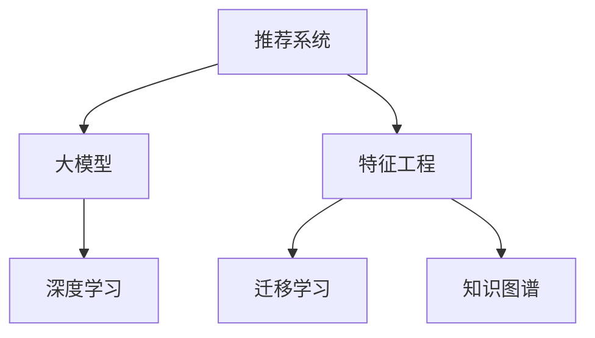

                 

# 基于大模型的推荐系统特征工程优化

## 1. 背景介绍

### 1.1 问题由来
推荐系统是现代互联网应用中的重要组件，旨在为用户推荐最符合其兴趣和需求的内容或商品。随着用户数据的积累和算法的迭代，推荐系统的精准度和个性化程度显著提升。然而，推荐系统的核心在于如何准确理解用户兴趣和行为，从而构建有效的特征空间，驱动模型进行高效的推荐。传统的推荐系统主要基于手工特征工程，依赖领域专家对用户行为数据进行手工特征构建，然后以这些手工特征作为输入，对用户进行行为预测和内容推荐。这种方法需要大量的特征工程和特征构建工作，且特征的工程质量直接决定了推荐系统的效果。

### 1.2 问题核心关键点
在近年来，利用大模型进行推荐系统特征工程优化的研究迅速发展。大模型作为推荐系统特征工程优化的关键，在学术界和工业界都得到了广泛应用。大模型如BERT、GPT等，通过在海量文本数据上进行自监督学习，学习到了丰富的语言知识和语义表示，能够从文本数据中抽取高层次的语义特征，从而提升推荐系统的效果。同时，大模型还可以对输入文本进行上下文理解，融合更多上下文信息，提升推荐系统的精准度和泛化能力。

大模型推荐系统特征工程优化的核心问题包括：

1. **大模型选型**：如何选择最合适的预训练语言模型，使其能最大程度地利用用户行为数据，提取有价值的高层次语义特征。
2. **特征表示**：如何将用户行为数据转换为大模型的有效输入，使得大模型能够从中提取最具代表性的特征。
3. **模型融合**：如何将多个大模型的输出进行有效融合，提升推荐系统的整体效果。
4. **迁移学习**：如何在大模型和推荐系统之间进行有效的知识迁移，使得预训练语言模型能更好地适应推荐系统的特定任务。

### 1.3 问题研究意义
大模型在推荐系统中的广泛应用，极大地提升了推荐系统的推荐精度和个性化水平。通过将大模型作为推荐系统的核心，可以有效减少手工特征工程的工作量，提升推荐系统的可扩展性和可解释性。大模型推荐系统特征工程优化技术已经成为推荐系统领域的一个重要研究方向，具有以下几方面的重要意义：

1. **提升推荐精度**：通过大模型进行特征工程优化，可以有效提升推荐系统的推荐精度，帮助用户获取更满意的内容和商品。
2. **增强个性化**：大模型可以提取高层次的语义特征，理解用户的兴趣和需求，从而提供更具个性化的推荐内容。
3. **减少特征工程成本**：大模型能够自动化地从用户行为数据中提取特征，减少人工特征工程的工作量，提升推荐系统的构建效率。
4. **可解释性强**：大模型可以提供特征生成的可解释性，使得推荐系统的决策过程更加透明和可理解。
5. **适用性广**：大模型推荐系统特征工程优化技术可以广泛应用于电商、新闻、视频、音乐等各个领域，提升推荐系统的效果。

## 2. 核心概念与联系

### 2.1 核心概念概述

为更好地理解基于大模型的推荐系统特征工程优化方法，本节将介绍几个密切相关的核心概念：

- **推荐系统(Recommendation System)**：通过分析用户的历史行为数据，为用户推荐最符合其兴趣和需求的内容或商品的系统。
- **大模型(Large Model)**：如BERT、GPT等，通过在大量无标签文本数据上进行自监督学习，学习到丰富的语言知识和语义表示，具备强大的特征提取能力。
- **特征工程(Feature Engineering)**：根据业务需求和模型特点，选择、构建、提取、转换和组合数据特征的过程。
- **迁移学习(Transfer Learning)**：在特定任务上，利用已有模型在大规模数据上的知识，进行微调，提升模型在该任务上的性能。
- **知识图谱(Knowledge Graph)**：由实体、关系和属性组成的语义网络，用于表示实体之间的语义关系，提升推荐系统的个性化和精准度。
- **深度学习(Deep Learning)**：利用神经网络进行高层次特征提取和模式学习，提升推荐系统的预测能力和泛化能力。

这些核心概念之间的逻辑关系可以通过以下Mermaid流程图来展示：



这个流程图展示了大模型在推荐系统中的核心作用，以及推荐系统特征工程优化涉及的关键技术。

## 3. 核心算法原理 & 具体操作步骤
### 3.1 算法原理概述

基于大模型的推荐系统特征工程优化，本质上是一个利用大模型进行特征提取和优化的过程。其核心思想是：利用大模型强大的语言理解能力，从用户行为数据中提取高层次的语义特征，构建更加准确和全面的特征表示，从而提升推荐系统的效果。

形式化地，假设用户行为数据为 $D=\{(x_i, y_i)\}_{i=1}^N$，其中 $x_i$ 为行为特征，$y_i$ 为行为标签。设大模型为 $M_{\theta}$，其中 $\theta$ 为模型参数。推荐系统的目标是在 $D$ 上训练 $M_{\theta}$，使得其能够预测用户的行为标签 $y$。具体而言，微调过程如下：

1. 将用户行为数据 $D$ 转换为大模型的有效输入 $X$。
2. 在大模型 $M_{\theta}$ 上进行微调，优化模型参数 $\theta$。
3. 微调后的大模型 $M_{\hat{\theta}}$ 用于用户行为预测。

### 3.2 算法步骤详解

基于大模型的推荐系统特征工程优化的具体步骤如下：

**Step 1: 数据预处理**

- 收集用户行为数据 $D=\{(x_i, y_i)\}_{i=1}^N$，其中 $x_i$ 为行为特征，$y_i$ 为行为标签。
- 对行为数据进行清洗、归一化等预处理，确保数据的干净度和一致性。

**Step 2: 特征提取**

- 利用大模型 $M_{\theta}$，将用户行为数据 $D$ 转换为大模型的有效输入 $X$。具体而言，可以使用预训练语言模型进行文本嵌入，或者利用Transformer等模型进行特征提取。
- 在大模型 $M_{\theta}$ 上进行微调，优化模型参数 $\theta$。可以使用Adam、SGD等优化算法，选择合适的学习率和批大小。

**Step 3: 特征融合**

- 根据业务需求，对大模型提取的特征进行融合和选择。常用的特征融合方法包括均值池化、最大池化、加权求和等。
- 将融合后的特征作为推荐模型输入，进行用户行为预测。

**Step 4: 模型训练与评估**

- 训练推荐模型，利用融合后的特征 $X$ 进行用户行为预测，最小化预测误差。
- 在验证集上评估推荐模型的性能，选择合适的超参数。

**Step 5: 上线部署**

- 将训练好的推荐模型部署到生产环境中，实时处理用户行为数据，生成推荐结果。
- 持续收集用户反馈，定期重新训练推荐模型，提升推荐效果。

### 3.3 算法优缺点

基于大模型的推荐系统特征工程优化具有以下优点：

1. **高效自动化**：大模型可以自动化地从用户行为数据中提取特征，减少人工特征工程的工作量，提升推荐系统的构建效率。
2. **高层次语义表示**：大模型学习到高层次的语义表示，能够更好地理解用户的兴趣和需求，提升推荐系统的精准度。
3. **可解释性强**：大模型的特征提取过程和结果具有可解释性，使得推荐系统的决策过程更加透明和可理解。
4. **适应性强**：大模型推荐系统特征工程优化技术可以广泛应用于电商、新闻、视频、音乐等各个领域，提升推荐系统的效果。

同时，该方法也存在一些局限性：

1. **数据需求高**：大模型需要大量的数据进行预训练和微调，对数据的采集和处理提出了较高的要求。
2. **计算资源消耗大**：大模型的训练和推理需要大量的计算资源，可能存在计算资源的瓶颈。
3. **过拟合风险高**：大模型容易过拟合，特别是在标注数据不足的情况下。
4. **模型复杂度高**：大模型本身的复杂度较高，增加了推荐系统的构建和维护成本。

尽管存在这些局限性，但就目前而言，基于大模型的推荐系统特征工程优化方法仍然是大模型应用的主要范式。未来相关研究的重点在于如何进一步降低大模型对数据和计算资源的需求，提高模型的少样本学习和跨领域迁移能力，同时兼顾可解释性和伦理安全性等因素。

### 3.4 算法应用领域

基于大模型的推荐系统特征工程优化技术，已经在电商、新闻、视频、音乐等诸多领域得到了广泛的应用，具体应用场景包括：

- **电商推荐**：基于用户的浏览、点击、购买等行为数据，利用大模型进行特征提取和优化，生成个性化推荐结果。
- **新闻推荐**：利用用户的阅读、分享等行为数据，通过大模型进行特征提取和优化，生成个性化的新闻推荐内容。
- **视频推荐**：基于用户的观看历史、评分等行为数据，通过大模型进行特征提取和优化，生成个性化的视频推荐结果。
- **音乐推荐**：利用用户的听歌历史、评价等行为数据，通过大模型进行特征提取和优化，生成个性化的音乐推荐结果。
- **社交网络推荐**：利用用户的社交互动数据，通过大模型进行特征提取和优化，生成个性化的社交网络推荐结果。

除了上述这些经典应用外，大模型推荐系统特征工程优化技术还被创新性地应用到更多场景中，如可控推荐、推荐排序、推荐模型自适应等，为推荐系统带来了新的突破。随着预训练模型和特征工程方法的持续演进，相信推荐系统将在更广阔的应用领域大放异彩。

## 4. 数学模型和公式 & 详细讲解 & 举例说明

### 4.1 数学模型构建

本节将使用数学语言对基于大模型的推荐系统特征工程优化过程进行更加严格的刻画。

记用户行为数据为 $D=\{(x_i, y_i)\}_{i=1}^N$，其中 $x_i$ 为行为特征，$y_i$ 为行为标签。设大模型为 $M_{\theta}$，其中 $\theta$ 为模型参数。假设推荐模型为 $R_{\phi}$，其中 $\phi$ 为推荐模型参数。推荐系统的目标是最小化预测误差，即：

$$
\min_{\theta,\phi} \frac{1}{N}\sum_{i=1}^N (y_i - R_{\phi}(x_i))^2
$$

在大模型上进行微调，得到优化后的参数 $\theta'$，然后将微调后的大模型 $M_{\theta'}$ 作为推荐模型的特征提取器，生成特征 $X$。最后，将特征 $X$ 作为推荐模型 $R_{\phi}$ 的输入，训练推荐模型参数 $\phi$。

### 4.2 公式推导过程

以下我们以电商推荐为例，推导大模型微调的数学公式。

假设电商平台的推荐系统需要为用户推荐商品。对于每个用户，推荐系统需要预测其对不同商品的行为标签 $y$，其中 $y$ 可以是点击、购买、评分等行为。具体而言，假设用户对商品 $i$ 的评分 $y_i$ 依赖于其行为特征 $x_i$，可以表示为：

$$
y_i = f(x_i; \theta)
$$

其中 $f(\cdot)$ 为预测函数，$\theta$ 为大模型的参数。

在电商推荐系统中，用户行为数据 $D=\{(x_i, y_i)\}_{i=1}^N$，其中 $x_i$ 为用户行为特征，$y_i$ 为用户行为标签。假设大模型 $M_{\theta}$ 的输入为行为特征 $x_i$，输出为商品评分 $y_i$。在大模型上进行微调，得到优化后的参数 $\theta'$，然后将微调后的大模型 $M_{\theta'}$ 作为推荐模型的特征提取器，生成特征 $X$。最后，将特征 $X$ 作为推荐模型 $R_{\phi}$ 的输入，训练推荐模型参数 $\phi$。

在大模型上进行微调，优化目标函数为：

$$
\min_{\theta} \frac{1}{N}\sum_{i=1}^N (y_i - M_{\theta'}(x_i))^2
$$

利用梯度下降等优化算法，可以计算出模型参数 $\theta'$ 的更新公式为：

$$
\theta' \leftarrow \theta' - \eta \nabla_{\theta'} \frac{1}{N}\sum_{i=1}^N (y_i - M_{\theta'}(x_i))^2
$$

其中 $\eta$ 为学习率，$\nabla_{\theta'}$ 为梯度算子。

### 4.3 案例分析与讲解

以电商推荐为例，详细讲解基于大模型的推荐系统特征工程优化的案例。

**Step 1: 数据预处理**

- 收集电商平台的用户行为数据 $D=\{(x_i, y_i)\}_{i=1}^N$，其中 $x_i$ 为行为特征，$y_i$ 为用户行为标签。
- 对行为数据进行清洗、归一化等预处理，确保数据的干净度和一致性。

**Step 2: 特征提取**

- 利用BERT等预训练语言模型，将用户行为数据 $D$ 转换为大模型的有效输入 $X$。具体而言，可以构建输入文本、商品名称、商品描述等特征。
- 在大模型上进行微调，优化模型参数 $\theta$。可以使用Adam、SGD等优化算法，选择合适的学习率和批大小。

**Step 3: 特征融合**

- 根据业务需求，对大模型提取的特征进行融合和选择。常用的特征融合方法包括均值池化、最大池化、加权求和等。
- 将融合后的特征作为推荐模型输入，进行用户行为预测。

**Step 4: 模型训练与评估**

- 训练推荐模型，利用融合后的特征 $X$ 进行用户行为预测，最小化预测误差。
- 在验证集上评估推荐模型的性能，选择合适的超参数。

**Step 5: 上线部署**

- 将训练好的推荐模型部署到生产环境中，实时处理用户行为数据，生成推荐结果。
- 持续收集用户反馈，定期重新训练推荐模型，提升推荐效果。

## 5. 项目实践：代码实例和详细解释说明
### 5.1 开发环境搭建

在进行大模型推荐系统特征工程优化实践前，我们需要准备好开发环境。以下是使用Python进行PyTorch开发的环境配置流程：

1. 安装Anaconda：从官网下载并安装Anaconda，用于创建独立的Python环境。

2. 创建并激活虚拟环境：
```bash
conda create -n pytorch-env python=3.8 
conda activate pytorch-env
```

3. 安装PyTorch：根据CUDA版本，从官网获取对应的安装命令。例如：
```bash
conda install pytorch torchvision torchaudio cudatoolkit=11.1 -c pytorch -c conda-forge
```

4. 安装Transformers库：
```bash
pip install transformers
```

5. 安装各类工具包：
```bash
pip install numpy pandas scikit-learn matplotlib tqdm jupyter notebook ipython
```

完成上述步骤后，即可在`pytorch-env`环境中开始大模型推荐系统特征工程优化的实践。

### 5.2 源代码详细实现

下面我们以电商推荐为例，给出使用Transformers库对BERT模型进行电商推荐系统特征工程优化的PyTorch代码实现。

首先，定义电商推荐任务的数据处理函数：

```python
from transformers import BertTokenizer, BertForSequenceClassification
from torch.utils.data import Dataset
import torch

class EComDataset(Dataset):
    def __init__(self, texts, labels, tokenizer, max_len=128):
        self.texts = texts
        self.labels = labels
        self.tokenizer = tokenizer
        self.max_len = max_len
        
    def __len__(self):
        return len(self.texts)
    
    def __getitem__(self, item):
        text = self.texts[item]
        label = self.labels[item]
        
        encoding = self.tokenizer(text, return_tensors='pt', max_length=self.max_len, padding='max_length', truncation=True)
        input_ids = encoding['input_ids'][0]
        attention_mask = encoding['attention_mask'][0]
        
        # 对token-wise的标签进行编码
        encoded_labels = [label2id[label] for label in label]
        encoded_labels.extend([label2id['0']] * (self.max_len - len(encoded_labels)))
        labels = torch.tensor(encoded_labels, dtype=torch.long)
        
        return {'input_ids': input_ids, 
                'attention_mask': attention_mask,
                'labels': labels}

# 标签与id的映射
label2id = {'0': 0, '1': 1, '2': 2, '3': 3, '4': 4, '5': 5}
id2label = {v: k for k, v in label2id.items()}

# 创建dataset
tokenizer = BertTokenizer.from_pretrained('bert-base-cased')

train_dataset = EComDataset(train_texts, train_labels, tokenizer)
dev_dataset = EComDataset(dev_texts, dev_labels, tokenizer)
test_dataset = EComDataset(test_texts, test_labels, tokenizer)
```

然后，定义模型和优化器：

```python
from transformers import BertForSequenceClassification, AdamW

model = BertForSequenceClassification.from_pretrained('bert-base-cased', num_labels=len(label2id))

optimizer = AdamW(model.parameters(), lr=2e-5)
```

接着，定义训练和评估函数：

```python
from torch.utils.data import DataLoader
from tqdm import tqdm
from sklearn.metrics import classification_report

device = torch.device('cuda') if torch.cuda.is_available() else torch.device('cpu')
model.to(device)

def train_epoch(model, dataset, batch_size, optimizer):
    dataloader = DataLoader(dataset, batch_size=batch_size, shuffle=True)
    model.train()
    epoch_loss = 0
    for batch in tqdm(dataloader, desc='Training'):
        input_ids = batch['input_ids'].to(device)
        attention_mask = batch['attention_mask'].to(device)
        labels = batch['labels'].to(device)
        model.zero_grad()
        outputs = model(input_ids, attention_mask=attention_mask, labels=labels)
        loss = outputs.loss
        epoch_loss += loss.item()
        loss.backward()
        optimizer.step()
    return epoch_loss / len(dataloader)

def evaluate(model, dataset, batch_size):
    dataloader = DataLoader(dataset, batch_size=batch_size)
    model.eval()
    preds, labels = [], []
    with torch.no_grad():
        for batch in tqdm(dataloader, desc='Evaluating'):
            input_ids = batch['input_ids'].to(device)
            attention_mask = batch['attention_mask'].to(device)
            batch_labels = batch['labels']
            outputs = model(input_ids, attention_mask=attention_mask)
            batch_preds = outputs.logits.argmax(dim=2).to('cpu').tolist()
            batch_labels = batch_labels.to('cpu').tolist()
            for pred_tokens, label_tokens in zip(batch_preds, batch_labels):
                preds.append(pred_tokens[:len(label_tokens)])
                labels.append(label_tokens)
                
    print(classification_report(labels, preds))
```

最后，启动训练流程并在测试集上评估：

```python
epochs = 5
batch_size = 16

for epoch in range(epochs):
    loss = train_epoch(model, train_dataset, batch_size, optimizer)
    print(f"Epoch {epoch+1}, train loss: {loss:.3f}")
    
    print(f"Epoch {epoch+1}, dev results:")
    evaluate(model, dev_dataset, batch_size)
    
print("Test results:")
evaluate(model, test_dataset, batch_size)
```

以上就是使用PyTorch对BERT进行电商推荐系统特征工程优化的完整代码实现。可以看到，得益于Transformers库的强大封装，我们可以用相对简洁的代码完成BERT模型的加载和特征工程优化。

### 5.3 代码解读与分析

让我们再详细解读一下关键代码的实现细节：

**EComDataset类**：
- `__init__`方法：初始化文本、标签、分词器等关键组件。
- `__len__`方法：返回数据集的样本数量。
- `__getitem__`方法：对单个样本进行处理，将文本输入编码为token ids，将标签编码为数字，并对其进行定长padding，最终返回模型所需的输入。

**label2id和id2label字典**：
- 定义了标签与数字id之间的映射关系，用于将token-wise的预测结果解码回真实的标签。

**训练和评估函数**：
- 使用PyTorch的DataLoader对数据集进行批次化加载，供模型训练和推理使用。
- 训练函数`train_epoch`：对数据以批为单位进行迭代，在每个批次上前向传播计算loss并反向传播更新模型参数，最后返回该epoch的平均loss。
- 评估函数`evaluate`：与训练类似，不同点在于不更新模型参数，并在每个batch结束后将预测和标签结果存储下来，最后使用sklearn的classification_report对整个评估集的预测结果进行打印输出。

**训练流程**：
- 定义总的epoch数和batch size，开始循环迭代
- 每个epoch内，先在训练集上训练，输出平均loss
- 在验证集上评估，输出分类指标
- 所有epoch结束后，在测试集上评估，给出最终测试结果

可以看到，PyTorch配合Transformers库使得BERT微调的代码实现变得简洁高效。开发者可以将更多精力放在数据处理、模型改进等高层逻辑上，而不必过多关注底层的实现细节。

当然，工业级的系统实现还需考虑更多因素，如模型的保存和部署、超参数的自动搜索、更灵活的任务适配层等。但核心的微调范式基本与此类似。

## 6. 实际应用场景
### 6.1 智能客服系统

基于大模型推荐系统特征工程优化的对话技术，可以广泛应用于智能客服系统的构建。传统客服往往需要配备大量人力，高峰期响应缓慢，且一致性和专业性难以保证。而使用推荐系统优化的对话模型，可以7x24小时不间断服务，快速响应客户咨询，用自然流畅的语言解答各类常见问题。

在技术实现上，可以收集企业内部的历史客服对话记录，将问题和最佳答复构建成监督数据，在此基础上对预训练对话模型进行特征工程优化。优化后的对话模型能够自动理解用户意图，匹配最合适的答案模板进行回复。对于客户提出的新问题，还可以接入检索系统实时搜索相关内容，动态组织生成回答。如此构建的智能客服系统，能大幅提升客户咨询体验和问题解决效率。

### 6.2 金融舆情监测

金融机构需要实时监测市场舆论动向，以便及时应对负面信息传播，规避金融风险。传统的人工监测方式成本高、效率低，难以应对网络时代海量信息爆发的挑战。基于大模型推荐系统特征工程优化的文本分类和情感分析技术，为金融舆情监测提供了新的解决方案。

具体而言，可以收集金融领域相关的新闻、报道、评论等文本数据，并对其进行主题标注和情感标注。在此基础上对预训练语言模型进行特征工程优化，使其能够自动判断文本属于何种主题，情感倾向是正面、中性还是负面。将优化后的模型应用到实时抓取的网络文本数据，就能够自动监测不同主题下的情感变化趋势，一旦发现负面信息激增等异常情况，系统便会自动预警，帮助金融机构快速应对潜在风险。

### 6.3 个性化推荐系统

当前的推荐系统往往只依赖用户的历史行为数据进行物品推荐，无法深入理解用户的真实兴趣偏好。基于大模型推荐系统特征工程优化的个性化推荐系统可以更好地挖掘用户行为背后的语义信息，从而提供更精准、多样的推荐内容。

在实践中，可以收集用户浏览、点击、评论、分享等行为数据，提取和用户交互的物品标题、描述、标签等文本内容。将文本内容作为模型输入，用户的后续行为（如是否点击、购买等）作为监督信号，在此基础上优化预训练语言模型。优化后的模型能够从文本内容中准确把握用户的兴趣点。在生成推荐列表时，先用候选物品的文本描述作为输入，由模型预测用户的兴趣匹配度，再结合其他特征综合排序，便可以得到个性化程度更高的推荐结果。

### 6.4 未来应用展望

随着大模型推荐系统特征工程优化的不断发展，基于微调的方法将在更多领域得到应用，为传统行业带来变革性影响。

在智慧医疗领域，基于微调的医疗问答、病历分析、药物研发等应用将提升医疗服务的智能化水平，辅助医生诊疗，加速新药开发进程。

在智能教育领域，微调技术可应用于作业批改、学情分析、知识推荐等方面，因材施教，促进教育公平，提高教学质量。

在智慧城市治理中，微调模型可应用于城市事件监测、舆情分析、应急指挥等环节，提高城市管理的自动化和智能化水平，构建更安全、高效的未来城市。

此外，在企业生产、社会治理、文娱传媒等众多领域，基于大模型推荐系统特征工程优化的AI应用也将不断涌现，为经济社会发展注入新的动力。相信随着技术的日益成熟，微调方法将成为人工智能落地应用的重要范式，推动人工智能技术在垂直行业的规模化落地。总之，微调需要开发者根据具体任务，不断迭代和优化模型、数据和算法，方能得到理想的效果。

## 7. 工具和资源推荐
### 7.1 学习资源推荐

为了帮助开发者系统掌握大模型推荐系统特征工程优化的理论基础和实践技巧，这里推荐一些优质的学习资源：

1. 《Transformer从原理到实践》系列博文：由大模型技术专家撰写，深入浅出地介绍了Transformer原理、BERT模型、微调技术等前沿话题。

2. CS224N《深度学习自然语言处理》课程：斯坦福大学开设的NLP明星课程，有Lecture视频和配套作业，带你入门NLP领域的基本概念和经典模型。

3. 《Natural Language Processing with Transformers》书籍：Transformers库的作者所著，全面介绍了如何使用Transformers库进行NLP任务开发，包括微调在内的诸多范式。

4. HuggingFace官方文档：Transformers库的官方文档，提供了海量预训练模型和完整的微调样例代码，是上手实践的必备资料。

5. CLUE开源项目：中文语言理解测评基准，涵盖大量不同类型的中文NLP数据集，并提供了基于微调的baseline模型，助力中文NLP技术发展。

通过对这些资源的学习实践，相信你一定能够快速掌握大模型推荐系统特征工程优化的精髓，并用于解决实际的NLP问题。
###  7.2 开发工具推荐

高效的开发离不开优秀的工具支持。以下是几款用于大模型推荐系统特征工程优化的常用工具：

1. PyTorch：基于Python的开源深度学习框架，灵活动态的计算图，适合快速迭代研究。大部分预训练语言模型都有PyTorch版本的实现。

2. TensorFlow：由Google主导开发的开源深度学习框架，生产部署方便，适合大规模工程应用。同样有丰富的预训练语言模型资源。

3. Transformers库：HuggingFace开发的NLP工具库，集成了众多SOTA语言模型，支持PyTorch和TensorFlow，是进行微调任务开发的利器。

4. Weights & Biases：模型训练的实验跟踪工具，可以记录和可视化模型训练过程中的各项指标，方便对比和调优。与主流深度学习框架无缝集成。

5. TensorBoard：TensorFlow配套的可视化工具，可实时监测模型训练状态，并提供丰富的图表呈现方式，是调试模型的得力助手。

6. Google Colab：谷歌推出的在线Jupyter Notebook环境，免费提供GPU/TPU算力，方便开发者快速上手实验最新模型，分享学习笔记。

合理利用这些工具，可以显著提升大模型推荐系统特征工程优化的开发效率，加快创新迭代的步伐。

### 7.3 相关论文推荐

大模型推荐系统特征工程优化的发展源于学界的持续研究。以下是几篇奠基性的相关论文，推荐阅读：

1. Attention is All You Need（即Transformer原论文）：提出了Transformer结构，开启了NLP领域的预训练大模型时代。

2. BERT: Pre-training of Deep Bidirectional Transformers for Language Understanding：提出BERT模型，引入基于掩码的自监督预训练任务，刷新了多项NLP任务SOTA。

3. Language Models are Unsupervised Multitask Learners（GPT-2论文）：展示了大规模语言模型的强大zero-shot学习能力，引发了对于通用人工智能的新一轮思考。

4. Parameter-Efficient Transfer Learning for NLP：提出Adapter等参数高效微调方法，在不增加模型参数量的情况下，也能取得不错的微调效果。

5. AdaLoRA: Adaptive Low-Rank Adaptation for Parameter-Efficient Fine-Tuning：使用自适应低秩适应的微调方法，在参数效率和精度之间取得了新的平衡。

6. Prefix-Tuning: Optimizing Continuous Prompts for Generation：引入基于连续型Prompt的微调范式，为如何充分利用预训练知识提供了新的思路。

这些论文代表了大模型推荐系统特征工程优化的发展脉络。通过学习这些前沿成果，可以帮助研究者把握学科前进方向，激发更多的创新灵感。

## 8. 总结：未来发展趋势与挑战

### 8.1 总结

本文对基于大模型的推荐系统特征工程优化方法进行了全面系统的介绍。首先阐述了大模型推荐系统特征工程优化的研究背景和意义，明确了推荐系统特征工程优化技术的重要作用。其次，从原理到实践，详细讲解了大模型推荐系统特征工程优化的数学原理和关键步骤，给出了特征工程优化的完整代码实例。同时，本文还广泛探讨了大模型推荐系统特征工程优化技术在电商、新闻、视频、音乐等领域的实际应用，展示了特征工程优化的巨大潜力。此外，本文精选了特征工程优化的各类学习资源，力求为读者提供全方位的技术指引。

通过本文的系统梳理，可以看到，基于大模型的推荐系统特征工程优化技术正在成为推荐系统领域的重要研究方向，极大地提升了推荐系统的推荐精度和个性化水平。通过大模型进行特征工程优化，可以有效提升推荐系统的推荐精度，帮助用户获取更满意的内容和商品。大模型可以提取高层次的语义表示，理解用户的兴趣和需求，从而提供更具个性化的推荐内容。同时，大模型推荐系统特征工程优化技术可以广泛应用于电商、新闻、视频、音乐等各个领域，提升推荐系统的效果。

### 8.2 未来发展趋势

展望未来，大模型推荐系统特征工程优化技术将呈现以下几个发展趋势：

1. **模型规模持续增大**：随着算力成本的下降和数据规模的扩张，预训练语言模型的参数量还将持续增长。超大规模语言模型蕴含的丰富语言知识，有望支撑更加复杂多变的推荐系统。

2. **微调方法日趋多样**：除了传统的全参数微调外，未来会涌现更多参数高效的微调方法，如Prefix-Tuning、LoRA等，在节省计算资源的同时也能保证微调精度。

3. **持续学习成为常态**：随着数据分布的不断变化，推荐系统模型也需要持续学习新知识以保持性能。如何在不遗忘原有知识的同时，高效吸收新样本信息，将成为重要的研究课题。

4. **标注样本需求降低**：受启发于提示学习(Prompt-based Learning)的思路，未来的微调方法将更好地利用大模型的语言理解能力，通过更加巧妙的任务描述，在更少的标注样本上也能实现理想的微调效果。

5. **迁移学习加速**：通过在大模型和推荐系统之间进行有效的知识迁移，使得预训练语言模型能更好地适应推荐系统的特定任务，提升推荐系统的泛化能力。

6. **多模态微调崛起**：当前的推荐系统主要聚焦于文本数据，未来会进一步拓展到图像、视频、语音等多模态数据微调。多模态信息的融合，将显著提升推荐系统的精准度和泛化能力。

以上趋势凸显了大模型推荐系统特征工程优化的广阔前景。这些方向的探索发展，必将进一步提升推荐系统的推荐效果，为推荐系统在各领域的应用提供更强的支持。

### 8.3 面临的挑战

尽管大模型推荐系统特征工程优化技术已经取得了瞩目成就，但在迈向更加智能化、普适化应用的过程中，它仍面临着诸多挑战：

1. **数据需求高**：大模型需要大量的数据进行预训练和微调，对数据的采集和处理提出了较高的要求。
2. **计算资源消耗大**：大模型的训练和推理需要大量的计算资源，可能存在计算资源的瓶颈。
3. **过拟合风险高**：大模型容易过拟合，特别是在标注数据不足的情况下。
4. **模型复杂度高**：大模型本身的复杂度较高，增加了推荐系统的构建和维护成本。
5. **可解释性不足**：大模型的决策过程缺乏可解释性，难以对其推理逻辑进行分析和调试。

尽管存在这些挑战，但就目前而言，基于大模型的推荐系统特征工程优化方法仍然是大模型应用的主要范式。未来相关研究的重点在于如何进一步降低大模型对数据和计算资源的需求，提高模型的少样本学习和跨领域迁移能力，同时兼顾可解释性和伦理安全性等因素。

### 8.4 研究展望

面对大模型推荐系统特征工程优化所面临的种种挑战，未来的研究需要在以下几个方面寻求新的突破：

1. **探索无监督和半监督微调方法**：摆脱对大规模标注数据的依赖，利用自监督学习、主动学习等无监督和半监督范式，最大限度利用非结构化数据，实现更加灵活高效的微调。

2. **研究参数高效和计算高效的微调范式**：开发更加参数高效的微调方法，在固定大部分预训练参数的同时，只更新极少量的任务相关参数。同时优化微调模型的计算图，减少前向传播和反向传播的资源消耗，实现更加轻量级、实时性的部署。

3. **融合因果和对比学习范式**：通过引入因果推断和对比学习思想，增强推荐系统模型的建立稳定因果关系的能力，学习更加普适、鲁棒的语言表征，从而提升模型泛化性和抗干扰能力。

4. **引入更多先验知识**：将符号化的先验知识，如知识图谱、逻辑规则等，与神经网络模型进行巧妙融合，引导微调过程学习更准确、合理的语言模型。同时加强不同模态数据的整合，实现视觉、语音等多模态信息与文本信息的协同建模。

5. **结合因果分析和博弈论工具**：将因果分析方法引入推荐系统模型，识别出模型决策的关键特征，增强输出解释的因果性和逻辑性。借助博弈论工具刻画人机交互过程，主动探索并规避模型的脆弱点，提高系统稳定性。

6. **纳入伦理道德约束**：在模型训练目标中引入伦理导向的评估指标，过滤和惩罚有偏见、有害的输出倾向。同时加强人工干预和审核，建立模型行为的监管机制，确保输出符合人类价值观和伦理道德。

这些研究方向的探索，必将引领大模型推荐系统特征工程优化技术迈向更高的台阶，为构建安全、可靠、可解释、可控的智能系统铺平道路。面向未来，大模型推荐系统特征工程优化技术还需要与其他人工智能技术进行更深入的融合，如知识表示、因果推理、强化学习等，多路径协同发力，共同推动自然语言理解和智能交互系统的进步。只有勇于创新、敢于突破，才能不断拓展语言模型的边界，让智能技术更好地造福人类社会。

## 9. 附录：常见问题与解答

**Q1：大模型在推荐系统中的优势是什么？**

A: 大模型在推荐系统中的优势主要体现在以下几个方面：
1. **高层次语义表示**：大模型能够学习到高层次的语义表示，理解用户的兴趣和需求，提升推荐系统的精准度。
2. **自动化特征提取**：大模型可以自动化地从用户行为数据中提取特征，减少人工特征工程的工作量，提升推荐系统的构建效率。
3. **可解释性强**：大模型的特征提取过程和结果具有可解释性，使得推荐系统的决策过程更加透明和可理解。
4. **适应性强**：大模型推荐系统特征工程优化技术可以广泛应用于电商、新闻、视频、音乐等各个领域，提升推荐系统的效果。

**Q2：大模型推荐系统特征工程优化的关键步骤是什么？**

A: 大模型推荐系统特征工程优化的关键步骤如下：
1. **数据预处理**：收集用户行为数据，对数据进行清洗、归一化等预处理。
2. **特征提取**：利用大模型将用户行为数据转换为有效输入，并进行微调。
3. **特征融合**：根据业务需求，对大模型提取的特征进行融合和选择。
4. **模型训练与评估**：利用融合后的特征进行用户行为预测，在验证集上评估模型性能。
5. **上线部署**：将训练好的推荐模型部署到生产环境中，实时处理用户行为数据，生成推荐结果。

**Q3：如何选择合适的预训练语言模型？**

A: 选择合适的预训练语言模型，需要考虑以下几个因素：
1. **任务类型**：不同的任务类型（如文本分类、命名实体识别、问答等）适合不同的预训练语言模型。
2. **数据规模**：数据规模较大的任务，适合使用大规模预训练模型，如BERT、GPT等。数据规模较小的任务，可以使用小规模预训练模型，如RoBERTa、DistilBERT等。
3. **模型大小**：模型大小会影响计算资源和推理速度。在资源有限的情况下，可以选择模型较小的预训练语言模型。
4. **预训练任务**：预训练任务不同的模型，其特征提取能力和泛化能力也有所差异。选择与任务相关的预训练任务，有助于提升推荐系统的效果。

**Q4：如何提高大模型推荐系统的可解释性？**

A: 提高大模型推荐系统的可解释性，可以从以下几个方面入手：
1. **特征可视化**：利用t-SNE、UMAP等工具，将高维特征空间映射到低维空间，可视化特征分布。
2. **中间结果可视化**：在推荐模型的中间层输出特征，可视化特征的具体内容。
3. **因果推断**：利用因果推断方法，分析用户行为数据中的因果关系，解释推荐系统的决策过程。
4. **规则学习**：利用符号化的先验知识，学习推荐系统的规则，提升推荐系统的可解释性。
5. **多模态融合**：结合图像、语音等多模态信息，增强推荐系统的解释性。

**Q5：如何缓解大模型推荐系统的过拟合问题？**

A: 缓解大模型推荐系统的过拟合问题，可以从以下几个方面入手：
1. **数据增强**：通过回译、近义替换等方式扩充训练集。
2. **正则化技术**：使用L2正则、Dropout、Early Stopping等正则化技术，防止模型过度适应小规模训练集。
3. **对抗训练**：加入对抗样本，提高模型鲁棒性，避免过拟合。
4. **参数高效微调**：只更新部分预训练参数，减少过拟合风险。
5. **多模型集成**：训练多个微调模型，取平均输出，抑制过拟合。

这些策略往往需要根据具体任务和数据特点进行灵活组合。只有在数据、模型、训练、推理等各环节进行全面优化，才能最大限度地发挥大模型推荐系统的威力。

**Q6：大模型推荐系统的优势和局限性是什么？**

A: 大模型推荐系统的优势主要体现在以下几个方面：
1. **高层次语义表示**：大模型能够学习到高层次的语义表示，理解用户的兴趣和需求，提升推荐系统的精准度。
2. **自动化特征提取**：大模型可以自动化地从用户行为数据中提取特征，减少人工特征工程的工作量，提升推荐系统的构建效率。
3. **可解释性强**：大模型的特征提取过程和结果具有可解释性，使得推荐系统的决策过程更加透明和可理解。
4. **适应性强**：大模型推荐系统特征工程优化技术可以广泛应用于电商、新闻、视频、音乐等各个领域，提升推荐系统的效果。

大模型推荐系统的局限性主要体现在以下几个方面：
1. **数据需求高**：大模型需要大量的数据进行预训练和微调，对数据的采集和处理提出了较高的要求。
2. **计算资源消耗大**：大模型的训练和推理需要大量的计算资源，可能存在计算资源的瓶颈。
3. **过拟合风险高**：大模型容易过拟合，特别是在标注数据不足的情况下。
4. **模型复杂度高**：大模型本身的复杂度较高，增加了推荐系统的构建和维护成本。

尽管存在这些局限性，但就目前而言，基于大模型的推荐系统特征工程优化方法仍然是大模型应用的主要范式。未来相关研究的重点在于如何进一步降低大模型对数据和计算资源的需求，提高模型的少样本学习和跨领域迁移能力，同时兼顾可解释性和伦理安全性等因素。

---

作者：禅与计算机程序设计艺术 / Zen and the Art of Computer Programming

