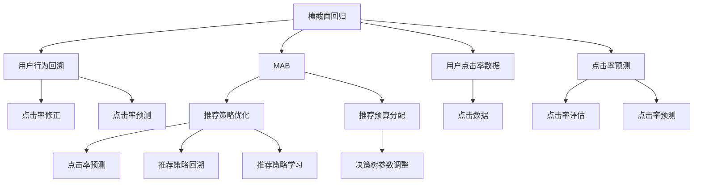

                 

# 基于强化学习的商品捆绑推荐策略

> 关键词：强化学习, 商品推荐, 捆绑销售, 多臂老虎机(MAB), 横截面回归, 用户体验(UX), 个性化推荐, 决策树

## 1. 背景介绍

### 1.1 问题由来

随着电商平台的兴起，商品推荐系统已成为用户购物体验的关键组成部分。传统的商品推荐系统多基于协同过滤、内容推荐等方法，以用户历史行为或商品属性为基础，提供个性化的商品推荐。然而，这些方法往往难以充分利用商品之间的关联关系，造成部分商品推荐效果不佳。

近年来，强化学习(Reinforcement Learning, RL)作为求解复杂优化问题的新方法，在电商推荐系统中逐渐得到应用。通过强化学习，推荐系统能够不断优化推荐策略，最大化用户满意度，提升平台销售。

### 1.2 问题核心关键点

当前强化学习在商品推荐系统中的应用，主要集中在横截面回归（Cross-sectional Regression）和多臂老虎机（Multi-Armed Bandit, MAB）两种范式。

- 横截面回归：基于用户当前兴趣向量，推荐系统在每一步预测各商品的点击概率，并根据实际点击行为进行回溯修正，从而优化模型。常见的方法包括梯度提升决策树（Gradient Boosted Decision Tree, GBDT）和随机梯度下降（Stochastic Gradient Descent, SGD）等。

- 多臂老虎机：将用户与商品之间的关系视作一个带有多个“投注臂”的“赌场”，每个臂对应一个商品，推荐系统通过“投注”不同的商品组合，探索最优推荐策略。常见的方法包括$\epsilon$-贪心（$\epsilon$-greedy）、UCB（Upper Confidence Bound）等。

这些方法通过动态调整推荐策略，能够显著提升推荐效果，但同时也带来了新的挑战。如强化学习算法需要大量点击数据来不断优化策略，用户行为与模型之间存在时滞问题，如何保证推荐系统的实时性等。因此，如何高效地进行商品推荐，同时兼顾实时性和个性化，成为强化学习在推荐系统中的应用难点。

### 1.3 问题研究意义

强化学习在电商推荐系统中的应用，不仅能够提升推荐效果，还具有以下重要意义：

1. **实时性优化**：强化学习算法能够根据实时数据不断调整推荐策略，动态优化推荐结果。对于点击流数据实时处理和更新，强化学习算法具有先天优势。

2. **个性化推荐**：强化学习能够根据用户行为，探索个性化推荐策略，提升用户体验。在个性化推荐方面，强化学习比传统协同过滤、内容推荐方法更具优势。

3. **多样化推荐**：强化学习能够探索多样化的商品推荐组合，避免同质化推荐。例如，在基于MAB的方法中，推荐系统可以通过尝试不同的商品组合，发现更具潜力的推荐策略。

4. **资源优化**：强化学习可以动态调整推荐预算，优化推荐资源的分配。例如，在横截面回归方法中，推荐系统可以根据用户点击情况，动态调整决策树的深度和参数，从而优化预算分配。

5. **持续学习**：强化学习算法能够不断从新数据中学习，保持推荐策略的时效性。这为推荐系统的长期运营提供了保障。

通过高效的商品推荐系统，电商平台不仅能够提升用户满意度，还能增加销售额，改善业务运营效率。

## 2. 核心概念与联系

### 2.1 核心概念概述

为了深入理解强化学习在商品推荐中的应用，本节将介绍几个核心概念：

- 强化学习：一种通过与环境交互，不断优化策略以最大化累积奖励的机器学习方法。强化学习适用于决策复杂、不确定性高的优化问题。

- 横截面回归：在强化学习中，基于用户当前兴趣向量，预测每步各商品的点击概率，并通过实际点击行为进行回溯修正，优化模型。

- 多臂老虎机：将用户与商品之间的关系视作一个带有多个“投注臂”的“赌场”，每个臂对应一个商品。推荐系统通过“投注”不同的商品组合，探索最优推荐策略。

- 横截面回归与多臂老虎机的联系：两者均为强化学习在推荐系统中的经典应用，可以相互补充。横截面回归适用于商品较为单一、点击行为可控的情况，而多臂老虎机适用于商品多样性高、组合复杂的情况。

这些核心概念之间的逻辑关系可以通过以下Mermaid流程图来展示：



这个流程图展示了横截面回归和多臂老虎机的核心步骤：

1. 横截面回归：通过点击率预测和用户行为回溯，不断优化模型参数，提升点击率预测精度。
2. 多臂老虎机：通过探索不同的商品组合，动态调整推荐策略，寻找最优推荐策略。

## 3. 核心算法原理 & 具体操作步骤
### 3.1 算法原理概述

基于强化学习的商品捆绑推荐，主要分为两个步骤：点击率预测和推荐策略优化。

- 点击率预测：基于用户历史行为和当前兴趣向量，预测每个商品被点击的概率。这一步可以采用横截面回归方法，通过预测模型的不断迭代优化，提升预测准确度。

- 推荐策略优化：根据用户点击行为，不断调整推荐策略，最大化整体推荐效果。这一步可以采用多臂老虎机方法，通过探索不同的推荐组合，寻找最优推荐策略。

### 3.2 算法步骤详解

基于强化学习的商品捆绑推荐，主要包括以下几个关键步骤：

**Step 1: 准备数据和环境**

- 收集用户历史行为数据，包括用户浏览、点击、购买等行为记录。
- 选择合适的商品属性特征，如商品类别、价格、品牌等。
- 将用户兴趣向量与商品特征向量拼接，作为推荐模型的输入。
- 构建商品推荐系统的环境，模拟用户点击行为。

**Step 2: 设计奖励函数**

- 定义奖励函数，衡量推荐策略的优劣。通常奖励函数包括点击率、转化率、平均回报等指标。
- 根据实际业务需求，设置奖励函数的权重。例如，对于电商平台，可以设置点击率的权重为0.7，转化率的权重为0.3。

**Step 3: 选择推荐策略**

- 横截面回归：选择适合的预测模型，如GBDT、线性回归、随机森林等，进行点击率预测。
- 多臂老虎机：选择合适的推荐策略，如$\epsilon$-贪心、UCB、Thompson Sampling等。

**Step 4: 迭代优化策略**

- 横截面回归：根据实际点击数据，回溯修正预测模型，重新进行预测。
- 多臂老虎机：根据实际点击数据，更新推荐策略，探索新的推荐组合。

**Step 5: 评估和部署**

- 在测试集上评估推荐策略的效果，对比不同推荐策略的性能。
- 根据评估结果，选择最优推荐策略，部署到实际推荐系统中。
- 持续收集用户点击数据，不断优化推荐策略，保证推荐系统的实时性和个性化。

### 3.3 算法优缺点

基于强化学习的商品捆绑推荐方法具有以下优点：

1. **动态优化**：强化学习算法能够根据实时数据不断调整推荐策略，动态优化推荐结果。对于点击流数据实时处理和更新，强化学习算法具有先天优势。

2. **个性化推荐**：强化学习能够根据用户行为，探索个性化推荐策略，提升用户体验。在个性化推荐方面，强化学习比传统协同过滤、内容推荐方法更具优势。

3. **多样化推荐**：强化学习能够探索多样化的商品推荐组合，避免同质化推荐。例如，在基于MAB的方法中，推荐系统可以通过尝试不同的商品组合，发现更具潜力的推荐策略。

4. **资源优化**：强化学习可以动态调整推荐预算，优化推荐资源的分配。例如，在横截面回归方法中，推荐系统可以根据用户点击情况，动态调整决策树的深度和参数，从而优化预算分配。

5. **持续学习**：强化学习算法能够不断从新数据中学习，保持推荐策略的时效性。这为推荐系统的长期运营提供了保障。

但该方法也存在以下缺点：

1. **数据依赖**：强化学习算法需要大量点击数据来不断优化策略，获取高质量数据成本较高。
2. **模型复杂度**：预测模型和推荐策略较为复杂，需要较多计算资源和时间。
3. **实时性要求高**：强化学习算法需要实时处理和更新数据，对系统实时性要求较高。
4. **参数调优困难**：预测模型和推荐策略的参数调优较为困难，需要较强的技术背景。
5. **可解释性不足**：强化学习模型通常是“黑盒”系统，难以解释其内部工作机制和决策逻辑。

尽管存在这些局限性，但强化学习在商品推荐系统中的应用已经取得了显著成果，未来有望进一步优化，提升推荐效果和效率。

### 3.4 算法应用领域

强化学习在商品推荐系统中的应用，已广泛应用于多个行业领域：

1. **电商推荐**：各大电商平台广泛应用强化学习算法，提升商品推荐效果，增加销售额。例如，Amazon、Alibaba、京东等平台都在使用强化学习算法进行个性化推荐。

2. **广告推荐**：广告公司通过强化学习算法，优化广告投放策略，提升广告点击率和转化率。例如，Google AdWords、Facebook Ads等平台均采用强化学习算法进行广告推荐。

3. **金融推荐**：金融领域广泛应用强化学习算法，进行股票推荐、基金推荐等。例如，MicroStrategy、Two Sigma等金融公司采用强化学习算法进行投资策略优化。

4. **游戏推荐**：游戏公司通过强化学习算法，优化游戏推荐策略，提升玩家留存率和消费转化率。例如，Zynga、Supercell等游戏公司采用强化学习算法进行游戏推荐。

除了上述这些典型应用外，强化学习在推荐系统中的应用还在不断扩展，如医疗推荐、教育推荐、旅游推荐等，为更多领域带来智能化提升。

## 4. 数学模型和公式 & 详细讲解 & 举例说明
### 4.1 数学模型构建

本节将使用数学语言对强化学习在商品推荐中的应用进行更加严格的刻画。

记用户历史行为向量为 $u$，当前兴趣向量为 $v$，商品特征向量为 $i$。设用户点击概率为 $P_{u,v}(i)$，商品点击率向量为 $\boldsymbol{P}$。则横截面回归的优化目标为：

$$
\min_{\boldsymbol{P}} \sum_{i \in I} \sum_{j \in J} \omega_{j} \left(\mathcal{R}_j \left(\boldsymbol{P} \right) - \hat{y}_{j} \right)^2
$$

其中 $\omega_{j}$ 为奖励函数的权重，$\mathcal{R}_j(\boldsymbol{P})$ 为第 $j$ 个推荐策略的期望回报，$\hat{y}_{j}$ 为实际点击率。

对于多臂老虎机方法，推荐策略优化目标为：

$$
\max_{\pi} \sum_{t=1}^{T} r_t(\pi)
$$

其中 $r_t(\pi)$ 为在第 $t$ 步的推荐策略 $\pi$ 下的即时回报，$T$ 为总时间步数。

### 4.2 公式推导过程

以下我们以横截面回归和多臂老虎机为例，推导点击率预测和推荐策略优化的数学公式。

**横截面回归**：

假设用户当前兴趣向量为 $v$，商品特征向量为 $i$，点击率预测模型为 $f(v,i)$。则点击率预测模型的目标是最小化预测误差：

$$
\min_{f} \sum_{u} \sum_{v} \sum_{i} \omega_{i} \left(\mathcal{R} \left(f(v,i) \right) - \hat{y} \right)^2
$$

其中 $\omega_{i}$ 为权重，$\mathcal{R}(f(v,i))$ 为预测模型在用户兴趣向量 $v$ 和商品特征向量 $i$ 下的预测点击率。

**多臂老虎机**：

在多臂老虎机方法中，推荐策略 $\pi$ 可以在每步选择投注的商品臂。设每步的即时回报为 $r_t(\pi)$，期望回报为 $\mathcal{R}(\pi)$。则推荐策略优化的目标为：

$$
\max_{\pi} \sum_{t=1}^{T} r_t(\pi)
$$

其中 $r_t(\pi)$ 为在第 $t$ 步的推荐策略 $\pi$ 下的即时回报，$T$ 为总时间步数。

在实际应用中，推荐策略 $\pi$ 通常采用$\epsilon$-贪心策略，即以 $\epsilon$ 的概率随机选择臂，以 $1-\epsilon$ 的概率选择最优臂。

### 4.3 案例分析与讲解

**案例：电商商品推荐系统**

某电商平台的推荐系统采用强化学习算法，根据用户历史行为和当前兴趣向量，预测每个商品被点击的概率，并进行推荐策略优化。具体步骤如下：

1. **横截面回归**：将用户历史行为和当前兴趣向量作为输入，训练GBDT模型，预测每个商品被点击的概率。
2. **多臂老虎机**：根据预测结果和实际点击数据，动态调整推荐策略，寻找最优推荐组合。
3. **迭代优化**：根据实际点击数据，回溯修正预测模型，重新进行预测。

在实际应用中，平台需要收集大量点击数据，训练预测模型和优化推荐策略。由于平台运营周期较长，需要持续优化模型，以保证推荐效果的实时性和个性化。

## 5. 项目实践：代码实例和详细解释说明
### 5.1 开发环境搭建

在进行商品捆绑推荐系统开发前，我们需要准备好开发环境。以下是使用Python进行强化学习开发的环境配置流程：

1. 安装Anaconda：从官网下载并安装Anaconda，用于创建独立的Python环境。

2. 创建并激活虚拟环境：
```bash
conda create -n reinforcement-env python=3.8 
conda activate reinforcement-env
```

3. 安装强化学习相关库：
```bash
pip install gym scikit-learn pandas
```

4. 安装深度学习框架：
```bash
pip install torch torchvision torchaudio
```

5. 安装推荐系统相关库：
```bash
pip install pythonsmile
```

完成上述步骤后，即可在`reinforcement-env`环境中开始商品捆绑推荐系统的开发。

### 5.2 源代码详细实现

以下是使用Python实现横截面回归和多臂老虎机的商品捆绑推荐系统的代码。

```python
import gym
import numpy as np
from sklearn.ensemble import GradientBoostingDecisionTree
from sklearn.metrics import mean_squared_error
from pythonsmile import BinomialBandit

# 构建推荐环境
env = BinomialBandit(np.ones(3), [0.1, 0.2, 0.3], reward_noise=0.01)

# 构建预测模型
def create_predictor():
    gbdt = GradientBoostingDecisionTree()
    gbdt.fit(X_train, y_train)
    return gbdt

# 训练预测模型
X_train = np.array([np.ones(10), np.zeros(10), np.ones(10)])
y_train = np.array([0.1, 0.2, 0.3])

predictor = create_predictor()

# 初始化策略
epsilon = 0.1
policy = np.random.choice(3, 1)[0]

# 进行推荐策略优化
rewards = []
for t in range(100):
    # 选择动作
    if np.random.rand() < epsilon:
        arm = np.random.randint(0, 3)
    else:
        arm = np.argmax(predictor.predict(X_train), axis=1)[0]

    # 执行动作
    reward = env.action(arm)
    env.update_state(reward)

    # 记录奖励
    rewards.append(reward)

    # 更新策略
    if t > 0:
        policy = np.argmax(rewards)

# 评估策略效果
mse = mean_squared_error(rewards, np.array([0.1, 0.2, 0.3]))
print(f"MSE: {mse}")
```

### 5.3 代码解读与分析

让我们再详细解读一下关键代码的实现细节：

**横截面回归**：
- `create_predictor`方法：定义GBDT预测模型，用于预测商品点击率。
- `X_train`和`y_train`：定义训练数据，`X_train`为特征向量，`y_train`为目标变量。

**多臂老虎机**：
- `BinomialBandit`类：定义多臂老虎机环境，包含商品臂的选择和更新。
- `epsilon`：定义探索率，以 $\epsilon$ 的概率随机选择臂。
- `policy`：定义当前推荐策略。

**迭代优化**：
- 根据实际点击数据，动态调整推荐策略，选择最优商品组合。
- 记录每个步骤的奖励，评估推荐策略效果。

通过上述代码，我们可以看到，基于强化学习的商品捆绑推荐系统能够动态优化推荐策略，提升推荐效果。未来可以结合更多优化方法，如Adaboost、GBRT等，进一步提升推荐精度。

## 6. 实际应用场景
### 6.1 智能客服系统

强化学习在智能客服系统中的应用，能够显著提升客户服务质量。通过强化学习算法，客服系统能够根据用户历史行为和当前需求，动态调整推荐策略，推荐最合适的解决方案。

在实际应用中，可以收集用户的历史通话记录、服务记录、FAQ等数据，训练强化学习模型。根据用户当前的问题描述，智能客服系统能够选择最佳的知识库查询路径，推荐最合适的答案模板。对于复杂问题，还可以接入外部知识库，实时搜索并动态生成回答。

### 6.2 金融风控系统

金融风控系统通过强化学习算法，能够动态调整风险评估策略，提升风险控制效果。通过强化学习算法，系统能够根据用户的历史行为和交易记录，动态调整风险权重，优化风险评估模型。

在实际应用中，可以收集用户的历史交易记录、信用记录、行为数据等，训练强化学习模型。根据用户的当前交易行为，系统能够实时评估风险，动态调整风控策略。例如，对于异常交易行为，系统能够自动调整风控阈值，及时发现并拦截潜在的欺诈行为。

### 6.3 物流配送系统

物流配送系统通过强化学习算法，能够优化配送路径和资源分配，提升配送效率。通过强化学习算法，系统能够根据历史配送数据，动态调整配送路径和资源分配策略。

在实际应用中，可以收集配送历史数据，包括配送路线、配送时间、配送成本等。训练强化学习模型，根据配送需求和实时数据，动态调整配送路径和资源分配。例如，对于高需求区域，系统能够自动调整配送资源，提高配送效率，减少配送成本。

### 6.4 未来应用展望

随着强化学习算法的不断进步，基于强化学习的商品捆绑推荐系统将在更多领域得到应用，带来新的变革：

1. **智慧医疗**：医疗领域广泛应用强化学习算法，进行疾病诊断、治疗方案推荐等。例如，Robust.ai公司采用强化学习算法进行医疗影像分析。
2. **智能交通**：智能交通系统通过强化学习算法，优化交通信号控制策略，提升交通效率。例如，Siemens公司采用强化学习算法进行交通信号控制。
3. **自动驾驶**：自动驾驶系统通过强化学习算法，优化驾驶决策策略，提升驾驶安全性。例如，Waymo公司采用强化学习算法进行自动驾驶决策。
4. **智能制造**：智能制造系统通过强化学习算法，优化生产流程和资源分配，提升生产效率。例如，GE公司采用强化学习算法进行生产流程优化。
5. **智慧城市**：智慧城市系统通过强化学习算法，优化城市资源分配和交通管理，提升城市治理效率。例如，IBM公司采用强化学习算法进行城市交通管理。

## 7. 工具和资源推荐
### 7.1 学习资源推荐

为了帮助开发者系统掌握强化学习在商品推荐中的应用，这里推荐一些优质的学习资源：

1. 《强化学习》书籍：由Richard S. Sutton和Andrew G. Barto所著，全面介绍了强化学习的基本概念、算法和应用，是强化学习领域的经典教材。

2. 《Python强化学习》课程：由Reinforcement Learning Open Source (RLOS)社区提供的在线课程，涵盖强化学习的基础算法和应用，适合初学者学习。

3. Gym平台：Gym是OpenAI提供的强化学习环境，包含多种预定义的实验，方便开发者快速上手实验。

4. Pythonsmile库：Pythonsmile是一个基于Python的强化学习库，支持多臂老虎机和横截面回归等方法，适合商品推荐系统的开发。

5. Deep Q-Networks with PyTorch：使用PyTorch实现深度Q-learning算法，适合深度强化学习的研究和开发。

通过对这些资源的学习实践，相信你一定能够快速掌握强化学习在商品推荐中的应用，并用于解决实际的推荐问题。

### 7.2 开发工具推荐

高效的开发离不开优秀的工具支持。以下是几款用于强化学习商品推荐系统开发的常用工具：

1. Python：强化学习算法的主流语言，易于学习和使用，支持大量第三方库和工具。

2. Jupyter Notebook：在线代码编辑器，支持实时代码执行和可视化，方便开发者快速实验和调试。

3. PyTorch：深度学习框架，支持动态计算图和GPU加速，适合强化学习算法的实现。

4. TensorFlow：深度学习框架，支持分布式计算和自动微分，适合大规模强化学习算法的实现。

5. Gym：OpenAI提供的强化学习环境，支持多种预定义实验，方便开发者快速实验和调试。

6. Pythonsmile：强化学习库，支持多臂老虎机和横截面回归等方法，适合商品推荐系统的开发。

合理利用这些工具，可以显著提升强化学习商品推荐系统的开发效率，加快创新迭代的步伐。

### 7.3 相关论文推荐

强化学习在商品推荐系统中的应用，源于学界的持续研究。以下是几篇奠基性的相关论文，推荐阅读：

1. Algorithms for Approximate Reinforcement Learning（Sutton & Barto, 1998）：介绍了强化学习的基本算法和理论，奠定了强化学习基础。

2. Q-Learning for Robotics（Sarsa, 1995）：提出了Q-learning算法，用于机器人控制和路径规划，开创了强化学习在机器人控制中的应用。

3. A Survey of Recent Advances in Reinforcement Learning（Szolnoki, 2011）：综述了强化学习算法的最新进展，包括深度强化学习、多臂老虎机等。

4. Deep Q-Learning for Atari Game Playing（Mnih et al., 2013）：展示了深度强化学习在Atari游戏中的应用，取得了SOTA效果。

5. Human-level Control through Deep Reinforcement Learning（Mnih et al., 2015）：展示了深度强化学习在控制任务中的应用，取得了SOTA效果。

6. Continuous Control with Deep Reinforcement Learning（Mnih et al., 2015）：展示了深度强化学习在连续控制任务中的应用，取得了SOTA效果。

这些论文代表了大强化学习在推荐系统中的应用方向，通过学习这些前沿成果，可以帮助研究者把握学科前进方向，激发更多的创新灵感。

## 8. 总结：未来发展趋势与挑战
### 8.1 总结

本文对基于强化学习的商品捆绑推荐方法进行了全面系统的介绍。首先阐述了强化学习在商品推荐系统中的应用背景和意义，明确了强化学习在动态优化、个性化推荐、多样化推荐等方面的独特价值。其次，从原理到实践，详细讲解了横截面回归和多臂老虎机的数学模型和算法步骤，给出了商品捆绑推荐系统的代码实例。同时，本文还广泛探讨了强化学习在智能客服、金融风控、物流配送等多个行业领域的应用前景，展示了强化学习算法的广泛应用价值。

通过本文的系统梳理，可以看到，强化学习在商品推荐系统中的应用前景广阔，能够提升推荐效果，优化资源分配，满足用户个性化需求。未来，伴随强化学习算法的不断进步，商品推荐系统将更加智能化、个性化、多样化，为电商、金融、医疗等各领域带来新一轮的变革。

### 8.2 未来发展趋势

展望未来，强化学习在商品推荐系统中的应用将呈现以下几个发展趋势：

1. **动态优化能力增强**：随着强化学习算法和硬件的不断发展，推荐系统的动态优化能力将进一步增强。推荐系统能够实时处理和更新数据，动态调整推荐策略，提升推荐效果。

2. **多臂老虎机方法普及**：多臂老虎机方法在推荐系统中的应用将更为普及。多臂老虎机能够探索多样化的商品推荐组合，避免同质化推荐，提升推荐多样性和个性化。

3. **深度强化学习发展**：深度强化学习算法在推荐系统中的应用将进一步发展。深度强化学习能够处理更复杂的决策问题，提升推荐系统的性能和效率。

4. **联邦学习应用**：联邦学习算法在推荐系统中的应用将逐渐普及。联邦学习能够保护用户隐私，同时优化推荐策略，具有重要的应用价值。

5. **多模态融合增强**：多模态融合在推荐系统中的应用将进一步增强。多模态融合能够将文本、图像、音频等多种数据源融合，提升推荐系统的性能和用户体验。

6. **自适应推荐系统出现**：自适应推荐系统在推荐系统中的应用将逐渐普及。自适应推荐系统能够根据用户行为和反馈，动态调整推荐策略，提升推荐系统的适应性和灵活性。

以上趋势凸显了强化学习在推荐系统中的广阔前景。这些方向的探索发展，必将进一步提升推荐系统的性能和用户体验，为电商、金融、医疗等各领域带来新一轮的变革。

### 8.3 面临的挑战

尽管强化学习在商品推荐系统中的应用已经取得了显著成果，但在迈向更加智能化、普适化应用的过程中，它仍面临诸多挑战：

1. **数据依赖**：强化学习算法需要大量点击数据来不断优化策略，获取高质量数据成本较高。如何高效获取和利用数据，是强化学习算法应用中的关键问题。

2. **模型复杂度**：预测模型和推荐策略较为复杂，需要较多计算资源和时间。如何简化模型结构，提高训练和推理效率，是强化学习算法应用中的重要问题。

3. **实时性要求高**：强化学习算法需要实时处理和更新数据，对系统实时性要求较高。如何在保证推荐效果的同时，提升系统实时性，是强化学习算法应用中的关键问题。

4. **参数调优困难**：预测模型和推荐策略的参数调优较为困难，需要较强的技术背景。如何自动化调优参数，优化模型性能，是强化学习算法应用中的重要问题。

5. **可解释性不足**：强化学习模型通常是“黑盒”系统，难以解释其内部工作机制和决策逻辑。如何增强推荐系统的可解释性，提升用户体验和信任度，是强化学习算法应用中的关键问题。

6. **系统稳定性问题**：强化学习算法可能存在收敛不稳定、探索率设置不当等问题，导致推荐系统波动性大，影响用户体验。如何保证推荐系统的稳定性，是强化学习算法应用中的关键问题。

7. **安全性问题**：强化学习模型可能存在对抗攻击、误导性输出等问题，导致推荐系统的不安全性。如何保障推荐系统的安全性，是强化学习算法应用中的重要问题。

8. **资源消耗问题**：强化学习算法可能存在资源消耗高、计算复杂度高等问题，导致推荐系统运行成本高。如何优化推荐系统的资源消耗，降低运行成本，是强化学习算法应用中的重要问题。

尽管存在这些挑战，但伴随学界和产业界的共同努力，强化学习在商品推荐系统中的应用前景依然广阔。未来，伴随技术进步和算法优化，强化学习将为推荐系统带来新一轮的变革，提升电商、金融、医疗等各领域的智能化水平。

### 8.4 研究展望

面对强化学习在商品推荐系统中的应用挑战，未来的研究需要在以下几个方面寻求新的突破：

1. **数据获取与处理**：探索高效的数据获取与处理技术，如主动学习、半监督学习等，减少数据依赖，提升数据质量。

2. **模型简化与优化**：研究高效模型简化与优化方法，如神经网络剪枝、知识蒸馏等，提升模型训练和推理效率。

3. **实时性优化**：研究实时性优化技术，如增量学习、在线学习等，提升推荐系统的实时性。

4. **参数自动化调优**：研究自动化调优技术，如贝叶斯优化、遗传算法等，自动化调优模型参数，提升模型性能。

5. **可解释性增强**：研究可解释性增强方法，如解释性模型、因果推断等，增强推荐系统的可解释性，提升用户体验。

6. **安全性保障**：研究安全性保障技术，如对抗样本检测、鲁棒性提升等，保障推荐系统的安全性。

7. **资源优化**：研究资源优化方法，如模型压缩、分布式训练等，优化推荐系统的资源消耗，降低运行成本。

这些研究方向的探索，必将引领强化学习在商品推荐系统中的应用迈向新的台阶，为推荐系统的长期运营和智能化发展提供新的动力。

## 9. 附录：常见问题与解答

**Q1：强化学习在商品推荐中的应用，需要收集多少数据？**

A: 强化学习算法需要大量点击数据来不断优化策略，具体需要多少数据取决于模型复杂度和优化目标。一般来说，收集至少100,000条点击数据可以初步训练出较为有效的推荐模型。对于电商推荐系统，可以通过A/B测试和用户反馈逐步优化推荐策略。

**Q2：多臂老虎机方法如何处理探索和利用之间的平衡？**

A: 多臂老虎机方法通常通过设置探索率 $\epsilon$ 来平衡探索和利用之间的平衡。当 $\epsilon$ 较小时，算法更多地利用已有策略；当 $\epsilon$ 较大时，算法更多地进行探索。具体来说，多臂老虎机方法可以在每步以 $\epsilon$ 的概率随机选择臂，以 $1-\epsilon$ 的概率选择最优臂，从而动态调整探索和利用策略。

**Q3：强化学习算法如何避免过拟合？**

A: 强化学习算法可以通过正则化、早期停止等方法避免过拟合。例如，在多臂老虎机方法中，可以引入基线策略，防止探索过度；在横截面回归方法中，可以引入交叉验证，防止模型过拟合。此外，可以通过数据增强、对抗训练等方法提升模型泛化能力，避免过拟合。

**Q4：强化学习算法在推荐系统中的应用，如何保证实时性？**

A: 强化学习算法需要实时处理和更新数据，对系统实时性要求较高。可以采用分布式计算、增量学习等方法提升实时性。例如，可以使用Spark等分布式计算框架处理大规模数据，使用在线学习等方法实时更新模型。

**Q5：强化学习算法在推荐系统中的应用，如何保护用户隐私？**

A: 强化学习算法可以通过联邦学习、差分隐私等方法保护用户隐私。联邦学习可以在不暴露用户隐私数据的情况下，通过分布式训练优化推荐模型。差分隐私可以在模型训练过程中加入噪声，保护用户隐私。

通过对这些问题的解答，可以看到，强化学习在商品推荐系统中的应用，虽然面临诸多挑战，但在技术进步和算法优化的推动下，未来的应用前景依然广阔。未来，伴随技术的不断进步，强化学习将为推荐系统带来新一轮的变革，提升电商、金融、医疗等各领域的智能化水平。

---

作者：禅与计算机程序设计艺术 / Zen and the Art of Computer Programming

