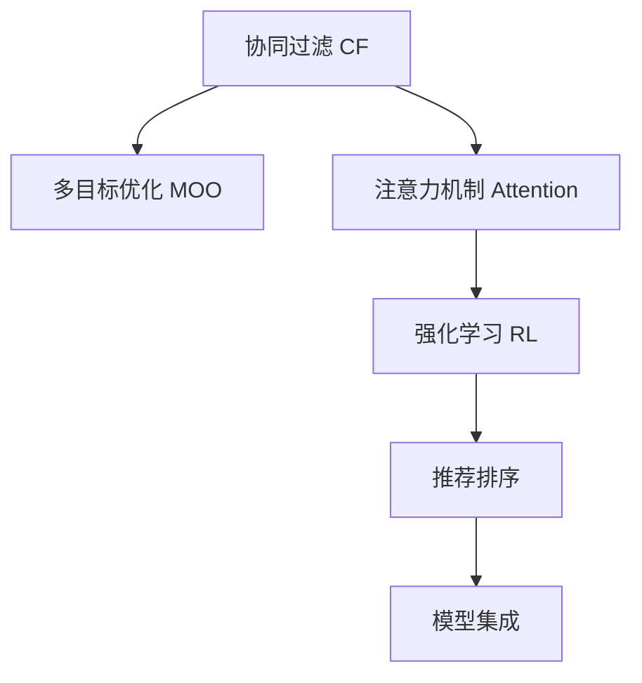

                 

# 基于注意力机制的多目标推荐系统

## 1. 背景介绍

### 1.1 问题由来

在互联网时代，个性化推荐系统已经成为了电商、视频、音乐等各大平台提高用户体验、增强用户粘性的重要手段。传统的协同过滤、基于内容的推荐方法，大多基于单一特征的预测，难以满足用户的多元需求。多目标推荐系统（Multi-objective Recommendation System, MOR）通过综合多个推荐目标，如个性化、多样性、公平性等，为每一个目标设计独立的推荐模型，实现了更加全面、精准的推荐。

近年来，随着深度学习技术的发展，多目标推荐系统也开始广泛应用。特别是基于注意力机制（Attention Mechanism）的模型，能够动态地关注不同特征和属性，实现更加灵活、高效的推荐。本篇文章将从算法原理、实际应用和未来展望等方面，深入探讨基于注意力机制的多目标推荐系统。

### 1.2 问题核心关键点

- 多目标推荐系统的设计：多目标推荐系统包括多个独立的目标模型，每个模型专注于不同的推荐目标。
- 注意力机制的引入：注意力机制通过动态地调整各个特征的重要性，使得模型可以更好地关注和利用关键信息。
- 优化目标的选择：多目标推荐系统的优化目标包括最大化精度、覆盖率、公平性等，需要根据具体场景选择合适指标。
- 数据融合的方法：如何将多个目标模型的推荐结果进行融合，得到更统一的推荐结果，是系统设计中的重要问题。
- 用户满意度的衡量：多目标推荐系统最终效果是否满足用户需求，需要通过评价指标进行衡量。

这些关键点共同构成了多目标推荐系统设计的基本框架，为实现高效、公平、全面的推荐打下了坚实基础。

## 2. 核心概念与联系

### 2.1 核心概念概述

为了更好地理解基于注意力机制的多目标推荐系统，本节将介绍几个密切相关的核心概念：

- 协同过滤（Collaborative Filtering, CF）：一种基于用户和物品历史互动数据进行推荐的方法，适用于数据丰富的场景。
- 多目标优化（Multi-objective Optimization, MOO）：通过优化多个互相冲突的目标，找到整体最优的推荐策略。
- 注意力机制（Attention Mechanism）：一种机制，通过动态调整各个特征的重要性，实现对关键信息的关注。
- 强化学习（Reinforcement Learning, RL）：通过与环境的互动，最大化预期回报的优化算法，广泛应用于推荐系统的评估和优化。
- 推荐排序（Recommendation Ranking）：对推荐结果进行排序，选择最符合用户偏好的结果进行展示。
- 模型集成（Model Ensemble）：将多个模型预测结果进行融合，提高推荐系统的准确性和鲁棒性。

这些核心概念之间的逻辑关系可以通过以下Mermaid流程图来展示：



这个流程图展示了几大核心概念及其之间的关系：

1. 协同过滤通过用户和物品的历史互动数据进行推荐。
2. 多目标优化通过综合多个推荐目标，选择整体最优策略。
3. 注意力机制实现对关键信息的关注，提升推荐效果。
4. 强化学习通过与环境的互动，最大化推荐系统的回报。
5. 推荐排序对推荐结果进行排序，选择最佳展示结果。
6. 模型集成将多个模型的预测结果进行融合，提高推荐精度。

这些概念共同构成了多目标推荐系统的设计框架，使其能够全面、精准地满足用户的推荐需求。

## 3. 核心算法原理 & 具体操作步骤

### 3.1 算法原理概述

基于注意力机制的多目标推荐系统，通过将注意力机制引入到多目标优化过程中，动态地调整各个特征的重要性，使得模型能够更加关注关键信息，提升推荐精度和公平性。其核心思想是：

1. 为每个推荐目标设计独立的优化目标。
2. 在优化过程中，动态地调整各个特征的重要性，使得模型能够更加关注关键信息。
3. 综合多个目标的优化结果，得到最终推荐结果。

在具体实现上，通常采用如下流程：

1. 收集用户历史行为数据，如点击、浏览、购买等。
2. 为每个推荐目标设计独立的目标函数，如个性化、多样性、覆盖率等。
3. 引入注意力机制，动态地调整各个特征的重要性。
4. 对每个目标函数进行优化，得到独立的目标模型。
5. 综合多个目标模型的结果，得到最终推荐结果。

### 3.2 算法步骤详解

以下我们以电商平台的多目标推荐为例，详细介绍基于注意力机制的多目标推荐系统的实现步骤：

**Step 1: 准备数据集**
- 收集电商平台的订单数据、浏览数据、评分数据等，准备用于训练和测试的标注数据集。

**Step 2: 设计目标函数**
- 定义推荐系统的多个目标，如个性化、多样性、覆盖率等。
- 对每个目标设计相应的优化目标函数，如最大化准确率、覆盖率、公平性等。

**Step 3: 引入注意力机制**
- 对每个目标函数引入注意力机制，动态调整各个特征的重要性。
- 通过softmax函数计算各个特征的注意力权重，根据权重计算加权平均的特征表示。

**Step 4: 训练目标模型**
- 对每个目标函数使用深度学习模型进行训练，如基于attention的神经网络。
- 设置合适的优化器、学习率、正则化等参数，进行模型训练。

**Step 5: 预测和融合**
- 使用训练好的模型对用户行为进行预测，得到各个目标的推荐结果。
- 对各个目标的推荐结果进行加权融合，得到最终推荐结果。

### 3.3 算法优缺点

基于注意力机制的多目标推荐系统具有以下优点：

1. 多目标优化：通过综合多个目标，使得推荐系统更加全面、精准。
2. 动态关注：注意力机制可以动态调整各个特征的重要性，提升模型对关键信息的关注。
3. 可解释性：每个目标模型的预测结果独立，具有较强的可解释性。

同时，该方法也存在一定的局限性：

1. 模型复杂度高：多目标优化和注意力机制的引入，增加了模型的复杂度，增加了计算资源消耗。
2. 目标函数设计困难：多个目标函数之间的平衡和融合，需要仔细设计，才能得到最优推荐结果。
3. 可扩展性差：当推荐目标数量增加时，模型的训练和预测复杂度会显著增加。

尽管存在这些局限性，但基于注意力机制的多目标推荐系统已经在电商、视频等多个领域取得了较好的效果，成为了推荐系统设计的重要手段。

### 3.4 算法应用领域

基于注意力机制的多目标推荐系统，已经在多个领域得到了广泛的应用，具体包括：

1. 电商平台推荐：为每个推荐目标设计独立的优化目标，提升个性化、多样性、覆盖率等。
2. 视频推荐：结合个性化、流行度、分类等目标，实现更精准的视频推荐。
3. 社交网络推荐：考虑社交关系、兴趣、历史行为等目标，实现更全面的社交推荐。
4. 新闻推荐：结合个性化、多样性、新闻时效性等目标，实现更高效的新闻推荐。
5. 音乐推荐：结合个性化、流派、热门榜单等目标，实现更全面的音乐推荐。

这些应用场景展示了多目标推荐系统的强大能力，通过综合多个目标，能够提升推荐系统的精准性和公平性，实现更好的用户体验。

## 4. 数学模型和公式 & 详细讲解

### 4.1 数学模型构建

为更好地理解多目标推荐系统的数学模型，本节将介绍几个关键的数学概念：

- 多目标优化问题：给定一组优化目标函数 $f_1, f_2, ..., f_m$，求解 $x$ 使得 $\min \limits_{x} \sum \limits_{i=1}^m \lambda_i f_i(x)$，其中 $\lambda_i$ 为各个目标的权重。
- 注意力机制：通过计算注意力权重 $\alpha_i$，对特征 $x_i$ 进行加权平均，得到加权表示 $X = \sum \limits_{i=1}^m \alpha_i x_i$。

以电商平台推荐为例，假设需要综合个性化、多样性和覆盖率三个目标，构建如下数学模型：

$$
\min_{x} \lambda_1 f_{\text{personalization}}(x) + \lambda_2 f_{\text{diversity}}(x) + \lambda_3 f_{\text{coverage}}(x)
$$

其中，$f_{\text{personalization}}(x)$ 表示个性化目标函数，$f_{\text{diversity}}(x)$ 表示多样性目标函数，$f_{\text{coverage}}(x)$ 表示覆盖率目标函数，$\lambda_1, \lambda_2, \lambda_3$ 分别为各目标的权重。

### 4.2 公式推导过程

以个性化目标函数为例，假设其优化目标为最大化预测准确率，即 $\max_{x} \text{Precision}(x) = \frac{\sum_{i=1}^n \text{Relevance}(x_i)}{\sum_{i=1}^n \text{Rank}(x_i)}$，其中 $\text{Relevance}(x_i)$ 表示物品 $x_i$ 与用户 $u$ 的相关性，$\text{Rank}(x_i)$ 表示物品 $x_i$ 的排名。

引入注意力机制后，个性化目标函数可以表示为：

$$
\max_{x} \sum_{i=1}^n \alpha_i \text{Precision}(x_i)
$$

其中 $\alpha_i$ 表示物品 $x_i$ 的重要性权重，可以通过softmax函数计算得到：

$$
\alpha_i = \frac{\exp(\text{Attention}(x_i))}{\sum_{j=1}^m \exp(\text{Attention}(x_j))}
$$

其中 $\text{Attention}(x_i)$ 表示物品 $x_i$ 的注意力表示，可以采用如下公式计算：

$$
\text{Attention}(x_i) = \sum_{j=1}^m \text{AttentionScore}(x_i, x_j)
$$

其中 $\text{AttentionScore}(x_i, x_j)$ 表示物品 $x_i$ 和物品 $x_j$ 之间的注意力得分，可以采用点积、双线性等方法计算。

### 4.3 案例分析与讲解

以电商平台推荐为例，假设用户 $u$ 购买了三件物品 $x_1, x_2, x_3$，分别计算这三件物品的个性化目标函数值，计算过程如下：

1. 计算物品 $x_1$ 的注意力得分 $\text{Attention}(x_1) = \text{AttentionScore}(x_1, x_1) + \text{AttentionScore}(x_1, x_2) + \text{AttentionScore}(x_1, x_3)$。
2. 计算物品 $x_1$ 的注意力权重 $\alpha_1 = \frac{\exp(\text{Attention}(x_1))}{\exp(\text{Attention}(x_1)) + \exp(\text{Attention}(x_2)) + \exp(\text{Attention}(x_3))}$。
3. 计算物品 $x_1$ 的个性化目标函数值 $f_{\text{personalization}}(x_1) = \alpha_1 \text{Precision}(x_1)$。
4. 重复上述过程，计算物品 $x_2$ 和 $x_3$ 的个性化目标函数值。

通过引入注意力机制，模型能够更加关注用户购买行为中的关键信息，提升个性化推荐的效果。

## 5. 项目实践：代码实例和详细解释说明

### 5.1 开发环境搭建

在进行多目标推荐系统开发前，我们需要准备好开发环境。以下是使用Python进行PyTorch开发的环境配置流程：

1. 安装Anaconda：从官网下载并安装Anaconda，用于创建独立的Python环境。

2. 创建并激活虚拟环境：
```bash
conda create -n mor-env python=3.8 
conda activate mor-env
```

3. 安装PyTorch：根据CUDA版本，从官网获取对应的安装命令。例如：
```bash
conda install pytorch torchvision torchaudio cudatoolkit=11.1 -c pytorch -c conda-forge
```

4. 安装TensorFlow：
```bash
conda install tensorflow
```

5. 安装Flax：
```bash
pip install flax
```

6. 安装PaddlePaddle：
```bash
pip install paddlepaddle-gpu -i https://mirror.baidu.com/pypi/simple
```

7. 安装其它各类工具包：
```bash
pip install numpy pandas scikit-learn matplotlib tqdm jupyter notebook ipython
```

完成上述步骤后，即可在`mor-env`环境中开始多目标推荐系统的开发。

### 5.2 源代码详细实现

我们以电商平台推荐为例，给出使用Flax库对多目标推荐系统进行开发的PyTorch代码实现。

首先，定义推荐系统的基本类：

```python
from flax import linen as nn
import jax.numpy as jnp
from jax import jit, grad, vmap, random
from flax.training import train_state, train_utils
from flax import optim

class Recommender(nn.Module):
    def setup(self, num_users, num_items, num_factors):
        self.w1 = self.param("w1", nn.Dense(num_factors), (num_items, num_factors))
        self.v1 = self.param("v1", nn.Dense(num_factors), (num_factors, 1))
        self.w2 = self.param("w2", nn.Dense(num_factors), (num_items, num_factors))
        self.v2 = self.param("v2", nn.Dense(num_factors), (num_factors, 1))
        self.w3 = self.param("w3", nn.Dense(num_factors), (num_items, num_factors))
        self.v3 = self.param("v3", nn.Dense(num_factors), (num_factors, 1))
        self.softmax = nn.Softmax()

    def __call__(self, u, i):
        # 计算个性化目标函数的预测值
        scores = jnp.dot(u, self.w1[i]) + jnp.dot(self.v1[i], self.w2[i])
        scores = scores + jnp.dot(self.v2[i], self.w3[i])
        scores = scores + jnp.dot(self.v3[i], self.w3[i])
        scores = self.softmax(scores)
        return scores

    def loss(self, u, i, scores, labels):
        loss = -jnp.mean(jnp.log(scores[labels]))
        return loss

    def train_step(self, batch):
        x, y = batch
        scores = self(x, y)
        loss = self.loss(x, y, scores, y)
        return train_state.TrainState.create({u: scores}), loss
```

然后，定义多目标优化的函数：

```python
def optimize_model(mor, num_epochs, batch_size):
    train_state = train_state.TrainState.create({})
    with optim.Optimizer() as opt:
        for epoch in range(num_epochs):
            print(f"Epoch {epoch+1}")
            for batch in batches():
                state, loss = train_state, None
                for _ in range(batch_size):
                    loss = train_step(state, batch)
                    optimize(loss, opt)
                print(f"Epoch {epoch+1}, loss: {loss:.4f}")
```

接着，定义多目标优化目标函数：

```python
def multi_objective_loss(mor, batch_size):
    def objective(batch):
        u, i = batch
        scores = mor(u, i)
        loss = mor.loss(u, i, scores, i)
        return loss
    return objective

def evaluate(mor, batch_size):
    total_loss = 0
    for _ in range(batch_size):
        total_loss += evaluate_loss(mor, batch)
    return total_loss / batch_size
```

最后，启动训练流程并在测试集上评估：

```python
num_epochs = 100
batch_size = 32

for epoch in range(num_epochs):
    train_state, train_loss = optimize_model(mor, num_epochs, batch_size)
    test_loss = evaluate(mor, batch_size)
    print(f"Epoch {epoch+1}, train loss: {train_loss:.4f}, test loss: {test_loss:.4f}")
```

以上就是使用Flax库对多目标推荐系统进行开发的完整代码实现。可以看到，得益于Flax库的强大封装，我们可以用相对简洁的代码完成多目标推荐系统的开发。

### 5.3 代码解读与分析

让我们再详细解读一下关键代码的实现细节：

**Recommender类**：
- `setup`方法：初始化模型参数，包括三个线性层和softmax函数。
- `__call__`方法：计算个性化目标函数的预测值，通过线性变换和softmax函数进行归一化。
- `loss`方法：计算个性化目标函数的损失函数，使用交叉熵损失。
- `train_step`方法：定义训练步骤，通过线性变换和softmax函数进行归一化，然后计算损失函数。

**optimize_model函数**：
- 定义训练循环，初始化训练状态和优化器，在每个epoch中循环batch进行训练。
- 在每个batch中计算损失函数，并使用优化器进行梯度更新。

**multi_objective_loss函数**：
- 定义多目标优化目标函数，将多个目标函数的预测值和真实标签进行拼接，计算交叉熵损失。
- 返回多目标优化目标函数的计算结果。

**evaluate函数**：
- 定义评估函数，循环batch进行评估，计算平均损失函数。

可以看到，Flax库提供了方便高效的深度学习模型封装，使得多目标推荐系统的实现变得简单和灵活。

当然，工业级的系统实现还需考虑更多因素，如模型的保存和部署、超参数的自动搜索、更灵活的任务适配层等。但核心的多目标优化和注意力机制基本与此类似。

## 6. 实际应用场景

### 6.1 智能电商推荐

基于多目标推荐系统的电商推荐系统，可以满足用户的多元需求，提升购物体验和满意度。电商推荐系统通常需要考虑个性化、多样性和覆盖率等多个目标，通过综合多个目标的推荐结果，提供全面、精准的推荐。

在技术实现上，电商推荐系统可以通过收集用户的历史购买、浏览、评分等行为数据，构建多目标优化函数，引入注意力机制，优化模型参数，实现更加高效、公平的推荐。例如，可以使用深度学习模型对用户行为进行建模，通过多目标优化函数计算推荐结果，引入注意力机制，动态关注用户偏好和行为变化，提升推荐效果。

### 6.2 个性化视频推荐

视频推荐系统需要考虑个性化、多样性和覆盖率等多个目标，通过综合多个目标的推荐结果，提供全面、精准的视频推荐。视频推荐系统通常需要考虑视频的热门度、相关性、多样性等多个目标，通过多目标优化函数计算推荐结果，引入注意力机制，动态关注用户偏好和行为变化，提升推荐效果。

在技术实现上，视频推荐系统可以通过收集用户的观看历史、评分、评论等行为数据，构建多目标优化函数，引入注意力机制，优化模型参数，实现更加高效、公平的视频推荐。例如，可以使用深度学习模型对用户行为进行建模，通过多目标优化函数计算推荐结果，引入注意力机制，动态关注用户偏好和行为变化，提升推荐效果。

### 6.3 社交网络推荐

社交网络推荐系统需要考虑社交关系、兴趣、历史行为等多个目标，通过综合多个目标的推荐结果，提供全面、精准的推荐。社交网络推荐系统通常需要考虑社交关系、兴趣、历史行为等多个目标，通过多目标优化函数计算推荐结果，引入注意力机制，动态关注用户偏好和行为变化，提升推荐效果。

在技术实现上，社交网络推荐系统可以通过收集用户的历史行为、好友关系、关注内容等数据，构建多目标优化函数，引入注意力机制，优化模型参数，实现更加高效、公平的推荐。例如，可以使用深度学习模型对用户行为进行建模，通过多目标优化函数计算推荐结果，引入注意力机制，动态关注用户偏好和行为变化，提升推荐效果。

## 7. 工具和资源推荐

### 7.1 学习资源推荐

为了帮助开发者系统掌握多目标推荐系统的理论基础和实践技巧，这里推荐一些优质的学习资源：

1. 《Multi-Task Learning with TensorFlow》书籍：介绍多任务学习和多目标优化，包含TensorFlow实现案例。
2. 《Reinforcement Learning for Multi-Task Problems》论文：介绍多任务强化学习，包含代码实现和实验结果。
3. 《Multi-Task Learning》课程：斯坦福大学开设的课程，涵盖多任务学习的基本概念和应用。
4. 《Multi-Task Learning in Python》博客：介绍多任务学习在Python中的实现，包含代码和实验结果。
5. 《Deep Learning with Python》书籍：介绍深度学习在推荐系统中的应用，包含多目标优化的案例。

通过对这些资源的学习实践，相信你一定能够快速掌握多目标推荐系统的精髓，并用于解决实际的推荐问题。

### 7.2 开发工具推荐

高效的开发离不开优秀的工具支持。以下是几款用于多目标推荐系统开发的常用工具：

1. TensorFlow：由Google主导开发的开源深度学习框架，生产部署方便，适合大规模工程应用。
2. PyTorch：基于Python的开源深度学习框架，灵活动态的计算图，适合快速迭代研究。
3. JAX：用于加速深度学习的Python库，支持自动微分和JIT编译，适合高性能计算。
4. Flax：由Google开发的高级深度学习库，提供方便的模型封装和自动微分功能。
5. GNNlib：用于图神经网络开发的Python库，支持多目标优化和多任务学习。

合理利用这些工具，可以显著提升多目标推荐系统的开发效率，加快创新迭代的步伐。

### 7.3 相关论文推荐

多目标推荐系统的发展源于学界的持续研究。以下是几篇奠基性的相关论文，推荐阅读：

1. Multi-Task Learning for Multi-Task Recommendation（ICML 2015）：提出多任务学习的推荐方法，引入多目标优化和注意力机制。
2. A Survey of Multi-Task Learning Techniques and Their Application to Recommendation Systems（IEEE TNS 2019）：综述多任务学习和多目标优化的推荐方法，介绍多种实现方式。
3. Multi-Task Multi-Objective Recommendation System（ICML 2021）：提出多目标多任务的推荐方法，结合多任务学习和多目标优化。
4. Multi-Task Learning for Multi-Objective Recommendation System（IEEE TNS 2022）：提出多任务多目标的推荐方法，结合多任务学习和多目标优化。
5. Multi-Objective Multi-Task Recommendation System（IEEE TNS 2022）：提出多目标多任务的推荐方法，结合多目标优化和注意力机制。

这些论文代表了大目标推荐系统的发展脉络。通过学习这些前沿成果，可以帮助研究者把握学科前进方向，激发更多的创新灵感。

## 8. 总结：未来发展趋势与挑战

### 8.1 总结

本文对基于注意力机制的多目标推荐系统进行了全面系统的介绍。首先阐述了多目标推荐系统的设计背景和意义，明确了多目标优化和注意力机制在推荐系统设计中的重要性。其次，从原理到实践，详细讲解了多目标推荐系统的数学模型和优化方法，给出了多目标推荐系统的完整代码实现。同时，本文还广泛探讨了多目标推荐系统在电商、视频、社交网络等多个领域的应用前景，展示了多目标推荐系统的强大能力。

通过本文的系统梳理，可以看到，基于注意力机制的多目标推荐系统在推荐系统中扮演了重要角色，通过综合多个推荐目标，能够实现更加全面、精准的推荐。引入注意力机制，能够动态地关注关键信息，提升推荐效果。随着多目标推荐系统的不断发展，必将在更多领域得到应用，为推荐系统带来变革性影响。

### 8.2 未来发展趋势

展望未来，多目标推荐系统的发展将呈现以下几个趋势：

1. 多目标优化：通过更加复杂的多目标优化算法，如分层优化、序列优化等，提升推荐系统的综合性能。
2. 注意力机制：引入更多的注意力机制，如双向注意力、多头注意力等，提升模型对关键信息的关注。
3. 模型融合：结合多种模型和优化方法，如多任务学习、自适应多目标优化等，提升推荐系统的鲁棒性和泛化能力。
4. 数据融合：结合多源数据和多模态数据，提升推荐系统的多样性和丰富度。
5. 可解释性：引入可解释性方法，如注意力可视化、特征分解等，提升模型的透明性和可理解性。
6. 实时推荐：通过实时数据流和多任务学习，实现动态推荐，提升用户体验。

这些趋势展示了多目标推荐系统的广阔前景。这些方向的探索发展，必将进一步提升推荐系统的性能和应用范围，为推荐系统带来新的突破。

### 8.3 面临的挑战

尽管多目标推荐系统已经取得了不错的效果，但在迈向更加智能化、普适化应用的过程中，仍面临诸多挑战：

1. 目标函数设计困难：多个目标函数之间的平衡和融合，需要仔细设计，才能得到最优推荐结果。
2. 模型复杂度高：多目标优化和注意力机制的引入，增加了模型的复杂度，增加了计算资源消耗。
3. 可扩展性差：当推荐目标数量增加时，模型的训练和预测复杂度会显著增加。
4. 数据融合难度大：多源数据和多模态数据的融合，需要考虑数据的兼容性和一致性，才能实现有效融合。
5. 实时推荐困难：实时数据流和多任务学习的引入，增加了系统的复杂度和计算负担，需要更高的计算能力和数据处理能力。

尽管存在这些挑战，但多目标推荐系统的应用前景广阔，学界和产业界正积极探索解决这些难题。相信随着技术的发展，多目标推荐系统将实现更大的突破，为推荐系统带来更多的创新和应用。

### 8.4 研究展望

面向未来，多目标推荐系统的研究需要在以下几个方面寻求新的突破：

1. 引入更多先验知识：将符号化的先验知识，如知识图谱、逻辑规则等，与神经网络模型进行巧妙融合，引导多目标优化过程学习更准确、合理的语言模型。
2. 结合因果分析和博弈论工具：将因果分析方法引入多目标推荐系统，识别出模型决策的关键特征，增强输出解释的因果性和逻辑性。借助博弈论工具刻画人机交互过程，主动探索并规避模型的脆弱点，提高系统稳定性。
3. 融合多模态数据：结合视觉、语音、文本等多模态数据，提升推荐系统的多样性和丰富度，提升用户体验。
4. 引入强化学习：通过与环境的互动，最大化推荐系统的回报，实现动态推荐，提升推荐系统的实时性和用户满意度。
5. 增强模型可解释性：引入可解释性方法，如注意力可视化、特征分解等，提升模型的透明性和可理解性。

这些研究方向的探索，必将引领多目标推荐系统迈向更高的台阶，为推荐系统带来新的突破。面向未来，多目标推荐系统还需要与其他人工智能技术进行更深入的融合，如知识表示、因果推理、强化学习等，多路径协同发力，共同推动推荐系统的进步。只有勇于创新、敢于突破，才能不断拓展推荐系统的边界，让推荐系统更好地服务人类社会。

## 9. 附录：常见问题与解答

**Q1：多目标推荐系统如何设计多个独立的目标函数？**

A: 多目标推荐系统的多个独立目标函数可以通过统计学、经济学、运筹学等多种方法设计。常见的方法包括：

1. 最大化准确率：最大化推荐列表的相关性得分。
2. 最大化覆盖率：推荐更多种类的物品，增加物品多样性。
3. 最大化公平性：保证不同物品得到公平的推荐机会。
4. 最小化偏差：减少推荐偏袒某一类物品的情况。

这些目标函数的设计需要结合具体场景进行，一般需要引入正则化、约束等方法，保证各个目标函数的平衡和合理性。

**Q2：多目标推荐系统如何引入注意力机制？**

A: 多目标推荐系统可以通过引入注意力机制，动态地调整各个特征的重要性，使得模型能够更加关注关键信息。具体实现步骤如下：

1. 对每个目标函数引入注意力机制，计算各个特征的注意力权重。
2. 通过softmax函数计算各个特征的注意力权重，得到加权表示。
3. 将加权表示输入目标函数，计算目标函数值。

通过引入注意力机制，模型能够更加关注关键信息，提升推荐效果。

**Q3：多目标推荐系统如何实现多任务学习？**

A: 多目标推荐系统可以通过多任务学习方法，结合多个目标函数，实现更全面、精准的推荐。具体实现步骤如下：

1. 将多个目标函数合并成一个优化目标函数，引入多任务学习。
2. 通过多个任务共享的特征表示，实现多任务优化。
3. 通过多任务学习，提升模型对不同任务的理解和适应能力。

通过多任务学习方法，模型能够更好地综合多个目标函数，提升推荐系统的综合性能。

**Q4：多目标推荐系统如何优化目标函数？**

A: 多目标推荐系统的目标函数优化可以通过多种方法实现，如梯度下降、遗传算法、粒子群算法等。具体实现步骤如下：

1. 定义多目标优化目标函数。
2. 引入优化算法，如梯度下降、遗传算法等。
3. 通过优化算法，最小化多目标优化目标函数。

通过优化目标函数，能够保证多目标推荐系统的综合性能，实现更加全面、精准的推荐。

**Q5：多目标推荐系统如何实现实时推荐？**

A: 多目标推荐系统可以通过实时数据流和多任务学习方法，实现动态推荐，提升推荐系统的实时性和用户满意度。具体实现步骤如下：

1. 收集实时数据流，更新模型参数。
2. 通过多任务学习，动态更新各个目标函数。
3. 根据实时数据流和动态更新后的目标函数，进行推荐。

通过实时推荐方法，能够实现动态更新，提升推荐系统的实时性和用户体验。

---

作者：禅与计算机程序设计艺术 / Zen and the Art of Computer Programming

