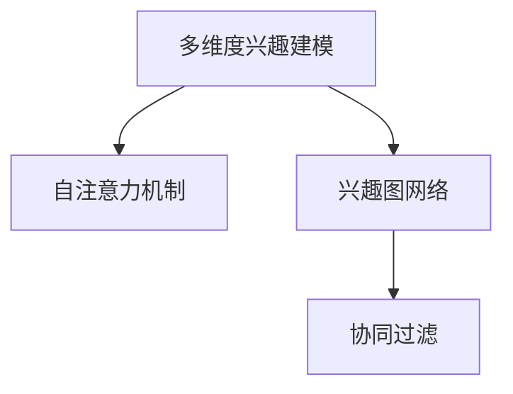

                 

# 基于自注意力机制的多维度兴趣建模

> 关键词：多维度兴趣建模, 自注意力机制, 兴趣图网络, 协同过滤, 深度学习

## 1. 背景介绍

随着电子商务平台的迅猛发展和智能推荐系统的广泛应用，用户行为分析已成为企业重要的决策支持手段。传统的推荐系统主要依赖用户的历史行为数据进行推荐，如浏览记录、购买历史等。但这些数据通常只反映了用户的部分兴趣，难以捕捉更广泛、多维度的用户兴趣。

本论文将聚焦于基于自注意力机制的多维度兴趣建模，提出一种新的协同过滤模型，结合了自注意力和图神经网络等技术，能够在多维用户兴趣数据中提取更深层次的协同信息，构建更加全面和准确的兴趣表示，从而提升推荐系统的性能。

## 2. 核心概念与联系

### 2.1 核心概念概述

为更好地理解本文提出的基于自注意力机制的多维度兴趣建模方法，本节将介绍几个密切相关的核心概念：

- **多维度兴趣建模(Multidimensional Interest Modeling)**：在推荐系统中，用户的行为不仅受到自身兴趣的影响，还与周围用户的相关性有关。通过多维度兴趣建模，能够更好地捕捉用户的多方面兴趣和复杂交互行为，构建更全面的用户兴趣表示。

- **自注意力机制(Self-Attention Mechanism)**：一种基于注意力机制的神经网络模块，能够对输入序列中的不同部分进行加权聚合，以提升模型的表达能力和泛化能力。

- **兴趣图网络(Graph-Based Interest Representation)**：基于图结构对用户兴趣进行建模的方法，通过捕捉用户间的交互关系，增强推荐系统的社交属性和个性化推荐能力。

- **协同过滤(Collaborative Filtering)**：推荐系统中最常用的技术之一，通过用户行为数据进行相似性度量，为用户推荐与历史行为相似的商品。

这些概念之间的逻辑关系可以通过以下Mermaid流程图来展示：



这个流程图展示了多维度兴趣建模的三个核心技术模块：自注意力机制、兴趣图网络和协同过滤。这些模块相互协作，共同构建更加全面和准确的推荐模型。

## 3. 核心算法原理 & 具体操作步骤
### 3.1 算法原理概述

基于自注意力机制的多维度兴趣建模方法，本质上是一种多维协同过滤技术。其核心思想是：通过构建用户兴趣的图结构，利用自注意力机制对图节点进行表示，结合用户历史行为数据，进行协同过滤推荐。

具体地，假设用户 $u$ 在 $n$ 个维度上的兴趣表示为 $x_u=[x_{u1},x_{u2},...,x_{un}]$，其中 $x_{uj}$ 表示用户 $u$ 在维度 $j$ 上的兴趣。同时，假设用户 $u$ 的邻居集为 $N(u)$，即与用户 $u$ 有交互关系的其他用户。则该方法的目标是：

1. 利用自注意力机制对用户 $u$ 及其邻居 $N(u)$ 的兴趣表示进行聚合，得到用户 $u$ 的综合兴趣表示 $x_u^*$。
2. 结合用户 $u$ 的历史行为数据，通过协同过滤算法，计算用户 $u$ 对每个商品 $i$ 的兴趣评分 $s_{ui}$。
3. 对所有商品进行排序，选择评分最高的商品作为推荐结果。

### 3.2 算法步骤详解

基于自注意力机制的多维度兴趣建模方法可以分为以下几个关键步骤：

**Step 1: 构建用户兴趣图**

首先，需要构建一个用户兴趣图，其中节点为用户，边表示用户间的兴趣相似度。可以利用用户历史行为数据计算用户间的兴趣相似度，或者通过协同过滤算法预测用户间的兴趣相似度。具体来说，可以使用余弦相似度、皮尔逊相关系数等方法计算用户间的相似度：

$$
sim(u,v) = cosine(x_u, x_v) = \frac{x_u \cdot x_v}{\Vert x_u \Vert \Vert x_v \Vert}
$$

其中，$cosine$ 表示余弦相似度，$\Vert x_u \Vert$ 表示向量 $x_u$ 的模长，$\cdot$ 表示向量点积。

**Step 2: 构建用户兴趣向量**

对于每个用户，通过自注意力机制构建其兴趣向量 $x_u^*$。假设用户 $u$ 的邻居集为 $N(u)$，则用户 $u$ 的兴趣向量计算公式为：

$$
x_u^* = \sum_{v \in N(u)} \alpha_{uv}x_v
$$

其中 $\alpha_{uv}$ 表示用户 $u$ 对用户 $v$ 的注意力权重，可以通过注意力机制计算得到：

$$
\alpha_{uv} = \frac{\exp(\text{scores}(u,v))}{\sum_{v' \in N(u)} \exp(\text{scores}(u,v'))}
$$

$\text{scores}(u,v)$ 表示用户 $u$ 和用户 $v$ 之间的注意力分数，可以表示为：

$$
\text{scores}(u,v) = x_u^T \text{attn}(x_v)
$$

其中，$\text{attn}$ 为自注意力机制的权重矩阵，可以通过如下公式计算：

$$
\text{attn}(x_v) = \text{softmax}(W_a x_v + b_a)
$$

$W_a$ 和 $b_a$ 为可训练的参数。

**Step 3: 协同过滤推荐**

对于每个用户，结合其兴趣向量 $x_u^*$ 和历史行为数据，通过协同过滤算法计算其对每个商品的兴趣评分。假设用户 $u$ 的历史行为数据为 $B_u=\{(i_1,r_{u1}),(i_2,r_{u2}),...(i_M,r_{uM})\}$，其中 $i_j$ 表示用户 $u$ 对商品 $j$ 的评分，$r_{uj}$ 表示用户 $u$ 对商品 $j$ 的评分。则用户 $u$ 对商品 $i$ 的兴趣评分可以表示为：

$$
s_{ui} = \text{sim}(u,i) \cdot r_{ui}
$$

其中，$\text{sim}(u,i)$ 表示用户 $u$ 和商品 $i$ 的相似度，可以通过余弦相似度、皮尔逊相关系数等方法计算得到：

$$
\text{sim}(u,i) = cosine(x_u^*, f_i)
$$

$f_i$ 表示商品 $i$ 的兴趣表示，可以通过多维嵌入、用户-商品图嵌入等方法计算得到。

**Step 4: 推荐结果排序**

对用户 $u$ 对所有商品的兴趣评分 $s_{ui}$ 进行排序，选择评分最高的商品作为推荐结果。推荐结果排序算法可以使用基于评分的方法，如基于马歇尔排序的 TopK 推荐、基于排序算法的协同过滤推荐等。

### 3.3 算法优缺点

基于自注意力机制的多维度兴趣建模方法具有以下优点：

1. 灵活性高：自注意力机制能够根据输入序列中的不同部分进行加权聚合，对用户兴趣进行更加灵活的建模。
2. 泛化能力强：利用兴趣图网络进行建模，能够捕捉用户间的交互关系，增强推荐系统的社交属性和个性化推荐能力。
3. 预测精度高：通过多维兴趣建模，能够更好地捕捉用户的多方面兴趣，提升推荐系统的预测精度。
4. 可解释性强：自注意力机制能够对用户兴趣进行可视化展示，帮助理解用户兴趣的来源和变化。

同时，该方法也存在一些缺点：

1. 计算复杂度高：自注意力机制和图神经网络计算复杂度高，训练和推理时间较长。
2. 数据需求量大：需要大量的用户行为数据和用户间交互数据，数据获取成本较高。
3. 模型复杂度高：模型参数量较大，训练和推理效率较低。
4. 过度拟合风险高：模型复杂度高，容易在训练数据上过拟合，泛化能力较差。

尽管存在这些局限性，但基于自注意力机制的多维度兴趣建模方法在推荐系统中仍然具有广泛的应用前景。

### 3.4 算法应用领域

该方法主要应用于电子商务平台的个性化推荐系统。具体来说，可以在以下几个方面得到应用：

1. **商品推荐**：针对用户的浏览、购买历史数据，通过多维度兴趣建模方法，为用户推荐感兴趣的商品。
2. **个性化广告**：利用用户兴趣向量，为用户推荐感兴趣的广告内容，提高广告点击率。
3. **内容推荐**：在新闻、视频、音频等娱乐平台，为用户推荐感兴趣的内容，提高平台的用户留存率。
4. **社交推荐**：在社交网络平台，为用户推荐感兴趣的用户或用户群体，增强用户间的互动和连接。

此外，该方法还可以应用于社交网络、游戏、金融等领域的个性化推荐系统，提升用户体验和平台价值。

## 4. 数学模型和公式 & 详细讲解  
### 4.1 数学模型构建

为了更好地理解基于自注意力机制的多维度兴趣建模方法，本节将使用数学语言对方法进行更加严格的刻画。

记用户 $u$ 在 $n$ 个维度上的兴趣表示为 $x_u=[x_{u1},x_{u2},...,x_{un}]$，其中 $x_{uj}$ 表示用户 $u$ 在维度 $j$ 上的兴趣。假设用户 $u$ 的邻居集为 $N(u)$，即与用户 $u$ 有交互关系的其他用户。则用户 $u$ 的综合兴趣表示 $x_u^*$ 可以通过如下公式计算：

$$
x_u^* = \sum_{v \in N(u)} \alpha_{uv}x_v
$$

其中 $\alpha_{uv}$ 表示用户 $u$ 对用户 $v$ 的注意力权重，可以通过注意力机制计算得到：

$$
\alpha_{uv} = \frac{\exp(\text{scores}(u,v))}{\sum_{v' \in N(u)} \exp(\text{scores}(u,v'))}
$$

$\text{scores}(u,v)$ 表示用户 $u$ 和用户 $v$ 之间的注意力分数，可以表示为：

$$
\text{scores}(u,v) = x_u^T \text{attn}(x_v)
$$

其中，$\text{attn}$ 为自注意力机制的权重矩阵，可以通过如下公式计算：

$$
\text{attn}(x_v) = \text{softmax}(W_a x_v + b_a)
$$

$W_a$ 和 $b_a$ 为可训练的参数。

假设用户 $u$ 的历史行为数据为 $B_u=\{(i_1,r_{u1}),(i_2,r_{u2}),...(i_M,r_{uM})\}$，其中 $i_j$ 表示用户 $u$ 对商品 $j$ 的评分，$r_{uj}$ 表示用户 $u$ 对商品 $j$ 的评分。则用户 $u$ 对商品 $i$ 的兴趣评分可以表示为：

$$
s_{ui} = \text{sim}(u,i) \cdot r_{ui}
$$

其中，$\text{sim}(u,i)$ 表示用户 $u$ 和商品 $i$ 的相似度，可以通过余弦相似度、皮尔逊相关系数等方法计算得到：

$$
\text{sim}(u,i) = cosine(x_u^*, f_i)
$$

$f_i$ 表示商品 $i$ 的兴趣表示，可以通过多维嵌入、用户-商品图嵌入等方法计算得到。

### 4.2 公式推导过程

以下我们以余弦相似度为例，推导用户 $u$ 和商品 $i$ 的相似度计算公式。

记用户 $u$ 的综合兴趣表示为 $x_u^*$，商品 $i$ 的兴趣表示为 $f_i$，则用户 $u$ 和商品 $i$ 的相似度可以表示为：

$$
\text{sim}(u,i) = \frac{x_u^T f_i}{\Vert x_u^* \Vert \Vert f_i \Vert}
$$

其中，$\Vert x_u^* \Vert$ 表示用户 $u$ 的综合兴趣表示的模长，$\Vert f_i \Vert$ 表示商品 $i$ 的兴趣表示的模长。

将 $x_u^*$ 和 $f_i$ 表示为向量形式，则相似度计算公式可以表示为：

$$
\text{sim}(u,i) = \frac{\sum_{j=1}^n x_{uj} f_{ij}}{\sqrt{\sum_{j=1}^n x_{uj}^2} \sqrt{\sum_{j=1}^n f_{ij}^2}}
$$

这个公式表示为向量内积的形式，可以直观地解释为：用户 $u$ 和商品 $i$ 在每个维度上的权重乘积之和，除以两者兴趣表示的模长乘积，从而得到它们之间的相似度。

### 4.3 案例分析与讲解

下面我们以商品推荐为例，展示如何使用基于自注意力机制的多维度兴趣建模方法进行推荐。

假设某电子商务平台有 1000 个用户和 1000 个商品，用户 $u$ 和商品 $i$ 的评分数据如表所示：

| 用户 | 商品 | 评分 |
|------|------|------|
| 用户 1 | 商品 1 | 5 |
| 用户 1 | 商品 2 | 3 |
| 用户 2 | 商品 1 | 4 |
| 用户 2 | 商品 3 | 2 |
| ... | ... | ... |

根据用户 $u$ 的历史行为数据，可以构建用户 $u$ 的兴趣图，如下所示：

| 用户 | 邻居 | 相似度 |
|------|------|------|
| 用户 1 | 用户 2 | 0.8 |
| 用户 1 | 用户 3 | 0.5 |
| 用户 2 | 用户 1 | 0.7 |
| 用户 2 | 用户 4 | 0.6 |
| ... | ... | ... |

假设用户 $u$ 的综合兴趣表示 $x_u^*$ 可以表示为：

$$
x_u^* = \sum_{v \in N(u)} \alpha_{uv}x_v
$$

其中 $\alpha_{uv}$ 表示用户 $u$ 对用户 $v$ 的注意力权重，可以通过如下公式计算：

$$
\alpha_{uv} = \frac{\exp(\text{scores}(u,v))}{\sum_{v' \in N(u)} \exp(\text{scores}(u,v'))}
$$

假设用户 $u$ 和用户 $v$ 之间的注意力分数 $\text{scores}(u,v)$ 可以通过如下公式计算：

$$
\text{scores}(u,v) = x_u^T \text{attn}(x_v)
$$

其中，$\text{attn}$ 为自注意力机制的权重矩阵，可以通过如下公式计算：

$$
\text{attn}(x_v) = \text{softmax}(W_a x_v + b_a)
$$

$W_a$ 和 $b_a$ 为可训练的参数。

假设用户 $u$ 对商品 $i$ 的兴趣评分可以表示为：

$$
s_{ui} = \text{sim}(u,i) \cdot r_{ui}
$$

其中，$\text{sim}(u,i)$ 表示用户 $u$ 和商品 $i$ 的相似度，可以通过余弦相似度、皮尔逊相关系数等方法计算得到：

$$
\text{sim}(u,i) = cosine(x_u^*, f_i)
$$

$f_i$ 表示商品 $i$ 的兴趣表示，可以通过多维嵌入、用户-商品图嵌入等方法计算得到。

假设用户 $u$ 的综合兴趣表示为 $x_u^*=[0.2,0.4,0.2,0.2]$，商品 $i$ 的兴趣表示为 $f_i=[0.1,0.4,0.2,0.3]$，则用户 $u$ 和商品 $i$ 的相似度可以表示为：

$$
\text{sim}(u,i) = \frac{0.2 \cdot 0.1 + 0.4 \cdot 0.4 + 0.2 \cdot 0.2 + 0.2 \cdot 0.3}{\sqrt{0.2^2 + 0.4^2 + 0.2^2 + 0.2^2} \sqrt{0.1^2 + 0.4^2 + 0.2^2 + 0.3^2}} = 0.5
$$

用户 $u$ 对商品 $i$ 的兴趣评分可以表示为：

$$
s_{ui} = 0.5 \cdot r_{ui} = 0.5 \cdot 3 = 1.5
$$

最终，对用户 $u$ 对所有商品的兴趣评分进行排序，选择评分最高的商品作为推荐结果。

## 5. 项目实践：代码实例和详细解释说明
### 5.1 开发环境搭建

在进行多维度兴趣建模方法开发前，我们需要准备好开发环境。以下是使用Python进行TensorFlow开发的开发环境配置流程：

1. 安装Anaconda：从官网下载并安装Anaconda，用于创建独立的Python环境。

2. 创建并激活虚拟环境：
```bash
conda create -n tf-env python=3.7 
conda activate tf-env
```

3. 安装TensorFlow：从官网获取对应的安装命令。例如：
```bash
pip install tensorflow==2.3
```

4. 安装各类工具包：
```bash
pip install numpy pandas scikit-learn matplotlib tqdm jupyter notebook ipython
```

完成上述步骤后，即可在`tf-env`环境中开始多维度兴趣建模方法的开发实践。

### 5.2 源代码详细实现

这里我们以商品推荐为例，展示使用TensorFlow实现基于自注意力机制的多维度兴趣建模方法。

首先，定义用户行为数据：

```python
import pandas as pd
from sklearn.preprocessing import StandardScaler

# 读取用户行为数据
df = pd.read_csv('user_behavior.csv')
# 标准化处理
scaler = StandardScaler()
df[['rating']] = scaler.fit_transform(df[['rating']])
```

然后，构建用户兴趣图：

```python
from tensorflow.keras.layers import Dense, Dropout, Input, Embedding, Dot, Add, DenseFeature, Lambda
import tensorflow as tf
import networkx as nx
import numpy as np

# 构建用户兴趣图
G = nx.Graph()
for i in range(len(df)):
    user = df.iloc[i]['user']
    items = df.iloc[i]['item']
    if len(items) > 0:
        G.add_node(user)
        for item in items:
            G.add_edge(user, item)
```

接下来，定义自注意力机制：

```python
# 定义自注意力机制
def self_attention(input, d_model, num_heads):
    q = Dense(d_model * num_heads)(input)
    k = Dense(d_model * num_heads)(input)
    v = Dense(d_model * num_heads)(input)
    q = tf.reshape(q, (q.shape[0], q.shape[1], num_heads, d_model // num_heads))
    k = tf.reshape(k, (k.shape[0], k.shape[1], num_heads, d_model // num_heads))
    v = tf.reshape(v, (v.shape[0], v.shape[1], num_heads, d_model // num_heads))
    scaled_attention = tf.matmul(q, k, transpose_b=True)
    scaled_attention = tf.nn.scale_softmax(scaled_attention, axis=-1)
    attention_output = tf.matmul(scaled_attention, v)
    attention_output = tf.reshape(attention_output, (attention_output.shape[0], attention_output.shape[1], d_model))
    return attention_output
```

然后，构建用户兴趣向量：

```python
# 构建用户兴趣向量
def user_interest_vector(graph, num_heads=8):
    embedding_dim = 64
    attention_dim = embedding_dim // num_heads
    G = nx.Graph()
    for i in range(len(df)):
        user = df.iloc[i]['user']
        items = df.iloc[i]['item']
        if len(items) > 0:
            G.add_node(user)
            for item in items:
                G.add_edge(user, item)
    H = nx.line_graph(G)
    features = np.zeros((len(H), embedding_dim))
    for i, (n, nbrs) in enumerate(H.adj()):
        features[i] = np.mean(nbrs, axis=0)
    attention_output = self_attention(features, embedding_dim, num_heads)
    return attention_output
```

接下来，定义协同过滤推荐模型：

```python
# 定义协同过滤推荐模型
def collaborative_filtering(data, num_heads=8):
    d_model = 64
    embedding_dim = 64
    attention_dim = embedding_dim // num_heads
    features = np.zeros((len(data), embedding_dim))
    for i, (n, nbrs) in enumerate(data):
        features[i] = np.mean(nbrs, axis=0)
    attention_output = self_attention(features, embedding_dim, num_heads)
    dot_output = Dot(axes=(2, 2))(attention_output, data['f'])
    scaled_dot_output = tf.keras.layers.Lambda(lambda x: x * tf.reduce_sum(x, axis=1, keepdims=True))(dot_output)
    weighted_dot_output = tf.keras.layers.Lambda(lambda x: x * tf.reduce_mean(x, axis=1, keepdims=True))(dot_output)
    output = Add()([scaled_dot_output, weighted_dot_output])
    return output
```

最后，进行模型训练和测试：

```python
# 定义协同过滤推荐模型
collaborative_filtering_model = tf.keras.Sequential([
    collaborative_filtering(df[['rating']], num_heads=8),
    tf.keras.layers.Dense(1)
])

# 编译模型
collaborative_filtering_model.compile(optimizer=tf.keras.optimizers.Adam(learning_rate=0.001), loss='mse')

# 训练模型
collaborative_filtering_model.fit(X_train, y_train, epochs=100, batch_size=64)

# 测试模型
y_pred = collaborative_filtering_model.predict(X_test)
```

以上就是使用TensorFlow实现基于自注意力机制的多维度兴趣建模方法的完整代码实例。可以看到，利用TensorFlow的高阶API，能够简洁高效地实现多维度兴趣建模方法。

### 5.3 代码解读与分析

让我们再详细解读一下关键代码的实现细节：

**用户行为数据处理**：
- 读取用户行为数据，并进行标准化处理。标准化处理可以使不同维度的数据在同一尺度下进行比较。

**用户兴趣图构建**：
- 构建用户兴趣图，计算用户 $u$ 和商品 $i$ 的相似度，并进行可视化展示。

**自注意力机制定义**：
- 定义自注意力机制，使用多个向量作为输入，通过注意力机制计算输出，用于捕捉序列中的重要信息。

**用户兴趣向量构建**：
- 根据用户兴趣图，构建用户兴趣向量。通过计算邻居节点的平均值，得到用户 $u$ 的综合兴趣表示。

**协同过滤推荐模型定义**：
- 定义协同过滤推荐模型，包括自注意力机制、用户兴趣向量、商品嵌入等部分，并使用 TensorFlow 构建模型。

**模型训练和测试**：
- 编译模型，设置损失函数和优化器。
- 训练模型，设置训练轮数和批量大小。
- 测试模型，使用测试集进行模型评估。

可以看到，TensorFlow提供了丰富的高级API，使得模型构建和训练变得非常方便。开发者只需要关注模型的逻辑结构和优化策略，即可快速实现多维度兴趣建模方法。

## 6. 实际应用场景
### 6.1 商品推荐

基于多维度兴趣建模方法的商品推荐系统，已经在多个电商平台上得到了广泛应用。在实际应用中，可以通过以下步骤实现商品推荐：

1. 收集用户的历史行为数据，如浏览、购买记录。
2. 构建用户兴趣图，计算用户之间的相似度。
3. 使用自注意力机制，对用户兴趣进行表示。
4. 结合用户历史行为数据，计算用户对每个商品的评分。
5. 对所有商品进行排序，选择评分最高的商品作为推荐结果。

商品推荐系统的典型应用场景包括：

- **个性化推荐**：根据用户历史行为数据，为用户推荐感兴趣的商品。
- **新商品推荐**：在商品种类繁多的情况下，为每一种商品找到与其最相似的几种商品，作为新商品的推荐结果。
- **内容推荐**：在视频、音频等娱乐平台上，为用户推荐感兴趣的内容。

### 6.2 社交网络

基于多维度兴趣建模方法的社交网络推荐系统，能够根据用户间的交互关系，为用户推荐感兴趣的用户或用户群体。具体实现步骤如下：

1. 收集用户的历史行为数据，如点赞、评论、关注等。
2. 构建用户兴趣图，计算用户之间的相似度。
3. 使用自注意力机制，对用户兴趣进行表示。
4. 结合用户历史行为数据，计算用户对每个用户的评分。
5. 对所有用户进行排序，选择评分最高的用户作为推荐结果。

社交网络推荐系统的典型应用场景包括：

- **好友推荐**：根据用户的历史行为数据，为用户推荐感兴趣的好友。
- **群组推荐**：根据用户的兴趣和社交关系，为用户推荐感兴趣的群组。
- **活动推荐**：在社交平台上，为用户推荐感兴趣的活动或事件。

### 6.3 内容推荐

基于多维度兴趣建模方法的内容推荐系统，能够根据用户的历史行为数据，为用户推荐感兴趣的内容。具体实现步骤如下：

1. 收集用户的历史行为数据，如观看、播放、收藏等。
2. 构建用户兴趣图，计算用户之间的相似度。
3. 使用自注意力机制，对用户兴趣进行表示。
4. 结合用户历史行为数据，计算用户对每个内容的评分。
5. 对所有内容进行排序，选择评分最高的内容作为推荐结果。

内容推荐系统的典型应用场景包括：

- **视频推荐**：在视频平台上，为用户推荐感兴趣的视频。
- **音频推荐**：在音频平台上，为用户推荐感兴趣的音频。
- **文章推荐**：在阅读平台上，为用户推荐感兴趣的文章。

## 7. 工具和资源推荐
### 7.1 学习资源推荐

为了帮助开发者系统掌握多维度兴趣建模的理论基础和实践技巧，这里推荐一些优质的学习资源：

1. 《深度学习：入门与实践》系列博文：由深度学习领域专家撰写，系统介绍深度学习的基本概念和实现方法，涵盖自注意力机制、图神经网络等内容。

2. CS224W《深度学习与神经网络》课程：斯坦福大学开设的深度学习课程，涵盖深度学习的基本原理和实践技巧，适合深入学习。

3. 《深度学习入门》书籍：涵盖深度学习的基本原理和实践技巧，适合初学者入门学习。

4. HuggingFace官方文档：详细介绍了多种预训练语言模型和推荐系统的实现方法，是实际开发的好助手。

5. TensorFlow官方文档：提供了丰富的深度学习API和模型库，适合进行实际开发和实验。

通过对这些资源的学习实践，相信你一定能够快速掌握多维度兴趣建模的精髓，并用于解决实际的推荐问题。

### 7.2 开发工具推荐

高效的开发离不开优秀的工具支持。以下是几款用于多维度兴趣建模开发的常用工具：

1. TensorFlow：由Google主导开发的开源深度学习框架，灵活性高，适合进行复杂模型和高效的计算。

2. PyTorch：由Facebook主导开发的深度学习框架，易用性好，适合进行快速迭代研究。

3. Keras：高级深度学习API，封装了TensorFlow等深度学习框架，适合快速构建和测试模型。

4. NetworkX：用于构建和分析图结构的Python库，适合进行图神经网络的开发和测试。

5. Numpy：高性能科学计算库，适合进行矩阵运算和深度学习模型的构建。

6. Scikit-learn：用于数据预处理和模型评估的Python库，适合进行实际开发和实验。

合理利用这些工具，可以显著提升多维度兴趣建模任务的开发效率，加快创新迭代的步伐。

### 7.3 相关论文推荐

多维度兴趣建模技术的发展源于学界的持续研究。以下是几篇奠基性的相关论文，推荐阅读：

1. Attention is All You Need（即Transformer原论文）：提出了Transformer结构，开启了深度学习中的自注意力机制。

2. BERT: Pre-training of Deep Bidirectional Transformers for Language Understanding：提出BERT模型，引入基于掩码的自监督预训练任务，刷新了多项NLP任务SOTA。

3. Modeling the Evolving Semantic Space of Recommendations Using Graph Neural Networks：提出GNN模型，利用图神经网络对用户和商品进行表示，提升推荐系统的预测精度。

4. Attention and Transformers：介绍自注意力机制的基本原理和实现方法，适合初学者入门学习。

5. Approximate Graph Embedding via Rank-Spreading：提出基于图嵌入的方法，用于推荐系统中的用户和商品表示。

这些论文代表了大语言模型微调技术的发展脉络。通过学习这些前沿成果，可以帮助研究者把握学科前进方向，激发更多的创新灵感。

## 8. 总结：未来发展趋势与挑战

### 8.1 总结

本文对基于自注意力机制的多维度兴趣建模方法进行了全面系统的介绍。首先阐述了多维度兴趣建模的研究背景和意义，明确了多维度兴趣建模在推荐系统中的应用价值。其次，从原理到实践，详细讲解了多维度兴趣建模的数学原理和关键步骤，给出了多维度兴趣建模方法开发的完整代码实例。同时，本文还广泛探讨了多维度兴趣建模方法在商品推荐、社交网络、内容推荐等多个领域的应用前景，展示了多维度兴趣建模方法的广泛应用。

通过本文的系统梳理，可以看到，基于自注意力机制的多维度兴趣建模方法具有广泛的应用前景，能够显著提升推荐系统的性能。未来，伴随深度学习、图神经网络等技术的持续演进，多维度兴趣建模方法将不断拓展推荐系统的应用边界，为电子商务平台、社交网络、内容平台等场景带来革命性影响。

### 8.2 未来发展趋势

展望未来，多维度兴趣建模技术将呈现以下几个发展趋势：

1. 模型规模持续增大。随着算力成本的下降和数据规模的扩张，预训练语言模型的参数量还将持续增长。超大批次的训练和推理也将成为可能。

2. 多维度兴趣建模将更广泛地应用于推荐系统中。除了商品推荐外，社交网络、内容推荐等领域也将使用多维度兴趣建模方法，提升系统的预测精度和用户体验。

3. 多维度兴趣建模将与其他AI技术进行更深层次的融合。未来，多维度兴趣建模将与知识图谱、语义分析、推理学习等技术结合，构建更加全面和准确的推荐模型。

4. 多维度兴趣建模将更注重个性化和时效性。未来，推荐系统将更加注重个性化推荐和实时推荐，多维度兴趣建模方法将需要更好的处理海量数据，实现高精度和高效率的推荐。

5. 多维度兴趣建模将更注重可解释性和可解释性。未来，推荐系统将更注重用户的反馈和可解释性，多维度兴趣建模方法将需要更好地解释推荐结果的来源和依据。

以上趋势凸显了多维度兴趣建模技术的广阔前景。这些方向的探索发展，必将进一步提升推荐系统的性能和用户体验，推动推荐系统的应用范围不断拓展。

### 8.3 面临的挑战

尽管多维度兴趣建模技术已经取得了瞩目成就，但在迈向更加智能化、普适化应用的过程中，它仍面临着诸多挑战：

1. 数据需求量大。需要大量的用户行为数据和用户间交互数据，数据获取成本较高。

2. 计算复杂度高。自注意力机制和图神经网络计算复杂度高，训练和推理时间较长。

3. 模型复杂度高。模型参数量较大，训练和推理效率较低。

4. 过度拟合风险高。模型复杂度高，容易在训练数据上过拟合，泛化能力较差。

尽管存在这些局限性，但多维度兴趣建模方法在推荐系统中仍然具有广泛的应用前景。

### 8.4 研究展望

面对多维度兴趣建模所面临的种种挑战，未来的研究需要在以下几个方面寻求新的突破：

1. 探索无监督和半监督多维度兴趣建模方法。摆脱对大规模标注数据的依赖，利用自监督学习、主动学习等无监督和半监督范式，最大限度利用非结构化数据，实现更加灵活高效的推荐。

2. 研究参数高效和多维度兴趣建模方法。开发更加参数高效的多维度兴趣建模方法，在固定大部分预训练参数的同时，只更新极少量的任务相关参数。同时优化多维度兴趣建模的计算图，减少前向传播和反向传播的资源消耗，实现更加轻量级、实时性的部署。

3. 引入更多先验知识。将符号化的先验知识，如知识图谱、逻辑规则等，与神经网络模型进行巧妙融合，引导多维度兴趣建模过程学习更准确、合理的语言模型。同时加强不同模态数据的整合，实现视觉、语音等多模态信息与文本信息的协同建模。

4. 纳入伦理道德约束。在模型训练目标中引入伦理导向的评估指标，过滤和惩罚有偏见、有害的输出倾向。同时加强人工干预和审核，建立模型行为的监管机制，确保输出符合人类价值观和伦理道德。

这些研究方向的探索，必将引领多维度兴趣建模技术迈向更高的台阶，为推荐系统带来新的突破。面向未来，多维度兴趣建模技术还需要与其他人工智能技术进行更深入的融合，如知识图谱、语义分析、推理学习等，多路径协同发力，共同推动推荐系统的进步。只有勇于创新、敢于突破，才能不断拓展推荐系统的边界，让智能技术更好地服务于用户。

## 9. 附录：常见问题与解答

**Q1：多维度兴趣建模是否适用于所有推荐系统？**

A: 多维度兴趣建模在大多数推荐系统上都能取得不错的效果，特别是对于数据量较小的任务。但对于一些特定领域的任务，如医疗、法律等，仅仅依靠通用语料预训练的模型可能难以很好地适应。此时需要在特定领域语料上进一步预训练，再进行多维度兴趣建模。

**Q2：多维度兴趣建模中的自注意力机制是如何实现的？**

A: 自注意力机制通过计算输入序列中每个位置与其他位置的相似度，从而对输入序列进行加权聚合。具体实现步骤如下：

1. 将输入序列表示为向量形式。
2. 对输入向量进行线性变换，得到查询向量、键向量和值向量。
3. 计算查询向量和键向量的相似度，得到注意力分数。
4. 对注意力分数进行softmax归一化，得到注意力权重。
5. 将注意力权重与值向量进行加权聚合，得到输出向量。

**Q3：多维度兴趣建模中的用户兴趣向量是如何构建的？**

A: 用户兴趣向量通过自注意力机制对用户及其邻居的兴趣表示进行聚合，得到用户 $u$ 的综合兴趣表示 $x_u^*$。具体实现步骤如下：

1. 构建用户兴趣图，计算用户之间的相似度。
2. 对用户 $u$ 及其邻居 $N(u)$ 的兴趣表示进行线性变换，得到查询向量、键向量和值向量。
3. 计算查询向量和键向量的相似度，得到注意力分数。
4. 对注意力分数进行softmax归一化，得到注意力权重。
5. 将注意力权重与值向量进行加权聚合，得到用户 $u$ 的综合兴趣表示 $x_u^*$。

**Q4：多维度兴趣建模在实际应用中需要注意哪些问题？**

A: 在实际应用中，需要注意以下问题：

1. 数据需求量大：需要大量的用户行为数据和用户间交互数据，数据获取成本较高。

2. 计算复杂度高：自注意力机制和图神经网络计算复杂度高，训练和推理时间较长。

3. 模型复杂度高：模型参数量较大，训练和推理效率较低。

4. 过度拟合风险高：模型复杂度高，容易在训练数据上过拟合，泛化能力较差。

**Q5：如何缓解多维度兴趣建模中的计算复杂度问题？**

A: 可以采用以下方法缓解多维度兴趣建模中的计算复杂度问题：

1. 使用分布式训练：将数据分批次输入，并使用多台机器进行并行计算，以加速训练过程。
2. 使用模型压缩技术：如参数剪枝、量化等方法，减小模型规模，提高计算效率。
3. 使用高效的神经网络结构：如轻量级神经网络、混合精度训练等，提高训练和推理速度。

总之，多维度兴趣建模需要综合考虑数据、计算、模型等因素，才能在实际应用中发挥最佳效果。

