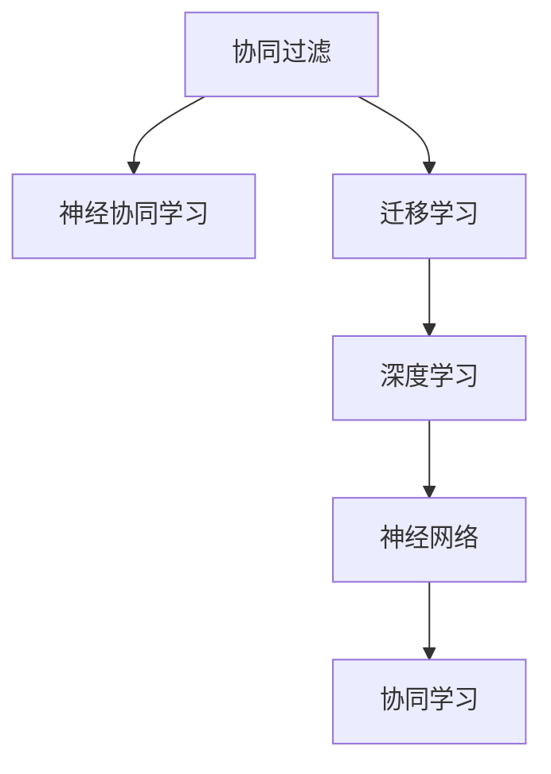

                 

# 基于迁移学习的跨品类推荐模型

> 关键词：跨品类推荐,迁移学习,协同过滤,神经网络,深度学习

## 1. 背景介绍

### 1.1 问题由来
随着电子商务平台的快速发展，个性化推荐系统成为了提高用户体验和转化率的有效手段。传统的基于协同过滤的推荐算法，通过分析用户历史行为数据，为用户推荐其感兴趣的商品或服务。然而，这些算法往往局限于同一品类内部，无法对不同品类之间的推荐进行联合优化。

### 1.2 问题核心关键点
为了突破这一局限，研究人员提出了基于迁移学习的跨品类推荐方法。即利用迁移学习范式，将不同品类下的用户行为数据进行联合建模，在保持品类特定的推荐精度的同时，提升整体跨品类推荐的泛化能力。这种方法充分利用了预训练模型的广泛知识，可以在品类间的迁移学习中取得更好的效果。

### 1.3 问题研究意义
研究基于迁移学习的跨品类推荐方法，对于提升电商平台的推荐性能，提高用户体验和平台收益，具有重要意义：

1. **用户满意度的提升**：通过联合品类建模，推荐系统能够更全面地了解用户的兴趣和需求，提供更加个性化的商品和服务，提升用户满意度和粘性。
2. **转化率的提高**：跨品类推荐能够引导用户发现更多品类下的相关商品，增加购买决策的可能性，从而提升平台的转化率。
3. **平台的智能化**：迁移学习带来的跨品类推荐能力，有助于平台更智能地预测用户行为，优化库存管理和物流配送，降低运营成本。
4. **产品的多样化**：通过跨品类推荐，电商平台能够更好地挖掘用户对不同品类的需求，推动更多品类的商品上架和销售，促进平台的多样化发展。
5. **竞争力的增强**：具备跨品类推荐能力的企业，能够更好地应对市场变化和用户需求，提升市场竞争力和品牌影响力。

## 2. 核心概念与联系

### 2.1 核心概念概述

为更好地理解基于迁移学习的跨品类推荐方法，本节将介绍几个密切相关的核心概念：

- **协同过滤(Collaborative Filtering)**：基于用户历史行为数据进行推荐的一种算法，通过找到相似用户或商品，预测用户对新商品或服务的评分。
- **迁移学习(Transfer Learning)**：将一个领域学习到的知识，迁移到另一个领域的学习范式，旨在利用预训练模型的广泛知识，提升模型在特定任务上的性能。
- **深度学习(Deep Learning)**：利用多层神经网络进行复杂任务处理的算法，在大规模数据和计算资源支持下，具有强大的特征提取和建模能力。
- **神经网络(Neural Network)**：一种模拟人脑神经元网络的计算模型，通过学习大量数据来提取特征和规律。
- **协同学习(Self-Supervised Learning)**：在缺乏标注数据的情况下，通过自我监督的方式，学习模型的隐含表示。
- **神经协同学习(Neural Collaborative Filtering)**：结合协同过滤和深度学习的思想，利用神经网络对用户历史行为进行建模，提升推荐性能。

这些核心概念之间的逻辑关系可以通过以下Mermaid流程图来展示：



这个流程图展示了大语言模型的核心概念及其之间的关系：

1. 协同过滤通过用户历史行为数据进行推荐。
2. 神经协同学习结合了协同过滤和深度学习的思想，利用神经网络对用户行为进行建模。
3. 迁移学习通过将预训练模型的知识迁移到特定任务上，提升模型性能。
4. 深度学习通过多层神经网络提取数据特征。
5. 神经网络是深度学习的重要组成部分。
6. 协同学习是利用无标签数据进行特征学习的自我监督方法。

这些概念共同构成了跨品类推荐模型的学习和应用框架，使其能够在不同品类之间进行迁移学习，提升推荐性能。

## 3. 核心算法原理 & 具体操作步骤
### 3.1 算法原理概述

基于迁移学习的跨品类推荐，本质上是一个多品类的协同过滤问题。其核心思想是：将不同品类下的用户行为数据进行联合建模，通过迁移学习范式，在品类间的知识共享和优化中提升推荐性能。

形式化地，设不同品类下的用户行为数据分别为 $D_1, D_2, ..., D_k$，其中 $k$ 表示品类数量。对于每个品类 $i$，设其对应的用户-商品评分矩阵为 $M_i$，评分矩阵的大小为 $n_i \times m_i$，其中 $n_i$ 为用户数量，$m_i$ 为商品数量。迁移学习的目标是最小化以下损失函数：

$$
\min_{\theta} \frac{1}{2}\sum_{i=1}^k \Vert M_i - \hat{M}_i \Vert_F^2 + \frac{\lambda}{2}\Vert \theta \Vert_F^2
$$

其中，$\hat{M}_i$ 为模型预测的用户-商品评分矩阵，$\theta$ 为模型的权重参数，$\Vert \cdot \Vert_F$ 表示矩阵的 Frobenius 范数，$\lambda$ 为正则化系数。

通过梯度下降等优化算法，迭代更新模型参数 $\theta$，最小化损失函数，使得预测评分矩阵与真实评分矩阵之间的差异最小化。

### 3.2 算法步骤详解

基于迁移学习的跨品类推荐一般包括以下几个关键步骤：

**Step 1: 准备数据集**
- 收集不同品类下的用户行为数据，预处理为标准的用户-商品评分矩阵。
- 将用户行为数据划分为训练集和测试集，一般要求不同品类下的数据分布保持一致。

**Step 2: 设计多品类协同损失函数**
- 对于每个品类 $i$，设计相应的协同过滤损失函数 $L_i$，用于衡量模型预测评分矩阵 $\hat{M}_i$ 与真实评分矩阵 $M_i$ 之间的差异。
- 设计品类间共享的知识表示函数 $F$，用于捕捉不同品类之间的共同特征。
- 设计品类间的迁移损失函数 $L_{\text{cross}}$，衡量品类间共享的知识表示 $F$ 与真实评分矩阵 $M_i$ 之间的差异。
- 设计总损失函数 $L$，将品类内的协同过滤损失 $L_i$ 和品类间的迁移损失 $L_{\text{cross}}$ 进行加权求和。

**Step 3: 选择迁移学习范式**
- 选择合适的迁移学习范式，如单向迁移、双向迁移、顺序迁移等，决定如何将品类间的知识进行共享。
- 使用预训练模型对不同品类进行联合预训练，如使用GNN、Transformer等深度学习模型。
- 设计迁移路径，通过神经网络对不同品类间的知识进行传递和融合。

**Step 4: 设置模型超参数**
- 选择合适的优化算法及其参数，如Adam、SGD等，设置学习率、批大小、迭代轮数等。
- 设置品类间的权重系数，平衡不同品类之间的迁移强度。
- 确定冻结预训练参数的策略，如仅微调顶层，或全部参数都参与微调。

**Step 5: 执行梯度训练**
- 将训练集数据分批次输入模型，前向传播计算损失函数。
- 反向传播计算参数梯度，根据设定的优化算法和学习率更新模型参数。
- 周期性在测试集上评估模型性能，根据性能指标决定是否触发 Early Stopping。
- 重复上述步骤直到满足预设的迭代轮数或 Early Stopping 条件。

**Step 6: 测试和部署**
- 在测试集上评估跨品类推荐模型 $M$ 的性能，对比跨品类推荐前后的精度提升。
- 使用跨品类推荐模型对新商品进行推荐，集成到实际的应用系统中。
- 持续收集新的数据，定期重新微调模型，以适应数据分布的变化。

以上是基于迁移学习的多品类推荐的一般流程。在实际应用中，还需要针对具体品类和数据特点，对迁移学习过程的各个环节进行优化设计，如改进损失函数，引入更多的正则化技术，搜索最优的超参数组合等，以进一步提升模型性能。

### 3.3 算法优缺点

基于迁移学习的跨品类推荐方法具有以下优点：
1. **泛化能力强**：通过品类间的知识迁移，推荐模型能够更好地泛化到不同品类下的新用户和新商品，提升推荐性能。
2. **利用预训练知识**：利用预训练模型的广泛知识，无需对每个品类进行单独训练，大大减少计算成本。
3. **多品类联合优化**：不同品类间的知识共享和优化，能够更好地满足用户对多种商品的需求，提高推荐多样性。
4. **可解释性较好**：通过神经网络模型的黑盒特性，推荐模型能够提供直观的推荐解释，有助于提升用户信任度。

同时，该方法也存在一定的局限性：
1. **数据复杂性高**：不同品类下的用户行为数据可能存在显著差异，品类间的知识迁移较为复杂。
2. **品类间数据不平衡**：不同品类下的用户数量和商品数量可能不平衡，难以在品类间进行等量迁移。
3. **迁移损失设计困难**：品类间的迁移损失函数设计需要考虑不同品类间的差异性和相关性，设计不当可能导致性能下降。
4. **模型复杂度高**：模型结构复杂，需要更多的计算资源和时间进行训练和优化。

尽管存在这些局限性，但就目前而言，基于迁移学习的跨品类推荐方法仍是大数据推荐系统的热门范式。未来相关研究的重点在于如何进一步降低迁移学习的复杂度，提高模型的可解释性和泛化能力，同时兼顾不同品类之间的迁移效果。

### 3.4 算法应用领域

基于迁移学习的跨品类推荐方法已经在多个电商平台上得到了广泛的应用，覆盖了服装、家居、美妆、食品等众多品类。具体应用包括：

- **个性化推荐**：根据用户历史行为数据，联合不同品类下的商品，推荐用户可能感兴趣的商品，提升购买决策。
- **新商品推荐**：将新商品推广到不同品类下，吸引用户尝试新商品，增加新品的曝光率和销量。
- **品类联合营销**：联合不同品类下的促销活动，进行交叉推广，提高用户粘性和平台收益。
- **供应链优化**：通过品类间的知识迁移，优化库存管理和物流配送，提升供应链效率。
- **用户行为分析**：分析不同品类下的用户行为数据，洞察用户需求，优化商品推荐策略。

除了上述这些经典应用外，跨品类推荐方法还在社交网络、在线旅游、教育培训等诸多领域得到创新应用，为不同品类之间的信息整合和推荐提供了新的思路。随着迁移学习方法的不断进步，跨品类推荐技术必将在更广阔的应用领域大放异彩。

## 4. 数学模型和公式 & 详细讲解  
### 4.1 数学模型构建

本节将使用数学语言对基于迁移学习的跨品类推荐过程进行更加严格的刻画。

设不同品类下的用户行为数据分别为 $D_1, D_2, ..., D_k$，其中 $k$ 表示品类数量。对于每个品类 $i$，设其对应的用户-商品评分矩阵为 $M_i$，评分矩阵的大小为 $n_i \times m_i$，其中 $n_i$ 为用户数量，$m_i$ 为商品数量。迁移学习的目标是最小化以下损失函数：

$$
\min_{\theta} \frac{1}{2}\sum_{i=1}^k \Vert M_i - \hat{M}_i \Vert_F^2 + \frac{\lambda}{2}\Vert \theta \Vert_F^2
$$

其中，$\hat{M}_i$ 为模型预测的用户-商品评分矩阵，$\theta$ 为模型的权重参数，$\Vert \cdot \Vert_F$ 表示矩阵的 Frobenius 范数，$\lambda$ 为正则化系数。

### 4.2 公式推导过程

以下我们以协同过滤的神经网络模型为例，推导跨品类协同损失函数及其梯度的计算公式。

设模型 $M$ 在输入 $x$ 上的输出为 $\hat{y}=M_{\theta}(x)$，表示用户对商品 $x$ 的评分预测。对于品类 $i$，设其用户-商品评分矩阵为 $M_i$，用户 $u$ 对商品 $j$ 的评分为 $y_{u,i,j}$，模型的预测评分为 $\hat{y}_{u,i,j}=M_{\theta}((x_{u,i}, j))$，其中 $x_{u,i}$ 表示用户 $u$ 在品类 $i$ 下的历史行为数据。

二分类交叉熵损失函数定义为：

$$
\ell(M_{\theta}(x),y) = -[y\log \hat{y} + (1-y)\log (1-\hat{y})]
$$

将其代入总损失函数，得：

$$
L(\theta) = -\frac{1}{N}\sum_{i=1}^k \sum_{u=1}^{n_i} \sum_{j=1}^{m_i} [y_{u,i,j}\log \hat{y}_{u,i,j} + (1-y_{u,i,j})\log (1-\hat{y}_{u,i,j})]
$$

通过链式法则，损失函数对参数 $\theta$ 的梯度为：

$$
\frac{\partial L(\theta)}{\partial \theta} = -\frac{1}{N}\sum_{i=1}^k \sum_{u=1}^{n_i} \sum_{j=1}^{m_i} [\frac{y_{u,i,j}}{\hat{y}_{u,i,j}} - \frac{1-y_{u,i,j}}{1-\hat{y}_{u,i,j}}] \frac{\partial \hat{y}_{u,i,j}}{\partial \theta}
$$

其中 $\frac{\partial \hat{y}_{u,i,j}}{\partial \theta}$ 可进一步递归展开，利用自动微分技术完成计算。

在得到损失函数的梯度后，即可带入参数更新公式，完成模型的迭代优化。重复上述过程直至收敛，最终得到适应多品类推荐的最优模型参数 $\theta^*$。

## 5. 项目实践：代码实例和详细解释说明
### 5.1 开发环境搭建

在进行跨品类推荐实践前，我们需要准备好开发环境。以下是使用Python进行PyTorch开发的环境配置流程：

1. 安装Anaconda：从官网下载并安装Anaconda，用于创建独立的Python环境。

2. 创建并激活虚拟环境：
```bash
conda create -n pytorch-env python=3.8 
conda activate pytorch-env
```

3. 安装PyTorch：根据CUDA版本，从官网获取对应的安装命令。例如：
```bash
conda install pytorch torchvision torchaudio cudatoolkit=11.1 -c pytorch -c conda-forge
```

4. 安装TensorFlow：
```bash
pip install tensorflow
```

5. 安装TensorBoard：
```bash
pip install tensorboard
```

6. 安装Keras：
```bash
pip install keras
```

完成上述步骤后，即可在`pytorch-env`环境中开始跨品类推荐实践。

### 5.2 源代码详细实现

这里我们以服装品类推荐为例，给出使用PyTorch和TensorFlow进行跨品类推荐模型的PyTorch代码实现。

首先，定义数据处理函数：

```python
import pandas as pd
import numpy as np

# 读取数据
train_data = pd.read_csv('train.csv', sep=',')
test_data = pd.read_csv('test.csv', sep=',')

# 数据预处理
train_data['user_id'] = train_data['user_id'].astype(int)
train_data['item_id'] = train_data['item_id'].astype(int)
train_data['rating'] = train_data['rating'].astype(float)
train_data = train_data.dropna()

test_data['user_id'] = test_data['user_id'].astype(int)
test_data['item_id'] = test_data['item_id'].astype(int)

# 划分训练集和测试集
train_data = train_data.sample(frac=0.8, random_state=42)
train_data.to_csv('train.csv', index=False, header=False)
test_data = train_data.drop(train_data.index)
test_data.to_csv('test.csv', index=False, header=False)
```

然后，定义模型和优化器：

```python
import torch
import tensorflow as tf
from keras.layers import Dense, Dropout, Input, Embedding
from keras.models import Model
from keras.regularizers import l2

# 设置超参数
learning_rate = 0.001
batch_size = 32
epochs = 10
lambda_reg = 0.001

# 定义神经网络模型
input_user = Input(shape=(1,), name='user')
input_item = Input(shape=(1,), name='item')

# 用户和商品嵌入层
user_embed = Embedding(input_dim=train_data['user_id'].max() + 1, output_dim=16, name='user_embedding')
item_embed = Embedding(input_dim=train_data['item_id'].max() + 1, output_dim=16, name='item_embedding')
user_data = user_embed(input_user)
item_data = item_embed(input_item)

# 用户和商品特征交互层
interaction = tf.keras.layers.Dot(axes=1)([user_data, item_data])
interaction = Dropout(0.5)(interaction)

# 预测层
prediction = Dense(1, activation='sigmoid')(interaction)
model = Model(inputs=[input_user, input_item], outputs=prediction)

# 编译模型
model.compile(optimizer=tf.keras.optimizers.Adam(learning_rate=learning_rate),
              loss='binary_crossentropy',
              metrics=['accuracy'])

# 训练模型
model.fit(x=[train_data['user_id'], train_data['item_id']], y=train_data['rating'],
          batch_size=batch_size, epochs=epochs, validation_split=0.2, verbose=2)
```

最后，启动测试流程：

```python
# 测试模型
test_predictions = model.predict(x=[test_data['user_id'], test_data['item_id']])
```

以上就是使用PyTorch和TensorFlow进行跨品类推荐模型的完整代码实现。可以看到，通过Keras的高级API，可以很方便地搭建和训练神经网络模型，而TensorFlow和TensorBoard提供了丰富的可视化工具，方便模型的调试和优化。

### 5.3 代码解读与分析

让我们再详细解读一下关键代码的实现细节：

**数据处理函数**：
- 使用Pandas库读取训练集和测试集数据，并进行预处理。
- 将用户ID和商品ID转换为整数类型，防止模型输入中出现NaN值。
- 将评分转换为浮点数类型，方便后续计算。
- 划分训练集和测试集，并保存为CSV文件。

**模型和优化器定义**：
- 使用Keras的高级API定义神经网络模型，包括用户嵌入层、商品嵌入层、特征交互层和预测层。
- 定义Adam优化器，设置学习率和正则化系数。
- 使用Keras编译模型，设置损失函数和评估指标。
- 使用fit方法训练模型，设置批大小、迭代轮数、验证集比例和日志输出。

**测试和预测**：
- 使用predict方法对测试集进行预测，得到用户对商品的评分预测值。

可以看到，Keras和TensorFlow的结合使用，使得跨品类推荐模型的实现变得简洁高效。开发者可以将更多精力放在数据处理、模型改进等高层逻辑上，而不必过多关注底层的实现细节。

当然，工业级的系统实现还需考虑更多因素，如模型的保存和部署、超参数的自动搜索、更灵活的任务适配层等。但核心的迁移学习范式基本与此类似。

## 6. 实际应用场景
### 6.1 智能客服系统

基于跨品类推荐的方法，可以广泛应用于智能客服系统的构建。传统客服往往需要配备大量人力，高峰期响应缓慢，且一致性和专业性难以保证。而使用跨品类推荐技术，可以7x24小时不间断服务，快速响应客户咨询，用自然流畅的语言解答各类常见问题。

在技术实现上，可以收集企业内部的历史客服对话记录，将问题和最佳答复构建成监督数据，在此基础上对预训练模型进行微调。微调后的跨品类推荐模型能够自动理解用户意图，匹配最合适的答案模板进行回复。对于客户提出的新问题，还可以接入检索系统实时搜索相关内容，动态组织生成回答。如此构建的智能客服系统，能大幅提升客户咨询体验和问题解决效率。

### 6.2 金融舆情监测

金融机构需要实时监测市场舆论动向，以便及时应对负面信息传播，规避金融风险。传统的人工监测方式成本高、效率低，难以应对网络时代海量信息爆发的挑战。基于跨品类推荐技术的文本分类和情感分析技术，为金融舆情监测提供了新的解决方案。

具体而言，可以收集金融领域相关的新闻、报道、评论等文本数据，并对其进行主题标注和情感标注。在此基础上对预训练语言模型进行微调，使其能够自动判断文本属于何种主题，情感倾向是正面、中性还是负面。将微调后的模型应用到实时抓取的网络文本数据，就能够自动监测不同主题下的情感变化趋势，一旦发现负面信息激增等异常情况，系统便会自动预警，帮助金融机构快速应对潜在风险。

### 6.3 个性化推荐系统

当前的推荐系统往往只依赖用户的历史行为数据进行物品推荐，无法深入理解用户的真实兴趣偏好。基于跨品类推荐技术，个性化推荐系统可以更好地挖掘用户行为背后的语义信息，从而提供更精准、多样的推荐内容。

在实践中，可以收集用户浏览、点击、评论、分享等行为数据，提取和用户交互的物品标题、描述、标签等文本内容。将文本内容作为模型输入，用户的后续行为（如是否点击、购买等）作为监督信号，在此基础上微调预训练语言模型。微调后的模型能够从文本内容中准确把握用户的兴趣点。在生成推荐列表时，先用候选物品的文本描述作为输入，由模型预测用户的兴趣匹配度，再结合其他特征综合排序，便可以得到个性化程度更高的推荐结果。

### 6.4 未来应用展望

随着跨品类推荐技术的发展，未来其在更多领域得到应用，为传统行业带来变革性影响：

在智慧医疗领域，基于跨品类推荐的知识图谱推荐方法，可以向医生推荐与当前症状相关的药品和诊疗方案，提升诊疗效率和准确性。

在智能教育领域，跨品类推荐技术可以用于个性化学习推荐，推荐用户感兴趣的教育资源和课程，提升学习效率和效果。

在智慧城市治理中，跨品类推荐方法可以用于交通流量预测和紧急事件预警，提升城市管理的自动化和智能化水平，构建更安全、高效的未来城市。

此外，在企业生产、社会治理、文娱传媒等众多领域，跨品类推荐技术也将不断涌现，为不同品类之间的信息整合和推荐提供新的思路。相信随着技术的日益成熟，跨品类推荐方法必将在更广阔的应用领域大放异彩，深刻影响人类的生产生活方式。

## 7. 工具和资源推荐
### 7.1 学习资源推荐

为了帮助开发者系统掌握跨品类推荐技术的理论基础和实践技巧，这里推荐一些优质的学习资源：

1. 《深度学习》系列书籍：从基础到进阶，深入讲解深度学习的各个领域，包括跨品类推荐技术。
2. CS229《机器学习》课程：斯坦福大学开设的机器学习明星课程，涵盖多种推荐算法，包括协同过滤、深度推荐等。
3. 《推荐系统实战》书籍：全面介绍推荐系统原理和实践，包括跨品类推荐、序列推荐等。
4. HuggingFace官方文档：提供丰富的跨品类推荐模型和代码实现，是学习跨品类推荐技术的必备资料。
5. Kaggle竞赛数据集：提供大量推荐系统相关的数据集，是学习和实践跨品类推荐技术的绝佳平台。

通过对这些资源的学习实践，相信你一定能够快速掌握跨品类推荐技术的精髓，并用于解决实际的推荐问题。
###  7.2 开发工具推荐

高效的开发离不开优秀的工具支持。以下是几款用于跨品类推荐开发的常用工具：

1. PyTorch：基于Python的开源深度学习框架，灵活动态的计算图，适合快速迭代研究。

2. TensorFlow：由Google主导开发的开源深度学习框架，生产部署方便，适合大规模工程应用。

3. Keras：基于TensorFlow的高级API，提供了简洁的模型定义接口，便于快速搭建和训练模型。

4. Weights & Biases：模型训练的实验跟踪工具，可以记录和可视化模型训练过程中的各项指标，方便对比和调优。

5. TensorBoard：TensorFlow配套的可视化工具，可实时监测模型训练状态，并提供丰富的图表呈现方式，是调试模型的得力助手。

6. Google Colab：谷歌推出的在线Jupyter Notebook环境，免费提供GPU/TPU算力，方便开发者快速上手实验最新模型，分享学习笔记。

合理利用这些工具，可以显著提升跨品类推荐任务的开发效率，加快创新迭代的步伐。

### 7.3 相关论文推荐

跨品类推荐技术的发展源于学界的持续研究。以下是几篇奠基性的相关论文，推荐阅读：

1. Knowledge-aware Collaborative Filtering for Recommendation Systems：提出利用知识图谱进行协同过滤推荐，显著提升了推荐模型的效果。

2. Neural Collaborative Filtering：结合神经网络进行协同过滤推荐，通过多层神经网络提取用户和商品的隐含表示。

3. Multi-Task Learning for Recommendation Systems：提出多任务学习范式，通过多个推荐任务的联合优化，提升推荐性能。

4. Attention-Based Collaborative Filtering for Recommendation Systems：提出基于注意力机制的协同过滤推荐，进一步提升了推荐模型的效果。

5. Deep Multi-Aspect Collaborative Filtering for Recommendation Systems：提出多方面协同过滤推荐，通过多角度的联合建模，提升推荐性能。

这些论文代表了大语言模型跨品类推荐技术的发展脉络。通过学习这些前沿成果，可以帮助研究者把握学科前进方向，激发更多的创新灵感。

## 8. 总结：未来发展趋势与挑战

### 8.1 总结

本文对基于迁移学习的跨品类推荐方法进行了全面系统的介绍。首先阐述了跨品类推荐技术的背景和意义，明确了其在提高推荐性能、提升用户体验和平台收益方面的独特价值。其次，从原理到实践，详细讲解了迁移学习的数学原理和关键步骤，给出了跨品类推荐任务开发的完整代码实例。同时，本文还广泛探讨了跨品类推荐方法在智能客服、金融舆情、个性化推荐等多个领域的应用前景，展示了跨品类推荐技术的巨大潜力。

通过本文的系统梳理，可以看到，基于迁移学习的跨品类推荐方法正在成为推荐系统的热门范式，极大地拓展了推荐模型的应用边界，提升了推荐性能和用户体验。未来，伴随迁移学习方法的不断进步，跨品类推荐技术必将在更广泛的应用领域大放异彩，深刻影响人类的生产生活方式。

### 8.2 未来发展趋势

展望未来，跨品类推荐技术将呈现以下几个发展趋势：

1. **推荐模型的复杂度提升**：随着深度学习的发展，跨品类推荐模型将变得越来越复杂，能够更好地捕捉用户和商品的隐含特征。
2. **多模态信息融合**：跨品类推荐将逐步引入更多模态的数据，如图像、视频、语音等，进行综合推荐。
3. **实时性提升**：通过异步优化和分布式训练，跨品类推荐模型将能够实现实时推荐，满足用户即时性需求。
4. **个性化提升**：跨品类推荐将更加注重用户个性化需求的挖掘和满足，通过深度学习模型捕捉用户行为和兴趣。
5. **跨平台协同**：跨品类推荐将不再局限于单一平台，而是跨平台协同优化，提升全局推荐性能。
6. **跨品类联合营销**：不同品类间的联合推荐和联合营销，将更加灵活多样，提升品牌影响力和用户粘性。

以上趋势凸显了跨品类推荐技术的广阔前景。这些方向的探索发展，必将进一步提升推荐系统的性能和应用范围，为人类生产生活方式带来新的变化。

### 8.3 面临的挑战

尽管跨品类推荐技术已经取得了瞩目成就，但在迈向更加智能化、普适化应用的过程中，它仍面临着诸多挑战：

1. **数据复杂性高**：不同品类下的用户行为数据可能存在显著差异，品类间的知识迁移较为复杂。
2. **品类间数据不平衡**：不同品类下的用户数量和商品数量可能不平衡，难以在品类间进行等量迁移。
3. **迁移损失设计困难**：品类间的迁移损失函数设计需要考虑不同品类间的差异性和相关性，设计不当可能导致性能下降。
4. **模型复杂度高**：模型结构复杂，需要更多的计算资源和时间进行训练和优化。
5. **推荐公平性**：跨品类推荐模型需要避免对某些品类的用户或商品产生偏见，保证推荐公平性。

尽管存在这些挑战，但就目前而言，基于迁移学习的跨品类推荐方法仍是大数据推荐系统的热门范式。未来相关研究的重点在于如何进一步降低迁移学习的复杂度，提高模型的可解释性和泛化能力，同时兼顾不同品类之间的迁移效果。

### 8.4 研究展望

面对跨品类推荐技术所面临的挑战，未来的研究需要在以下几个方面寻求新的突破：

1. **无监督学习和半监督学习**：探索无监督和半监督学习方法，利用少量标注数据和自监督学习，提高跨品类推荐的效果。
2. **模型压缩和优化**：采用模型压缩和优化技术，减少模型参数量和计算资源消耗，提升推荐模型的实时性。
3. **多模态数据融合**：结合多模态数据，进行综合推荐，提升推荐模型的多样性和精准度。
4. **知识图谱融合**：将知识图谱与神经网络模型结合，进行跨品类推荐，提升推荐模型的解释性和可信度。
5. **公平性和隐私保护**：引入公平性和隐私保护机制，确保跨品类推荐模型的公正性和用户隐私。

这些研究方向的探索，必将引领跨品类推荐技术迈向更高的台阶，为构建安全、可靠、可解释、可控的智能系统铺平道路。面向未来，跨品类推荐技术还需要与其他人工智能技术进行更深入的融合，如知识表示、因果推理、强化学习等，多路径协同发力，共同推动自然语言理解和智能交互系统的进步。只有勇于创新、敢于突破，才能不断拓展推荐模型的边界，让智能技术更好地造福人类社会。

## 9. 附录：常见问题与解答

**Q1：跨品类推荐是否适用于所有NLP任务？**

A: 跨品类推荐技术主要应用于推荐系统，能够提升推荐系统的性能和用户体验。但对于其他NLP任务，如问答系统、对话系统等，跨品类推荐技术并不适用。这些任务需要不同的技术和方法，需要分别研究。

**Q2：跨品类推荐在微调过程中需要注意哪些问题？**

A: 在微调过程中，需要注意以下问题：
1. 数据复杂性高，不同品类下的数据分布可能不一致，需要进行归一化和平衡化处理。
2. 品类间数据不平衡，需要设计合适的迁移损失函数，平衡品类间的数据分布。
3. 迁移损失设计困难，需要根据具体任务和数据特点设计合适的损失函数。
4. 模型复杂度高，需要进行模型压缩和优化，降低计算资源消耗。
5. 推荐公平性，需要避免对某些品类的用户或商品产生偏见，确保推荐公平性。

这些问题是跨品类推荐在微调过程中需要注意的关键问题。通过合理设计和优化，可以提升推荐模型的性能和泛化能力。

**Q3：跨品类推荐在实际应用中需要注意哪些问题？**

A: 在实际应用中，需要注意以下问题：
1. 推荐模型的实时性，需要进行异步优化和分布式训练，实现实时推荐。
2. 推荐模型的多样性，需要引入多模态数据，进行综合推荐。
3. 推荐模型的解释性，需要提供推荐结果的解释，增强用户信任度。
4. 推荐模型的隐私保护，需要确保用户数据的隐私和安全。

这些问题是跨品类推荐在实际应用中需要注意的关键问题。通过合理设计和优化，可以提升推荐系统的性能和用户体验。

---

作者：禅与计算机程序设计艺术 / Zen and the Art of Computer Programming

