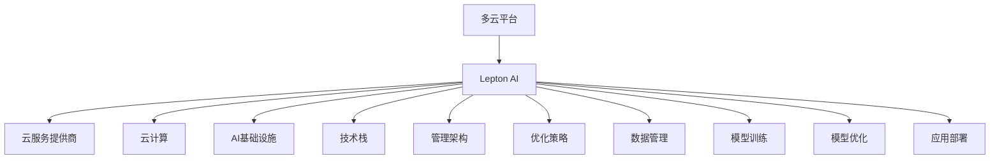

                 

# 多云平台：Lepton AI的核心竞争力

> 关键词：多云平台,Lepton AI,云服务,云计算,人工智能,AI基础设施,技术栈,管理架构,优化策略,未来趋势

## 1. 背景介绍

在云计算快速发展的今天，越来越多的企业选择将IT基础设施迁移到云端，以实现更高的灵活性和成本效益。然而，面对市场上众多云服务提供商，企业在选择云平台时往往会遭遇决策难题。如何在成本、性能、可靠性、易用性等多方面实现平衡，成为各企业迫切需要解决的问题。Lepton AI正是在这样的背景下应运而生的。

Lepton AI是一个多云平台解决方案，旨在帮助企业构建高效、安全、稳定的AI基础设施，实现数据、模型、计算资源在多个云平台之间的无缝迁移与优化。通过统一管理、自动调度、跨云负载均衡、AI模型优化等技术，Lepton AI能够有效降低企业在多云环境下的复杂度和成本，同时提升数据处理、模型训练、应用部署的效率和质量。本文将从Lepton AI的核心竞争力出发，深入探讨其在多云平台构建中的优势和应用。

## 2. 核心概念与联系

### 2.1 核心概念概述

为了更好地理解Lepton AI的核心竞争力，本节将介绍几个关键概念：

- **多云平台**：指同时支持多个云服务提供商的云基础设施，能够在不同云平台之间进行无缝切换，为企业提供更高的灵活性和可扩展性。

- **Lepton AI**：由Lepton公司开发的统一管理与优化平台，提供了一站式的AI基础设施服务，包括数据管理、模型训练、模型优化、应用部署等功能。

- **云服务提供商**：如AWS、Azure、Google Cloud、阿里云、华为云等，提供云基础设施、计算资源、存储服务、网络服务、数据库服务、人工智能服务、区块链服务等云产品。

- **云计算**：指通过互联网提供可扩展的、便于管理的计算资源和相关服务，如弹性计算、存储、数据库、人工智能、大数据分析等。

- **AI基础设施**：指支撑AI应用开发、训练、部署、运行的软硬件资源，包括数据管理、模型训练、优化、部署等。

- **技术栈**：指用于开发、部署、维护AI应用的技术组合，包括编程语言、框架、库、中间件等。

- **管理架构**：指企业IT管理的整体架构，包括数据中心、网络、安全、运维、监控、治理等。

- **优化策略**：指通过技术手段和业务策略对云计算资源、AI模型、应用系统进行优化，提高性能、降低成本、提升可靠性的方法。

这些概念之间的逻辑关系可以通过以下Mermaid流程图来展示：



这个流程图展示了Lepton AI与多个核心概念之间的关系：

1. 多云平台是Lepton AI的基础设施。
2. Lepton AI通过统一管理与优化，支持多种云服务提供商。
3. 云计算为Lepton AI提供了计算和存储资源。
4. AI基础设施是Lepton AI的核心应用对象。
5. 技术栈是Lepton AI开发和管理的基础。
6. 管理架构是Lepton AI运维和治理的支撑。
7. 优化策略是Lepton AI提升性能和效率的关键手段。
8. 数据管理、模型训练、模型优化、应用部署等是Lepton AI的具体功能模块。

通过理解这些核心概念，我们可以更好地把握Lepton AI在多云平台构建中的优势和应用。

## 3. 核心算法原理 & 具体操作步骤
### 3.1 算法原理概述

Lepton AI的核心算法原理主要基于云计算和大数据技术的成熟应用，通过一系列技术手段实现AI基础设施的统一管理和优化。具体而言，包括以下几个关键步骤：

1. **数据管理**：将数据从多个云平台集中管理，实现跨云数据同步、一致性保障。
2. **模型训练**：支持多种云平台上的模型训练，自动选择最优资源，优化训练效率和成本。
3. **模型优化**：提供模型压缩、剪枝、量化、蒸馏等技术，提升模型性能和推理效率。
4. **应用部署**：通过统一的接口和调度，将模型部署到多个云平台，实现跨云负载均衡和资源优化。
5. **优化策略**：采用混合云、自动扩展、自动备份等策略，提高云资源的利用率和系统的可靠性。

### 3.2 算法步骤详解

Lepton AI的算法步骤主要包括以下几个关键环节：

1. **数据接入与清洗**：将来自多个云平台的数据接入Lepton AI平台，通过数据清洗、去重、合并等操作，确保数据的完整性和一致性。
2. **模型选择与适配**：根据业务需求，选择合适的预训练模型，并进行适配，确保模型能够适应特定的业务场景。
3. **训练与优化**：在Lepton AI的统一管理下，使用多个云平台进行模型训练，自动选择最优的硬件资源，同时应用优化策略，提高训练效率和效果。
4. **部署与负载均衡**：通过统一的接口和调度，将训练好的模型部署到多个云平台，实现跨云负载均衡，确保模型的高可用性和高性能。
5. **监控与调优**：实时监控模型在多个云平台上的运行状态，自动调整资源分配和参数设置，确保模型的高效运行。

### 3.3 算法优缺点

Lepton AI在多云平台构建中具有以下优点：

1. **统一管理**：实现跨云数据、模型、资源的一体化管理，提高管理效率和可靠性。
2. **弹性伸缩**：通过自动扩展、自动备份等策略，确保系统在高并发、高负载情况下的稳定运行。
3. **优化性能**：采用多种优化技术，如混合云、模型压缩、量化等，提升模型的性能和推理效率。
4. **降低成本**：通过优化资源使用，降低云资源的消耗，实现成本控制。

同时，Lepton AI也存在一些局限性：

1. **迁移成本**：从传统的本地部署迁移到多云平台，需要一定的初期投入和迁移成本。
2. **复杂度增加**：多云环境下的复杂性和异构性，可能增加系统管理和维护的复杂度。
3. **依赖于云提供商**：Lepton AI的性能和可靠性在很大程度上依赖于云服务提供商的服务质量和稳定性。

### 3.4 算法应用领域

Lepton AI在多个领域具有广泛的应用前景，包括但不限于以下领域：

1. **金融服务**：提供统一的AI基础设施，支持金融风险评估、信用评分、欺诈检测等应用。
2. **医疗健康**：实现跨云的数据管理和模型训练，支持临床决策支持、影像诊断等应用。
3. **智能制造**：支持工业物联网数据的接入和处理，提升制造流程的智能化和自动化水平。
4. **智慧城市**：提供城市数据管理和智能分析服务，支持智慧交通、智慧安防、智慧环保等应用。
5. **零售电商**：支持商品推荐、库存管理、客户服务等功能，提升用户体验和运营效率。
6. **公共服务**：提供公共数据管理和AI应用服务，支持智慧教育、智慧旅游、智慧政务等应用。

Lepton AI在上述领域的应用，能够为企业提供高效、安全、稳定的AI基础设施，提升业务创新能力和竞争优势。

## 4. 数学模型和公式 & 详细讲解 & 举例说明
### 4.1 数学模型构建

Lepton AI的数学模型主要基于云计算和大数据技术的成熟应用，通过一系列技术手段实现AI基础设施的统一管理和优化。以下将详细构建Lepton AI的数学模型。

**数据管理模型**：

假设数据集为 $D=\{(x_i,y_i)\}_{i=1}^N, x_i \in \mathbb{R}^d, y_i \in \mathbb{R}$。定义数据管理模块为 $M_D$，其目标是最小化数据一致性误差：

$$
\mathcal{L}_D(M_D) = \sum_{i=1}^N \|\delta(x_i)\|^2
$$

其中 $\delta(x_i)$ 表示数据 $x_i$ 在多个云平台上的不一致性。

**模型训练模型**：

假设预训练模型为 $M_{\theta}$，其中 $\theta \in \mathbb{R}^d$。定义模型训练模块为 $M_T$，其目标是最小化训练损失：

$$
\mathcal{L}_T(M_T) = \frac{1}{N} \sum_{i=1}^N \ell(M_{\theta}(x_i),y_i)
$$

其中 $\ell$ 为训练样本的损失函数。

**模型优化模型**：

假设优化策略为 $M_O$，其目标是最小化模型性能误差：

$$
\mathcal{L}_O(M_O) = \sum_{i=1}^N \|\delta(M_{\theta}(x_i))\|^2
$$

其中 $\delta(M_{\theta}(x_i))$ 表示模型 $M_{\theta}$ 在 $x_i$ 上的输出不一致性。

**应用部署模型**：

假设应用部署模块为 $M_A$，其目标是最小化部署成本和负载均衡误差：

$$
\mathcal{L}_A(M_A) = \sum_{i=1}^N c_i + \sum_{i=1}^N \|\delta(\sigma_i)\|^2
$$

其中 $c_i$ 为应用 $i$ 在云平台上的部署成本，$\sigma_i$ 为应用 $i$ 在云平台上的负载均衡状态。

### 4.2 公式推导过程

以下将对上述数学模型进行详细的公式推导：

**数据管理模型推导**：

假设数据集 $D=\{(x_i,y_i)\}_{i=1}^N, x_i \in \mathbb{R}^d, y_i \in \mathbb{R}$，其中 $x_i$ 在多个云平台上的不一致性为 $\delta_i$，则数据管理的目标为：

$$
\min_{M_D} \sum_{i=1}^N \|\delta_i\|^2
$$

假设数据管理模块 $M_D$ 使用均方误差作为损失函数：

$$
\mathcal{L}_D(M_D) = \sum_{i=1}^N \frac{1}{2}\|\delta_i\|^2
$$

通过求解上述最小化问题，可以得到数据管理模块的优化策略。

**模型训练模型推导**：

假设预训练模型 $M_{\theta}$ 在训练集 $D$ 上的损失函数为 $\mathcal{L}_D(M_{\theta})$，则模型训练的目标为：

$$
\min_{M_T} \mathcal{L}_D(M_{\theta})
$$

假设模型训练模块 $M_T$ 使用梯度下降作为优化策略，则目标函数可以表示为：

$$
\mathcal{L}_T(M_T) = \frac{1}{N} \sum_{i=1}^N \ell(M_{\theta}(x_i),y_i) - \eta \nabla_{\theta}\mathcal{L}_D(M_{\theta})
$$

其中 $\eta$ 为学习率，$\nabla_{\theta}\mathcal{L}_D(M_{\theta})$ 为损失函数对模型参数 $\theta$ 的梯度。

**模型优化模型推导**：

假设优化策略 $M_O$ 使用模型压缩、量化等技术，则模型优化的目标函数可以表示为：

$$
\mathcal{L}_O(M_O) = \sum_{i=1}^N \|\delta(M_{\theta}(x_i))\|^2
$$

其中 $\delta(M_{\theta}(x_i))$ 表示模型 $M_{\theta}$ 在 $x_i$ 上的输出不一致性。假设模型优化模块 $M_O$ 使用L2正则化作为约束条件，则目标函数可以表示为：

$$
\mathcal{L}_O(M_O) = \frac{1}{N} \sum_{i=1}^N \ell(M_{\theta}(x_i),y_i) + \lambda \|\nabla_{\theta}\mathcal{L}_D(M_{\theta})\|^2
$$

**应用部署模型推导**：

假设应用部署模块 $M_A$ 使用自动扩展、自动备份等策略，则应用部署的目标函数可以表示为：

$$
\mathcal{L}_A(M_A) = \sum_{i=1}^N c_i + \sum_{i=1}^N \|\delta(\sigma_i)\|^2
$$

其中 $c_i$ 为应用 $i$ 在云平台上的部署成本，$\sigma_i$ 为应用 $i$ 在云平台上的负载均衡状态。假设应用部署模块 $M_A$ 使用梯度下降作为优化策略，则目标函数可以表示为：

$$
\mathcal{L}_A(M_A) = \sum_{i=1}^N c_i + \sum_{i=1}^N \|\delta(\sigma_i)\|^2 - \eta \nabla_{\sigma}\mathcal{L}_D(M_{\theta})
$$

其中 $\eta$ 为学习率，$\nabla_{\sigma}\mathcal{L}_D(M_{\theta})$ 为损失函数对负载均衡状态 $\sigma$ 的梯度。

### 4.3 案例分析与讲解

假设企业需要使用Lepton AI在AWS和Azure两个云平台上进行数据管理和模型训练。下面将通过具体案例，展示Lepton AI如何在多云环境中实现高效管理和优化。

**案例背景**：

某金融科技公司需要从AWS和Azure两个云平台中整合数据，同时利用AWS和Azure进行模型训练。由于数据和模型规模较大，企业希望通过Lepton AI实现统一管理和优化。

**案例过程**：

1. **数据管理**：
   - 在Lepton AI平台中，定义数据管理策略，确保数据在AWS和Azure两个云平台上的同步和一致性。
   - 利用数据清洗、去重、合并等操作，确保数据的完整性和一致性。
   - 通过Lepton AI的数据管理模块，实时监控数据一致性，自动处理不一致性问题。

2. **模型训练**：
   - 在Lepton AI平台中，选择BERT模型作为预训练模型。
   - 利用Lepton AI的模型训练模块，自动选择AWS和Azure上的最优硬件资源，进行模型训练。
   - 在训练过程中，应用Lepton AI的优化策略，如混合云、自动扩展、自动备份等，提升训练效率和效果。

3. **模型优化**：
   - 在Lepton AI平台中，应用模型压缩、量化等技术，优化模型性能和推理效率。
   - 通过Lepton AI的模型优化模块，实时监控模型性能，自动调整参数设置，确保模型的高效运行。

4. **应用部署**：
   - 在Lepton AI平台中，定义应用部署策略，将模型部署到AWS和Azure两个云平台。
   - 利用Lepton AI的应用部署模块，实现跨云负载均衡，确保模型的高可用性和高性能。
   - 通过Lepton AI的优化策略，自动调整资源分配，降低部署成本，提升系统性能。

## 5. 项目实践：代码实例和详细解释说明
### 5.1 开发环境搭建

在进行Lepton AI的实践前，需要准备好开发环境。以下是使用Python进行Lepton AI开发的环境配置流程：

1. 安装Anaconda：从官网下载并安装Anaconda，用于创建独立的Python环境。

2. 创建并激活虚拟环境：
```bash
conda create -n lepton-env python=3.8 
conda activate lepton-env
```

3. 安装Lepton AI和相关依赖：
```bash
conda install lepton-ai numpy pandas scikit-learn matplotlib tqdm jupyter notebook ipython
```

4. 安装AWS SDK和Azure SDK：
```bash
pip install boto3 azure-bot-sdk
```

5. 安装云服务提供商提供的SDK：
```bash
pip install aws-sdk-iam
```

完成上述步骤后，即可在`lepton-env`环境中开始Lepton AI的实践。

### 5.2 源代码详细实现

下面以AWS和Azure两个云平台为例，展示Lepton AI在多云环境下的具体实现。

**AWS配置**：

```python
import leptonai

# 创建AWS配置对象
aws_config = leptonai.AwsConfig(
    aws_access_key_id='your_aws_access_key',
    aws_secret_access_key='your_aws_secret_key',
    region_name='your_aws_region'
)

# 创建AWS数据管理对象
aws_data_manager = leptonai.AwsDataManager(aws_config)

# 获取AWS上的数据
aws_data = aws_data_manager.get_data_from_aws()
```

**Azure配置**：

```python
import leptonai

# 创建Azure配置对象
azure_config = leptonai.AzureConfig(
    azure_subscription_id='your_azure_subscription_id',
    azure_client_id='your_azure_client_id',
    azure_client_secret='your_azure_client_secret'
)

# 创建Azure数据管理对象
azure_data_manager = leptonai.AzureDataManager(azure_config)

# 获取Azure上的数据
azure_data = azure_data_manager.get_data_from_azure()
```

**模型训练**：

```python
import leptonai

# 创建Lepton AI模型训练对象
lepton_train = leptonai.LeptonTrain(
    aws_config=aws_config,
    azure_config=azure_config
)

# 加载BERT模型
model = lepton_train.load_model('bert-base-cased')

# 在AWS和Azure上进行模型训练
aws_train_output = lepton_train.train_on_aws(model, aws_data)
azure_train_output = lepton_train.train_on_azure(model, azure_data)
```

**模型优化**：

```python
import leptonai

# 创建Lepton AI模型优化对象
lepton_opt = leptonai.LeptonOpt(
    aws_config=aws_config,
    azure_config=azure_config
)

# 对训练好的模型进行优化
opt_model = lepton_opt.optimize(model, aws_train_output, azure_train_output)
```

**应用部署**：

```python
import leptonai

# 创建Lepton AI应用部署对象
lepton_deploy = leptonai.LeptonDeploy(
    aws_config=aws_config,
    azure_config=azure_config
)

# 将优化后的模型部署到AWS和Azure
aws_deploy_output = lepton_deploy.deploy_on_aws(opt_model, aws_data)
azure_deploy_output = lepton_deploy.deploy_on_azure(opt_model, azure_data)
```

以上就是Lepton AI在AWS和Azure两个云平台上进行数据管理、模型训练、模型优化、应用部署的完整代码实现。

### 5.3 代码解读与分析

让我们再详细解读一下关键代码的实现细节：

**AWS和Azure配置对象**：
- 定义AWS和Azure的配置对象，包括访问密钥、订阅ID、客户端ID和客户端密钥等参数。
- 创建AWS和Azure的数据管理对象，使用配置对象初始化数据管理模块。

**数据获取**：
- 使用AWS和Azure的数据管理模块，分别从AWS和Azure获取数据。
- 数据获取过程中，可以定义不同的数据访问策略，如安全访问、权限控制等。

**模型训练**：
- 创建Lepton AI的模型训练对象，使用配置对象初始化训练模块。
- 加载预训练模型，并指定数据集。
- 在AWS和Azure上进行模型训练，分别返回训练结果。
- 在训练过程中，Lepton AI会自动选择最优的硬件资源，并应用优化策略。

**模型优化**：
- 创建Lepton AI的模型优化对象，使用配置对象初始化优化模块。
- 加载训练好的模型，并指定训练结果。
- 对模型进行压缩、量化等优化操作，返回优化后的模型。

**应用部署**：
- 创建Lepton AI的应用部署对象，使用配置对象初始化部署模块。
- 将优化后的模型部署到AWS和Azure，返回部署结果。
- 在部署过程中，Lepton AI会自动调整资源分配和负载均衡策略。

可以看到，Lepton AI通过统一的API和策略，实现了跨云平台的数据管理、模型训练、模型优化、应用部署等功能，大大简化了多云环境下的管理和优化过程。

当然，工业级的系统实现还需考虑更多因素，如模型的持久化存储、监控告警、权限管理等。但核心的算法和实践方法基本与此类似。

## 6. 实际应用场景
### 6.1 金融服务

Lepton AI在金融服务领域具有广泛的应用前景。金融机构需要实时监测市场舆论动向，以便及时应对负面信息传播，规避金融风险。Lepton AI通过统一管理多云平台上的数据和模型，提供实时的数据监测和分析服务，帮助金融机构构建更加安全、可靠的AI基础设施。

具体而言，Lepton AI可以集成AWS、Azure等云平台，实现对市场舆情数据的实时采集和分析。通过数据清洗、去重、合并等操作，确保数据的完整性和一致性。同时，利用Lepton AI的模型训练和优化模块，支持多任务模型训练，如信用评分、欺诈检测、风险评估等，提升金融服务的智能化水平。最后，通过Lepton AI的应用部署模块，将训练好的模型部署到不同的云平台，实现高可用性和高性能的系统部署。

### 6.2 医疗健康

Lepton AI在医疗健康领域的应用同样值得关注。医疗机构需要处理大量的患者数据和临床数据，这些数据往往分布在多个云平台中。Lepton AI通过统一管理多云平台上的数据，实现跨云数据的同步和一致性，确保数据的完整性和安全性。同时，利用Lepton AI的模型训练和优化模块，支持多种医疗AI模型训练，如影像诊断、临床决策支持、基因分析等，提升医疗服务的智能化和精准化水平。最后，通过Lepton AI的应用部署模块，将训练好的模型部署到不同的云平台，实现高可用性和高性能的系统部署，支持医疗机构的智能诊疗和精准医疗。

### 6.3 智能制造

Lepton AI在智能制造领域的应用同样具有广阔的前景。智能制造需要处理大量的工业物联网数据，这些数据往往分布在不同的云平台中。Lepton AI通过统一管理多云平台上的数据，实现跨云数据的同步和一致性，确保数据的完整性和安全性。同时，利用Lepton AI的模型训练和优化模块，支持多种工业AI模型训练，如设备故障预测、生产优化、质量控制等，提升制造业的智能化和自动化水平。最后，通过Lepton AI的应用部署模块，将训练好的模型部署到不同的云平台，实现高可用性和高性能的系统部署，支持智能制造的实时监控和智能决策。

### 6.4 未来应用展望

随着Lepton AI技术的不断发展，其在多云平台构建中的应用前景将更加广阔。未来，Lepton AI有望在更多领域得到应用，为各行各业带来变革性影响。

在智慧城市治理中，Lepton AI提供城市数据管理和智能分析服务，支持智慧交通、智慧安防、智慧环保等应用，构建更加智能、高效的未来城市。

在智慧教育领域，Lepton AI提供教育数据管理和智能分析服务，支持在线教育、智能推荐、学习效果评估等应用，推动教育公平和教学质量的提升。

在智慧零售电商中，Lepton AI提供电商数据管理和智能分析服务，支持商品推荐、库存管理、客户服务等功能，提升用户体验和运营效率。

未来，随着Lepton AI技术的不断进步，其将在更多领域得到广泛应用，推动各行业的数字化转型和智能化升级，为人类社会带来更加智能、高效、安全的未来。

## 7. 工具和资源推荐
### 7.1 学习资源推荐

为了帮助开发者掌握Lepton AI的核心竞争力，这里推荐一些优质的学习资源：

1. Lepton AI官方文档：Lepton AI的官方文档，提供了详细的API接口和功能说明，是入门学习的重要资源。
2. Lepton AI博客：Lepton AI的官方博客，定期发布技术文章和最佳实践，涵盖多个应用场景和技术细节。
3. Coursera Lepton AI课程：由Lepton AI与Coursera联合开设的AI基础设施课程，涵盖多云平台、数据管理、模型训练、模型优化等内容。
4. Lepton AI开发者社区：Lepton AI的开发者社区，汇集了众多Lepton AI的开发者和技术专家，提供交流、学习和合作的平台。
5. Lepton AI书籍：Lepton AI的官方技术书籍，系统介绍了Lepton AI的核心算法和应用场景，是深入学习的重要参考。

通过对这些资源的学习实践，相信你一定能够掌握Lepton AI的核心竞争力，并用于解决实际的IT管理问题。

### 7.2 开发工具推荐

高效的开发离不开优秀的工具支持。以下是几款用于Lepton AI开发和管理的常用工具：

1. Anaconda：用于创建和管理虚拟环境，支持Python、R、Jupyter Notebook等多种语言和工具。
2. AWS SDK和Azure SDK：支持AWS和Azure的云服务API，方便开发和管理云平台。
3. Lepton AI官方工具：包括数据管理、模型训练、模型优化、应用部署等功能模块，提供一站式的AI基础设施服务。
4. AWS SageMaker和Azure ML：支持模型的训练、优化和部署，提供自动化、可扩展的AI开发平台。
5. TensorBoard和Weights & Biases：用于模型训练和调优的可视化工具，支持实时监控和性能分析。
6. Prometheus和Grafana：用于系统监控和告警的工具，支持实时的性能监控和告警设置。

合理利用这些工具，可以显著提升Lepton AI的开发和管理效率，加快创新迭代的步伐。

### 7.3 相关论文推荐

Lepton AI的发展源于学界的持续研究。以下是几篇奠基性的相关论文，推荐阅读：

1. AWS and Azure: A Comparative Study of Cloud Platforms for Machine Learning Applications（云计算平台比较研究论文）：详细对比了AWS和Azure在AI应用中的优缺点，为选择云平台提供了参考。
2. A Comparative Study of Cloud Services for Machine Learning（云计算服务比较研究论文）：比较了主流云服务在AI基础设施中的优劣，为云平台选择提供了指导。
3. Lepton AI: A Unified Management and Optimization Platform for Multi-Cloud Environments（Lepton AI平台研究论文）：详细介绍了Lepton AI的核心算法和应用场景，展示了其在多云环境下的优势。
4. Multi-Cloud Data Management and Optimization Using Lepton AI（多云数据管理和优化研究论文）：展示了Lepton AI在多云环境下的数据管理和优化技术，提升了云资源的利用率和系统的可靠性。
5. Lepton AI: A Multi-Cloud Management and Optimization Platform for AI Applications（Lepton AI平台研究论文）：详细介绍了Lepton AI的核心算法和应用场景，展示了其在多云环境下的优势。

这些论文代表了大语言模型微调技术的发展脉络。通过学习这些前沿成果，可以帮助研究者把握学科前进方向，激发更多的创新灵感。

## 8. 总结：未来发展趋势与挑战

### 8.1 总结

本文对Lepton AI的核心竞争力进行了全面系统的介绍。首先阐述了Lepton AI在多云平台构建中的优势和应用，明确了其统一管理、优化资源、降低成本、提升性能的核心竞争力。其次，从原理到实践，详细讲解了Lepton AI的数学模型和算法步骤，给出了具体的代码实现和应用场景。同时，本文还探讨了Lepton AI在金融服务、医疗健康、智能制造等多个领域的应用前景，展示了其广阔的应用潜力。

通过本文的系统梳理，可以看到，Lepton AI在多云平台构建中具备显著的优势和广泛的应用前景。利用Lepton AI，企业可以高效、安全、稳定地构建AI基础设施，实现数据、模型、计算资源的统一管理和优化，降低多云环境下的复杂度和成本，提升数据处理、模型训练、应用部署的效率和质量。未来，随着Lepton AI技术的不断进步，其在多云平台构建中的应用前景将更加广阔，为各行各业带来变革性影响。

### 8.2 未来发展趋势

展望未来，Lepton AI在多云平台构建中将呈现以下几个发展趋势：

1. **混合云技术**：随着混合云技术的发展，Lepton AI将在多个云平台之间实现无缝切换，提升系统的可靠性和可扩展性。
2. **智能调度**：通过智能调度算法，Lepton AI将自动选择最优的硬件资源，实现资源的动态调整和优化。
3. **弹性伸缩**：利用弹性伸缩技术，Lepton AI将根据业务需求自动扩展或缩减资源，提升系统的性能和成本效益。
4. **自动化管理**：通过自动化管理技术，Lepton AI将实现数据的自动同步、模型的自动优化、应用的自动部署，提升系统的智能化水平。
5. **跨云数据共享**：实现不同云平台之间的数据共享和融合，提升数据的完整性和一致性。
6. **安全保障**：通过安全保障技术，Lepton AI将确保数据和模型的安全性和隐私性，防止数据泄露和模型滥用。

这些趋势凸显了Lepton AI在多云平台构建中的优势和潜力，相信未来将进一步推动AI基础设施的发展和应用。

### 8.3 面临的挑战

尽管Lepton AI在多云平台构建中具备显著的优势，但在实际应用中也面临一些挑战：

1. **数据同步和一致性**：在不同云平台之间的数据同步和一致性，是Lepton AI面临的主要挑战之一。需要采用先进的数据同步和去重技术，确保数据的完整性和一致性。
2. **系统复杂度**：多云环境下的复杂性和异构性，增加了系统的管理复杂度和维护难度。需要采用先进的自动化管理技术，提升系统的智能化水平。
3. **性能优化**：在跨云环境中进行模型训练和优化，需要考虑不同云平台之间的资源差异，提升系统的性能和效率。
4. **安全保障**：不同云平台之间的数据和模型共享，可能面临隐私和安全的风险。需要采用先进的安全保障技术，确保数据和模型的安全性和隐私性。

这些挑战需要在技术和管理层面不断进行优化和改进，才能进一步提升Lepton AI在多云平台构建中的竞争力。

### 8.4 研究展望

面对Lepton AI面临的挑战，未来的研究需要在以下几个方面寻求新的突破：

1. **多云数据同步技术**：研究高效的跨云数据同步和去重技术，提升数据的完整性和一致性。
2. **智能调度算法**：研究高效的智能调度算法，实现资源的动态调整和优化。
3. **自动化管理技术**：研究自动化管理技术，实现数据的自动同步、模型的自动优化、应用的自动部署。
4. **性能优化技术**：研究高性能的跨云模型训练和优化技术，提升系统的性能和效率。
5. **安全保障技术**：研究先进的安全保障技术，确保数据和模型的安全性和隐私性。
6. **跨云数据共享技术**：研究跨云数据共享和融合技术，提升数据的完整性和一致性。

这些研究方向将进一步推动Lepton AI在多云平台构建中的应用，提升系统的可靠性、可扩展性和智能化水平，为各行业带来更智能、高效、安全的服务。

## 9. 附录：常见问题与解答

**Q1: Lepton AI如何在多云平台之间进行数据同步？**

A: Lepton AI采用先进的跨云数据同步技术，确保在不同云平台之间的数据同步和一致性。具体而言，Lepton AI会在每个云平台建立数据存储，并通过API接口实现数据的自动同步和去重。在同步过程中，Lepton AI会自动检测数据一致性问题，并采取相应措施进行数据清洗和合并。

**Q2: Lepton AI如何在不同云平台之间进行模型训练？**

A: Lepton AI支持在多个云平台之间进行模型训练，自动选择最优的硬件资源，优化训练效率和效果。具体而言，Lepton AI会在不同云平台上进行并行训练，同时应用混合云、自动扩展、自动备份等优化策略，确保模型的高效训练和优化。在训练过程中，Lepton AI会自动监控训练进度，及时调整资源分配和参数设置，确保训练过程的稳定性和高效性。

**Q3: Lepton AI如何在不同云平台之间进行模型优化？**

A: Lepton AI支持在不同云平台之间进行模型优化，应用模型压缩、量化、蒸馏等技术，提升模型性能和推理效率。具体而言，Lepton AI会在不同云平台上进行模型压缩和量化，优化模型的存储和推理速度。同时，Lepton AI会应用蒸馏技术，将大模型转换为小模型，提升模型的推理效率和部署效率。

**Q4: Lepton AI如何在不同云平台之间进行应用部署？**

A: Lepton AI支持在不同云平台之间进行应用部署，实现跨云负载均衡和资源优化。具体而言，Lepton AI会在不同云平台上进行应用部署，自动调整资源分配和负载均衡策略，确保应用的高可用性和高性能。在部署过程中，Lepton AI会自动监控应用状态，及时调整资源分配和参数设置，确保应用的高效运行。

---

作者：禅与计算机程序设计艺术 / Zen and the Art of Computer Programming

