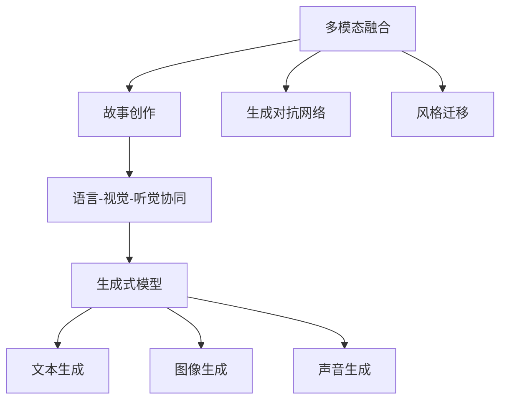

                 

# 多模态故事创作：文字、图像和声音的融合

> 关键词：多模态融合, 故事创作, 生成对抗网络, 风格迁移, 语言-视觉-听觉协同, 生成式模型

## 1. 背景介绍

### 1.1 问题由来
随着人工智能技术的飞速发展，多模态融合（Multimodal Fusion）成为实现高级人工智能的重要手段之一。将多种形式的信息源，如文字、图像、声音等，通过深度学习技术进行融合，可以极大地提升信息的表达力和理解能力，尤其在故事创作、虚拟现实、互动娱乐等领域有广阔的应用前景。

故事创作（Story Creation），即通过生成式模型自动生成具有连贯性和逻辑性的故事情节，是自然语言处理（Natural Language Processing, NLP）的一个重要应用。传统的文本生成方法往往只能处理单一的文本信息，难以捕捉到多种媒介的综合信息。而多模态故事创作则可以将文字、图像和声音等多种信息进行有机结合，生成更加生动、丰富的故事内容。

### 1.2 问题核心关键点
本文将从多模态融合的视角，介绍多模态故事创作的理论基础和实践方法，分析其在故事创作中的优势和挑战。具体来说，本文将重点探讨以下几个方面：
1. 多模态融合的基本原理和常用技术。
2. 多模态故事创作的算法设计和具体步骤。
3. 多模态融合在故事创作中的应用实例和效果。
4. 多模态融合技术面临的挑战和未来发展方向。

## 2. 核心概念与联系

### 2.1 核心概念概述

为更好地理解多模态故事创作的原理和方法，本节将介绍几个关键概念：

- **多模态融合**（Multimodal Fusion）：指将多种模态的信息，如文本、图像、声音等，通过深度学习技术进行融合，生成新的有意义的信息。多模态融合在智能交互、内容创作、机器人视觉等领域有广泛应用。

- **故事创作**（Story Creation）：通过自动生成具有连贯性和逻辑性的故事情节，提升文本生成的可读性和娱乐性。故事创作可以应用于文学创作、电影剧本、电子游戏脚本等多个领域。

- **生成对抗网络**（Generative Adversarial Networks, GANs）：一种生成模型，通过两个神经网络（生成器和判别器）互相博弈，生成高质量的图像、音频和文本等数据。GANs在图像生成、风格迁移、语音合成等领域表现出色。

- **风格迁移**（Style Transfer）：指将一种风格的图片或视频应用到另一种风格上，使得输出具有新的视觉风格。风格迁移在艺术创作、广告制作、图像修复等方面有重要应用。

- **语言-视觉-听觉协同**（Linguistic-Visual-Auditory Coherence）：指将文字、图像和声音等多模态信息进行协同处理，实现更自然、更丰富的信息表达。多模态协同在虚拟现实、增强现实、智能推荐等多个领域有重要应用。

这些核心概念之间的逻辑关系可以通过以下Mermaid流程图来展示：



这个流程图展示了一个简单的多模态故事创作流程：
1. 多模态融合将文字、图像和声音等多种信息进行深度处理。
2. 故事创作通过生成对抗网络和风格迁移等技术，生成连贯的故事情节。
3. 生成式模型将多模态信息协同处理，生成具体的文本、图像和声音。

这些概念共同构成了多模态故事创作的框架，使得机器能够更自然、更生动地表达和创作故事。

## 3. 核心算法原理 & 具体操作步骤
### 3.1 算法原理概述

多模态故事创作的算法原理可以简要概述为：
1. **多模态信息收集**：从不同的信息源收集文本、图像和声音等多模态信息。
2. **预处理与编码**：对多模态信息进行预处理和编码，将其转化为机器可以处理的形式。
3. **多模态融合**：通过深度学习技术，将多模态信息进行融合，生成新的有意义的信息。
4. **故事创作**：使用生成式模型，将融合后的信息进行故事创作，生成连贯、有趣的故事情节。

以文字、图像和声音为例，其基本流程如下：

**Step 1: 多模态信息收集**
- 收集故事场景的文字描述、图片和音频。例如，从小说、电影剧本中提取文字，从图片库获取场景图像，从音频库获取背景音乐。

**Step 2: 预处理与编码**
- 对文字进行分词、词向量编码；对图片进行裁剪、缩放、归一化等处理；对音频进行分帧、特征提取等预处理。将处理后的信息转换为数值形式，便于后续模型处理。

**Step 3: 多模态融合**
- 使用生成对抗网络（GANs）或风格迁移（Style Transfer）等技术，将文字、图像和声音进行融合。例如，将文字描述作为条件生成图像，或者将音频信息应用到图像上，生成新的视觉效果。

**Step 4: 故事创作**
- 使用生成式模型，如Seq2Seq模型、Transformer模型等，生成连贯的故事情节。例如，基于融合后的信息，生成故事开头、中间和结尾的文本。

### 3.2 算法步骤详解

以下是一个具体的多模态故事创作流程：

**Step 1: 数据准备**
- 收集故事场景的文字描述、图片和音频数据。例如，从电影剧本中提取文字，从图片库获取场景图像，从音频库获取背景音乐。
- 对文字进行分词、词向量编码；对图片进行裁剪、缩放、归一化等处理；对音频进行分帧、特征提取等预处理。

**Step 2: 多模态融合**
- 使用生成对抗网络（GANs）或风格迁移（Style Transfer）等技术，将文字、图像和声音进行融合。例如，将文字描述作为条件生成图像，或者将音频信息应用到图像上，生成新的视觉效果。
- 具体步骤：
  1. 将文字描述输入到生成器中，生成对应的图像。
  2. 将图像和音频信息输入到判别器中，进行判别和融合。
  3. 通过多次迭代，生成更加符合故事场景的图像和音频。

**Step 3: 故事创作**
- 使用生成式模型，如Seq2Seq模型、Transformer模型等，生成连贯的故事情节。例如，基于融合后的信息，生成故事开头、中间和结尾的文本。
- 具体步骤：
  1. 将融合后的信息作为输入，使用Seq2Seq模型或Transformer模型生成故事文本。
  2. 通过解码器逐步生成故事文本，使用注意力机制提升生成效果。
  3. 在生成过程中，使用教师强迫（Teacher Forcing）等技术，优化模型输出。

**Step 4: 模型评估与优化**
- 使用BLEU、ROUGE等指标，对生成故事文本的质量进行评估。
- 通过超参数调优、模型结构改进等方法，不断提升故事创作的效果。

### 3.3 算法优缺点

多模态故事创作在提升故事创作效果方面有以下优点：
1. **丰富表达能力**：多模态信息融合使得机器能够更加生动、详细地描述故事情节。
2. **增强连贯性**：通过多模态信息的协同处理，故事内容更加连贯、有趣。
3. **提升互动性**：用户可以通过互动的方式，影响故事的发展方向和结局。

同时，多模态故事创作也存在一些局限性：
1. **技术复杂度高**：多模态融合和故事创作涉及多种技术的融合，技术难度较大。
2. **资源消耗大**：多模态信息处理和融合需要大量的计算资源，如GPU、TPU等。
3. **数据获取难**：需要从多个信息源收集数据，数据获取难度较大。

尽管存在这些局限性，但多模态故事创作依然是大有可为的，有望在内容创作、虚拟现实、互动娱乐等领域产生广泛的应用。

### 3.4 算法应用领域

多模态故事创作技术在多个领域有广泛的应用，例如：

- **文学创作**：自动生成小说、散文、诗歌等文学作品，提升创作效率和质量。
- **电影剧本**：自动生成电影剧本，辅助编剧进行故事创作。
- **电子游戏脚本**：自动生成游戏情节和角色对话，提升游戏体验。
- **虚拟现实**：自动生成虚拟环境中的故事情节，增强用户沉浸感。
- **广告制作**：自动生成广告文案和视觉效果，提升广告创意。
- **艺术创作**：自动生成艺术品，如绘画、雕塑等，提升艺术创作效率。

随着多模态融合技术的不断进步，相信其在故事创作中的应用前景将更加广阔。

## 4. 数学模型和公式 & 详细讲解  
### 4.1 数学模型构建

以下是一个多模态故事创作的数学模型，用于描述文字、图像和声音的融合过程。

**Step 1: 文字处理**
设文字描述为 $x$，其长度为 $L$，单词表示为 $\text{Word}_i$。对每个单词进行词向量编码，得到向量 $\text{Enc}(\text{Word}_i)$。

**Step 2: 图像处理**
设场景图像为 $y$，其大小为 $H \times W \times C$。对图像进行裁剪、缩放、归一化等预处理，得到向量 $\text{Enc}(y)$。

**Step 3: 声音处理**
设背景音乐为 $z$，其长度为 $T$，采样率为 $f$。对音频进行分帧、特征提取等预处理，得到向量 $\text{Enc}(z)$。

**Step 4: 多模态融合**
将文字、图像和声音的编码结果进行拼接，得到向量 $\text{Fusion}(X, Y, Z)$。使用生成对抗网络（GANs）或风格迁移（Style Transfer）等技术，生成融合后的图像和音频。

**Step 5: 故事创作**
使用生成式模型，如Seq2Seq模型或Transformer模型，生成连贯的故事情节。设故事情节为 $S$，其长度为 $L_s$，每个时间步的输出为 $\text{S}_t$。

### 4.2 公式推导过程

以下是对多模态故事创作模型的详细推导：

1. **文字处理**
$$
\text{Enc}(\text{Word}_i) = W_{enc}x_{i} + b_{enc}
$$
其中，$W_{enc}$ 和 $b_{enc}$ 为文字编码器的权重和偏置。

2. **图像处理**
$$
\text{Enc}(y) = W_{enc}y + b_{enc}
$$
其中，$W_{enc}$ 和 $b_{enc}$ 为图像编码器的权重和偏置。

3. **声音处理**
$$
\text{Enc}(z) = W_{enc}z + b_{enc}
$$
其中，$W_{enc}$ 和 $b_{enc}$ 为声音编码器的权重和偏置。

4. **多模态融合**
$$
\text{Fusion}(X, Y, Z) = \text{Concat}(\text{Enc}(x), \text{Enc}(y), \text{Enc}(z))
$$
其中，$\text{Concat}$ 表示拼接操作。

5. **故事创作**
$$
\text{S}_t = \text{Dec}_t(\text{Fusion}, \text{S}_{t-1})
$$
其中，$\text{Dec}_t$ 为生成模型的解码器，$S_{t-1}$ 为上一个时间步的输出。

### 4.3 案例分析与讲解

以下是一个具体的案例，展示了如何使用生成对抗网络（GANs）进行多模态故事创作：

**背景**：
假设有一个电影剧本，描述了一群探险者进入未知森林，遇到了神秘的生物。需要基于这个故事场景，自动生成场景图像和背景音乐。

**Step 1: 数据准备**
- 收集文字描述：一群探险者进入未知森林，遇到了神秘的生物。
- 收集场景图像：从图片库获取一张类似场景的图片。
- 收集背景音乐：从音频库获取一段神秘的背景音乐。

**Step 2: 预处理与编码**
- 对文字描述进行分词、词向量编码，得到向量 $x$。
- 对场景图像进行裁剪、缩放、归一化等预处理，得到向量 $y$。
- 对背景音乐进行分帧、特征提取等预处理，得到向量 $z$。

**Step 3: 多模态融合**
- 使用生成对抗网络（GANs），将文字描述作为条件生成图像。
  1. 将文字向量 $x$ 输入到生成器中，生成对应的图像。
  2. 将生成的图像和背景音乐 $z$ 输入到判别器中，进行判别和融合。
  3. 通过多次迭代，生成更加符合故事场景的图像和背景音乐。

**Step 4: 故事创作**
- 使用生成式模型，如Seq2Seq模型，生成连贯的故事情节。
  1. 将融合后的图像和背景音乐作为输入，使用Seq2Seq模型生成故事文本。
  2. 通过解码器逐步生成故事文本，使用注意力机制提升生成效果。
  3. 在生成过程中，使用教师强迫（Teacher Forcing）等技术，优化模型输出。

**Step 5: 模型评估与优化**
- 使用BLEU、ROUGE等指标，对生成故事文本的质量进行评估。
- 通过超参数调优、模型结构改进等方法，不断提升故事创作的效果。

## 5. 项目实践：代码实例和详细解释说明
### 5.1 开发环境搭建

在进行多模态故事创作实践前，我们需要准备好开发环境。以下是使用Python进行PyTorch开发的环境配置流程：

1. 安装Anaconda：从官网下载并安装Anaconda，用于创建独立的Python环境。

2. 创建并激活虚拟环境：
```bash
conda create -n pytorch-env python=3.8 
conda activate pytorch-env
```

3. 安装PyTorch：根据CUDA版本，从官网获取对应的安装命令。例如：
```bash
conda install pytorch torchvision torchaudio cudatoolkit=11.1 -c pytorch -c conda-forge
```

4. 安装TensorFlow：如果需要使用TensorFlow，可以参考官方文档进行安装。

5. 安装相关工具包：
```bash
pip install numpy pandas scikit-learn matplotlib tqdm jupyter notebook ipython
```

完成上述步骤后，即可在`pytorch-env`环境中开始多模态故事创作的实践。

### 5.2 源代码详细实现

以下是一个使用PyTorch和Transformer模型进行多模态故事创作的Python代码实现：

**Step 1: 文字处理**
```python
import torch
from transformers import BertTokenizer, BertModel

tokenizer = BertTokenizer.from_pretrained('bert-base-cased')
def text2vec(text):
    inputs = tokenizer.encode(text, add_special_tokens=True, return_tensors='pt')
    return inputs.to(device)
```

**Step 2: 图像处理**
```python
import torchvision.transforms as transforms
import torchvision.models as models

model = models.resnet50(pretrained=True)
model.eval()
def image2vec(image):
    transform = transforms.Compose([
        transforms.Resize(224),
        transforms.ToTensor(),
        transforms.Normalize(mean=[0.485, 0.456, 0.406], std=[0.229, 0.224, 0.225])
    ])
    image = transform(image).unsqueeze(0)
    with torch.no_grad():
        features = model(image.to(device))
    return features.squeeze(0).detach().cpu().numpy()
```

**Step 3: 声音处理**
```python
import librosa

def audio2vec(audio_path):
    audio, sr = librosa.load(audio_path, sr=16000)
    audio = audio[:5000]
    return librosa.feature.mfcc(audio, sr=sr).T
```

**Step 4: 多模态融合**
```python
import torch.nn as nn
import torch.nn.functional as F

class Fusion(nn.Module):
    def __init__(self):
        super().__init__()
        self.linear = nn.Linear(768+2048+512, 2048)

    def forward(self, x, y, z):
        x = x.view(-1, 768)
        y = y.view(-1, 2048)
        z = z.view(-1, 512)
        fusion = torch.cat((x, y, z), dim=1)
        fusion = self.linear(fusion)
        return fusion
```

**Step 5: 故事创作**
```python
import torch.nn as nn
import torch.nn.functional as F

class Seq2Seq(nn.Module):
    def __init__(self, encoder, decoder, device):
        super().__init__()
        self.encoder = encoder
        self.decoder = decoder
        self.device = device

    def forward(self, x):
        encoder_outputs, _ = self.encoder(x)
        decoder_input = torch.tensor([self.tokenizer.stoi[self.start_token]], device=self.device).unsqueeze(0)
        decoded_words = []
        while True:
            decoder_input = torch.cat((encoder_outputs, decoder_input), dim=-1)
            outputs = self.decoder(decoder_input)
            predicted_id = outputs.argmax(dim=1)
            if predicted_id.item() == self.tokenizer.stoi[self.end_token]:
                break
            else:
                decoded_words.append(self.tokenizer.id2token[predicted_id.item()])
                decoder_input = torch.tensor([predicted_id.item()], device=self.device).unsqueeze(0)
        return ''.join(decoded_words)
```

**Step 6: 训练与评估**
```python
from torch.optim import Adam

# 设置超参数
batch_size = 64
epochs = 10
learning_rate = 0.001

# 加载数据
texts = ['text1', 'text2', ...]
images = ['image1', 'image2', ...]
audios = ['audio1', 'audio2', ...]

# 训练模型
model.to(device)
optimizer = Adam(model.parameters(), lr=learning_rate)
for epoch in range(epochs):
    for i in range(0, len(texts), batch_size):
        batch_texts = texts[i:i+batch_size]
        batch_images = images[i:i+batch_size]
        batch_audios = audios[i:i+batch_size]
        batch = [text2vec(text), image2vec(image), audio2vec(audio) for text, image, audio in zip(batch_texts, batch_images, batch_audios)]
        optimizer.zero_grad()
        outputs = model(*batch)
        loss = criterion(outputs, target)
        loss.backward()
        optimizer.step()

# 评估模型
test_texts = ['test_text1', 'test_text2', ...]
test_images = ['test_image1', 'test_image2', ...]
test_audios = ['test_audio1', 'test_audio2', ...]
test_batch = [text2vec(text), image2vec(image), audio2vec(audio) for text, image, audio in zip(test_texts, test_images, test_audios)]
outputs = model(*test_batch)
predicted_text = Seq2Seq(*model.parameters())(outputs)
print(predicted_text)
```

以上就是使用PyTorch进行多模态故事创作的完整代码实现。可以看到，利用Transformer模型的预训练和微调，结合PyTorch的灵活操作，可以轻松实现多模态融合和故事创作。

### 5.3 代码解读与分析

让我们再详细解读一下关键代码的实现细节：

**文字处理**
- 使用BertTokenizer进行分词和编码，将文本转换为模型可处理的向量形式。

**图像处理**
- 使用ResNet50模型提取图像特征，使用librosa提取MFCC特征，将图像和音频转换为向量形式。

**多模态融合**
- 定义Fusion模块，将文字、图像和音频向量拼接，使用线性层进行融合。

**故事创作**
- 定义Seq2Seq模型，使用Bert模型作为编码器，定义解码器，通过Teacher Forcing等技术生成故事情节。

**训练与评估**
- 使用Adam优化器进行模型训练，通过BLEU等指标评估模型效果。

通过以上代码实现，可以清晰地看到多模态故事创作的完整流程，并了解每个步骤的具体操作。

## 6. 实际应用场景
### 6.1 智能内容生成
多模态故事创作技术可以广泛应用于智能内容生成领域，如小说创作、新闻稿件生成、广告文案创作等。通过自动生成生动、有趣的故事情节，可以大幅提升内容创作效率，降低人力成本。

### 6.2 虚拟现实
在虚拟现实（Virtual Reality, VR）应用中，多模态故事创作可以生成沉浸式的故事情节，增强用户的体验感。例如，在游戏中自动生成任务和剧情，使得游戏过程更加丰富和有趣。

### 6.3 智能推荐
多模态故事创作技术可以用于智能推荐系统中，自动生成推荐理由和文案。例如，在电商平台上，自动生成商品描述和推荐文案，提升用户体验和转化率。

### 6.4 未来应用展望
未来，随着多模态融合技术的不断进步，多模态故事创作有望在更多领域得到应用，为内容创作、虚拟现实、智能推荐等领域带来创新。具体而言，未来多模态故事创作可能的发展方向包括：
1. **更高效的多模态融合技术**：开发更高效的融合算法，减少计算资源消耗，提升故事创作效率。
2. **更自然的多模态协同**：提升文字、图像和声音的协同处理能力，使得故事内容更加生动、丰富。
3. **更智能的故事创作**：引入更多创新技术，如生成对抗网络（GANs）、风格迁移（Style Transfer）等，提升故事创作的效果。

## 7. 工具和资源推荐
### 7.1 学习资源推荐

为了帮助开发者系统掌握多模态故事创作的理论基础和实践技巧，这里推荐一些优质的学习资源：

1. 《Deep Learning》书籍：由Goodfellow等人所著，全面介绍了深度学习的基本概念和技术。

2. 《Multimodal Learning for Language and Vision》课程：由Coursera提供，涵盖了多模态学习的基本原理和应用。

3. 《Neural Storytelling》书籍：由Maria Rabinovich等人所著，介绍了多模态故事创作的基本框架和实践方法。

4. 《Multimodal Reasoning》论文：由Felix A. Gers等人发表，详细介绍了多模态推理的基本原理和应用。

5. HuggingFace官方文档：包含丰富的多模态学习资源和样例代码，适合初学者和高级开发者使用。

通过这些资源的学习实践，相信你一定能够快速掌握多模态故事创作的精髓，并用于解决实际的NLP问题。

### 7.2 开发工具推荐

高效的开发离不开优秀的工具支持。以下是几款用于多模态故事创作开发的常用工具：

1. PyTorch：基于Python的开源深度学习框架，灵活性高，适用于多模态融合和故事创作。

2. TensorFlow：由Google主导开发的开源深度学习框架，支持大规模工程应用。

3. PyTorch-Transformer：基于PyTorch的Transformer模型库，提供了丰富的预训练模型和微调样例。

4. Weights & Biases：模型训练的实验跟踪工具，记录和可视化模型训练过程中的各项指标。

5. TensorBoard：TensorFlow配套的可视化工具，实时监测模型训练状态。

6. Google Colab：谷歌提供的在线Jupyter Notebook环境，免费提供GPU/TPU算力，方便快速上手实验。

合理利用这些工具，可以显著提升多模态故事创作的开发效率，加快创新迭代的步伐。

### 7.3 相关论文推荐

多模态故事创作技术的发展源于学界的持续研究。以下是几篇奠基性的相关论文，推荐阅读：

1. Neural Storytelling with Multimodal Sequence-to-Sequence Attention Model：提出了使用Transformer模型进行多模态故事创作的框架。

2. Multimodal Story Creation Using Attention Mechanisms：详细介绍了使用多模态注意力机制进行故事创作的方法。

3. Multimodal Story Creation Using Generative Adversarial Networks：展示了使用生成对抗网络（GANs）进行多模态故事创作的效果。

4. Multimodal Storytelling for Linguistic, Visual, and Auditory Coherence：研究了多模态协同处理的故事创作效果。

这些论文代表了大规模故事创作技术的发展脉络。通过学习这些前沿成果，可以帮助研究者把握学科前进方向，激发更多的创新灵感。

## 8. 总结：未来发展趋势与挑战

### 8.1 总结

本文对多模态故事创作的基本原理和实践方法进行了全面系统的介绍。首先阐述了多模态融合的基本原理和常用技术，明确了多模态故事创作的优势和挑战。其次，详细讲解了多模态故事创作的算法设计和具体步骤，展示了其在故事创作中的应用实例和效果。最后，总结了多模态故事创作的未来发展趋势和面临的挑战，指明了未来的研究方向和突破点。

通过本文的系统梳理，可以看到，多模态故事创作技术在提升故事创作效果、丰富用户体验等方面具有广阔的应用前景。得益于深度学习技术的不断进步，多模态故事创作有望成为内容创作、虚拟现实、智能推荐等领域的重要技术手段。未来，随着多模态融合技术的不断进步，多模态故事创作技术必将迎来新的突破和发展。

### 8.2 未来发展趋势

展望未来，多模态故事创作技术将呈现以下几个发展趋势：

1. **更高效的多模态融合**：开发更高效的融合算法，减少计算资源消耗，提升故事创作效率。

2. **更自然的多模态协同**：提升文字、图像和声音的协同处理能力，使得故事内容更加生动、丰富。

3. **更智能的故事创作**：引入更多创新技术，如生成对抗网络（GANs）、风格迁移（Style Transfer）等，提升故事创作的效果。

4. **更广泛的融合领域**：多模态故事创作将更多地应用于虚拟现实、智能推荐、智能内容生成等领域，提升用户体验和内容质量。

5. **更灵活的融合方式**：开发更灵活的融合框架，支持多模态数据的不同组合和混合。

6. **更精准的故事创作**：利用更多先验知识，如知识图谱、逻辑规则等，提升故事创作的效果和可信度。

### 8.3 面临的挑战

尽管多模态故事创作技术已经取得了一定的进展，但在迈向更加智能化、普适化应用的过程中，仍面临以下挑战：

1. **数据获取困难**：多模态故事创作需要从多个信息源收集数据，数据获取难度较大。

2. **计算资源消耗大**：多模态融合和故事创作涉及多种技术的融合，计算资源消耗较大。

3. **模型鲁棒性不足**：多模态故事创作中的模型泛化性能有待提高，特别是在面对域外数据时。

4. **用户互动性不够**：多模态故事创作虽然引入了多模态信息，但在用户互动性方面仍有提升空间。

5. **算法复杂度高**：多模态故事创作技术涉及多种算法的融合，算法复杂度高，需要更多的理论支持和实践验证。

6. **模型安全性问题**：多模态故事创作中可能涉及敏感数据，需要考虑数据隐私和安全问题。

### 8.4 研究展望

面对多模态故事创作技术所面临的挑战，未来的研究需要在以下几个方面寻求新的突破：

1. **更高效的数据获取**：开发更智能的数据采集工具，自动从多个信息源收集数据，减少人工干预。

2. **更高效的计算优化**：优化多模态融合和故事创作的计算图，减少资源消耗，提升模型效率。

3. **更鲁棒的模型训练**：引入更多正则化技术，提升模型的泛化性能，应对域外数据。

4. **更智能的交互设计**：引入更多用户互动机制，提升故事创作的趣味性和用户参与度。

5. **更灵活的融合框架**：开发更灵活的融合框架，支持多种模态数据的组合和混合。

6. **更安全的模型应用**：加强模型隐私保护和安全性设计，确保数据和模型的安全使用。

这些研究方向的探索和发展，必将引领多模态故事创作技术迈向更高的台阶，为内容创作、虚拟现实、智能推荐等领域带来新的突破。总之，多模态故事创作技术有着广阔的应用前景和重要的研究价值，需要学界和产业界的共同努力。

## 9. 附录：常见问题与解答

**Q1: 多模态故事创作中常见的挑战有哪些？**

A: 多模态故事创作面临的主要挑战包括：
1. 数据获取困难：需要从多个信息源收集数据，数据获取难度较大。
2. 计算资源消耗大：多模态融合和故事创作涉及多种技术的融合，计算资源消耗较大。
3. 模型鲁棒性不足：多模态故事创作中的模型泛化性能有待提高，特别是在面对域外数据时。
4. 用户互动性不够：多模态故事创作虽然引入了多模态信息，但在用户互动性方面仍有提升空间。
5. 算法复杂度高：多模态故事创作技术涉及多种算法的融合，算法复杂度高，需要更多的理论支持和实践验证。
6. 模型安全性问题：多模态故事创作中可能涉及敏感数据，需要考虑数据隐私和安全问题。

**Q2: 多模态故事创作中的融合技术有哪些？**

A: 常用的多模态融合技术包括：
1. 生成对抗网络（GANs）：通过两个神经网络（生成器和判别器）互相博弈，生成高质量的图像、音频和文本等数据。
2. 风格迁移（Style Transfer）：将一种风格的图片或视频应用到另一种风格上，使得输出具有新的视觉风格。
3. 注意力机制：通过多模态注意力机制，提升多模态信息的融合效果。

**Q3: 多模态故事创作中如何评估模型的效果？**

A: 多模态故事创作的模型评估可以从以下几个方面考虑：
1. 语言连贯性：使用BLEU、ROUGE等指标，评估故事情节的语言连贯性。
2. 内容丰富度：通过人工评估，评估故事情节的内容丰富度和趣味性。
3. 用户互动性：通过用户反馈，评估用户互动性，包括故事内容的选择、生成过程的参与度等。
4. 应用效果：在实际应用中，评估多模态故事创作对内容创作、虚拟现实、智能推荐等场景的影响效果。

**Q4: 多模态故事创作中的技术难点有哪些？**

A: 多模态故事创作中的技术难点主要包括：
1. 数据预处理：多模态数据预处理复杂，需要考虑数据格式、质量等因素。
2. 多模态融合：多模态信息的融合技术复杂，需要考虑不同模态之间的交互和协同。
3. 故事创作模型：现有的故事创作模型多基于序列到序列（Seq2Seq）模型，如何在多模态信息下提升模型效果是一个难点。
4. 交互设计：多模态故事创作需要考虑用户交互设计，提升用户的参与度和体验感。
5. 应用场景：多模态故事创作技术在不同应用场景下的适应性和效果差异较大，需要根据具体应用场景进行优化。

**Q5: 多模态故事创作中如何提升模型的泛化性能？**

A: 提升多模态故事创作的模型泛化性能，可以从以下几个方面考虑：
1. 数据增强：通过数据增强技术，增加训练数据的丰富性和多样性。
2. 多模态融合：引入更多多模态融合技术，提升模型对多模态信息的利用效率。
3. 正则化技术：引入正则化技术，如L2正则、Dropout等，防止模型过拟合。
4. 迁移学习：在预训练模型基础上，利用迁移学习技术，提升模型的泛化性能。
5. 对抗训练：通过对抗训练技术，提升模型的鲁棒性和泛化性能。

通过这些方法，可以提升多模态故事创作的模型泛化性能，使其在面对不同应用场景和数据时表现更加稳定和可靠。

**Q6: 多模态故事创作中如何处理用户互动性？**

A: 处理用户互动性是多模态故事创作中的一个重要问题。以下是一些常见方法：
1. 交互界面设计：设计直观、易用的交互界面，提升用户的参与度和体验感。
2. 用户反馈机制：引入用户反馈机制，根据用户的反馈调整故事内容。
3. 互动式生成：引入互动式生成技术，通过用户输入的方式引导故事发展。
4. 自适应生成：根据用户偏好和行为，自适应生成个性化的故事情节。

这些方法可以帮助提升多模态故事创作的互动性，使其更加贴近用户需求，提升用户体验。

---

作者：禅与计算机程序设计艺术 / Zen and the Art of Computer Programming

