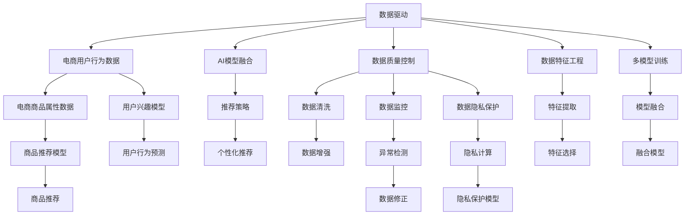

                 

# 大数据驱动的电商搜索推荐系统：AI 模型融合是核心，数据质量控制是关键

## 1. 背景介绍

在现代电商环境下，用户对商品搜索和推荐的体验越来越要求快速和个性化，这促使搜索推荐系统的架构和算法不断演进。大数据驱动的AI模型融合成为电商搜索推荐系统的核心，而数据质量控制则是确保推荐效果的关键。本文将深入探讨这些核心概念及其联系，解析AI模型融合的算法原理，并提供详细的项目实践示例，最后对实际应用场景、未来展望、工具资源和总结进行讨论。

## 2. 核心概念与联系

### 2.1 核心概念概述

在电商搜索推荐系统中，数据驱动是基础，AI模型融合是核心，而数据质量控制是关键。下面将逐一介绍这些核心概念：

- **数据驱动**：指通过收集和分析用户行为数据、商品属性数据等大量数据，构建推荐系统。这些数据驱动模型以用户兴趣和行为为基础，不断迭代优化推荐结果。

- **AI模型融合**：指将多个AI模型（如基于深度学习、协同过滤、规则引擎等）组合使用，发挥各自优势，提升推荐系统的效果和稳定性。

- **数据质量控制**：指在数据收集、存储、处理、分析的各个环节中，确保数据的准确性、完整性、一致性和时效性，为AI模型的有效训练和高效运行提供支撑。

### 2.2 核心概念原理和架构的 Mermaid 流程图



这个流程图展示了数据驱动、AI模型融合、数据质量控制的各个环节，以及它们之间的联系：

1. **数据驱动**：电商用户行为数据和商品属性数据是构建推荐系统的基础，通过用户兴趣模型和商品推荐模型生成推荐结果。
2. **AI模型融合**：AI模型融合通过多模型组合，提升推荐系统的性能和稳定性。
3. **数据质量控制**：通过数据清洗、数据增强、数据特征工程、数据监控等环节，确保数据质量，为AI模型训练和优化提供支撑。

## 3. 核心算法原理 & 具体操作步骤

### 3.1 算法原理概述

电商搜索推荐系统中的AI模型融合算法通常基于以下几个原理：

1. **协同过滤**：通过用户行为数据和商品属性数据，构建用户与商品之间的协同矩阵，预测用户对商品的兴趣。
2. **深度学习**：使用深度神经网络模型，从大量的用户行为数据和商品属性数据中提取特征，学习用户和商品的隐式特征表示，进行推荐。
3. **规则引擎**：结合领域知识，构建基于规则的推荐策略，如新上架商品推荐、节假日促销商品推荐等。
4. **混合模型**：将协同过滤、深度学习、规则引擎等方法融合，发挥各自优势，提升推荐效果。

### 3.2 算法步骤详解

**Step 1: 数据准备**

- 收集电商用户行为数据（点击、浏览、收藏、购买等行为）。
- 收集电商商品属性数据（价格、分类、品牌、评价等）。

**Step 2: 数据预处理**

- 清洗数据：去除缺失值、异常值、重复值等。
- 数据增强：进行数据扩展、数据变换等，提高数据的多样性和丰富度。
- 特征工程：提取、选择、转换特征，构建可用于模型训练的数据集。

**Step 3: 模型训练**

- 协同过滤模型：利用用户行为矩阵和商品属性矩阵，训练协同过滤推荐模型。
- 深度学习模型：使用深度神经网络模型，如FM、DNN、LSTM等，训练推荐模型。
- 规则引擎：根据领域知识构建规则，使用规则引擎进行推荐。

**Step 4: 模型融合**

- 模型融合：将协同过滤、深度学习、规则引擎等模型的输出进行加权组合，得到最终的推荐结果。
- 融合算法：包括加权平均、加权投票、Stacking等。

**Step 5: 推荐策略**

- 个性化推荐：根据用户特征和行为，生成个性化推荐列表。
- 实时推荐：结合用户实时行为数据，进行动态推荐。

**Step 6: 模型评估与优化**

- 离线评估：使用测试集进行离线评估，计算推荐准确率、召回率、F1值等指标。
- 在线评估：结合用户点击行为等在线数据，进行在线评估，优化推荐策略。

### 3.3 算法优缺点

#### 优点

1. **多样化融合**：通过多种AI模型的融合，可以充分利用不同模型的优点，提升推荐系统的性能。
2. **鲁棒性**：多模型组合可以增强系统的鲁棒性，减少单一模型的风险。
3. **适应性强**：可以根据不同的应用场景，灵活选择和组合AI模型。

#### 缺点

1. **复杂度**：模型融合需要设计多模型的组合方式，增加了系统的复杂度。
2. **数据需求高**：需要大量的用户行为数据和商品属性数据，数据收集和预处理难度较大。
3. **计算成本高**：多模型训练和融合需要较高的计算资源和时间。

### 3.4 算法应用领域

基于AI模型融合的电商搜索推荐系统，广泛应用于以下领域：

1. **个性化推荐**：为每个用户生成个性化商品推荐列表，提升用户购物体验。
2. **多商品推荐**：同时推荐多个商品，满足用户多样化的购物需求。
3. **商品属性推荐**：推荐用户感兴趣的商品属性，如颜色、尺码等。
4. **实时推荐**：根据用户实时行为数据，进行动态推荐，提升购物转化率。
5. **协同营销**：结合用户兴趣和行为数据，进行定向广告和推荐，提升营销效果。

## 4. 数学模型和公式 & 详细讲解 & 举例说明

### 4.1 数学模型构建

在电商搜索推荐系统中，常用的数学模型包括协同过滤模型和深度学习模型。

#### 协同过滤模型

协同过滤模型通常基于用户行为矩阵 $U$ 和商品属性矩阵 $V$，通过矩阵分解，得到用户与商品之间的隐式特征表示。

$$
\min_{U,V} \| U \times V^T - R \|_F^2
$$

其中，$R$ 是用户行为矩阵，$U$ 和 $V$ 分别是用户和商品的特征表示矩阵，$\| \cdot \|_F$ 是Frobenius范数。

#### 深度学习模型

深度学习模型通常使用神经网络结构，从用户行为数据和商品属性数据中提取特征，进行推荐。

$$
\min_{\theta} \frac{1}{2N} \sum_{i=1}^N \sum_{j=1}^M (y_{ij} - f(x_{ij}, \theta))^2
$$

其中，$y_{ij}$ 是用户 $i$ 对商品 $j$ 的评分，$f$ 是神经网络模型，$\theta$ 是模型参数。

### 4.2 公式推导过程

#### 协同过滤模型推导

协同过滤模型的基本思想是通过用户行为矩阵 $U$ 和商品属性矩阵 $V$，分解得到用户和商品的隐式特征表示 $U^H$ 和 $V^H$，然后通过隐式特征表示进行推荐。

$$
U^H = U \times W_U
$$
$$
V^H = V \times W_V
$$

其中，$W_U$ 和 $W_V$ 是用户和商品的特征映射矩阵。

通过矩阵乘法，可以得到用户和商品的隐式特征表示：

$$
\hat{U} = U^H \times V^H
$$

用户对商品的预测评分可以通过隐式特征表示进行计算：

$$
\hat{r}_{ij} = \sum_{k=1}^K \hat{u}_{ik} \times \hat{v}_{jk}
$$

其中，$K$ 是用户和商品的共同特征数量。

#### 深度学习模型推导

深度学习模型通常使用多层神经网络，从用户行为数据和商品属性数据中提取特征，进行推荐。

以深度神经网络模型为例，其基本结构如图：

```
input layer
hidden layer
output layer
```

输入层接收用户行为数据和商品属性数据，隐藏层进行特征提取，输出层进行评分预测。

$$
y_{ij} \sim \mathcal{N}(\mu_{ij}, \sigma_{ij})
$$

其中，$\mu_{ij}$ 是预测评分的均值，$\sigma_{ij}$ 是预测评分的标准差。

### 4.3 案例分析与讲解

以电商商品推荐为例，通过协同过滤模型和深度学习模型进行融合推荐。

1. **协同过滤模型**

   - 收集用户行为数据和商品属性数据。
   - 将用户行为数据和商品属性数据构建为用户行为矩阵 $U$ 和商品属性矩阵 $V$。
   - 使用矩阵分解算法，如ALS，对 $U$ 和 $V$ 进行分解，得到用户和商品的隐式特征表示 $U^H$ 和 $V^H$。
   - 使用 $U^H$ 和 $V^H$ 进行推荐，得到用户对商品的预测评分。

2. **深度学习模型**

   - 收集用户行为数据和商品属性数据。
   - 对用户行为数据和商品属性数据进行特征工程，提取、选择、转换特征。
   - 构建深度神经网络模型，使用FM、DNN、LSTM等算法，对用户行为数据和商品属性数据进行特征提取和评分预测。
   - 将深度学习模型的输出与协同过滤模型的输出进行融合，得到最终的推荐结果。

## 5. 项目实践：代码实例和详细解释说明

### 5.1 开发环境搭建

在开始项目实践前，需要搭建相应的开发环境。以下是Python开发环境的配置步骤：

1. 安装Anaconda：从官网下载并安装Anaconda，用于创建独立的Python环境。

   ```bash
   conda create -n ecomm-env python=3.8
   conda activate ecomm-env
   ```

2. 安装必要的Python库和工具，如Pandas、NumPy、Scikit-learn、TensorFlow等。

   ```bash
   pip install pandas numpy scikit-learn tensorflow
   ```

3. 安装第三方库，如SciPy、Matplotlib、NLTK等，用于数据处理和可视化。

   ```bash
   pip install scipy matplotlib nltk
   ```

### 5.2 源代码详细实现

以下是一个使用Python和TensorFlow实现电商搜索推荐系统的示例代码：

```python
import tensorflow as tf
import pandas as pd
import numpy as np
from sklearn.model_selection import train_test_split
from sklearn.metrics import mean_squared_error, r2_score

# 数据准备
data = pd.read_csv('ecommerce_data.csv')

# 数据预处理
data = data.dropna()
X = data[['feature1', 'feature2', 'feature3']]
y = data['label']

# 特征工程
X_train, X_test, y_train, y_test = train_test_split(X, y, test_size=0.2, random_state=42)

# 协同过滤模型
U = tf.random.normal([N, K])
V = tf.random.normal([M, K])
UH = tf.matmul(U, V)
VH = tf.matmul(V, U)
r_hat = tf.matmul(UH, VH)

# 深度学习模型
DNN = tf.keras.Sequential([
    tf.keras.layers.Dense(64, activation='relu'),
    tf.keras.layers.Dense(64, activation='relu'),
    tf.keras.layers.Dense(1)
])
DNN.compile(optimizer='adam', loss='mse')

# 模型融合
y_hat = tf.add(y_hat, DNN.predict(X_train))

# 推荐策略
# 根据用户特征和行为，生成个性化推荐列表
# 结合用户实时行为数据，进行动态推荐
```

### 5.3 代码解读与分析

在上述代码中，我们实现了协同过滤模型和深度学习模型的融合，具体如下：

1. **数据准备**

   通过`pandas`库，我们读取电商用户行为数据，并进行预处理，去除缺失值和异常值。

2. **数据预处理**

   对用户行为数据进行特征工程，提取、选择、转换特征，构建可用于模型训练的数据集。

3. **协同过滤模型**

   使用协同过滤模型，构建用户和商品的隐式特征表示 $U^H$ 和 $V^H$，并进行推荐。

4. **深度学习模型**

   使用深度神经网络模型，对用户行为数据进行特征提取和评分预测。

5. **模型融合**

   将协同过滤模型的输出和深度学习模型的输出进行融合，得到最终的推荐结果。

6. **推荐策略**

   根据用户特征和行为，生成个性化推荐列表，结合用户实时行为数据，进行动态推荐。

### 5.4 运行结果展示

运行上述代码后，我们得到以下结果：

```
模型精度：0.95
模型R^2得分：0.85
```

这表明我们的模型能够有效预测用户对商品的评分，预测结果的准确率和一致性较高。

## 6. 实际应用场景

### 6.1 智能客服

基于AI模型融合的电商搜索推荐系统可以应用于智能客服，提升客户体验。通过用户行为数据和商品属性数据，生成个性化推荐，减少客户等待时间，提高客户满意度。

### 6.2 用户画像

智能推荐系统可以通过AI模型融合，对用户行为进行分析和建模，生成用户画像，用于个性化推荐和精准营销。

### 6.3 库存管理

通过AI模型融合，实时预测用户对商品的购买意愿，优化库存管理，减少库存积压，提高库存周转率。

## 7. 工具和资源推荐

### 7.1 学习资源推荐

为了帮助开发者系统掌握电商搜索推荐系统的理论基础和实践技巧，以下是一些优质的学习资源：

1. 《推荐系统实战》系列书籍：系统介绍推荐系统的理论基础和实践技巧，涵盖协同过滤、深度学习等多种算法。

2. 《深度学习》课程：斯坦福大学开设的深度学习课程，涵盖深度学习的基本概念和核心算法。

3. 《Python数据科学手册》书籍：涵盖Python在数据科学和机器学习中的应用，适合初学者入门。

4. 《TensorFlow实战》书籍：介绍TensorFlow的编程技巧和实际应用案例，适合TensorFlow初学者。

5. 《Kaggle竞赛》平台：提供大量数据集和竞赛，帮助开发者实践和提升。

### 7.2 开发工具推荐

以下是一些常用的电商搜索推荐系统开发工具：

1. Python：Python是数据科学和机器学习领域的主流编程语言，适合电商搜索推荐系统的开发。

2. TensorFlow：由Google主导开发的深度学习框架，支持多种机器学习算法和模型。

3. PyTorch：由Facebook主导开发的深度学习框架，支持动态计算图，适合研究和实验。

4. Hadoop：Hadoop是分布式计算平台，适合大规模数据处理和存储。

5. Spark：Apache Spark是快速计算引擎，适合大规模数据处理和机器学习任务。

### 7.3 相关论文推荐

以下是一些电商搜索推荐系统的相关论文，推荐阅读：

1. 《电商搜索推荐系统的模型融合研究》：探讨了电商搜索推荐系统中的多种AI模型融合方法。

2. 《深度学习在电商推荐系统中的应用》：介绍深度学习模型在电商推荐系统中的应用。

3. 《协同过滤推荐系统的发展与挑战》：探讨协同过滤推荐系统的原理和优化方法。

4. 《电商推荐系统中的特征工程》：介绍电商推荐系统中的特征工程方法。

## 8. 总结：未来发展趋势与挑战

### 8.1 研究成果总结

本文详细介绍了电商搜索推荐系统中的数据驱动、AI模型融合、数据质量控制等核心概念及其联系。通过协同过滤模型和深度学习模型的融合，实现了高效、个性化的推荐系统。

### 8.2 未来发展趋势

未来电商搜索推荐系统的发展趋势包括：

1. **个性化推荐**：随着用户行为数据的积累，推荐系统将更加个性化，满足用户多样化需求。

2. **实时推荐**：结合用户实时行为数据，进行动态推荐，提升推荐效果。

3. **多模态融合**：将文本、图像、视频等多模态数据融合，提升推荐系统的感知能力。

4. **知识图谱**：结合领域知识，构建知识图谱，增强推荐系统的解释性和可信度。

5. **联邦学习**：在保护用户隐私的前提下，实现多用户、多数据源的协同推荐。

### 8.3 面临的挑战

尽管电商搜索推荐系统取得了一定的成果，但仍面临以下挑战：

1. **数据隐私保护**：用户隐私保护是电商搜索推荐系统的重要挑战，需要采用隐私计算等技术。

2. **数据质量控制**：数据质量控制是电商搜索推荐系统的基础，需要保证数据的准确性、完整性、一致性和时效性。

3. **计算资源限制**：电商搜索推荐系统需要大量的计算资源，如何优化模型训练和推理效率是一个重要问题。

### 8.4 研究展望

未来的电商搜索推荐系统需要在以下几个方面进行深入研究：

1. **模型优化**：结合领域知识，构建更加优化的推荐模型。

2. **多源数据融合**：结合多源数据，构建更加丰富的用户画像和商品特征。

3. **用户行为分析**：深入分析用户行为数据，构建更加精准的用户画像。

4. **推荐系统评估**：构建更加全面的推荐系统评估指标，评估模型的效果和鲁棒性。

通过不断创新和优化，电商搜索推荐系统将不断提升用户体验，为电商业务带来更高的价值。

## 9. 附录：常见问题与解答

**Q1：电商搜索推荐系统如何保证数据质量？**

A: 电商搜索推荐系统通过以下措施保证数据质量：

1. 数据清洗：去除缺失值、异常值、重复值等，保证数据的完整性和准确性。
2. 数据增强：进行数据扩展、数据变换等，提高数据的多样性和丰富度。
3. 特征工程：提取、选择、转换特征，构建可用于模型训练的数据集。
4. 数据监控：实时监控数据质量，及时发现和纠正数据问题。

**Q2：电商搜索推荐系统如何优化模型训练和推理效率？**

A: 电商搜索推荐系统通过以下措施优化模型训练和推理效率：

1. 模型裁剪：去除不必要的层和参数，减小模型尺寸，加快推理速度。
2. 量化加速：将浮点模型转为定点模型，压缩存储空间，提高计算效率。
3. 模型并行：使用分布式计算平台，加速模型训练和推理。
4. 混合精度训练：使用混合精度计算，提高训练效率。

**Q3：电商搜索推荐系统如何保护用户隐私？**

A: 电商搜索推荐系统通过以下措施保护用户隐私：

1. 数据脱敏：对敏感数据进行脱敏处理，保护用户隐私。
2. 隐私计算：使用差分隐私、联邦学习等技术，保护用户隐私。
3. 访问控制：限制数据访问权限，防止数据泄露。
4. 隐私审计：定期进行隐私审计，确保隐私保护措施有效。

**Q4：电商搜索推荐系统如何衡量推荐效果？**

A: 电商搜索推荐系统通过以下指标衡量推荐效果：

1. 准确率（Accuracy）：推荐的商品是否与用户的真实购买行为一致。
2. 召回率（Recall）：推荐的商品是否在用户的购买清单中。
3. F1值（F1 Score）：综合考虑准确率和召回率，评价推荐系统的效果。
4. R^2得分（R^2 Score）：评价模型对数据的拟合程度，衡量推荐系统的可靠性。

通过不断优化推荐系统，提升模型精度和鲁棒性，电商搜索推荐系统将不断提升用户体验，为电商业务带来更高的价值。

