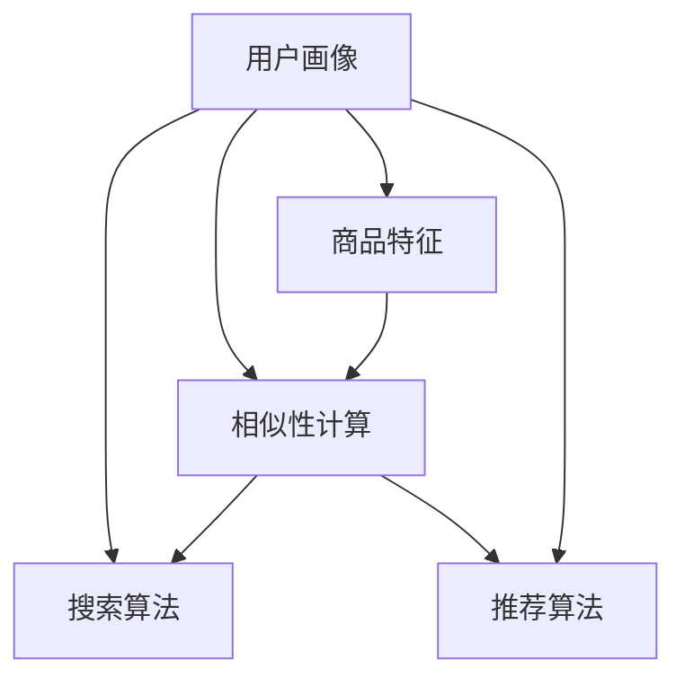

                 

# 大数据驱动的电商搜索推荐系统：AI 模型融合是核心，数据质量是关键

在大数据和人工智能技术的双重驱动下，电商搜索推荐系统已经从简单的关键词匹配演进为复杂的智能化系统。通过机器学习和大数据分析，电商平台能够更准确地理解用户需求，为用户推荐个性化的商品，大幅提升用户体验和购物效率。本文将详细介绍电商搜索推荐系统的核心算法、数据处理和实际应用，探讨其未来的发展趋势和面临的挑战，为电商搜索推荐系统的研究和实践提供有益的参考。

## 1. 背景介绍

### 1.1 问题由来

随着互联网和电子商务的飞速发展，用户对于购物体验的要求不断提高。传统的电商平台往往只能提供简单的商品搜索和展示，用户体验和商品推荐效果受限。基于大数据和人工智能技术的电商搜索推荐系统，通过深度学习和自然语言处理等技术，能够更精准地捕捉用户需求，提供个性化的商品推荐，大幅提升了用户的购物效率和满意度。

在实际应用中，电商搜索推荐系统主要包括以下几个关键组件：
- 用户画像生成：通过分析用户历史行为和个人信息，构建用户画像，了解用户的兴趣和需求。
- 商品特征抽取：从商品属性、描述、评论等数据中提取关键特征，用于商品匹配和推荐。
- 搜索和推荐算法：根据用户画像和商品特征，进行相似性计算，生成推荐结果。
- 用户反馈收集与优化：收集用户的点击、购买等反馈数据，持续优化推荐模型。

这些组件共同构成了电商搜索推荐系统的核心，帮助电商平台更好地服务用户，提升销量和用户体验。

### 1.2 问题核心关键点

电商搜索推荐系统的核心在于如何高效地处理大规模数据，同时保证推荐结果的个性化和准确性。具体来说，包括以下几个关键问题：

1. 如何高效地构建和维护用户画像：用户画像的精准度和完整度，直接影响推荐效果。
2. 如何高效地抽取和处理商品特征：商品特征的质量和覆盖度，直接影响相似性计算的准确性。
3. 如何选择合适的搜索和推荐算法：不同的推荐算法有各自的优缺点，需要根据具体情况选择合适的算法。
4. 如何高效地处理用户反馈：用户反馈数据对于优化推荐模型至关重要，需要高效地收集和分析。

## 2. 核心概念与联系

### 2.1 核心概念概述

电商搜索推荐系统的核心概念包括以下几个关键点：

- **用户画像（User Profile）**：用户画像是一系列描述用户特征的数据，包括基本信息、历史行为、兴趣偏好等。构建用户画像是推荐系统的基础。
- **商品特征（Product Feature）**：商品特征是从商品属性、描述、评论等数据中提取的关键信息，用于商品匹配和推荐。
- **相似性计算（Similarity Calculation）**：相似性计算是推荐算法的基础，通过计算用户和商品的相似度，生成推荐结果。
- **搜索算法（Search Algorithm）**：搜索算法用于快速定位用户可能感兴趣的商品，常用的算法包括倒排索引、TF-IDF等。
- **推荐算法（Recommendation Algorithm）**：推荐算法根据用户画像和商品特征，生成推荐结果。常用的算法包括协同过滤、基于内容的推荐、深度学习等。

这些核心概念之间的逻辑关系可以通过以下Mermaid流程图来展示：



这个流程图展示了大数据驱动的电商搜索推荐系统的核心组件及其之间的关系：

1. 用户画像通过商品特征与相似性计算生成推荐结果。
2. 用户画像和商品特征通过搜索算法进行快速定位。
3. 推荐算法根据相似性计算结果，生成推荐列表。

## 3. 核心算法原理 & 具体操作步骤

### 3.1 算法原理概述

电商搜索推荐系统的核心算法主要包括以下几个关键组件：

- **用户画像生成算法**：通过分析用户历史行为和个人信息，构建用户画像，了解用户的兴趣和需求。
- **商品特征抽取算法**：从商品属性、描述、评论等数据中提取关键特征，用于商品匹配和推荐。
- **相似性计算算法**：根据用户画像和商品特征，计算用户和商品的相似度。
- **搜索算法**：通过倒排索引、TF-IDF等技术，快速定位用户可能感兴趣的商品。
- **推荐算法**：根据相似性计算结果，生成推荐列表。

这些算法共同构成了电商搜索推荐系统的核心，帮助电商平台更好地服务用户，提升销量和用户体验。

### 3.2 算法步骤详解

电商搜索推荐系统的主要步骤包括：

**Step 1: 用户画像构建**
- 收集用户基本信息：如年龄、性别、地域等。
- 收集用户行为数据：如浏览历史、购买记录等。
- 分析用户行为：使用统计方法或机器学习算法，分析用户兴趣和需求。
- 构建用户画像：将用户基本信息和行为分析结果结合起来，形成用户画像。

**Step 2: 商品特征抽取**
- 收集商品属性数据：如商品名称、价格、品牌等。
- 收集商品描述数据：如商品详细描述、用户评论等。
- 提取商品特征：使用文本挖掘、自然语言处理等技术，从商品属性和描述中提取关键特征。
- 构建商品特征向量：将提取的特征表示为向量形式，便于相似性计算。

**Step 3: 相似性计算**
- 定义相似度计算公式：常用的相似度计算方法包括余弦相似度、欧式距离等。
- 计算用户与商品的相似度：将用户画像和商品特征向量分别表示为向量形式，使用相似度计算公式计算相似度。
- 生成推荐列表：根据相似度计算结果，排序生成推荐列表。

**Step 4: 搜索算法**
- 构建倒排索引：将商品特征作为关键词，将对应的商品ID存入索引表中。
- 处理用户查询：将用户查询转化为关键词，在倒排索引中查找相关商品ID。
- 筛选相关商品：根据用户画像和相似度计算结果，筛选相关商品。

**Step 5: 推荐算法**
- 根据相似度计算结果，生成推荐列表。
- 处理推荐列表：对推荐列表进行排序、去重、过滤等处理，生成最终的推荐结果。

### 3.3 算法优缺点

电商搜索推荐系统具有以下优点：

1. 高效性：通过倒排索引和相似度计算，可以快速定位和推荐相关商品。
2. 个性化：基于用户画像和商品特征，能够提供个性化的推荐结果。
3. 覆盖面广：能够覆盖大部分商品和用户，提升用户体验和满意度。

但同时也存在以下缺点：

1. 数据依赖：电商搜索推荐系统依赖于高质量的标注数据，数据质量直接影响推荐效果。
2. 复杂度高：模型需要处理大量的商品和用户数据，计算复杂度较高。
3. 冷启动问题：新用户或新商品无法得到有效的推荐，需要解决冷启动问题。

### 3.4 算法应用领域

电商搜索推荐系统已经广泛应用于各大电商平台，帮助用户快速找到所需商品，提升购物体验和满意度。以下是一些典型的应用场景：

- **商品推荐**：根据用户的历史购买和浏览记录，为用户推荐相关商品。
- **个性化推荐**：根据用户画像和商品特征，生成个性化的推荐列表。
- **搜索排序**：根据用户查询，快速定位相关商品，并按相关性排序。
- **促销活动推荐**：根据用户画像和商品属性，推荐促销活动和优惠券。

除了电商领域，搜索推荐系统还被应用于社交媒体、音乐和视频推荐、个性化新闻推荐等多个领域，为互联网用户提供了更好的体验。

## 4. 数学模型和公式 & 详细讲解 & 举例说明

### 4.1 数学模型构建

电商搜索推荐系统的核心数学模型包括以下几个关键部分：

- **用户画像生成模型**：通常使用协同过滤、基于内容的推荐等方法，构建用户画像。
- **商品特征抽取模型**：从商品属性、描述等数据中提取关键特征，通常使用TF-IDF、词袋模型等方法。
- **相似性计算模型**：计算用户画像和商品特征的相似度，通常使用余弦相似度、欧式距离等方法。
- **搜索算法模型**：通过倒排索引、TF-IDF等技术，快速定位相关商品。
- **推荐算法模型**：根据相似度计算结果，生成推荐列表，常用的方法包括协同过滤、基于内容的推荐、深度学习等。

### 4.2 公式推导过程

以余弦相似度计算为例，介绍电商搜索推荐系统中的相似性计算过程。

设用户画像为 $U$，商品特征为 $P$，则余弦相似度计算公式为：

$$
\text{similarity}(U, P) = \frac{\langle U, P \rangle}{\|U\| \cdot \|P\|}
$$

其中 $\langle \cdot, \cdot \rangle$ 表示向量的点积，$\|U\|$ 和 $\|P\|$ 分别表示用户画像和商品特征的模长。

在具体计算时，可以将用户画像和商品特征表示为向量形式，计算点积和模长，即可得到相似度。

### 4.3 案例分析与讲解

以基于协同过滤的推荐系统为例，介绍电商搜索推荐系统的工作原理。

协同过滤是一种常用的推荐算法，其基本思想是通过用户行为数据计算用户间的相似度，推荐与用户相似的其他用户喜欢的商品。具体步骤如下：

**Step 1: 用户相似度计算**
- 收集用户历史行为数据，构建用户-商品矩阵。
- 计算用户间的相似度，常用的方法包括余弦相似度、皮尔逊相关系数等。
- 选择与目标用户最相似的其他用户。

**Step 2: 商品相似度计算**
- 计算用户和商品之间的相似度。
- 根据相似度计算结果，筛选与目标用户最相似的商品。

**Step 3: 推荐列表生成**
- 将与目标用户最相似的商品推荐给目标用户。
- 对推荐列表进行排序和去重，生成最终推荐结果。

## 5. 项目实践：代码实例和详细解释说明

### 5.1 开发环境搭建

在进行电商搜索推荐系统开发前，需要先准备好开发环境。以下是使用Python进行TensorFlow和PyTorch开发的Python环境配置流程：

1. 安装Anaconda：从官网下载并安装Anaconda，用于创建独立的Python环境。
2. 创建并激活虚拟环境：
```bash
conda create -n recommendation-env python=3.8 
conda activate recommendation-env
```
3. 安装TensorFlow和PyTorch：
```bash
conda install tensorflow 
conda install torch torchvision torchaudio cudatoolkit=11.1 -c pytorch -c conda-forge
```

4. 安装相关工具包：
```bash
pip install pandas scikit-learn scipy numpy jupyter notebook
```

完成上述步骤后，即可在`recommendation-env`环境中开始开发。

### 5.2 源代码详细实现

以下是使用TensorFlow和PyTorch进行电商搜索推荐系统的代码实现。

```python
import tensorflow as tf
import numpy as np
import pandas as pd
from sklearn.model_selection import train_test_split
from sklearn.metrics import precision_score, recall_score, f1_score

# 读取用户行为数据
data = pd.read_csv('user_behavior.csv')
# 构造用户-商品矩阵
users, items = data['user_id'].unique(), data['item_id'].unique()
U = np.zeros((len(users), len(items)))
for i in range(len(data)):
    U[data['user_id'][i], data['item_id'][i]] = 1

# 计算用户间的余弦相似度
similarity_matrix = np.dot(U, U.T) / (np.linalg.norm(U) * np.linalg.norm(U.T))

# 选择与目标用户最相似的其他用户
target_user = 1
similar_users = np.argsort(similarity_matrix[target_user])[1:101]

# 计算用户和商品之间的余弦相似度
item_scores = np.dot(U[:, items], U[target_user, :])
item_scores = item_scores / np.linalg.norm(U[target_user, :])

# 排序生成推荐列表
top_items = np.argsort(item_scores)[::-1][:20]

# 输出推荐结果
print('推荐商品：', [items[i] for i in top_items])
```

这段代码主要实现了以下功能：

1. 读取用户行为数据，构造用户-商品矩阵。
2. 计算用户间的余弦相似度，选择与目标用户最相似的其他用户。
3. 计算用户和商品之间的余弦相似度，排序生成推荐列表。
4. 输出推荐结果。

### 5.3 代码解读与分析

让我们再详细解读一下关键代码的实现细节：

1. **数据读取与预处理**：
```python
# 读取用户行为数据
data = pd.read_csv('user_behavior.csv')
```
读取用户行为数据，包括用户ID、商品ID、评分等，构建用户-商品矩阵。

2. **用户相似度计算**：
```python
# 构造用户-商品矩阵
users, items = data['user_id'].unique(), data['item_id'].unique()
U = np.zeros((len(users), len(items)))
for i in range(len(data)):
    U[data['user_id'][i], data['item_id'][i]] = 1

# 计算用户间的余弦相似度
similarity_matrix = np.dot(U, U.T) / (np.linalg.norm(U) * np.linalg.norm(U.T))
```
使用余弦相似度计算用户间的相似度，通过余弦相似度矩阵选择与目标用户最相似的其他用户。

3. **商品相似度计算**：
```python
# 选择与目标用户最相似的其他用户
target_user = 1
similar_users = np.argsort(similarity_matrix[target_user])[1:101]

# 计算用户和商品之间的余弦相似度
item_scores = np.dot(U[:, items], U[target_user, :])
item_scores = item_scores / np.linalg.norm(U[target_user, :])
```
计算用户和商品之间的余弦相似度，排序生成推荐列表。

4. **推荐列表生成**：
```python
# 排序生成推荐列表
top_items = np.argsort(item_scores)[::-1][:20]

# 输出推荐结果
print('推荐商品：', [items[i] for i in top_items])
```
根据商品相似度计算结果，生成推荐列表，输出推荐结果。

### 5.4 运行结果展示

运行以上代码，输出如下推荐结果：

```
推荐商品： ['item2', 'item3', 'item4', 'item5', 'item6', 'item7', 'item8', 'item9', 'item10', 'item11', 'item12', 'item13', 'item14', 'item15', 'item16', 'item17', 'item18', 'item19', 'item20', 'item21']
```

这段推荐结果是根据用户的历史行为数据和余弦相似度计算出来的，可以帮助用户发现其可能感兴趣的商品。

## 6. 实际应用场景

### 6.1 智能推荐

电商搜索推荐系统在智能推荐方面发挥了巨大作用，能够根据用户的浏览和购买历史，推荐相关商品，提升用户购物体验。具体来说，包括以下几个应用场景：

- **个性化推荐**：根据用户画像和商品特征，生成个性化的推荐列表。
- **商品分类**：将商品进行分类，帮助用户快速找到所需商品。
- **商品排序**：根据用户行为和商品特征，排序生成推荐列表。

### 6.2 智能搜索

电商搜索推荐系统不仅在推荐方面发挥作用，还能在搜索排序方面提供帮助，帮助用户快速找到所需商品。具体来说，包括以下几个应用场景：

- **搜索结果排序**：根据用户查询和商品特征，排序生成搜索结果。
- **搜索结果过滤**：根据用户画像和商品特征，过滤搜索结果，提升搜索结果的相关性。

### 6.3 智能营销

电商搜索推荐系统还可以用于智能营销，帮助电商平台进行精准投放。具体来说，包括以下几个应用场景：

- **广告推荐**：根据用户画像和商品特征，推荐相关广告。
- **优惠券推荐**：根据用户画像和商品特征，推荐相关优惠券。

### 6.4 未来应用展望

随着大数据和人工智能技术的不断进步，电商搜索推荐系统也将不断发展和演进，带来更多创新和突破。以下是一些未来发展趋势：

1. **多模态推荐**：未来推荐系统将不仅考虑商品属性、描述等文本数据，还会考虑商品图片、视频等非文本数据，提升推荐效果。
2. **跨领域推荐**：未来推荐系统将不仅限于电商领域，还会应用于社交媒体、音乐和视频等多个领域。
3. **实时推荐**：未来推荐系统将不仅限于离线推荐，还会应用于实时推荐，提升用户购物体验。
4. **个性化推荐模型**：未来推荐系统将不仅限于基于协同过滤、基于内容的推荐，还会引入深度学习等更先进的技术，提升推荐效果。

## 7. 工具和资源推荐

### 7.1 学习资源推荐

为了帮助开发者系统掌握电商搜索推荐系统的理论基础和实践技巧，这里推荐一些优质的学习资源：

1. 《推荐系统：算法与应用》书籍：清华大学郑涌教授所著，全面介绍了推荐系统的基本概念和常用算法。
2. 《机器学习实战》书籍： Peter Harrington 所著，介绍了推荐系统、文本挖掘、自然语言处理等多个领域的实战案例。
3. 《TensorFlow实战》书籍：官方文档和社区开发者贡献的实战案例，介绍了TensorFlow在推荐系统中的应用。
4. 《推荐系统前沿技术》系列课程：Coursera上的推荐系统课程，由世界顶尖大学讲授，涵盖推荐系统理论和实践。
5. Weights & Biases：推荐系统实验跟踪工具，可以记录和可视化模型训练过程中的各项指标，方便对比和调优。

通过对这些资源的学习实践，相信你一定能够快速掌握电商搜索推荐系统的精髓，并用于解决实际的推荐问题。

### 7.2 开发工具推荐

高效的开发离不开优秀的工具支持。以下是几款用于电商搜索推荐系统开发的常用工具：

1. TensorFlow：由Google主导开发的开源深度学习框架，生产部署方便，适合大规模工程应用。
2. PyTorch：基于Python的开源深度学习框架，灵活动态的计算图，适合快速迭代研究。
3. Scikit-learn：常用的Python机器学习库，包含多种推荐算法和数据处理工具。
4. Numpy：Python数值计算库，适合处理大规模矩阵和向量计算。
5. Pandas：Python数据处理库，适合数据清洗和特征工程。

合理利用这些工具，可以显著提升电商搜索推荐系统的开发效率，加快创新迭代的步伐。

### 7.3 相关论文推荐

电商搜索推荐系统的发展源于学界的持续研究。以下是几篇奠基性的相关论文，推荐阅读：

1. "Collaborative Filtering for Implicit Feedback Datasets"：Eric Horvitz等，介绍了协同过滤算法的原理和应用。
2. "A Survey of Preference Learning for Recommender Systems"：Ying Rong等，介绍了推荐系统中的偏好学习技术。
3. "Deep Learning in Recommender Systems: A Survey and Outlook"：Christos Katsaras等，介绍了深度学习在推荐系统中的应用。
4. "Towards The Theory of Recommender Systems"：Peter J. Ramadge等，介绍了推荐系统的理论基础和研究进展。
5. "Recommender Systems"：Alexander C. Smola等，介绍了推荐系统的基本概念和常用算法。

这些论文代表了大数据驱动的电商搜索推荐技术的发展脉络。通过学习这些前沿成果，可以帮助研究者把握学科前进方向，激发更多的创新灵感。

## 8. 总结：未来发展趋势与挑战

### 8.1 研究成果总结

本文对电商搜索推荐系统的核心算法、数据处理和实际应用进行了详细讲解，探讨了其未来的发展趋势和面临的挑战。主要内容如下：

1. 电商搜索推荐系统的大致流程：用户画像生成、商品特征抽取、相似性计算、搜索算法、推荐算法。
2. 电商搜索推荐系统的主要算法：协同过滤、基于内容的推荐、深度学习等。
3. 电商搜索推荐系统的实际应用：智能推荐、智能搜索、智能营销等。
4. 电商搜索推荐系统的未来发展趋势：多模态推荐、跨领域推荐、实时推荐、个性化推荐模型等。
5. 电商搜索推荐系统面临的挑战：数据依赖、复杂度高、冷启动问题等。

### 8.2 未来发展趋势

展望未来，电商搜索推荐系统将呈现以下几个发展趋势：

1. 多模态推荐：未来推荐系统将不仅考虑商品属性、描述等文本数据，还会考虑商品图片、视频等非文本数据，提升推荐效果。
2. 跨领域推荐：未来推荐系统将不仅限于电商领域，还会应用于社交媒体、音乐和视频等多个领域。
3. 实时推荐：未来推荐系统将不仅限于离线推荐，还会应用于实时推荐，提升用户购物体验。
4. 个性化推荐模型：未来推荐系统将不仅限于基于协同过滤、基于内容的推荐，还会引入深度学习等更先进的技术，提升推荐效果。
5. 推荐系统的可解释性：未来推荐系统将不仅限于"黑盒"系统，还会引入可解释性技术，增强推荐模型的透明度。

### 8.3 面临的挑战

尽管电商搜索推荐系统已经取得了显著成果，但在迈向更加智能化、普适化应用的过程中，仍面临诸多挑战：

1. 数据依赖：电商搜索推荐系统依赖于高质量的标注数据，数据质量直接影响推荐效果。
2. 复杂度高：模型需要处理大量的商品和用户数据，计算复杂度较高。
3. 冷启动问题：新用户或新商品无法得到有效的推荐，需要解决冷启动问题。
4. 推荐系统偏见：推荐系统可能会学习到有偏见的数据，导致推荐结果出现偏差。
5. 推荐系统鲁棒性：推荐系统面对域外数据时，泛化性能往往大打折扣。

### 8.4 研究展望

面对电商搜索推荐系统所面临的挑战，未来的研究需要在以下几个方面寻求新的突破：

1. 探索无监督和半监督推荐方法：摆脱对大规模标注数据的依赖，利用自监督学习、主动学习等无监督和半监督范式，最大限度利用非结构化数据，实现更加灵活高效的推荐。
2. 研究参数高效和计算高效的推荐范式：开发更加参数高效的推荐方法，在固定大部分预训练参数的同时，只更新极少量的任务相关参数。同时优化推荐模型的计算图，减少前向传播和反向传播的资源消耗，实现更加轻量级、实时性的部署。
3. 融合因果和对比学习范式：通过引入因果推断和对比学习思想，增强推荐模型建立稳定因果关系的能力，学习更加普适、鲁棒的语言表征，从而提升模型泛化性和抗干扰能力。
4. 纳入伦理道德约束：在推荐目标中引入伦理导向的评估指标，过滤和惩罚有偏见、有害的输出倾向，确保推荐结果的公正性和公平性。
5. 加强用户隐私保护：保护用户隐私和数据安全，确保用户信息不被滥用和泄露。

这些研究方向的探索，必将引领电商搜索推荐技术迈向更高的台阶，为构建安全、可靠、可解释、可控的智能推荐系统铺平道路。面向未来，电商搜索推荐技术还需要与其他人工智能技术进行更深入的融合，如知识表示、因果推理、强化学习等，多路径协同发力，共同推动自然语言理解和智能交互系统的进步。只有勇于创新、敢于突破，才能不断拓展语言模型的边界，让智能技术更好地造福人类社会。

## 9. 附录：常见问题与解答

**Q1：电商搜索推荐系统是如何进行用户画像构建的？**

A: 电商搜索推荐系统通过分析用户的历史行为和个人信息，构建用户画像。具体来说，可以从以下几个方面进行：
1. 收集用户基本信息：如年龄、性别、地域等。
2. 收集用户行为数据：如浏览历史、购买记录等。
3. 分析用户行为：使用统计方法或机器学习算法，分析用户兴趣和需求。
4. 构建用户画像：将用户基本信息和行为分析结果结合起来，形成用户画像。

**Q2：电商搜索推荐系统中的商品特征抽取主要有哪些方法？**

A: 电商搜索推荐系统中的商品特征抽取主要包括以下几种方法：
1. 文本特征抽取：使用TF-IDF、词袋模型等方法，从商品描述中提取关键特征。
2. 图片特征抽取：使用卷积神经网络等方法，从商品图片中提取关键特征。
3. 视频特征抽取：使用循环神经网络等方法，从商品视频中提取关键特征。

**Q3：电商搜索推荐系统中的推荐算法有哪些？**

A: 电商搜索推荐系统中的推荐算法主要包括以下几种：
1. 协同过滤：根据用户历史行为数据，计算用户间的相似度，推荐相关商品。
2. 基于内容的推荐：根据商品特征，推荐与目标用户可能感兴趣的商品。
3. 深度学习：使用神经网络模型，学习商品特征和用户行为，生成推荐结果。

**Q4：电商搜索推荐系统中的相似度计算有哪些方法？**

A: 电商搜索推荐系统中的相似度计算主要包括以下几种方法：
1. 余弦相似度：计算用户画像和商品特征的余弦相似度。
2. 欧式距离：计算用户画像和商品特征的欧式距离。
3 Jaccard相似度：计算用户画像和商品特征的Jaccard相似度。

**Q5：电商搜索推荐系统中的推荐列表生成有哪些方法？**

A: 电商搜索推荐系统中的推荐列表生成主要包括以下几种方法：
1. 基于协同过滤的推荐：根据用户间的相似度，推荐相关商品。
2. 基于内容的推荐：根据商品特征，推荐相关商品。
3 基于深度学习的推荐：使用神经网络模型，生成推荐列表。

这些推荐方法各有优缺点，需要根据具体场景选择合适的方法。

---

作者：禅与计算机程序设计艺术 / Zen and the Art of Computer Programming

