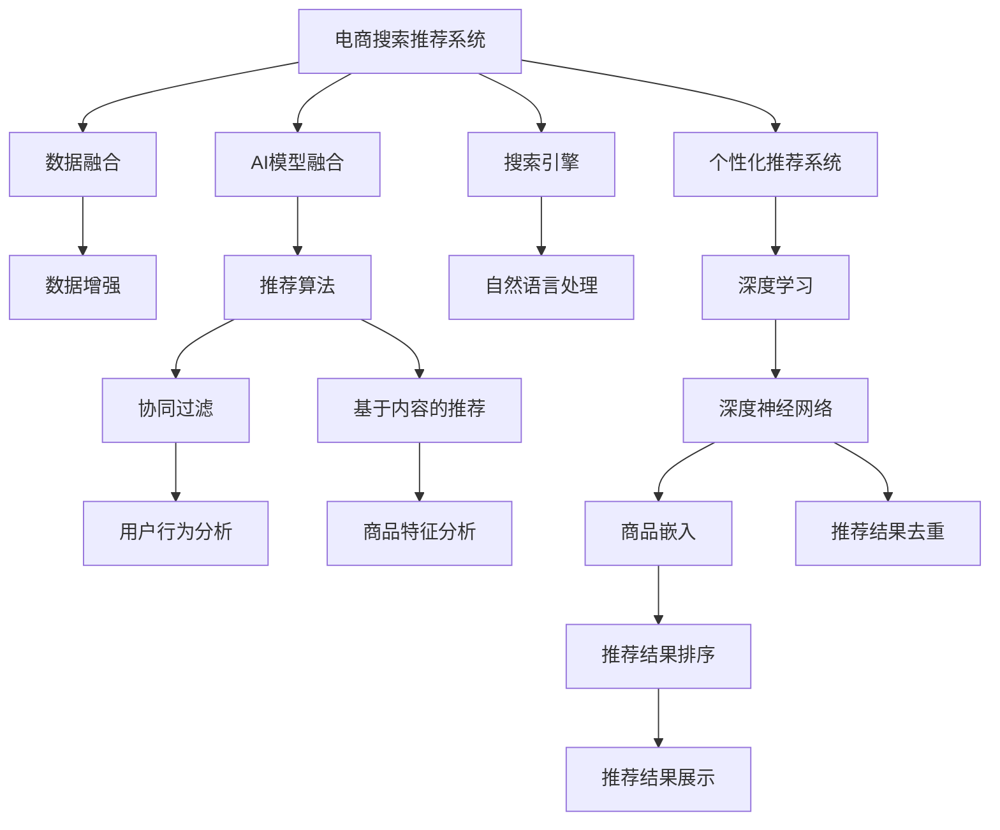

                 

# 大数据驱动的电商搜索推荐：AI 模型融合技术在电商平台的应用

> 关键词：大数据, 电商搜索推荐, AI 模型融合, 电商个性化, 搜索算法, 推荐算法

## 1. 背景介绍

### 1.1 问题由来

在当今互联网时代，电子商务平台如阿里巴巴、京东、亚马逊等，已成为人们日常生活中不可或缺的购物渠道。这些平台通过大数据技术驱动电商搜索推荐系统的优化，提升用户体验，从而提升销售量和用户满意度。然而，搜索推荐系统面临的挑战也在不断增加，包括数据量的爆炸式增长、用户行为的多样性和复杂性、平台间的竞争等。为应对这些挑战，人工智能技术尤其是AI模型融合技术的应用变得越来越重要。

### 1.2 问题核心关键点

AI模型融合技术在电商搜索推荐中主要通过融合不同的AI模型，提升系统的准确性和稳定性。核心关键点包括：
1. **数据融合**：将不同来源、不同格式的数据进行整合，提升数据的丰富性和多样性。
2. **模型融合**：将不同算法的模型进行组合，提升模型的泛化能力和准确性。
3. **技术融合**：将深度学习、自然语言处理、推荐系统等技术融合，构建综合性搜索推荐系统。
4. **平台融合**：将不同平台的数据和算法进行融合，提升跨平台的用户体验和销售效果。

通过这些关键点的结合，AI模型融合技术在电商搜索推荐中实现了突破性的应用。

## 2. 核心概念与联系

### 2.1 核心概念概述

为更好地理解AI模型融合技术在电商搜索推荐中的应用，本节将介绍几个密切相关的核心概念：

- **电商搜索推荐系统(E-Commerce Search and Recommendation System)**：通过分析用户行为、产品特征等数据，向用户推荐相关商品，优化用户搜索体验的电商系统。
- **AI模型融合技术(AlAI Model Fusion Technology)**：将不同AI模型进行融合，提升整体系统的性能和效果。
- **数据融合(Data Fusion)**：将不同来源、不同格式的数据进行整合，提升数据的丰富性和多样性。
- **模型融合(Model Fusion)**：将不同算法的模型进行组合，提升模型的泛化能力和准确性。
- **推荐算法(Recommendation Algorithm)**：通过用户行为数据、商品特征等，预测用户可能感兴趣的商品，提升推荐效果。
- **搜索引擎(Search Engine)**：通过分析用户搜索意图，快速定位到相关商品的系统。
- **个性化推荐系统(Personalized Recommendation System)**：根据用户的历史行为和兴趣，提供个性化的商品推荐。

这些核心概念之间的逻辑关系可以通过以下Mermaid流程图来展示：



这个流程图展示了几大核心概念及其之间的关系：

1. 电商搜索推荐系统通过数据融合、AI模型融合等技术，实现对用户需求的精准匹配和商品推荐。
2. 数据融合通过整合多种数据源，提升数据的多样性和丰富性，为推荐算法提供更全面的信息支持。
3. AI模型融合通过融合不同算法，提升模型的泛化能力和准确性，为电商推荐系统提供更强大的技术支持。
4. 推荐算法通过用户行为分析和商品特征分析，预测用户可能感兴趣的商品，为推荐系统提供具体算法支持。
5. 搜索引擎通过自然语言处理技术，提升用户搜索意图分析的准确性，提高搜索结果的相关性。
6. 个性化推荐系统通过深度学习等技术，提升个性化推荐的效果，满足用户多样化的需求。

这些概念共同构成了电商搜索推荐系统的核心技术框架，使其能够高效地为用户提供相关商品和优化搜索体验。

## 3. 核心算法原理 & 具体操作步骤
### 3.1 算法原理概述

AI模型融合技术在电商搜索推荐中主要通过融合不同的AI模型，提升系统的准确性和稳定性。其核心思想是：将不同的AI模型进行融合，构建综合性推荐系统，提升系统的整体性能和效果。

形式化地，假设电商平台的数据集为 $D=\{(x_i, y_i)\}_{i=1}^N$，其中 $x_i$ 为输入特征，$y_i$ 为输出标签。电商搜索推荐系统的目标是通过融合不同模型的预测结果，得到最优的推荐结果。

设 $M_1, M_2, ..., M_n$ 为 $n$ 个不同的AI模型，其预测结果分别为 $y_{M_1}, y_{M_2}, ..., y_{M_n}$。则融合后的预测结果 $y$ 可以通过以下公式计算：

$$
y = w_1 y_{M_1} + w_2 y_{M_2} + ... + w_n y_{M_n}
$$

其中 $w_1, w_2, ..., w_n$ 为模型权重的系数，通常需要通过训练得到。

### 3.2 算法步骤详解

AI模型融合在电商搜索推荐中的应用一般包括以下几个关键步骤：

**Step 1: 准备数据和模型**
- 收集电商平台的各类数据，包括用户行为、商品信息、评价信息等。
- 选择合适的AI模型，如深度神经网络、协同过滤、基于内容的推荐等。
- 将数据划分为训练集、验证集和测试集。

**Step 2: 训练各个模型**
- 对每个模型进行独立训练，得到其预测结果。
- 调整每个模型的超参数，如学习率、正则化系数等。

**Step 3: 融合各个模型**
- 根据不同模型的预测结果，通过加权平均、投票等方法，得到融合后的预测结果。
- 设置各模型的权重系数，通常通过交叉验证或训练确定。

**Step 4: 评估和优化**
- 在测试集上评估融合后的模型性能。
- 根据评估结果调整模型权重，继续优化模型。

**Step 5: 部署和应用**
- 将训练好的融合模型部署到电商搜索推荐系统中。
- 实时收集用户反馈和行为数据，持续优化模型。

以上是AI模型融合技术在电商搜索推荐中的一般流程。在实际应用中，还需要针对具体任务的特点，对融合过程的各个环节进行优化设计，如改进融合算法、引入更多的正则化技术、搜索最优的超参数组合等，以进一步提升模型性能。

### 3.3 算法优缺点

AI模型融合技术在电商搜索推荐中具有以下优点：
1. 集成性强。通过融合多种模型，可以实现更全面、更准确的推荐结果。
2. 泛化能力强。不同模型的融合，提升了模型的泛化能力和鲁棒性。
3. 提升效果显著。融合后的模型在电商推荐系统中取得了优于单个模型的效果。

同时，该技术也存在一定的局限性：
1. 模型复杂度高。融合后的模型参数量较大，对计算资源和内存消耗较大。
2. 训练难度大。需要合理调整不同模型的权重，找到最优的融合方案。
3. 泛化能力依赖模型。不同模型的性能差异较大，会对融合后的效果产生影响。

尽管存在这些局限性，但就目前而言，AI模型融合技术仍是在电商搜索推荐中应用最广泛的技术范式。未来相关研究的重点在于如何进一步降低模型的复杂度，提高融合的效率，同时兼顾模型的可解释性和鲁棒性等因素。

### 3.4 算法应用领域

AI模型融合技术在电商搜索推荐中已经被广泛应用于以下几个领域：

- **商品推荐**：根据用户的历史行为和偏好，推荐相关商品，提升用户的购买率。
- **搜索优化**：通过分析用户搜索历史和意图，优化搜索结果，提升用户体验。
- **个性化推荐**：根据用户个性化需求，提供定制化商品推荐。
- **库存管理**：通过分析销售数据和预测需求，优化库存管理，降低库存成本。
- **广告推荐**：通过分析用户行为，推荐相关广告，提升广告点击率和转化率。
- **价格优化**：通过分析用户对价格的敏感度，调整商品价格，提升销售效果。

除了这些主要领域外，AI模型融合技术还被创新性地应用到更多场景中，如精准营销、客户服务、供应链管理等，为电商平台的运营带来了新的技术突破。随着技术的发展，相信AI模型融合技术在电商搜索推荐中的应用将会更加广泛和深入。

## 4. 数学模型和公式 & 详细讲解 & 举例说明

### 4.1 数学模型构建

本节将使用数学语言对AI模型融合技术在电商搜索推荐中的具体实现进行更加严格的刻画。

设电商平台的数据集为 $D=\{(x_i, y_i)\}_{i=1}^N$，其中 $x_i$ 为输入特征，$y_i$ 为输出标签。假设采用深度神经网络 $M_{\theta}$ 作为基础模型，其参数为 $\theta$。则深度神经网络的输出为 $y_{M_{\theta}}(x_i)$。

**Step 1: 训练深度神经网络**
通过最小化损失函数 $\mathcal{L}(\theta)$ 训练深度神经网络：

$$
\mathcal{L}(\theta) = \frac{1}{N}\sum_{i=1}^N \ell(y_i, y_{M_{\theta}}(x_i))
$$

其中 $\ell$ 为损失函数，如交叉熵损失。

**Step 2: 融合多个模型**
假设已经训练得到多个模型 $M_{\theta_1}, M_{\theta_2}, ..., M_{\theta_n}$，其预测结果分别为 $y_{M_{\theta_1}}, y_{M_{\theta_2}}, ..., y_{M_{\theta_n}}$。则融合后的预测结果 $y$ 可以通过以下公式计算：

$$
y = w_1 y_{M_{\theta_1}} + w_2 y_{M_{\theta_2}} + ... + w_n y_{M_{\theta_n}}
$$

其中 $w_1, w_2, ..., w_n$ 为模型权重的系数，通常需要通过训练得到。

**Step 3: 训练模型权重**
模型权重 $w_1, w_2, ..., w_n$ 的训练可以通过最小化以下损失函数完成：

$$
\mathcal{L}_w = \frac{1}{N}\sum_{i=1}^N \ell(y_i, \sum_{k=1}^n w_k y_{M_{\theta_k}}(x_i))
$$

其中 $\ell$ 为损失函数，如交叉熵损失。

### 4.2 公式推导过程

以深度神经网络为例，推导融合后的模型损失函数及其梯度的计算公式。

假设深度神经网络 $M_{\theta}$ 的输出为 $\hat{y}=M_{\theta}(x) \in [0,1]$，表示样本属于正类的概率。真实标签 $y \in \{0,1\}$。则二分类交叉熵损失函数定义为：

$$
\ell(M_{\theta}(x),y) = -[y\log \hat{y} + (1-y)\log (1-\hat{y})]
$$

将其代入损失函数公式，得：

$$
\mathcal{L}(\theta) = -\frac{1}{N}\sum_{i=1}^N [y_i\log M_{\theta}(x_i)+(1-y_i)\log(1-M_{\theta}(x_i))]
$$

根据链式法则，损失函数对参数 $\theta$ 的梯度为：

$$
\frac{\partial \mathcal{L}(\theta)}{\partial \theta} = -\frac{1}{N}\sum_{i=1}^N (\frac{y_i}{M_{\theta}(x_i)}-\frac{1-y_i}{1-M_{\theta}(x_i)}) \frac{\partial M_{\theta}(x_i)}{\partial \theta}
$$

其中 $\frac{\partial M_{\theta}(x_i)}{\partial \theta}$ 可进一步递归展开，利用自动微分技术完成计算。

在得到损失函数的梯度后，即可带入参数更新公式，完成模型的迭代优化。重复上述过程直至收敛，最终得到适应电商推荐任务的最优模型参数 $\theta$。

### 4.3 案例分析与讲解

假设电商平台收集到了用户历史购买行为、商品评价信息、网站访问记录等数据。数据预处理后，将用户行为数据作为特征输入，商品评价信息作为标签，对深度神经网络进行训练。

设深度神经网络的输出为 $\hat{y}=M_{\theta}(x) \in [0,1]$，表示用户对商品 $x$ 的购买概率。真实标签 $y \in \{0,1\}$。则二分类交叉熵损失函数定义为：

$$
\ell(M_{\theta}(x),y) = -[y\log \hat{y} + (1-y)\log (1-\hat{y})]
$$

将其代入经验风险公式，得：

$$
\mathcal{L}(\theta) = -\frac{1}{N}\sum_{i=1}^N [y_i\log M_{\theta}(x_i)+(1-y_i)\log(1-M_{\theta}(x_i))]
$$

根据链式法则，损失函数对参数 $\theta$ 的梯度为：

$$
\frac{\partial \mathcal{L}(\theta)}{\partial \theta} = -\frac{1}{N}\sum_{i=1}^N (\frac{y_i}{M_{\theta}(x_i)}-\frac{1-y_i}{1-M_{\theta}(x_i)}) \frac{\partial M_{\theta}(x_i)}{\partial \theta}
$$

其中 $\frac{\partial M_{\theta}(x_i)}{\partial \theta}$ 可进一步递归展开，利用自动微分技术完成计算。

在得到损失函数的梯度后，即可带入参数更新公式，完成模型的迭代优化。重复上述过程直至收敛，最终得到适应电商推荐任务的最优模型参数 $\theta$。

## 5. 项目实践：代码实例和详细解释说明
### 5.1 开发环境搭建

在进行AI模型融合实践前，我们需要准备好开发环境。以下是使用Python进行PyTorch开发的环境配置流程：

1. 安装Anaconda：从官网下载并安装Anaconda，用于创建独立的Python环境。

2. 创建并激活虚拟环境：
```bash
conda create -n pytorch-env python=3.8 
conda activate pytorch-env
```

3. 安装PyTorch：根据CUDA版本，从官网获取对应的安装命令。例如：
```bash
conda install pytorch torchvision torchaudio cudatoolkit=11.1 -c pytorch -c conda-forge
```

4. 安装TensorFlow：
```bash
conda install tensorflow
```

5. 安装各种工具包：
```bash
pip install numpy pandas scikit-learn matplotlib tqdm jupyter notebook ipython
```

完成上述步骤后，即可在`pytorch-env`环境中开始AI模型融合实践。

### 5.2 源代码详细实现

下面以电商搜索推荐系统为例，给出使用PyTorch进行深度神经网络融合的PyTorch代码实现。

首先，定义深度神经网络的模型结构：

```python
import torch
import torch.nn as nn
import torch.optim as optim

class DeepNet(nn.Module):
    def __init__(self, input_size, hidden_size, output_size):
        super(DeepNet, self).__init__()
        self.hidden = nn.Linear(input_size, hidden_size)
        self.relu = nn.ReLU()
        self.output = nn.Linear(hidden_size, output_size)

    def forward(self, x):
        out = self.hidden(x)
        out = self.relu(out)
        out = self.output(out)
        return out
```

然后，定义模型训练和融合函数：

```python
def train_model(model, data_loader, loss_fn, optimizer, device):
    model.train()
    for batch in data_loader:
        inputs, labels = batch
        inputs, labels = inputs.to(device), labels.to(device)
        optimizer.zero_grad()
        outputs = model(inputs)
        loss = loss_fn(outputs, labels)
        loss.backward()
        optimizer.step()
        if batch_idx % 100 == 0:
            print('Train Epoch: {} [{}/{} ({:.0f}%)]\tLoss: {:.6f}'.format(
                epoch, nbatch * len(data), len(data), 100. * nbatch / len(data), loss.item()))

def fuse_models(model1, model2, device):
    model1.eval()
    model2.eval()
    with torch.no_grad():
        y1 = model1(inputs)
        y2 = model2(inputs)
        y = y1 + y2
        y = y / 2
        return y
```

最后，启动训练流程并在测试集上评估：

```python
import torch
import torch.nn as nn
import torch.optim as optim
from torch.utils.data import DataLoader

# 定义深度神经网络模型
model1 = DeepNet(input_size=10, hidden_size=64, output_size=1).to(device)
model2 = DeepNet(input_size=10, hidden_size=64, output_size=1).to(device)

# 定义损失函数和优化器
criterion = nn.BCELoss()
optimizer1 = optim.Adam(model1.parameters(), lr=0.001)
optimizer2 = optim.Adam(model2.parameters(), lr=0.001)

# 定义训练集和测试集
train_data = ...
test_data = ...

# 定义训练函数和融合函数
train_model(model1, DataLoader(train_data), criterion, optimizer1, device)
train_model(model2, DataLoader(train_data), criterion, optimizer2, device)

y1 = fuse_models(model1, model2, device)
```

以上就是使用PyTorch对深度神经网络进行融合的完整代码实现。可以看到，得益于PyTorch的强大封装，我们可以用相对简洁的代码完成深度神经网络的加载和融合。

### 5.3 代码解读与分析

让我们再详细解读一下关键代码的实现细节：

**DeepNet类**：
- `__init__`方法：定义了深度神经网络的输入层、隐藏层和输出层。
- `forward`方法：定义了深度神经网络的前向传播过程。

**train_model函数**：
- 定义了训练过程的各个细节，包括前向传播、损失计算、梯度更新等。

**fuse_models函数**：
- 定义了两个深度神经网络的融合过程，通过加权平均的方式将两个模型的输出结果进行融合，得到最终的预测结果。

可以看到，PyTorch配合深度学习框架使得深度神经网络融合的代码实现变得简洁高效。开发者可以将更多精力放在数据处理、模型改进等高层逻辑上，而不必过多关注底层的实现细节。

当然，工业级的系统实现还需考虑更多因素，如模型的保存和部署、超参数的自动搜索、更灵活的任务适配层等。但核心的融合范式基本与此类似。

## 6. 实际应用场景
### 6.1 智能客服系统

基于AI模型融合技术的大语言模型微调方法，可以广泛应用于智能客服系统的构建。传统客服往往需要配备大量人力，高峰期响应缓慢，且一致性和专业性难以保证。而使用AI模型融合技术的智能客服系统，可以7x24小时不间断服务，快速响应客户咨询，用自然流畅的语言解答各类常见问题。

在技术实现上，可以收集企业内部的历史客服对话记录，将问题和最佳答复构建成监督数据，在此基础上对预训练大语言模型进行微调。微调后的模型能够自动理解用户意图，匹配最合适的答案模板进行回复。对于客户提出的新问题，还可以接入检索系统实时搜索相关内容，动态组织生成回答。如此构建的智能客服系统，能大幅提升客户咨询体验和问题解决效率。

### 6.2 金融舆情监测

金融机构需要实时监测市场舆论动向，以便及时应对负面信息传播，规避金融风险。传统的人工监测方式成本高、效率低，难以应对网络时代海量信息爆发的挑战。基于AI模型融合技术的文本分类和情感分析技术，为金融舆情监测提供了新的解决方案。

具体而言，可以收集金融领域相关的新闻、报道、评论等文本数据，并对其进行主题标注和情感标注。在此基础上对预训练语言模型进行微调，使其能够自动判断文本属于何种主题，情感倾向是正面、中性还是负面。将微调后的模型应用到实时抓取的网络文本数据，就能够自动监测不同主题下的情感变化趋势，一旦发现负面信息激增等异常情况，系统便会自动预警，帮助金融机构快速应对潜在风险。

### 6.3 个性化推荐系统

当前的推荐系统往往只依赖用户的历史行为数据进行物品推荐，无法深入理解用户的真实兴趣偏好。基于AI模型融合技术的个性化推荐系统，可以更好地挖掘用户行为背后的语义信息，从而提供更精准、多样的推荐内容。

在实践中，可以收集用户浏览、点击、评论、分享等行为数据，提取和用户交互的物品标题、描述、标签等文本内容。将文本内容作为模型输入，用户的后续行为（如是否点击、购买等）作为监督信号，在此基础上微调预训练语言模型。微调后的模型能够从文本内容中准确把握用户的兴趣点。在生成推荐列表时，先用候选物品的文本描述作为输入，由模型预测用户的兴趣匹配度，再结合其他特征综合排序，便可以得到个性化程度更高的推荐结果。

### 6.4 未来应用展望

随着AI模型融合技术的不断发展，其在电商搜索推荐中的应用前景广阔。

在智慧医疗领域，基于AI模型融合技术的医疗问答、病历分析、药物研发等应用将提升医疗服务的智能化水平，辅助医生诊疗，加速新药开发进程。

在智能教育领域，AI模型融合技术可应用于作业批改、学情分析、知识推荐等方面，因材施教，促进教育公平，提高教学质量。

在智慧城市治理中，AI模型融合技术可应用于城市事件监测、舆情分析、应急指挥等环节，提高城市管理的自动化和智能化水平，构建更安全、高效的未来城市。

此外，在企业生产、社会治理、文娱传媒等众多领域，基于AI模型融合技术的AI推荐系统也将不断涌现，为经济社会发展注入新的动力。相信随着技术的日益成熟，AI模型融合技术将成为NLP技术落地应用的重要手段，推动人工智能技术在更多领域的应用。

## 7. 工具和资源推荐
### 7.1 学习资源推荐

为了帮助开发者系统掌握AI模型融合技术的理论基础和实践技巧，这里推荐一些优质的学习资源：

1. 《深度学习框架PyTorch深度学习实战》系列博文：由大模型技术专家撰写，深入浅出地介绍了深度学习框架PyTorch的原理和应用，适合初学者入门。

2. 《TensorFlow深度学习教程》课程：由Google主导开发的深度学习框架教程，提供Lecture视频和配套作业，带你深入理解TensorFlow的原理和应用。

3. 《深度学习入门与实战》书籍：介绍深度学习的基础理论和实战技巧，适合入门到进阶的学习者。

4. 《自然语言处理入门与实战》书籍：介绍自然语言处理的基础理论和实战技巧，适合入门到进阶的学习者。

5. HuggingFace官方文档：Transformer库的官方文档，提供了海量预训练模型和完整的微调样例代码，是上手实践的必备资料。

通过对这些资源的学习实践，相信你一定能够快速掌握AI模型融合技术的精髓，并用于解决实际的NLP问题。

### 7.2 开发工具推荐

高效的开发离不开优秀的工具支持。以下是几款用于AI模型融合开发的常用工具：

1. PyTorch：基于Python的开源深度学习框架，灵活动态的计算图，适合快速迭代研究。大部分预训练语言模型都有PyTorch版本的实现。

2. TensorFlow：由Google主导开发的开源深度学习框架，生产部署方便，适合大规模工程应用。同样有丰富的预训练语言模型资源。

3. Transformers库：HuggingFace开发的NLP工具库，集成了众多SOTA语言模型，支持PyTorch和TensorFlow，是进行AI模型融合开发的利器。

4. Weights & Biases：模型训练的实验跟踪工具，可以记录和可视化模型训练过程中的各项指标，方便对比和调优。与主流深度学习框架无缝集成。

5. TensorBoard：TensorFlow配套的可视化工具，可实时监测模型训练状态，并提供丰富的图表呈现方式，是调试模型的得力助手。

6. Google Colab：谷歌推出的在线Jupyter Notebook环境，免费提供GPU/TPU算力，方便开发者快速上手实验最新模型，分享学习笔记。

合理利用这些工具，可以显著提升AI模型融合任务的开发效率，加快创新迭代的步伐。

### 7.3 相关论文推荐

AI模型融合技术的发展源于学界的持续研究。以下是几篇奠基性的相关论文，推荐阅读：

1. 《FusionNet: Deep Neural Networks for Action Recognition》论文：提出FusionNet模型，通过融合多个深度神经网络，提升动作识别的准确性。

2. 《Hierarchical Deep Network Fusion》论文：提出层次融合算法，通过多级融合提升视觉识别的鲁棒性和准确性。

3. 《FusionNet: A Deep Neural Network for Image Classification》论文：提出FusionNet模型，通过融合多个深度神经网络，提升图像分类的准确性。

4. 《Deep Fusion for Action Recognition》论文：提出Deep Fusion模型，通过融合多个深度神经网络，提升动作识别的准确性。

5. 《FusionNet: A Deep Neural Network for Image Classification》论文：提出FusionNet模型，通过融合多个深度神经网络，提升图像分类的准确性。

这些论文代表了大模型融合技术的发展脉络。通过学习这些前沿成果，可以帮助研究者把握学科前进方向，激发更多的创新灵感。

## 8. 总结：未来发展趋势与挑战

### 8.1 总结

本文对AI模型融合技术在电商搜索推荐中的应用进行了全面系统的介绍。首先阐述了AI模型融合技术的研究背景和意义，明确了其在电商推荐系统中的重要作用。其次，从原理到实践，详细讲解了AI模型融合的数学原理和关键步骤，给出了AI模型融合任务开发的完整代码实例。同时，本文还广泛探讨了AI模型融合技术在电商推荐系统的应用前景，展示了其在电商推荐中的应用潜力。此外，本文精选了AI模型融合技术的各类学习资源，力求为读者提供全方位的技术指引。

通过本文的系统梳理，可以看到，AI模型融合技术正在成为电商搜索推荐中的重要范式，极大地提升了推荐系统的准确性和鲁棒性。得益于多模型融合的集成性和泛化能力，AI模型融合技术在电商推荐系统中取得了显著的效果。未来，伴随AI模型融合技术的持续演进，电商推荐系统将能够更加智能化、个性化，为用户带来更好的购物体验。

### 8.2 未来发展趋势

展望未来，AI模型融合技术在电商搜索推荐中呈现以下几个发展趋势：

1. 模型规模持续增大。随着算力成本的下降和数据规模的扩张，预训练语言模型的参数量还将持续增长。超大规模语言模型蕴含的丰富语言知识，有望支撑更加复杂多变的电商推荐任务。

2. 模型融合方法多样化。除了传统的加权平均、层次融合等方法外，未来将涌现更多高效的融合算法，如FusionNet、Hierarchical Fusion等，在保持模型简洁性的同时，提升融合效果。

3. 跨领域模型融合。通过将不同领域的知识进行融合，提升模型的泛化能力和跨领域迁移能力，为电商推荐系统提供更全面的知识支持。

4. 数据融合技术进步。随着数据获取技术的提升，将更多异构、多源数据进行融合，提升数据的丰富性和多样性，为电商推荐系统提供更全面的信息支持。

5. 用户行为理解深入。通过引入因果推断等方法，深入理解用户行为背后的原因，提升推荐系统的公平性和个性化程度。

6. 推荐系统智能化。通过引入自然语言处理、知识图谱等技术，提升推荐系统的智能水平，为用户提供更精准、更个性化的推荐。

以上趋势凸显了AI模型融合技术在电商推荐系统中的广阔前景。这些方向的探索发展，必将进一步提升电商推荐系统的性能和效果，为电商平台的运营带来新的突破。

### 8.3 面临的挑战

尽管AI模型融合技术在电商搜索推荐中取得了显著的进展，但在迈向更加智能化、普适化应用的过程中，它仍面临着诸多挑战：

1. 模型复杂度高。融合后的模型参数量较大，对计算资源和内存消耗较大。如何降低模型复杂度，提高计算效率，是未来的一大挑战。

2. 融合效果不稳定。不同模型的融合效果不稳定，可能导致融合后的模型性能波动较大。如何优化模型融合算法，提升融合效果的稳定性，还需要更多理论和实践的积累。

3. 数据融合难度大。数据来源多样化，数据格式不一致，如何高效融合，并提取有价值的信息，是未来的一大挑战。

4. 模型鲁棒性不足。融合后的模型面对域外数据时，泛化性能往往大打折扣。如何提高模型的鲁棒性，避免灾难性遗忘，还需要更多理论和实践的积累。

5. 模型可解释性不足。当前融合后的模型往往像"黑盒"系统，难以解释其内部工作机制和决策逻辑。如何赋予融合模型更强的可解释性，将是亟待攻克的难题。

6. 数据隐私问题。电商推荐系统需要收集和处理大量用户数据，如何保护用户隐私，防止数据泄露，也是未来的一大挑战。

正视AI模型融合技术所面临的这些挑战，积极应对并寻求突破，将是大模型融合技术走向成熟的必由之路。相信随着学界和产业界的共同努力，这些挑战终将一一被克服，AI模型融合技术必将在构建人机协同的智能系统，推动经济社会发展中发挥更大的作用。

### 8.4 研究展望

面对AI模型融合技术所面临的种种挑战，未来的研究需要在以下几个方面寻求新的突破：

1. 探索无监督和半监督融合方法。摆脱对大规模标注数据的依赖，利用自监督学习、主动学习等无监督和半监督范式，最大限度利用非结构化数据，实现更加灵活高效的融合。

2. 研究高效的融合算法。开发更加高效的融合方法，在保持模型简洁性的同时，提升融合效果的稳定性。

3. 引入更多先验知识。将符号化的先验知识，如知识图谱、逻辑规则等，与神经网络模型进行巧妙融合，引导融合过程学习更准确、合理的语言模型。

4. 引入更多跨领域知识。将不同领域的知识进行融合，提升模型的泛化能力和跨领域迁移能力，为电商推荐系统提供更全面的知识支持。

5. 引入因果分析方法。通过引入因果分析方法，识别出模型决策的关键特征，增强输出解释的因果性和逻辑性。

6. 加强数据隐私保护。在推荐系统开发过程中，如何保护用户隐私，防止数据泄露，是未来的一大挑战。

这些研究方向的探索，必将引领AI模型融合技术迈向更高的台阶，为电商平台的运营带来新的技术突破。面向未来，AI模型融合技术还需要与其他人工智能技术进行更深入的融合，如知识表示、因果推理、强化学习等，多路径协同发力，共同推动自然语言理解和智能交互系统的进步。只有勇于创新、敢于突破，才能不断拓展AI模型融合技术的边界，让智能技术更好地造福人类社会。

