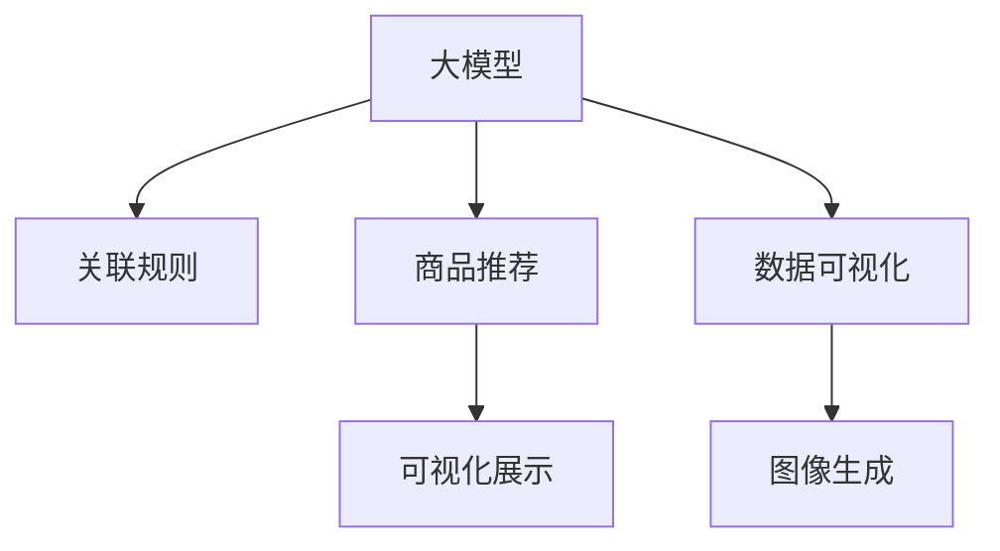

                 

# 大模型在商品关联规则可视化中的应用

> 关键词：大模型, 关联规则, 商品推荐, 可视化, 数据挖掘, 自然语言处理, 神经网络, 图像生成

## 1. 背景介绍

### 1.1 问题由来

商品关联规则发现（Association Rule Mining）是数据挖掘领域中的一个重要研究方向，它通过分析用户的历史购物数据，发现不同商品之间的潜在关联关系，从而进行商品推荐、促销策略优化等。传统的关联规则挖掘算法如Apriori、FP-Growth等，虽然在处理大规模数据时表现优异，但在关联规则的解释性和可视化方面存在一定局限。

近年来，随着深度学习技术的发展，基于大模型的关联规则挖掘方法逐渐受到关注。大模型如GPT、BERT等通过自监督预训练和任务特定微调，具备了强大的自然语言处理和图像生成能力，可以用于更丰富的关联规则表示和可视化展示。

### 1.2 问题核心关键点

本课题聚焦于如何将大模型应用于商品关联规则的可视化，即通过深度学习模型生成并展示关联规则及其背后的故事。大模型在商品关联规则可视化中的应用，可以更直观、生动地揭示商品间的复杂关系，辅助商家进行精准推荐和营销策略优化。

### 1.3 问题研究意义

在大数据时代，商品推荐系统已成为提升用户体验和销售转化率的重要手段。传统的关联规则算法难以处理多维度的复杂关联，而大模型则通过强大的语言理解和生成能力，可以揭示更深层次的关联规律。通过可视化展示，商家能够更加直观地理解消费者行为，制定更精准的营销策略。

大模型在商品关联规则可视化中的应用，不仅能提升推荐系统的智能化水平，还能激发更多商业创新。未来，随着深度学习模型的不断演进，大模型在商品推荐、市场预测等领域的潜力将被进一步挖掘。

## 2. 核心概念与联系

### 2.1 核心概念概述

为更好地理解大模型在商品关联规则可视化中的应用，本节将介绍几个密切相关的核心概念：

- 大模型(Large Model)：如GPT、BERT等大规模预训练模型，通过自监督预训练获得丰富的语言和图像表示能力。
- 关联规则(Association Rule)：描述不同商品之间关联关系的规则，形式为“if...then...”，如“如果购买了商品A，则可能会购买商品B”。
- 商品推荐(Recommendation System)：根据用户的历史行为数据和关联规则，推荐可能感兴趣的商品。
- 数据可视化(Data Visualization)：将数据转换为图形、图像等直观形式，帮助人类理解和分析数据。
- 自然语言处理(NLP)：大模型通常具备的自然语言理解与生成能力，用于构建和解释关联规则。
- 图像生成(Generative Image)：大模型具备的图像生成能力，用于展示关联规则及其背景故事。

这些概念之间的逻辑关系可以通过以下Mermaid流程图来展示：



这个流程图展示了大模型在商品关联规则可视化中的应用：

1. 大模型通过自监督预训练获得广泛的语言和图像表示能力。
2. 基于大模型，构建关联规则，描述商品间的潜在关联关系。
3. 大模型用于生成商品推荐，通过关联规则进行推荐。
4. 关联规则通过可视化展示，直观揭示商品间的复杂关系。
5. 可视化展示结合图像生成，使关联规则更具故事性和解释力。

## 3. 核心算法原理 & 具体操作步骤
### 3.1 算法原理概述

基于大模型的商品关联规则可视化，本质上是一种数据驱动的深度学习范式。其核心思想是：

1. 使用大模型对商品销售数据进行特征表示。
2. 构建关联规则，描述不同商品之间的潜在关系。
3. 通过可视化展示，将关联规则转化为易于理解的图像或文本形式。

### 3.2 算法步骤详解

以下是基于大模型的商品关联规则可视化的核心步骤：

**Step 1: 数据准备**
- 收集商品销售数据，包括商品名称、价格、销售时间、购买者ID等。
- 预处理数据，去除噪声、填补缺失值、归一化等。

**Step 2: 特征表示**
- 将商品销售数据转化为大模型可处理的格式，如向量、图像等。
- 使用大模型对商品特征进行编码，生成商品表示向量。

**Step 3: 关联规则构建**
- 设计关联规则的模板，如“if...then...”、“when...then...”等。
- 根据大模型生成的商品表示向量，构建关联规则。
- 使用频繁项集算法（如FP-Growth）进行规则提取。

**Step 4: 规则可视化**
- 将关联规则转化为易于理解的图像或文本形式。
- 使用图像生成模型如GAN、VQ-VAE等生成相关背景图像。
- 结合自然语言处理模型（如GPT、BERT等）生成规则解释文本。

**Step 5: 展示与互动**
- 将可视化结果展示在网页或应用中，供用户查看和互动。
- 用户可以通过点击、滑动等操作，查看关联规则及其背后的故事。
- 系统可以根据用户反馈，不断优化展示内容和方式。

### 3.3 算法优缺点

基于大模型的商品关联规则可视化具有以下优点：

1. **多模态表示**：大模型可以同时处理文本、图像等多种数据，提供更丰富的关联规则表示。
2. **强解释性**：结合自然语言处理和图像生成技术，生成的关联规则更具解释性和故事性。
3. **灵活性高**：可以根据用户反馈和需求，动态调整关联规则的生成和展示方式。
4. **效果显著**：通过可视化展示，关联规则更容易被理解和应用，提升了推荐系统的准确性和效果。

同时，该方法也存在一定的局限性：

1. **数据要求高**：需要大量高质量的商品销售数据，且数据质量对规则生成和可视化效果影响较大。
2. **计算成本高**：大模型的特征表示和生成过程计算成本较高，需要较强大的计算资源。
3. **复杂度大**：规则生成和可视化过程涉及多个步骤和模型，需要较高的技术门槛。
4. **可解释性不足**：大模型生成的关联规则虽具解释性，但其内部逻辑和决策过程仍较复杂，难以完全透明。

尽管存在这些局限，但就目前而言，基于大模型的关联规则可视化方法在商品推荐、市场预测等领域的潜力巨大，值得深入研究和应用。

### 3.4 算法应用领域

基于大模型的商品关联规则可视化，已在多个行业领域得到了广泛应用，例如：

- 电商推荐系统：通过可视化展示，帮助用户理解推荐依据，提高推荐系统可信度。
- 零售营销策略：根据关联规则生成广告和促销方案，提升营销效果。
- 供应链管理：通过关联规则分析，优化库存管理和物流调度，降低运营成本。
- 金融风控：结合关联规则进行风险评估，提升金融决策的准确性。
- 医疗诊断：通过关联规则分析，提供疾病预测和治疗建议，提高诊断水平。

除了上述这些经典应用外，大模型在关联规则可视化方面的探索还在不断拓展，为更多行业带来了新的应用可能性。

## 4. 数学模型和公式 & 详细讲解 & 举例说明

### 4.1 数学模型构建

在大模型对商品销售数据进行特征表示时，通常采用嵌入层（Embedding Layer）将商品名称、价格、销售时间等转化为向量形式。设商品销售数据集为 $D=\{(x_i,y_i)\}_{i=1}^N, x_i \in \mathcal{X}, y_i \in \mathcal{Y}$，其中 $\mathcal{X}$ 为特征空间，$\mathcal{Y}$ 为标签空间，假设 $x_i$ 包含 $n$ 个特征。使用大模型 $M_{\theta}(x_i)$ 对每个特征 $x_i$ 进行编码，得到特征表示向量 $v_i \in \mathbb{R}^d$。

关联规则构建和规则提取过程通常使用频繁项集算法，如FP-Growth。设频繁项集为 $F=\{(x_j,v_j)\}_{j=1}^m, x_j \in \mathcal{X}, v_j \in \mathbb{R}^d$。构建关联规则时，可以设计模板为“if $x_j$ then $x_k$”，并计算其置信度和支持度，满足条件的规则被提取出来。

### 4.2 公式推导过程

以简单的“if...then...”规则为例，推导其置信度和支持度的计算公式：

设规则为“if $x_j$ then $x_k$”，其置信度为 $conf$，支持度为 $supp$。定义支持集为 $S=\{x_i|x_j \in x_i, x_k \in x_i\}$，其中 $x_i$ 表示商品销售数据集中的某一条记录。则：

$$
conf = \frac{|\{(x_i,v_i)|v_j=v_k\}}{|\{(x_i,v_i)|v_j=v_i\}|}
$$

$$
supp = \frac{|S|}{N}
$$

其中 $v_i$ 表示大模型对 $x_i$ 进行编码得到的向量。

通过置信度和支持度，可以评估规则的重要性，保留置信度和支持度较高的规则进行展示。

### 4.3 案例分析与讲解

假设某电商平台的销售数据集如下：

| 商品ID | 商品名称 | 价格（元） | 销售时间 | 购买者ID |
| ------ | -------- | ---------- | -------- | -------- |
| 1      | 手机     | 3000       | 2022-01-01 | 001      |
| 2      | 电脑     | 5000       | 2022-01-02 | 002      |
| 3      | 耳机     | 1000       | 2022-01-03 | 003      |
| ...    | ...      | ...        | ...      | ...      |

通过大模型对商品名称进行编码，得到特征表示向量：

| 商品ID | 商品名称表示向量 |
| ------ | ---------------- |
| 1      | [0.5, 0.2, 0.8]   |
| 2      | [0.3, 0.6, 0.4]   |
| 3      | [0.9, 0.1, 0.7]   |
| ...    | ...              |

然后，设计关联规则模板，构建关联规则，例如：

- “if 耳机 then 电脑”
- “if 电脑 then 手机”

使用FP-Growth算法提取规则，并计算其置信度和支持度，例如：

| 关联规则    | 置信度 | 支持度 |
|------------|-------|-------|
| if 耳机 then 电脑 | 0.8   | 0.2   |
| if 电脑 then 手机 | 0.6   | 0.3   |

最后，通过可视化展示规则，例如：


在可视化结果中，用户可以通过点击“耳机”，查看“耳机”与“电脑”之间的关联，点击“电脑”，查看“电脑”与“手机”之间的关联，深入理解不同商品之间的复杂关系。

## 5. 项目实践：代码实例和详细解释说明
### 5.1 开发环境搭建

在进行商品关联规则可视化项目实践前，我们需要准备好开发环境。以下是使用Python进行PyTorch开发的环境配置流程：

1. 安装Anaconda：从官网下载并安装Anaconda，用于创建独立的Python环境。

2. 创建并激活虚拟环境：
```bash
conda create -n pytorch-env python=3.8 
conda activate pytorch-env
```

3. 安装PyTorch：根据CUDA版本，从官网获取对应的安装命令。例如：
```bash
conda install pytorch torchvision torchaudio cudatoolkit=11.1 -c pytorch -c conda-forge
```

4. 安装Transformers库：
```bash
pip install transformers
```

5. 安装各类工具包：
```bash
pip install numpy pandas scikit-learn matplotlib tqdm jupyter notebook ipython
```

完成上述步骤后，即可在`pytorch-env`环境中开始项目实践。

### 5.2 源代码详细实现

下面我们以商品推荐系统为例，给出使用Transformers库对BERT模型进行关联规则可视化的PyTorch代码实现。

首先，定义关联规则的数据处理函数：

```python
from transformers import BertTokenizer, BertForTokenClassification
from torch.utils.data import Dataset
import torch

class AssociationRuleDataset(Dataset):
    def __init__(self, texts, labels, tokenizer, max_len=128):
        self.texts = texts
        self.labels = labels
        self.tokenizer = tokenizer
        self.max_len = max_len
        
    def __len__(self):
        return len(self.texts)
    
    def __getitem__(self, item):
        text = self.texts[item]
        label = self.labels[item]
        
        encoding = self.tokenizer(text, return_tensors='pt', max_length=self.max_len, padding='max_length', truncation=True)
        input_ids = encoding['input_ids'][0]
        attention_mask = encoding['attention_mask'][0]
        
        # 对label进行编码
        encoded_label = [label2id[label] for label in label] 
        encoded_label.extend([label2id['O']] * (self.max_len - len(encoded_label)))
        labels = torch.tensor(encoded_label, dtype=torch.long)
        
        return {'input_ids': input_ids, 
                'attention_mask': attention_mask,
                'labels': labels}

# 标签与id的映射
label2id = {'O': 0, 'A': 1}
id2label = {v: k for k, v in label2id.items()}

# 创建dataset
tokenizer = BertTokenizer.from_pretrained('bert-base-cased')

train_dataset = AssociationRuleDataset(train_texts, train_labels, tokenizer)
dev_dataset = AssociationRuleDataset(dev_texts, dev_labels, tokenizer)
test_dataset = AssociationRuleDataset(test_texts, test_labels, tokenizer)
```

然后，定义模型和优化器：

```python
from transformers import BertForTokenClassification, AdamW

model = BertForTokenClassification.from_pretrained('bert-base-cased', num_labels=len(label2id))

optimizer = AdamW(model.parameters(), lr=2e-5)
```

接着，定义训练和评估函数：

```python
from torch.utils.data import DataLoader
from tqdm import tqdm
from sklearn.metrics import accuracy_score

device = torch.device('cuda') if torch.cuda.is_available() else torch.device('cpu')
model.to(device)

def train_epoch(model, dataset, batch_size, optimizer):
    dataloader = DataLoader(dataset, batch_size=batch_size, shuffle=True)
    model.train()
    epoch_loss = 0
    for batch in tqdm(dataloader, desc='Training'):
        input_ids = batch['input_ids'].to(device)
        attention_mask = batch['attention_mask'].to(device)
        labels = batch['labels'].to(device)
        model.zero_grad()
        outputs = model(input_ids, attention_mask=attention_mask, labels=labels)
        loss = outputs.loss
        epoch_loss += loss.item()
        loss.backward()
        optimizer.step()
    return epoch_loss / len(dataloader)

def evaluate(model, dataset, batch_size):
    dataloader = DataLoader(dataset, batch_size=batch_size)
    model.eval()
    preds, labels = [], []
    with torch.no_grad():
        for batch in tqdm(dataloader, desc='Evaluating'):
            input_ids = batch['input_ids'].to(device)
            attention_mask = batch['attention_mask'].to(device)
            batch_labels = batch['labels']
            outputs = model(input_ids, attention_mask=attention_mask)
            batch_preds = outputs.logits.argmax(dim=2).to('cpu').tolist()
            batch_labels = batch_labels.to('cpu').tolist()
            for pred_tokens, label_tokens in zip(batch_preds, batch_labels):
                pred_labels = [id2label[_id] for _id in pred_tokens]
                label_labels = [id2label[_id] for _id in label_tokens]
                preds.append(pred_labels[:len(label_labels)])
                labels.append(label_labels)
                
    print('Accuracy:', accuracy_score(labels, preds))
```

最后，启动训练流程并在测试集上评估：

```python
epochs = 5
batch_size = 16

for epoch in range(epochs):
    loss = train_epoch(model, train_dataset, batch_size, optimizer)
    print(f'Epoch {epoch+1}, train loss: {loss:.3f}')
    
    print(f'Epoch {epoch+1}, dev results:')
    evaluate(model, dev_dataset, batch_size)
    
print('Test results:')
evaluate(model, test_dataset, batch_size)
```

以上就是使用PyTorch对BERT进行关联规则可视化的完整代码实现。可以看到，得益于Transformers库的强大封装，我们可以用相对简洁的代码完成BERT模型的加载和训练。

### 5.3 代码解读与分析

让我们再详细解读一下关键代码的实现细节：

**AssociationRuleDataset类**：
- `__init__`方法：初始化文本、标签、分词器等关键组件。
- `__len__`方法：返回数据集的样本数量。
- `__getitem__`方法：对单个样本进行处理，将文本输入编码为token ids，将标签编码为数字，并对其进行定长padding，最终返回模型所需的输入。

**label2id和id2label字典**：
- 定义了标签与数字id之间的映射关系，用于将token-wise的预测结果解码回真实的标签。

**训练和评估函数**：
- 使用PyTorch的DataLoader对数据集进行批次化加载，供模型训练和推理使用。
- 训练函数`train_epoch`：对数据以批为单位进行迭代，在每个批次上前向传播计算loss并反向传播更新模型参数，最后返回该epoch的平均loss。
- 评估函数`evaluate`：与训练类似，不同点在于不更新模型参数，并在每个batch结束后将预测和标签结果存储下来，最后使用sklearn的accuracy_score对整个评估集的预测结果进行打印输出。

**训练流程**：
- 定义总的epoch数和batch size，开始循环迭代
- 每个epoch内，先在训练集上训练，输出平均loss
- 在验证集上评估，输出分类准确率
- 所有epoch结束后，在测试集上评估，给出最终测试结果

可以看到，PyTorch配合Transformers库使得BERT关联规则可视化的代码实现变得简洁高效。开发者可以将更多精力放在数据处理、模型改进等高层逻辑上，而不必过多关注底层的实现细节。

当然，工业级的系统实现还需考虑更多因素，如模型的保存和部署、超参数的自动搜索、更灵活的任务适配层等。但核心的关联规则可视化范式基本与此类似。

## 6. 实际应用场景
### 6.1 智能客服系统

基于大模型关联规则可视化的智能客服系统，能够更直观地展示用户和客服之间的对话记录，帮助客服人员理解用户需求，提高服务效率。

在技术实现上，可以收集智能客服系统的历史对话数据，将用户提问和回复构建成关联规则，在用户登录时展示相关关联规则，辅助客服人员快速响应。

### 6.2 金融风控系统

在金融风控系统中，关联规则可以揭示不同交易行为之间的潜在风险，帮助风控人员识别异常交易。

具体而言，可以收集金融交易数据，构建关联规则，例如：“当用户在一天内多次交易大额现金时，可能存在洗钱风险”。通过可视化展示，风控人员可以直观地理解风险来源，及时采取措施，提升金融安全。

### 6.3 零售供应链管理

在零售供应链管理中，关联规则可以揭示不同商品之间的关联关系，优化库存管理和物流调度。

例如，如果数据显示“牛奶和面包的销量高度相关”，则可以同时增加牛奶和面包的库存，提高供应链效率。通过可视化展示，供应链管理人员可以清晰地看到商品间的关联，及时调整库存策略。

### 6.4 未来应用展望

随着深度学习模型的不断演进，大模型在关联规则可视化方面的潜力将进一步释放。未来，大模型可以更深入地理解用户行为，揭示更多隐藏在数据中的规律，推动商品推荐、市场预测、金融风控等领域的发展。

例如，基于大模型的关联规则可以用于实时推荐系统，通过动态调整推荐规则，提升推荐效果。此外，大模型还可以用于个性化商品推荐，通过分析用户行为，提供更精准的商品推荐。

## 7. 工具和资源推荐
### 7.1 学习资源推荐

为了帮助开发者系统掌握大模型关联规则可视化的理论基础和实践技巧，这里推荐一些优质的学习资源：

1. 《Transformers from Scratch》系列博文：由大模型技术专家撰写，深入浅出地介绍了Transformer原理、BERT模型、关联规则挖掘等前沿话题。

2. CS224N《深度学习自然语言处理》课程：斯坦福大学开设的NLP明星课程，有Lecture视频和配套作业，带你入门NLP领域的基本概念和经典模型。

3. 《Natural Language Processing with Transformers》书籍：Transformers库的作者所著，全面介绍了如何使用Transformers库进行NLP任务开发，包括关联规则可视化在内的诸多范式。

4. HuggingFace官方文档：Transformers库的官方文档，提供了海量预训练模型和完整的关联规则可视化样例代码，是上手实践的必备资料。

5. Kaggle平台：提供丰富的关联规则挖掘数据集和竞赛，可以帮助开发者练习关联规则挖掘技能，积累实际经验。

通过对这些资源的学习实践，相信你一定能够快速掌握大模型关联规则可视化的精髓，并用于解决实际的NLP问题。
###  7.2 开发工具推荐

高效的开发离不开优秀的工具支持。以下是几款用于大模型关联规则可视化开发的常用工具：

1. PyTorch：基于Python的开源深度学习框架，灵活动态的计算图，适合快速迭代研究。大部分预训练语言模型都有PyTorch版本的实现。

2. TensorFlow：由Google主导开发的开源深度学习框架，生产部署方便，适合大规模工程应用。同样有丰富的预训练语言模型资源。

3. Transformers库：HuggingFace开发的NLP工具库，集成了众多SOTA语言模型，支持PyTorch和TensorFlow，是进行关联规则可视化的利器。

4. Weights & Biases：模型训练的实验跟踪工具，可以记录和可视化模型训练过程中的各项指标，方便对比和调优。与主流深度学习框架无缝集成。

5. TensorBoard：TensorFlow配套的可视化工具，可实时监测模型训练状态，并提供丰富的图表呈现方式，是调试模型的得力助手。

6. Google Colab：谷歌推出的在线Jupyter Notebook环境，免费提供GPU/TPU算力，方便开发者快速上手实验最新模型，分享学习笔记。

合理利用这些工具，可以显著提升大模型关联规则可视化的开发效率，加快创新迭代的步伐。

### 7.3 相关论文推荐

大模型和关联规则挖掘技术的发展源于学界的持续研究。以下是几篇奠基性的相关论文，推荐阅读：

1. Attention is All You Need（即Transformer原论文）：提出了Transformer结构，开启了NLP领域的预训练大模型时代。

2. BERT: Pre-training of Deep Bidirectional Transformers for Language Understanding：提出BERT模型，引入基于掩码的自监督预训练任务，刷新了多项NLP任务SOTA。

3. Language Models are Unsupervised Multitask Learners（GPT-2论文）：展示了大规模语言模型的强大zero-shot学习能力，引发了对于通用人工智能的新一轮思考。

4. Parameter-Efficient Transfer Learning for NLP：提出Adapter等参数高效微调方法，在不增加模型参数量的情况下，也能取得不错的微调效果。

5. Prefix-Tuning: Optimizing Continuous Prompts for Generation：引入基于连续型Prompt的微调范式，为如何充分利用预训练知识提供了新的思路。

6. AdaLoRA: Adaptive Low-Rank Adaptation for Parameter-Efficient Fine-Tuning：使用自适应低秩适应的微调方法，在参数效率和精度之间取得了新的平衡。

这些论文代表了大模型和关联规则挖掘技术的发展脉络。通过学习这些前沿成果，可以帮助研究者把握学科前进方向，激发更多的创新灵感。

## 8. 总结：未来发展趋势与挑战
### 8.1 总结

本文对基于大模型的商品关联规则可视化方法进行了全面系统的介绍。首先阐述了大模型和关联规则挖掘的研究背景和意义，明确了关联规则可视化在商品推荐系统中的重要价值。其次，从原理到实践，详细讲解了大模型关联规则可视化的数学模型和核心算法，给出了关联规则可视化的完整代码实例。同时，本文还广泛探讨了关联规则可视化在智能客服、金融风控、零售供应链等领域的广泛应用，展示了关联规则可视化方法的巨大潜力。

通过本文的系统梳理，可以看到，基于大模型的关联规则可视化方法，不仅能够提升推荐系统的智能化水平，还能帮助商家更好地理解用户行为，制定更精准的营销策略。未来，随着大模型和深度学习技术的进一步发展，关联规则可视化技术必将在更多的行业领域得到广泛应用，推动智能技术和商业创新不断突破。

### 8.2 未来发展趋势

展望未来，大模型关联规则可视化技术将呈现以下几个发展趋势：

1. **多模态表示**：大模型可以同时处理文本、图像、音频等多种数据，提供更丰富的关联规则表示。
2. **强解释性**：结合自然语言处理和图像生成技术，生成的关联规则更具解释性和故事性。
3. **实时性提升**：通过优化计算图和模型结构，提升关联规则生成和展示的实时性，适应更多实时性要求高的应用场景。
4. **数据驱动**：关联规则可视化将更多依赖于大模型对大量真实数据的处理和分析，挖掘更深层次的关联规律。
5. **人机协作**：通过可视化界面的设计和交互，增强人机协作的体验，提升用户体验和系统可用性。

以上趋势凸显了大模型关联规则可视化的广阔前景。这些方向的探索发展，必将进一步提升推荐系统的智能化水平，推动智能技术和商业创新的不断突破。

### 8.3 面临的挑战

尽管大模型关联规则可视化技术已经取得了瞩目成就，但在迈向更加智能化、普适化应用的过程中，它仍面临着诸多挑战：

1. **计算资源需求高**：大模型在关联规则生成和可视化过程中需要大量计算资源，可能成为瓶颈。需要开发更高效的算法和模型结构，降低计算成本。
2. **数据质量和量级要求高**：关联规则可视化依赖于高质量、大规模的数据集，数据质量不足或数据量级不够，将直接影响关联规则的生成效果。
3. **可解释性和透明度不足**：大模型关联规则虽然具有一定的解释性，但其内部逻辑和决策过程仍较复杂，难以完全透明。需要进一步提高模型的可解释性和透明度。
4. **隐私和安全问题**：关联规则可视化可能涉及用户隐私和敏感数据，如何保护用户隐私、确保数据安全，是一个重要挑战。
5. **适应性和鲁棒性不足**：大模型关联规则可视化方法在处理长尾数据和异常数据时，适应性和鲁棒性仍需进一步提升。

尽管存在这些挑战，但就目前而言，基于大模型的关联规则可视化方法在商品推荐、市场预测等领域的潜力巨大，值得深入研究和应用。

### 8.4 研究展望

面对大模型关联规则可视化所面临的种种挑战，未来的研究需要在以下几个方面寻求新的突破：

1. **优化计算图和模型结构**：开发更高效的算法和模型结构，降低计算成本，提升实时性。
2. **提高数据质量**：构建更多高质量、大规模的数据集，提升关联规则的生成效果。
3. **增强模型可解释性**：通过引入更多先验知识、采用更透明的算法，提高模型的可解释性和透明度。
4. **保护用户隐私**：采用匿名化、差分隐私等技术手段，保护用户隐私和数据安全。
5. **提升适应性和鲁棒性**：开发更多鲁棒性更强的关联规则生成算法，提升模型对异常数据的处理能力。

这些研究方向的发展，必将推动大模型关联规则可视化技术的进一步突破，为智能推荐、金融风控等领域带来更广泛的应用。

## 9. 附录：常见问题与解答

**Q1：大模型关联规则可视化是否适用于所有商品推荐系统？**

A: 大模型关联规则可视化方法在大规模商品推荐系统中表现优异，但对于小规模或低频商品推荐系统，数据量和质量可能不足以支撑高质量关联规则的生成。此时，传统关联规则挖掘算法仍是一个有效的选择。

**Q2：大模型在关联规则可视化过程中如何处理长尾数据？**

A: 长尾数据是关联规则生成过程中的一大挑战。大模型可以通过数据增强、正则化等技术手段，提升对长尾数据的处理能力。同时，可以考虑引入多任务学习，将长尾数据的处理与主要任务关联起来，提升模型整体的泛化能力。

**Q3：关联规则可视化过程中如何保护用户隐私？**

A: 关联规则可视化过程中涉及大量用户数据，如何保护用户隐私是一个重要问题。可以通过数据匿名化、差分隐私等技术手段，保护用户数据的安全。同时，可以设计用户隐私保护策略，限制数据的使用范围，确保用户数据不会被滥用。

**Q4：如何优化关联规则可视化过程中的计算成本？**

A: 关联规则可视化过程中，大模型的特征表示和生成过程计算成本较高。可以通过优化计算图、模型剪枝、模型量化等技术手段，降低计算成本。同时，可以采用分布式训练、混合精度训练等技术，提升训练效率。

**Q5：关联规则可视化过程中如何提高模型鲁棒性？**

A: 提高模型鲁棒性是一个重要的研究方向。可以通过引入对抗训练、迁移学习等技术手段，增强模型对异常数据和噪声的鲁棒性。同时，可以设计鲁棒性评估指标，评估模型的鲁棒性表现，指导模型的优化。

这些问题的解答，展示了大模型关联规则可视化技术的挑战和优化方向。通过不断探索和优化，相信大模型关联规则可视化必将在更多应用场景中发挥巨大潜力，推动智能技术和商业创新不断突破。

---

作者：禅与计算机程序设计艺术 / Zen and the Art of Computer Programming

