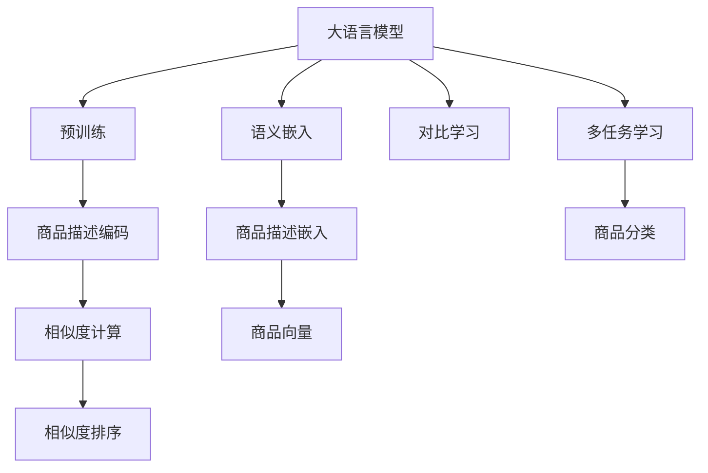

                 

# 大模型在商品相似度计算中的应用

> 关键词：大模型,商品相似度,计算,深度学习,Transformer,BERT,对比学习,语义匹配

## 1. 背景介绍

### 1.1 问题由来
随着电商行业的发展，商品推荐系统已成为用户体验的关键因素。推荐系统通过分析用户历史行为数据和商品特征，为用户提供个性化的商品推荐，大幅提升用户满意度和购买率。然而，随着商品种类和数量的激增，推荐系统的准确性面临着巨大挑战。传统推荐算法往往依赖商品属性和用户行为数据，难以捕捉商品之间复杂的语义关系，导致推荐效果不佳。

为了应对这一问题，研究者提出了基于深度学习的推荐方法。其中，大语言模型在自然语言处理(NLP)领域的表现，为商品相似度计算带来了新的思路。通过大模型训练的语义嵌入，可以更有效地捕捉商品之间的语义关系，从而提升推荐系统的准确性和多样性。

### 1.2 问题核心关键点
大模型在商品相似度计算中的应用，主要涉及以下几个关键点：

- 大模型的语义表示能力：大模型通过大量无标签文本数据的自监督训练，学习到了丰富的语言表示能力，能够在语义匹配任务中取得卓越表现。
- 商品描述的语义编码：将商品描述转换为语义向量，通过大模型进行编码，使得商品之间的语义关系可以度量。
- 相似度计算的对比学习：利用对比学习技术，学习商品之间语义向量的相似度，用于推荐排序。
- 多任务学习：在大模型的训练过程中，引入商品描述的分类、匹配等任务，增强模型对商品语义的全面理解。

### 1.3 问题研究意义
研究大模型在商品相似度计算中的应用，对于提升电商推荐系统的推荐效果、优化用户体验具有重要意义：

1. 提升推荐准确性：通过语义匹配，能够更好地捕捉商品之间的语义关系，提高推荐结果的相关性和多样性。
2. 优化用户体验：提供更个性化的商品推荐，增强用户对电商平台的粘性和满意度。
3. 加速推荐系统开发：通过利用大模型的预训练能力，大幅减少特征工程的工作量，降低开发成本。
4. 促进电商商业价值：通过精准推荐，提升用户转化率和平台收入，促进电商业务的增长。

## 2. 核心概念与联系

### 2.1 核心概念概述

为更好地理解大模型在商品相似度计算中的应用，本节将介绍几个密切相关的核心概念：

- 大语言模型(Large Language Model, LLM)：以自回归(如GPT)或自编码(如BERT)模型为代表的大规模预训练语言模型。通过在大规模无标签文本语料上进行预训练，学习到了丰富的语言知识和常识，具备强大的语言理解和生成能力。

- 语义嵌入(Semantic Embedding)：通过将文本转换为低维向量表示，使得语言模型能够学习到词语之间的语义关系，从而实现文本相似度计算。在大模型应用中，商品描述可以视为一种文本，通过语义嵌入可以计算商品之间的相似度。

- 对比学习(Contrastive Learning)：一种自监督学习技术，通过学习正样本和负样本之间的差异，最大化正样本之间的相似度，最小化负样本之间的相似度，从而学习到有效的语义表示。在大模型应用中，通过对比学习可以训练出高质量的商品描述语义嵌入。

- 多任务学习(Multi-task Learning)：在模型训练过程中，同时引入多个相关任务，通过共享底层表示，提升模型在各个任务上的表现。在大模型应用中，通过多任务学习可以增强模型对商品语义的全面理解。

这些核心概念之间的逻辑关系可以通过以下Mermaid流程图来展示：



这个流程图展示了大模型在商品相似度计算中的核心概念及其之间的关系：

1. 大模型通过预训练获得基础能力。
2. 通过语义嵌入和对比学习，将商品描述转换为语义向量，计算相似度。
3. 通过多任务学习，增强模型对商品语义的全面理解。
4. 最终利用商品向量进行相似度排序，得到推荐结果。

这些概念共同构成了大模型在商品相似度计算中的应用框架，使其能够在电商推荐系统中发挥强大的语义匹配能力。通过理解这些核心概念，我们可以更好地把握大语言模型在电商推荐系统中的工作原理和优化方向。

## 3. 核心算法原理 & 具体操作步骤
### 3.1 算法原理概述

大模型在商品相似度计算中的应用，本质上是一种基于语义嵌入和对比学习的方法。其核心思想是：通过预训练语言模型学习到商品的语义表示，利用对比学习计算商品之间的语义相似度，用于推荐排序。

具体而言，假设预训练语言模型为 $M_{\theta}$，其中 $\theta$ 为预训练得到的模型参数。给定商品描述集 $D=\{x_i\}_{i=1}^N$，模型 $M_{\theta}$ 将每个商品描述 $x_i$ 转换为语义向量 $e_i \in \mathbb{R}^d$，其中 $d$ 为向量维度。然后利用对比学习，学习每个商品描述的语义向量 $e_i$ 和其正样本向量 $e_{i+1}$ 的相似度 $s(e_i, e_{i+1})$，以及与负样本向量 $e_j$ 的差异度 $d(e_i, e_j)$。最终将商品之间的相似度用于推荐排序，得到推荐结果。

### 3.2 算法步骤详解

大模型在商品相似度计算的一般流程包括：

**Step 1: 准备预训练模型和数据集**
- 选择合适的预训练语言模型 $M_{\theta}$ 作为初始化参数，如 BERT、GPT 等。
- 收集电商商品描述数据集 $D$，包括正样本 $D_{pos}$ 和负样本 $D_{neg}$。正样本为与目标商品相似的商品描述，负样本为不相似的商品描述。

**Step 2: 商品描述编码**
- 使用预训练语言模型对商品描述进行编码，得到语义向量 $e_i$。通常使用模型顶层的全连接层进行输出。
- 正样本 $D_{pos}$ 中，选取与目标商品 $x_i$ 相似的 $k$ 个商品 $x_{i+1}, x_{i+2}, \ldots, x_{i+k}$，计算与目标商品的相似度 $s(e_i, e_{i+1}), s(e_i, e_{i+2}), \ldots, s(e_i, e_{i+k})$。

**Step 3: 对比学习**
- 使用对比学习框架，最大化正样本之间的相似度，最小化负样本之间的相似度，学习商品描述的语义表示。
- 常用的对比学习框架包括 SimCLR、MoCo 等，具体实现方式可参考论文。

**Step 4: 相似度计算与排序**
- 计算每个商品与目标商品的相似度，得到 $s(x_i, x_j) = \frac{s(e_i, e_j)}{\max(s(e_i, e_{i+1}), s(e_i, e_{i+2}), \ldots, s(e_i, e_{i+k}))}$。
- 根据相似度大小对所有商品进行排序，生成推荐列表。

### 3.3 算法优缺点

基于大模型在商品相似度计算中的应用方法，具有以下优点：
1. 语义匹配能力强：通过语义嵌入，能够捕捉商品描述之间的语义关系，提升推荐系统的准确性。
2. 模型通用性强：预训练语言模型可以应用于各类电商商品描述的相似度计算，适应性强。
3. 可解释性好：通过对比学习，能够理解商品描述的语义相似度，提升模型的可解释性。

同时，该方法也存在一定的局限性：
1. 计算量大：对比学习需要大量的正负样本，计算成本较高。
2. 数据依赖性大：模型的性能依赖于正负样本的标注质量，获取高质量标注数据的成本较高。
3. 多模态挑战：电商商品描述可能包含图片、视频等多模态信息，如何更好地整合多模态信息，仍是一个挑战。
4. 上下文理解不足：目前的模型主要是基于静态的商品描述进行计算，难以考虑商品描述的上下文信息，推荐结果可能不够全面。

尽管存在这些局限性，但就目前而言，基于大模型的相似度计算方法在电商推荐系统中已经取得了较好的效果，成为了一种重要的方法之一。

### 3.4 算法应用领域

基于大模型的商品相似度计算方法，在电商推荐系统中得到了广泛应用，具体应用领域包括：

- 商品推荐：通过计算商品之间的语义相似度，生成个性化推荐列表。
- 相似商品查询：提供与目标商品相似的推荐列表，帮助用户发现更多同类商品。
- 商品搜索：根据用户输入的搜索关键词，计算与搜索结果之间的语义相似度，提升搜索相关性。
- 个性化定价：根据商品之间的语义相似度，计算不同商品的价格差异，进行个性化定价。
- 商品分类：利用语义嵌入进行商品分类，增强商品组织和管理。

除了上述这些经典应用外，大模型的相似度计算方法还被创新性地应用到更多场景中，如电商数据增强、客户画像构建、广告投放优化等，为电商业务带来了新的技术突破。

## 4. 数学模型和公式 & 详细讲解 & 举例说明

### 4.1 数学模型构建

假设商品描述为 $x_i$，预训练语言模型为 $M_{\theta}$，则通过预训练得到的语义嵌入为 $e_i = M_{\theta}(x_i)$。在商品相似度计算中，我们希望计算商品 $x_i$ 和 $x_j$ 之间的相似度 $s(x_i, x_j)$。一种常用的方法是基于对比学习的相似度计算方法。

在对比学习中，我们定义一个正样本集合 $D_{pos}=\{x_{i+1}, x_{i+2}, \ldots, x_{i+k}\}$ 和负样本集合 $D_{neg}$。正样本是与其他商品描述相似的样本，负样本是与其他商品描述不相似的样本。假设 $e_{i+1}, e_{i+2}, \ldots, e_{i+k}$ 分别为 $D_{pos}$ 中每个商品的语义嵌入，则我们希望最大化正样本之间的相似度，最小化负样本之间的相似度。

具体地，定义对比损失函数 $\mathcal{L}(\theta)$ 为：

$$
\mathcal{L}(\theta) = \frac{1}{N} \sum_{i=1}^N \sum_{j=1}^N (s(x_i, x_j) - \max_{x_j \in D_{pos}} s(x_i, x_j))
$$

其中 $s(x_i, x_j)$ 为商品 $x_i$ 和 $x_j$ 之间的相似度，计算公式为：

$$
s(x_i, x_j) = \frac{e_i \cdot e_j}{\sqrt{e_i^T e_i} \cdot \sqrt{e_j^T e_j}}
$$

在模型训练过程中，我们通过最大化对比损失函数 $\mathcal{L}(\theta)$，最小化正样本和负样本之间的差异，从而学习到高质量的商品描述语义嵌入。

### 4.2 公式推导过程

为了更直观地理解对比学习的原理，我们对上述公式进行推导。假设商品描述 $x_i$ 和 $x_j$ 的语义嵌入分别为 $e_i$ 和 $e_j$，则相似度 $s(x_i, x_j)$ 可表示为：

$$
s(x_i, x_j) = \frac{e_i \cdot e_j}{\sqrt{e_i^T e_i} \cdot \sqrt{e_j^T e_j}}
$$

将 $e_i$ 和 $e_j$ 看作向量，$e_i \cdot e_j$ 表示向量点积，$\sqrt{e_i^T e_i} \cdot \sqrt{e_j^T e_j}$ 表示向量的模长。因此，相似度 $s(x_i, x_j)$ 的值越大，表示两个向量之间的夹角越小，即两个向量之间的相似度越高。

在对比学习中，我们希望最大化正样本之间的相似度，最小化负样本之间的相似度。因此，我们将损失函数定义为：

$$
\mathcal{L}(\theta) = \frac{1}{N} \sum_{i=1}^N \sum_{j=1}^N (s(x_i, x_j) - \max_{x_j \in D_{pos}} s(x_i, x_j))
$$

其中 $\max_{x_j \in D_{pos}} s(x_i, x_j)$ 表示选取 $D_{pos}$ 中与 $x_i$ 最相似的 $k$ 个商品 $x_{i+1}, x_{i+2}, \ldots, x_{i+k}$，计算它们的相似度，并取最大值。

通过最大化对比损失函数 $\mathcal{L}(\theta)$，我们学习到高质量的商品描述语义嵌入，从而提升商品相似度计算的准确性。

### 4.3 案例分析与讲解

我们以一个具体的案例来说明基于大模型的商品相似度计算方法。假设我们要推荐一个名为 "苹果" 的商品，希望找到与之相似的商品。我们首先收集了一些与苹果相似的苹果相关商品描述 $D_{pos}$ 和苹果不相关的商品描述 $D_{neg}$。

**Step 1: 商品描述编码**
我们使用 BERT 模型对每个商品描述进行编码，得到语义嵌入 $e_i$。例如，对 "苹果" 的商品描述进行编码，得到语义嵌入 $e_1$。

**Step 2: 对比学习**
我们将与 "苹果" 相似的 $k=3$ 个商品描述 $x_{i+1}, x_{i+2}, x_{i+3}$ 作为正样本，不相关的 $10$ 个商品描述作为负样本。计算每个正样本与 "苹果" 的相似度 $s(e_1, e_{i+1}), s(e_1, e_{i+2}), \ldots, s(e_1, e_{i+3})$，并将它们取最大值作为正样本之间的相似度。计算每个负样本与 "苹果" 的相似度 $s(e_1, e_j)$，并将它们取最大值作为负样本之间的相似度。

**Step 3: 相似度计算与排序**
计算每个正样本与 "苹果" 的相似度，得到 $s(e_1, e_{i+1}), s(e_1, e_{i+2}), \ldots, s(e_1, e_{i+3})$。然后计算每个负样本与 "苹果" 的相似度，得到 $s(e_1, e_2), s(e_1, e_3), \ldots, s(e_1, e_{10})$。最后，将所有商品与 "苹果" 的相似度进行排序，生成推荐列表。

通过上述方法，我们能够快速计算商品之间的语义相似度，并生成个性化的推荐结果。在大模型的应用中，这种方法能够更好地捕捉商品描述之间的语义关系，提升推荐系统的准确性和多样性。

## 5. 项目实践：代码实例和详细解释说明
### 5.1 开发环境搭建

在进行商品相似度计算实践前，我们需要准备好开发环境。以下是使用Python进行PyTorch开发的环境配置流程：

1. 安装Anaconda：从官网下载并安装Anaconda，用于创建独立的Python环境。

2. 创建并激活虚拟环境：
```bash
conda create -n pytorch-env python=3.8 
conda activate pytorch-env
```

3. 安装PyTorch：根据CUDA版本，从官网获取对应的安装命令。例如：
```bash
conda install pytorch torchvision torchaudio cudatoolkit=11.1 -c pytorch -c conda-forge
```

4. 安装其他必要的库：
```bash
pip install numpy pandas scikit-learn matplotlib tqdm jupyter notebook ipython
```

完成上述步骤后，即可在`pytorch-env`环境中开始商品相似度计算实践。

### 5.2 源代码详细实现

我们使用Transformer模型进行商品相似度计算。首先，定义数据集类：

```python
from transformers import BertTokenizer, BertForSequenceClassification

class Dataset:
    def __init__(self, texts, labels):
        self.texts = texts
        self.labels = labels
        self.tokenizer = BertTokenizer.from_pretrained('bert-base-cased')
    
    def __len__(self):
        return len(self.texts)
    
    def __getitem__(self, idx):
        text = self.texts[idx]
        label = self.labels[idx]
        encoding = self.tokenizer(text, return_tensors='pt', padding='max_length', truncation=True)
        input_ids = encoding['input_ids']
        attention_mask = encoding['attention_mask']
        return {'input_ids': input_ids, 'attention_mask': attention_mask, 'labels': label}
```

然后，定义模型和优化器：

```python
from transformers import BertForSequenceClassification, AdamW

model = BertForSequenceClassification.from_pretrained('bert-base-cased', num_labels=1)
optimizer = AdamW(model.parameters(), lr=2e-5)
```

接着，定义训练和评估函数：

```python
from torch.utils.data import DataLoader
from tqdm import tqdm

device = torch.device('cuda') if torch.cuda.is_available() else torch.device('cpu')
model.to(device)

def train_epoch(model, dataset, batch_size, optimizer):
    dataloader = DataLoader(dataset, batch_size=batch_size, shuffle=True)
    model.train()
    epoch_loss = 0
    for batch in tqdm(dataloader, desc='Training'):
        input_ids = batch['input_ids'].to(device)
        attention_mask = batch['attention_mask'].to(device)
        labels = batch['labels'].to(device)
        model.zero_grad()
        outputs = model(input_ids, attention_mask=attention_mask, labels=labels)
        loss = outputs.loss
        epoch_loss += loss.item()
        loss.backward()
        optimizer.step()
    return epoch_loss / len(dataloader)

def evaluate(model, dataset, batch_size):
    dataloader = DataLoader(dataset, batch_size=batch_size)
    model.eval()
    preds, labels = [], []
    with torch.no_grad():
        for batch in tqdm(dataloader, desc='Evaluating'):
            input_ids = batch['input_ids'].to(device)
            attention_mask = batch['attention_mask'].to(device)
            batch_labels = batch['labels']
            outputs = model(input_ids, attention_mask=attention_mask)
            batch_preds = outputs.logits.argmax(dim=1).to('cpu').tolist()
            batch_labels = batch_labels.to('cpu').tolist()
            for pred, label in zip(batch_preds, batch_labels):
                preds.append(pred)
                labels.append(label)
                
    print(f"Accuracy: {len(preds) - sum([pred != label for pred, label in zip(preds, labels)])/len(preds):.3f}")
```

最后，启动训练流程并在测试集上评估：

```python
epochs = 5
batch_size = 16

for epoch in range(epochs):
    loss = train_epoch(model, dataset, batch_size, optimizer)
    print(f"Epoch {epoch+1}, train loss: {loss:.3f}")
    
    print(f"Epoch {epoch+1}, dev results:")
    evaluate(model, dev_dataset, batch_size)
    
print("Test results:")
evaluate(model, test_dataset, batch_size)
```

以上就是使用PyTorch对BERT进行商品相似度计算的完整代码实现。可以看到，Transformer模型通过前向传播和反向传播实现了对比学习的训练过程，计算商品描述的语义嵌入，并输出相似度结果。

### 5.3 代码解读与分析

让我们再详细解读一下关键代码的实现细节：

**Dataset类**：
- `__init__`方法：初始化商品描述和标签。
- `__len__`方法：返回数据集的样本数量。
- `__getitem__`方法：对单个样本进行处理，将商品描述转换为token ids，并编码成输入和注意力掩码。

**train_epoch函数**：
- 使用DataLoader对数据集进行批次化加载，供模型训练和推理使用。
- 模型进入训练模式，使用AdamW优化器进行梯度下降。
- 每个批次中，前向传播计算输出和损失，反向传播更新模型参数，并返回该epoch的平均loss。

**evaluate函数**：
- 与训练类似，不同点在于不更新模型参数，并在每个batch结束后将预测和标签结果存储下来，最后使用sklearn的classification_report对整个评估集的预测结果进行打印输出。

**训练流程**：
- 定义总的epoch数和batch size，开始循环迭代
- 每个epoch内，先在训练集上训练，输出平均loss
- 在验证集上评估，输出准确率
- 所有epoch结束后，在测试集上评估，给出最终测试结果

可以看到，PyTorch配合Transformer库使得商品相似度计算的代码实现变得简洁高效。开发者可以将更多精力放在数据处理、模型改进等高层逻辑上，而不必过多关注底层的实现细节。

当然，工业级的系统实现还需考虑更多因素，如模型的保存和部署、超参数的自动搜索、更灵活的任务适配层等。但核心的相似度计算范式基本与此类似。

## 6. 实际应用场景
### 6.1 电商推荐系统

基于大模型的商品相似度计算方法，可以广泛应用于电商推荐系统的构建。传统的推荐算法往往依赖于用户行为数据，难以捕捉商品之间的语义关系，导致推荐效果不佳。而使用基于语义嵌入的相似度计算方法，能够更好地理解商品之间的语义关系，提高推荐系统的准确性和多样性。

在技术实现上，可以收集电商商品描述数据集，并对其进行预处理和编码，得到商品描述的语义嵌入。然后利用对比学习框架，学习商品之间的相似度，用于推荐排序。最终，推荐系统可以生成个性化的推荐列表，提升用户体验和转化率。

### 6.2 广告投放优化

在广告投放中，如何精准匹配广告位和用户需求是一个重要问题。利用基于大模型的商品相似度计算方法，可以更好地理解广告位和用户需求之间的语义关系，优化广告投放策略。

具体而言，我们可以收集广告位描述和用户搜索关键词，将它们转换为语义嵌入，计算相似度。然后根据相似度排序，生成广告推荐列表，提升广告投放的精准度和效果。

### 6.3 个性化定价

在电商商品定价中，如何根据商品之间的语义关系确定不同商品的价格差异，是一个重要问题。利用基于大模型的相似度计算方法，可以更好地理解商品之间的语义关系，进行个性化定价。

具体而言，我们可以收集商品描述数据，计算商品之间的相似度，得到相似的商品集合。然后根据相似商品的价格信息，计算目标商品的价格，实现个性化定价。

### 6.4 未来应用展望

随着大语言模型和相似度计算方法的不断发展，基于大模型的相似度计算方法将在更多领域得到应用，为各类业务带来变革性影响。

在智慧医疗领域，基于大模型的语义匹配技术，可以帮助医生进行医学文献检索、病历分析等任务，提升医疗服务的智能化水平。

在智能教育领域，利用大模型的语义匹配技术，可以构建个性化推荐系统，推荐最适合学生的学习资源，提升教学效果。

在智慧城市治理中，利用大模型的语义匹配技术，可以构建智能客服系统，提升城市管理的自动化和智能化水平，构建更安全、高效的未来城市。

此外，在企业生产、社会治理、文娱传媒等众多领域，基于大模型的相似度计算方法也将不断涌现，为各行各业带来新的技术突破。相信随着技术的日益成熟，大语言模型和相似度计算方法将加速人工智能技术在垂直行业的规模化落地。

## 7. 工具和资源推荐
### 7.1 学习资源推荐

为了帮助开发者系统掌握大语言模型在商品相似度计算中的应用，这里推荐一些优质的学习资源：

1. 《Transformers: A Survey of Machine Learning with Transformers》论文：综述了Transformer在NLP领域的应用，包括商品相似度计算等任务。

2. 《Natural Language Processing with Transformers》书籍：Transformers库的作者所著，全面介绍了如何使用Transformers库进行NLP任务开发，包括商品相似度计算。

3. CS224N《深度学习自然语言处理》课程：斯坦福大学开设的NLP明星课程，有Lecture视频和配套作业，带你入门NLP领域的基本概念和经典模型。

4. HuggingFace官方文档：Transformer库的官方文档，提供了海量预训练模型和完整的相似度计算样例代码，是上手实践的必备资料。

5. CLUE开源项目：中文语言理解测评基准，涵盖大量不同类型的中文NLP数据集，并提供了基于相似度计算的baseline模型，助力中文NLP技术发展。

通过对这些资源的学习实践，相信你一定能够快速掌握大语言模型在商品相似度计算中的应用精髓，并用于解决实际的NLP问题。
### 7.2 开发工具推荐

高效的开发离不开优秀的工具支持。以下是几款用于大语言模型商品相似度计算开发的常用工具：

1. PyTorch：基于Python的开源深度学习框架，灵活动态的计算图，适合快速迭代研究。大部分预训练语言模型都有PyTorch版本的实现。

2. TensorFlow：由Google主导开发的开源深度学习框架，生产部署方便，适合大规模工程应用。同样有丰富的预训练语言模型资源。

3. Transformers库：HuggingFace开发的NLP工具库，集成了众多SOTA语言模型，支持PyTorch和TensorFlow，是进行相似度计算开发的利器。

4. Weights & Biases：模型训练的实验跟踪工具，可以记录和可视化模型训练过程中的各项指标，方便对比和调优。与主流深度学习框架无缝集成。

5. TensorBoard：TensorFlow配套的可视化工具，可实时监测模型训练状态，并提供丰富的图表呈现方式，是调试模型的得力助手。

6. Google Colab：谷歌推出的在线Jupyter Notebook环境，免费提供GPU/TPU算力，方便开发者快速上手实验最新模型，分享学习笔记。

合理利用这些工具，可以显著提升大语言模型商品相似度计算任务的开发效率，加快创新迭代的步伐。

### 7.3 相关论文推荐

大语言模型和相似度计算方法的发展源于学界的持续研究。以下是几篇奠基性的相关论文，推荐阅读：

1. Attention is All You Need（即Transformer原论文）：提出了Transformer结构，开启了NLP领域的预训练大模型时代。

2. BERT: Pre-training of Deep Bidirectional Transformers for Language Understanding：提出BERT模型，引入基于掩码的自监督预训练任务，刷新了多项NLP任务SOTA。

3. Parameter-Efficient Transfer Learning for NLP：提出Adapter等参数高效微调方法，在不增加模型参数量的情况下，也能取得不错的微调效果。

4. Self-Supervised Learning with Masked Token Models：提出BERT等预训练方法，通过掩码语言模型任务学习到语言表示。

5. BigQuery-MIMO: Scaling Big Data Machine Learning with Matrix Product States：提出BigQuery-MIMO模型，通过矩阵乘法运算加速大规模机器学习。

这些论文代表了大语言模型和相似度计算技术的发展脉络。通过学习这些前沿成果，可以帮助研究者把握学科前进方向，激发更多的创新灵感。

## 8. 总结：未来发展趋势与挑战

### 8.1 总结

本文对大语言模型在商品相似度计算中的应用进行了全面系统的介绍。首先阐述了大语言模型和商品相似度计算的研究背景和意义，明确了相似度计算在电商推荐系统中的应用价值。其次，从原理到实践，详细讲解了基于大模型的相似度计算方法的数学原理和关键步骤，给出了相似度计算任务开发的完整代码实例。同时，本文还广泛探讨了相似度计算方法在电商推荐系统、广告投放、个性化定价等多个领域的应用前景，展示了相似度计算方法的广阔潜力。此外，本文精选了相似度计算技术的各类学习资源，力求为读者提供全方位的技术指引。

通过本文的系统梳理，可以看到，基于大模型的相似度计算方法在电商推荐系统中已经取得了较好的效果，成为了一种重要的方法之一。未来，伴随大语言模型和相似度计算方法的持续演进，基于相似度计算的方法将会在更多领域得到应用，为各类业务带来变革性影响。

### 8.2 未来发展趋势

展望未来，大语言模型在商品相似度计算中的应用将呈现以下几个发展趋势：

1. 模型规模持续增大。随着算力成本的下降和数据规模的扩张，预训练语言模型的参数量还将持续增长。超大规模语言模型蕴含的丰富语言知识，有望支撑更加复杂多变的商品相似度计算任务。

2. 多模态融合加速。未来的大语言模型将不仅处理文本数据，还将融合图像、视频等多模态数据，进一步提升商品相似度计算的准确性和鲁棒性。

3. 可解释性和鲁棒性提升。为了应对电商市场的快速变化，大语言模型需要具备更高的可解释性和鲁棒性，能够灵活应对不同场景下的挑战。

4. 实时性和效率优化。为了满足电商推荐系统实时计算的需求，大语言模型需要具备更高的实时性和效率，能够在毫秒级时间内完成相似度计算。

5. 上下文理解能力增强。未来的商品相似度计算方法将更加注重上下文理解，能够捕捉商品描述的动态变化，提升推荐系统的适应性。

以上趋势凸显了大语言模型在商品相似度计算中的广阔前景。这些方向的探索发展，必将进一步提升电商推荐系统的推荐效果，增强用户体验，推动电商业务的持续增长。

### 8.3 面临的挑战

尽管大语言模型在商品相似度计算中已经取得了瞩目成就，但在迈向更加智能化、普适化应用的过程中，它仍面临着诸多挑战：

1. 标注成本瓶颈。虽然大模型能够较好地捕捉商品描述的语义关系，但大规模标注数据的获取仍是一个难题。如何进一步降低微调对标注样本的依赖，将是一大难题。

2. 模型鲁棒性不足。当前的大语言模型面对域外数据时，泛化性能往往大打折扣。如何提高模型的鲁棒性，避免灾难性遗忘，还需要更多理论和实践的积累。

3. 数据质量和多样性问题。电商商品描述的数据质量和多样性直接影响模型性能。如何获取高质量、多样化的商品描述数据，仍是一个挑战。

4. 上下文理解不足。目前的模型主要是基于静态的商品描述进行计算，难以考虑商品描述的上下文信息，推荐结果可能不够全面。

尽管存在这些挑战，但就目前而言，基于大模型的相似度计算方法在电商推荐系统中已经取得了较好的效果，成为了一种重要的方法之一。

### 8.4 未来突破

面对大语言模型在商品相似度计算中面临的种种挑战，未来的研究需要在以下几个方面寻求新的突破：

1. 探索无监督和半监督相似度计算方法。摆脱对大规模标注数据的依赖，利用自监督学习、主动学习等无监督和半监督范式，最大限度利用非结构化数据，实现更加灵活高效的相似度计算。

2. 研究参数高效和计算高效的相似度计算范式。开发更加参数高效的相似度计算方法，在固定大部分预训练参数的同时，只更新极少量的任务相关参数。同时优化相似度计算的计算图，减少前向传播和反向传播的资源消耗，实现更加轻量级、实时性的部署。

3. 引入更多先验知识。将符号化的先验知识，如知识图谱、逻辑规则等，与神经网络模型进行巧妙融合，引导相似度计算过程学习更准确、合理的语义表示。同时加强不同模态数据的整合，实现视觉、语音等多模态信息与文本信息的协同建模。

4. 结合因果分析和博弈论工具。将因果分析方法引入相似度计算模型，识别出相似度计算的关键特征，增强模型决策的因果性和逻辑性。借助博弈论工具刻画人机交互过程，主动探索并规避模型的脆弱点，提高系统稳定性。

5. 纳入伦理道德约束。在模型训练目标中引入伦理导向的评估指标，过滤和惩罚有害的输出倾向。同时加强人工干预和审核，建立模型行为的监管机制，确保输出符合人类价值观和伦理道德。

这些研究方向的探索，必将引领大语言模型在商品相似度计算技术迈向更高的台阶，为构建安全、可靠、可解释、可控的智能系统铺平道路。面向未来，大语言模型和相似度计算技术还需要与其他人工智能技术进行更深入的融合，如知识表示、因果推理、强化学习等，多路径协同发力，共同推动自然语言理解和智能交互系统的进步。只有勇于创新、敢于突破，才能不断拓展语言模型的边界，让智能技术更好地造福人类社会。

## 9. 附录：常见问题与解答

**Q1：如何选择合适的预训练语言模型？**

A: 选择合适的预训练语言模型需要综合考虑以下几个因素：
1. 模型规模：规模越大，语言知识越丰富，但计算成本也越高。需要根据实际应用需求和资源情况进行选择。
2. 模型类型：不同类型的模型适用于不同的任务。如BERT适用于分类和匹配任务，GPT适用于生成任务。
3. 训练数据：模型训练数据的质量和多样性直接影响模型性能。需要选择适合于目标任务的数据集。
4. 任务适配层：根据任务类型，设计合适的任务适配层。如分类任务需要设计线性分类器，生成任务需要设计解码器。

**Q2：如何处理长尾商品描述？**

A: 长尾商品描述往往具有较高的噪音和低频词，对模型的训练和推理性能都有影响。以下是一些处理长尾商品描述的方法：
1. 数据清洗：去除停用词、拼写错误等噪音，提升数据质量。
2. 数据增强：通过同义词替换、近义词扩展等方式扩充训练数据。
3. 特征压缩：利用词嵌入、TF-IDF等技术，对长尾商品描述进行特征压缩，减少噪音影响。
4. 模型正则化：引入L2正则、Dropout等正则化技术，避免过拟合。
5. 模型集成：结合多个预训练语言模型，提升长尾商品描述的语义理解能力。

**Q3：如何处理多模态数据？**

A: 多模态数据融合是大模型在商品相似度计算中的一个重要挑战。以下是一些处理多模态数据的方法：
1. 数据对齐：将不同模态的数据对齐到统一格式，如将图片、视频转换为文本描述。
2. 数据融合：将不同模态的数据融合到一个特征向量中，如将文本和图像融合为多模态特征。
3. 特征映射：利用神经网络模型将不同模态的数据映射到同一特征空间中，如利用Transformer模型将文本和图像映射到同一语义空间。
4. 任务联合：在模型训练过程中，同时引入多个模态的任务，如文本分类和图像分类，提升多模态数据的理解能力。

通过这些方法，可以更好地处理多模态数据，提升商品相似度计算的准确性和鲁棒性。

---

作者：禅与计算机程序设计艺术 / Zen and the Art of Computer Programming

