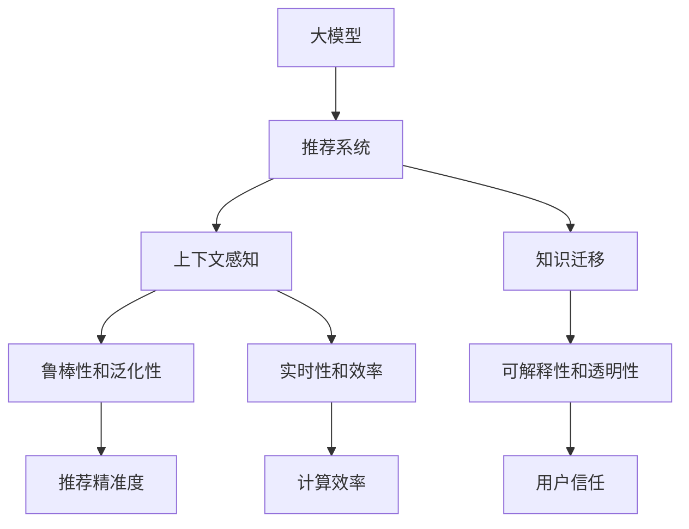

                 

## 1. 背景介绍

在现代数字时代，推荐系统已成为推动信息消费、优化用户体验、提升用户满意度的重要工具。面对用户数量庞大的内容平台，如何更精准地预测用户兴趣、推荐高质量内容，成为推荐系统需要不断解决的核心问题。随着深度学习技术的发展，大模型在推荐系统中的应用日渐广泛，利用其强大的上下文感知能力，为推荐系统的优化和创新提供了新的视角和手段。

### 1.1 问题由来
推荐系统主要分为基于内容的推荐和协同过滤两类方法。基于内容的推荐算法关注物品属性与用户兴趣的匹配度，通过统计特征和相似性计算推荐；而协同过滤算法则侧重于用户历史行为和相似用户的推荐，忽略物品的自身属性。这些方法在解决推荐问题时，不同程度地存在稀疏性、冷启动、多样性不足等问题。

近年来，深度学习技术在推荐系统中的应用取得了显著进展，尤其是大模型在推荐领域的应用，展示了上下文感知能力带来的优势。大模型通过预训练，可以在大规模数据集上学习到丰富的语义知识，结合用户行为和上下文信息，生成更加个性化和多样化的推荐结果。

### 1.2 问题核心关键点
大模型在推荐系统中的应用，主要聚焦于以下几个关键点：

- **上下文感知**：大模型能够捕捉上下文信息，如用户特征、物品属性、时间序列等，通过深度学习技术挖掘复杂的关系，提升推荐的精准度。
- **知识迁移**：利用预训练模型，大模型能够在缺乏标注数据的领域中，通过知识迁移进行推荐。
- **鲁棒性和泛化性**：大模型在处理噪声和异常数据时，具有较强的鲁棒性，能够泛化到新用户和新物品。
- **可解释性和透明性**：大模型通过上下文感知和知识迁移，能够在一定程度上解释其推荐决策，提高系统的透明度。
- **实时性和效率**：大模型在部署时需要考虑实时性和计算效率，优化模型结构、推理速度和内存占用。

本文将通过一系列案例，探讨大模型在推荐系统中的应用，重点讨论其在上下文感知中的优势和优化方法，为推荐系统的发展提供新的思路和工具。

## 2. 核心概念与联系

### 2.1 核心概念概述

为了更好地理解大模型在推荐系统中的应用，本节将介绍几个密切相关的核心概念：

- **大模型**：指在大规模数据集上预训练的深度学习模型，如BERT、GPT等，通过预训练学习到了丰富的语义知识，具备强大的上下文感知能力。
- **推荐系统**：通过分析和预测用户行为和偏好，为用户推荐个性化内容或服务的系统，包括基于内容的推荐和协同过滤两大类方法。
- **上下文感知**：指模型能够捕捉和利用上下文信息，如用户特征、物品属性、时间序列等，提升推荐的精准度和个性化。
- **知识迁移**：指通过预训练模型将一个领域的知识迁移到另一个领域，提高模型的泛化能力。
- **鲁棒性和泛化性**：指模型在面对噪声和异常数据时的稳定性和在不同用户和物品上的适应性。
- **可解释性和透明性**：指模型能够解释其推荐决策，提高系统的透明度，增加用户信任。
- **实时性和效率**：指模型在实际部署时需要考虑计算效率和响应速度，优化推理速度和资源占用。

这些核心概念之间的逻辑关系可以通过以下Mermaid流程图来展示：



这个流程图展示了大模型在推荐系统中的应用场景及其与核心概念的关系：

1. 大模型通过预训练学习到丰富的语义知识，应用于推荐系统，实现上下文感知。
2. 利用知识迁移，在缺乏标注数据的领域进行推荐。
3. 通过上下文感知和知识迁移，提升模型的鲁棒性和泛化性。
4. 通过上下文感知和知识迁移，增强模型的可解释性和透明性。
5. 考虑实时性和效率，优化模型的推理速度和资源占用。

这些概念共同构成了大模型在推荐系统中的应用框架，使其能够更好地发挥上下文感知能力，提升推荐系统的性能和用户体验。

## 3. 核心算法原理 & 具体操作步骤
### 3.1 算法原理概述

大模型在推荐系统中的应用，主要基于以下几个核心算法原理：

- **预训练与微调**：通过在大规模无标签数据上进行预训练，学习通用的语言表示，然后利用下游任务的数据进行微调，优化模型在特定推荐场景中的性能。
- **自监督学习**：利用自监督任务（如语言建模、掩码预测）训练大模型，在大量无标签数据上学习语义知识，提升模型的泛化能力。
- **知识图谱**：结合结构化数据，如知识图谱，增强模型的上下文感知能力，提升推荐的精准度和多样性。
- **多任务学习**：将多个相关任务（如分类、排序、生成）的损失函数融合，在多任务训练中提升模型的泛化能力。
- **对抗训练**：在训练过程中加入对抗样本，增强模型的鲁棒性，提升对噪声和异常数据的抵抗能力。
- **注意力机制**：利用注意力机制，在模型中加强上下文信息的权重，提升推荐的个性化和多样性。

### 3.2 算法步骤详解

大模型在推荐系统中的应用步骤通常包括以下几个关键环节：

**Step 1: 准备预训练模型和数据集**
- 选择合适的预训练语言模型 $M_{\theta}$，如BERT、GPT等。
- 准备推荐系统任务的数据集 $D=\{(x_i,y_i)\}_{i=1}^N$，其中 $x_i$ 为用户行为数据，$y_i$ 为推荐结果（物品ID或评分）。

**Step 2: 设计任务适配层**
- 根据推荐系统任务的类型，设计合适的任务适配层，如分类任务使用线性分类器，排序任务使用深度神经网络。
- 通过多任务学习，将多个相关任务（如评分预测、物品推荐）的损失函数融合，优化模型的泛化能力。

**Step 3: 设定微调超参数**
- 选择合适的优化算法（如AdamW、SGD等）及其参数，如学习率、批大小、迭代轮数等。
- 设定正则化技术，如L2正则、Dropout、Early Stopping等，防止模型过拟合。
- 确定冻结预训练参数的策略，如仅微调顶层，或全部参数都参与微调。

**Step 4: 执行梯度训练**
- 将训练集数据分批次输入模型，前向传播计算损失函数。
- 反向传播计算参数梯度，根据设定的优化算法和学习率更新模型参数。
- 周期性在验证集上评估模型性能，根据性能指标决定是否触发 Early Stopping。
- 重复上述步骤直到满足预设的迭代轮数或 Early Stopping 条件。

**Step 5: 测试和部署**
- 在测试集上评估微调后模型 $M_{\hat{\theta}}$ 的性能，对比微调前后的精度提升。
- 使用微调后的模型对新样本进行推理预测，集成到实际的应用系统中。
- 持续收集新的数据，定期重新微调模型，以适应数据分布的变化。

以上是基于大模型微调的推荐系统的一般流程。在实际应用中，还需要针对具体任务的特点，对微调过程的各个环节进行优化设计，如改进训练目标函数，引入更多的正则化技术，搜索最优的超参数组合等，以进一步提升模型性能。

### 3.3 算法优缺点

大模型在推荐系统中的应用具有以下优点：
1. 强大的上下文感知能力：大模型通过预训练学习到丰富的语义知识，能够捕捉和利用上下文信息，提升推荐的精准度和个性化。
2. 泛化能力强：利用自监督学习，大模型能够在缺乏标注数据的领域中进行推荐，提升模型的泛化能力。
3. 可解释性强：通过上下文感知和知识迁移，大模型能够在一定程度上解释其推荐决策，提高系统的透明度，增加用户信任。
4. 适应性强：大模型能够适应不同用户和物品的分布变化，保持模型的稳定性和鲁棒性。

同时，该方法也存在一定的局限性：
1. 资源消耗大：大模型的参数量和计算量较大，需要高性能的计算资源和存储资源。
2. 推理速度慢：大模型的推理速度较慢，可能不适合实时性要求较高的推荐场景。
3. 数据依赖强：微调过程依赖于大量的标注数据，对于数据稀缺的场景可能效果不佳。
4. 模型复杂度高：大模型的结构复杂，模型参数过多，难以理解和调试。

尽管存在这些局限性，但就目前而言，大模型在推荐系统中的应用已成为一种趋势，其在上下文感知和知识迁移等方面的优势，为推荐系统的优化和创新提供了新的思路和方法。未来相关研究的重点在于如何进一步降低大模型的计算资源消耗，提升推理速度，减少对标注数据的依赖，同时兼顾模型的可解释性和伦理安全性等因素。

### 3.4 算法应用领域

大模型在推荐系统中的应用已经涉及多个领域，主要包括：

- **电商推荐**：利用用户行为和商品属性，为用户提供个性化商品推荐。
- **新闻推荐**：通过分析用户历史阅读记录和兴趣，推荐相关新闻文章。
- **视频推荐**：结合用户观看历史和视频属性，推荐高质量视频内容。
- **音乐推荐**：根据用户听歌记录和音乐属性，推荐个性化音乐播放列表。
- **影视推荐**：结合用户观影记录和影视属性，推荐电影和电视剧。
- **健康医疗**：推荐相关健康文章和医生资源，帮助用户维护健康。

除了这些传统领域外，大模型在推荐系统中的应用还在不断拓展，如金融理财、教育培训、旅游出行等，为这些行业的智能化转型提供了新的技术支持。

## 4. 数学模型和公式 & 详细讲解  
### 4.1 数学模型构建

本节将使用数学语言对大模型在推荐系统中的应用进行更加严格的刻画。

记预训练语言模型为 $M_{\theta}:\mathcal{X} \rightarrow \mathcal{Y}$，其中 $\mathcal{X}$ 为用户行为数据，$\mathcal{Y}$ 为推荐结果（物品ID或评分）。假设推荐系统的训练集为 $D=\{(x_i,y_i)\}_{i=1}^N$，其中 $x_i$ 为用户行为数据，$y_i$ 为推荐结果。

定义模型 $M_{\theta}$ 在数据样本 $(x,y)$ 上的损失函数为 $\ell(M_{\theta}(x),y)$，则在数据集 $D$ 上的经验风险为：

$$
\mathcal{L}(\theta) = \frac{1}{N} \sum_{i=1}^N \ell(M_{\theta}(x_i),y_i)
$$

其中 $\ell$ 为推荐任务设计的损失函数，用于衡量模型预测结果与真实标签之间的差异。常见的损失函数包括均方误差损失、交叉熵损失等。

微调的优化目标是最小化经验风险，即找到最优参数：

$$
\theta^* = \mathop{\arg\min}_{\theta} \mathcal{L}(\theta)
$$

在实践中，我们通常使用基于梯度的优化算法（如SGD、Adam等）来近似求解上述最优化问题。设 $\eta$ 为学习率，$\lambda$ 为正则化系数，则参数的更新公式为：

$$
\theta \leftarrow \theta - \eta \nabla_{\theta}\mathcal{L}(\theta) - \eta\lambda\theta
$$

其中 $\nabla_{\theta}\mathcal{L}(\theta)$ 为损失函数对参数 $\theta$ 的梯度，可通过反向传播算法高效计算。

### 4.2 公式推导过程

以下我们以评分预测任务为例，推导损失函数及其梯度的计算公式。

假设模型 $M_{\theta}$ 在输入 $x$ 上的输出为 $\hat{y}=M_{\theta}(x) \in [0,1]$，表示预测该用户给物品 $y$ 的评分。真实标签 $y \in [0,1]$。则均方误差损失函数定义为：

$$
\ell(M_{\theta}(x),y) = (\hat{y}-y)^2
$$

将其代入经验风险公式，得：

$$
\mathcal{L}(\theta) = \frac{1}{N}\sum_{i=1}^N (\hat{y}_i-y_i)^2
$$

根据链式法则，损失函数对参数 $\theta_k$ 的梯度为：

$$
\frac{\partial \mathcal{L}(\theta)}{\partial \theta_k} = -\frac{2}{N}\sum_{i=1}^N (\hat{y}_i-y_i) \frac{\partial M_{\theta}(x_i)}{\partial \theta_k}
$$

其中 $\frac{\partial M_{\theta}(x_i)}{\partial \theta_k}$ 可进一步递归展开，利用自动微分技术完成计算。

在得到损失函数的梯度后，即可带入参数更新公式，完成模型的迭代优化。重复上述过程直至收敛，最终得到适应推荐系统任务的最优模型参数 $\theta^*$。

## 5. 项目实践：代码实例和详细解释说明
### 5.1 开发环境搭建

在进行推荐系统开发前，我们需要准备好开发环境。以下是使用Python进行PyTorch开发的环境配置流程：

1. 安装Anaconda：从官网下载并安装Anaconda，用于创建独立的Python环境。

2. 创建并激活虚拟环境：
```bash
conda create -n pytorch-env python=3.8 
conda activate pytorch-env
```

3. 安装PyTorch：根据CUDA版本，从官网获取对应的安装命令。例如：
```bash
conda install pytorch torchvision torchaudio cudatoolkit=11.1 -c pytorch -c conda-forge
```

4. 安装Transformers库：
```bash
pip install transformers
```

5. 安装各类工具包：
```bash
pip install numpy pandas scikit-learn matplotlib tqdm jupyter notebook ipython
```

完成上述步骤后，即可在`pytorch-env`环境中开始推荐系统开发。

### 5.2 源代码详细实现

下面我们以电商推荐任务为例，给出使用Transformers库对BERT模型进行评分预测的PyTorch代码实现。

首先，定义评分预测任务的数据处理函数：

```python
from transformers import BertTokenizer
from torch.utils.data import Dataset
import torch

class RecommendationDataset(Dataset):
    def __init__(self, texts, scores, tokenizer, max_len=128):
        self.texts = texts
        self.scores = scores
        self.tokenizer = tokenizer
        self.max_len = max_len
        
    def __len__(self):
        return len(self.texts)
    
    def __getitem__(self, item):
        text = self.texts[item]
        score = self.scores[item]
        
        encoding = self.tokenizer(text, return_tensors='pt', max_length=self.max_len, padding='max_length', truncation=True)
        input_ids = encoding['input_ids'][0]
        attention_mask = encoding['attention_mask'][0]
        
        # 对评分进行归一化处理，转化为0-1之间的浮点数
        score = (score - score.min()) / (score.max() - score.min())
        
        # 将评分转换为标签形式，0表示负向评分，1表示正向评分
        label = 0 if score < 0.5 else 1
        
        return {'input_ids': input_ids, 
                'attention_mask': attention_mask,
                'labels': torch.tensor(label, dtype=torch.long)}
```

然后，定义模型和优化器：

```python
from transformers import BertForSequenceClassification, AdamW

model = BertForSequenceClassification.from_pretrained('bert-base-cased', num_labels=2)

optimizer = AdamW(model.parameters(), lr=2e-5)
```

接着，定义训练和评估函数：

```python
from torch.utils.data import DataLoader
from tqdm import tqdm
from sklearn.metrics import roc_auc_score

device = torch.device('cuda') if torch.cuda.is_available() else torch.device('cpu')
model.to(device)

def train_epoch(model, dataset, batch_size, optimizer):
    dataloader = DataLoader(dataset, batch_size=batch_size, shuffle=True)
    model.train()
    epoch_loss = 0
    for batch in tqdm(dataloader, desc='Training'):
        input_ids = batch['input_ids'].to(device)
        attention_mask = batch['attention_mask'].to(device)
        labels = batch['labels'].to(device)
        model.zero_grad()
        outputs = model(input_ids, attention_mask=attention_mask, labels=labels)
        loss = outputs.loss
        epoch_loss += loss.item()
        loss.backward()
        optimizer.step()
    return epoch_loss / len(dataloader)

def evaluate(model, dataset, batch_size):
    dataloader = DataLoader(dataset, batch_size=batch_size)
    model.eval()
    preds, labels = [], []
    with torch.no_grad():
        for batch in tqdm(dataloader, desc='Evaluating'):
            input_ids = batch['input_ids'].to(device)
            attention_mask = batch['attention_mask'].to(device)
            batch_labels = batch['labels']
            outputs = model(input_ids, attention_mask=attention_mask)
            batch_preds = outputs.logits.argmax(dim=2).to('cpu').tolist()
            batch_labels = batch_labels.to('cpu').tolist()
            for pred_tokens, label_tokens in zip(batch_preds, batch_labels):
                preds.append(pred_tokens)
                labels.append(label_tokens)
                
    print(roc_auc_score(labels, preds))
```

最后，启动训练流程并在测试集上评估：

```python
epochs = 5
batch_size = 16

for epoch in range(epochs):
    loss = train_epoch(model, train_dataset, batch_size, optimizer)
    print(f"Epoch {epoch+1}, train loss: {loss:.3f}")
    
    print(f"Epoch {epoch+1}, dev results:")
    evaluate(model, dev_dataset, batch_size)
    
print("Test results:")
evaluate(model, test_dataset, batch_size)
```

以上就是使用PyTorch对BERT进行电商推荐任务评分预测的完整代码实现。可以看到，得益于Transformers库的强大封装，我们可以用相对简洁的代码完成BERT模型的加载和评分预测。

### 5.3 代码解读与分析

让我们再详细解读一下关键代码的实现细节：

**RecommendationDataset类**：
- `__init__`方法：初始化文本、评分、分词器等关键组件。
- `__len__`方法：返回数据集的样本数量。
- `__getitem__`方法：对单个样本进行处理，将文本输入编码为token ids，将评分转换为标签形式，并对其进行定长padding，最终返回模型所需的输入。

**评分处理**：
- 将评分归一化处理，转化为0-1之间的浮点数，方便模型训练。
- 根据评分值，将标签转换为0或1，用于监督学习。

**训练和评估函数**：
- 使用PyTorch的DataLoader对数据集进行批次化加载，供模型训练和推理使用。
- 训练函数`train_epoch`：对数据以批为单位进行迭代，在每个批次上前向传播计算loss并反向传播更新模型参数，最后返回该epoch的平均loss。
- 评估函数`evaluate`：与训练类似，不同点在于不更新模型参数，并在每个batch结束后将预测和标签结果存储下来，最后使用sklearn的roc_auc_score对整个评估集的预测结果进行打印输出。

**训练流程**：
- 定义总的epoch数和batch size，开始循环迭代
- 每个epoch内，先在训练集上训练，输出平均loss
- 在验证集上评估，输出AUC指标
- 所有epoch结束后，在测试集上评估，给出最终的评分预测结果

可以看到，PyTorch配合Transformers库使得BERT微调的代码实现变得简洁高效。开发者可以将更多精力放在数据处理、模型改进等高层逻辑上，而不必过多关注底层的实现细节。

当然，工业级的系统实现还需考虑更多因素，如模型的保存和部署、超参数的自动搜索、更灵活的任务适配层等。但核心的微调范式基本与此类似。

## 6. 实际应用场景
### 6.1 智能客服推荐

智能客服推荐系统结合了NLP和推荐技术，为用户提供智能客服对话推荐，提升客服效率和客户满意度。

在技术实现上，可以收集历史客服对话记录和客户属性，构建监督数据集，训练BERT模型进行微调。微调后的模型可以预测用户对特定客服对话的评分，从而生成推荐列表，引导客户选择最合适的客服对话。

### 6.2 个性化推荐

个性化推荐系统根据用户的历史行为和偏好，为用户推荐个性化的内容。利用大模型的上下文感知能力，可以捕捉用户行为和上下文信息，提升推荐的精准度。

在技术实现上，可以收集用户浏览、点击、购买等行为数据，提取和用户交互的物品标题、描述、标签等文本内容。将文本内容作为模型输入，用户的后续行为（如是否点击、购买等）作为监督信号，在此基础上微调BERT模型。微调后的模型能够从文本内容中准确把握用户的兴趣点，结合物品属性生成个性化推荐结果。

### 6.3 广告推荐

广告推荐系统结合了NLP和推荐技术，通过分析用户行为和上下文信息，为用户推荐个性化广告。利用大模型的上下文感知能力，可以捕捉用户行为和上下文信息，提升广告投放的精准度。

在技术实现上，可以收集用户的历史浏览记录和行为数据，构建广告的特征表示。利用BERT模型对广告标题、描述等文本进行微调，生成广告的向量表示。结合用户行为和上下文信息，计算广告与用户的匹配度，从而生成推荐列表。

### 6.4 游戏推荐

游戏推荐系统结合了NLP和推荐技术，通过分析用户行为和游戏属性，为用户推荐适合的游戏。利用大模型的上下文感知能力，可以捕捉用户行为和游戏属性，提升游戏推荐的精准度。

在技术实现上，可以收集用户的历史游戏行为数据，包括游戏类型、时长、成就等。将用户行为和游戏属性作为模型输入，利用BERT模型进行微调。微调后的模型能够从游戏属性中捕捉用户兴趣点，结合用户行为生成游戏推荐结果。

## 7. 工具和资源推荐
### 7.1 学习资源推荐

为了帮助开发者系统掌握大模型在推荐系统中的应用理论基础和实践技巧，这里推荐一些优质的学习资源：

1. 《Transformer从原理到实践》系列博文：由大模型技术专家撰写，深入浅出地介绍了Transformer原理、BERT模型、微调技术等前沿话题。

2. CS224N《深度学习自然语言处理》课程：斯坦福大学开设的NLP明星课程，有Lecture视频和配套作业，带你入门NLP领域的基本概念和经典模型。

3. 《Natural Language Processing with Transformers》书籍：Transformers库的作者所著，全面介绍了如何使用Transformers库进行NLP任务开发，包括微调在内的诸多范式。

4. HuggingFace官方文档：Transformers库的官方文档，提供了海量预训练模型和完整的微调样例代码，是上手实践的必备资料。

5. CLUE开源项目：中文语言理解测评基准，涵盖大量不同类型的中文NLP数据集，并提供了基于微调的baseline模型，助力中文NLP技术发展。

通过对这些资源的学习实践，相信你一定能够快速掌握大模型在推荐系统中的应用精髓，并用于解决实际的推荐问题。
###  7.2 开发工具推荐

高效的开发离不开优秀的工具支持。以下是几款用于大模型在推荐系统中的应用开发的常用工具：

1. PyTorch：基于Python的开源深度学习框架，灵活动态的计算图，适合快速迭代研究。大部分预训练语言模型都有PyTorch版本的实现。

2. TensorFlow：由Google主导开发的开源深度学习框架，生产部署方便，适合大规模工程应用。同样有丰富的预训练语言模型资源。

3. Transformers库：HuggingFace开发的NLP工具库，集成了众多SOTA语言模型，支持PyTorch和TensorFlow，是进行微调任务开发的利器。

4. Weights & Biases：模型训练的实验跟踪工具，可以记录和可视化模型训练过程中的各项指标，方便对比和调优。与主流深度学习框架无缝集成。

5. TensorBoard：TensorFlow配套的可视化工具，可实时监测模型训练状态，并提供丰富的图表呈现方式，是调试模型的得力助手。

6. Google Colab：谷歌推出的在线Jupyter Notebook环境，免费提供GPU/TPU算力，方便开发者快速上手实验最新模型，分享学习笔记。

合理利用这些工具，可以显著提升大模型在推荐系统中的应用开发效率，加快创新迭代的步伐。

### 7.3 相关论文推荐

大模型在推荐系统中的应用源于学界的持续研究。以下是几篇奠基性的相关论文，推荐阅读：

1. Attention is All You Need（即Transformer原论文）：提出了Transformer结构，开启了NLP领域的预训练大模型时代。

2. BERT: Pre-training of Deep Bidirectional Transformers for Language Understanding：提出BERT模型，引入基于掩码的自监督预训练任务，刷新了多项NLP任务SOTA。

3. Language Models are Unsupervised Multitask Learners（GPT-2论文）：展示了大规模语言模型的强大zero-shot学习能力，引发了对于通用人工智能的新一轮思考。

4. Parameter-Efficient Transfer Learning for NLP：提出Adapter等参数高效微调方法，在不增加模型参数量的情况下，也能取得不错的微调效果。

5. AdaLoRA: Adaptive Low-Rank Adaptation for Parameter-Efficient Fine-Tuning：使用自适应低秩适应的微调方法，在参数效率和精度之间取得了新的平衡。

6. XLNet: Generalized Autoregressive Pretraining for Language Understanding：提出XLNet模型，通过自回归预训练和自回归生成，显著提升了语言模型的上下文感知能力。

这些论文代表了大模型在推荐系统中的应用发展脉络。通过学习这些前沿成果，可以帮助研究者把握学科前进方向，激发更多的创新灵感。

## 8. 总结：未来发展趋势与挑战

### 8.1 总结

本文对大模型在推荐系统中的应用进行了全面系统的介绍。首先阐述了大模型和推荐系统的研究背景和意义，明确了上下文感知在提升推荐系统性能中的关键作用。其次，从原理到实践，详细讲解了大模型在推荐系统中的应用，给出了评分预测任务的完整代码实例。同时，本文还广泛探讨了大模型在智能客服、个性化推荐、广告推荐、游戏推荐等多个推荐领域的应用前景，展示了上下文感知能力带来的优势。

通过本文的系统梳理，可以看到，大模型在推荐系统中的应用通过上下文感知能力的提升，在精度、个性化和多样性等方面取得了显著进展。未来，伴随大模型和微调方法的持续演进，推荐系统将能够更好地理解用户行为和上下文信息，提供更加精准、个性化和多样化的推荐服务，为用户提供更好的使用体验。

### 8.2 未来发展趋势

展望未来，大模型在推荐系统中的应用将呈现以下几个发展趋势：

1. **上下文感知能力不断增强**：大模型将通过更深层次的预训练和微调，进一步提升其上下文感知能力，捕捉更加复杂的用户行为和上下文信息，提升推荐的精准度和个性化。

2. **知识迁移技术的发展**：利用预训练模型，通过知识迁移技术在缺乏标注数据的领域中实现推荐，提升模型的泛化能力。

3. **多模态融合技术的进步**：将视觉、语音、文本等多种模态的信息融合，增强推荐系统的综合感知能力，提升推荐的精准度和用户体验。

4. **持续学习能力的提升**：推荐系统需要不断更新和优化，持续学习新数据，避免过拟合和泛化不足，保持模型的稳定性和鲁棒性。

5. **实时性和效率的优化**：随着推荐系统对实时性和效率的要求不断提高，将进一步优化大模型的推理速度和资源占用，提升系统的响应速度。

6. **可解释性和透明性的增强**：通过上下文感知和知识迁移，增强推荐系统的可解释性和透明性，提高用户的信任和满意度。

以上趋势凸显了大模型在推荐系统中的应用前景。这些方向的探索发展，必将进一步提升推荐系统的性能和用户体验，为用户的智能化生活提供更强的支持。

### 8.3 面临的挑战

尽管大模型在推荐系统中的应用取得了显著进展，但在迈向更加智能化、普适化应用的过程中，它仍面临着诸多挑战：

1. **数据依赖性高**：推荐系统依赖于大量的用户行为数据和标注数据，对于数据稀缺和标注成本高的场景可能效果不佳。

2. **计算资源消耗大**：大模型的参数量和计算量较大，需要高性能的计算资源和存储资源，可能导致资源瓶颈。

3. **推理速度慢**：大模型的推理速度较慢，可能不适合实时性要求较高的推荐场景。

4. **模型复杂度高**：大模型的结构复杂，模型参数过多，难以理解和调试，可能导致模型过拟合和泛化不足。

5. **鲁棒性和泛化性不足**：大模型在面对噪声和异常数据时，泛化性能可能不足，需要进一步提升模型的鲁棒性。

6. **可解释性和透明性不足**：推荐系统的可解释性和透明性仍需进一步提升，需要更强的可解释性和透明性，增加用户信任。

尽管存在这些挑战，但就目前而言，大模型在推荐系统中的应用已成为一种趋势，其在上下文感知和知识迁移等方面的优势，为推荐系统的优化和创新提供了新的思路和方法。未来相关研究的重点在于如何进一步降低大模型的计算资源消耗，提升推理速度，减少对标注数据的依赖，同时兼顾模型的可解释性和伦理安全性等因素。

### 8.4 未来突破

面对大模型在推荐系统中的应用所面临的挑战，未来的研究需要在以下几个方面寻求新的突破：

1. **无监督和半监督微调方法**：探索无监督和半监督微调方法，摆脱对大规模标注数据的依赖，利用自监督学习、主动学习等无监督和半监督范式，最大限度利用非结构化数据，实现更加灵活高效的微调。

2. **参数高效和计算高效微调方法**：开发更加参数高效的微调方法，在固定大部分预训练参数的同时，只更新极少量的任务相关参数。同时优化微调模型的计算图，减少前向传播和反向传播的资源消耗，实现更加轻量级、实时性的部署。

3. **多任务学习和注意力机制的改进**：通过多任务学习和注意力机制的改进，进一步提升大模型的上下文感知能力和泛化能力，增强推荐系统的精准度和个性化。

4. **因果推断和对比学习的应用**：引入因果推断和对比学习思想，增强大模型的因果关系建立能力和泛化能力，提升推荐系统的鲁棒性和泛化性。

5. **符号化先验知识的融合**：将符号化的先验知识，如知识图谱、逻辑规则等，与神经网络模型进行巧妙融合，引导微调过程学习更准确、合理的语言模型。

6. **因果分析和博弈论工具的应用**：将因果分析方法引入推荐系统，识别出推荐决策的关键特征，增强输出解释的因果性和逻辑性。借助博弈论工具刻画人机交互过程，主动探索并规避推荐系统的脆弱点，提高系统稳定性。

7. **伦理道德约束的引入**：在模型训练目标中引入伦理导向的评估指标，过滤和惩罚有偏见、有害的输出倾向。加强人工干预和审核，建立推荐系统的监管机制，确保推荐内容的合法合规。

这些研究方向的探索，必将引领大模型在推荐系统中的应用走向成熟，为推荐系统的智能化、普适化提供新的突破。只有勇于创新、敢于突破，才能不断拓展推荐系统的边界，推动人工智能技术在垂直行业的广泛应用。

