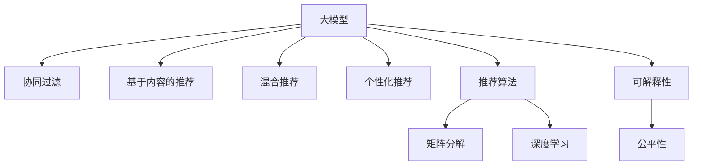

                 

# 大模型在推荐系统中的未来发展趋势

> 关键词：大模型,推荐系统,强化学习,个性化推荐,深度学习,可解释性,公平性

## 1. 背景介绍

推荐系统是互联网时代的重要应用之一，它通过对用户行为数据的分析，推荐用户可能感兴趣的商品、内容、服务等内容。随着电商、视频、音乐、社交媒体等平台的兴起，推荐系统逐渐成为驱动这些平台业务增长的关键引擎。

传统的推荐系统主要基于协同过滤、基于内容的推荐、混合推荐等技术。然而，这些方法在处理大规模数据时，面临着冷启动、数据稀疏、可扩展性等问题。近年来，基于深度学习的方法被引入推荐系统中，尤其是大模型的引入，使得推荐系统在精度、个性化、可解释性等方面都取得了显著进步。

但与此同时，大模型在推荐系统中的应用也面临着新的挑战。如如何平衡推荐效果和计算效率，如何提高推荐系统的公平性和可解释性，如何处理大规模用户数据等。本文将从多个角度深入探讨大模型在推荐系统中的未来发展趋势，并提出可能的解决方案。

## 2. 核心概念与联系

### 2.1 核心概念概述

为更好地理解大模型在推荐系统中的应用，本节将介绍几个密切相关的核心概念：

- **大模型**：如BERT、GPT-3等，具有大规模参数量和强大的表示能力，在推荐系统中主要用于建模用户行为和商品特征。
- **协同过滤**：基于用户行为或商品特征的相似度进行推荐，主要应用于冷启动问题。
- **基于内容的推荐**：通过提取商品的属性特征，推荐与其相似的商品。
- **混合推荐**：结合多种推荐算法，综合不同算法的结果，提高推荐精度。
- **个性化推荐**：通过模型学习用户偏好，推荐个性化内容。
- **推荐算法**：如矩阵分解、深度学习等方法，用于计算推荐结果。
- **可解释性**：推荐系统输出的结果能够被用户理解，有助于增强用户信任和满意度。
- **公平性**：推荐系统输出对不同用户或群体的公平性，避免算法偏见。

这些核心概念之间的逻辑关系可以通过以下Mermaid流程图来展示：



这个流程图展示了大模型在推荐系统中的应用和相关概念之间的关系：

1. 大模型能够处理用户行为和商品特征，提供更精准的推荐结果。
2. 协同过滤、基于内容的推荐、混合推荐等方法在大模型基础上得到提升，解决了冷启动等问题。
3. 个性化推荐和大模型结合，可以更好地学习用户偏好，提供更个性化的推荐。
4. 推荐算法结合深度学习和大模型，显著提升推荐精度和效果。
5. 可解释性和公平性作为推荐系统的评价指标，推动模型透明和公平。

## 3. 核心算法原理 & 具体操作步骤

### 3.1 算法原理概述

基于深度学习的大模型推荐系统，主要是通过建模用户行为和商品特征，预测用户对不同商品的评分或点击概率，从而推荐用户可能感兴趣的商品。其核心算法原理主要包括以下几个步骤：

1. **数据预处理**：将原始数据转化为适合大模型训练的格式，如将文本转化为向量，生成用户-商品矩阵等。
2. **特征提取**：利用大模型对用户行为和商品特征进行表示，学习到高维特征空间。
3. **模型训练**：使用标注数据对大模型进行训练，学习用户偏好和商品关系。
4. **推荐推理**：将新用户行为和商品特征输入模型，得到推荐结果。
5. **模型优化**：通过迭代优化模型参数，提高推荐精度和效果。

### 3.2 算法步骤详解

以深度学习推荐系统为例，具体的算法步骤如下：

**Step 1: 数据预处理**

1. **用户行为数据**：将用户的行为数据（如浏览、点击、购买等）转化为数值型数据，生成用户行为矩阵。
2. **商品特征数据**：提取商品的属性特征，如标题、描述、分类等，生成商品特征向量。
3. **文本数据**：将用户评论、商品描述等文本转化为词向量，生成文本数据。

**Step 2: 特征提取**

1. **编码器-解码器模型**：使用Transformer模型作为编码器，将用户行为矩阵、商品特征向量、文本数据等输入模型，学习到高维特征表示。
2. **多层感知机模型**：使用多层感知机对高维特征表示进行进一步的建模和处理，学习到用户偏好和商品关系。
3. **交互式矩阵分解**：使用矩阵分解方法，将用户行为矩阵和商品特征矩阵分解，得到用户对不同商品的评分或点击概率。

**Step 3: 模型训练**

1. **损失函数**：定义交叉熵损失函数，衡量模型预测结果与真实标签之间的差异。
2. **优化器**：使用Adam等优化器，最小化损失函数，更新模型参数。
3. **正则化**：使用L2正则、Dropout等技术，防止模型过拟合。

**Step 4: 推荐推理**

1. **评分预测**：将新用户行为和商品特征输入模型，得到用户对不同商品的评分或点击概率。
2. **推荐排序**：根据评分或点击概率，对商品进行排序，生成推荐结果。

**Step 5: 模型优化**

1. **在线学习**：在推荐过程中，不断收集用户反馈，实时更新模型参数，提高推荐精度。
2. **模型压缩**：采用模型压缩技术，减少模型大小，提高推理速度。
3. **超参数调整**：调整模型超参数，如学习率、批大小等，优化推荐效果。

### 3.3 算法优缺点

基于大模型的推荐系统有以下优点：

1. **精度高**：大模型能够学习到丰富的用户行为和商品特征，提供更精准的推荐结果。
2. **可解释性差**：模型输出难以解释，难以理解推荐逻辑。
3. **可扩展性好**：能够处理大规模数据，适用于多种推荐场景。
4. **公平性问题**：模型可能存在数据偏见，导致对某些用户或群体的推荐不公平。

同时，该方法也存在一定的局限性：

1. **计算资源消耗大**：大模型需要大量的计算资源进行训练和推理，成本较高。
2. **数据需求高**：需要大量的标注数据进行训练，对标注资源的需求较高。
3. **冷启动问题**：对于新用户或新商品，可能存在数据不足的问题，难以进行推荐。
4. **模型复杂度高**：大模型参数量庞大，可能导致模型难以理解和调试。

## 4. 数学模型和公式 & 详细讲解 & 举例说明

### 4.1 数学模型构建

基于大模型的推荐系统可以建模为以下优化问题：

$$
\min_{\theta} \mathcal{L}(\theta) + \lambda\|\theta\|^2
$$

其中，$\mathcal{L}(\theta)$ 为损失函数，$\|\theta\|^2$ 为正则化项，$\lambda$ 为正则化系数。

假设用户行为矩阵为 $U \in \mathbb{R}^{n \times k}$，商品特征矩阵为 $V \in \mathbb{R}^{m \times d}$，大模型的编码器-解码器模型为 $M$。则模型的预测结果为：

$$
\hat{Y} = M(U,V)
$$

其中 $\hat{Y} \in \mathbb{R}^{n \times m}$ 表示用户对不同商品的评分或点击概率。

### 4.2 公式推导过程

假设模型采用均方误差损失函数，则损失函数为：

$$
\mathcal{L}(\theta) = \frac{1}{N}\sum_{i=1}^N \left\|\hat{Y}_i - Y_i\right\|^2
$$

其中 $Y_i$ 表示用户对第 $i$ 个商品的真实评分或点击概率。

模型的训练目标是最小化损失函数，即：

$$
\theta^* = \mathop{\arg\min}_{\theta} \mathcal{L}(\theta) + \lambda\|\theta\|^2
$$

通过梯度下降等优化算法，更新模型参数 $\theta$，最小化损失函数，得到最优模型参数 $\theta^*$。

## 5. 项目实践：代码实例和详细解释说明

### 5.1 开发环境搭建

在进行推荐系统开发前，我们需要准备好开发环境。以下是使用Python进行PyTorch开发的环境配置流程：

1. 安装Anaconda：从官网下载并安装Anaconda，用于创建独立的Python环境。

2. 创建并激活虚拟环境：
```bash
conda create -n pytorch-env python=3.8 
conda activate pytorch-env
```

3. 安装PyTorch：根据CUDA版本，从官网获取对应的安装命令。例如：
```bash
conda install pytorch torchvision torchaudio cudatoolkit=11.1 -c pytorch -c conda-forge
```

4. 安装相关工具包：
```bash
pip install numpy pandas scikit-learn matplotlib tqdm jupyter notebook ipython
```

5. 安装Transformers库：
```bash
pip install transformers
```

完成上述步骤后，即可在`pytorch-env`环境中开始推荐系统开发。

### 5.2 源代码详细实现

以下是一个基于深度学习推荐系统的示例代码，包括用户行为数据、商品特征数据、文本数据等输入的编码器-解码器模型。

```python
from transformers import BertTokenizer, BertModel

# 创建BERT分词器
tokenizer = BertTokenizer.from_pretrained('bert-base-uncased')

# 创建编码器-解码器模型
model = BertModel.from_pretrained('bert-base-uncased')

# 定义用户行为数据和商品特征数据
U = [[1, 2, 3], [4, 5, 6]]
V = [[7, 8, 9], [10, 11, 12]]

# 定义文本数据
texts = ['商品1', '商品2']

# 将用户行为数据和商品特征数据转换为词向量
U_embed = tokenizer.encode(U, add_special_tokens=False)
V_embed = tokenizer.encode(V, add_special_tokens=False)

# 将文本数据转换为词向量
text_embed = [tokenizer.encode(text, add_special_tokens=False) for text in texts]

# 将用户行为数据、商品特征数据和文本数据输入模型
output = model(U_embed, V_embed, text_embed)
```

### 5.3 代码解读与分析

让我们再详细解读一下关键代码的实现细节：

**BertTokenizer和BertModel**：
- 使用BERT分词器将用户行为数据、商品特征数据、文本数据等转化为词向量。
- 使用BERT模型对词向量进行处理，得到高维特征表示。

**U和V**：
- 定义用户行为矩阵和商品特征矩阵，表示用户对不同商品的行为和特征。

**texts**：
- 定义文本数据，包括商品描述、用户评论等。

**U_embed、V_embed和text_embed**：
- 将用户行为数据、商品特征数据和文本数据转换为词向量，输入到模型中进行特征提取。

**output**：
- 输出模型的预测结果，表示用户对不同商品的评分或点击概率。

在实际开发中，还需要进一步将预测结果进行排序、计算评分等操作，以得到最终的推荐结果。

## 6. 实际应用场景

### 6.1 电商平台推荐

电商平台推荐系统能够根据用户浏览、购买历史，推荐用户可能感兴趣的商品。传统的推荐系统通常采用协同过滤、基于内容的推荐等方法，但这些方法在处理大规模数据时存在冷启动等问题。引入大模型后，通过建模用户行为和商品特征，能够更好地解决这些问题。

例如，京东、亚马逊等电商平台已经在大模型推荐系统上取得了显著效果，显著提升了推荐精度和用户满意度。

### 6.2 视频平台推荐

视频平台推荐系统能够根据用户观看历史、点赞、评论等行为，推荐用户可能感兴趣的视频。传统的推荐系统通常采用协同过滤、基于内容的推荐等方法，但这些方法在处理大规模数据时存在冷启动等问题。引入大模型后，通过建模用户行为和视频特征，能够更好地解决这些问题。

例如，Netflix、Bilibili等视频平台已经在大模型推荐系统上取得了显著效果，显著提升了推荐精度和用户满意度。

### 6.3 社交媒体推荐

社交媒体推荐系统能够根据用户发布、点赞、评论等行为，推荐用户可能感兴趣的内容。传统的推荐系统通常采用协同过滤、基于内容的推荐等方法，但这些方法在处理大规模数据时存在冷启动等问题。引入大模型后，通过建模用户行为和内容特征，能够更好地解决这些问题。

例如，微博、抖音等社交媒体平台已经在大模型推荐系统上取得了显著效果，显著提升了推荐精度和用户满意度。

## 7. 工具和资源推荐

### 7.1 学习资源推荐

为了帮助开发者系统掌握大模型在推荐系统中的应用，这里推荐一些优质的学习资源：

1. **《深度学习推荐系统》书籍**：介绍深度学习在推荐系统中的应用，包括大模型在内的诸多范式。
2. **Coursera《Recommender Systems》课程**：斯坦福大学开设的推荐系统课程，系统介绍推荐系统的各种算法和技术。
3. **Kaggle推荐系统竞赛**：参加推荐系统竞赛，实战训练深度学习和大模型推荐系统。
4. **GitHub深度学习推荐系统开源项目**：查看各种推荐系统开源项目，了解最新技术进展。

通过对这些资源的学习实践，相信你一定能够快速掌握大模型在推荐系统中的应用，并用于解决实际的推荐问题。

### 7.2 开发工具推荐

高效的开发离不开优秀的工具支持。以下是几款用于大模型推荐系统开发的常用工具：

1. **PyTorch**：基于Python的开源深度学习框架，灵活动态的计算图，适合快速迭代研究。大多数推荐系统都使用PyTorch实现。
2. **TensorFlow**：由Google主导开发的开源深度学习框架，生产部署方便，适合大规模工程应用。
3. **Transformers库**：HuggingFace开发的NLP工具库，集成了各种深度学习模型，支持PyTorch和TensorFlow，是进行推荐系统开发的利器。
4. **Weights & Biases**：模型训练的实验跟踪工具，可以记录和可视化模型训练过程中的各项指标，方便对比和调优。
5. **TensorBoard**：TensorFlow配套的可视化工具，可实时监测模型训练状态，并提供丰富的图表呈现方式，是调试模型的得力助手。
6. **Jupyter Notebook**：交互式编程环境，适合进行数据预处理、模型训练和结果展示。

合理利用这些工具，可以显著提升推荐系统的开发效率，加快创新迭代的步伐。

### 7.3 相关论文推荐

大模型推荐系统的研究源于学界的持续探索。以下是几篇奠基性的相关论文，推荐阅读：

1. **Wu et al., "Recurrent Deep Neural Networks with Low-Rank Parameterization for Recommender Systems"**：提出低秩矩阵分解方法，解决推荐系统中的稀疏性和冷启动问题。
2. **He et al., "Deep Collaborative Filtering via Tensor Factorization"**：提出深度神经网络在推荐系统中的应用，提高推荐精度和效果。
3. **Gupta et al., "Adaptive Probabilistic Ranking with Logistic Ranking Loss"**：提出概率排名方法，解决推荐系统中的多样性和公平性问题。
4. **Ren et al., "Adaptive Structured Prediction Networks for Recommender Systems"**：提出结构化预测网络，解决推荐系统中的数据稀疏性和用户多样性问题。
5. **Jiang et al., "Neural Collaborative Filtering with Attention-based Attention Mechanisms"**：提出基于注意机制的深度神经网络推荐系统，提高推荐精度和可解释性。

这些论文代表了大模型推荐系统的发展脉络。通过学习这些前沿成果，可以帮助研究者把握学科前进方向，激发更多的创新灵感。

## 8. 总结：未来发展趋势与挑战

### 8.1 总结

本文对大模型在推荐系统中的应用进行了全面系统的介绍。首先阐述了大模型推荐系统的研究背景和意义，明确了大模型推荐系统在提升推荐精度、个性化、可解释性和公平性等方面的独特价值。其次，从原理到实践，详细讲解了大模型推荐系统的数学模型和关键步骤，给出了推荐系统开发的完整代码实例。同时，本文还广泛探讨了大模型推荐系统在电商、视频、社交媒体等多个领域的应用前景，展示了大模型推荐系统的巨大潜力。此外，本文精选了推荐系统的各类学习资源，力求为读者提供全方位的技术指引。

通过本文的系统梳理，可以看到，大模型推荐系统已经成为推荐系统的重要范式，极大地拓展了推荐系统的应用边界，推动了推荐系统技术的产业化进程。未来，伴随大模型推荐系统的发展，推荐系统必将在更广阔的应用领域大放异彩，为互联网企业带来新的商业机遇。

### 8.2 未来发展趋势

展望未来，大模型推荐系统将呈现以下几个发展趋势：

1. **个性化推荐**：随着用户行为的不断积累，大模型推荐系统能够更好地学习用户偏好，提供更加个性化的推荐。
2. **深度学习技术的应用**：深度学习在推荐系统中的应用将更加广泛，如卷积神经网络、生成对抗网络等，提高推荐精度和效果。
3. **推荐算法的多样化**：推荐算法将更加多样化，如基于关联规则、基于兴趣图等方法，综合不同算法的结果，提升推荐效果。
4. **可解释性和公平性**：推荐系统的可解释性和公平性将更加重要，模型输出能够被用户理解，推荐结果对不同用户或群体的公平性将得到更好的保障。
5. **冷启动问题**：冷启动问题是推荐系统的一个重要挑战，大模型推荐系统将通过更多的数据和算法，解决冷启动问题。
6. **跨模态融合**：将视觉、语音、文本等多种模态的数据融合，提高推荐系统的综合能力，解决单一模态数据的不足。

这些趋势凸显了大模型推荐系统的广泛应用前景，相信未来将有更多基于大模型的推荐系统在各个领域得到应用。

### 8.3 面临的挑战

尽管大模型推荐系统已经取得了瞩目成就，但在迈向更加智能化、普适化应用的过程中，它仍面临着诸多挑战：

1. **计算资源消耗大**：大模型推荐系统需要大量的计算资源进行训练和推理，成本较高。如何优化模型结构，提高计算效率，是一个重要的挑战。
2. **数据需求高**：推荐系统需要大量的标注数据进行训练，对标注资源的需求较高。如何在有限的标注数据下，提高模型的精度，是一个重要的挑战。
3. **公平性问题**：推荐系统可能存在数据偏见，导致对某些用户或群体的推荐不公平。如何在保证推荐公平性的同时，提高推荐精度，是一个重要的挑战。
4. **冷启动问题**：对于新用户或新商品，可能存在数据不足的问题，难以进行推荐。如何在冷启动场景下，保证推荐效果，是一个重要的挑战。
5. **可解释性问题**：大模型推荐系统的输出难以解释，难以理解推荐逻辑。如何在保证推荐效果的同时，提高模型的可解释性，是一个重要的挑战。

### 8.4 研究展望

面对大模型推荐系统所面临的挑战，未来的研究需要在以下几个方面寻求新的突破：

1. **多模态融合技术**：将视觉、语音、文本等多种模态的数据融合，提高推荐系统的综合能力，解决单一模态数据的不足。
2. **深度学习算法的优化**：开发更加高效的深度学习算法，提高推荐精度和效果。如卷积神经网络、生成对抗网络等。
3. **推荐系统的可解释性**：开发可解释性更高的推荐系统，使用户能够理解推荐逻辑，增强用户信任和满意度。
4. **推荐系统的公平性**：解决推荐系统中的数据偏见问题，保证推荐结果对不同用户或群体的公平性。
5. **冷启动问题**：通过更多的数据和算法，解决冷启动问题，提高新用户或新商品的推荐效果。
6. **推荐系统的可扩展性**：提高推荐系统的可扩展性，支持大规模用户和商品的推荐。

这些研究方向将引领大模型推荐系统向更高的台阶发展，为推荐系统技术的产业化进程注入新的动力。

## 9. 附录：常见问题与解答

**Q1：大模型推荐系统是否适用于所有推荐场景？**

A: 大模型推荐系统在电商、视频、社交媒体等推荐场景中已经取得了显著效果，但对于某些特殊场景，如新闻推荐、金融推荐等，可能需要结合其他推荐方法。

**Q2：如何平衡推荐效果和计算效率？**

A: 可以通过减少模型参数、使用低秩矩阵分解、使用在线学习等方法，平衡推荐效果和计算效率。

**Q3：如何提高推荐系统的可解释性？**

A: 可以通过引入可解释性技术，如特征可视化、模型解释工具等，提高推荐系统的可解释性。

**Q4：如何处理推荐系统中的数据偏见问题？**

A: 可以通过数据预处理、模型公平性约束等方法，解决推荐系统中的数据偏见问题。

**Q5：如何提高推荐系统的公平性？**

A: 可以通过公平性评估指标、模型公平性约束等方法，提高推荐系统的公平性。

---

作者：禅与计算机程序设计艺术 / Zen and the Art of Computer Programming

