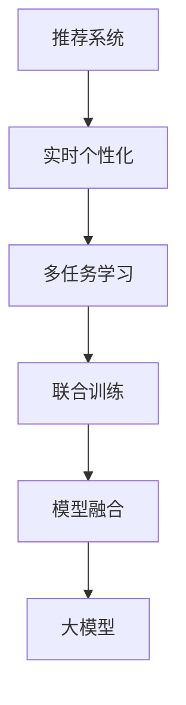

                 

# 大模型在推荐系统实时个性化中的作用

## 1. 背景介绍

推荐系统作为互联网公司核心业务之一，承担着用户获取、流量转化、商业变现的重要使命。根据中国网络安全与信息化研究院发布的数据显示，全球十大互联网公司中，7家公司在流量获取上主要依赖推荐系统。推荐系统通过对用户历史行为数据的分析，准确预测用户行为，引导用户对推荐内容进行互动，从而提高用户黏性、延长用户停留时间、提升商业变现能力。

近年来，深度学习技术在推荐系统中的研究应用成果丰硕。基于深度神经网络模型的推荐系统逐步取代了基于协同过滤、矩阵分解的传统推荐系统，并逐渐发展为多任务学习、联合训练、模型融合等更复杂的算法结构，推荐系统推荐效果得到明显提升。

推荐系统面临的主要问题包括数据稀疏性、用户个性化、实时性、动态性等。本文将重点介绍大模型在推荐系统实时个性化方面的作用，以及相关方法的技术原理与实际应用。

## 2. 核心概念与联系

### 2.1 核心概念概述

为更好地理解大模型在推荐系统中的应用，本节将介绍几个关键概念：

- 推荐系统(Recommendation System)：通过用户的历史行为数据、兴趣偏好等，为用户推荐符合其喜好的物品或内容，以提高用户满意度。
- 实时个性化(Real-time Personalization)：推荐系统需根据用户即时行为，动态调整推荐策略，及时响应用户需求，以提高推荐效果。
- 多任务学习(Multi-task Learning, MTL)：在同一模型中学习多个相关任务，通过任务之间的知识共享，提高模型的泛化能力和效率。
- 联合训练(Joint Training)：在训练推荐模型时，引入用户交互、物品属性、上下文等信息的联合优化，提升模型预测能力。
- 模型融合(Model Fusion)：通过将不同模型或模型的不同层次进行融合，集成多模型的优势，得到更优的推荐效果。
- 大模型(Large Model)：指具有数十亿甚至数百亿参数的深度神经网络模型，通常基于大规模无监督语料进行预训练，具备强大的语义理解和生成能力。
- 推荐模型(Recommendation Model)：通过学习用户-物品交互历史数据，预测用户对物品的兴趣，生成个性化推荐结果。

这些概念之间存在紧密联系：

1. 推荐系统需要实时个性化，以应对用户即时行为变化。
2. 实时个性化需要多任务学习，学习用户行为模式、物品属性等。
3. 多任务学习通常采用联合训练的方式，进行联合优化。
4. 联合训练模型通过融合多模态信息，提升推荐效果。
5. 融合推荐模型利用大模型预训练特征，提升预测精度。

这些概念的逻辑关系可以通过以下Mermaid流程图来展示：



这个流程图展示了大模型在推荐系统实时个性化中的核心作用。

## 3. 核心算法原理 & 具体操作步骤

### 3.1 算法原理概述

大模型在推荐系统中的应用，主要基于其在预训练过程中学习到的广泛语义信息，将其作为初始化参数，通过微调或迁移学习的方法，对用户-物品交互数据进行学习，生成个性化推荐结果。其中，多任务学习、联合训练和模型融合是大模型应用于推荐系统的主要技术路径。

#### 3.1.1 多任务学习

多任务学习指在同一个模型中，学习多个相关的推荐任务，如用户兴趣预测、物品属性预测等。通过任务之间知识共享，提升模型的泛化能力和效率。以用户行为预测为例，可以构建一个共享底层编码器的多任务模型，将用户历史行为和物品属性同时输入，学习用户对物品的兴趣和物品属性特征：

$$
\text{Multi-task Model} = f_{u}(x_u, e_{item}) + f_{item}(x_u, e_{item})
$$

其中，$f_u$ 为用于预测用户兴趣的解码器，$x_u$ 为用户行为数据，$e_{item}$ 为物品属性特征，$f_{item}$ 为用于预测物品属性的解码器。通过共享底层编码器，模型可以同时学习用户兴趣和物品属性，提升推荐效果。

#### 3.1.2 联合训练

联合训练指在训练推荐模型时，引入用户交互、物品属性、上下文等信息，进行联合优化。通过考虑多模态信息，提升推荐模型的预测能力。例如，可以构建一个联合训练模型，将用户行为数据、物品属性和上下文特征同时输入，学习用户兴趣和物品属性：

$$
\text{Joint Training Model} = f_{u}(x_u, e_{item}, e_{context}) + f_{item}(x_u, e_{item}, e_{context})
$$

其中，$e_{context}$ 为上下文特征。通过联合训练，模型可以同时学习多模态信息，提升推荐效果。

#### 3.1.3 模型融合

模型融合指通过将不同模型或模型的不同层次进行融合，集成多模型的优势，得到更优的推荐效果。例如，可以构建一个基于融合的多层推荐模型，将不同层级的推荐模型输出进行融合，得到最终推荐结果：

$$
\text{Fusion Model} = f_{base}(x_u, e_{item}, e_{context}) + f_{high}(f_{base}(x_u, e_{item}, e_{context}))
$$

其中，$f_{base}$ 为基本推荐模型，$f_{high}$ 为高层推荐模型，$x_u$ 为用户行为数据，$e_{item}$ 为物品属性特征，$e_{context}$ 为上下文特征。通过多层级融合，模型可以充分利用不同层次的信息，提升推荐效果。

### 3.2 算法步骤详解

#### 3.2.1 多任务学习步骤

1. 准备预训练语言模型。
2. 设计多任务学习目标函数，如交叉熵损失函数。
3. 将用户历史行为数据和物品属性数据作为输入，进行模型训练。
4. 通过多任务学习目标函数，联合优化多个任务模型。
5. 在测试集上评估模型性能。

#### 3.2.2 联合训练步骤

1. 准备预训练语言模型和数据集。
2. 设计联合训练目标函数，如交叉熵损失函数。
3. 将用户行为数据、物品属性和上下文特征同时输入，进行模型训练。
4. 通过联合训练目标函数，联合优化多个模态信息。
5. 在测试集上评估模型性能。

#### 3.2.3 模型融合步骤

1. 准备预训练语言模型和数据集。
2. 设计融合目标函数，如平均池化、加权平均等。
3. 训练不同层级的推荐模型。
4. 将多个推荐模型输出进行融合，得到最终推荐结果。
5. 在测试集上评估模型性能。

### 3.3 算法优缺点

大模型在推荐系统中的应用具有以下优点：

1. 强大的语义理解能力。大模型通过预训练学习到丰富的语言知识，能够更准确地理解用户行为数据，提升推荐效果。
2. 泛化能力更强。大模型具备更强的泛化能力，能在不同场景下进行迁移学习，提高推荐模型的通用性。
3. 支持多任务学习。大模型通过多任务学习，能够同时学习多个相关任务，提升模型的泛化能力和效率。
4. 集成多模态信息。大模型通过联合训练，能够利用多模态信息，提升推荐效果。

同时，大模型在推荐系统中的应用也存在以下缺点：

1. 计算资源消耗较大。大模型参数量庞大，训练和推理过程中需要消耗大量计算资源。
2. 模型复杂度较高。大模型结构复杂，可能需要更复杂的优化算法和训练策略。
3. 训练数据要求高。大模型需要大量的数据进行预训练，对于数据量较小的场景，可能难以获得理想的效果。
4. 实时响应速度较慢。大模型推理速度较慢，可能无法满足实时性要求。

### 3.4 算法应用领域

大模型在推荐系统中的应用领域非常广泛，例如：

1. 电商推荐。电商推荐系统通过用户行为数据和物品属性数据，为用户推荐符合其喜好的商品。
2. 视频推荐。视频推荐系统通过用户观看历史和视频属性数据，为用户推荐符合其兴趣的视频。
3. 音乐推荐。音乐推荐系统通过用户听歌历史和歌曲属性数据，为用户推荐符合其喜好的音乐。
4. 新闻推荐。新闻推荐系统通过用户阅读历史和文章属性数据，为用户推荐符合其兴趣的新闻。
5. 社交推荐。社交推荐系统通过用户社交行为数据和好友推荐，为用户推荐符合其兴趣的社交内容。

除了上述这些应用外，大模型在推荐系统中的应用还在不断扩展，如旅游、美食、旅游等，为不同领域提供个性化推荐服务。

## 4. 数学模型和公式 & 详细讲解  
### 4.1 数学模型构建

本节将使用数学语言对大模型在推荐系统中的应用进行更加严格的刻画。

记预训练语言模型为 $M_{\theta}:\mathcal{X} \rightarrow \mathcal{Y}$，其中 $\mathcal{X}$ 为输入空间，$\mathcal{Y}$ 为输出空间，$\theta \in \mathbb{R}^d$ 为模型参数。假设推荐任务为 $T$，输入为 $(x_u, e_{item}, e_{context})$，其中 $x_u$ 为用户行为数据，$e_{item}$ 为物品属性特征，$e_{context}$ 为上下文特征。

定义模型 $M_{\theta}$ 在输入 $(x_u, e_{item}, e_{context})$ 上的损失函数为 $\ell(M_{\theta}(x_u, e_{item}, e_{context}), y_u)$，则在数据集 $D$ 上的经验风险为：

$$
\mathcal{L}(\theta) = \frac{1}{N} \sum_{i=1}^N \ell(M_{\theta}(x_{ui}, e_{item_i}, e_{context_i}), y_{ui})
$$

其中，$y_u$ 为推荐结果，$N$ 为数据集大小。

#### 4.1.1 多任务学习模型

多任务学习模型通过学习多个相关任务，进行联合优化。假设用户兴趣预测任务为 $T_1$，物品属性预测任务为 $T_2$，通过共享底层编码器，多任务学习模型的损失函数为：

$$
\mathcal{L}_{MTL}(\theta) = \lambda_1 \ell(f_{u}(x_u, e_{item}), y_{ui}) + \lambda_2 \ell(f_{item}(x_u, e_{item}), y_{item})
$$

其中，$\lambda_1$ 和 $\lambda_2$ 为任务权重。通过多任务学习，模型可以同时学习用户兴趣和物品属性，提升推荐效果。

#### 4.1.2 联合训练模型

联合训练模型通过考虑多模态信息，进行联合优化。假设用户行为数据为 $x_u$，物品属性数据为 $e_{item}$，上下文特征为 $e_{context}$，联合训练模型的损失函数为：

$$
\mathcal{L}_{joint}(\theta) = \ell(f_{u}(x_u, e_{item}, e_{context}), y_{ui}) + \ell(f_{item}(x_u, e_{item}, e_{context}), y_{item})
$$

其中，$f_{u}$ 为用于预测用户兴趣的解码器，$f_{item}$ 为用于预测物品属性的解码器。通过联合训练，模型可以同时学习多模态信息，提升推荐效果。

#### 4.1.3 融合模型

融合模型通过将不同层次的推荐模型进行融合，得到最终推荐结果。假设底层推荐模型为 $f_{base}$，高层推荐模型为 $f_{high}$，融合模型的损失函数为：

$$
\mathcal{L}_{fusion}(\theta) = \ell(f_{base}(x_u, e_{item}, e_{context}), y_{ui}) + \ell(f_{high}(f_{base}(x_u, e_{item}, e_{context})), y_{ui})
$$

其中，$f_{base}$ 为基本推荐模型，$f_{high}$ 为高层推荐模型。通过多层级融合，模型可以充分利用不同层次的信息，提升推荐效果。

### 4.2 公式推导过程

以联合训练模型为例，推导其损失函数的梯度计算过程：

记联合训练模型的解码器为 $f_{u}(\cdot)$ 和 $f_{item}(\cdot)$，输入数据为 $(x_u, e_{item}, e_{context})$，目标输出为 $(y_{ui}, y_{item})$。联合训练模型的损失函数为：

$$
\mathcal{L}_{joint}(\theta) = \ell(f_{u}(x_u, e_{item}, e_{context}), y_{ui}) + \ell(f_{item}(x_u, e_{item}, e_{context}), y_{item})
$$

其中，$\ell(\cdot)$ 为交叉熵损失函数。

根据链式法则，损失函数对模型参数 $\theta$ 的梯度为：

$$
\frac{\partial \mathcal{L}_{joint}(\theta)}{\partial \theta} = \frac{\partial \ell(f_{u}(x_u, e_{item}, e_{context}), y_{ui})}{\partial \theta} + \frac{\partial \ell(f_{item}(x_u, e_{item}, e_{context}), y_{item})}{\partial \theta}
$$

在得到损失函数的梯度后，即可带入参数更新公式，完成模型的迭代优化。重复上述过程直至收敛，最终得到适应下游任务的最优模型参数 $\theta^*$。

## 5. 项目实践：代码实例和详细解释说明

### 5.1 开发环境搭建

在进行推荐系统实践前，我们需要准备好开发环境。以下是使用Python进行PyTorch开发的环境配置流程：

1. 安装Anaconda：从官网下载并安装Anaconda，用于创建独立的Python环境。

2. 创建并激活虚拟环境：
```bash
conda create -n pytorch-env python=3.8 
conda activate pytorch-env
```

3. 安装PyTorch：根据CUDA版本，从官网获取对应的安装命令。例如：
```bash
conda install pytorch torchvision torchaudio cudatoolkit=11.1 -c pytorch -c conda-forge
```

4. 安装TensorFlow：
```bash
pip install tensorflow
```

5. 安装TensorBoard：
```bash
pip install tensorboard
```

6. 安装PyTorch相关库：
```bash
pip install torch torchvision torchaudio
```

完成上述步骤后，即可在`pytorch-env`环境中开始推荐系统实践。

### 5.2 源代码详细实现

下面我们以电商平台推荐系统为例，给出使用Transformers库对BERT模型进行推荐系统微调的PyTorch代码实现。

首先，定义推荐系统的数据处理函数：

```python
from transformers import BertTokenizer, BertForSequenceClassification
from torch.utils.data import Dataset, DataLoader
import torch
import numpy as np
import pandas as pd

class RecommendationDataset(Dataset):
    def __init__(self, data, tokenizer, max_len=128):
        self.data = data
        self.tokenizer = tokenizer
        self.max_len = max_len
        
    def __len__(self):
        return len(self.data)
    
    def __getitem__(self, item):
        data = self.data.iloc[item]
        text = data['item'].tolist()
        text = [self.tokenizer(text, max_length=self.max_len, padding='max_length', truncation=True, return_tensors='pt')['input_ids']]
        label = torch.tensor(data['label'].tolist(), dtype=torch.long)
        return {'text': text, 'label': label}
```

然后，定义模型和优化器：

```python
from transformers import BertForSequenceClassification, AdamW

model = BertForSequenceClassification.from_pretrained('bert-base-cased', num_labels=2)

optimizer = AdamW(model.parameters(), lr=2e-5)
```

接着，定义训练和评估函数：

```python
from tqdm import tqdm
from sklearn.metrics import accuracy_score, precision_score, recall_score

device = torch.device('cuda') if torch.cuda.is_available() else torch.device('cpu')
model.to(device)

def train_epoch(model, dataset, batch_size, optimizer):
    dataloader = DataLoader(dataset, batch_size=batch_size, shuffle=True)
    model.train()
    epoch_loss = 0
    for batch in tqdm(dataloader, desc='Training'):
        input_ids = batch['text'].to(device)
        labels = batch['label'].to(device)
        model.zero_grad()
        outputs = model(input_ids)
        loss = outputs.loss
        epoch_loss += loss.item()
        loss.backward()
        optimizer.step()
    return epoch_loss / len(dataloader)

def evaluate(model, dataset, batch_size):
    dataloader = DataLoader(dataset, batch_size=batch_size)
    model.eval()
    preds, labels = [], []
    with torch.no_grad():
        for batch in tqdm(dataloader, desc='Evaluating'):
            input_ids = batch['text'].to(device)
            labels = batch['label'].to(device)
            outputs = model(input_ids)
            batch_preds = outputs.logits.argmax(dim=1).to('cpu').tolist()
            batch_labels = labels.to('cpu').tolist()
            for pred, label in zip(batch_preds, batch_labels):
                preds.append(pred)
                labels.append(label)
                
    print('Accuracy: {:.4f}, Precision: {:.4f}, Recall: {:.4f}'.format(
        accuracy_score(labels, preds),
        precision_score(labels, preds),
        recall_score(labels, preds)))
```

最后，启动训练流程并在测试集上评估：

```python
epochs = 5
batch_size = 16

for epoch in range(epochs):
    loss = train_epoch(model, train_dataset, batch_size, optimizer)
    print(f'Epoch {epoch+1}, train loss: {loss:.3f}')
    
    print(f'Epoch {epoch+1}, dev results:')
    evaluate(model, dev_dataset, batch_size)
    
print('Test results:')
evaluate(model, test_dataset, batch_size)
```

以上就是使用PyTorch对BERT进行电商平台推荐系统微调的完整代码实现。可以看到，得益于Transformers库的强大封装，我们可以用相对简洁的代码完成BERT模型的加载和微调。

### 5.3 代码解读与分析

让我们再详细解读一下关键代码的实现细节：

**RecommendationDataset类**：
- `__init__`方法：初始化数据、分词器等关键组件。
- `__len__`方法：返回数据集的样本数量。
- `__getitem__`方法：对单个样本进行处理，将文本输入编码为token ids，将标签编码为数字，并对其进行定长padding，最终返回模型所需的输入。

**BertForSequenceClassification模型**：
- `BertForSequenceClassification.from_pretrained()`方法：加载预训练的BERT模型。

**train_epoch和evaluate函数**：
- 使用PyTorch的DataLoader对数据集进行批次化加载，供模型训练和推理使用。
- 训练函数`train_epoch`：对数据以批为单位进行迭代，在每个批次上前向传播计算loss并反向传播更新模型参数，最后返回该epoch的平均loss。
- 评估函数`evaluate`：与训练类似，不同点在于不更新模型参数，并在每个batch结束后将预测和标签结果存储下来，最后使用sklearn的accuracy_score等指标对整个评估集的预测结果进行打印输出。

**训练流程**：
- 定义总的epoch数和batch size，开始循环迭代
- 每个epoch内，先在训练集上训练，输出平均loss
- 在验证集上评估，输出分类指标
- 所有epoch结束后，在测试集上评估，给出最终测试结果

可以看到，PyTorch配合Transformers库使得BERT微调的代码实现变得简洁高效。开发者可以将更多精力放在数据处理、模型改进等高层逻辑上，而不必过多关注底层的实现细节。

当然，工业级的系统实现还需考虑更多因素，如模型的保存和部署、超参数的自动搜索、更灵活的任务适配层等。但核心的微调范式基本与此类似。

## 6. 实际应用场景

### 6.1 电商平台推荐

基于大模型微调的推荐系统，可以广泛应用于电商平台推荐。传统电商推荐系统通常基于协同过滤、矩阵分解等技术，面临数据稀疏性、计算复杂度高、实时性差等缺点。而使用微调后的推荐模型，可以解决这些问题，大幅提升推荐效果。

在技术实现上，可以收集用户历史行为数据，将用户点击、浏览、购买等行为转化为向量数据，构建用户-物品交互矩阵。将用户向量、物品向量同时输入到微调后的推荐模型中，学习用户兴趣和物品属性，生成个性化推荐结果。

### 6.2 视频推荐系统

视频推荐系统通过用户观看历史和视频属性数据，为用户推荐符合其兴趣的视频。传统推荐系统通常采用协同过滤、矩阵分解等技术，难以处理大规模稀疏数据。而使用大模型微调的方法，可以充分利用用户观看历史、视频属性等信息，提升推荐效果。

在技术实现上，可以收集用户观看历史数据，构建用户-视频交互矩阵。将用户向量、视频向量同时输入到微调后的推荐模型中，学习用户兴趣和视频属性，生成个性化推荐结果。

### 6.3 个性化推荐系统

个性化推荐系统通过学习用户历史行为数据，为用户推荐符合其兴趣的商品、音乐、新闻等。传统推荐系统通常采用协同过滤、矩阵分解等技术，难以处理大规模数据。而使用大模型微调的方法，可以充分利用用户行为数据、商品属性等信息，提升推荐效果。

在技术实现上，可以收集用户历史行为数据，构建用户-物品交互矩阵。将用户向量、物品向量同时输入到微调后的推荐模型中，学习用户兴趣和物品属性，生成个性化推荐结果。

### 6.4 未来应用展望

随着大模型和微调方法的不断发展，推荐系统将在更多领域得到应用，为传统行业带来变革性影响。

在智慧医疗领域，推荐系统可以用于推荐个性化诊疗方案、药物、治疗设备等，帮助医生进行精准诊疗。

在智能教育领域，推荐系统可以用于推荐个性化学习内容、课程、作业等，帮助学生提升学习效果。

在智慧城市治理中，推荐系统可以用于推荐智慧交通方案、智能家居设备、公共服务设施等，提高城市管理的智能化水平。

此外，在企业生产、社会治理、文娱传媒等众多领域，基于大模型微调的推荐系统也将不断涌现，为各行各业提供个性化服务，提升用户满意度。

## 7. 工具和资源推荐

### 7.1 学习资源推荐

为了帮助开发者系统掌握大模型微调的理论基础和实践技巧，这里推荐一些优质的学习资源：

1. 《深度学习入门》系列书籍：深入浅出地介绍了深度学习基本原理和实践技巧，适合初学者入门。

2. CS231n《深度学习计算机视觉》课程：斯坦福大学开设的计算机视觉明星课程，涵盖深度学习在图像、视频处理中的应用，包括推荐系统。

3. 《自然语言处理综述》书籍：全面介绍了NLP领域的经典算法和应用，涵盖推荐系统相关内容。

4. 《推荐系统》书籍：深入介绍了推荐系统的算法设计、应用案例，涵盖多任务学习、联合训练等前沿技术。

5. 《TensorFlow官方文档》：详细介绍了TensorFlow框架的使用方法，包括推荐系统模型的构建和训练。

6. 《PyTorch官方文档》：详细介绍了PyTorch框架的使用方法，包括推荐系统模型的构建和训练。

通过对这些资源的学习实践，相信你一定能够快速掌握大模型微调的精髓，并用于解决实际的推荐系统问题。

### 7.2 开发工具推荐

高效的开发离不开优秀的工具支持。以下是几款用于推荐系统微调开发的常用工具：

1. PyTorch：基于Python的开源深度学习框架，灵活动态的计算图，适合快速迭代研究。

2. TensorFlow：由Google主导开发的开源深度学习框架，生产部署方便，适合大规模工程应用。

3. Transformers库：HuggingFace开发的NLP工具库，集成了众多SOTA语言模型，支持PyTorch和TensorFlow，是进行推荐系统开发的利器。

4. Weights & Biases：模型训练的实验跟踪工具，可以记录和可视化模型训练过程中的各项指标，方便对比和调优。

5. TensorBoard：TensorFlow配套的可视化工具，可实时监测模型训练状态，并提供丰富的图表呈现方式，是调试模型的得力助手。

6. Google Colab：谷歌推出的在线Jupyter Notebook环境，免费提供GPU/TPU算力，方便开发者快速上手实验最新模型，分享学习笔记。

合理利用这些工具，可以显著提升推荐系统微调任务的开发效率，加快创新迭代的步伐。

### 7.3 相关论文推荐

大模型和推荐系统的发展源于学界的持续研究。以下是几篇奠基性的相关论文，推荐阅读：

1. Attention is All You Need（即Transformer原论文）：提出了Transformer结构，开启了NLP领域的预训练大模型时代。

2. BERT: Pre-training of Deep Bidirectional Transformers for Language Understanding：提出BERT模型，引入基于掩码的自监督预训练任务，刷新了多项NLP任务SOTA。

3. Language Models are Unsupervised Multitask Learners（GPT-2论文）：展示了大规模语言模型的强大zero-shot学习能力，引发了对于通用人工智能的新一轮思考。

4. Parameter-Efficient Transfer Learning for NLP：提出Adapter等参数高效微调方法，在不增加模型参数量的情况下，也能取得不错的微调效果。

5. Multi-task Learning with Data-Parallel Knowledge Distillation：提出多任务学习与数据并行知识蒸馏方法，提升推荐系统性能。

6. Joint Training of Recommender Systems with Item Attributes：提出联合训练推荐系统与物品属性，提升推荐效果。

这些论文代表了大模型微调技术的发展脉络。通过学习这些前沿成果，可以帮助研究者把握学科前进方向，激发更多的创新灵感。

## 8. 总结：未来发展趋势与挑战

### 8.1 总结

本文对大模型在推荐系统实时个性化中的应用进行了全面系统的介绍。首先阐述了大模型和推荐系统研究背景和意义，明确了微调在提升推荐效果、降低推荐系统复杂度方面的独特价值。其次，从原理到实践，详细讲解了微调技术在推荐系统中的应用，给出了微调任务开发的完整代码实例。同时，本文还广泛探讨了微调方法在电商、视频、个性化推荐等多个行业领域的应用前景，展示了微调范式的巨大潜力。

通过本文的系统梳理，可以看到，大模型微调技术在推荐系统中的应用潜力巨大。大模型具备强大的语义理解能力和泛化能力，可以充分利用用户历史行为数据，生成个性化推荐结果，提升用户满意度。未来，伴随预训练语言模型和微调方法的持续演进，相信推荐系统将在更多领域得到应用，为传统行业带来变革性影响。

### 8.2 未来发展趋势

展望未来，大模型微调技术将呈现以下几个发展趋势：

1. 模型规模持续增大。随着算力成本的下降和数据规模的扩张，预训练语言模型的参数量还将持续增长。超大批次的训练和推理过程中，计算资源消耗问题仍需进一步解决。

2. 微调方法日趋多样。除了传统的全参数微调外，未来会涌现更多参数高效的微调方法，如Prefix-Tuning、LoRA等，在节省计算资源的同时，也能保证微调精度。

3. 实时响应速度提升。通过优化模型结构和训练策略，提升微调模型的推理速度，解决实时性问题。

4. 用户行为理解深化。通过引入更多的上下文信息，提升对用户行为的深层次理解，生成更加精准的推荐结果。

5. 多模态融合增强。通过将视频、音频等多模态信息与文本信息融合，提升推荐系统对用户的全面理解。

6. 用户隐私保护加强。在推荐系统中加入隐私保护技术，如差分隐私、联邦学习等，确保用户数据的隐私安全。

以上趋势凸显了大模型微调技术的广阔前景。这些方向的探索发展，必将进一步提升推荐系统的效果和应用范围，为传统行业带来变革性影响。

### 8.3 面临的挑战

尽管大模型微调技术已经取得了瞩目成就，但在迈向更加智能化、普适化应用的过程中，它仍面临着诸多挑战：

1. 计算资源消耗较大。大模型参数量庞大，训练和推理过程中需要消耗大量计算资源。如何高效利用计算资源，降低训练和推理成本，仍需进一步研究。

2. 模型鲁棒性不足。微调模型面对域外数据时，泛化性能往往大打折扣。如何提高微调模型的鲁棒性，避免灾难性遗忘，还需要更多理论和实践的积累。

3. 实时响应速度较慢。大模型推理速度较慢，可能无法满足实时性要求。如何提高微调模型的推理速度，优化资源占用，仍是重要的问题。

4. 用户隐私保护亟需加强。在推荐系统中加入隐私保护技术，如差分隐私、联邦学习等，确保用户数据的隐私安全。

5. 知识整合能力不足。现有的微调模型往往局限于任务内数据，难以灵活吸收和运用更广泛的先验知识。如何让微调过程更好地与外部知识库、规则库等专家知识结合，形成更加全面、准确的信息整合能力，还有很大的想象空间。

正视微调面临的这些挑战，积极应对并寻求突破，将是大模型微调走向成熟的必由之路。相信随着学界和产业界的共同努力，这些挑战终将一一被克服，大模型微调必将在构建人机协同的智能时代中扮演越来越重要的角色。

### 8.4 研究展望

面向未来，大模型微调技术需要在以下几个方面寻求新的突破：

1. 探索无监督和半监督微调方法。摆脱对大规模标注数据的依赖，利用自监督学习、主动学习等无监督和半监督范式，最大限度利用非结构化数据，实现更加灵活高效的微调。

2. 研究参数高效和计算高效的微调范式。开发更加参数高效的微调方法，在固定大部分预训练参数的同时，只更新极少量的任务相关参数。同时优化微调模型的计算图，减少前向传播和反向传播的资源消耗，实现更加轻量级、实时性的部署。

3. 融合因果和对比学习范式。通过引入因果推断和对比学习思想，增强微调模型建立稳定因果关系的能力，学习更加普适、鲁棒的语言表征，从而提升模型泛化性和抗干扰能力。

4. 引入更多先验知识。将符号化的先验知识，如知识图谱、逻辑规则等，与神经网络模型进行巧妙融合，引导微调过程学习更准确、合理的语言模型。同时加强不同模态数据的整合，实现视觉、语音等多模态信息与文本信息的协同建模。

5. 纳入伦理道德约束。在模型训练目标中引入伦理导向的评估指标，过滤和惩罚有偏见、有害的输出倾向。同时加强人工干预和审核，建立模型行为的监管机制，确保输出符合人类价值观和伦理道德。

这些研究方向的探索，必将引领大模型微调技术迈向更高的台阶，为构建安全、可靠、可解释、可控的智能系统铺平道路。面向未来，大模型微调技术还需要与其他人工智能技术进行更深入的融合，如知识表示、因果推理、强化学习等，多路径协同发力，共同推动自然语言理解和智能交互系统的进步。只有勇于创新、敢于突破，才能不断拓展语言模型的边界，让智能技术更好地造福人类社会。

## 9. 附录：常见问题与解答

**Q1：大模型微调是否适用于所有推荐系统任务？**

A: 大模型微调在大多数推荐系统任务上都能取得不错的效果，特别是对于数据量较大的任务。但对于一些特定领域的任务，如新闻、电商等，仅仅依靠通用语料预训练的模型可能难以很好地适应。此时需要在特定领域语料上进一步预训练，再进行微调，才能获得理想效果。

**Q2：微调过程中如何选择合适的学习率？**

A: 微调的学习率一般要比预训练时小1-2个数量级，如果使用过大的学习率，容易破坏预训练权重，导致过拟合。一般建议从1e-5开始调参，逐步减小学习率，直至收敛。也可以使用warmup策略，在开始阶段使用较小的学习率，再逐渐过渡到预设值。需要注意的是，不同的优化器(如AdamW、Adafactor等)以及不同的学习率调度策略，可能需要设置不同的学习率阈值。

**Q3：采用大模型微调时会面临哪些资源瓶颈？**

A: 目前主流的预训练大模型动辄以亿计的参数规模，对算力、内存、存储都提出了很高的要求。GPU/TPU等高性能设备是必不可少的，但即便如此，超大批次的训练和推理也可能遇到显存不足的问题。因此需要采用一些资源优化技术，如梯度积累、混合精度训练、模型并行等，来突破硬件瓶颈。同时，模型的存储和读取也可能占用大量时间和空间，需要采用模型压缩、稀疏化存储等方法进行优化。

**Q4：如何缓解微调过程中的过拟合问题？**

A: 过拟合是微调面临的主要挑战，尤其是在标注数据不足的情况下。常见的缓解策略包括：
1. 数据增强：通过回译、近义替换等方式扩充训练集
2. 正则化：使用L2正则、Dropout、Early Stopping等避免过拟合
3. 对抗训练：引入对抗样本，提高模型鲁棒性
4. 参数高效微调：只调整少量参数(如Adapter、Prefix等)，减小过拟合风险
5. 多模型集成：训练多个微调模型，取平均输出，抑制过拟合

这些策略往往需要根据具体任务和数据特点进行灵活组合。只有在数据、模型、训练、推理等各环节进行全面优化，才能最大限度地发挥大模型微调的威力。

**Q5：微调模型在落地部署时需要注意哪些问题？**

A: 将微调模型转化为实际应用，还需要考虑以下因素：
1. 模型裁剪：去除不必要的层和参数，减小模型尺寸，加快推理速度
2. 量化加速：将浮点模型转为定点模型，压缩存储空间，提高计算效率
3. 服务化封装：将模型封装为标准化服务接口，便于集成调用
4. 弹性伸缩：根据请求流量动态调整资源配置，平衡服务质量和成本
5. 监控告警：实时采集系统指标，设置异常告警阈值，确保服务稳定性
6. 安全防护：采用访问鉴权、数据脱敏等措施，保障数据和模型安全

大模型微调为推荐系统推荐带来了显著的提升，但如何将强大的性能转化为稳定、高效、安全的业务价值，还需要工程实践的不断打磨。唯有从数据、算法、工程、业务等多个维度协同发力，才能真正实现人工智能技术在推荐系统中的规模化落地。总之，微调需要开发者根据具体任务，不断迭代和优化模型、数据和算法，方能得到理想的效果。

---

作者：禅与计算机程序设计艺术 / Zen and the Art of Computer Programming

