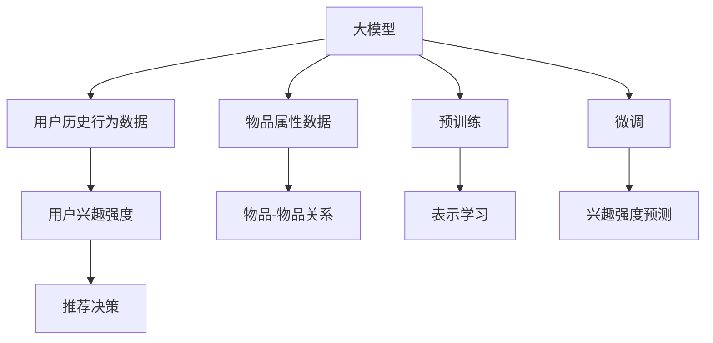
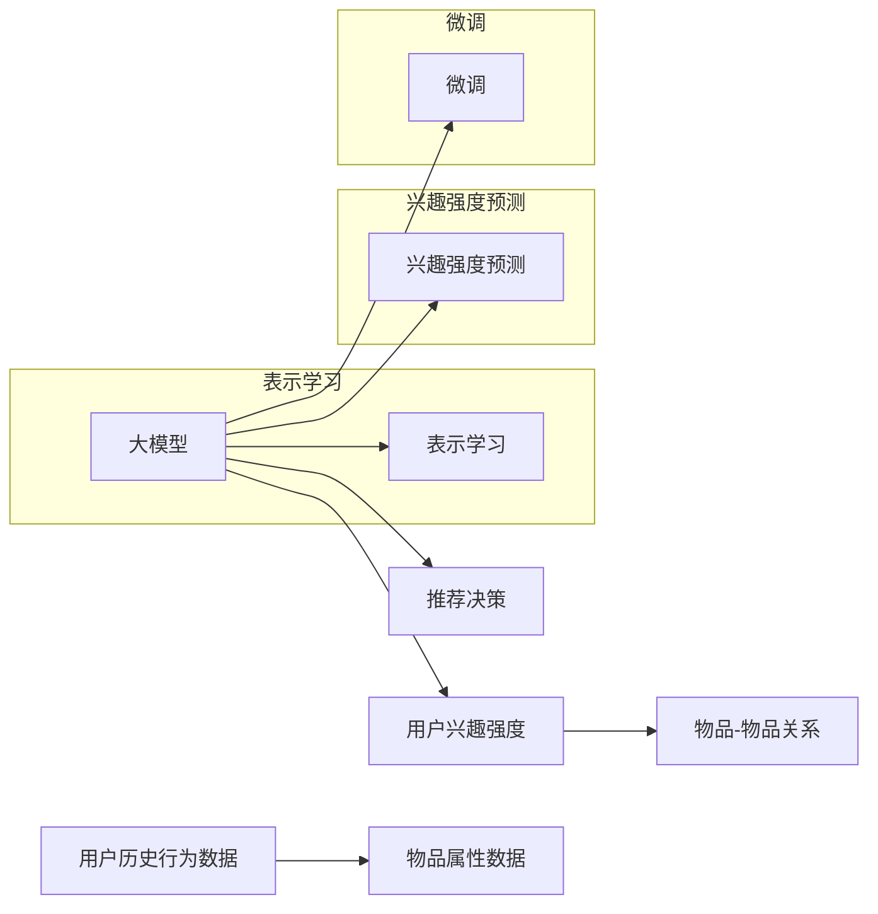

                 

# 大模型在推荐系统用户兴趣强度建模中的应用

> 关键词：大模型, 用户兴趣, 推荐系统, 兴趣强度建模, 深度学习, 协同过滤, 强化学习

## 1. 背景介绍

推荐系统已经成为互联网时代用户获取信息和内容的重要工具。为了满足用户的多样化需求，推荐系统不仅需要预测用户可能感兴趣的物品，还需要了解用户对不同物品的兴趣强度，从而实现精细化的个性化推荐。用户兴趣强度建模是推荐系统中的重要环节，直接影响到推荐结果的准确性和满意度。传统的推荐系统主要基于用户行为数据（如点击、浏览、购买等）进行模型训练和推荐决策。但这些行为数据通常只在用户和物品发生交互时才有，难以覆盖用户潜在的兴趣。大模型技术的出现，为推荐系统带来了新的可能性。

大模型技术，特别是深度学习模型，通过在海量数据上进行预训练，学习到通用的语言或视觉表示，可以更好地捕捉用户和物品的隐式兴趣，从而提升推荐系统的性能。本文将详细探讨大模型在推荐系统用户兴趣强度建模中的应用，包括模型构建、优化方法、训练策略以及实际应用场景。

## 2. 核心概念与联系

### 2.1 核心概念概述

为更好地理解大模型在推荐系统中的应用，我们首先介绍一些关键概念：

- **大模型**：指通过大规模数据预训练得到的深度神经网络模型，如BERT、GPT、ViT等。大模型通常拥有数亿甚至数十亿参数，具备强大的语言或视觉理解能力。
- **用户兴趣强度建模**：指通过训练模型，预测用户对物品的兴趣程度，从而为推荐系统提供决策依据。兴趣强度建模的精度直接影响推荐系统的推荐效果。
- **推荐系统**：通过分析用户历史行为和物品属性，预测用户可能感兴趣物品的系统。推荐系统应用广泛，包括电商、新闻、视频等。

### 2.2 核心概念原理和架构的 Mermaid 流程图



### 2.3 核心概念之间的联系

以上几个概念之间的联系可以通过以下流程图示意：



其中，用户历史行为数据和物品属性数据作为输入，经过大模型的表示学习（I），转化为高维语义表示。在此基础上，通过兴趣强度预测（J），计算用户对物品的兴趣强度。最后，将兴趣强度与物品-物品关系（E）结合，进行推荐决策（F）。

## 3. 核心算法原理 & 具体操作步骤

### 3.1 算法原理概述

大模型在推荐系统中的核心算法原理是通过学习用户历史行为和物品属性，构建用户和物品的表示，预测用户对物品的兴趣强度。具体而言，大模型在大量数据上预训练，学习到通用的语言或视觉表示，然后在特定推荐任务上进行微调，优化兴趣强度预测模型的性能。

大模型通常使用深度学习模型（如Transformer、卷积神经网络、自编码器等），通过自监督任务（如语言建模、图像分类等）进行预训练，学习到丰富的语义或视觉表示。在推荐任务上，通过对大模型进行微调，可以捕捉用户和物品之间的语义关系，从而更好地进行兴趣强度建模。

### 3.2 算法步骤详解

基于大模型的推荐系统用户兴趣强度建模，主要包括以下几个关键步骤：

**Step 1: 数据准备**

- 收集用户历史行为数据，如点击、浏览、购买等，以及对应的物品属性数据。
- 对数据进行清洗和预处理，去除噪声和异常值，形成干净的训练数据集。

**Step 2: 大模型预训练**

- 选择适合的大模型，如BERT、GPT、ViT等，作为初始化参数。
- 在大规模语料库上进行预训练，学习通用的语言或视觉表示。

**Step 3: 兴趣强度建模**

- 在大模型上进行微调，优化兴趣强度预测模型的性能。
- 使用标注好的用户历史行为数据，训练模型预测用户对物品的兴趣强度。
- 采用交叉验证、正则化等技术，防止模型过拟合。

**Step 4: 推荐决策**

- 将用户兴趣强度与物品-物品关系结合，进行推荐决策。
- 使用协同过滤、矩阵分解等技术，优化推荐结果。

**Step 5: 评估与优化**

- 在测试集上评估推荐系统性能，对比基线模型的精度。
- 根据评估结果，调整模型参数和训练策略，提升推荐效果。

### 3.3 算法优缺点

大模型在推荐系统中的兴趣强度建模方法，具有以下优点：

- **语义表示能力强**：大模型通过预训练学习到丰富的语义表示，能够捕捉用户和物品之间的隐式关系，提升推荐精度。
- **泛化能力强**：由于在大规模数据上进行预训练，大模型具备较强的泛化能力，能够在不同领域和场景下表现出色。
- **多模态融合**：大模型可以融合文本、图像、语音等多模态数据，进行联合表示学习，提升推荐效果。

但同时，大模型方法也存在一些缺点：

- **计算资源需求高**：大模型的预训练和微调需要大量的计算资源，对硬件设备要求较高。
- **模型复杂度高**：大模型的结构复杂，参数众多，需要更多的时间和精力进行优化和调参。
- **数据依赖性强**：大模型的性能很大程度上依赖于训练数据的质量和多样性，需要大量的标注数据进行微调。

### 3.4 算法应用领域

基于大模型的推荐系统在多个领域中得到广泛应用，包括电商、新闻、视频、社交媒体等。具体应用场景包括：

- **电商推荐**：推荐商品、商品分类、价格推荐等。
- **新闻推荐**：推荐新闻、主题、作者、文章等。
- **视频推荐**：推荐视频、视频分类、视频评论等。
- **社交媒体**：推荐好友、帖子、群组等。

## 4. 数学模型和公式 & 详细讲解 & 举例说明

### 4.1 数学模型构建

大模型在推荐系统中的兴趣强度建模，通常使用深度学习模型进行构建。以用户兴趣强度预测为例，构建的数学模型可以表示为：

$$
\hat{y} = M_{\theta}(x)
$$

其中，$M_{\theta}$ 表示大模型，$\theta$ 表示模型参数，$x$ 表示用户历史行为数据和物品属性数据，$\hat{y}$ 表示预测的用户兴趣强度。

### 4.2 公式推导过程

以BERT模型为例，推导用户兴趣强度预测的公式：

1. **用户历史行为编码**

$$
x_u = \text{BERT}(x_u, \text{user\_id}, \text{item\_id})
$$

其中，$x_u$ 表示用户历史行为编码，通过BERT模型将用户历史行为数据和用户ID、物品ID编码成高维向量。

2. **物品属性编码**

$$
x_i = \text{BERT}(x_i, \text{item\_id}, \text{item\_price}, \text{item\_description})
$$

其中，$x_i$ 表示物品属性编码，通过BERT模型将物品属性数据和物品ID、价格、描述编码成高维向量。

3. **用户兴趣强度预测**

$$
\hat{y}_{ui} = \text{MLP}([x_u, x_i])
$$

其中，$\text{MLP}$ 表示多层感知器，用于计算用户对物品的兴趣强度。

### 4.3 案例分析与讲解

以新闻推荐为例，大模型在新闻推荐中的应用可以分为以下步骤：

1. **新闻数据预处理**：收集新闻数据，并对其进行处理，如去除噪声、标准化、分词等。
2. **用户行为编码**：使用BERT模型对用户历史阅读行为进行编码，得到用户表示向量。
3. **新闻编码**：使用BERT模型对新闻进行编码，得到新闻表示向量。
4. **兴趣强度预测**：将用户表示向量和新闻表示向量输入到MLP中，预测用户对新闻的兴趣强度。
5. **推荐决策**：根据用户兴趣强度和新闻-新闻关系，进行推荐决策。

## 5. 项目实践：代码实例和详细解释说明

### 5.1 开发环境搭建

在进行项目实践前，我们需要准备好开发环境。以下是使用Python进行TensorFlow开发的Python环境配置流程：

1. 安装Anaconda：从官网下载并安装Anaconda，用于创建独立的Python环境。

2. 创建并激活虚拟环境：
```bash
conda create -n tf-env python=3.8 
conda activate tf-env
```

3. 安装TensorFlow：根据CUDA版本，从官网获取对应的安装命令。例如：
```bash
conda install tensorflow -c tf
```

4. 安装相关依赖包：
```bash
pip install numpy pandas sklearn
```

完成上述步骤后，即可在`tf-env`环境中开始项目实践。

### 5.2 源代码详细实现

这里以使用BERT模型进行新闻推荐为例，给出TensorFlow代码实现。

首先，定义新闻数据预处理函数：

```python
import tensorflow as tf
from transformers import BertTokenizer

def preprocess_news(data, tokenizer):
    encoded_data = tokenizer.encode(data, truncation=True, max_length=256)
    return encoded_data

# 加载BERT模型和分词器
model = BertModel.from_pretrained('bert-base-uncased')
tokenizer = BertTokenizer.from_pretrained('bert-base-uncased')
```

然后，定义模型和优化器：

```python
from tensorflow.keras.layers import Dense, Flatten

# 用户历史行为编码
user_input = tf.keras.Input(shape=(128, ), name='user_input')
user_encoded = model(user_input)

# 新闻编码
news_input = tf.keras.Input(shape=(128, ), name='news_input')
news_encoded = model(news_input)

# 用户新闻表示拼接
user_news_encoded = tf.keras.layers.Concatenate()([user_encoded, news_encoded])

# 兴趣强度预测
predictions = Dense(1, activation='sigmoid')(user_news_encoded)

# 构建模型
model = tf.keras.Model(inputs=[user_input, news_input], outputs=predictions)

# 定义优化器
optimizer = tf.keras.optimizers.Adam(learning_rate=0.001)
```

接着，定义训练和评估函数：

```python
# 训练函数
def train(model, train_data, validation_data, batch_size, epochs):
    model.compile(optimizer=optimizer, loss='binary_crossentropy', metrics=['accuracy'])
    model.fit(train_data, validation_data, epochs=epochs, batch_size=batch_size)

# 评估函数
def evaluate(model, test_data, batch_size):
    test_loss, test_accuracy = model.evaluate(test_data, batch_size=batch_size)
    print(f'Test loss: {test_loss}, Test accuracy: {test_accuracy}')
```

最后，启动训练流程并在测试集上评估：

```python
# 加载训练数据和测试数据
train_data = preprocess_news(train_data, tokenizer)
test_data = preprocess_news(test_data, tokenizer)

# 训练模型
train(model, train_data, validation_data, batch_size=16, epochs=10)

# 评估模型
evaluate(model, test_data, batch_size=16)
```

以上就是使用TensorFlow对BERT模型进行新闻推荐任务微调的完整代码实现。可以看到，得益于TensorFlow的强大封装，我们可以用相对简洁的代码完成BERT模型的加载和微调。

### 5.3 代码解读与分析

让我们再详细解读一下关键代码的实现细节：

**preprocess_news函数**：
- 定义了新闻数据的预处理函数，使用BERT分词器对新闻数据进行编码。

**模型定义**：
- 使用TensorFlow定义用户历史行为编码、新闻编码和用户新闻表示拼接的模型。
- 定义MLP层用于兴趣强度预测。

**优化器定义**：
- 定义Adam优化器，设置学习率。

**训练和评估函数**：
- 使用TensorFlow的编译函数编译模型，指定优化器和损失函数。
- 定义训练函数，使用compile函数编译模型。
- 使用fit函数训练模型，指定训练数据、验证数据、批量大小和迭代次数。
- 定义评估函数，使用evaluate函数评估模型在测试集上的性能。

**训练流程**：
- 加载训练数据和测试数据。
- 训练模型，使用train函数训练模型。
- 评估模型，使用evaluate函数评估模型在测试集上的性能。

可以看到，TensorFlow配合BERT模型使得新闻推荐任务的微调代码实现变得简洁高效。开发者可以将更多精力放在数据处理、模型改进等高层逻辑上，而不必过多关注底层的实现细节。

当然，工业级的系统实现还需考虑更多因素，如模型的保存和部署、超参数的自动搜索、更灵活的任务适配层等。但核心的微调范式基本与此类似。

## 6. 实际应用场景

### 6.1 电商推荐

基于大模型的推荐系统在电商领域中得到广泛应用。电商网站需要推荐用户可能感兴趣的商品，提升用户体验和转化率。大模型可以通过分析用户的浏览、点击、购买等行为，学习用户对不同商品的兴趣强度，从而实现个性化的推荐。

在技术实现上，可以收集用户的历史浏览记录，使用BERT等大模型对商品描述进行编码，然后训练模型预测用户对商品的兴趣强度。将预测结果与物品-物品关系结合，进行推荐决策。

### 6.2 新闻推荐

新闻推荐是新闻网站的重要功能之一，推荐系统需要根据用户历史阅读行为，预测用户可能感兴趣的新闻，提升用户留存率和点击率。大模型可以通过学习新闻文本和用户行为数据，构建用户和新闻的表示，预测用户对新闻的兴趣强度。

具体而言，可以收集用户的历史阅读记录，使用BERT等大模型对新闻进行编码，然后训练模型预测用户对新闻的兴趣强度。将预测结果与新闻-新闻关系结合，进行推荐决策。

### 6.3 视频推荐

视频推荐系统需要推荐用户可能感兴趣的视频内容，提升视频平台的用户粘性和点击率。大模型可以通过学习用户的观看记录和视频属性数据，构建用户和视频的表示，预测用户对视频的兴趣强度。

在技术实现上，可以收集用户的历史观看记录，使用BERT等大模型对视频进行编码，然后训练模型预测用户对视频的兴趣强度。将预测结果与视频-视频关系结合，进行推荐决策。

### 6.4 未来应用展望

随着大模型和微调技术的不断发展，基于大模型的推荐系统将在更多领域得到应用，为传统行业带来变革性影响。

在智慧医疗领域，基于大模型的推荐系统可以推荐相关医疗信息、疾病知识等，辅助医生诊疗，提升医疗服务的智能化水平。

在智能教育领域，推荐系统可以推荐适合的学习资源、课程、教师等，因材施教，促进教育公平，提高教学质量。

在智慧城市治理中，推荐系统可以推荐智能家居、智能交通、智能安防等智慧城市应用，提升城市管理的自动化和智能化水平，构建更安全、高效的未来城市。

此外，在企业生产、社会治理、文娱传媒等众多领域，基于大模型的推荐系统也将不断涌现，为经济社会发展注入新的动力。相信随着技术的日益成熟，推荐系统必将在更广阔的应用领域大放异彩。

## 7. 工具和资源推荐

### 7.1 学习资源推荐

为了帮助开发者系统掌握大模型在推荐系统中的应用，这里推荐一些优质的学习资源：

1. **《深度学习理论与实践》**：斯坦福大学李飞飞教授主讲的深度学习课程，系统介绍深度学习的基本理论和实践技术。
2. **《TensorFlow实战》**：谷歌TensorFlow官方文档，提供丰富的TensorFlow学习资源和样例代码。
3. **《Transformers: From Practice to Theory》**：微软亚洲研究院自然语言处理团队撰写的博文系列，详细介绍Transformer模型及其在推荐系统中的应用。
4. **《推荐系统实战》**：一本详细介绍推荐系统原理和实现的书，涵盖协同过滤、深度学习、强化学习等多种推荐算法。
5. **《Recommender Systems: The Textbook》**：一本经典的推荐系统教材，全面介绍推荐系统的理论和应用。

通过对这些资源的学习实践，相信你一定能够快速掌握大模型在推荐系统中的应用，并用于解决实际的推荐问题。

### 7.2 开发工具推荐

高效的开发离不开优秀的工具支持。以下是几款用于大模型推荐系统开发的常用工具：

1. **TensorFlow**：由谷歌主导开发的开源深度学习框架，生产部署方便，适合大规模工程应用。
2. **PyTorch**：基于Python的开源深度学习框架，灵活动态的计算图，适合快速迭代研究。
3. **TensorBoard**：TensorFlow配套的可视化工具，可实时监测模型训练状态，并提供丰富的图表呈现方式。
4. **Weights & Biases**：模型训练的实验跟踪工具，可以记录和可视化模型训练过程中的各项指标，方便对比和调优。
5. **Jupyter Notebook**：开源的交互式计算环境，方便快速实验和分享代码。

合理利用这些工具，可以显著提升大模型推荐系统的开发效率，加快创新迭代的步伐。

### 7.3 相关论文推荐

大模型和推荐系统的发展源于学界的持续研究。以下是几篇奠基性的相关论文，推荐阅读：

1. **《注意力机制在推荐系统中的应用》**：介绍了注意力机制在推荐系统中的应用，提升了推荐系统的精度和鲁棒性。
2. **《深度学习在推荐系统中的应用》**：综述了深度学习在推荐系统中的研究进展，包括协同过滤、序列建模、生成模型等。
3. **《强化学习在推荐系统中的应用》**：介绍了强化学习在推荐系统中的应用，提升了推荐系统的自适应性和智能性。
4. **《深度学习在推荐系统中的最新进展》**：综述了深度学习在推荐系统中的最新研究进展，包括自监督学习、多模态融合等。

这些论文代表了大模型在推荐系统中的应用发展脉络。通过学习这些前沿成果，可以帮助研究者把握学科前进方向，激发更多的创新灵感。

## 8. 总结：未来发展趋势与挑战

### 8.1 总结

本文对大模型在推荐系统中的应用进行了全面系统的介绍。首先阐述了大模型和推荐系统的研究背景和意义，明确了兴趣强度建模在推荐系统中的重要地位。其次，从原理到实践，详细讲解了大模型在推荐系统中的应用流程，包括数据准备、预训练、微调和推荐决策等关键步骤。同时，本文还探讨了大模型在电商、新闻、视频等多个领域的实际应用场景，展示了其广泛的应用前景。最后，本文精选了推荐系统的相关学习资源、开发工具和经典论文，力求为读者提供全方位的技术指引。

通过本文的系统梳理，可以看到，基于大模型的推荐系统为用户兴趣强度建模带来了新的可能性，极大地提升了推荐系统的性能和效果。未来，伴随大模型和微调技术的持续演进，基于大模型的推荐系统必将在更多领域得到应用，为推荐系统的未来发展注入新的活力。

### 8.2 未来发展趋势

展望未来，大模型在推荐系统中的应用将呈现以下几个发展趋势：

1. **多模态融合**：未来的推荐系统将越来越多地融合多模态数据，如文本、图像、语音等，实现更加全面的用户兴趣建模。
2. **自适应推荐**：基于强化学习等技术，推荐系统将更加智能，能够根据用户反馈动态调整推荐策略，提升推荐效果。
3. **个性化推荐**：未来的推荐系统将更加个性化，通过大模型学习用户兴趣的细微变化，实现更加精准的推荐。
4. **跨领域推荐**：推荐系统将不仅仅限于单一领域，而是能够跨领域推荐，提升用户体验和满意度。
5. **实时推荐**：推荐系统将实现实时推荐，能够即时响应用户需求，提升用户体验。

以上趋势凸显了大模型在推荐系统中的广泛应用前景。这些方向的探索发展，必将进一步提升推荐系统的性能和效果，为用户的个性化需求提供更加精准和智能的解决方案。

### 8.3 面临的挑战

尽管大模型在推荐系统中的应用已经取得了显著进展，但在迈向更加智能化、普适化应用的过程中，仍面临诸多挑战：

1. **计算资源瓶颈**：大模型的预训练和微调需要大量的计算资源，对硬件设备要求较高，如何降低计算成本是一个重要问题。
2. **数据依赖性强**：大模型的性能很大程度上依赖于训练数据的质量和多样性，需要大量的标注数据进行微调，数据获取成本较高。
3. **模型鲁棒性不足**：大模型在面对新数据时，泛化性能往往较差，需要进一步提升模型的鲁棒性和泛化能力。
4. **可解释性不足**：大模型往往是"黑盒"系统，难以解释其内部工作机制和决策逻辑，需要进一步提升模型的可解释性。
5. **公平性问题**：大模型在推荐过程中可能会产生偏见，需要确保推荐结果的公平性和透明性。

### 8.4 研究展望

面对大模型在推荐系统中的应用所面临的挑战，未来的研究需要在以下几个方面寻求新的突破：

1. **小样本学习**：开发更加高效的少样本学习方法，使得大模型能够在少量数据下进行微调，降低数据获取成本。
2. **轻量化模型**：开发更加轻量化、高效的推荐模型，降低计算资源消耗，提高推荐系统的实时性。
3. **自适应推荐**：研究自适应推荐算法，使得推荐系统能够根据用户反馈动态调整推荐策略，提升推荐效果。
4. **可解释性增强**：研究可解释性增强方法，使得推荐系统能够提供透明的决策过程，提升用户信任度。
5. **公平性保障**：研究公平性保障技术，确保推荐结果的公平性和透明性，避免偏见和歧视。

这些研究方向的探索，必将引领大模型在推荐系统中的应用走向成熟，为构建更加智能、公平、透明、高效的推荐系统铺平道路。面向未来，大模型在推荐系统中的应用还有很大的想象空间，需要不断探索和创新，才能真正实现人工智能技术的广泛应用。

## 9. 附录：常见问题与解答

**Q1: 大模型在推荐系统中是否需要大量标注数据？**

A: 是的，大模型在推荐系统中通常需要进行微调，而微调需要大量标注数据。标注数据的获取成本较高，但可以显著提升推荐系统的性能。如果数据获取成本较高，可以考虑使用自监督学习、半监督学习等方法，通过无监督或半监督的方式进行推荐系统训练。

**Q2: 大模型在推荐系统中是否可以用于冷启动用户推荐？**

A: 是的，大模型可以通过预训练学习到通用的语言或视觉表示，可以用来进行冷启动用户推荐。对于新用户，可以将其历史行为数据和物品属性数据输入到大模型中，预测用户对不同物品的兴趣强度，进行推荐决策。

**Q3: 大模型在推荐系统中是否需要实时更新？**

A: 是的，大模型需要实时更新，才能跟上用户兴趣的变化。可以通过在线学习、增量学习等技术，实时更新大模型的参数，提升推荐系统的时效性。

**Q4: 大模型在推荐系统中是否需要考虑隐私和安全问题？**

A: 是的，大模型在推荐系统中需要考虑隐私和安全问题。在数据收集、存储、传输等环节，需要采取加密、脱敏、匿名化等措施，确保用户隐私的安全。同时，需要防止模型被恶意攻击，避免数据泄露和信息滥用。

**Q5: 大模型在推荐系统中是否需要考虑多语言支持？**

A: 是的，大模型在推荐系统中需要考虑多语言支持。通过预训练学习多语言的通用表示，大模型可以应用于多种语言环境下的推荐系统，提升全球用户的推荐效果。

总之，大模型在推荐系统中的应用前景广阔，但需要不断优化和改进，才能发挥其最大的性能优势。合理利用大模型技术，可以显著提升推荐系统的精度和效果，为用户带来更好的体验和服务。

---

作者：禅与计算机程序设计艺术 / Zen and the Art of Computer Programming

