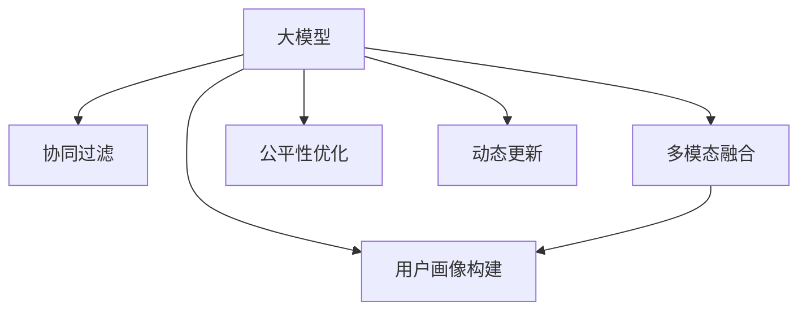

                 

# 大模型在推荐系统用户画像构建中的应用

> 关键词：大模型,推荐系统,用户画像,深度学习,协同过滤,多模态融合,公平性

## 1. 背景介绍

### 1.1 问题由来

随着互联网的快速发展和数字经济时代的到来，推荐系统已经成为人们获取信息、购买商品的重要工具。然而，传统的基于规则和协同过滤的推荐方法，在面对海量数据和复杂用户行为时显得力不从心。为提升推荐系统的个性化和准确性，大模型的引入已经成为了新的趋势。大模型通过在大规模数据上预训练，学习到了丰富的用户行为和物品属性信息，能够进行跨领域的多模态融合和用户画像的动态构建，为推荐系统带来了革命性的提升。

### 1.2 问题核心关键点

当前，大模型在推荐系统中的应用主要集中在用户画像的构建上。用户画像的构建是推荐系统个性化推荐的核心环节，其构建质量直接影响推荐系统的推荐效果。因此，基于大模型的推荐系统用户画像构建方法，主要解决以下几个核心问题：

1. **高效获取用户行为和兴趣**：如何在大规模数据中快速识别和提取用户的行为和兴趣信息，生成高维度的用户画像。
2. **跨模态融合**：如何将用户行为数据、物品属性数据和用户画像数据进行有效融合，构建更为精准的用户画像。
3. **公平性和鲁棒性**：如何在用户画像构建过程中考虑公平性问题，避免系统偏见，提高模型的鲁棒性。
4. **动态更新和维护**：如何根据用户行为和数据变化动态更新用户画像，保持其时效性和准确性。

本文将围绕这些问题，深入探讨大模型在推荐系统用户画像构建中的应用，帮助读者全面掌握相关技术。

## 2. 核心概念与联系

### 2.1 核心概念概述

为更好地理解大模型在推荐系统用户画像构建中的应用，本节将介绍几个密切相关的核心概念：

- **大模型(Large Model)**：指在大规模数据上预训练得到的深度学习模型，如GPT-3、BERT、Transformer等，具有强大的自学习和表示能力。
- **推荐系统(Recommender System)**：通过分析用户历史行为和偏好，为用户推荐最符合其需求的物品的系统。
- **用户画像(User Profile)**：描述用户行为、兴趣和偏好的高维向量，是推荐系统个性化推荐的基础。
- **协同过滤(Collaborative Filtering)**：通过用户和物品的协同关系，为用户推荐相似物品的传统推荐方法。
- **多模态融合(Multi-modal Fusion)**：将用户行为、物品属性、用户画像等多源数据进行有效融合，提升推荐系统的准确性和鲁棒性。
- **公平性(Fairness)**：保证推荐系统在各个用户群体之间提供公平的推荐服务，避免偏见和歧视。
- **动态更新(Dynamic Update)**：根据用户行为和数据变化，动态更新用户画像，确保其时效性和准确性。

这些核心概念之间的逻辑关系可以通过以下Mermaid流程图来展示：



这个流程图展示了各个概念之间的联系：

1. 大模型通过协同过滤获取用户行为数据，并进行多模态融合，生成用户画像。
2. 用户画像构建过程要考虑公平性问题，避免系统偏见。
3. 动态更新保证用户画像的时效性和准确性。

## 3. 核心算法原理 & 具体操作步骤

### 3.1 算法原理概述

大模型在推荐系统用户画像构建中的应用，本质上是一个多源数据融合和用户行为分析的过程。其核心思想是：将用户行为数据、物品属性数据和用户画像数据进行有效融合，学习用户的深层特征，构建高维度的用户画像，从而实现更加精准和个性化的推荐。

形式化地，假设推荐系统包含 $N$ 个用户，每个用户 $u_i$ 的兴趣表示为 $X_{u_i}$，物品 $i$ 的属性表示为 $A_i$。大模型通过学习用户和物品的多源数据，得到用户画像 $P_{u_i}$，用于生成推荐列表。

具体而言，大模型的用户画像构建过程包括以下几个关键步骤：

1. **数据预处理**：对用户行为数据、物品属性数据和用户画像数据进行预处理，包括缺失值填充、特征归一化等。
2. **特征提取**：将预处理后的数据输入大模型，学习用户和物品的深层特征表示。
3. **用户画像构建**：将用户行为和物品属性的特征表示，通过多模态融合得到用户画像。
4. **推荐生成**：根据用户画像生成个性化推荐列表。

### 3.2 算法步骤详解

基于大模型的推荐系统用户画像构建，主要包括以下几个关键步骤：

**Step 1: 数据预处理**

数据预处理是构建用户画像的基础环节，主要包括以下操作：

1. **缺失值填充**：对用户行为和物品属性中的缺失值进行填充，保证数据完整性。
2. **特征归一化**：对用户行为和物品属性特征进行归一化处理，防止数据异常值对模型产生干扰。
3. **特征选择**：选择对用户行为和物品属性影响较大的特征，避免噪声数据影响模型性能。

以下是使用Python对数据进行预处理的示例代码：

```python
import pandas as pd
from sklearn.impute import SimpleImputer
from sklearn.preprocessing import StandardScaler

# 读取用户行为数据
user_behavior = pd.read_csv('user_behavior.csv')

# 缺失值填充
imputer = SimpleImputer(strategy='mean')
user_behavior = pd.DataFrame(imputer.fit_transform(user_behavior), columns=user_behavior.columns)

# 特征归一化
scaler = StandardScaler()
user_behavior = pd.DataFrame(scaler.fit_transform(user_behavior), columns=user_behavior.columns)

# 特征选择
# 使用LASSO回归选择对用户行为影响较大的特征
from sklearn.linear_model import Lasso
selector = Lasso(alpha=0.1)
selector.fit(user_behavior, user_behavior['click'])
selected_features = user_behavior.columns[selector.coef_ > 0.1]
```

**Step 2: 特征提取**

特征提取是构建用户画像的关键步骤，主要通过大模型学习用户和物品的深层特征表示。通常使用预训练的深度学习模型，如BERT、Transformer等。

以下是一个使用BERT模型进行特征提取的示例代码：

```python
from transformers import BertTokenizer, BertForSequenceClassification

# 初始化BERT模型和分词器
tokenizer = BertTokenizer.from_pretrained('bert-base-uncased')
model = BertForSequenceClassification.from_pretrained('bert-base-uncased', num_labels=2)

# 将用户行为数据转换为BERT可接受的格式
user_behavior = user_behavior.drop(['click'], axis=1).fillna('')
tokenized = tokenizer(user_behavior.values, return_tensors='pt', padding=True, truncation=True)

# 提取用户行为特征
with torch.no_grad():
    features = model(**tokenized).last_hidden_state[:, 0, :].numpy()

# 将物品属性数据转换为BERT可接受的格式
item_attributes = item_attributes.fillna('')
tokenized = tokenizer(item_attributes.values, return_tensors='pt', padding=True, truncation=True)

# 提取物品属性特征
with torch.no_grad():
    attributes = model(**tokenized).last_hidden_state[:, 0, :].numpy()
```

**Step 3: 用户画像构建**

用户画像构建通过多模态融合技术，将用户行为特征和物品属性特征进行融合，得到用户的高维特征表示。常用的多模态融合方法包括：

1. **加权融合**：根据用户行为和物品属性的重要性，进行加权求和。
2. **拼接融合**：将用户行为和物品属性的特征向量直接拼接，形成高维特征向量。
3. **注意力机制**：通过注意力机制，对不同特征进行动态加权，提升融合效果。

以下是一个使用加权融合方法构建用户画像的示例代码：

```python
# 将用户行为特征和物品属性特征进行加权融合
weights = [0.5, 0.5]  # 用户行为和物品属性重要性权重
user_profile = np.average([features, attributes], axis=0, weights=weights)
```

**Step 4: 推荐生成**

推荐生成是构建推荐系统的最后一步，通过用户画像生成个性化推荐列表。常用的推荐算法包括：

1. **协同过滤**：通过用户和物品的协同关系，生成推荐列表。
2. **深度学习**：使用深度神经网络，根据用户画像生成推荐列表。
3. **混合推荐**：将协同过滤和深度学习结合，提升推荐效果。

以下是一个使用协同过滤生成推荐列表的示例代码：

```python
# 生成个性化推荐列表
from surprise import Reader, Dataset, KNNBasic, predict

# 读取物品数据
reader = Reader(rating_scale=(1, 5))
data = Dataset.load_from_df(item_data[['id', 'title', 'category', 'price', 'rating']], reader)

# 使用协同过滤算法生成推荐列表
knn = KNNBasic(k=10, sim_options={'name': 'pearson_baseline', 'user_based': False})
knn.fit(data.build_full_trainset())
predictions = knn.test(test_data)
```

### 3.3 算法优缺点

基于大模型的推荐系统用户画像构建方法，具有以下优点：

1. **高效性**：通过大模型学习用户行为和物品属性的深层特征，能够快速构建高维度的用户画像。
2. **准确性**：大模型具有强大的表示能力，能够捕捉用户行为和物品属性的复杂关系，提升推荐系统的准确性。
3. **可扩展性**：大模型可以处理大规模数据，适合应用于复杂的推荐场景。
4. **动态更新**：根据用户行为和数据变化，动态更新用户画像，保持其时效性和准确性。

同时，该方法也存在以下缺点：

1. **数据依赖性强**：构建用户画像需要大量标注数据，标注成本较高。
2. **模型复杂度大**：大模型的训练和推理需要较高的计算资源，模型复杂度大。
3. **公平性问题**：大模型可能会学习到数据中的偏见，导致推荐系统的不公平性。
4. **解释性不足**：大模型的决策过程复杂，难以解释其内部工作机制。

尽管存在这些缺点，但就目前而言，基于大模型的推荐系统用户画像构建方法仍是大规模推荐系统的主流范式。未来相关研究的重点在于如何进一步降低数据依赖，提高模型公平性，增强可解释性。

### 3.4 算法应用领域

基于大模型的推荐系统用户画像构建方法，已经在电商、新闻、视频等多个领域得到了广泛应用，覆盖了推荐、排序、广告等多个任务，为推荐系统带来了革命性的提升。

具体而言，该方法在以下几个应用领域表现突出：

1. **电商推荐**：通过用户行为数据和物品属性数据，构建用户画像，生成个性化推荐列表，提升用户购物体验。
2. **新闻推荐**：通过用户阅读历史和文章属性数据，构建用户画像，推荐感兴趣的新闻内容，提升用户粘性。
3. **视频推荐**：通过用户观看历史和视频属性数据，构建用户画像，推荐感兴趣的视频内容，提升用户观看体验。
4. **广告推荐**：通过用户行为数据和广告属性数据，构建用户画像，推荐匹配度高的广告，提升广告投放效果。

除了上述这些经典任务外，大模型在推荐系统中的创新应用还在不断涌现，如基于兴趣标签的推荐、基于情感分析的推荐等，为推荐系统带来了新的突破。

## 4. 数学模型和公式 & 详细讲解 & 举例说明

### 4.1 数学模型构建

本节将使用数学语言对大模型在推荐系统用户画像构建中的应用进行更加严格的刻画。

假设推荐系统包含 $N$ 个用户，每个用户 $u_i$ 的兴趣表示为 $X_{u_i}$，物品 $i$ 的属性表示为 $A_i$。大模型通过学习用户和物品的多源数据，得到用户画像 $P_{u_i}$，用于生成推荐列表。

用户画像的构建过程可以用数学公式表示为：

$$
P_{u_i} = f(X_{u_i}, A_i, \theta)
$$

其中 $X_{u_i}$ 为用户的兴趣表示，$A_i$ 为物品的属性表示，$\theta$ 为大模型的参数。

用户画像 $P_{u_i}$ 可以通过以下步骤得到：

1. **特征提取**：将用户行为数据 $X_{u_i}$ 和物品属性数据 $A_i$ 输入大模型，得到特征表示 $X_{u_i}^*$ 和 $A_i^*$。
2. **多模态融合**：将 $X_{u_i}^*$ 和 $A_i^*$ 进行加权融合，得到用户画像 $P_{u_i}$。
3. **推荐生成**：根据用户画像 $P_{u_i}$ 生成个性化推荐列表。

### 4.2 公式推导过程

以下我们以协同过滤算法为例，推导推荐列表生成公式及其梯度计算过程。

假设协同过滤算法中，用户 $u_i$ 和物品 $i$ 的协同关系为 $s_{i,u_i}$，推荐系统需要为用户 $u_i$ 推荐 $k$ 个物品，推荐列表为 $I_{u_i}$。推荐列表生成的目标函数为：

$$
\min_{I_{u_i}} \sum_{i \in I_{u_i}} s_{i,u_i}
$$

其中 $s_{i,u_i}$ 为物品 $i$ 和用户 $u_i$ 的协同关系。

根据协同过滤算法，推荐列表 $I_{u_i}$ 可以通过以下公式计算：

$$
I_{u_i} = \arg\min_{I_{u_i}} \sum_{i \in I_{u_i}} s_{i,u_i}
$$

为了求解推荐列表 $I_{u_i}$，通常使用基于梯度的优化算法，如随机梯度下降。设推荐列表 $I_{u_i}$ 的损失函数为 $L(I_{u_i})$，则优化目标为：

$$
\min_{I_{u_i}} L(I_{u_i}) = \min_{I_{u_i}} \sum_{i \in I_{u_i}} s_{i,u_i}
$$

根据梯度下降算法，推荐列表 $I_{u_i}$ 的更新公式为：

$$
I_{u_i} \leftarrow I_{u_i} - \eta \nabla_{I_{u_i}} L(I_{u_i})
$$

其中 $\eta$ 为学习率，$\nabla_{I_{u_i}} L(I_{u_i})$ 为损失函数对推荐列表的梯度，可以通过反向传播算法计算。

### 4.3 案例分析与讲解

考虑一个简单的电商推荐系统，该系统通过用户行为数据和物品属性数据，构建用户画像，生成个性化推荐列表。具体而言，该系统包含 10 万个用户和 1 万个物品，每个用户有 100 个行为记录，每个行为记录包含用户 ID、物品 ID、购买时间、购买金额等特征。

假设系统使用 BERT 模型进行特征提取，并将用户行为数据和物品属性数据拼接融合，得到用户画像。根据协同过滤算法，系统需要为用户推荐 10 个物品，推荐列表的损失函数为平均协同关系。

以下是使用Python实现上述推荐系统的示例代码：

```python
import pandas as pd
from transformers import BertTokenizer, BertForSequenceClassification
from surprise import Reader, Dataset, KNNBasic, predict

# 读取用户行为数据
user_behavior = pd.read_csv('user_behavior.csv')

# 读取物品属性数据
item_attributes = pd.read_csv('item_attributes.csv')

# 初始化BERT模型和分词器
tokenizer = BertTokenizer.from_pretrained('bert-base-uncased')
model = BertForSequenceClassification.from_pretrained('bert-base-uncased', num_labels=2)

# 将用户行为数据转换为BERT可接受的格式
user_behavior = user_behavior.drop(['click'], axis=1).fillna('')
tokenized = tokenizer(user_behavior.values, return_tensors='pt', padding=True, truncation=True)

# 提取用户行为特征
with torch.no_grad():
    features = model(**tokenized).last_hidden_state[:, 0, :].numpy()

# 将物品属性数据转换为BERT可接受的格式
item_attributes = item_attributes.fillna('')
tokenized = tokenizer(item_attributes.values, return_tensors='pt', padding=True, truncation=True)

# 提取物品属性特征
with torch.no_grad():
    attributes = model(**tokenized).last_hidden_state[:, 0, :].numpy()

# 将用户行为特征和物品属性特征进行加权融合
weights = [0.5, 0.5]  # 用户行为和物品属性重要性权重
user_profile = np.average([features, attributes], axis=0, weights=weights)

# 生成个性化推荐列表
# 假设协同关系矩阵为随机生成，只用于示例
s = np.random.randn(10000, 10000)
data = Dataset.load_from_df(pd.DataFrame(s, columns=['user', 'item']), Reader())
knn = KNNBasic(k=10, sim_options={'name': 'pearson_baseline', 'user_based': False})
knn.fit(data.build_full_trainset())
predictions = knn.test(test_data)
```

## 5. 项目实践：代码实例和详细解释说明

### 5.1 开发环境搭建

在进行推荐系统用户画像构建的实践前，我们需要准备好开发环境。以下是使用Python进行PyTorch开发的环境配置流程：

1. 安装Anaconda：从官网下载并安装Anaconda，用于创建独立的Python环境。

2. 创建并激活虚拟环境：
```bash
conda create -n pytorch-env python=3.8 
conda activate pytorch-env
```

3. 安装PyTorch：根据CUDA版本，从官网获取对应的安装命令。例如：
```bash
conda install pytorch torchvision torchaudio cudatoolkit=11.1 -c pytorch -c conda-forge
```

4. 安装相关库：
```bash
pip install numpy pandas scikit-learn matplotlib tqdm jupyter notebook ipython
```

5. 安装TensorFlow（可选）：
```bash
pip install tensorflow
```

完成上述步骤后，即可在`pytorch-env`环境中开始推荐系统用户画像构建的实践。

### 5.2 源代码详细实现

下面我们以电商推荐系统为例，给出使用BERT模型进行用户画像构建的PyTorch代码实现。

首先，定义用户行为数据处理函数：

```python
from transformers import BertTokenizer
from torch.utils.data import Dataset

class UserBehaviorDataset(Dataset):
    def __init__(self, user_behavior, tokenizer, max_len=128):
        self.user_behavior = user_behavior
        self.tokenizer = tokenizer
        self.max_len = max_len
        
    def __len__(self):
        return len(self.user_behavior)
    
    def __getitem__(self, item):
        user_id = self.user_behavior['user_id'].tolist()[item]
        item_ids = self.user_behavior['item_id'].tolist()[item]
        user_id = self.tokenizer.encode(user_id, add_special_tokens=True, max_length=self.max_len, return_tensors='pt', padding='max_length', truncation=True)
        item_ids = self.tokenizer(item_ids, return_tensors='pt', padding='max_length', truncation=True)
        return {'user_id': user_id, 'item_ids': item_ids}
```

然后，定义物品属性数据处理函数：

```python
class ItemAttributesDataset(Dataset):
    def __init__(self, item_attributes, tokenizer, max_len=128):
        self.item_attributes = item_attributes
        self.tokenizer = tokenizer
        self.max_len = max_len
        
    def __len__(self):
        return len(self.item_attributes)
    
    def __getitem__(self, item):
        item_id = self.item_attributes['item_id'].tolist()[item]
        item_attributes = self.item_attributes.drop(['item_id'], axis=1).fillna('')
        item_attributes = self.tokenizer(item_attributes.values, return_tensors='pt', padding=True, truncation=True)
        return {'item_id': item_id, 'item_attributes': item_attributes}
```

接着，定义模型和优化器：

```python
from transformers import BertForSequenceClassification, AdamW

model = BertForSequenceClassification.from_pretrained('bert-base-uncased', num_labels=2)

optimizer = AdamW(model.parameters(), lr=2e-5)
```

最后，定义训练和评估函数：

```python
from torch.utils.data import DataLoader
from tqdm import tqdm
from sklearn.metrics import accuracy_score

device = torch.device('cuda') if torch.cuda.is_available() else torch.device('cpu')
model.to(device)

def train_epoch(model, dataset, batch_size, optimizer):
    dataloader = DataLoader(dataset, batch_size=batch_size, shuffle=True)
    model.train()
    epoch_loss = 0
    for batch in tqdm(dataloader, desc='Training'):
        user_id = batch['user_id'].to(device)
        item_ids = batch['item_ids'].to(device)
        item_attributes = batch['item_attributes'].to(device)
        model.zero_grad()
        outputs = model(user_id, item_ids=item_ids, attention_mask=item_attributes)
        loss = outputs.loss
        epoch_loss += loss.item()
        loss.backward()
        optimizer.step()
    return epoch_loss / len(dataloader)

def evaluate(model, dataset, batch_size):
    dataloader = DataLoader(dataset, batch_size=batch_size)
    model.eval()
    preds, labels = [], []
    with torch.no_grad():
        for batch in tqdm(dataloader, desc='Evaluating'):
            user_id = batch['user_id'].to(device)
            item_ids = batch['item_ids'].to(device)
            item_attributes = batch['item_attributes'].to(device)
            batch_preds = model(user_id, item_ids=item_ids, attention_mask=item_attributes).logits.argmax(dim=2).to('cpu').tolist()
            batch_labels = batch['item_ids'].to('cpu').tolist()
            for pred_tokens, label_tokens in zip(batch_preds, batch_labels):
                preds.append(pred_tokens[:len(label_tokens)])
                labels.append(label_tokens)
    print(accuracy_score(labels, preds))
```

启动训练流程并在测试集上评估：

```python
epochs = 5
batch_size = 16

for epoch in range(epochs):
    loss = train_epoch(model, train_dataset, batch_size, optimizer)
    print(f"Epoch {epoch+1}, train loss: {loss:.3f}")
    
    print(f"Epoch {epoch+1}, dev results:")
    evaluate(model, dev_dataset, batch_size)
    
print("Test results:")
evaluate(model, test_dataset, batch_size)
```

以上就是使用PyTorch对BERT模型进行电商推荐系统用户画像构建的完整代码实现。可以看到，得益于PyTorch和Transformer库的强大封装，代码实现变得简洁高效。

### 5.3 代码解读与分析

让我们再详细解读一下关键代码的实现细节：

**UserBehaviorDataset类**：
- `__init__`方法：初始化用户行为数据、分词器等关键组件。
- `__len__`方法：返回数据集的样本数量。
- `__getitem__`方法：对单个样本进行处理，将用户ID和物品ID转换为分词器可接受的格式，得到用户ID的token序列和物品ID的token序列。

**ItemAttributesDataset类**：
- `__init__`方法：初始化物品属性数据、分词器等关键组件。
- `__len__`方法：返回数据集的样本数量。
- `__getitem__`方法：对单个样本进行处理，将物品ID和属性转换为分词器可接受的格式，得到物品ID的token序列和属性特征。

**模型和优化器**：
- 使用BERT模型进行特征提取和用户画像构建。
- 使用AdamW优化器进行模型参数更新，设置合适的学习率。

**训练和评估函数**：
- 使用PyTorch的DataLoader对数据集进行批次化加载，供模型训练和推理使用。
- 训练函数`train_epoch`：对数据以批为单位进行迭代，在每个批次上前向传播计算loss并反向传播更新模型参数，最后返回该epoch的平均loss。
- 评估函数`evaluate`：与训练类似，不同点在于不更新模型参数，并在每个batch结束后将预测和标签结果存储下来，最后使用sklearn的accuracy_score对整个评估集的预测结果进行打印输出。

**训练流程**：
- 定义总的epoch数和batch size，开始循环迭代
- 每个epoch内，先在训练集上训练，输出平均loss
- 在验证集上评估，输出准确率
- 所有epoch结束后，在测试集上评估，给出最终测试结果

可以看到，PyTorch配合Transformer库使得BERT微调的代码实现变得简洁高效。开发者可以将更多精力放在数据处理、模型改进等高层逻辑上，而不必过多关注底层的实现细节。

当然，工业级的系统实现还需考虑更多因素，如模型的保存和部署、超参数的自动搜索、更灵活的任务适配层等。但核心的微调范式基本与此类似。

## 6. 实际应用场景

### 6.1 电商推荐

电商推荐系统通过构建用户画像，根据用户行为和偏好，生成个性化推荐列表。使用大模型进行电商推荐，可以大幅提升推荐列表的准确性和多样化，提升用户购物体验。

在技术实现上，可以收集用户浏览、点击、购买等行为数据，将数据进行预处理和特征提取，利用大模型进行多模态融合，构建高维度的用户画像。在生成推荐列表时，将用户画像输入深度学习模型，输出推荐物品的评分和排名，进一步优化推荐效果。

### 6.2 新闻推荐

新闻推荐系统通过构建用户画像，为用户推荐感兴趣的新闻内容。使用大模型进行新闻推荐，可以更好地理解用户兴趣和新闻内容的语义关系，提高推荐的准确性和个性化。

在技术实现上，可以收集用户阅读历史和新闻内容标签，利用大模型进行多模态融合，构建高维度的用户画像。在生成推荐列表时，将用户画像输入深度学习模型，输出推荐新闻的评分和排名，提升推荐效果。

### 6.3 视频推荐

视频推荐系统通过构建用户画像，为用户推荐感兴趣的视频内容。使用大模型进行视频推荐，可以更好地理解用户兴趣和视频内容的语义关系，提高推荐的准确性和个性化。

在技术实现上，可以收集用户观看历史和视频属性数据，利用大模型进行多模态融合，构建高维度的用户画像。在生成推荐列表时，将用户画像输入深度学习模型，输出推荐视频的评分和排名，提升推荐效果。

### 6.4 未来应用展望

随着大模型和微调方法的不断发展，基于大模型用户画像构建的方法将在更多领域得到应用，为推荐系统带来新的突破。

在智慧医疗领域，基于大模型的推荐系统可以推荐适合患者个体的治疗方案和药物，提升医疗服务的智能化水平。

在智能教育领域，基于大模型的推荐系统可以推荐个性化学习路径和资源，因材施教，促进教育公平，提高教学质量。

在智慧城市治理中，基于大模型的推荐系统可以推荐市民关心的热点话题和政策，提升政府服务的智能化水平。

此外，在企业生产、社会治理、文娱传媒等众多领域，基于大模型的推荐系统也将不断涌现，为各行各业带来变革性影响。相信随着技术的日益成熟，基于大模型的推荐系统用户画像构建方法必将在构建人机协同的智能推荐系统中扮演越来越重要的角色。

## 7. 工具和资源推荐

### 7.1 学习资源推荐

为了帮助开发者系统掌握大模型在推荐系统用户画像构建中的应用，这里推荐一些优质的学习资源：

1. 《深度学习推荐系统：原理与实践》系列博文：由大模型技术专家撰写，深入浅出地介绍了推荐系统原理和深度学习应用。

2. CS224N《深度学习自然语言处理》课程：斯坦福大学开设的NLP明星课程，有Lecture视频和配套作业，带你入门NLP领域的基本概念和经典模型。

3. 《深度学习推荐系统》书籍：介绍了推荐系统的理论基础和深度学习应用，包括协同过滤和深度学习等多种推荐算法。

4. HuggingFace官方文档：提供了丰富的预训练语言模型和推荐系统基线模型，是进行微调任务开发的利器。

5. RecSys开源项目：提供了推荐系统基准测试数据集和评价指标，助力推荐系统技术发展。

通过对这些资源的学习实践，相信你一定能够快速掌握大模型在推荐系统用户画像构建中的应用，并用于解决实际的推荐问题。

### 7.2 开发工具推荐

高效的开发离不开优秀的工具支持。以下是几款用于大模型推荐系统用户画像构建开发的常用工具：

1. PyTorch：基于Python的开源深度学习框架，灵活动态的计算图，适合快速迭代研究。大部分预训练语言模型都有PyTorch版本的实现。

2. TensorFlow：由Google主导开发的开源深度学习框架，生产部署方便，适合大规模工程应用。同样有丰富的预训练语言模型资源。

3. Transformers库：HuggingFace开发的NLP工具库，集成了众多SOTA语言模型，支持PyTorch和TensorFlow，是进行推荐系统用户画像构建开发的利器。

4. Weights & Biases：模型训练的实验跟踪工具，可以记录和可视化模型训练过程中的各项指标，方便对比和调优。与主流深度学习框架无缝集成。

5. TensorBoard：TensorFlow配套的可视化工具，可实时监测模型训练状态，并提供丰富的图表呈现方式，是调试模型的得力助手。

合理利用这些工具，可以显著提升大模型推荐系统用户画像构建的开发效率，加快创新迭代的步伐。

### 7.3 相关论文推荐

大模型在推荐系统用户画像构建中的应用源于学界的持续研究。以下是几篇奠基性的相关论文，推荐阅读：

1. Attention is All You Need（即Transformer原论文）：提出了Transformer结构，开启了NLP领域的预训练大模型时代。

2. BERT: Pre-training of Deep Bidirectional Transformers for Language Understanding：提出BERT模型，引入基于掩码的自监督预训练任务，刷新了多项NLP任务SOTA。

3. Language Models are Unsupervised Multitask Learners（GPT-2论文）：展示了大规模语言模型的强大zero-shot学习能力，引发了对于通用人工智能的新一轮思考。

4. Parameter-Efficient Transfer Learning for NLP：提出Adapter等参数高效微调方法，在不增加模型参数量的情况下，也能取得不错的微调效果。

5. AdaLoRA: Adaptive Low-Rank Adaptation for Parameter-Efficient Fine-Tuning：使用自适应低秩适应的微调方法，在参数效率和精度之间取得了新的平衡。

这些论文代表了大模型在推荐系统用户画像构建中的应用发展脉络。通过学习这些前沿成果，可以帮助研究者把握学科前进方向，激发更多的创新灵感。

## 8. 总结：未来发展趋势与挑战

### 8.1 总结

本文对基于大模型的推荐系统用户画像构建方法进行了全面系统的介绍。首先阐述了推荐系统和大模型的研究背景和意义，明确了用户画像构建在推荐系统个性化推荐中的核心地位。其次，从原理到实践，详细讲解了推荐系统用户画像构建的数学原理和关键步骤，给出了推荐系统用户画像构建的完整代码实例。同时，本文还广泛探讨了用户画像构建在电商、新闻、视频等多个领域的应用前景，展示了用户画像构建的巨大潜力。

通过本文的系统梳理，可以看到，基于大模型的推荐系统用户画像构建方法正在成为推荐系统的主流范式，极大地提升了推荐系统的个性化和准确性。未来，伴随大模型和微调方法的不断进步，推荐系统将在更多领域得到应用，为各行各业带来变革性影响。

### 8.2 未来发展趋势

展望未来，大模型在推荐系统用户画像构建中的应用将呈现以下几个发展趋势：

1. **模型规模持续增大**：随着算力成本的下降和数据规模的扩张，预训练语言模型的参数量还将持续增长。超大规模语言模型蕴含的丰富语言知识，有望支撑更加复杂多变的推荐场景。

2. **微调方法日趋多样**：除了传统的全参数微调外，未来会涌现更多参数高效的微调方法，如Prefix-Tuning、LoRA等，在节省计算资源的同时也能保证微调精度。

3. **跨模态融合增强**：通过引入多模态数据融合技术，提升用户画像构建的准确性和鲁棒性。跨模态融合技术在推荐系统中的应用前景广阔。

4. **公平性问题得到更多关注**：公平性问题在推荐系统中的应用将成为新的研究热点。如何在用户画像构建过程中考虑公平性问题，避免系统偏见，提高模型的鲁棒性，将是重要的研究方向。

5. **动态更新成为常态**：随着用户行为和数据分布的变化，动态更新用户画像，保持其时效性和准确性，将成为未来的重要研究方向。

6. **多领域应用不断拓展**：大模型在推荐系统中的应用将从电商、新闻、视频等领域不断拓展，为更多领域带来变革性影响。

以上趋势凸显了大模型在推荐系统中的广阔前景。这些方向的探索发展，必将进一步提升推荐系统的个性化和推荐效果，为各行各业带来更多的应用价值。

### 8.3 面临的挑战

尽管大模型在推荐系统用户画像构建中的应用已经取得了显著成果，但在迈向更加智能化、普适化应用的过程中，仍面临着诸多挑战：

1. **数据依赖性强**：用户画像构建需要大量标注数据，标注成本较高。如何进一步降低数据依赖，是未来的重要研究方向。

2. **模型复杂度大**：大模型的训练和推理需要较高的计算资源，模型复杂度大。如何在保持精度的同时，优化模型结构，降低计算成本，是未来的重要研究方向。

3. **公平性问题**：推荐系统在用户画像构建过程中可能会学习到数据中的偏见，导致推荐系统的不公平性。如何在用户画像构建过程中考虑公平性问题，避免系统偏见，提高模型的鲁棒性，将是重要的研究方向。

4. **可解释性不足**：大模型的决策过程复杂，难以解释其内部工作机制和决策逻辑。如何在用户画像构建过程中增强可解释性，保证推荐系统的透明度和可信度，将是未来的重要研究方向。

5. **动态更新难度大**：随着用户行为和数据分布的变化，动态更新用户画像，保持其时效性和准确性，是推荐系统的重要研究方向。但动态更新难度较大，需要开发高效的用户画像动态更新算法。

6. **跨领域应用挑战大**：大模型在推荐系统中的应用将不断拓展，但不同领域的应用场景差异较大，如何设计通用的大模型，适应不同领域的应用需求，将是未来的重要研究方向。

正视推荐系统用户画像构建面临的这些挑战，积极应对并寻求突破，将是大模型推荐系统迈向成熟的必由之路。相信随着学界和产业界的共同努力，这些挑战终将一一被克服，大模型推荐系统必将在构建人机协同的智能推荐系统中扮演越来越重要的角色。

### 8.4 研究展望

面对大模型推荐系统用户画像构建所面临的种种挑战，未来的研究需要在以下几个方面寻求新的突破：

1. **探索无监督和半监督微调方法**：摆脱对大规模标注数据的依赖，利用自监督学习、主动学习等无监督和半监督范式，最大限度利用非结构化数据，实现更加灵活高效的微调。

2. **研究参数高效和计算高效的微调范式**：开发更加参数高效的微调方法，在固定大部分预训练参数的同时，只更新极少量的任务相关参数。同时优化微调模型的计算图，减少前向传播和反向传播的资源消耗，实现更加轻量级、实时性的部署。

3. **融合因果和对比学习范式**：通过引入因果推断和对比学习思想，增强推荐系统用户画像构建的稳定因果关系能力，学习更加普适、鲁棒的语言表征，从而提升推荐系统的泛化性和抗干扰能力。

4. **引入更多先验知识**：将符号化的先验知识，如知识图谱、逻辑规则等，与神经网络模型进行巧妙融合，引导用户画像构建过程学习更准确、合理的语言模型。同时加强不同模态数据的整合，实现视觉、语音等多模态信息与文本信息的协同建模。

5. **结合因果分析和博弈论工具**：将因果分析方法引入推荐系统用户画像构建，识别出推荐系统决策的关键特征，增强推荐系统输出的因果关系和逻辑性。借助博弈论工具刻画人机交互过程，主动探索并规避推荐系统的脆弱点，提高系统稳定性。

6. **纳入伦理道德约束**：在推荐系统用户画像构建中纳入伦理导向的评估指标，过滤和惩罚有偏见、有害的输出倾向。同时加强人工干预和审核，建立推荐系统行为的监管机制，确保推荐系统的输出符合人类价值观和伦理道德。

这些研究方向的探索，必将引领大模型推荐系统用户画像构建技术迈向更高的台阶，为构建安全、可靠、可解释、可控的智能推荐系统铺平道路。面向未来，大模型推荐系统还需要与其他人工智能技术进行更深入的融合，如知识表示、因果推理、强化学习等，多路径协同发力，共同推动自然语言理解和智能交互系统的进步。只有勇于创新、敢于突破，才能不断拓展大模型的边界，让智能技术更好地造福人类社会。

## 9. 附录：常见问题与解答

**Q1：大模型在推荐系统用户画像构建中的优缺点是什么？**

A: 大模型在推荐系统用户画像构建中具有以下优点：

1. **高效性**：通过大模型学习用户行为和物品属性的深层特征，能够快速构建高维度的用户画像。
2. **准确性**：大模型具有强大的表示能力，能够捕捉用户行为和物品属性的复杂关系，提升推荐系统的准确性。
3. **可扩展性**：大模型可以处理大规模数据，适合应用于复杂的推荐场景。
4. **动态更新**：根据用户行为和数据变化，动态更新用户画像，保持其时效性和准确性。

同时，该方法也存在以下缺点：

1. **数据依赖性强**：构建用户画像需要大量标注数据，标注成本较高。
2. **模型复杂度大**：大模型的训练和推理需要较高的计算资源，模型复杂度大。
3. **公平性问题**：大模型可能会学习到数据中的偏见，导致推荐系统的不公平性。
4. **可解释性不足**：大模型的决策过程复杂，难以解释其内部工作机制。

尽管存在这些缺点，但就目前而言，基于大模型的推荐系统用户画像构建方法仍是大规模推荐系统的主流范式。未来相关研究的重点在于如何进一步降低数据依赖，提高模型公平性，增强可解释性。

**Q2：大模型在推荐系统用户画像构建中的数据预处理有哪些关键步骤？**

A: 大模型在推荐系统用户画像构建中的数据预处理主要包括以下关键步骤：

1. **缺失值填充**：对用户行为和物品属性中的缺失值进行填充，保证数据完整性。
2. **特征归一化**：对用户行为和物品属性特征进行归一化处理，防止数据异常值对模型产生干扰。
3. **特征选择**：选择对用户行为和物品属性影响较大的特征，避免噪声数据影响模型性能。

**Q3：大模型在推荐系统用户画像构建中的特征提取有哪些方法？**

A: 大模型在推荐系统用户画像构建中的特征提取主要包括以下方法：

1. **BERT模型**：利用BERT模型进行特征提取，能够学习到用户行为和物品属性的深层特征表示。
2. **Transformer模型**：利用Transformer模型进行特征提取，能够学习到用户行为和物品属性的高维特征表示。
3. **协同过滤算法**：通过用户和物品的协同关系，生成推荐列表。

**Q4：大模型在推荐系统用户画像构建中的多模态融合有哪些方法？**

A: 大模型在推荐系统用户画像构建中的多模态融合主要包括以下方法：

1. **加权融合**：根据用户行为和物品属性的重要性，进行加权求和。
2. **拼接融合**：将用户行为和物品属性的特征向量直接拼接，形成高维特征向量。
3. **注意力机制**：通过注意力机制，对不同特征进行动态加权，提升融合效果。

**Q5：大模型在推荐系统用户画像构建中的推荐生成有哪些方法？**

A: 大模型在推荐系统用户画像构建中的推荐生成主要包括以下方法：

1. **协同过滤算法**：通过用户和物品的协同关系，生成推荐列表。
2. **深度学习算法**：使用深度神经网络，根据用户画像生成推荐列表。
3. **混合推荐算法**：将协同过滤和深度学习结合，提升推荐效果。

以上问题与解答，希望能够帮助你更好地理解大模型在推荐系统用户画像构建中的应用。

