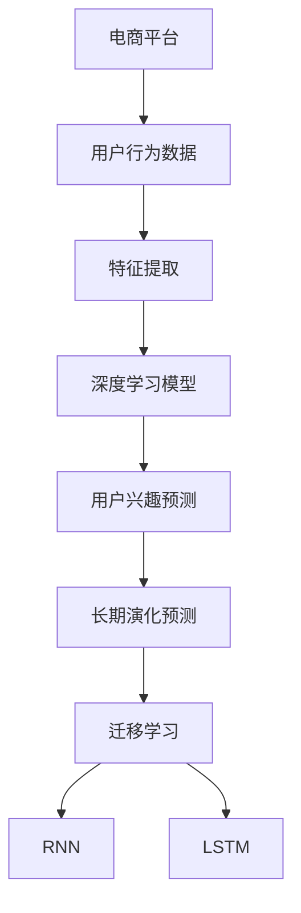

                 

# 大模型技术在电商平台用户兴趣长期演化预测中的应用

> 关键词：电商平台,用户行为分析,长期演化预测,深度学习,自然语言处理,大模型,迁移学习,循环神经网络(RNN),长短期记忆网络(LSTM)

## 1. 背景介绍

### 1.1 问题由来
随着电商行业的迅猛发展，用户行为数据规模激增，商家和平台亟需更为精准的用户兴趣分析和预测，以优化用户体验，提升营销效率和销售额。传统的统计方法难以处理大规模数据，而传统的机器学习方法对数据的处理也存在一定的局限性。近年来，深度学习和大模型技术在大规模数据处理和模型泛化能力上的优异表现，使得其在电商平台用户兴趣预测等领域得到了广泛应用。

电商平台中的用户行为数据涉及用户在平台上的各种行为记录，包括但不限于浏览、点击、搜索、购买、评论等。这些行为数据通常以日志的形式存储，格式多样，数据量大，难以直接使用传统机器学习方法进行建模和分析。

用户兴趣预测是指通过分析用户的历史行为数据，预测其未来的行为趋势，包括对商品的购买意愿、兴趣偏好等进行预测。准确的预测不仅能帮助商家精准定位用户需求，制定有针对性的促销策略，还能提升用户的购物体验，增加平台粘性，带来更高的转化率和复购率。

### 1.2 问题核心关键点
- **电商平台用户行为数据特征提取**：如何从海量的电商平台日志数据中，提取对用户行为预测有用的特征，是模型性能提升的关键。
- **深度学习模型选择**：深度学习模型在大规模数据处理和建模上的优势，使其成为电商平台用户兴趣预测的首选方法。
- **迁移学习与大模型微调**：如何在大规模预训练模型上，通过迁移学习实现对电商平台用户行为的预测，是模型泛化能力提升的关键。
- **长期演化预测**：电商平台用户兴趣的演化具有时间序列的特征，如何预测用户在长期演化过程中的兴趣变化，是长期演化预测的难点。

## 2. 核心概念与联系

### 2.1 核心概念概述

为更好地理解电商平台用户兴趣长期演化预测的应用，本节将介绍几个密切相关的核心概念：

- **电商平台**：即在线购物平台，通过互联网提供商品信息展示、用户互动、交易等功能，涵盖从用户注册、浏览商品、加入购物车、支付、收货到售后服务等全流程。
- **用户行为**：用户在电商平台上的各种活动记录，包括但不限于浏览、点击、搜索、购买、评价、收藏等。
- **用户兴趣预测**：通过对用户历史行为数据的分析，预测其未来的行为趋势，包括购买意愿、兴趣偏好等。
- **长期演化预测**：关注用户在较长时间段内兴趣和行为的动态变化，预测其长期兴趣演化路径。
- **深度学习**：基于神经网络的深度学习模型在处理非线性、高维数据上的优势，使其成为电商平台用户兴趣预测的重要工具。
- **自然语言处理(NLP)**：通过将用户的文本评论、商品描述等文本数据转化为可处理的向量形式，增强模型的语义理解能力。
- **迁移学习**：利用大规模预训练模型在特定领域的迁移学习能力，通过微调实现对电商平台用户兴趣预测的优化。
- **循环神经网络(RNN)**：适用于处理时间序列数据的神经网络，通过记忆和遗忘机制捕捉用户兴趣随时间变化的规律。
- **长短期记忆网络(LSTM)**：RNN的改进版本，能够有效处理长序列数据，避免梯度消失问题，适用于长期演化预测。

这些核心概念之间的逻辑关系可以通过以下Mermaid流程图来展示：



这个流程图展示了电商平台用户行为数据处理的基本流程：

1. 收集电商平台用户行为数据。
2. 对数据进行特征提取，转换为模型可接受的格式。
3. 使用深度学习模型进行用户兴趣预测。
4. 结合迁移学习和大模型微调技术，优化模型性能。
5. 使用RNN或LSTM进行长期演化预测，捕捉用户兴趣随时间的动态变化。

## 3. 核心算法原理 & 具体操作步骤
### 3.1 算法原理概述

电商平台用户兴趣长期演化预测的核心算法原理基于深度学习模型和自然语言处理技术。具体流程如下：

1. **数据预处理**：将用户行为数据转换为模型可接受的格式，包括文本特征向量化、时间序列特征提取等。
2. **深度学习模型选择**：选择适当的深度学习模型，如循环神经网络(RNN)、长短期记忆网络(LSTM)等，进行用户兴趣预测。
3. **迁移学习与大模型微调**：在大规模预训练模型上，通过微调实现对电商平台用户兴趣预测的优化。
4. **长期演化预测**：使用RNN或LSTM，对用户兴趣的长期演化进行建模和预测。

### 3.2 算法步骤详解

**Step 1: 数据预处理**
- 收集电商平台用户行为数据，包括但不限于浏览记录、点击记录、购买记录、评价记录等。
- 对文本评论进行预处理，去除停用词、标点符号等，转换为小写，并使用NLP技术将其转换为向量表示。
- 对时间序列数据进行归一化处理，如分钟级的时间戳数据转化为连续的数值序列。

**Step 2: 模型选择与搭建**
- 选择合适的深度学习模型，如RNN、LSTM等。
- 使用Keras或TensorFlow等框架搭建深度学习模型，设置合适的超参数。
- 引入预训练的深度学习模型，如BERT、GPT等，作为模型的初始化权重。

**Step 3: 迁移学习与大模型微调**
- 在预训练模型的基础上，选择适当任务的目标函数，如交叉熵损失函数。
- 将电商平台用户行为数据作为训练集，对模型进行微调。
- 设置合适的学习率、批大小等参数，优化模型在用户兴趣预测任务上的性能。

**Step 4: 长期演化预测**
- 对用户兴趣的长期演化进行建模，如使用LSTM捕捉用户的长期兴趣变化趋势。
- 在模型训练过程中，引入时间序列数据作为输入，输出用户未来的兴趣预测。
- 对长期演化预测模型进行评估，如使用均方误差(MSE)等指标衡量模型的预测精度。

### 3.3 算法优缺点

电商平台用户兴趣长期演化预测的算法具有以下优点：
1. 能够充分利用电商平台用户行为数据，捕捉用户的长期兴趣变化。
2. 通过迁移学习和大模型微调技术，快速提升模型性能。
3. 深度学习模型在大规模数据处理上的优势，使其能够处理复杂的用户兴趣预测问题。

同时，该算法也存在一些局限性：
1. 数据质量对模型性能影响较大，电商平台用户行为数据存在噪声和缺失。
2. 模型复杂度高，训练和推理过程耗时较长。
3. 对模型的超参数和初始化权重敏感，需要经验丰富的技术人员进行调试。

### 3.4 算法应用领域

电商平台用户兴趣长期演化预测的应用领域非常广泛，包括但不限于：

- **个性化推荐**：基于用户历史行为数据，预测其未来的购买意愿和兴趣偏好，推荐个性化的商品。
- **广告投放优化**：通过预测用户的长期兴趣变化，优化广告投放策略，提升广告效果和投资回报率。
- **库存管理**：预测用户对某商品的需求趋势，优化库存量，减少积压和缺货。
- **客户流失预测**：识别可能流失的用户，提前采取挽留措施，降低客户流失率。
- **用户行为分析**：深入分析用户在电商平台上的行为模式，为平台的优化和改进提供数据支持。

## 4. 数学模型和公式 & 详细讲解 & 举例说明

### 4.1 数学模型构建

电商平台用户兴趣长期演化预测的数学模型构建基于深度学习框架，通常使用循环神经网络(RNN)或长短期记忆网络(LSTM)进行建模。

以LSTM模型为例，其数学模型如下：

$$
LSTM(t) = \sigma(W_{f} \cdot [h_{t-1}, x_t] + b_f) \cdot \tanh(W_{c} \cdot [h_{t-1}, x_t] + b_c)
$$

其中，$LSTM(t)$ 表示在时间步 $t$ 的LSTM模型输出；$h_{t-1}$ 表示在时间步 $t-1$ 的模型隐藏状态；$x_t$ 表示在时间步 $t$ 的输入数据；$\sigma$ 表示sigmoid函数；$tanh$ 表示双曲正切函数；$W$ 和 $b$ 表示模型参数。

### 4.2 公式推导过程

LSTM模型的核心在于其记忆和遗忘机制，允许模型在处理长序列数据时，有效地捕捉用户兴趣随时间变化的规律。LSTM的记忆单元(Cell State) 是模型中最重要的组件，其更新规则如下：

$$
i_t = \sigma(W_{i} \cdot [h_{t-1}, x_t] + b_i)
$$

$$
f_t = \sigma(W_{f} \cdot [h_{t-1}, x_t] + b_f)
$$

$$
o_t = \sigma(W_{o} \cdot [h_{t-1}, x_t] + b_o)
$$

$$
g_t = \tanh(W_{g} \cdot [h_{t-1}, x_t] + b_g)
$$

$$
c_t = f_t \cdot c_{t-1} + i_t \cdot g_t
$$

$$
h_t = o_t \cdot \tanh(c_t)
$$

其中，$i_t$ 表示输入门，控制新信息的输入；$f_t$ 表示遗忘门，控制旧信息的遗忘；$o_t$ 表示输出门，控制输出的抑制；$g_t$ 表示候选状态，用于更新记忆单元；$c_t$ 表示当前记忆状态，用于存储信息；$h_t$ 表示当前隐藏状态，用于输出。

通过上述公式，LSTM模型可以动态地调整记忆单元的更新，使得模型能够有效处理长期演化预测任务。

### 4.3 案例分析与讲解

以电商平台用户购买意愿预测为例，假设电商平台收集了用户的浏览、点击、购买等行为数据。我们可以将用户行为数据转换为向量形式，输入到LSTM模型中，模型通过记忆和遗忘机制，捕捉用户兴趣随时间的变化趋势。

设用户在某商品上的浏览记录为 $x_1, x_2, ..., x_T$，对应的预测结果为 $y_1, y_2, ..., y_T$。模型在每个时间步 $t$ 上的预测结果 $y_t$ 可以通过以下公式计算：

$$
y_t = \sigma(W_{y} \cdot [h_{t}, x_t] + b_y)
$$

其中，$W_y$ 和 $b_y$ 表示模型参数。

最终，可以通过均方误差(MSE)等指标评估模型的预测精度，并根据评估结果调整模型超参数，进一步优化模型性能。

## 5. 项目实践：代码实例和详细解释说明
### 5.1 开发环境搭建

在进行电商平台用户兴趣长期演化预测项目实践前，我们需要准备好开发环境。以下是使用Python进行Keras实现LSTM模型的环境配置流程：

1. 安装Anaconda：从官网下载并安装Anaconda，用于创建独立的Python环境。

2. 创建并激活虚拟环境：
```bash
conda create -n lstm-env python=3.8 
conda activate lstm-env
```

3. 安装必要的库：
```bash
conda install keras tensorflow numpy pandas sklearn
```

4. 安装TensorFlow和Keras：
```bash
pip install tensorflow==2.3 keras==2.4.3
```

完成上述步骤后，即可在`lstm-env`环境中开始项目实践。

### 5.2 源代码详细实现

这里我们以电商平台用户购买意愿预测为例，给出使用Keras实现LSTM模型的Python代码实现。

首先，定义模型和数据预处理函数：

```python
from tensorflow.keras.models import Sequential
from tensorflow.keras.layers import LSTM, Dense, Embedding, Bidirectional
from tensorflow.keras.preprocessing import sequence
import pandas as pd
import numpy as np

# 定义LSTM模型
def create_lstm_model(input_dim, output_dim, hidden_units, epochs=100, batch_size=128):
    model = Sequential()
    model.add(Embedding(input_dim=input_dim, output_dim=hidden_units, input_length=max_seq_length))
    model.add(Bidirectional(LSTM(units=hidden_units)))
    model.add(Dense(units=output_dim, activation='sigmoid'))
    model.compile(optimizer='adam', loss='binary_crossentropy', metrics=['accuracy'])
    return model

# 加载数据并预处理
def load_and_preprocess_data():
    # 读取数据
    data = pd.read_csv('user_browsing.csv')
    # 数据清洗
    data = data[data['interest'].notna()]
    # 特征工程
    data['feature'] = data['browsing'].apply(lambda x: x.split(','))
    data['feature'] = data['feature'].apply(lambda x: [int(f) for f in x])
    # 数据标准化
    data['feature'] = data['feature'].apply(lambda x: sequence.pad_sequences(x, maxlen=max_seq_length))
    # 构建输入输出
    X = data['feature']
    y = data['interest']
    return X, y
```

然后，定义模型的训练和评估函数：

```python
from tensorflow.keras.utils import to_categorical
from sklearn.metrics import accuracy_score

# 模型训练
def train_lstm_model(model, X, y, batch_size=128, epochs=100):
    model.fit(X, y, batch_size=batch_size, epochs=epochs, verbose=2)
    return model

# 模型评估
def evaluate_lstm_model(model, X, y):
    y_pred = model.predict(X)
    y_pred = np.where(y_pred > 0.5, 1, 0)
    accuracy = accuracy_score(y, y_pred)
    return accuracy
```

最后，启动模型训练和评估流程：

```python
# 模型参数
input_dim = 100
output_dim = 1
hidden_units = 128
max_seq_length = 100

# 数据加载和预处理
X, y = load_and_preprocess_data()

# 模型构建和训练
model = create_lstm_model(input_dim=input_dim, output_dim=output_dim, hidden_units=hidden_units)
model = train_lstm_model(model, X, y)

# 模型评估
accuracy = evaluate_lstm_model(model, X, y)
print(f"模型准确度: {accuracy}")
```

以上就是使用Keras实现LSTM模型进行电商平台用户购买意愿预测的完整代码实现。可以看到，Keras的简单易用性使得模型搭建和训练过程非常简单。

### 5.3 代码解读与分析

让我们再详细解读一下关键代码的实现细节：

**create_lstm_model函数**：
- 定义了LSTM模型，包括输入层、双向LSTM层和输出层。
- 使用`Embedding`层将用户浏览记录转换为向量形式，`Bidirectional`层用于双向处理，`Dense`层输出购买意愿的预测结果。
- 使用`compile`方法设置模型的优化器和损失函数，用于模型训练。

**load_and_preprocess_data函数**：
- 读取并处理用户行为数据，包括数据清洗、特征提取和标准化。
- 使用`apply`函数将浏览记录转换为向量形式，使用`pad_sequences`函数进行定长填充。

**train_lstm_model函数**：
- 调用`fit`方法进行模型训练，设置批大小和迭代轮数。

**evaluate_lstm_model函数**：
- 使用模型进行预测，将预测结果转换为二分类形式。
- 计算预测结果和真实标签的准确度，使用`accuracy_score`函数评估模型性能。

## 6. 实际应用场景
### 6.1 智能推荐系统

电商平台用户兴趣长期演化预测在智能推荐系统中有着广泛应用。通过分析用户的历史行为数据，预测其未来的购买意愿和兴趣偏好，推荐个性化的商品。

在技术实现上，可以构建基于LSTM的推荐模型，将用户的浏览记录作为输入，预测其未来的购买意愿，并在推荐系统中实时更新推荐内容。通过持续优化推荐模型，不断提升用户的购物体验和满意度，增加平台的转化率和复购率。

### 6.2 用户流失预测

电商平台用户流失是电商企业面临的重要问题，通过预测用户流失风险，商家可以提前采取挽留措施，减少用户流失率，增加平台粘性。

在技术实现上，可以构建基于LSTM的流失预测模型，将用户的历史行为数据作为输入，预测其未来的流失概率。通过分析流失预测结果，商家可以制定针对性策略，如发送关怀邮件、提供优惠活动等，提高用户的忠诚度，减少流失率。

### 6.3 库存管理

电商平台库存管理需要精确预测商品的需求趋势，避免积压和缺货现象。通过预测用户对某商品的需求变化，商家可以动态调整库存量，优化库存管理，降低运营成本。

在技术实现上，可以构建基于LSTM的需求预测模型，将用户的浏览和购买数据作为输入，预测其对某商品的需求趋势。通过实时监测库存状态，商家可以及时调整供货量，优化库存管理，提高运营效率。

### 6.4 客户服务优化

电商平台客户服务需要快速响应用户需求，提升用户体验。通过预测用户的查询意图，商家可以提前准备好相关内容，快速响应用户咨询，提升客户服务质量。

在技术实现上，可以构建基于LSTM的意图预测模型，将用户的查询语句作为输入，预测其查询意图。通过分析预测结果，商家可以提前准备好相应的回答内容，快速响应用户咨询，提升客户服务效率和满意度。

## 7. 工具和资源推荐
### 7.1 学习资源推荐

为了帮助开发者系统掌握电商平台用户兴趣长期演化预测的理论基础和实践技巧，这里推荐一些优质的学习资源：

1. **深度学习与NLP课程**：如Coursera的《深度学习专项课程》、Udacity的《深度学习纳米学位》，深入介绍深度学习和大模型的基本原理和应用。
2. **TensorFlow和Keras官方文档**：详细介绍了TensorFlow和Keras的使用方法，以及深度学习模型的搭建和训练。
3. **LSTM论文和博客**：阅读LSTM模型的经典论文《Long Short-Term Memory》及其相关博客，深入理解LSTM模型的原理和应用。
4. **Kaggle竞赛**：参加Kaggle的数据科学竞赛，如电商推荐系统竞赛，通过实战提升LSTM模型在电商平台中的实际应用能力。
5. **开源项目**：学习Github上的开源项目，如PaddlePaddle和TensorFlow等，了解深度学习模型的工程实践和优化技巧。

通过对这些资源的学习实践，相信你一定能够快速掌握电商平台用户兴趣长期演化预测的精髓，并用于解决实际的电商平台问题。

### 7.2 开发工具推荐

高效的开发离不开优秀的工具支持。以下是几款用于电商平台用户兴趣长期演化预测开发的常用工具：

1. **Jupyter Notebook**：Python的轻量级交互式开发环境，支持代码编写、数据可视化等功能，适合快速迭代开发。
2. **TensorFlow和Keras**：TensorFlow和Keras是深度学习领域的主流框架，提供了丰富的深度学习模型和优化工具，适合构建高性能模型。
3. **NLP工具库**：如NLTK、SpaCy等，提供了丰富的NLP功能，支持文本处理和语义分析。
4. **可视化工具**：如TensorBoard、Weibull++等，支持模型的训练和评估结果可视化，帮助调试模型性能。
5. **数据处理工具**：如Pandas、NumPy等，支持大规模数据处理和分析。

合理利用这些工具，可以显著提升电商平台用户兴趣长期演化预测任务的开发效率，加快创新迭代的步伐。

### 7.3 相关论文推荐

电商平台用户兴趣长期演化预测的研究源于学界的持续研究。以下是几篇奠基性的相关论文，推荐阅读：

1. **Long Short-Term Memory**：Hochreiter和Schmidhuber于1997年提出的LSTM模型，是深度学习领域的重要突破，对长序列数据处理具有重要意义。
2. **Recurrent Neural Networks for Sequences with Long-Term Dependencies**：Hochreiter和Schmidhuber于1997年提出的RNN模型，是LSTM的前身，为序列数据处理奠定了基础。
3. **Learning Phrase Representations using RNN Encoder-Decoder for Statistical Machine Translation**：Cho等人在2014年提出的基于LSTM的机器翻译模型，展示了LSTM在处理长序列数据上的优势。
4. **Effective Approaches to Attend to Long-Distance Dependencies in Neural Machine Translation**：Bahdanau等人在2014年提出的基于LSTM的注意力机制，进一步提升了长序列数据处理的性能。
5. **Deep Architectures for Large-Scale Image Recognition**：Krizhevsky等人在2012年提出的基于深度卷积神经网络(CNN)的图像识别模型，展示了深度学习在大规模数据处理上的优势。

这些论文代表了电商平台用户兴趣长期演化预测领域的研究进展，通过学习这些前沿成果，可以帮助研究者把握学科前进方向，激发更多的创新灵感。

## 8. 总结：未来发展趋势与挑战
### 8.1 总结

本文对电商平台用户兴趣长期演化预测方法进行了全面系统的介绍。首先阐述了电商平台用户行为数据特征提取、深度学习模型选择、迁移学习与大模型微调、长期演化预测等核心概念，明确了电商平台用户兴趣预测的关键要素。其次，从原理到实践，详细讲解了LSTM模型在电商平台用户兴趣预测中的构建和训练过程，给出了完整的代码实例。同时，本文还广泛探讨了LSTM模型在电商平台智能推荐、用户流失预测、库存管理、客户服务优化等多个实际应用场景中的应用前景，展示了LSTM模型的强大应用潜力。此外，本文精选了LSTM模型的各类学习资源，力求为读者提供全方位的技术指引。

通过本文的系统梳理，可以看到，基于LSTM模型的电商平台用户兴趣长期演化预测方法已经在大规模数据处理和模型泛化能力上展现了卓越的表现，成为电商平台用户兴趣预测的重要手段。未来，随着深度学习技术的不断进步，LSTM模型及其相关技术必将在电商领域得到更广泛的应用，为电商平台带来更高的用户满意度和业务价值。

### 8.2 未来发展趋势

展望未来，电商平台用户兴趣长期演化预测技术将呈现以下几个发展趋势：

1. **多模态融合**：电商平台用户行为数据不仅包括文本数据，还包括图片、音频等多模态数据。通过多模态数据的融合，提升模型对用户兴趣的综合理解能力。
2. **自监督学习**：利用自监督学习技术，从无标签数据中学习用户的兴趣特征，减少对标注数据的依赖。
3. **联邦学习**：通过联邦学习技术，在多个电商平台之间共享用户数据，提升模型的泛化能力和数据安全性。
4. **模型压缩和优化**：随着模型规模的增大，模型压缩和优化技术将越来越重要，以实现高效推理和部署。
5. **跨平台协同**：电商平台之间的协同合作，通过模型共享和联合训练，提升整体的预测能力和用户体验。

这些趋势凸显了电商平台用户兴趣长期演化预测技术的广阔前景。这些方向的探索发展，必将进一步提升电商平台的用户体验和业务价值，推动电商行业迈向智能化的新阶段。

### 8.3 面临的挑战

尽管电商平台用户兴趣长期演化预测技术已经取得了显著进展，但在迈向更高效、更精准、更智能化的应用过程中，仍面临诸多挑战：

1. **数据质量问题**：电商平台用户行为数据存在噪声和缺失，如何提高数据质量，优化数据预处理流程，是模型性能提升的关键。
2. **模型复杂度**：LSTM模型复杂度较高，训练和推理过程耗时较长，如何优化模型结构和算法，提高模型的推理速度和计算效率，是实际应用中的重要问题。
3. **超参数调优**：LSTM模型具有较多的超参数，如隐藏单元数、批大小、学习率等，如何高效地调优超参数，是模型性能提升的重要手段。
4. **跨平台协同**：不同电商平台之间的协同合作，涉及到用户隐私和数据安全问题，如何实现跨平台数据的合法共享和协同训练，是实际应用中的难点。

### 8.4 研究展望

面对电商平台用户兴趣长期演化预测所面临的挑战，未来的研究需要在以下几个方面寻求新的突破：

1. **多模态数据融合**：探索如何更好地融合电商平台的文本、图片、音频等多模态数据，提升模型的综合理解能力。
2. **自监督学习**：利用自监督学习技术，从无标签数据中学习用户的兴趣特征，减少对标注数据的依赖。
3. **模型压缩和优化**：开发更加高效的模型压缩和优化技术，以实现高效推理和部署。
4. **跨平台协同**：探索跨平台数据共享和协同训练的新方法，提高模型的泛化能力和数据安全性。
5. **联邦学习**：探索联邦学习技术在电商平台中的实际应用，提升模型的泛化能力和数据安全性。

这些研究方向的探索，必将引领电商平台用户兴趣长期演化预测技术迈向更高的台阶，为电商行业带来更高的用户满意度和业务价值。面向未来，电商平台用户兴趣长期演化预测技术还需要与其他人工智能技术进行更深入的融合，如知识表示、因果推理、强化学习等，多路径协同发力，共同推动电商行业的发展。

## 9. 附录：常见问题与解答
**Q1：电商平台用户行为数据特征提取有哪些方法？**

A: 电商平台用户行为数据特征提取可以采用多种方法，主要包括以下几种：

1. **文本特征提取**：将用户的评论、商品描述等文本数据转换为向量形式，常用的方法包括词袋模型、TF-IDF、词嵌入等。
2. **序列特征提取**：将用户行为数据转换为时间序列形式，如浏览记录、点击记录等，可以使用滑动窗口、固定窗口等方法进行特征提取。
3. **混合特征提取**：结合文本和序列特征，利用NLP和深度学习技术，提取对用户兴趣预测有用的特征。
4. **交叉特征提取**：将不同来源的用户行为数据进行交叉，提取综合特征，如将用户浏览数据与社交媒体行为数据进行结合。

这些特征提取方法需要根据具体任务和数据特点进行选择和优化。

**Q2：如何评估电商平台用户兴趣长期演化预测模型的性能？**

A: 电商平台用户兴趣长期演化预测模型的性能评估主要包括以下几个指标：

1. **准确率（Accuracy）**：模型预测结果与真实标签的匹配度，可以通过混淆矩阵等方法计算。
2. **召回率（Recall）**：模型对真实标签的覆盖率，即预测结果中真实标签的占比。
3. **F1值（F1-Score）**：准确率和召回率的调和平均数，综合评估模型的预测效果。
4. **均方误差（MSE）**：回归任务中常用的评估指标，衡量模型预测结果与真实标签的差距。
5. **ROC曲线和AUC值**：评估二分类任务的性能，ROC曲线越接近左上角，AUC值越高，表示模型性能越好。

在实际应用中，需要根据具体任务和业务需求，选择合适的评估指标，进行模型性能的评估和调优。

**Q3：电商平台用户兴趣长期演化预测的模型复杂度较高，如何降低模型的计算成本？**

A: 电商平台用户兴趣长期演化预测的模型复杂度较高，训练和推理过程耗时较长。以下是一些降低计算成本的方法：

1. **模型压缩**：使用模型压缩技术，如剪枝、量化、蒸馏等方法，减小模型规模，提高推理速度。
2. **分布式训练**：使用分布式训练技术，将模型分布在多个GPU或TPU上，并行训练，提高训练速度。
3. **模型并行**：使用模型并行技术，如TensorFlow的模型并行，将模型分解为多个部分，并行训练和推理。
4. **预训练和微调结合**：在预训练阶段，使用大规模无标签数据进行预训练，在微调阶段，仅对少量模型参数进行更新，提高微调效率。
5. **硬件优化**：使用高性能硬件设备，如TPU、FPGA等，提高计算速度和模型性能。

这些方法可以显著降低计算成本，提升模型的实际应用能力。

**Q4：如何优化电商平台用户兴趣长期演化预测模型的超参数？**

A: 电商平台用户兴趣长期演化预测模型的超参数调优是模型性能提升的重要手段。以下是一些常用的超参数优化方法：

1. **网格搜索（Grid Search）**：枚举所有可能的超参数组合，评估模型性能，选择最优的超参数组合。
2. **随机搜索（Random Search）**：随机采样超参数组合，评估模型性能，选择最优的超参数组合。
3. **贝叶斯优化（Bayesian Optimization）**：基于贝叶斯方法，通过迭代优化超参数组合，提高超参数调优效率。
4. **遗传算法（Genetic Algorithm）**：模拟自然进化过程，通过遗传操作优化超参数组合，提高超参数调优效率。
5. **自适应学习率（Adaptive Learning Rate）**：动态调整学习率，提高模型训练速度和性能。

这些超参数优化方法需要根据具体任务和数据特点进行选择和优化。

**Q5：电商平台用户兴趣长期演化预测的应用场景有哪些？**

A: 电商平台用户兴趣长期演化预测在电商行业有着广泛的应用场景，主要包括以下几个方面：

1. **个性化推荐**：根据用户历史行为数据，预测其未来的购买意愿和兴趣偏好，推荐个性化的商品。
2. **用户流失预测**：通过预测用户流失风险，提前采取挽留措施，减少用户流失率。
3. **库存管理**：预测商品的需求趋势，优化库存量，避免积压和缺货。
4. **客户服务优化**：预测用户的查询意图，提前准备好相应的回答内容，快速响应用户咨询，提升客户服务效率和满意度。
5. **广告投放优化**：通过预测用户的长期兴趣变化，优化广告投放策略，提升广告效果和投资回报率。

这些应用场景展示了电商平台用户兴趣长期演化预测的广泛应用前景。

---

作者：禅与计算机程序设计艺术 / Zen and the Art of Computer Programming

