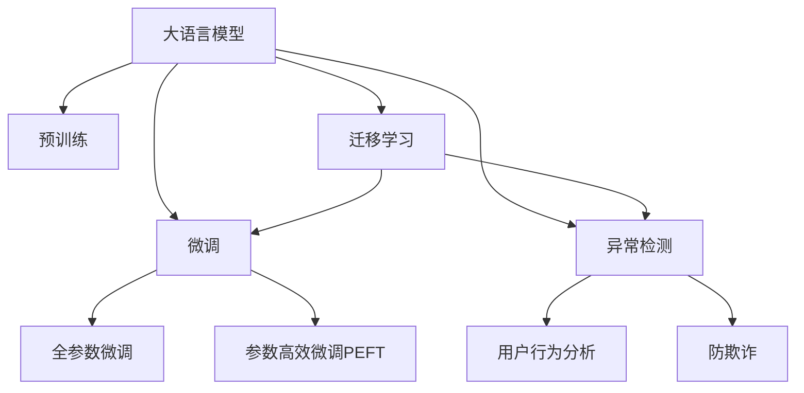

                 

# 大模型技术在电商平台用户行为异常检测与防欺诈中的应用

> 关键词：大模型技术,用户行为分析,异常检测,防欺诈,自然语言处理(NLP),深度学习,机器学习,模型部署,电商业务

## 1. 背景介绍

### 1.1 问题由来
随着电商行业的蓬勃发展，用户行为分析和异常检测在预防欺诈、提升用户体验、优化营销策略等方面发挥了重要作用。然而，传统的行为分析方法依赖于人工特征工程，不仅需要大量人力物力，而且难以捕捉数据中的复杂关系，效果受限于特征设计的水平。大模型技术，尤其是基于深度学习的大语言模型，为电商领域提供了更高效、更精准的用户行为分析和异常检测方法。

### 1.2 问题核心关键点
大模型技术在电商平台中的主要应用包括：
- 用户行为分析：通过分析用户点击、浏览、购买等行为，预测用户兴趣和需求，优化推荐系统。
- 异常检测与欺诈预防：识别出异常行为和潜在欺诈行为，及时采取措施，保障交易安全。
- 自然语言处理(NLP)：通过解析用户评论、聊天记录等文本数据，提取关键信息，用于行为分析和欺诈检测。

大模型技术在电商平台的应用，不仅大幅提高了数据分析效率，还显著提升了异常检测和欺诈预防的精度，为电商平台带来了显著的经济效益。

## 2. 核心概念与联系

### 2.1 核心概念概述

大模型技术在电商平台用户行为分析和异常检测中的应用，主要依赖于以下几个核心概念：

- 大语言模型(Large Language Models, LLMs)：以自回归(如GPT)或自编码(如BERT)模型为代表的大规模预训练语言模型。通过在大规模无标签文本语料上进行预训练，学习通用的语言表示，具备强大的语言理解和生成能力。
- 预训练(Pre-training)：指在大规模无标签文本语料上，通过自监督学习任务训练通用语言模型的过程。常见的预训练任务包括言语建模、遮挡语言模型等。
- 微调(Fine-tuning)：指在预训练模型的基础上，使用下游任务的少量标注数据，通过有监督地训练来优化模型在该任务上的性能。通常只需要调整顶层分类器或解码器，并以较小的学习率更新全部或部分的模型参数。
- 迁移学习(Transfer Learning)：指将一个领域学习到的知识，迁移应用到另一个不同但相关的领域的学习范式。大模型的预训练-微调过程即是一种典型的迁移学习方式。
- 异常检测(Anomaly Detection)：通过数据驱动的方法，识别出与正常行为模式显著不同的异常行为，用于欺诈预防、风险管理等场景。
- 自然语言处理(NLP)：涉及语言模型、文本分类、序列标注、机器翻译等技术，用于解析和理解用户行为数据中的文本信息。

这些核心概念之间的逻辑关系可以通过以下Mermaid流程图来展示：



这个流程图展示了大语言模型的核心概念及其之间的关系：

1. 大语言模型通过预训练获得基础能力。
2. 微调是对预训练模型进行任务特定的优化，可以分为全参数微调和参数高效微调（PEFT）。
3. 异常检测是一种通过识别与正常行为模式显著不同的异常行为来保障数据安全的任务。
4. 用户行为分析涉及分析用户行为数据，提取行为模式，用于优化推荐和营销策略。
5. 防欺诈是指通过异常检测和行为分析，及时识别并预防欺诈行为。
6. 迁移学习是连接预训练模型与下游任务的桥梁，可以通过微调和异常检测方法来实现。

这些概念共同构成了大模型在电商平台用户行为分析和异常检测中的应用框架，使得模型能够更好地适应电商业务场景，提升数据分析和风险管理的效率。

## 3. 核心算法原理 & 具体操作步骤
### 3.1 算法原理概述

基于深度学习的大语言模型在电商平台用户行为分析和异常检测中的应用，主要依赖于模型在特定任务上的微调和优化。该过程可以概括为以下几个关键步骤：

**Step 1: 准备预训练模型和数据集**
- 选择合适的预训练语言模型 $M_{\theta}$ 作为初始化参数，如 BERT、GPT 等。
- 准备电商平台的用户行为数据集 $D$，划分为训练集、验证集和测试集。通常要求行为数据与预训练数据的分布不要差异过大。

**Step 2: 定义任务目标**
- 根据电商平台的应用场景，选择合适的异常检测或行为分析任务。
- 设计任务目标函数，例如分类任务中常用的交叉熵损失函数。

**Step 3: 设置微调超参数**
- 选择合适的优化算法及其参数，如 AdamW、SGD 等，设置学习率、批大小、迭代轮数等。
- 设置正则化技术及强度，包括权重衰减、Dropout、Early Stopping 等。
- 确定冻结预训练参数的策略，如仅微调顶层，或全部参数都参与微调。

**Step 4: 执行梯度训练**
- 将训练集数据分批次输入模型，前向传播计算损失函数。
- 反向传播计算参数梯度，根据设定的优化算法和学习率更新模型参数。
- 周期性在验证集上评估模型性能，根据性能指标决定是否触发 Early Stopping。
- 重复上述步骤直到满足预设的迭代轮数或 Early Stopping 条件。

**Step 5: 测试和部署**
- 在测试集上评估微调后模型 $M_{\hat{\theta}}$ 的性能，对比微调前后的精度提升。
- 使用微调后的模型对新样本进行推理预测，集成到实际的应用系统中。
- 持续收集新的用户行为数据，定期重新微调模型，以适应数据分布的变化。

以上是基于深度学习的大语言模型在电商平台用户行为分析和异常检测中的微调流程。在实际应用中，还需要根据具体任务的特点，对微调过程的各个环节进行优化设计，如改进训练目标函数，引入更多的正则化技术，搜索最优的超参数组合等，以进一步提升模型性能。

### 3.2 算法步骤详解

#### 3.2.1 任务定义

在电商平台中，用户行为分析主要涉及以下几个方面：
- 用户兴趣预测：通过分析用户历史行为数据，预测用户可能感兴趣的商品或类别。
- 异常行为识别：通过异常检测技术，识别出用户行为中与正常模式显著不同的异常行为，如异常登录、频繁退货等。
- 风险评估：基于异常行为和用户历史数据，评估交易的风险等级，决定是否采取防范措施。

异常检测和行为分析可以采用多种方法，如基于规则的方法、基于统计的方法、基于机器学习的方法等。其中，基于深度学习的方法，特别是使用大语言模型进行微调，能够更全面地捕捉用户行为中的复杂关系，提高异常检测和行为分析的精度。

#### 3.2.2 数据处理与特征工程

用户行为数据通常包含多种类型的数据，包括文本数据、数字数据、时间序列数据等。在应用大模型前，需要对这些数据进行处理和特征工程：
- 文本数据处理：将文本数据进行分词、编码，转换为模型可接受的格式。
- 数字数据处理：对数字数据进行归一化、标准化等预处理，减少数据噪声。
- 时间序列数据处理：将时间序列数据转换为适合模型训练的格式，如将时间戳转换为时间差或时间序列特征。

特征工程是数据预处理的重要步骤，通过提取有用的特征，可以显著提高模型的预测准确性和泛化能力。

#### 3.2.3 模型微调

大模型微调的具体实现步骤如下：
1. **选择合适的预训练模型**：根据任务类型，选择适合的预训练模型，如BERT、GPT-2等。
2. **加载预训练模型**：使用预训练模型的权重进行初始化，加载到模型中。
3. **定义任务适配层**：根据任务类型，在预训练模型顶层设计合适的输出层和损失函数。例如，对于二分类任务，通常在顶层添加线性分类器和交叉熵损失函数。
4. **设置超参数**：选择合适的优化算法及其参数，如AdamW、SGD等，设置学习率、批大小、迭代轮数等。
5. **执行梯度训练**：将训练集数据分批次输入模型，前向传播计算损失函数。反向传播计算参数梯度，根据设定的优化算法和学习率更新模型参数。周期性在验证集上评估模型性能，根据性能指标决定是否触发Early Stopping。
6. **测试和部署**：在测试集上评估微调后模型 $M_{\hat{\theta}}$ 的性能，对比微调前后的精度提升。使用微调后的模型对新样本进行推理预测，集成到实际的应用系统中。持续收集新的用户行为数据，定期重新微调模型，以适应数据分布的变化。

### 3.3 算法优缺点

基于大语言模型的电商平台用户行为分析和异常检测方法具有以下优点：
1. **高效性**：使用深度学习模型可以自动捕捉数据中的复杂关系，提高数据分析效率。
2. **准确性**：通过微调方法，模型能够更准确地理解用户行为和需求，提升行为分析和异常检测的精度。
3. **泛化能力强**：大语言模型经过大规模预训练，具备较强的泛化能力，能够适应不同电商平台的数据分布。
4. **可扩展性**：大模型可以轻松适应新特征和新任务，通过微调即可实现新的应用需求。

同时，该方法也存在以下局限性：
1. **标注成本高**：电商平台异常检测和行为分析需要标注大量的行为数据，标注成本较高。
2. **模型复杂度高**：大语言模型参数量大，训练复杂度较高，需要高性能计算资源。
3. **解释性不足**：深度学习模型通常缺乏可解释性，难以理解模型内部的决策逻辑。
4. **隐私风险**：电商平台中的行为数据通常包含用户隐私信息，数据隐私和安全问题需要特别关注。

尽管存在这些局限性，但基于大语言模型的电商平台用户行为分析和异常检测方法仍然具有显著优势，特别是在处理大规模、复杂的数据时表现突出。

### 3.4 算法应用领域

基于大语言模型的电商平台用户行为分析和异常检测方法，已经广泛应用于以下几个领域：
1. **用户行为分析**：通过对用户行为数据进行建模，预测用户兴趣和需求，优化推荐系统，提高用户体验。
2. **异常检测与欺诈预防**：识别出异常行为和潜在欺诈行为，保障交易安全，减少欺诈损失。
3. **风险管理**：评估交易风险等级，采取相应的风险管理措施，如限制交易、报警等。
4. **个性化营销**：基于用户行为分析，进行个性化推荐和精准营销，提升转化率和用户满意度。
5. **客户服务**：通过解析用户聊天记录，提取用户需求，提供智能客服，提升服务质量。

除了上述这些经典应用场景外，大语言模型还可以用于广告投放、库存管理、物流优化等更多电商业务场景，为电商平台带来更全面的业务支持和竞争力提升。

## 4. 数学模型和公式 & 详细讲解  
### 4.1 数学模型构建

在电商平台用户行为分析和异常检测中，可以使用以下数学模型进行建模：

假设电商平台用户行为数据为 $D=\{(x_i,y_i)\}_{i=1}^N, x_i \in \mathcal{X}, y_i \in \mathcal{Y}$，其中 $x_i$ 为输入数据（如行为特征向量），$y_i$ 为输出标签（如异常行为标记）。

定义模型 $M_{\theta}$ 在输入数据 $x_i$ 上的输出为 $\hat{y}=M_{\theta}(x_i)$，其中 $\theta$ 为模型参数。在电商平台中，常用的输出为二分类（异常与否）、多分类（不同类型异常）等。

定义模型 $M_{\theta}$ 在数据集 $D$ 上的经验风险为：

$$
\mathcal{L}(\theta) = \frac{1}{N} \sum_{i=1}^N \ell(M_{\theta}(x_i),y_i)
$$

其中 $\ell$ 为损失函数，用于衡量模型预测输出与真实标签之间的差异。

模型 $M_{\theta}$ 的参数更新公式为：

$$
\theta \leftarrow \theta - \eta \nabla_{\theta}\mathcal{L}(\theta) - \eta\lambda\theta
$$

其中 $\eta$ 为学习率，$\lambda$ 为正则化系数。

### 4.2 公式推导过程

以二分类任务为例，推导交叉熵损失函数及其梯度的计算公式。

假设模型 $M_{\theta}$ 在输入 $x$ 上的输出为 $\hat{y}=M_{\theta}(x) \in [0,1]$，表示样本属于正类的概率。真实标签 $y \in \{0,1\}$。则二分类交叉熵损失函数定义为：

$$
\ell(M_{\theta}(x),y) = -[y\log \hat{y} + (1-y)\log (1-\hat{y})]
$$

将其代入经验风险公式，得：

$$
\mathcal{L}(\theta) = -\frac{1}{N}\sum_{i=1}^N [y_i\log M_{\theta}(x_i)+(1-y_i)\log(1-M_{\theta}(x_i))]
$$

根据链式法则，损失函数对参数 $\theta_k$ 的梯度为：

$$
\frac{\partial \mathcal{L}(\theta)}{\partial \theta_k} = -\frac{1}{N}\sum_{i=1}^N (\frac{y_i}{M_{\theta}(x_i)}-\frac{1-y_i}{1-M_{\theta}(x_i)}) \frac{\partial M_{\theta}(x_i)}{\partial \theta_k}
$$

其中 $\frac{\partial M_{\theta}(x_i)}{\partial \theta_k}$ 可进一步递归展开，利用自动微分技术完成计算。

在得到损失函数的梯度后，即可带入参数更新公式，完成模型的迭代优化。重复上述过程直至收敛，最终得到适应电商平台异常检测任务的最优模型参数 $\theta^*$。

### 4.3 案例分析与讲解

以电商平台中的用户异常登录检测为例，说明如何使用大语言模型进行微调和评估。

**数据准备**：收集用户登录数据，将正常登录行为标记为 1，异常登录行为标记为 0。划分为训练集、验证集和测试集。

**模型微调**：
1. 选择BERT模型作为初始化参数。
2. 在模型顶层添加线性分类器，使用二元交叉熵损失函数。
3. 设置AdamW优化器，学习率为1e-5，批大小为128。
4. 进行梯度训练，周期性在验证集上评估模型性能。
5. 当性能提升达到预设阈值时，停止训练。

**模型评估**：
1. 在测试集上评估模型性能，计算准确率、召回率、F1分数等指标。
2. 使用模型对新样本进行推理预测，检测异常登录行为。
3. 根据预测结果，决定是否采取防欺诈措施，如密码重置、封号等。

通过上述流程，可以构建一个高效、准确的电商平台用户异常登录检测系统，显著提升电商平台的安全性。

## 5. 项目实践：代码实例和详细解释说明
### 5.1 开发环境搭建

在进行电商平台用户行为分析和异常检测的微调实践前，我们需要准备好开发环境。以下是使用Python进行PyTorch开发的环境配置流程：

1. 安装Anaconda：从官网下载并安装Anaconda，用于创建独立的Python环境。

2. 创建并激活虚拟环境：
```bash
conda create -n pytorch-env python=3.8 
conda activate pytorch-env
```

3. 安装PyTorch：根据CUDA版本，从官网获取对应的安装命令。例如：
```bash
conda install pytorch torchvision torchaudio cudatoolkit=11.1 -c pytorch -c conda-forge
```

4. 安装Transformer库：
```bash
pip install transformers
```

5. 安装各类工具包：
```bash
pip install numpy pandas scikit-learn matplotlib tqdm jupyter notebook ipython
```

完成上述步骤后，即可在`pytorch-env`环境中开始微调实践。

### 5.2 源代码详细实现

下面我们以电商平台中的用户行为分析任务为例，给出使用Transformers库对BERT模型进行微调的PyTorch代码实现。

首先，定义数据处理函数：

```python
from transformers import BertTokenizer
from torch.utils.data import Dataset
import torch

class BehaviorDataset(Dataset):
    def __init__(self, data, tokenizer, max_len=128):
        self.data = data
        self.tokenizer = tokenizer
        self.max_len = max_len
        
    def __len__(self):
        return len(self.data)
    
    def __getitem__(self, item):
        example = self.data[item]
        text = example['text']
        label = example['label']
        
        encoding = self.tokenizer(text, return_tensors='pt', max_length=self.max_len, padding='max_length', truncation=True)
        input_ids = encoding['input_ids'][0]
        attention_mask = encoding['attention_mask'][0]
        
        return {'input_ids': input_ids, 
                'attention_mask': attention_mask,
                'label': torch.tensor(label, dtype=torch.long)}
```

然后，定义模型和优化器：

```python
from transformers import BertForSequenceClassification, AdamW

model = BertForSequenceClassification.from_pretrained('bert-base-cased', num_labels=2)

optimizer = AdamW(model.parameters(), lr=2e-5)
```

接着，定义训练和评估函数：

```python
from torch.utils.data import DataLoader
from tqdm import tqdm
from sklearn.metrics import classification_report

device = torch.device('cuda') if torch.cuda.is_available() else torch.device('cpu')
model.to(device)

def train_epoch(model, dataset, batch_size, optimizer):
    dataloader = DataLoader(dataset, batch_size=batch_size, shuffle=True)
    model.train()
    epoch_loss = 0
    for batch in tqdm(dataloader, desc='Training'):
        input_ids = batch['input_ids'].to(device)
        attention_mask = batch['attention_mask'].to(device)
        labels = batch['label'].to(device)
        model.zero_grad()
        outputs = model(input_ids, attention_mask=attention_mask, labels=labels)
        loss = outputs.loss
        epoch_loss += loss.item()
        loss.backward()
        optimizer.step()
    return epoch_loss / len(dataloader)

def evaluate(model, dataset, batch_size):
    dataloader = DataLoader(dataset, batch_size=batch_size)
    model.eval()
    preds, labels = [], []
    with torch.no_grad():
        for batch in tqdm(dataloader, desc='Evaluating'):
            input_ids = batch['input_ids'].to(device)
            attention_mask = batch['attention_mask'].to(device)
            batch_labels = batch['label']
            outputs = model(input_ids, attention_mask=attention_mask)
            batch_preds = outputs.logits.argmax(dim=2).to('cpu').tolist()
            batch_labels = batch_labels.to('cpu').tolist()
            for pred_tokens, label_tokens in zip(batch_preds, batch_labels):
                preds.append(pred_tokens[:len(label_tokens)])
                labels.append(label_tokens)
                
    print(classification_report(labels, preds))
```

最后，启动训练流程并在测试集上评估：

```python
epochs = 5
batch_size = 16

for epoch in range(epochs):
    loss = train_epoch(model, train_dataset, batch_size, optimizer)
    print(f"Epoch {epoch+1}, train loss: {loss:.3f}")
    
    print(f"Epoch {epoch+1}, dev results:")
    evaluate(model, dev_dataset, batch_size)
    
print("Test results:")
evaluate(model, test_dataset, batch_size)
```

以上就是使用PyTorch对BERT进行电商平台用户行为分析任务微调的完整代码实现。可以看到，得益于Transformers库的强大封装，我们可以用相对简洁的代码完成BERT模型的加载和微调。

### 5.3 代码解读与分析

让我们再详细解读一下关键代码的实现细节：

**BehaviorDataset类**：
- `__init__`方法：初始化数据、分词器等关键组件。
- `__len__`方法：返回数据集的样本数量。
- `__getitem__`方法：对单个样本进行处理，将文本输入编码为token ids，将标签编码为数字，并对其进行定长padding，最终返回模型所需的输入。

**标签与id的映射**：
- 定义了标签与数字id之间的映射关系，用于将token-wise的预测结果解码回真实的标签。

**训练和评估函数**：
- 使用PyTorch的DataLoader对数据集进行批次化加载，供模型训练和推理使用。
- 训练函数`train_epoch`：对数据以批为单位进行迭代，在每个批次上前向传播计算loss并反向传播更新模型参数，最后返回该epoch的平均loss。
- 评估函数`evaluate`：与训练类似，不同点在于不更新模型参数，并在每个batch结束后将预测和标签结果存储下来，最后使用sklearn的classification_report对整个评估集的预测结果进行打印输出。

**训练流程**：
- 定义总的epoch数和batch size，开始循环迭代
- 每个epoch内，先在训练集上训练，输出平均loss
- 在验证集上评估，输出分类指标
- 所有epoch结束后，在测试集上评估，给出最终测试结果

可以看到，PyTorch配合Transformers库使得BERT微调的代码实现变得简洁高效。开发者可以将更多精力放在数据处理、模型改进等高层逻辑上，而不必过多关注底层的实现细节。

当然，工业级的系统实现还需考虑更多因素，如模型的保存和部署、超参数的自动搜索、更灵活的任务适配层等。但核心的微调范式基本与此类似。

## 6. 实际应用场景
### 6.1 智能客服系统

基于大语言模型微调的对话技术，可以广泛应用于智能客服系统的构建。传统客服往往需要配备大量人力，高峰期响应缓慢，且一致性和专业性难以保证。而使用微调后的对话模型，可以7x24小时不间断服务，快速响应客户咨询，用自然流畅的语言解答各类常见问题。

在技术实现上，可以收集企业内部的历史客服对话记录，将问题和最佳答复构建成监督数据，在此基础上对预训练对话模型进行微调。微调后的对话模型能够自动理解用户意图，匹配最合适的答案模板进行回复。对于客户提出的新问题，还可以接入检索系统实时搜索相关内容，动态组织生成回答。如此构建的智能客服系统，能大幅提升客户咨询体验和问题解决效率。

### 6.2 金融舆情监测

金融机构需要实时监测市场舆论动向，以便及时应对负面信息传播，规避金融风险。传统的人工监测方式成本高、效率低，难以应对网络时代海量信息爆发的挑战。基于大语言模型微调的文本分类和情感分析技术，为金融舆情监测提供了新的解决方案。

具体而言，可以收集金融领域相关的新闻、报道、评论等文本数据，并对其进行主题标注和情感标注。在此基础上对预训练语言模型进行微调，使其能够自动判断文本属于何种主题，情感倾向是正面、中性还是负面。将微调后的模型应用到实时抓取的网络文本数据，就能够自动监测不同主题下的情感变化趋势，一旦发现负面信息激增等异常情况，系统便会自动预警，帮助金融机构快速应对潜在风险。

### 6.3 个性化推荐系统

当前的推荐系统往往只依赖用户的历史行为数据进行物品推荐，无法深入理解用户的真实兴趣偏好。基于大语言模型微调技术，个性化推荐系统可以更好地挖掘用户行为背后的语义信息，从而提供更精准、多样的推荐内容。

在实践中，可以收集用户浏览、点击、评论、分享等行为数据，提取和用户交互的物品标题、描述、标签等文本内容。将文本内容作为模型输入，用户的后续行为（如是否点击、购买等）作为监督信号，在此基础上微调预训练语言模型。微调后的模型能够从文本内容中准确把握用户的兴趣点。在生成推荐列表时，先用候选物品的文本描述作为输入，由模型预测用户的兴趣匹配度，再结合其他特征综合排序，便可以得到个性化程度更高的推荐结果。

### 6.4 未来应用展望

随着大语言模型微调技术的发展，其在电商平台中的应用将不断拓展，为电商业务带来更深刻的变革。

在智慧物流领域，基于大语言模型的推荐系统可以优化物流仓储、配送路径，提高物流效率和降低成本。在智能营销领域，通过解析用户评论和反馈，进行情感分析，指导营销策略的优化和调整。

此外，在社交媒体、旅游、教育等多个领域，大语言模型微调技术也将得到广泛应用，为各行业带来更智能、更高效的服务体验。相信随着技术的日益成熟，大语言模型微调技术将进一步推动电商行业和其他各行各业的数字化转型，提升用户体验和业务效率。

## 7. 工具和资源推荐
### 7.1 学习资源推荐

为了帮助开发者系统掌握大语言模型微调的理论基础和实践技巧，这里推荐一些优质的学习资源：

1. 《Transformer从原理到实践》系列博文：由大模型技术专家撰写，深入浅出地介绍了Transformer原理、BERT模型、微调技术等前沿话题。

2. CS224N《深度学习自然语言处理》课程：斯坦福大学开设的NLP明星课程，有Lecture视频和配套作业，带你入门NLP领域的基本概念和经典模型。

3. 《Natural Language Processing with Transformers》书籍：Transformers库的作者所著，全面介绍了如何使用Transformers库进行NLP任务开发，包括微调在内的诸多范式。

4. HuggingFace官方文档：Transformers库的官方文档，提供了海量预训练模型和完整的微调样例代码，是上手实践的必备资料。

5. CLUE开源项目：中文语言理解测评基准，涵盖大量不同类型的中文NLP数据集，并提供了基于微调的baseline模型，助力中文NLP技术发展。

通过对这些资源的学习实践，相信你一定能够快速掌握大语言模型微调的精髓，并用于解决实际的NLP问题。
###  7.2 开发工具推荐

高效的开发离不开优秀的工具支持。以下是几款用于大语言模型微调开发的常用工具：

1. PyTorch：基于Python的开源深度学习框架，灵活动态的计算图，适合快速迭代研究。大部分预训练语言模型都有PyTorch版本的实现。

2. TensorFlow：由Google主导开发的开源深度学习框架，生产部署方便，适合大规模工程应用。同样有丰富的预训练语言模型资源。

3. Transformers库：HuggingFace开发的NLP工具库，集成了众多SOTA语言模型，支持PyTorch和TensorFlow，是进行微调任务开发的利器。

4. Weights & Biases：模型训练的实验跟踪工具，可以记录和可视化模型训练过程中的各项指标，方便对比和调优。与主流深度学习框架无缝集成。

5. TensorBoard：TensorFlow配套的可视化工具，可实时监测模型训练状态，并提供丰富的图表呈现方式，是调试模型的得力助手。

6. Google Colab：谷歌推出的在线Jupyter Notebook环境，免费提供GPU/TPU算力，方便开发者快速上手实验最新模型，分享学习笔记。

合理利用这些工具，可以显著提升大语言模型微调任务的开发效率，加快创新迭代的步伐。

### 7.3 相关论文推荐

大语言模型和微调技术的发展源于学界的持续研究。以下是几篇奠基性的相关论文，推荐阅读：

1. Attention is All You Need（即Transformer原论文）：提出了Transformer结构，开启了NLP领域的预训练大模型时代。

2. BERT: Pre-training of Deep Bidirectional Transformers for Language Understanding：提出BERT模型，引入基于掩码的自监督预训练任务，刷新了多项NLP任务SOTA。

3. Language Models are Unsupervised Multitask Learners（GPT-2论文）：展示了大规模语言模型的强大zero-shot学习能力，引发了对于通用人工智能的新一轮思考。

4. Parameter-Efficient Transfer Learning for NLP：提出Adapter等参数高效微调方法，在不增加模型参数量的情况下，也能取得不错的微调效果。

5. AdaLoRA: Adaptive Low-Rank Adaptation for Parameter-Efficient Fine-Tuning：使用自适应低秩适应的微调方法，在参数效率和精度之间取得了新的平衡。

这些论文代表了大语言模型微调技术的发展脉络。通过学习这些前沿成果，可以帮助研究者把握学科前进方向，激发更多的创新灵感。

## 8. 总结：未来发展趋势与挑战

### 8.1 总结

本文对基于深度学习的大语言模型在电商平台用户行为分析和异常检测中的应用进行了全面系统的介绍。首先阐述了大语言模型和微调技术的研究背景和意义，明确了微调在拓展预训练模型应用、提升异常检测和行为分析精度方面的独特价值。其次，从原理到实践，详细讲解了基于深度学习的大语言模型在电商平台中的微调流程，给出了微调任务开发的完整代码实例。同时，本文还广泛探讨了大语言模型在电商平台中的应用场景，展示了微调范式的巨大潜力。

通过本文的系统梳理，可以看到，基于深度学习的大语言模型在电商平台用户行为分析和异常检测中，不仅大幅提高了数据分析效率，还显著提升了异常检测和行为分析的精度，为电商平台带来了显著的经济效益。未来，伴随大语言模型微调技术的不断演进，其在电商领域的应用将更加广泛和深入，推动电商平台迈向智能化、个性化、安全化的发展方向。

### 8.2 未来发展趋势

展望未来，大语言模型微调技术在电商平台中的应用将呈现以下几个发展趋势：

1. **多模态融合**：电商平台中的用户行为数据往往包含多种模态信息，如图像、视频、语音等。未来的大语言模型微调技术将更注重多模态数据的融合，构建更全面、准确的行为分析模型。

2. **实时性增强**：电商平台对实时性的要求较高，基于深度学习的大语言模型微调技术需要优化推理速度，实现实时化的行为分析和异常检测。

3. **联邦学习**：电商平台中的用户数据通常涉及隐私保护，联邦学习技术可以在不暴露用户隐私的前提下，进行模型微调和更新。

4. **无监督学习**：电商平台中的行为数据通常是非结构化文本数据，可以通过无监督学习方法，从海量数据中提取有用的特征，提高模型的泛化能力。

5. **自适应微调**：电商平台中的行为数据分布可能随着时间和环境变化而变化，未来的模型需要具备自适应能力，能够快速适应新的数据分布。

6. **跨领域迁移**：大语言模型微调技术将在更多电商业务场景中得到应用，如社交电商、智能家居等，推动电商行业的多元化发展。

以上趋势凸显了大语言模型微调技术在电商平台中的应用前景。这些方向的探索发展，必将进一步提升电商平台的智能化水平，为用户提供更优质的购物体验。

### 8.3 面临的挑战

尽管大语言模型微调技术在电商平台中的应用已经取得了显著成效，但在迈向更加智能化、普适化应用的过程中，仍面临诸多挑战：

1. **数据隐私**：电商平台中的用户数据涉及隐私保护，如何在保障数据隐私的前提下，进行有效行为分析和异常检测，是一个重要课题。

2. **计算资源**：深度学习模型通常需要大量计算资源，如何高效利用计算资源，降低训练和推理成本，是实现大规模应用的关键。

3. **模型鲁棒性**：电商平台中的行为数据分布可能存在显著差异，如何提升模型的鲁棒性，减少模型在不同环境下的过拟合和泛化能力不足问题，是模型应用中的重要挑战。

4. **可解释性**：深度学习模型的决策过程通常缺乏可解释性，难以理解模型的内部工作机制，特别是在用户行为分析中，模型的可解释性尤为重要。

5. **实时性**：电商平台对实时性要求较高，如何优化推理速度，实现实时化的行为分析和异常检测，是大语言模型微调技术在实际应用中的重要挑战。

6. **自动化**：如何构建自动化的模型维护和管理系统，减少人工干预，提高模型的稳定性和可靠性，是电商平台中模型应用的重要需求。

正视大语言模型微调面临的这些挑战，积极应对并寻求突破，将是大语言模型微调走向成熟的必由之路。相信随着学界和产业界的共同努力，这些挑战终将一一被克服，大语言模型微调技术将在电商领域发挥更大的作用。

### 8.4 研究展望

面对大语言模型微调技术所面临的种种挑战，未来的研究需要在以下几个方面寻求新的突破：

1. **联邦学习和隐私保护**：利用联邦学习技术，在不暴露用户隐私的前提下，进行模型微调和更新。

2. **无监督和半监督学习**：探索无监督和半监督学习范式，从海量非结构化数据中提取有用的特征，提高模型的泛化能力。

3. **跨领域迁移学习**：研究如何在大语言模型中进行跨领域迁移，适应不同电商业务场景的需求。

4. **自适应微调**：开发自适应微调算法，使模型能够快速适应数据分布的变化。

5. **模型压缩和优化**：研究如何优化模型结构和参数，提高模型的推理速度和资源效率。

6. **可解释性增强**：通过引入可解释性方法，提高模型的可解释性，增强用户信任和透明度。

7. **多模态融合**：研究如何将多模态数据融合到模型中，提升模型的综合分析和推理能力。

这些研究方向将引领大语言模型微调技术迈向更高的台阶，为电商平台的智能化发展提供更强大的技术支持。面向未来，大语言模型微调技术还需要与其他人工智能技术进行更深入的融合，如知识表示、因果推理、强化学习等，多路径协同发力，共同推动电商平台的技术进步和业务创新。

## 9. 附录：常见问题与解答

**Q1：电商平台中的用户行为分析如何实现？**

A: 电商平台中的用户行为分析可以通过以下步骤实现：
1. 收集用户行为数据，包括点击、浏览、购买、评价等行为数据。
2. 对数据进行预处理，包括文本编码、数据归一化、特征提取等。
3. 选择适合的深度学习模型，如BERT、GPT等，对其进行微调，使其能够学习用户行为的模式和趋势。
4. 根据微调后的模型，对用户行为进行预测和分析，如预测用户可能感兴趣的商品、识别异常行为等。

**Q2：电商平台中的异常检测如何实现？**

A: 电商平台中的异常检测可以通过以下步骤实现：
1. 收集用户行为数据，包括点击、浏览、购买、评价等行为数据。
2. 对数据进行预处理，包括文本编码、数据归一化、特征提取等。
3. 选择适合的深度学习模型，如BERT、GPT等，对其进行微调，使其能够识别出异常行为。
4. 根据微调后的模型，对用户行为进行异常检测，如识别出异常登录、频繁退货等行为。
5. 根据异常检测结果，采取相应的措施，如密码重置、封号等，保障交易安全。

**Q3：电商平台中的用户行为分析如何利用多模态数据？**

A: 电商平台中的用户行为分析可以利用多模态数据，如文本、图像、视频等，进行综合分析。具体实现步骤如下：
1. 收集多种类型的数据，包括文本、图像、视频等。
2. 对数据进行预处理，包括文本编码、图像裁剪、视频分割等。
3. 选择适合的深度学习模型，如BERT、ResNet、Inception等，对其进行多模态融合，构建综合分析模型。
4. 根据多模态融合的模型，对用户行为进行综合分析，如识别出用户的兴趣偏好、预测商品销售趋势等。

通过多模态融合，可以构建更加全面、准确的用户行为分析模型，提升电商平台的智能化水平。

**Q4：电商平台中的异常检测如何利用联邦学习技术？**

A: 电商平台中的异常检测可以利用联邦学习技术，在不暴露用户隐私的前提下，进行模型微调和更新。具体实现步骤如下：
1. 收集不同电商平台的异常检测数据，进行预处理和特征提取。
2. 选择适合的深度学习模型，如BERT、GPT等，对其进行微调。
3. 利用联邦学习技术，在每个电商平台中分别训练模型，并上传模型参数到中心服务器进行聚合。
4. 根据聚合后的模型参数，进行异常检测，如识别出异常登录、频繁退货等行为。
5. 根据异常检测结果，采取相应的措施，如密码重置、封号等，保障交易安全。

通过联邦学习技术，可以在保护用户隐私的前提下，实现跨平台的用户行为分析和异常检测，提升电商平台的整体安全性。

**Q5：电商平台中的用户行为分析如何实现实时性？**

A: 电商平台中的用户行为分析可以通过以下步骤实现实时性：
1. 收集用户实时行为数据，包括点击、浏览、购买、评价等行为数据。
2. 对数据进行实时预处理，包括文本编码、数据归一化、特征提取等。
3. 选择适合的深度学习模型，如BERT、GPT等，对其进行实时微调。
4. 根据实时微调的模型，对用户行为进行实时分析，如预测用户可能感兴趣的商品、识别异常行为等。

通过实时性增强，可以提升电商平台的智能化水平，为用户提供更优质的购物体验。

---

作者：禅与计算机程序设计艺术 / Zen and the Art of Computer Programming

