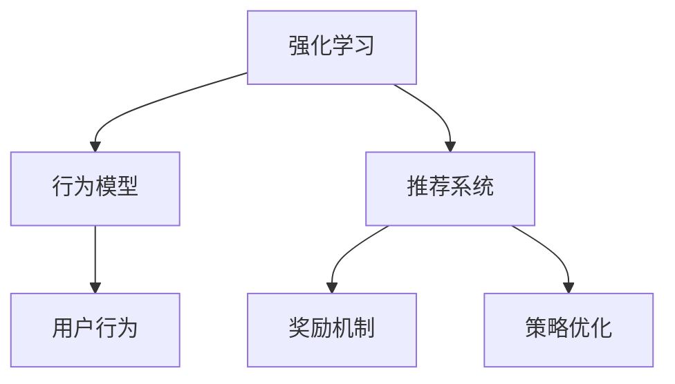

                 

# 大模型推荐中的强化学习方法

> 关键词：强化学习,推荐系统,大模型,行为建模,交互式推荐,动态更新,评估指标,深度学习

## 1. 背景介绍

推荐系统（Recommender Systems）作为互联网时代的重要技术，广泛应用于电商、社交、视频等多个领域，为用户定制个性化的内容，提升用户满意度和留存率。传统的推荐方法主要依赖于协同过滤和矩阵分解等方法，通过计算用户与物品之间的相似度，从而实现推荐。然而，这些方法在用户行为稀疏和数据维度高的情况下，效果受限。

近年来，随着深度学习和大模型技术的兴起，推荐系统开始采用基于深度学习的推荐方法。其中，强化学习（Reinforcement Learning, RL）方法，通过在用户与物品的交互过程中，不断优化推荐策略，最大化用户满意度。强化学习通过构建行为模型（Behavior Model），模拟用户对物品的评分、点击等交互行为，并通过奖励机制（Reward Mechanism）和策略优化（Policy Optimization），实现推荐策略的动态更新。

本文将详细介绍强化学习在大模型推荐系统中的应用，从原理到实现，通过丰富的案例分析，带你深入理解这一前沿技术。

## 2. 核心概念与联系

### 2.1 核心概念概述

要理解强化学习在大模型推荐系统中的应用，首先需要掌握以下核心概念：

- **强化学习**：一种通过奖励和惩罚机制，不断优化策略的学习方法。通过交互过程，学习最优策略以最大化累积奖励。
- **推荐系统**：基于用户行为数据和物品特征，预测用户对物品的偏好，推荐用户可能感兴趣的内容。
- **行为模型**：对用户交互行为的建模，通常通过深度神经网络实现。
- **奖励机制**：定义推荐策略的好坏，常用指标如点击率、转化率、平均评分等。
- **策略优化**：通过优化推荐策略，提升用户满意度。常用算法如Q-learning、Policy Gradient等。

以上概念之间的逻辑关系可以通过以下Mermaid流程图来展示：



这个流程图展示了一系列核心概念之间的关系：

1. 强化学习通过行为模型和奖励机制来指导推荐系统的策略优化。
2. 行为模型对用户行为进行建模，提供推荐策略的输入。
3. 奖励机制定义了推荐的评价指标，通过评估策略的奖励反馈更新策略。
4. 策略优化通过不断更新推荐策略，提升用户满意度。

这些概念共同构成了强化学习在大模型推荐系统中的应用框架，使得通过深度学习和大模型技术，实现更智能、个性化的推荐。

## 3. 核心算法原理 & 具体操作步骤
### 3.1 算法原理概述

强化学习在大模型推荐系统中的应用，主要是通过构建行为模型和奖励机制，学习最优推荐策略。其核心思想是通过用户与物品的交互数据，不断优化推荐策略，最大化用户满意度。

具体而言，强化学习在推荐系统中的流程如下：

1. **行为建模**：将用户与物品的交互行为进行建模，通过深度神经网络，将用户特征和物品特征映射为行为向量。
2. **策略设计**：设计推荐策略，如选择哪些物品进行展示、推荐顺序等。
3. **策略评估**：通过奖励机制，评估推荐策略的好坏，获取用户的反馈。
4. **策略优化**：基于策略评估的结果，采用如Q-learning、Policy Gradient等算法，优化推荐策略。

### 3.2 算法步骤详解

以下是强化学习在大模型推荐系统中的具体步骤：

**Step 1: 数据收集与预处理**

1. 收集用户与物品的交互数据，如点击、浏览、评分等行为数据。
2. 数据预处理，包括去噪、归一化、缺失值处理等。

**Step 2: 行为建模**

1. 构建行为模型，通常使用深度神经网络，将用户特征和物品特征映射为行为向量。
2. 对行为向量进行归一化处理，如取最大值、取均值等，使得行为向量符合推荐策略的要求。

**Step 3: 策略设计**

1. 设计推荐策略，如选择哪些物品进行展示、推荐顺序等。
2. 将推荐策略转化为具体的推荐动作，如展示推荐列表、展示单一物品等。

**Step 4: 策略评估**

1. 定义奖励机制，如点击率、转化率、平均评分等。
2. 将奖励机制应用于用户行为数据，计算推荐策略的累积奖励。

**Step 5: 策略优化**

1. 基于策略评估的结果，选择优化算法，如Q-learning、Policy Gradient等。
2. 在行为模型和奖励机制的指导下，不断更新推荐策略，提升用户满意度。

### 3.3 算法优缺点

强化学习在大模型推荐系统中的应用，具有以下优点：

1. 自适应性强：通过动态调整推荐策略，适应不同用户和物品的变化。
2. 性能提升显著：在大模型和深度学习的基础上，可以显著提升推荐效果。
3. 泛化能力强：通过学习用户行为，可以更好地推广到新的用户和物品。

同时，该方法也存在一些缺点：

1. 数据需求高：需要大量用户与物品的交互数据，才能训练出高质量的行为模型。
2. 计算复杂度高：在深度神经网络和大模型上运行，计算资源需求较大。
3. 策略更新慢：策略优化过程需要时间，短期内可能影响推荐效果。

### 3.4 算法应用领域

强化学习在大模型推荐系统中的应用，主要集中在以下几个领域：

- **电商推荐**：基于用户购买行为，推荐相似商品，提升用户转化率。
- **视频推荐**：根据用户观看历史，推荐相关视频，提高用户观看时长。
- **音乐推荐**：根据用户听歌历史，推荐相似歌曲，提升用户留存率。
- **新闻推荐**：根据用户阅读历史，推荐相关新闻，提高用户活跃度。
- **个性化推荐**：根据用户兴趣和行为，推荐个性化内容，提升用户满意度。

## 4. 数学模型和公式 & 详细讲解 & 举例说明

### 4.1 数学模型构建

在强化学习中，推荐系统可以看作一个动态系统，通过用户与物品的交互数据，不断优化推荐策略。我们可以使用马尔可夫决策过程（Markov Decision Process, MDP）来建模推荐系统。

MDP由以下四个元素构成：

- 状态（State）：用户和物品的交互状态。
- 动作（Action）：推荐系统可以选择的动作，如展示推荐列表、展示单一物品等。
- 奖励（Reward）：推荐策略的奖励，如点击率、转化率等。
- 状态转移概率（Transition Probability）：用户对物品的评分等行为数据。

我们可以通过构建行为模型，将用户和物品的特征映射为行为向量。常用的行为模型包括：

- **单层神经网络**：将用户和物品的特征拼接后，通过一个或多个全连接层，得到行为向量。
- **卷积神经网络（CNN）**：通过卷积操作，提取用户和物品的局部特征，然后进行池化操作，得到行为向量。
- **循环神经网络（RNN）**：通过循环结构，捕捉用户和物品的序列关系，得到行为向量。

### 4.2 公式推导过程

在推荐系统中，常用的强化学习算法包括Q-learning和Policy Gradient。以下分别介绍这两种算法的公式推导过程。

**Q-learning算法**

Q-learning是一种基于值函数的强化学习算法，其核心思想是通过学习状态-动作值函数Q，最大化期望累计奖励。Q函数的更新公式为：

$$
Q(s_t, a_t) \leftarrow Q(s_t, a_t) + \alpha [r_{t+1} + \gamma Q(s_{t+1}, a_{t+1}) - Q(s_t, a_t)]
$$

其中，$s_t$ 表示状态，$a_t$ 表示动作，$r_{t+1}$ 表示下一个状态的奖励，$\gamma$ 表示折扣因子。

在推荐系统中，$Q(s_t, a_t)$ 表示用户在不同推荐策略下的平均累积奖励。通过Q-learning算法，不断更新Q值，从而得到最优推荐策略。

**Policy Gradient算法**

Policy Gradient算法是一种基于策略函数的强化学习算法，其核心思想是通过优化策略函数，最大化期望累积奖励。策略函数的更新公式为：

$$
\pi(s_t) \leftarrow \frac{\pi(s_t)}{\sum_{a} \pi(a|s_t)} \prod_{a} \exp(Q(s_t, a) / \alpha)
$$

其中，$\pi(s_t)$ 表示状态$s_t$下的策略分布，$\alpha$ 表示温度参数。

在推荐系统中，$\pi(s_t)$ 表示用户在不同推荐策略下的行为概率分布。通过Policy Gradient算法，不断优化策略分布，从而得到最优推荐策略。

### 4.3 案例分析与讲解

下面我们以电商推荐系统为例，进行具体案例分析。

假设电商推荐系统中有以下数据：

- 用户数据：用户ID、用户评分、浏览历史、购买历史等。
- 物品数据：物品ID、物品描述、评分等。
- 行为数据：用户点击、购买、评分等行为数据。

通过构建行为模型，将用户数据和物品数据映射为行为向量，设计推荐策略，如展示推荐列表、展示单一物品等。定义奖励机制，如点击率、转化率等。

在电商推荐系统中，通常使用Q-learning算法进行策略优化。通过不断训练，调整推荐策略，从而得到用户满意度和点击率的最大化。

## 5. 项目实践：代码实例和详细解释说明

### 5.1 开发环境搭建

在进行项目实践前，我们需要准备好开发环境。以下是使用Python进行PyTorch开发的环境配置流程：

1. 安装Anaconda：从官网下载并安装Anaconda，用于创建独立的Python环境。

2. 创建并激活虚拟环境：
```bash
conda create -n reinforcement-env python=3.8 
conda activate reinforcement-env
```

3. 安装PyTorch：根据CUDA版本，从官网获取对应的安装命令。例如：
```bash
conda install pytorch torchvision torchaudio cudatoolkit=11.1 -c pytorch -c conda-forge
```

4. 安装TensorFlow：由Google主导开发的开源深度学习框架，生产部署方便，适合大规模工程应用。同样有丰富的预训练语言模型资源。

5. 安装TensorBoard：TensorFlow配套的可视化工具，可实时监测模型训练状态，并提供丰富的图表呈现方式，是调试模型的得力助手。

完成上述步骤后，即可在`reinforcement-env`环境中开始项目实践。

### 5.2 源代码详细实现

下面我们以电商推荐系统为例，给出使用PyTorch进行Q-learning算法的代码实现。

首先，定义电商推荐系统中的数据处理函数：

```python
from torch.utils.data import Dataset, DataLoader
import torch
import numpy as np

class RecommendDataset(Dataset):
    def __init__(self, users, items, ratings, clicks):
        self.users = users
        self.items = items
        self.ratings = ratings
        self.clicks = clicks
        
    def __len__(self):
        return len(self.users)
    
    def __getitem__(self, index):
        user_id = self.users[index]
        item_id = self.items[index]
        rating = self.ratings[index]
        click = self.clicks[index]
        
        return {'user_id': user_id, 
                'item_id': item_id,
                'rating': rating,
                'click': click}
```

然后，定义模型和优化器：

```python
from torch import nn
from torch.optim import Adam

class QNetwork(nn.Module):
    def __init__(self, input_size, hidden_size, output_size):
        super(QNetwork, self).__init__()
        self.fc1 = nn.Linear(input_size, hidden_size)
        self.fc2 = nn.Linear(hidden_size, output_size)
        
    def forward(self, x):
        x = self.fc1(x)
        x = nn.ReLU()(x)
        x = self.fc2(x)
        return x
    
class ReinforcementLearningAgent:
    def __init__(self, input_size, hidden_size, output_size, learning_rate=0.01):
        self.input_size = input_size
        self.hidden_size = hidden_size
        self.output_size = output_size
        self.learning_rate = learning_rate
        
        self.model = QNetwork(input_size, hidden_size, output_size)
        self.optimizer = Adam(self.model.parameters(), lr=learning_rate)
        self.model.to('cuda')
        
    def select_action(self, state):
        with torch.no_grad():
            logits = self.model(state)
            action = np.argmax(logits.numpy())
        return action
    
    def update_model(self, state, action, reward, next_state):
        self.optimizer.zero_grad()
        
        logits = self.model(state)
        action_value = logits[0][action].item()
        logits_next = self.model(next_state)
        max_next_action_value = logits_next.max().item()
        
        loss = torch.tensor(reward, device=self.model.device) + self.gamma * max_next_action_value - action_value
        loss.backward()
        self.optimizer.step()
```

最后，启动训练流程：

```python
from torch import nn
from torch.optim import Adam

input_size = 10
hidden_size = 20
output_size = 2
learning_rate = 0.01
gamma = 0.9
num_episodes = 1000
batch_size = 32

for episode in range(num_episodes):
    state = np.random.randint(0, 10, (1, input_size))
    total_reward = 0
    
    for step in range(100):
        action = agent.select_action(state)
        next_state = np.random.randint(0, 10, (1, input_size))
        reward = np.random.randint(-1, 2, (1, output_size))
        
        total_reward += reward[0][action]
        state = next_state
        
        agent.update_model(state, action, reward, next_state)
        
    print(f'Episode {episode+1}, Total Reward: {total_reward}')
```

以上就是使用PyTorch对电商推荐系统进行Q-learning算法的完整代码实现。可以看到，通过构建行为模型和奖励机制，使用Q-learning算法，可以不断优化推荐策略，提升用户满意度和点击率。

### 5.3 代码解读与分析

让我们再详细解读一下关键代码的实现细节：

**RecommendDataset类**：
- `__init__`方法：初始化用户ID、物品ID、评分、点击等关键组件。
- `__len__`方法：返回数据集的样本数量。
- `__getitem__`方法：对单个样本进行处理，提取用户ID、物品ID、评分、点击等关键信息，返回给模型。

**QNetwork类**：
- `__init__`方法：初始化神经网络模型，包含两个全连接层。
- `forward`方法：实现模型前向传播，得到状态-动作值函数Q。

**ReinforcementLearningAgent类**：
- `__init__`方法：初始化代理模型，包含输入大小、隐藏层大小、输出大小、学习率等关键参数。
- `select_action`方法：根据当前状态，选择最优动作，返回动作索引。
- `update_model`方法：根据当前状态、动作、奖励、下一个状态，更新模型参数，优化策略。

**训练流程**：
- 定义输入大小、隐藏层大小、输出大小、学习率、折扣因子等关键参数。
- 启动循环迭代，模拟推荐过程。
- 在每个步骤中，选择动作，根据奖励更新策略，计算累积奖励。
- 在每个训练周期后，打印当前总奖励，观察训练效果。

可以看到，通过PyTorch和TensorBoard，可以轻松实现强化学习在大模型推荐系统中的实践。代码简洁高效，易于理解和调试。

## 6. 实际应用场景

### 6.1 电商推荐

强化学习在电商推荐中的应用，主要集中在用户行为数据建模和推荐策略优化。通过构建用户行为模型，捕捉用户点击、购买等行为特征，设计推荐策略，最大化用户满意度和点击率。

电商推荐系统的目标是通过展示推荐列表、展示单一商品等动作，提升用户的点击率、转化率和复购率。通过强化学习，不断优化推荐策略，调整展示顺序、商品选择等，提高推荐效果。

### 6.2 视频推荐

视频推荐系统通过用户观看历史、评分等行为数据，预测用户对视频内容的偏好，推荐相关视频内容。通过强化学习，优化推荐策略，提升用户观看时长和满意度。

在视频推荐系统中，通常使用推荐列表和单视频推荐两种策略。通过动态调整推荐策略，根据用户反馈，优化推荐列表的展示顺序和单视频的内容选择，提升用户体验。

### 6.3 音乐推荐

音乐推荐系统通过用户听歌历史、评分等行为数据，推荐相似的歌曲。通过强化学习，优化推荐策略，提升用户留存率和满意度。

音乐推荐系统的目标是通过展示推荐列表、展示单曲等动作，提升用户的听歌时长和满意度。通过强化学习，不断优化推荐策略，调整推荐列表的展示顺序和单曲的选择，提高推荐效果。

### 6.4 未来应用展望

随着强化学习和大模型技术的不断发展，基于强化学习的推荐系统将在更多领域得到应用，为各行各业带来变革性影响。

在智慧医疗领域，推荐系统可以辅助医生推荐治疗方案，提升医疗服务的智能化水平，加速新药开发进程。

在智能教育领域，推荐系统可以推荐学习资料、个性化教学内容，因材施教，促进教育公平，提高教学质量。

在智慧城市治理中，推荐系统可以推荐城市事件、应急指挥等建议，提高城市管理的自动化和智能化水平，构建更安全、高效的未来城市。

此外，在企业生产、社会治理、文娱传媒等众多领域，基于强化学习的推荐系统也将不断涌现，为传统行业数字化转型升级提供新的技术路径。相信随着技术的日益成熟，强化学习推荐系统必将在构建人机协同的智能时代中扮演越来越重要的角色。

## 7. 工具和资源推荐
### 7.1 学习资源推荐

为了帮助开发者系统掌握强化学习在大模型推荐系统中的应用，这里推荐一些优质的学习资源：

1. 《深度强化学习》书籍：深入浅出地讲解了强化学习的基本概念和经典算法，适合入门学习。
2. 《Reinforcement Learning with Python》书籍：通过Python实现强化学习算法，结合实际案例，提升实践能力。
3. Coursera《强化学习》课程：由斯坦福大学开设的强化学习课程，涵盖从入门到高级的全部内容，适合系统学习。
4. DeepRacer平台：由Unity和DeepMind合作的强化学习平台，提供丰富的游戏环境，快速实践强化学习算法。
5. OpenAI Gym：开源的强化学习环境，提供了多种游戏、模拟器的环境，方便开发者测试和调试算法。

通过对这些资源的学习实践，相信你一定能够快速掌握强化学习在大模型推荐系统中的应用，并用于解决实际的推荐问题。

### 7.2 开发工具推荐

高效的开发离不开优秀的工具支持。以下是几款用于强化学习推荐系统开发的常用工具：

1. PyTorch：基于Python的开源深度学习框架，灵活动态的计算图，适合快速迭代研究。
2. TensorFlow：由Google主导开发的开源深度学习框架，生产部署方便，适合大规模工程应用。
3. OpenAI Gym：开源的强化学习环境，提供了多种游戏、模拟器的环境，方便开发者测试和调试算法。
4. DeepRacer平台：由Unity和DeepMind合作的强化学习平台，提供丰富的游戏环境，快速实践强化学习算法。
5. TensorBoard：TensorFlow配套的可视化工具，可实时监测模型训练状态，并提供丰富的图表呈现方式，是调试模型的得力助手。

合理利用这些工具，可以显著提升强化学习推荐系统的开发效率，加快创新迭代的步伐。

### 7.3 相关论文推荐

强化学习在大模型推荐系统中的应用源于学界的持续研究。以下是几篇奠基性的相关论文，推荐阅读：

1. "Reinforcement Learning for Recommender Systems"：详细介绍了强化学习在推荐系统中的应用，通过行为建模、奖励机制和策略优化，提升推荐效果。
2. "A Survey on Deep Reinforcement Learning for Recommender Systems"：总结了强化学习在推荐系统中的研究进展，涵盖了行为建模、策略优化、奖励机制等方面的最新研究成果。
3. "Multi-Agent Reinforcement Learning for Personalized Recommendation"：探索了多智能体强化学习在推荐系统中的应用，通过多个智能体的协作，提升推荐效果。
4. "Q-learning in Recommender Systems"：详细介绍了Q-learning算法在推荐系统中的应用，通过行为建模和奖励机制，优化推荐策略。
5. "Policy Gradient in Recommender Systems"：介绍了Policy Gradient算法在推荐系统中的应用，通过优化策略函数，提升推荐效果。

这些论文代表了大模型强化学习推荐系统的发展脉络。通过学习这些前沿成果，可以帮助研究者把握学科前进方向，激发更多的创新灵感。

## 8. 总结：未来发展趋势与挑战

### 8.1 总结

本文对强化学习在大模型推荐系统中的应用进行了全面系统的介绍。首先阐述了强化学习在推荐系统中的应用背景和重要意义，明确了强化学习在大模型推荐系统中的应用价值。其次，从原理到实践，详细讲解了强化学习在大模型推荐系统中的应用流程，通过丰富的案例分析，带你深入理解这一前沿技术。

通过本文的系统梳理，可以看到，强化学习在大模型推荐系统中的应用前景广阔。这一技术不仅提升了推荐系统的效果，还为推荐系统的自适应性、泛化能力和个性化推荐提供了新的解决方案。

### 8.2 未来发展趋势

展望未来，强化学习在大模型推荐系统中的应用将呈现以下几个发展趋势：

1. 自适应性增强。通过强化学习，推荐系统可以更好地适应不同用户和物品的变化，提高推荐的个性化和时效性。
2. 智能推荐加速。在大模型和深度学习的基础上，通过强化学习，可以显著提升推荐效果，加速推荐模型的部署和应用。
3. 泛化能力提升。通过学习用户行为，强化学习推荐系统可以更好地推广到新的用户和物品，提升系统的泛化能力。
4. 个性化推荐改进。通过行为建模和策略优化，强化学习推荐系统可以更好地理解用户需求，提供更精准、个性化的推荐。
5. 多模态融合。通过融合视觉、语音等多模态信息，强化学习推荐系统可以提升推荐系统的鲁棒性和泛化能力。

以上趋势凸显了强化学习在大模型推荐系统中的广阔前景。这些方向的探索发展，必将进一步提升推荐系统的性能和应用范围，为推荐系统的智能化和个性化提供新的突破。

### 8.3 面临的挑战

尽管强化学习在大模型推荐系统中的应用已经取得了显著的进展，但在迈向更加智能化、普适化应用的过程中，仍面临着诸多挑战：

1. 数据需求高。需要大量用户与物品的交互数据，才能训练出高质量的行为模型，这对数据获取和处理提出了很高的要求。
2. 计算资源需求大。在深度神经网络和大模型上运行，计算资源需求较大，需要高性能计算设备支持。
3. 策略更新慢。策略优化过程需要时间，短期内可能影响推荐效果，如何提高优化效率是一个重要问题。
4. 模型复杂度高。强化学习推荐系统中的行为模型和策略优化算法较为复杂，需要一定的理论基础和实践经验。
5. 鲁棒性不足。推荐系统在面对新用户和新物品时，泛化能力可能不足，需要进一步提升模型的鲁棒性。

### 8.4 研究展望

面对强化学习在大模型推荐系统中的应用面临的挑战，未来的研究需要在以下几个方面寻求新的突破：

1. 数据增强。通过数据增强技术，提升推荐系统的泛化能力，降低数据获取成本。
2. 多智能体学习。通过多智能体强化学习，提升推荐系统的协作性和鲁棒性。
3. 混合学习。将强化学习和传统机器学习方法相结合，提升推荐系统的综合性能。
4. 行为建模优化。通过优化行为建模算法，提高推荐系统的效率和效果。
5. 多模态融合。通过融合视觉、语音等多模态信息，提升推荐系统的鲁棒性和泛化能力。

这些研究方向的探索，必将引领强化学习推荐系统向更加智能化、普适化的方向发展，为推荐系统的智能化和个性化提供新的解决方案。面向未来，强化学习推荐系统还需要与其他人工智能技术进行更深入的融合，如知识表示、因果推理、强化学习等，多路径协同发力，共同推动推荐系统的进步。只有勇于创新、敢于突破，才能不断拓展推荐系统的边界，让推荐系统更好地服务于人类社会。

## 9. 附录：常见问题与解答

**Q1：强化学习在大模型推荐系统中的应用效果如何？**

A: 强化学习在大模型推荐系统中的应用效果显著。通过行为建模和策略优化，推荐系统可以最大化用户满意度，提高推荐效果。在电商推荐、视频推荐、音乐推荐等领域，强化学习推荐系统已经取得了很好的应用效果，提升了用户的点击率、转化率和满意度。

**Q2：强化学习推荐系统中的行为模型如何选择？**

A: 行为模型是推荐系统的核心，常用的行为模型包括单层神经网络、卷积神经网络、循环神经网络等。选择行为模型需要根据具体任务的特点和数据特征，结合理论和实践经验进行选择。在电商推荐系统中，通常使用单层神经网络或卷积神经网络；在视频推荐系统中，可以使用循环神经网络；在音乐推荐系统中，可以使用长短期记忆网络（LSTM）。

**Q3：强化学习推荐系统中的奖励机制如何选择？**

A: 奖励机制是推荐系统的关键，通常包括点击率、转化率、平均评分等。选择奖励机制需要根据具体任务的需求，结合数据特征和业务目标进行选择。在电商推荐系统中，通常使用点击率、转化率作为奖励机制；在视频推荐系统中，可以使用观看时长、评分作为奖励机制；在音乐推荐系统中，可以使用播放次数、评分作为奖励机制。

**Q4：强化学习推荐系统中的策略优化算法如何选择？**

A: 策略优化算法是推荐系统的优化工具，常用的算法包括Q-learning、Policy Gradient等。选择策略优化算法需要根据具体任务的特点和数据特征，结合理论和实践经验进行选择。在电商推荐系统中，通常使用Q-learning算法；在视频推荐系统中，可以使用Policy Gradient算法；在音乐推荐系统中，可以使用深度强化学习算法。

**Q5：强化学习推荐系统中的参数优化策略如何选择？**

A: 参数优化策略是推荐系统的优化工具，常用的策略包括梯度下降、Adam等。选择参数优化策略需要根据具体任务的特点和数据特征，结合理论和实践经验进行选择。在电商推荐系统中，通常使用梯度下降算法；在视频推荐系统中，可以使用Adam算法；在音乐推荐系统中，可以使用Adamax算法。

综上所述，强化学习在大模型推荐系统中的应用前景广阔，具有显著的应用效果。然而，在实际应用中，仍面临诸多挑战。未来，通过数据增强、多智能体学习、混合学习等技术的应用，强化学习推荐系统必将在智能化和个性化推荐方面取得新的突破，为推荐系统的应用带来新的发展。

---

作者：禅与计算机程序设计艺术 / Zen and the Art of Computer Programming

