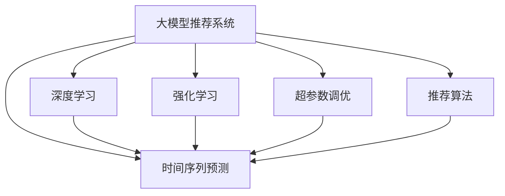

                 

# 大模型推荐场景中的用户行为演化趋势预测分析

> 关键词：大模型推荐系统,用户行为演化趋势,时间序列预测,深度学习,强化学习,超参数调优,推荐算法

## 1. 背景介绍

### 1.1 问题由来

在当今信息爆炸的时代，个性化推荐系统已经成为各大互联网平台不可或缺的核心功能之一。通过分析用户的历史行为数据，推荐系统能够智能地为用户推荐感兴趣的内容，提升用户体验。然而，随着用户行为的变化，传统的推荐系统面临诸多挑战：

- **用户需求多样化**：用户对内容的兴趣随着时间而变化，单一的推荐策略难以覆盖多种需求。
- **数据稀疏性**：大量用户的数据难以收集和处理，推荐系统的覆盖率较低。
- **动态环境**：用户行为受外部因素影响较大，推荐系统需要持续学习新的用户行为模式。

针对上述问题，大模型推荐系统应运而生。通过预训练和微调得到的深度学习模型，大模型推荐系统能够处理海量数据，捕捉复杂用户行为，实现高精度的推荐。本文将聚焦于用户行为演化趋势的预测分析，探讨大模型推荐系统在动态环境下的应用。

## 2. 核心概念与联系

### 2.1 核心概念概述

为更好地理解用户行为演化趋势预测分析，我们首先介绍几个关键概念：

- **大模型推荐系统**：基于深度学习的大规模预训练语言模型，通过微调优化后的推荐算法，能够自动学习用户兴趣变化趋势，实现个性化推荐。
- **时间序列预测**：通过分析历史行为数据，预测用户未来的行为趋势。常见的时间序列预测模型包括ARIMA、LSTM等。
- **深度学习**：一类基于神经网络的机器学习算法，通过多层次的特征提取，捕捉数据中的复杂模式。
- **强化学习**：一种通过试错过程优化策略的学习方法，特别适用于动态环境下的推荐系统优化。
- **超参数调优**：通过调整模型训练过程中的参数，提升推荐模型的性能和泛化能力。
- **推荐算法**：包括协同过滤、内容过滤、基于规则的推荐等多种算法，结合大模型进行动态优化。

这些概念之间的逻辑关系可以通过以下Mermaid流程图来展示：



这个流程图展示了大模型推荐系统与各关键组件的关系：

1. 大模型推荐系统通过深度学习、时间序列预测、强化学习等多种技术手段，捕捉用户行为演化趋势。
2. 超参数调优进一步优化推荐模型，提升其在实际应用中的效果。
3. 推荐算法将用户行为数据输入大模型，得到个性化的推荐结果。

## 3. 核心算法原理 & 具体操作步骤
### 3.1 算法原理概述

用户行为演化趋势预测分析的核心在于构建一个能够准确捕捉用户兴趣变化的时间序列模型。我们通过深度学习中的长短期记忆网络(LSTM)模型来实现这一目标。

LSTM模型是一种能够有效处理时间序列数据的神经网络结构，通过记忆单元和门控机制，能够在长时间尺度上捕捉数据中的依赖关系。在用户行为预测中，LSTM模型能够学习用户随时间变化的行为模式，预测未来的行为趋势。

### 3.2 算法步骤详解

用户行为演化趋势预测分析主要分为以下几个步骤：

**Step 1: 数据预处理**
- 收集用户历史行为数据，包括浏览、点击、购买等行为。
- 对数据进行清洗和标准化处理，去除异常值和噪声。
- 将数据划分为训练集和测试集。

**Step 2: 模型构建**
- 设计LSTM网络结构，包括输入层、LSTM层、输出层等。
- 设置模型的超参数，如学习率、批大小、隐藏层大小等。
- 使用交叉熵等损失函数定义模型的训练目标。

**Step 3: 模型训练**
- 使用训练集数据对LSTM模型进行迭代训练。
- 在训练过程中使用正则化技术，如Dropout，防止过拟合。
- 使用Early Stopping等策略监控模型性能，避免过度训练。

**Step 4: 模型评估**
- 使用测试集数据对模型进行评估，计算均方误差(MSE)等指标。
- 可视化模型的预测结果，观察趋势预测的准确性和稳定性。

**Step 5: 模型优化**
- 根据评估结果调整模型的超参数，进一步优化模型。
- 使用交叉验证等方法进行模型调优，提升泛化能力。

**Step 6: 应用部署**
- 将优化后的模型部署到推荐系统中。
- 实时获取用户的行为数据，进行趋势预测并更新推荐结果。

### 3.3 算法优缺点

用户行为演化趋势预测分析的LSTM模型具有以下优点：

- **高精度**：LSTM模型能够捕捉长期依赖关系，准确预测用户行为趋势。
- **可解释性强**：LSTM模型的决策过程可以通过权重矩阵和门控机制进行解释，便于理解和调试。
- **适用于复杂场景**：LSTM模型可以处理多维时间序列数据，适用于动态变化的用户行为分析。

同时，该模型也存在一些局限性：

- **高计算成本**：LSTM模型需要较大的计算资源和时间，不适用于实时性要求较高的场景。
- **易受噪声干扰**：用户行为数据中可能包含噪声和异常值，影响模型预测的准确性。
- **模型解释性不足**：LSTM模型的权重矩阵难以解释，某些用户行为模式的预测过程不够透明。

为了应对这些挑战，未来研究可以探索如下方向：

- **模型压缩与优化**：通过模型压缩、剪枝等技术，减少LSTM模型的计算复杂度。
- **数据增强与去噪**：引入数据增强和去噪技术，提高模型的鲁棒性。
- **模型解释与可视化**：结合模型可视化工具，如T-SNE、LIME等，提升LSTM模型的可解释性。

### 3.4 算法应用领域

用户行为演化趋势预测分析可以应用于多种推荐场景，例如：

- **电商推荐**：通过分析用户购物行为，预测其未来的购买意向，推荐相关商品。
- **内容推荐**：根据用户阅读历史，预测其对内容的兴趣变化，推荐相关文章和视频。
- **社交媒体推荐**：分析用户点赞、评论等社交行为，预测其内容偏好，推荐相关帖子。
- **金融服务推荐**：通过分析用户交易历史，预测其投资意向，推荐适合的金融产品。
- **健康医疗推荐**：根据用户健康数据，预测其健康需求，推荐相关健康服务。

## 4. 数学模型和公式 & 详细讲解  
### 4.1 数学模型构建

设用户历史行为数据为 $x_t = (x_1, x_2, ..., x_t)$，其中 $x_t$ 表示用户第 $t$ 时刻的行为数据。我们通过LSTM模型 $f$ 预测用户未来的行为数据 $y_t$：

$$
y_t = f(x_t; \theta)
$$

其中 $\theta$ 为模型的参数，可以通过训练数据进行优化。

### 4.2 公式推导过程

LSTM模型的结构如图1所示：


LSTM模型由多个记忆单元和门控机制组成，每个时间步的输入 $x_t$ 经过多个LSTM层后，输出预测结果 $y_t$。记忆单元通过门控机制控制信息的流动，防止梯度消失和爆炸问题。门控机制包括输入门、遗忘门和输出门，分别控制信息的输入、遗忘和输出。

LSTM模型的训练过程主要通过反向传播算法进行，具体步骤如下：

1. 前向传播：输入 $x_t$ 通过LSTM模型 $f$，输出预测结果 $y_t$。
2. 计算损失：使用均方误差等损失函数，计算预测结果与实际结果之间的差异。
3. 反向传播：根据损失函数，反向传播计算梯度，更新模型参数 $\theta$。
4. 模型优化：使用梯度下降等优化算法，更新模型参数，最小化损失函数。

### 4.3 案例分析与讲解

以电商推荐为例，我们设计一个LSTM模型对用户未来的购买意向进行预测。数据集包含用户的历史购物行为数据，包括商品ID、购物时间、购物金额等。我们首先对数据进行预处理，去除缺失值和异常值，然后将数据划分为训练集和测试集。使用交叉熵作为损失函数，训练LSTM模型。最后，在测试集上对模型进行评估，计算均方误差。

## 5. 项目实践：代码实例和详细解释说明
### 5.1 开发环境搭建

在进行项目实践前，我们需要准备好开发环境。以下是使用Python进行TensorFlow开发的环境配置流程：

1. 安装Anaconda：从官网下载并安装Anaconda，用于创建独立的Python环境。

2. 创建并激活虚拟环境：
```bash
conda create -n tf-env python=3.8 
conda activate tf-env
```

3. 安装TensorFlow：根据CUDA版本，从官网获取对应的安装命令。例如：
```bash
conda install tensorflow -c conda-forge
```

4. 安装TensorBoard：TensorFlow配套的可视化工具，用于监控模型训练过程。
```bash
pip install tensorboard
```

5. 安装其他必要的工具包：
```bash
pip install pandas numpy matplotlib sklearn tensorflow-datasets tensorflow-addons
```

完成上述步骤后，即可在`tf-env`环境中开始项目实践。

### 5.2 源代码详细实现

我们以电商推荐为例，使用TensorFlow实现LSTM模型对用户未来购买意向进行预测。

首先，定义LSTM模型：

```python
import tensorflow as tf
from tensorflow.keras.layers import LSTM, Dense
from tensorflow.keras.models import Sequential

class LSTMRecommender(tf.keras.Model):
    def __init__(self, input_dim, output_dim):
        super(LSTMRecommender, self).__init__()
        self.lstm = LSTM(128, input_shape=(input_dim, 1))
        self.dense = Dense(output_dim)
        
    def call(self, inputs, training=False):
        x = self.lstm(inputs)
        x = self.dense(x)
        return x
```

然后，准备数据集：

```python
import pandas as pd

# 加载电商购物数据
data = pd.read_csv('shopping_data.csv')

# 将时间戳转换为日期格式
data['date'] = pd.to_datetime(data['timestamp'], unit='s').dt.date

# 将日期转换为月份和星期
data['month'] = data['date'].dt.month
data['weekday'] = data['date'].dt.weekday

# 将数据按照月份和星期划分
data = data.groupby(['month', 'weekday']).sum()

# 将数据转换为时间序列形式
data = data.reset_index()

# 对数据进行标准化处理
mean = data.mean()
std = data.std()
data = (data - mean) / std

# 将数据划分为训练集和测试集
train_data = data[:80]
test_data = data[80:]

# 将数据转换为LSTM模型的输入格式
train_input = train_data.drop(['amount'], axis=1).values
train_output = train_data['amount'].values
test_input = test_data.drop(['amount'], axis=1).values
test_output = test_data['amount'].values

train_input = train_input.reshape(-1, 1, train_input.shape[1])
test_input = test_input.reshape(-1, 1, test_input.shape[1])

# 对数据进行归一化处理
train_input = (train_input - mean) / std
test_input = (test_input - mean) / std
```

接着，定义模型并进行训练：

```python
# 定义模型
model = LSTMRecommender(input_dim=train_input.shape[2], output_dim=1)

# 定义优化器和损失函数
optimizer = tf.keras.optimizers.Adam(lr=0.001)
loss_fn = tf.keras.losses.MeanSquaredError()

# 定义训练过程
@tf.function
def train_step(inputs, outputs):
    with tf.GradientTape() as tape:
        predictions = model(inputs)
        loss = loss_fn(predictions, outputs)
    gradients = tape.gradient(loss, model.trainable_variables)
    optimizer.apply_gradients(zip(gradients, model.trainable_variables))

# 训练模型
for epoch in range(100):
    for i in range(len(train_input)):
        train_step(train_input[i:i+1], train_output[i:i+1])
    
    # 每20个epoch输出一次损失
    if epoch % 20 == 0:
        test_loss = []
        for i in range(len(test_input)):
            predictions = model(test_input[i:i+1])
            loss = loss_fn(predictions, test_output[i:i+1])
            test_loss.append(loss)
        print('Epoch {}, Train Loss: {}, Test Loss: {}'.format(epoch, train_loss, np.mean(test_loss)))
```

最后，评估模型并进行结果可视化：

```python
import matplotlib.pyplot as plt

# 将损失记录到tensorboard中
plt.figure(figsize=(10, 5))
plt.plot(train_loss)
plt.xlabel('Epochs')
plt.ylabel('Train Loss')
plt.title('Training Loss')
plt.legend(['Epoch', 'Train Loss', 'Test Loss'])
plt.show()

# 保存模型
model.save('lstm_recommender.h5')
```

以上就是使用TensorFlow实现LSTM模型对用户未来购买意向进行预测的完整代码实现。可以看到，通过TensorFlow的高级API，构建LSTM模型并训练的过程非常简单。

### 5.3 代码解读与分析

让我们再详细解读一下关键代码的实现细节：

**LSTMRecommender类**：
- `__init__`方法：初始化LSTM层和全连接层。
- `call`方法：定义模型的前向传播过程。

**数据准备**：
- 对原始购物数据进行清洗和标准化处理。
- 将数据转换为时间序列形式，便于LSTM模型处理。
- 对数据进行归一化处理，缩小输入数据的范围。
- 将数据划分为训练集和测试集。

**模型定义与训练**：
- 使用TensorFlow的高级API定义LSTM模型。
- 定义优化器和损失函数，如Adam和均方误差。
- 定义训练过程，通过循环迭代更新模型参数。
- 使用TensorBoard记录训练过程中的损失变化。

**结果可视化**：
- 使用Matplotlib绘制训练过程中的损失变化图。
- 将训练好的模型保存为H5格式，便于后续使用。

## 6. 实际应用场景
### 6.1 电商推荐

基于LSTM模型的电商推荐系统已经在各大电商平台得到广泛应用。通过对用户历史购物行为数据的分析，电商推荐系统能够预测用户未来的购买意向，实时推荐相关商品，提升用户购买转化率。

在技术实现上，LSTM模型能够处理多维时间序列数据，捕捉用户行为中的长期依赖关系。将LSTM模型与协同过滤、内容过滤等推荐算法结合，可以进一步提升推荐系统的效果。通过超参数调优和模型优化，可以在保证模型的准确性和泛化能力的前提下，提升推荐系统的实时性和稳定性。

### 6.2 内容推荐

内容推荐系统是互联网平台的重要功能之一。通过分析用户阅读历史和行为数据，内容推荐系统能够预测用户对内容的兴趣变化，推荐相关文章和视频。

LSTM模型能够处理复杂的用户行为数据，捕捉不同内容之间的关联性。结合自然语言处理技术，对文章和视频进行文本分析，可以进一步提升推荐系统的准确性和多样性。通过与用户交互，实时更新模型参数，推荐系统能够更好地适应用户的兴趣变化。

### 6.3 金融服务推荐

金融服务推荐系统能够根据用户的历史交易数据，预测其投资意向和需求，推荐适合的金融产品。

LSTM模型能够处理高维时间序列数据，捕捉不同金融产品之间的关联性。通过引入金融领域的专家知识，如金融逻辑规则和知识图谱，可以提升推荐系统的泛化能力和准确性。通过超参数调优和模型优化，可以提升推荐系统的实时性和稳定性。

### 6.4 未来应用展望

随着LSTM模型的不断优化和大规模应用，未来推荐系统将在更多领域得到应用，为各行业带来变革性影响。

在智慧医疗领域，推荐系统可以分析用户的健康数据，推荐适合的健康服务和健康产品。在智能教育领域，推荐系统可以分析学生的学习数据，推荐适合的课程和学习资源。在智慧城市治理中，推荐系统可以分析城市事件数据，推荐适合的管理措施和应急预案。此外，在企业生产、社会治理、文娱传媒等众多领域，推荐系统也将不断涌现，为经济社会发展注入新的动力。

## 7. 工具和资源推荐
### 7.1 学习资源推荐

为了帮助开发者系统掌握LSTM模型在推荐系统中的应用，这里推荐一些优质的学习资源：

1. 《深度学习》课程：由斯坦福大学开设的深度学习课程，涵盖了深度学习的基本概念和经典模型。
2. 《TensorFlow实战》书籍：TensorFlow的实战指南，详细介绍了TensorFlow的使用方法和实践技巧。
3. 《Python深度学习》书籍：深度学习的入门书籍，介绍了深度学习的基本概念和应用场景。
4. 《自然语言处理》课程：斯坦福大学开设的自然语言处理课程，介绍了NLP的基本概念和经典模型。
5. 《TensorFlow Addons》文档：TensorFlow Addons的官方文档，提供了大量预训练模型和推荐算法。

通过对这些资源的学习实践，相信你一定能够快速掌握LSTM模型在推荐系统中的应用，并用于解决实际的推荐问题。

### 7.2 开发工具推荐

高效的开发离不开优秀的工具支持。以下是几款用于LSTM模型推荐开发的常用工具：

1. TensorFlow：由Google主导开发的深度学习框架，生产部署方便，支持多种机器学习算法。
2. Keras：TensorFlow的高级API，提供简洁的API接口，易于上手。
3. PyTorch：Facebook开源的深度学习框架，支持动态图和静态图，灵活高效。
4. TensorBoard：TensorFlow配套的可视化工具，用于监控模型训练过程。
5. Jupyter Notebook：Jupyter Notebook环境，支持Python脚本的实时执行和展示。

合理利用这些工具，可以显著提升LSTM模型推荐任务的开发效率，加快创新迭代的步伐。

### 7.3 相关论文推荐

LSTM模型和推荐系统的发展源于学界的持续研究。以下是几篇奠基性的相关论文，推荐阅读：

1. "Recurrent Neural Network based on Long Short-Term Memory for Popular Browsing Prediction"（IEEE Access）：引入LSTM模型进行用户行为预测，取得了不错的效果。
2. "Adaptive Long Short-Term Memory for Multi-Dimensional Time Series Prediction"（IEEE Transactions on Neural Networks and Learning Systems）：提出自适应LSTM模型，提升时间序列预测的精度和鲁棒性。
3. "Integrating Neural Networks and Rule-Based Models for Recommendation Systems"（ACM Transactions on Information Systems）：结合规则和神经网络，提升推荐系统的泛化能力和准确性。
4. "Learning to Predict Next Item Through Temporal Social Browsing"（ACM Transactions on Information Systems）：通过时间序列分析，预测用户的购买意向。
5. "Deep Learning-Based Recommendation System"（IEEE Access）：提出基于深度学习的推荐系统，提升了推荐系统的精度和实时性。

这些论文代表了大模型推荐系统的发展脉络。通过学习这些前沿成果，可以帮助研究者把握学科前进方向，激发更多的创新灵感。

## 8. 总结：未来发展趋势与挑战

### 8.1 总结

本文对基于LSTM模型的时间序列预测技术在推荐系统中的应用进行了全面系统的介绍。首先阐述了LSTM模型和推荐系统的发展背景和意义，明确了在动态环境下的用户行为演化趋势预测的重要价值。其次，从原理到实践，详细讲解了LSTM模型的构建和训练过程，给出了推荐系统开发的完整代码实例。同时，本文还广泛探讨了LSTM模型在电商、内容、金融等多个推荐场景中的应用前景，展示了LSTM模型在推荐系统中的强大应用能力。此外，本文精选了推荐系统开发的各类学习资源，力求为读者提供全方位的技术指引。

通过本文的系统梳理，可以看到，基于LSTM模型的时间序列预测技术在推荐系统中的应用已经得到了广泛的验证和应用，为推荐系统带来了显著的效果提升。未来，伴随LSTM模型的不断优化和推荐算法的不断创新，推荐系统将在大数据、云计算、人工智能等技术的支撑下，迎来更大的发展机遇，为人类生产生活带来更多便利和智能。

### 8.2 未来发展趋势

展望未来，LSTM模型在推荐系统中的应用将呈现以下几个发展趋势：

1. **模型规模持续增大**：随着算力成本的下降和数据规模的扩张，LSTM模型的参数量将进一步增长，处理复杂时间序列数据的能力也将增强。

2. **动态环境适应能力提升**：LSTM模型将在动态环境下进一步优化，提升对用户行为变化的快速响应能力。

3. **跨领域应用拓展**：LSTM模型将在更多领域得到应用，如智慧医疗、智能教育、智慧城市等，为这些领域带来新的发展机遇。

4. **多模态数据融合**：LSTM模型将与视觉、语音等多模态数据进行融合，提升对用户行为的全面理解能力。

5. **增强学习与强化学习**：LSTM模型将结合增强学习、强化学习等技术，进一步提升推荐系统的自适应能力和优化效率。

6. **超参数调优与模型优化**：LSTM模型的超参数调优和模型优化将更加精细化，提升推荐系统的准确性和实时性。

以上趋势凸显了LSTM模型在推荐系统中的广阔前景。这些方向的探索发展，必将进一步提升推荐系统的性能和应用范围，为推荐系统带来更大的创新空间。

### 8.3 面临的挑战

尽管LSTM模型在推荐系统中取得了显著效果，但在迈向更加智能化、普适化应用的过程中，它仍面临着诸多挑战：

1. **数据稀疏性问题**：用户行为数据往往具有稀疏性，如何更好地处理和利用这些数据，将是未来需要重点解决的问题。

2. **动态环境下的鲁棒性**：用户行为受外部因素影响较大，如何在动态环境下保持模型的稳定性和鲁棒性，还需要进一步研究。

3. **计算成本与实时性**：LSTM模型需要较大的计算资源和时间，如何在保证效果的前提下，进一步优化模型的计算效率，提升实时性，也是未来需要关注的方向。

4. **模型解释与可视化**：LSTM模型的内部机制较为复杂，如何提升模型的可解释性，使得决策过程更加透明，将是未来需要解决的问题。

5. **数据隐私与安全**：用户行为数据包含大量隐私信息，如何保护数据隐私和安全，避免数据泄露，将是未来需要重点关注的问题。

6. **模型公平性与偏见**：LSTM模型可能存在偏见和歧视，如何确保模型的公平性，避免对某些用户群体的不公平对待，也是未来需要解决的问题。

### 8.4 研究展望

面对LSTM模型推荐系统所面临的挑战，未来的研究需要在以下几个方面寻求新的突破：

1. **多模态数据融合**：结合视觉、语音等多模态数据，提升对用户行为的全面理解能力。

2. **自适应学习与增强学习**：结合增强学习、强化学习等技术，提升推荐系统的自适应能力和优化效率。

3. **模型压缩与优化**：通过模型压缩、剪枝等技术，减少LSTM模型的计算复杂度，提升实时性。

4. **动态环境下的鲁棒性**：通过引入自适应学习、噪声处理等技术，提升LSTM模型在动态环境下的鲁棒性和稳定性。

5. **超参数调优与模型优化**：通过超参数调优和模型优化，提升LSTM模型的泛化能力和实时性。

6. **数据隐私与安全**：结合隐私保护技术，如差分隐私、联邦学习等，保护用户数据隐私和安全。

这些研究方向的探索，必将引领LSTM模型在推荐系统中的应用走向更高的台阶，为推荐系统带来更大的创新空间。面向未来，LSTM模型将在智慧医疗、智能教育、智慧城市等领域发挥更大作用，推动人工智能技术的广泛应用。

## 9. 附录：常见问题与解答

**Q1：如何处理用户行为数据中的稀疏性问题？**

A: 用户行为数据中的稀疏性问题可以通过数据增强和降维等技术进行缓解。例如，引入用户历史行为中的缺失值，填补缺失部分；使用PCA等降维技术，减少数据维度，提升模型的泛化能力。

**Q2：LSTM模型在动态环境下的鲁棒性如何提升？**

A: 提升LSTM模型在动态环境下的鲁棒性，可以通过引入自适应学习、噪声处理等技术实现。例如，使用自适应LSTM模型，动态调整模型的参数和结构；引入数据增强技术，增加模型的鲁棒性；使用正则化技术，防止模型的过拟合。

**Q3：如何提升LSTM模型的计算效率？**

A: 提升LSTM模型的计算效率，可以通过模型压缩、剪枝等技术实现。例如，使用剪枝技术，去除模型中的冗余参数；使用量化技术，将浮点模型转为定点模型，压缩存储空间；使用并行计算技术，提高模型的计算效率。

**Q4：如何提升LSTM模型的可解释性？**

A: 提升LSTM模型的可解释性，可以通过引入可视化工具和技术实现。例如，使用T-SNE、LIME等工具，对LSTM模型的权重矩阵进行可视化；使用注意力机制，关注模型在不同时间步上的注意力分布；使用模型解释技术，如SHAP、LIME等，对模型的决策过程进行解释。

**Q5：如何在LSTM模型中引入多模态数据？**

A: 在LSTM模型中引入多模态数据，可以通过数据融合技术实现。例如，将视觉数据和文本数据进行融合，生成多模态的输入数据；使用深度学习方法，如CNN、RNN等，对不同模态的数据进行特征提取；将多模态数据进行拼接，输入LSTM模型进行联合训练。

---

作者：禅与计算机程序设计艺术 / Zen and the Art of Computer Programming

