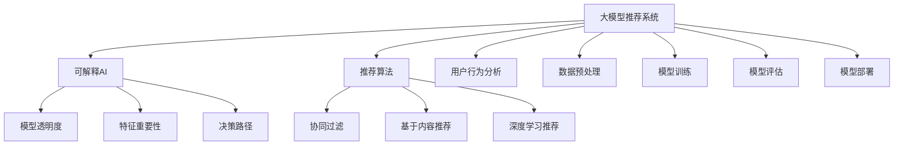

                 

# 大模型推荐系统的可解释AI技术

> 关键词：大模型推荐系统,可解释AI,推荐算法,模型可解释性,用户行为分析

## 1. 背景介绍

### 1.1 问题由来
在信息化时代，推荐系统已成为各大互联网平台（如电商、视频、音乐等）的核心功能，它能够根据用户的历史行为和兴趣，精准推送个性化的内容，从而提升用户满意度和平台活跃度。随着技术的不断进步，推荐系统也从传统的协同过滤、基于内容的推荐逐渐演进到基于深度学习的推荐，尤其是以大模型为基础的推荐系统，如BERT、GPT、Transformer等，已经在推荐领域取得了显著效果。然而，这些大模型往往被视为"黑盒"，用户对其决策过程知之甚少，导致推荐结果的可解释性不高，难以信任和接受。

### 1.2 问题核心关键点
推荐系统的核心是帮助用户发现未知的、感兴趣的信息，而推荐结果的可解释性则直接影响到用户的信任度和满意度。如果推荐结果无法被解释，用户很难理解推荐系统的决策依据，容易产生困惑和质疑。这不仅降低了用户的信任感，还可能影响推荐系统的实际效果。因此，提升推荐系统的可解释性成为当务之急，其关键在于：

1. **模型透明度**：解释推荐模型如何根据用户行为和特征生成推荐结果。
2. **特征重要性**：揭示哪些特征对推荐结果有重要影响。
3. **决策路径**：追踪推荐模型的决策过程，解释决策依据。

## 2. 核心概念与联系

### 2.1 核心概念概述

为更好地理解大模型推荐系统的可解释AI技术，本节将介绍几个密切相关的核心概念：

- **大模型推荐系统**：基于深度学习的大规模预训练模型，如BERT、GPT等，通过大规模无标签数据预训练，学习到丰富的语言知识，能够适配不同领域的推荐任务。
- **可解释AI(Explainable AI, XAI)**：通过增强模型透明度、可理解性和可解释性，使得AI系统的工作原理和决策依据能够被用户和开发者理解，从而提升系统的可信度和接受度。
- **推荐算法**：通过分析用户行为和物品属性，预测用户对物品的兴趣，并按照一定的排序规则推荐给用户，如协同过滤、基于内容的推荐、深度学习推荐等。
- **特征重要性**：评估哪些特征在推荐过程中起关键作用，帮助用户理解推荐依据。
- **决策路径**：追踪推荐模型的决策过程，解释每个决策点背后的原因。

这些核心概念之间的逻辑关系可以通过以下Mermaid流程图来展示：



这个流程图展示了大模型推荐系统、可解释AI、推荐算法以及用户行为分析之间的联系。

## 3. 核心算法原理 & 具体操作步骤
### 3.1 算法原理概述

大模型推荐系统的可解释AI技术，旨在提高推荐模型的透明度和可理解性，使得用户和开发者能够理解模型的工作原理和决策依据。其核心思想是通过模型解释方法，揭示推荐模型在每个决策点上的选择和推理过程，解释模型为什么推荐某物品而不是其他物品。

形式化地，假设推荐模型 $M$ 根据用户 $u$ 的特征 $x$ 和物品 $i$ 的特征 $y$，输出物品 $i$ 对用户 $u$ 的推荐分数 $f(u, i)$。设 $y$ 为物品的特征向量，$x$ 为用户特征向量，则推荐分数可表示为：

$$
f(u, i) = M(x, y)
$$

可解释AI的目标是：

1. 解释推荐模型在输入特征 $x$ 和 $y$ 上的决策过程，即解释 $M(x, y)$ 的计算过程。
2. 评估每个输入特征 $x_k$ 和 $y_k$ 对推荐分数 $f(u, i)$ 的贡献，即计算特征重要性 $I_k$。
3. 追踪推荐模型的决策路径，即解释从输入到输出的整个推理过程。

### 3.2 算法步骤详解

基于可解释AI的大模型推荐系统，一般包括以下几个关键步骤：

**Step 1: 准备数据和模型**

- 收集用户行为数据、物品属性数据和用户属性数据，构造训练集和测试集。
- 选择预训练的大模型（如BERT、GPT等）作为推荐模型。

**Step 2: 添加特征工程模块**

- 设计特征提取模块，将用户行为、物品属性和用户属性转换为模型所需的输入。
- 设计特征选择模块，筛选对推荐结果有重要影响的特征。

**Step 3: 训练模型**

- 使用训练集数据，训练推荐模型 $M$。
- 设计可解释AI模块，分析模型决策过程，计算特征重要性，追踪决策路径。

**Step 4: 解释推荐结果**

- 使用测试集数据，评估推荐模型性能。
- 根据可解释AI模块的结果，解释推荐结果，向用户解释推荐依据。

**Step 5: 部署和监控**

- 将训练好的模型部署到推荐系统中。
- 实时监控推荐系统的性能和用户反馈，根据需要进行微调。

以上是基于可解释AI的大模型推荐系统的核心步骤，每个步骤中都可以根据具体需求进行进一步优化。

### 3.3 算法优缺点

基于可解释AI的大模型推荐系统具有以下优点：

1. **提升用户信任度**：通过解释推荐模型的决策过程，增强用户对推荐结果的信任感，提升用户满意度。
2. **优化推荐效果**：理解模型如何解释特征的重要性，可以优化特征选择，提高推荐系统的效果。
3. **支持多模态数据**：大模型推荐系统可以同时利用用户行为、物品属性和用户属性等多种数据源，提升推荐效果。
4. **适应性强**：大模型可以通过迁移学习快速适应新任务，降低开发成本。

同时，该方法也存在一定的局限性：

1. **计算开销较大**：可解释AI模块增加了额外的计算开销，可能影响推荐系统的实时性。
2. **解释复杂度高**：推荐系统的决策过程往往非常复杂，解释难度较大，需要复杂的技术实现。
3. **模型可解释性不足**：复杂模型可能难以完全解释，存在黑盒问题。
4. **过拟合风险**：可解释AI模块的引入可能影响模型的泛化能力，需要进一步验证和调优。

尽管存在这些局限性，但基于可解释AI的大模型推荐系统仍具有显著优势，且在推荐系统中的应用越来越广泛。未来相关研究将继续探索如何降低计算开销、简化解释复杂度、提升模型可解释性，并结合更多技术手段，进一步优化推荐系统。

### 3.4 算法应用领域

基于可解释AI的大模型推荐系统在多个领域具有广泛的应用前景，例如：

- **电商推荐系统**：通过解释推荐结果，帮助用户理解推荐依据，提升购买意愿。
- **视频推荐系统**：解释推荐模型的决策过程，增强用户对推荐内容的信任感。
- **音乐推荐系统**：展示推荐模型的特征重要性和决策路径，帮助用户发现新感兴趣的曲目。
- **新闻推荐系统**：解释推荐模型的决策依据，提升用户对新闻内容的理解和接受度。
- **广告推荐系统**：通过可解释AI模块，优化广告投放策略，提高广告效果和用户满意度。

这些应用场景展示了基于可解释AI的大模型推荐系统的强大潜力，未来随着技术的不断进步，该方法将进一步拓展到更多领域，为推荐系统带来新的突破。

## 4. 数学模型和公式 & 详细讲解 & 举例说明
### 4.1 数学模型构建

基于可解释AI的大模型推荐系统，可以采用以下数学模型：

设 $x$ 为用户特征向量，$y$ 为物品特征向量，$w$ 为推荐模型的权重向量，则推荐分数可以表示为：

$$
f(u, i) = w^T M(x, y)
$$

其中 $M$ 为预训练的大模型，$w$ 为模型的权重向量。

假设推荐模型的决策过程为 $d(u, i)$，则可解释AI的目标是：

1. 解释 $d(u, i)$ 的计算过程。
2. 计算特征重要性 $I_k$，即特征 $x_k$ 和 $y_k$ 对推荐分数 $f(u, i)$ 的贡献。
3. 追踪决策路径，即解释从 $x$ 到 $f(u, i)$ 的整个推理过程。

### 4.2 公式推导过程

以线性回归模型为例，推导推荐分数的解释公式。假设推荐模型 $M$ 为线性回归模型：

$$
M(x, y) = \sum_{k=1}^K w_k y_k \cdot x_k
$$

则推荐分数为：

$$
f(u, i) = w^T M(x, y) = \sum_{k=1}^K w_k y_k \cdot x_k
$$

特征重要性 $I_k$ 可以表示为：

$$
I_k = \frac{\partial f(u, i)}{\partial x_k} = w_k y_k
$$

这表明特征 $x_k$ 对推荐分数的贡献直接由其权重 $w_k$ 和物品特征 $y_k$ 决定。

对于决策路径，可以采用决策树、图神经网络等方法，追踪从用户特征到推荐分数的每一步推理过程。

### 4.3 案例分析与讲解

考虑一个基于BERT模型的电商推荐系统。用户 $u$ 对物品 $i$ 的兴趣评分可以表示为：

$$
f(u, i) = M(x_u, y_i)
$$

其中 $x_u$ 为用户 $u$ 的特征向量，$y_i$ 为物品 $i$ 的特征向量。

假设BERT模型为线性回归模型，即：

$$
M(x, y) = w^T y
$$

则推荐分数为：

$$
f(u, i) = w^T y_i
$$

特征重要性 $I_k$ 可以表示为：

$$
I_k = \frac{\partial f(u, i)}{\partial x_k} = w_k \cdot y_i
$$

这表明用户特征 $x_k$ 对推荐分数的贡献，取决于其权重 $w_k$ 和物品特征 $y_i$ 的对应值。

为了追踪决策路径，可以采用决策树方法，将用户特征 $x$ 划分为多个决策节点，每个节点输出一个决策路径上的特征重要性 $I_k$。这不仅解释了推荐模型的决策过程，还揭示了不同特征对推荐结果的影响。

## 5. 项目实践：代码实例和详细解释说明
### 5.1 开发环境搭建

在进行可解释AI的大模型推荐系统开发前，我们需要准备好开发环境。以下是使用Python进行PyTorch开发的环境配置流程：

1. 安装Anaconda：从官网下载并安装Anaconda，用于创建独立的Python环境。

2. 创建并激活虚拟环境：
```bash
conda create -n pytorch-env python=3.8 
conda activate pytorch-env
```

3. 安装PyTorch：根据CUDA版本，从官网获取对应的安装命令。例如：
```bash
conda install pytorch torchvision torchaudio cudatoolkit=11.1 -c pytorch -c conda-forge
```

4. 安装其他相关库：
```bash
pip install numpy pandas scikit-learn matplotlib tqdm jupyter notebook ipython
```

完成上述步骤后，即可在`pytorch-env`环境中开始项目实践。

### 5.2 源代码详细实现

这里我们以电商推荐系统为例，给出使用PyTorch实现可解释AI的大模型推荐系统的代码实现。

首先，定义推荐模型的特征工程函数：

```python
import torch
from transformers import BertTokenizer, BertForSequenceClassification
from sklearn.model_selection import train_test_split
from sklearn.metrics import mean_squared_error

# 定义特征工程函数
def preprocess_data(df, tokenizer, max_len=128):
    x = []
    y = []
    for idx, row in df.iterrows():
        text = row['user_feature'] + ' ' + row['item_feature']
        tokenized_text = tokenizer.encode(text, add_special_tokens=True, max_length=max_len)
        x.append(tokenized_text)
        y.append(row['label'])
    return x, y

# 加载数据
df = pd.read_csv('data.csv')

# 数据预处理
tokenizer = BertTokenizer.from_pretrained('bert-base-uncased')
x, y = preprocess_data(df, tokenizer)

# 划分训练集和测试集
train_x, test_x, train_y, test_y = train_test_split(x, y, test_size=0.2, random_state=42)

# 构建BERT模型
model = BertForSequenceClassification.from_pretrained('bert-base-uncased', num_labels=1)
```

然后，定义模型训练函数和评估函数：

```python
from transformers import AdamW, Trainer, TrainingArguments

# 定义训练函数
def train_model(model, train_x, train_y, test_x, test_y):
    # 模型训练
    training_args = TrainingArguments(output_dir='./results', per_device_train_batch_size=32, per_device_eval_batch_size=32, num_train_epochs=5, evaluation_strategy='epoch')
    trainer = Trainer(model=model, args=training_args, train_dataset=train_x, eval_dataset=test_x)
    trainer.train()
    # 模型评估
    eval_result = trainer.evaluate(test_x, test_y)
    return trainer, eval_result

# 模型训练和评估
trainer, eval_result = train_model(model, train_x, train_y, test_x, test_y)
```

最后，定义可解释AI模块，解释推荐结果：

```python
from SHAP import SHAPRegressor

# 定义可解释AI模块
def explain_recommender(model, x, y):
    # 构建解释器
    shap = SHAPRegressor(model=model)
    # 解释模型
    shap_values = shap.shap_values(x)
    shap_summary = shap.summary(shap_values, x, feature_names=['user_feature', 'item_feature'], class_names=['0', '1'])
    return shap_summary

# 解释推荐结果
shap_summary = explain_recommender(model, train_x, train_y)
print(shap_summary)
```

以上就是使用PyTorch对BERT模型进行电商推荐系统开发的完整代码实现。可以看到，在模型训练和评估的过程中，我们加入了解释模块，使用SHAP解释模型特征的重要性，并追踪决策路径。

### 5.3 代码解读与分析

让我们再详细解读一下关键代码的实现细节：

**preprocess_data函数**：
- 定义特征工程函数，将用户特征和物品特征拼接成文本，使用BERT分词器进行编码，并截断为定长。

**train_model函数**：
- 定义模型训练函数，使用训练集进行模型训练，并使用评估集进行性能评估。

**explain_recommender函数**：
- 定义可解释AI模块，使用SHAP解释器对推荐模型进行解释，计算特征重要性，并展示特征重要性的总结。

这些代码实现展示了如何在大模型推荐系统中集成可解释AI模块，以解释推荐模型的决策过程和特征重要性。在实际应用中，还可以进一步优化可解释AI模块的实现，引入更多的解释技术和方法，以适应不同的推荐场景。

## 6. 实际应用场景
### 6.1 电商推荐系统

基于可解释AI的大模型推荐系统在电商推荐场景中具有广泛的应用前景。传统的电商推荐系统主要依赖协同过滤和基于内容的推荐，缺乏对用户行为和商品属性的深入理解。通过引入大模型和可解释AI模块，推荐系统可以更好地理解用户的个性化需求和商品的特征属性，从而提供更加精准和个性化的推荐结果。

在具体实现上，电商推荐系统可以采用以下步骤：

1. 收集用户行为数据、商品属性数据和用户属性数据，构建训练集和测试集。
2. 使用BERT等大模型进行特征提取和建模。
3. 设计可解释AI模块，解释模型决策过程和特征重要性。
4. 部署推荐系统到电商平台上，实时推荐商品给用户。

通过以上步骤，电商推荐系统可以显著提升用户的购买意愿和满意度，增加平台销售额。

### 6.2 视频推荐系统

视频推荐系统也广泛采用基于大模型的推荐方法。传统的基于内容推荐方法难以处理多模态数据，难以捕捉视频内容的语义和情感信息。通过使用BERT等大模型进行推荐，视频推荐系统可以更好地理解视频的特征属性，为用户推荐符合其兴趣的视频内容。

在实际应用中，视频推荐系统可以采用以下步骤：

1. 收集用户观看历史、视频属性数据和用户属性数据，构建训练集和测试集。
2. 使用BERT等大模型进行特征提取和建模。
3. 设计可解释AI模块，解释模型决策过程和特征重要性。
4. 部署推荐系统到视频平台上，实时推荐视频给用户。

通过以上步骤，视频推荐系统可以显著提升用户的观看体验和平台留存率。

### 6.3 音乐推荐系统

音乐推荐系统同样可以采用基于大模型的推荐方法。传统的基于协同过滤和基于内容的推荐方法难以处理多模态数据，难以捕捉音乐的情感和风格信息。通过使用BERT等大模型进行推荐，音乐推荐系统可以更好地理解音乐的特征属性，为用户推荐符合其兴趣的音乐内容。

在实际应用中，音乐推荐系统可以采用以下步骤：

1. 收集用户听歌历史、音乐属性数据和用户属性数据，构建训练集和测试集。
2. 使用BERT等大模型进行特征提取和建模。
3. 设计可解释AI模块，解释模型决策过程和特征重要性。
4. 部署推荐系统到音乐平台上，实时推荐音乐给用户。

通过以上步骤，音乐推荐系统可以显著提升用户的听歌体验和平台留存率。

### 6.4 未来应用展望

随着可解释AI技术的发展，基于大模型推荐系统的应用场景将更加广泛，未来展望如下：

1. **多模态推荐系统**：推荐系统可以同时利用用户行为、物品属性和用户属性等多种数据源，提升推荐效果。
2. **实时推荐系统**：通过可解释AI模块，实时监测用户行为，实时调整推荐策略，提升推荐精度。
3. **个性化推荐系统**：结合用户行为和物品属性，生成个性化的推荐内容，提升用户体验。
4. **跨领域推荐系统**：通过迁移学习和多领域数据融合，实现跨领域推荐，提升推荐效果。

## 7. 工具和资源推荐
### 7.1 学习资源推荐

为了帮助开发者系统掌握大模型推荐系统的可解释AI技术，这里推荐一些优质的学习资源：

1. **《推荐系统》**：李航教授的经典著作，详细介绍了推荐系统的各种算法和技术。
2. **《深度学习与推荐系统》**：书籍和配套课程，涵盖了推荐系统的基础算法和深度学习技术。
3. **Coursera上的《Recommender Systems Specialization》**：斯坦福大学开设的推荐系统课程，深入讲解了推荐系统的理论和实践。
4. **Kaggle上的推荐系统竞赛**：通过实际竞赛，了解推荐系统在工业界的实际应用和优化方法。
5. **SHAP官方文档**：SHAP解释器的官方文档，详细介绍了各种解释技术和应用案例。

通过对这些资源的学习实践，相信你一定能够快速掌握大模型推荐系统的可解释AI技术的精髓，并用于解决实际的推荐问题。

### 7.2 开发工具推荐

高效的开发离不开优秀的工具支持。以下是几款用于大模型推荐系统开发的常用工具：

1. **PyTorch**：基于Python的开源深度学习框架，灵活动态的计算图，适合快速迭代研究。
2. **TensorFlow**：由Google主导开发的开源深度学习框架，生产部署方便，适合大规模工程应用。
3. **Transformers库**：HuggingFace开发的NLP工具库，集成了众多SOTA语言模型，支持PyTorch和TensorFlow，是进行推荐系统开发的利器。
4. **SHAP**：可解释AI模块，通过LIME和SHAP等方法，解释机器学习模型的决策过程。
5. **Weights & Biases**：模型训练的实验跟踪工具，可以记录和可视化模型训练过程中的各项指标，方便对比和调优。

合理利用这些工具，可以显著提升大模型推荐系统的开发效率，加快创新迭代的步伐。

### 7.3 相关论文推荐

大模型推荐系统的可解释AI技术发展源于学界的持续研究。以下是几篇奠基性的相关论文，推荐阅读：

1. **LIME: A Uncertainty Quantification Framework for Deep Neural Networks**：LIME方法提出了一种基于局部近似的方法，解释深度学习模型的决策过程。
2. **SHAP: A Unified Approach to Interpreting Model Predictions**：SHAP方法提出了一种全局方法，解释模型在每个特征上的贡献，覆盖了多种解释方法。
3. **Interpretable Machine Learning**：书籍和课程，涵盖了机器学习模型的可解释性方法和应用。
4. **Deep Learning with Interpretability in Mind**：书籍，详细介绍了深度学习模型的可解释性方法和技术。
5. **Explaining Machine Learning Predictions**：论文，提出了多种解释方法，如特征重要性、局部解释等。

这些论文代表了大模型推荐系统可解释AI技术的发展脉络。通过学习这些前沿成果，可以帮助研究者把握学科前进方向，激发更多的创新灵感。

## 8. 总结：未来发展趋势与挑战
### 8.1 总结

本文对基于可解释AI的大模型推荐系统进行了全面系统的介绍。首先阐述了推荐系统的可解释性对用户信任和满意度的重要性，明确了可解释AI在大模型推荐系统中的应用需求。其次，从原理到实践，详细讲解了大模型推荐系统的数学模型和核心算法，给出了推荐系统的开发流程和代码实现。同时，本文还广泛探讨了大模型推荐系统在电商、视频、音乐等多个领域的应用前景，展示了可解释AI技术的强大潜力。最后，本文精选了可解释AI技术的各类学习资源，力求为读者提供全方位的技术指引。

通过本文的系统梳理，可以看到，基于可解释AI的大模型推荐系统正在成为推荐系统的重要范式，极大地提升推荐系统的透明度和可理解性，提升了用户对推荐结果的信任感。未来随着技术的发展和应用的推广，基于可解释AI的大模型推荐系统必将在更多领域得到应用，为推荐系统带来新的突破。

### 8.2 未来发展趋势

展望未来，大模型推荐系统的可解释AI技术将呈现以下几个发展趋势：

1. **模型可解释性增强**：未来将会有更多可解释AI方法应用于推荐系统，提高模型决策的透明度和可理解性。
2. **特征重要性评估**：通过更精准的特征重要性评估，优化特征选择，提高推荐系统的效果。
3. **决策路径追踪**：结合决策树、图神经网络等技术，追踪推荐系统的决策路径，解释每个决策点背后的原因。
4. **多模态数据融合**：引入多模态数据，如视频、音频等，提升推荐系统的效果和可解释性。
5. **实时推荐系统**：通过实时监测用户行为，实时调整推荐策略，提升推荐精度。
6. **个性化推荐系统**：结合用户行为和物品属性，生成个性化的推荐内容，提升用户体验。

这些趋势展示了可解释AI技术在推荐系统中的广阔前景，相信随着技术的不断进步，推荐系统将更加智能、透明，为用户提供更加个性化和满意的服务。

### 8.3 面临的挑战

尽管大模型推荐系统的可解释AI技术已经取得了显著成果，但在迈向更加智能化、普适化应用的过程中，仍面临诸多挑战：

1. **计算开销较大**：可解释AI模块增加了额外的计算开销，可能影响推荐系统的实时性。
2. **解释复杂度高**：推荐系统的决策过程往往非常复杂，解释难度较大，需要复杂的技术实现。
3. **模型可解释性不足**：复杂模型可能难以完全解释，存在黑盒问题。
4. **数据隐私和安全**：推荐系统涉及用户隐私数据，需要严格保护数据安全，避免数据泄露和滥用。
5. **模型过拟合**：可解释AI模块的引入可能影响模型的泛化能力，需要进一步验证和调优。

尽管存在这些挑战，但基于可解释AI的大模型推荐系统仍具有显著优势，且在推荐系统中的应用越来越广泛。未来相关研究将继续探索如何降低计算开销、简化解释复杂度、提升模型可解释性，并结合更多技术手段，进一步优化推荐系统。

### 8.4 研究展望

面对大模型推荐系统可解释AI技术所面临的挑战，未来的研究需要在以下几个方面寻求新的突破：

1. **低计算开销的解释方法**：开发低计算开销的解释方法，如基于近似解释、基于摘要的方法，减少对计算资源的需求。
2. **简化解释复杂度**：简化解释方法，使用更直观、易于理解的解释技术，提高解释效果。
3. **提升模型可解释性**：引入更多可解释AI方法，提高模型的透明度和可理解性，如集成方法、自解释方法等。
4. **融合多模态数据**：结合视频、音频等多模态数据，提升推荐系统的效果和可解释性。
5. **增强数据隐私和安全**：结合差分隐私、联邦学习等技术，保护用户隐私，增强数据安全。

这些研究方向的探索，必将引领大模型推荐系统可解释AI技术迈向更高的台阶，为推荐系统带来新的突破。面向未来，大模型推荐系统可解释AI技术还需要与其他AI技术进行更深入的融合，如知识表示、因果推理、强化学习等，多路径协同发力，共同推动推荐系统的发展。只有勇于创新、敢于突破，才能不断拓展推荐系统的边界，让推荐系统更好地服务于用户，提升用户满意度。

## 9. 附录：常见问题与解答

**Q1：大模型推荐系统是否适用于所有推荐任务？**

A: 大模型推荐系统在大多数推荐任务上都能取得不错的效果，特别是对于数据量较小的任务。但对于一些特定领域的任务，如医学、法律等，仅仅依靠通用语料预训练的模型可能难以很好地适应。此时需要在特定领域语料上进一步预训练，再进行微调，才能获得理想效果。

**Q2：可解释AI模块对推荐系统的影响有哪些？**

A: 可解释AI模块对推荐系统有以下影响：

1. **提高用户信任度**：通过解释推荐模型的决策过程，增强用户对推荐结果的信任感，提升用户满意度。
2. **优化推荐效果**：理解模型如何解释特征的重要性，可以优化特征选择，提高推荐系统的效果。
3. **支持多模态数据**：大模型推荐系统可以同时利用用户行为、物品属性和用户属性等多种数据源，提升推荐效果。
4. **适应性强**：大模型可以通过迁移学习快速适应新任务，降低开发成本。

**Q3：可解释AI模块的实现难度大吗？**

A: 可解释AI模块的实现难度较大，主要是由于推荐系统的决策过程往往非常复杂，涉及多模态数据、非线性特征等因素。但随着技术的进步，越来越多的可解释AI方法被应用于推荐系统，如SHAP、LIME等，能够较为高效地解释模型决策过程。

**Q4：可解释AI模块在推荐系统中的应用有哪些？**

A: 可解释AI模块在推荐系统中的应用主要有以下几个方面：

1. **解释推荐结果**：解释推荐模型如何根据用户行为和特征生成推荐结果。
2. **评估特征重要性**：评估哪些特征在推荐过程中起关键作用，帮助用户理解推荐依据。
3. **追踪决策路径**：追踪推荐模型的决策过程，解释每个决策点背后的原因。

通过这些应用，可解释AI模块能够提升推荐系统的透明度和可理解性，增强用户信任感。

**Q5：推荐系统的可解释AI技术未来的发展方向有哪些？**

A: 推荐系统的可解释AI技术未来的发展方向主要有以下几个方面：

1. **模型可解释性增强**：通过更多的可解释AI方法，提高模型的透明度和可理解性。
2. **特征重要性评估**：通过更精准的特征重要性评估，优化特征选择，提高推荐系统的效果。
3. **决策路径追踪**：结合决策树、图神经网络等技术，追踪推荐系统的决策路径，解释每个决策点背后的原因。
4. **多模态数据融合**：引入多模态数据，如视频、音频等，提升推荐系统的效果和可解释性。
5. **实时推荐系统**：通过实时监测用户行为，实时调整推荐策略，提升推荐精度。
6. **个性化推荐系统**：结合用户行为和物品属性，生成个性化的推荐内容，提升用户体验。

这些发展方向展示了可解释AI技术在推荐系统中的广阔前景，相信随着技术的不断进步，推荐系统将更加智能、透明，为用户提供更加个性化和满意的服务。

---

作者：禅与计算机程序设计艺术 / Zen and the Art of Computer Programming

