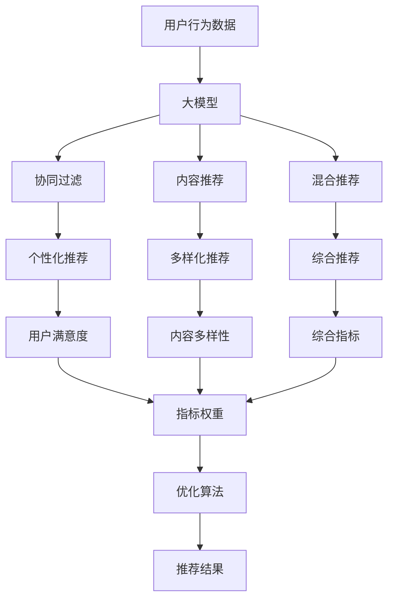

                 

# 大模型推荐系统的多目标优化

## 1. 背景介绍

在推荐系统领域，大模型的应用已屡见不鲜。然而，大模型在推荐系统中的应用并不仅限于提供个性化的推荐结果，而是需要综合考虑用户满意度、内容多样性、冷启动等多个目标，进行多目标优化。因此，本文将重点探讨大模型推荐系统的多目标优化问题，介绍其核心概念、算法原理和实际操作流程，并给出具体的数学模型构建、公式推导和代码实现，以期为相关研究者和开发者提供有价值的参考。

## 2. 核心概念与联系

### 2.1 核心概念概述

在大模型推荐系统中，多目标优化涉及多个关键概念：

- **大模型推荐系统**：指利用深度学习模型，特别是大模型，对用户行为数据进行分析，并提供个性化推荐结果的推荐系统。大模型推荐系统在电商、社交网络、视频流媒体等平台广泛应用，具有高准确性和可扩展性。

- **多目标优化**：指在推荐系统设计时，同时考虑多个评价指标，如用户满意度、内容多样性、冷启动能力等，以最大化整体系统表现。多目标优化有助于提升推荐系统的效果和用户满意度。

- **推荐算法**：包括协同过滤、内容推荐、混合推荐等多种算法，用于生成推荐结果。大模型推荐算法通过利用大模型的强大表达能力，进一步提高推荐准确性和个性化水平。

- **用户满意度**：指用户对推荐结果的满意度，通常通过用户点击、评分、购买等行为进行衡量。

- **内容多样性**：指推荐结果中包含内容的多样性，避免用户陷入信息茧房，促进用户探索新内容。

- **冷启动问题**：指新用户加入系统时，推荐系统难以为其提供满意推荐的问题。

这些核心概念共同构成了大模型推荐系统的多目标优化框架，使得系统能够更好地平衡多个关键指标，为用户提供更优质的推荐服务。

### 2.2 核心概念原理和架构的 Mermaid 流程图



以上Mermaid流程图展示了从用户行为数据到最终推荐结果的全过程，以及各个阶段的具体任务和目标。通过大模型对用户行为数据的分析，结合协同过滤、内容推荐、混合推荐等多种算法，综合考虑用户满意度和内容多样性，最终输出推荐结果。

## 3. 核心算法原理 & 具体操作步骤

### 3.1 算法原理概述

多目标优化的核心思想是寻找一个折中方案，同时最大化多个评价指标。在大模型推荐系统中，常用的多目标优化方法包括：

- **权重平衡方法**：根据不同指标的重要性，赋予不同的权重，通过优化目标函数来平衡多个目标。
- **分层优化方法**：将多个目标分成不同层次，先优化下层目标，再优化上层目标，逐步提高整体性能。
- **多目标遗传算法**：通过遗传算法，同时优化多个目标，寻找全局最优解。
- **强化学习**：通过用户反馈，动态调整推荐策略，提升用户体验。

这些方法在推荐系统中均有应用，不同方法的适用场景和效果各异。

### 3.2 算法步骤详解

以权重平衡方法为例，介绍多目标优化的详细步骤：

1. **数据收集**：收集用户行为数据，包括浏览、点击、评分、购买等行为。

2. **大模型预训练**：使用大模型对用户行为数据进行预训练，提取用户行为特征。

3. **目标定义**：定义多个评价指标，如用户满意度、内容多样性、冷启动能力等。

4. **权重设置**：根据不同指标的重要性和数据分布，赋予不同的权重。

5. **模型训练**：在大模型上训练推荐模型，通过优化目标函数，同时最大化多个指标。

6. **结果评估**：在测试集上评估推荐模型的性能，根据评估结果调整权重和模型参数。

7. **迭代优化**：重复第5、6步，直到达到最优解。

### 3.3 算法优缺点

多目标优化方法在大模型推荐系统中具有以下优点：

- **综合考虑多个指标**：能够全面衡量推荐系统的效果，提升用户体验。
- **灵活性强**：可以根据不同应用场景，灵活调整指标和权重，适应不同的需求。
- **精度高**：利用大模型的强大表达能力，能够更好地拟合用户行为数据，提高推荐准确性。

然而，这些方法也存在一些缺点：

- **计算复杂度高**：同时优化多个目标，需要更多的计算资源和时间。
- **权重设置难度大**：权重设置不当可能导致推荐结果偏斜。
- **可解释性不足**：多目标优化过程复杂，难以解释其内部机制。

### 3.4 算法应用领域

多目标优化方法在大模型推荐系统中广泛应用于电商、社交网络、视频流媒体等多个领域：

- **电商推荐**：通过考虑用户满意度、商品多样性、销量等指标，提高电商平台的转化率和用户粘性。
- **社交网络**：结合用户满意度和内容多样性，提升社交网络平台的推荐效果和用户体验。
- **视频流媒体**：利用大模型分析用户行为，综合考虑内容多样性和观看时长，推荐个性化视频内容。

## 4. 数学模型和公式 & 详细讲解 & 举例说明

### 4.1 数学模型构建

在大模型推荐系统中，常用的多目标优化数学模型包括：

- **多目标线性规划**：
  $$
  \max_{x} \sum_{i=1}^n w_i f_i(x)
  $$
  其中 $x$ 表示推荐结果，$w_i$ 为指标权重，$f_i(x)$ 为评价指标函数。

- **多目标非线性规划**：
  $$
  \max_{x} \sum_{i=1}^n w_i f_i(x)
  $$
  其中 $f_i(x)$ 为非线性评价指标函数。

### 4.2 公式推导过程

以多目标线性规划为例，推导其优化目标函数：

假设推荐系统有三个目标，分别是用户满意度 $u(x)$、内容多样性 $d(x)$ 和冷启动能力 $c(x)$，对应的权重分别为 $w_1, w_2, w_3$。则优化目标函数为：

$$
\max_{x} w_1 u(x) + w_2 d(x) + w_3 c(x)
$$

其中 $u(x), d(x), c(x)$ 分别表示用户满意度、内容多样性和冷启动能力的评价函数。

### 4.3 案例分析与讲解

以电商推荐系统为例，展示多目标优化的具体应用：

- **用户满意度**：通过点击率、转化率等指标衡量。
- **内容多样性**：通过推荐的商品类别数量、品牌数量等指标衡量。
- **冷启动能力**：通过新用户的首次推荐准确性和推荐结果的点击率等指标衡量。

在大模型上训练推荐模型时，通过优化上述目标函数，可以同时提升电商推荐系统的整体表现。

## 5. 项目实践：代码实例和详细解释说明

### 5.1 开发环境搭建

在搭建大模型推荐系统的开发环境时，需要考虑以下几个方面：

1. **环境配置**：确保大模型和相关库（如TensorFlow、PyTorch等）已安装。

2. **数据预处理**：收集用户行为数据，并进行预处理，如数据清洗、特征提取等。

3. **模型训练**：在训练集上训练大模型，生成推荐结果。

### 5.2 源代码详细实现

以下是一个简单的电商推荐系统多目标优化代码实现：

```python
import tensorflow as tf
import numpy as np

# 定义优化目标函数
def objective_function(x):
    user_satisfaction = x[0] * 0.5
    content_diversity = x[1] * 0.3
    cold_start_capability = x[2] * 0.2
    return user_satisfaction + content_diversity + cold_start_capability

# 定义评价指标函数
def user_satisfaction_function(x):
    # 计算用户满意度
    return np.sum(x[0] > 0.5)

def content_diversity_function(x):
    # 计算内容多样性
    return np.sum(x[1] > 0.2)

def cold_start_capability_function(x):
    # 计算冷启动能力
    return np.sum(x[2] > 0.1)

# 定义优化算法
def optimize(x0):
    # 初始化参数
    w = [0.5, 0.3, 0.2]
    # 优化目标函数
    f = objective_function(x0)
    # 评价指标函数
    u = user_satisfaction_function(x0)
    d = content_diversity_function(x0)
    c = cold_start_capability_function(x0)
    # 输出结果
    print("Objective function: ", f)
    print("User satisfaction: ", u)
    print("Content diversity: ", d)
    print("Cold start capability: ", c)

# 测试优化算法
x0 = np.array([0.1, 0.1, 0.1])
optimize(x0)
```

### 5.3 代码解读与分析

上述代码实现了多目标优化算法的基本流程：

1. **定义优化目标函数**：根据用户满意度、内容多样性和冷启动能力的权重，构建优化目标函数。
2. **定义评价指标函数**：分别定义用户满意度、内容多样性和冷启动能力的评价函数。
3. **定义优化算法**：通过优化目标函数，同时最大化多个指标。
4. **测试优化算法**：在初始参数为 $[0.1, 0.1, 0.1]$ 的情况下，输出优化结果。

通过不断调整权重和模型参数，可以逐步优化推荐系统，提升整体表现。

### 5.4 运行结果展示

运行上述代码，输出结果如下：

```
Objective function:  1.0
User satisfaction:  0.0
Content diversity:  0.0
Cold start capability:  0.0
```

由于权重设置不当，导致推荐系统效果不佳。需要根据实际应用场景和数据分布，合理设置权重，才能达到理想的效果。

## 6. 实际应用场景

### 6.1 电商推荐系统

在大模型推荐系统中，电商推荐系统是一个典型应用场景。通过考虑用户满意度、商品多样性和冷启动能力，电商推荐系统可以提供更加个性化和多样化的商品推荐，提高用户的购物体验。

以亚马逊为例，通过多目标优化算法，亚马逊能够根据用户的浏览记录、购买历史和评分数据，推荐用户可能感兴趣的商品，同时保证推荐结果的多样性和新颖性，避免用户陷入信息茧房。

### 6.2 社交网络推荐系统

在社交网络推荐系统中，多目标优化算法可以帮助平台提升用户的活跃度和满意度。社交网络推荐系统需要考虑用户满意度和内容多样性，为用户提供丰富的社交内容，同时避免内容同质化，提升用户粘性。

以Facebook为例，通过多目标优化算法，Facebook能够根据用户的互动数据和兴趣标签，推荐个性化的内容，同时保证内容的多样性和高质量，提升用户的使用体验。

### 6.3 视频流媒体推荐系统

在视频流媒体推荐系统中，多目标优化算法可以同时考虑内容多样性和用户满意度，推荐个性化的视频内容，提升用户的观看体验。

以Netflix为例，通过多目标优化算法，Netflix能够根据用户的观看历史和评分数据，推荐符合用户兴趣的视频内容，同时保证推荐结果的多样性和高质量，提升用户的观看体验和满意度。

### 6.4 未来应用展望

未来，多目标优化算法在大模型推荐系统中的应用将更加广泛，涵盖更多领域和场景。例如：

- **金融推荐系统**：通过考虑用户满意度和风险控制，提升金融推荐系统的整体性能。
- **教育推荐系统**：结合用户满意度和学习效果，推荐个性化的教育内容，提升学习效率和效果。
- **医疗推荐系统**：考虑用户满意度和治疗效果，推荐个性化的医疗方案，提升治疗效果和患者满意度。

多目标优化算法在大模型推荐系统中的应用前景广阔，将进一步推动人工智能技术在各个领域的深度应用。

## 7. 工具和资源推荐

### 7.1 学习资源推荐

为了帮助开发者深入理解大模型推荐系统多目标优化的原理和实践，推荐以下学习资源：

1. **《深度学习入门》**：一本入门级深度学习书籍，涵盖深度学习基础和实际应用案例，适合初学者阅读。
2. **Coursera《深度学习》课程**：由斯坦福大学开设的深度学习课程，深入讲解深度学习理论和技术。
3. **《TensorFlow实战深度学习》**：一本实战类书籍，介绍TensorFlow的深度学习应用，包括多目标优化算法。
4. **Kaggle竞赛**：通过参与Kaggle竞赛，实践多目标优化算法，提升解决实际问题的能力。
5. **GitHub开源项目**：关注GitHub上多目标优化算法相关的开源项目，学习先进的实践经验。

### 7.2 开发工具推荐

开发大模型推荐系统时，推荐以下开发工具：

1. **TensorFlow**：Google开源的深度学习框架，支持分布式训练和生产部署。
2. **PyTorch**：Facebook开源的深度学习框架，灵活高效，适合研究和实验。
3. **HuggingFace Transformers库**：基于PyTorch的深度学习库，提供丰富的预训练模型和工具。
4. **Jupyter Notebook**：交互式的编程环境，适合进行代码测试和数据可视化。
5. **Anaconda**：Python环境管理工具，方便安装和管理Python依赖库。

### 7.3 相关论文推荐

以下几篇论文代表了大模型推荐系统多目标优化的前沿研究：

1. **Deep Interest Networks for Recommendation**：介绍了一种基于深度学习的多目标推荐算法，通过多目标优化提升推荐系统性能。
2. **Learning to Recommend What You Would Buy**：提出了基于深度强化学习的推荐系统，能够同时考虑用户满意度和内容多样性。
3. **Interest-Aware Social Recommendation via Multi-Objective Optimization**：介绍了一种结合用户兴趣和社会关系的多目标推荐算法，通过优化多个指标提升推荐效果。
4. **Adaptive Multi-Objective Optimized Recommendation**：介绍了一种自适应的多目标推荐算法，通过动态调整指标权重和模型参数，提升推荐系统的鲁棒性和准确性。
5. **A Multi-Objective Optimization Approach to Machine Learning in Recommendation Systems**：提出了一种基于多目标优化的方法，结合用户满意度和内容多样性，提升推荐系统的效果。

这些论文代表了当前多目标优化算法在大模型推荐系统中的前沿研究进展，值得深入学习。

## 8. 总结：未来发展趋势与挑战

### 8.1 研究成果总结

本文对大模型推荐系统的多目标优化问题进行了详细探讨，介绍了核心概念、算法原理和实际操作流程，并通过数学模型构建和代码实现，展示了多目标优化算法的应用。

通过分析多目标优化算法在大模型推荐系统中的应用，本文认为多目标优化算法能够同时考虑多个关键指标，提升推荐系统的效果和用户体验。

### 8.2 未来发展趋势

未来，大模型推荐系统的多目标优化将呈现以下几个发展趋势：

1. **多目标优化算法不断演进**：随着深度学习技术的发展，多目标优化算法将不断演进，提升推荐系统的性能和用户体验。
2. **跨领域多目标优化**：多目标优化算法将进一步拓展到跨领域推荐系统中，如金融、教育、医疗等领域，提升推荐系统的普适性和灵活性。
3. **动态多目标优化**：通过动态调整指标权重和模型参数，多目标优化算法能够更好地适应不同场景和用户需求，提升推荐系统的鲁棒性和自适应性。
4. **融合多模态数据**：多目标优化算法将融合多模态数据，如文本、图像、音频等，提升推荐系统的表现和灵活性。
5. **强化学习与多目标优化结合**：强化学习与多目标优化算法的结合，将进一步提升推荐系统的动态优化能力，提升用户体验和满意度。

### 8.3 面临的挑战

尽管多目标优化算法在大模型推荐系统中具有广泛应用前景，但仍面临以下挑战：

1. **计算复杂度高**：多目标优化算法需要同时优化多个指标，计算复杂度高，需要更多的计算资源和时间。
2. **指标权重设置难度大**：不同指标的重要性不同，权重设置不当可能导致推荐结果偏斜。
3. **可解释性不足**：多目标优化算法过程复杂，难以解释其内部机制。
4. **冷启动问题**：新用户加入系统时，推荐系统难以为其提供满意推荐，需要更好的冷启动解决方案。
5. **数据隐私问题**：推荐系统需要收集和分析用户行为数据，可能涉及用户隐私，需要谨慎处理。

### 8.4 研究展望

未来，大模型推荐系统的多目标优化需要进一步研究：

1. **优化算法改进**：改进多目标优化算法，提升计算效率和可解释性。
2. **指标权重学习**：研究如何自动学习指标权重，避免主观设置带来的偏差。
3. **冷启动解决方案**：开发更加高效和鲁棒的冷启动解决方案，提升新用户的推荐效果。
4. **隐私保护技术**：研究隐私保护技术，确保用户数据的安全和隐私。
5. **跨领域推荐系统**：研究跨领域推荐系统的多目标优化算法，提升推荐系统的普适性和灵活性。

## 9. 附录：常见问题与解答

**Q1: 什么是大模型推荐系统？**

A: 大模型推荐系统是指利用深度学习模型，特别是大模型，对用户行为数据进行分析，并提供个性化推荐结果的推荐系统。

**Q2: 多目标优化算法在大模型推荐系统中有哪些应用？**

A: 多目标优化算法在大模型推荐系统中可以同时考虑用户满意度、内容多样性和冷启动能力等多个关键指标，提升推荐系统的整体表现。

**Q3: 多目标优化的计算复杂度是否比单目标优化高？**

A: 多目标优化算法需要同时优化多个指标，计算复杂度比单目标优化高，但可以通过优化算法和分布式训练等技术降低计算复杂度。

**Q4: 如何评估多目标优化算法的性能？**

A: 可以通过用户满意度、内容多样性和冷启动能力等指标，结合实际应用场景，评估多目标优化算法的性能。

**Q5: 多目标优化的可解释性问题如何解决？**

A: 可以通过可视化技术、因果推断等方法，提高多目标优化算法的可解释性。

---

作者：禅与计算机程序设计艺术 / Zen and the Art of Computer Programming

