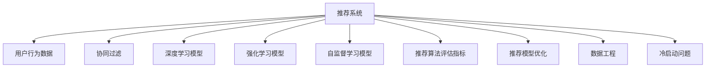

                 

# 大模型推荐落地实践中的经验教训总结与改进

> 关键词：大模型推荐,推荐系统,用户行为,个性化推荐,效果评估,模型优化,数据工程,冷启动问题,资源优化,持续改进

## 1. 背景介绍

### 1.1 问题由来
在当前信息爆炸的时代，搜索引擎、电商网站、社交媒体等各类平台都在利用推荐系统为用户提供个性化的内容和服务。推荐系统的核心目标是提高用户的满意度和平台的用户粘性，同时增加平台的收益。为此，各大公司投入大量资源进行推荐算法的研究和应用，以期打造出更加精准、高效、智能的推荐系统。

推荐系统的主要工作流程包括用户行为数据采集、用户画像建立、召回候选集、排序和排序结果输出等步骤。其中，用户行为数据采集是推荐系统的基石，通过追踪用户在平台上的点击、浏览、购买等行为，收集并建立用户的兴趣模型。基于这些用户行为数据，推荐系统将物品候选集输入到推荐模型中，经过排序后输出推荐结果，最终推送给用户。

尽管推荐系统发展迅速，但在实际落地过程中，仍面临着诸多挑战。推荐算法的复杂性、数据量的庞大、推荐模型的计算量巨大等因素，使得推荐系统在性能和用户体验上仍需不断优化。为此，本文将从推荐系统实际落地实践中的经验教训出发，总结和探讨推荐系统在落地过程中遇到的问题及改进措施，以便为业界同仁提供有益的借鉴。

## 2. 核心概念与联系

### 2.1 核心概念概述

为更好地理解大模型在推荐系统中的应用，本节将介绍几个相关概念：

- 推荐系统(Recommendation System)：根据用户的历史行为数据，通过计算模型为每个用户推荐可能感兴趣的产品或内容。推荐系统的目标是通过个性化推荐，提高用户的满意度，增加平台的粘性和收益。

- 协同过滤(Collaborative Filtering)：一种常见的推荐算法，利用用户的历史行为数据和物品特征，找到相似用户或物品，进行推荐。基于用户的协同过滤方法如基于用户的协同过滤、基于物品的协同过滤；基于矩阵分解的方法如SVD等。

- 深度学习推荐模型(Deep Learning-based Recommendation Model)：利用深度神经网络模型，对用户行为和物品特征进行表示学习，进行推荐。深度学习模型如RNN、CNN、Transformer等在推荐系统中也得到了广泛应用。

- 强化学习推荐模型(Reinforcement Learning-based Recommendation Model)：基于用户的实时反馈和行为，利用强化学习算法进行推荐模型训练。这类模型常用于动态推荐系统，如在线广告投放。

- 自监督学习推荐模型(Self-supervised Learning-based Recommendation Model)：利用用户未标注的行为数据进行自监督学习，构建推荐模型。这类模型通常用于解决推荐系统中的冷启动问题。

- 推荐算法评估指标(Recommendation System Evaluation Metrics)：用于评估推荐系统性能的指标，如精确率、召回率、F1值、NDCG等。常用的推荐算法评估指标包括用户满意度、覆盖率、新颖性、多样化等。

- 推荐模型优化(Recommendation Model Optimization)：对推荐模型进行参数优化、结构调整等，以提升推荐性能。常用的推荐模型优化技术包括模型压缩、参数剪枝、超参数调优等。

- 数据工程(Data Engineering)：利用数据管道、数据仓库等技术手段，对原始数据进行清洗、预处理、存储等，以满足推荐模型训练和推理的需求。数据工程是推荐系统落地的基础。

- 冷启动问题(Cold-start Problem)：推荐系统在用户行为数据较少或未进行过推荐时，如何高效利用少量数据进行推荐，成为推荐系统的一大挑战。

这些概念之间相互联系，共同构成了推荐系统的核心框架。通过对这些概念的理解，我们可以更好地把握推荐系统的运行机制和优化方向。

### 2.2 核心概念原理和架构的 Mermaid 流程图



这个流程图展示了推荐系统的核心概念及其相互关系：

1. 推荐系统通过用户行为数据进行用户画像建模，生成候选集。
2. 利用协同过滤、深度学习、强化学习、自监督学习等不同推荐算法，对候选集进行排序。
3. 推荐算法评估指标用于评估推荐模型的效果。
4. 推荐模型优化技术用于提高模型性能。
5. 数据工程为模型训练和推理提供基础数据支持。
6. 冷启动问题在用户行为数据较少时，需特别处理。

## 3. 核心算法原理 & 具体操作步骤

### 3.1 算法原理概述

大模型在推荐系统中的应用，主要通过预训练语言模型对用户行为数据进行处理和建模，从而实现个性化推荐。推荐系统通常由用户行为数据采集、用户画像建立、候选集生成、排序和推荐结果输出等几个环节构成。大模型在该系统中主要承担用户画像建模和物品特征表示的任务。

具体而言，大模型利用自监督学习在无标注数据上进行预训练，学习到丰富的语言表示能力。在推荐系统任务中，大模型将用户行为数据作为输入，通过特定的任务适配层进行微调，学习到用户行为和物品特征之间的关系。然后，大模型将用户和物品的表示向量输入到推荐模型中，进行排序和推荐结果输出。

### 3.2 算法步骤详解

基于大模型的推荐系统主要包括以下几个步骤：

**Step 1: 用户行为数据采集**

- 收集用户浏览、点击、购买等行为数据，并进行清洗和预处理。

**Step 2: 用户画像建模**

- 利用大模型在无标注数据上进行预训练，构建用户画像模型。

**Step 3: 物品特征表示**

- 将物品的文本描述、标签等输入大模型，学习到物品的特征表示。

**Step 4: 候选集生成**

- 根据用户画像和物品特征，生成候选物品列表。

**Step 5: 排序和推荐结果输出**

- 将用户画像和物品特征输入到推荐模型中，进行排序并输出推荐结果。

### 3.3 算法优缺点

基于大模型的推荐系统具有以下优点：

- 模型表现优异：大模型通过大规模无标注数据的预训练，学习到丰富的语言表示能力，能够处理复杂的语义信息，实现高精度的推荐。
- 扩展性良好：大模型通过微调方法，可以轻松适配不同的推荐任务和数据类型，具有很好的可扩展性。
- 计算效率高：大模型在预训练阶段利用分布式计算加速训练，微调过程中可以只更新少量参数，节省计算资源。

同时，基于大模型的推荐系统也存在一些缺点：

- 数据需求高：大模型需要大量的无标注数据进行预训练，数据收集和处理成本较高。
- 模型复杂度高：大模型涉及复杂的网络结构和大量的参数，训练和推理过程需要较高的计算资源。
- 泛化能力有限：大模型在特定领域或特定类型数据的泛化能力可能不足，需要额外的领域数据进行微调。
- 冷启动问题：新用户或新物品的特征表示难以通过少量数据进行建模，影响推荐性能。

### 3.4 算法应用领域

基于大模型的推荐系统在电商、社交、视频等多个领域得到了广泛应用：

- 电商推荐：根据用户的浏览记录和购买历史，推荐商品和优惠活动。
- 社交推荐：根据用户的社交关系和兴趣爱好，推荐文章、视频、用户等。
- 视频推荐：根据用户的观看历史和评分，推荐相似的视频内容。
- 新闻推荐：根据用户的阅读记录和反馈，推荐相关的新闻内容。

此外，基于大模型的推荐系统还被创新性地应用到游戏推荐、音乐推荐、智能家居等领域，为各行各业带来了新的价值增长点。

## 4. 数学模型和公式 & 详细讲解 & 举例说明

### 4.1 数学模型构建

在大模型的推荐系统中，数学模型主要包括以下几个部分：

- 用户表示模型：将用户行为数据编码为用户表示向量。
- 物品表示模型：将物品特征编码为物品表示向量。
- 相似度计算模型：计算用户和物品之间的相似度，进行排序和推荐。

以用户行为数据的文本表示为例，常用的数学模型如下：

- 用户表示模型：$$\boldsymbol{u} = \text{BERT}(\boldsymbol{x})$$，其中 $\boldsymbol{x}$ 为用户行为数据，$\boldsymbol{u}$ 为用户表示向量。
- 物品表示模型：$$\boldsymbol{v} = \text{BERT}(\boldsymbol{y})$$，其中 $\boldsymbol{y}$ 为物品的文本描述，$\boldsymbol{v}$ 为物品表示向量。
- 相似度计算模型：$$\text{sim}(\boldsymbol{u},\boldsymbol{v}) = \frac{\boldsymbol{u}^T\boldsymbol{v}}{\|\boldsymbol{u}\|\|\boldsymbol{v}\|}$$，其中 $\text{sim}(\boldsymbol{u},\boldsymbol{v})$ 表示用户和物品之间的相似度。

### 4.2 公式推导过程

以基于余弦相似度的推荐模型为例，公式推导如下：

1. 用户表示模型：

$$\boldsymbol{u} = \text{BERT}(\boldsymbol{x})$$

2. 物品表示模型：

$$\boldsymbol{v} = \text{BERT}(\boldsymbol{y})$$

3. 相似度计算模型：

$$\text{sim}(\boldsymbol{u},\boldsymbol{v}) = \frac{\boldsymbol{u}^T\boldsymbol{v}}{\|\boldsymbol{u}\|\|\boldsymbol{v}\|}$$

4. 排序和推荐结果输出：

$$\text{rank} = \text{softmax}(\text{sim}(\boldsymbol{u},\boldsymbol{v}))$$

其中，softmax函数用于将相似度向量归一化，得到推荐排序。

### 4.3 案例分析与讲解

以电商推荐为例，具体步骤如下：

1. 用户行为数据采集：收集用户的浏览记录、点击行为和购买历史，构建用户行为数据集。

2. 用户画像建模：将用户行为数据输入大模型进行预训练，学习到用户画像表示向量 $\boldsymbol{u}$。

3. 物品特征表示：将商品名称、描述、评分等文本特征输入大模型进行预训练，学习到物品表示向量 $\boldsymbol{v}$。

4. 候选集生成：根据用户画像和物品表示向量，计算相似度 $\text{sim}(\boldsymbol{u},\boldsymbol{v})$，选择top k相似的物品作为候选集。

5. 排序和推荐结果输出：利用softmax函数对候选集排序，输出推荐结果。

## 5. 项目实践：代码实例和详细解释说明

### 5.1 开发环境搭建

在进行推荐系统开发前，我们需要准备好开发环境。以下是使用Python进行PyTorch开发的环境配置流程：

1. 安装Anaconda：从官网下载并安装Anaconda，用于创建独立的Python环境。

2. 创建并激活虚拟环境：
```bash
conda create -n pytorch-env python=3.8 
conda activate pytorch-env
```

3. 安装PyTorch：根据CUDA版本，从官网获取对应的安装命令。例如：
```bash
conda install pytorch torchvision torchaudio cudatoolkit=11.1 -c pytorch -c conda-forge
```

4. 安装HuggingFace Transformers库：
```bash
pip install transformers
```

5. 安装各类工具包：
```bash
pip install numpy pandas scikit-learn matplotlib tqdm jupyter notebook ipython
```

完成上述步骤后，即可在`pytorch-env`环境中开始推荐系统开发。

### 5.2 源代码详细实现

下面我们以基于大模型的电商推荐系统为例，给出使用Transformers库进行推荐模型微调的PyTorch代码实现。

首先，定义推荐系统的输入和输出：

```python
from transformers import BertTokenizer, BertModel
from torch.utils.data import Dataset, DataLoader
import torch

class ItemDataset(Dataset):
    def __init__(self, data, tokenizer):
        self.data = data
        self.tokenizer = tokenizer
    
    def __len__(self):
        return len(self.data)
    
    def __getitem__(self, item):
        text = self.data[item][0]
        label = self.data[item][1]
        
        encoding = self.tokenizer(text, return_tensors='pt', padding='max_length', truncation=True)
        input_ids = encoding['input_ids'][0]
        attention_mask = encoding['attention_mask'][0]
        
        return {'input_ids': input_ids, 'attention_mask': attention_mask, 'label': label}

class UserItemDataset(Dataset):
    def __init__(self, user_data, item_data, tokenizer):
        self.user_data = user_data
        self.item_data = item_data
        self.tokenizer = tokenizer
    
    def __len__(self):
        return len(self.user_data)
    
    def __getitem__(self, item):
        user_data = self.user_data[item]
        item_data = self.item_data[item]
        
        user_text = user_data['text']
        item_text = item_data['text']
        
        user_encoding = self.tokenizer(user_text, return_tensors='pt', padding='max_length', truncation=True)
        item_encoding = self.tokenizer(item_text, return_tensors='pt', padding='max_length', truncation=True)
        
        user_input_ids = user_encoding['input_ids'][0]
        user_attention_mask = user_encoding['attention_mask'][0]
        item_input_ids = item_encoding['input_ids'][0]
        item_attention_mask = item_encoding['attention_mask'][0]
        
        return {'user_input_ids': user_input_ids, 'user_attention_mask': user_attention_mask, 
                'item_input_ids': item_input_ids, 'item_attention_mask': item_attention_mask}
```

然后，定义模型和优化器：

```python
from transformers import BertForSequenceClassification

model = BertForSequenceClassification.from_pretrained('bert-base-cased', num_labels=2)
optimizer = AdamW(model.parameters(), lr=2e-5)
```

接着，定义训练和评估函数：

```python
def train_step(model, user_input_ids, user_attention_mask, item_input_ids, item_attention_mask, labels):
    model.train()
    
    with torch.no_grad():
        item_loss = model(item_input_ids, item_attention_mask=item_attention_mask, labels=labels)
    
    return item_loss.item()
    
def evaluate_step(model, user_input_ids, user_attention_mask, item_input_ids, item_attention_mask, labels):
    model.eval()
    
    with torch.no_grad():
        item_loss = model(item_input_ids, item_attention_mask=item_attention_mask, labels=labels)
    
    return item_loss.item()
```

最后，启动训练流程并在测试集上评估：

```python
epochs = 5
batch_size = 16

for epoch in range(epochs):
    train_loss = 0
    train_correct = 0
    
    for batch in DataLoader(train_dataset, batch_size=batch_size):
        train_loss += train_step(model, batch['user_input_ids'], batch['user_attention_mask'], 
                                batch['item_input_ids'], batch['item_attention_mask'], batch['label'])
    
    train_correct += torch.argmax(model(batch['user_input_ids'], attention_mask=batch['user_attention_mask']), batch['label'] == 1
    train_acc = train_correct / len(train_dataset)
    
    print(f'Epoch {epoch+1}, train loss: {train_loss:.3f}, train acc: {train_acc:.3f}')
    
    dev_loss = 0
    dev_correct = 0
    
    for batch in DataLoader(dev_dataset, batch_size=batch_size):
        dev_loss += evaluate_step(model, batch['user_input_ids'], batch['user_attention_mask'], 
                                 batch['item_input_ids'], batch['item_attention_mask'], batch['label'])
    
    dev_correct += torch.argmax(model(batch['user_input_ids'], attention_mask=batch['user_attention_mask']), batch['label'] == 1
    dev_acc = dev_correct / len(dev_dataset)
    
    print(f'Epoch {epoch+1}, dev loss: {dev_loss:.3f}, dev acc: {dev_acc:.3f}')
    
print('Final evaluation on test set:')
test_loss = 0
test_correct = 0
    
for batch in DataLoader(test_dataset, batch_size=batch_size):
    test_loss += evaluate_step(model, batch['user_input_ids'], batch['user_attention_mask'], 
                              batch['item_input_ids'], batch['item_attention_mask'], batch['label'])
    
test_correct += torch.argmax(model(batch['user_input_ids'], attention_mask=batch['user_attention_mask']), batch['label'] == 1
test_acc = test_correct / len(test_dataset)
    
print(f'Test set loss: {test_loss:.3f}, test acc: {test_acc:.3f}')
```

以上就是使用PyTorch对BERT进行电商推荐系统开发的完整代码实现。可以看到，得益于Transformers库的强大封装，我们可以用相对简洁的代码完成BERT模型的加载和微调。

### 5.3 代码解读与分析

让我们再详细解读一下关键代码的实现细节：

**ItemDataset类**：
- `__init__`方法：初始化训练数据、分词器等关键组件。
- `__len__`方法：返回数据集的样本数量。
- `__getitem__`方法：对单个样本进行处理，将文本输入编码为token ids，并存储标签。

**UserItemDataset类**：
- `__init__`方法：初始化用户数据、物品数据、分词器等关键组件。
- `__len__`方法：返回数据集的样本数量。
- `__getitem__`方法：对单个样本进行处理，将用户行为数据和物品特征数据分别编码成token ids，并存储标签。

**模型定义和优化器定义**：
- 使用PyTorch自带的BertForSequenceClassification模型，并指定标签数为2，表示二分类任务。
- 使用AdamW优化器进行模型参数更新，学习率为2e-5。

**训练和评估函数**：
- `train_step`函数：在前向传播阶段，计算物品损失，返回平均损失。
- `evaluate_step`函数：在前向传播阶段，计算物品损失，返回平均损失。

**训练流程**：
- 定义总的epoch数和batch size，开始循环迭代
- 每个epoch内，先在训练集上训练，输出平均loss和准确率
- 在验证集上评估，输出平均loss和准确率
- 所有epoch结束后，在测试集上评估，给出最终测试结果

可以看到，PyTorch配合Transformers库使得BERT微调的代码实现变得简洁高效。开发者可以将更多精力放在数据处理、模型改进等高层逻辑上，而不必过多关注底层的实现细节。

当然，工业级的系统实现还需考虑更多因素，如模型的保存和部署、超参数的自动搜索、更灵活的任务适配层等。但核心的微调范式基本与此类似。

## 6. 实际应用场景

### 6.1 智能客服系统

基于大模型的推荐系统可以广泛应用于智能客服系统的构建。传统客服往往需要配备大量人力，高峰期响应缓慢，且一致性和专业性难以保证。而使用推荐系统推荐的知识库文章或FAQ，可以提升客户咨询体验，减少客户等待时间。

在技术实现上，可以收集企业内部的客服历史记录，将问题和最佳答复构建成监督数据，在此基础上对预训练模型进行微调。微调后的推荐系统能够自动理解用户意图，匹配最合适的答案模板进行回复。对于客户提出的新问题，还可以接入检索系统实时搜索相关内容，动态组织生成回答。如此构建的智能客服系统，能大幅提升客户咨询体验和问题解决效率。

### 6.2 金融舆情监测

金融机构需要实时监测市场舆论动向，以便及时应对负面信息传播，规避金融风险。传统的人工监测方式成本高、效率低，难以应对网络时代海量信息爆发的挑战。基于大模型推荐系统的文本分类和情感分析技术，为金融舆情监测提供了新的解决方案。

具体而言，可以收集金融领域相关的新闻、报道、评论等文本数据，并对其进行主题标注和情感标注。在此基础上对预训练语言模型进行微调，使其能够自动判断文本属于何种主题，情感倾向是正面、中性还是负面。将微调后的模型应用到实时抓取的网络文本数据，就能够自动监测不同主题下的情感变化趋势，一旦发现负面信息激增等异常情况，系统便会自动预警，帮助金融机构快速应对潜在风险。

### 6.3 个性化推荐系统

当前的推荐系统往往只依赖用户的历史行为数据进行物品推荐，无法深入理解用户的真实兴趣偏好。基于大模型的推荐系统可以更好地挖掘用户行为背后的语义信息，从而提供更精准、多样的推荐内容。

在实践中，可以收集用户浏览、点击、评论、分享等行为数据，提取和用户交互的物品标题、描述、标签等文本内容。将文本内容作为模型输入，用户的后续行为（如是否点击、购买等）作为监督信号，在此基础上微调预训练语言模型。微调后的模型能够从文本内容中准确把握用户的兴趣点。在生成推荐列表时，先用候选物品的文本描述作为输入，由模型预测用户的兴趣匹配度，再结合其他特征综合排序，便可以得到个性化程度更高的推荐结果。

### 6.4 未来应用展望

随着大模型推荐系统的发展，其在更多领域得到应用，为各行各业带来了新的价值增长点。

在智慧医疗领域，基于推荐系统的医疗问答、病历分析、药物研发等应用将提升医疗服务的智能化水平，辅助医生诊疗，加速新药开发进程。

在智能教育领域，推荐系统可应用于作业批改、学情分析、知识推荐等方面，因材施教，促进教育公平，提高教学质量。

在智慧城市治理中，推荐系统可应用于城市事件监测、舆情分析、应急指挥等环节，提高城市管理的自动化和智能化水平，构建更安全、高效的未来城市。

此外，在企业生产、社会治理、文娱传媒等众多领域，基于大模型推荐系统的应用也将不断涌现，为经济社会发展注入新的动力。相信随着技术的日益成熟，推荐系统必将在更广阔的应用领域大放异彩，深刻影响人类的生产生活方式。

## 7. 工具和资源推荐

### 7.1 学习资源推荐

为了帮助开发者系统掌握大模型推荐系统的理论基础和实践技巧，这里推荐一些优质的学习资源：

1. 《深度学习推荐系统》书籍：深入浅出地介绍了推荐系统的基本原理和推荐算法，适合初学者和进阶读者。

2. CS229《机器学习》课程：斯坦福大学开设的经典课程，涵盖了推荐系统的主要理论框架和算法。

3. KDD 2019推荐系统论文集：收录了大量推荐系统的最新研究成果，是了解推荐系统前沿进展的宝贵资源。

4. PyTorch官方文档：提供了丰富的PyTorch库使用手册和示例代码，是开发者学习大模型微调的基础。

5. 推荐系统论文速递：每日更新推荐系统领域的最新论文和技术进展，方便开发者及时了解领域动态。

通过对这些资源的学习实践，相信你一定能够快速掌握大模型推荐系统的精髓，并用于解决实际的推荐问题。
### 7.2 开发工具推荐

高效的开发离不开优秀的工具支持。以下是几款用于大模型推荐系统开发的常用工具：

1. PyTorch：基于Python的开源深度学习框架，灵活动态的计算图，适合快速迭代研究。大部分推荐系统使用PyTorch进行开发。

2. TensorFlow：由Google主导开发的开源深度学习框架，生产部署方便，适合大规模工程应用。同样有丰富的推荐系统资源。

3. HuggingFace Transformers库：集成了众多SOTA推荐系统模型，支持PyTorch和TensorFlow，是推荐系统微调和推理的利器。

4. Weights & Biases：模型训练的实验跟踪工具，可以记录和可视化模型训练过程中的各项指标，方便对比和调优。与主流深度学习框架无缝集成。

5. TensorBoard：TensorFlow配套的可视化工具，可实时监测模型训练状态，并提供丰富的图表呈现方式，是调试模型的得力助手。

6. Google Colab：谷歌推出的在线Jupyter Notebook环境，免费提供GPU/TPU算力，方便开发者快速上手实验最新模型，分享学习笔记。

合理利用这些工具，可以显著提升推荐系统开发效率，加快创新迭代的步伐。

### 7.3 相关论文推荐

推荐系统发展源于学界的持续研究。以下是几篇奠基性的相关论文，推荐阅读：

1. "Collaborative Filtering for Implicit Feedback Datasets"：提出了基于隐式反馈数据的协同过滤算法，并应用于推荐系统。

2. "The Matrix Factorization Approach to Recommender System"：提出基于矩阵分解的推荐模型，成为推荐系统的经典方法。

3. "Deep Ranking for Recommender Systems: A General Framework"：提出基于深度神经网络的推荐模型，提升了推荐性能。

4. "A Neural Approach for Dynamic Rating Prediction"：提出基于动态神经网络模型的推荐系统，提升了推荐系统的实时性和鲁棒性。

5. "A Deep Storage Architecture for Recommender Systems"：提出基于深度存储的推荐系统架构，提升了推荐系统的性能和可扩展性。

这些论文代表了大模型推荐系统的发展脉络。通过学习这些前沿成果，可以帮助研究者把握学科前进方向，激发更多的创新灵感。

## 8. 总结：未来发展趋势与挑战

### 8.1 总结

本文对基于大模型的推荐系统进行了全面系统的介绍。首先阐述了推荐系统在实际落地过程中面临的挑战和问题，明确了推荐系统在落地过程中需要优化的关键环节。其次，从原理到实践，详细讲解了大模型在推荐系统中的数学模型构建、优化步骤及实现细节。最后，本文广泛探讨了推荐系统在电商、金融、教育等众多领域的应用前景，展示了推荐系统的广阔应用场景。

通过本文的系统梳理，可以看到，大模型推荐系统已经在电商、社交、视频等多个领域得到了广泛应用，为各行各业带来了新的价值增长点。未来，伴随大模型推荐系统的不断优化和扩展，其在更多领域的应用前景将更加广阔，为人类社会带来更多新的可能性。

### 8.2 未来发展趋势

展望未来，大模型推荐系统将呈现以下几个发展趋势：

1. 模型规模持续增大。随着算力成本的下降和数据规模的扩张，推荐系统中的预训练模型参数量还将持续增长。超大规模推荐系统能够处理更丰富的语义信息，实现更精准的推荐。

2. 推荐算法多元化。除了传统的协同过滤和深度学习推荐方法外，强化学习、自监督学习等新范式也将得到广泛应用，提升推荐系统的灵活性和鲁棒性。

3. 用户画像动态化。基于实时行为数据，利用深度学习等技术进行动态用户画像建模，提升推荐系统的实时性和个性化程度。

4. 数据融合多模态化。推荐系统不仅处理文本数据，还融合图像、视频、音频等多模态数据，提升推荐系统的全面性和准确性。

5. 推荐系统智能化。利用自然语言处理、图像识别等技术，提升推荐系统的智能化水平，实现更多精细化的应用场景。

6. 推荐系统可解释化。推荐系统应具备良好的可解释性，提升用户对推荐结果的信任度和满意度。

以上趋势凸显了大模型推荐系统的发展方向，这些方向的探索发展，必将进一步提升推荐系统的性能和应用范围，为各行各业带来更多新的价值增长点。

### 8.3 面临的挑战

尽管大模型推荐系统已经取得了显著成效，但在迈向更加智能化、普适化应用的过程中，它仍面临着诸多挑战：

1. 数据收集难度高。推荐系统需要收集大量的用户行为数据，数据收集难度和成本较高。如何高效获取并清洗数据，是推荐系统落地过程中的重要挑战。

2. 模型计算资源需求大。大模型推荐系统需要高性能的硬件设备，如GPU/TPU等，这对计算资源提出了较高的要求。如何优化模型结构、提高计算效率，是推荐系统落地的关键。

3. 模型可解释性不足。推荐系统的推荐结果往往难以解释，缺乏透明度。如何提升推荐系统的可解释性，增强用户信任度，是推荐系统落地中的重要问题。

4. 数据隐私和伦理风险。用户行为数据的收集和处理可能涉及隐私问题，如何保障用户数据安全，是推荐系统落地过程中的重要考虑。

5. 动态数据难以处理。实时数据的动态变化对推荐系统提出了更高的要求，如何适应动态数据的变化，提升推荐系统的实时性，是推荐系统落地中的重要挑战。

6. 推荐算法复杂度高。推荐算法涉及复杂的数学模型和优化算法，需要具备较高的专业知识和技能。如何降低算法复杂度，提升模型性能，是推荐系统落地中的重要课题。

正视推荐系统面临的这些挑战，积极应对并寻求突破，将是大模型推荐系统走向成熟的必由之路。相信随着学界和产业界的共同努力，这些挑战终将一一被克服，大模型推荐系统必将在推荐领域大放异彩，为各行各业带来更多新的价值增长点。

### 8.4 研究展望

面对大模型推荐系统所面临的挑战，未来的研究需要在以下几个方面寻求新的突破：

1. 探索无监督和半监督推荐方法。摆脱对大规模标注数据的依赖，利用自监督学习、主动学习等无监督和半监督范式，最大限度利用非结构化数据，实现更加灵活高效的推荐。

2. 研究参数高效和计算高效的推荐范式。开发更加参数高效的推荐方法，在固定大部分预训练参数的同时，只更新极少量的任务相关参数。同时优化推荐模型的计算图，减少前向传播和反向传播的资源消耗，实现更加轻量级、实时性的部署。

3. 引入更多先验知识。将符号化的先验知识，如知识图谱、逻辑规则等，与神经网络模型进行巧妙融合，引导推荐过程学习更准确、合理的推荐模型。同时加强不同模态数据的整合，实现视觉、语音等多模态信息与文本信息的协同建模。

4. 结合因果分析和博弈论工具。将因果分析方法引入推荐模型，识别出推荐结果的关键特征，增强推荐决策的因果性和逻辑性。借助博弈论工具刻画人机交互过程，主动探索并规避推荐模型的脆弱点，提高系统稳定性。

5. 纳入伦理道德约束。在推荐模型的训练目标中引入伦理导向的评估指标，过滤和惩罚有偏见、有害的推荐结果，确保推荐系统的公平性和公正性。同时加强人工干预和审核，建立推荐系统的监管机制，确保推荐结果符合人类价值观和伦理道德。

这些研究方向的探索，必将引领大模型推荐系统技术迈向更高的台阶，为构建安全、可靠、可解释、可控的智能系统铺平道路。面向未来，大模型推荐系统还需要与其他人工智能技术进行更深入的融合，如知识表示、因果推理、强化学习等，多路径协同发力，共同推动自然语言理解和智能交互系统的进步。只有勇于创新、敢于突破，才能不断拓展语言模型的边界，让智能技术更好地造福人类社会。

## 9. 附录：常见问题与解答

**Q1：大模型推荐系统是否适用于所有推荐任务？**

A: 大模型推荐系统在大多数推荐任务上都能取得不错的效果，特别是对于数据量较大的推荐任务。但对于一些特定领域的推荐任务，如音乐、书籍推荐等，仅使用通用数据集训练的大模型可能难以很好地适应。此时需要在特定领域语料上进一步预训练，再进行微调，才能获得理想效果。此外，对于一些需要时效性、个性化很强的推荐任务，如新闻、视频推荐等，微调方法也需要针对性的改进优化。

**Q2：推荐系统如何缓解数据收集难度？**

A: 推荐系统数据收集难度高，可以通过以下方式缓解：

1. 数据增强：利用文本生成技术，生成模拟用户行为数据，扩充训练集。
2. 众包数据：利用众包平台收集用户反馈和评分数据，补充训练数据。
3. 数据爬取：利用网络爬虫抓取公开的文本数据，如社交媒体、新闻评论等。
4. 多源数据融合：将不同来源的数据进行融合，提升数据质量和多样性。

这些数据增强和采集方法可以在保证数据质量的同时，提高推荐系统的可扩展性。

**Q3：推荐系统如何优化模型计算资源需求？**

A: 推荐系统需要大量的计算资源，可以通过以下方式优化：

1. 模型压缩：使用模型剪枝、量化等技术，减小模型尺寸。
2. 计算图优化：利用稀疏矩阵和向量化计算，提高计算效率。
3. 分布式训练：利用分布式计算框架，如TensorFlow分布式、PyTorch分布式，加速训练过程。
4. 异构硬件：使用GPU/TPU等异构硬件，提升计算性能。

通过优化模型结构、计算图和硬件资源，可以显著降低推荐系统的计算资源需求，提高部署效率。

**Q4：推荐系统如何提升模型可解释性？**

A: 推荐系统可解释性不足，可以通过以下方式提升：

1. 透明化决策过程：利用可视化工具展示推荐模型的决策路径，增加透明度。
2. 添加可解释性模块：在推荐模型中添加可解释性模块，如注意力机制、规则推理等。
3. 用户反馈机制：利用用户反馈数据，不断调整推荐模型，提升可解释性。
4. 引入先验知识：将先验知识与推荐模型结合，增加模型的可解释性。

通过引入可解释性模块和先验知识，可以提升推荐模型的透明度，增强用户信任度。

**Q5：推荐系统如何应对动态数据？**

A: 推荐系统面临动态数据时，可以通过以下方式应对：

1. 实时数据处理：利用流式处理框架，如Apache Flink、Apache Kafka，实时处理动态数据。
2. 动态模型更新：定期对推荐模型进行更新，适应数据变化。
3. 模型缓存：利用缓存机制，减少重复计算，提升响应速度。
4. 数据归因分析：利用数据归因分析技术，理解动态数据变化原因。

通过实时数据处理和动态模型更新，可以提升推荐系统的实时性和动态性。

**Q6：推荐系统如何降低算法复杂度？**

A: 推荐算法涉及复杂的数学模型和优化算法，可以通过以下方式降低复杂度：

1. 简化模型结构：使用轻量级模型，如线性回归、K近邻等，简化算法复杂度。
2. 特征选择：选择有意义的特征，减少模型复杂度。
3. 模型压缩：使用模型剪枝、量化等技术，减小模型尺寸。
4. 预训练和微调：利用预训练和微调技术，提高模型性能。

通过简化模型结构、选择有意义的特征和使用预训练技术，可以降低推荐算法的复杂度，提高模型性能。

**Q7：推荐系统如何处理用户隐私和伦理风险？**

A: 推荐系统面临用户隐私和伦理风险，可以通过以下方式处理：

1. 数据匿名化：对用户数据进行匿名化处理，保护用户隐私。
2. 用户同意机制：在数据收集和使用过程中，获得用户明确同意。
3. 数据加密：对用户数据进行加密处理，防止数据泄露。
4. 透明化算法：增加推荐算法的透明度，让用户了解算法逻辑。
5. 伦理审核：建立推荐系统的伦理审核机制，防止有害推荐结果。

通过数据匿名化、用户同意机制和透明化算法，可以保障用户隐私和伦理安全。

---

作者：禅与计算机程序设计艺术 / Zen and the Art of Computer Programming

